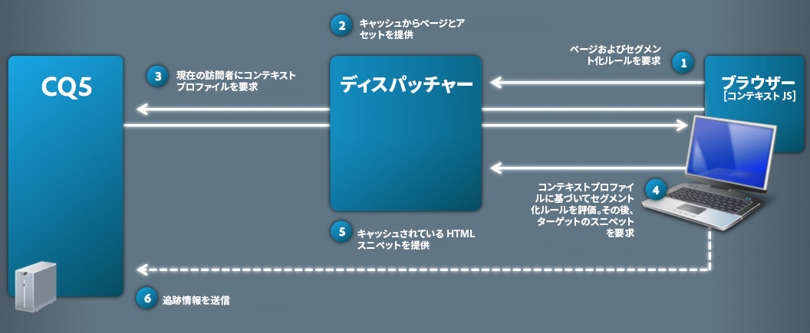
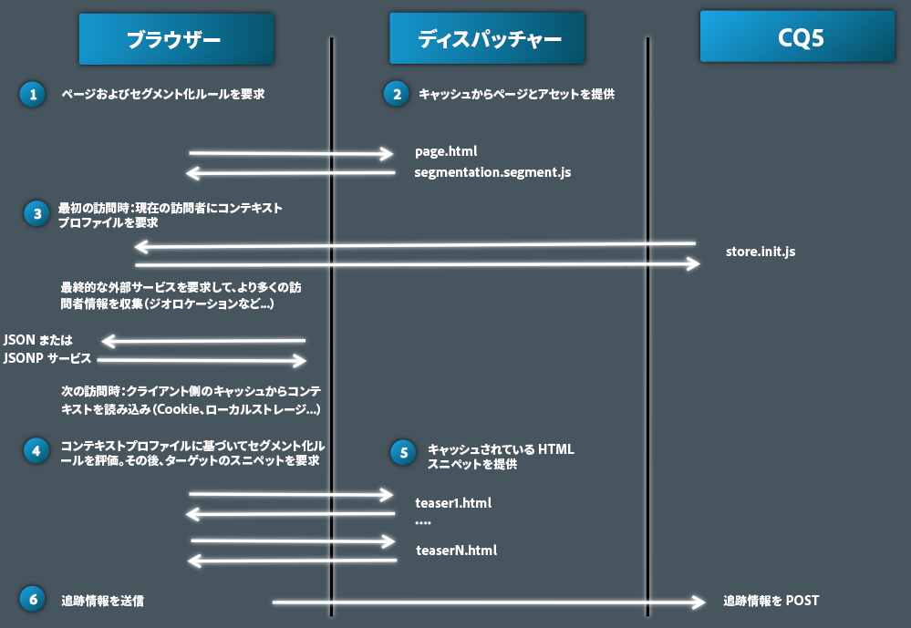
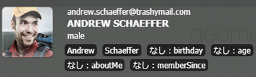
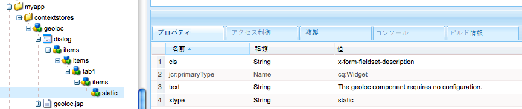
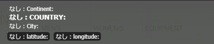

# ClientContext の詳細{#client-context-in-detail}

>[!NOTE]
>
>ClientContext は、ContextHub に変更されました。詳しくは、[関連ドキュメント](/help/sites-developing/contexthub.md)を参照してください。

ClientContext はユーザーデータを動的にまとめたコレクションを表します。このデータに基づいて、特定の状況で Web ページ上に表示するコンテンツを決定できます（コンテンツのターゲティング）。このデータは、Web サイト分析や、ページ上のあらゆる JavaScript にも使用できます。

ClientContext は、主として次の要素で構成されます。

* ユーザーデータを格納するセッションストア。
* ユーザーデータを表示し、ユーザーエクスペリエンスをシミュレートするツールを提供する UI。
* セッションストアとやり取りするための [JavaScript API](/help/sites-developing/ccjsapi.md)。

スタンドアロンのセッションストアを作成して ClientContext に追加するか、コンテキストストアコンポーネントに関連付けられたセッションストアを作成するために、すぐに使用可能なコンテキストストアコンポーネントが AEM によっていくつかインストールされています。これらのコンポーネントは、作成するコンポーネントの基礎として使用できます。

For information about opening Client Context, configuring the information that it displays, and simulating the user experience, see [Client Context](/help/sites-administering/client-context.md).

## セッションストア {#session-stores}

ClientContext には、ユーザーデータを格納する様々なセッションストアが含まれます。ストアデータは次のソースから得られます。

* クライアント Web ブラウザー
* サーバー（サードパーティソースからの情報の保存については [JSONP ストア](/help/sites-administering/client-context.md#main-pars-variable-8)を参照）

ClientContext フレームワークが提供する [JavaScript API](/help/sites-developing/ccjsapi.md) は、ユーザーデータの読み取りおよび書き込みや、ストアイベントのリッスンおよび対処のためのセッションストアとのやり取りに使用できます。コンテンツターゲティングなどに使用するユーザーデータ用のセッションストアを作成することもできます。

セッションストアのデータはクライアント上に残ります。ClientContext はデータをサーバーに書き戻しません。データをサーバーに送信するには、フォームを使用するか、カスタム JavaScript を作成してください。

各セッションストアは、プロパティと値のペアのコレクションです。 セッションストアは、（あらゆる種類の）データのコレクション、すなわちデザイナーや開発者が決める概念的意味を表します。次の例のjavascriptコードは、セッションストアに含まれるプロファイルデータを表すオブジェクトを定義します。

```
{
  age: 20,
  authorizableId: "aparker@geometrixx.info",
  birthday: "27 Feb 1992",
  email: "aparker@geometrixx.info",
  formattedName: "Alison Parker",
  gender: "female",
  path: "/home/users/geometrixx/aparker@geometrixx.info/profile"
}
```

セッションストアは、ブラウザーセッションをまたがって保持することも、そのストアが作成されたブラウザーセッションに対してのみ持続させることもできます。

>[!NOTE]
>
>ストアの保持には、ブラウザーストレージまたは cookie（`SessionPersistence` cookie）を使用します。ブラウザーストレージのほうが一般的です。
>
>ブラウザーを閉じて再度開いたときに、保持されているストアの値を使用してセッションストアを読み込むことができます。古い値を削除するには、ブラウザーキャッシュのクリアが必要です。

### コンテキストストアコンポーネント {#context-store-components}

コンテキストストアコンポーネントは、ClientContext に追加できる CQ コンポーネントです。一般的に、コンテキストストアコンポーネントは、関連付けられているセッションストアのデータを表示します。ただし、コンテキストストアコンポーネントが表示する情報は、セッションストアのデータに限定されません。

コンテキストストアコンポーネントには、次のアイテムを含めることができます。

* ClientContext での表示を定義する JSP スクリプト。
* サイドキックにコンポーネントを一覧表示するためのプロパティ。
* コンポーネントインスタンスを設定するための編集ダイアログ。
* セッションストアを初期化する JavaScript。

コンテキストストアに追加できる、インストール済みのコンテキストストアコンポーネントについては、[使用可能な ClientContext コンポーネント](/help/sites-administering/client-context.md#available-client-context-components)を参照してください。

>[!NOTE]
>
>ページデータは、ClientContext のデフォルトのコンポーネントではなくなりました。必要に応じて、ClientContext を編集し、**汎用ストアのプロパティ**&#x200B;コンポーネントを追加して、**ストア**&#x200B;を `pagedata` として定義するように設定することにより、ページデータを追加できます。

### ターゲット設定されたコンテンツの配信 {#targeted-content-delivery}

[ターゲット設定されたコンテンツ](/help/sites-authoring/content-targeting-touch.md)の配信にはプロファイル情報も使用します。

 

## ページへの ClientContext の追加 {#adding-client-context-to-a-page}

ClientContext を有効にするには、ClientContext コンポーネントを Web ページの body セクションに含めます。The path of the Client Context component node is `/libs/cq/personalization/components/clientcontext`. このコンポーネントを含めるには、次のコードをページコンポーネントの JSP ファイルに追加します。場所は、ページの `body` 要素のすぐ下です。

```java
<cq:include path="clientcontext" resourceType="cq/personalization/components/clientcontext"/>
```

ClientContext コンポーネントによって、ClientContext を実装するクライアントライブラリをページが読み込みます。

* ClientContext JavaScript API。
* セッションストア、イベント管理などをサポートする ClientContext フレームワーク。
* 定義されているセグメント。
* ClientContext に追加されているコンテキストストアコンポーネントごとに生成される init.js スクリプト。
* （オーサーインスタンスのみ）ClientContext UI。

ClientContext UI は、オーサーインスタンス上でのみ使用可能です。

## ClientContext の拡張 {#extending-client-context}

ClientContext を拡張するには、次のようなセッションストアを作成し、オプションでストアデータを表示します。

* コンテンツターゲティングおよび Web 分析に必要なユーザーデータ用のセッションストアを作成します。
* コンテキストストアコンポーネントを作成して、管理者が関連付けられたセッションストアを設定したり、テスト目的で ClientContext にストアデータを表示したりできるようにします。

>[!NOTE]
>
>データを提供できる `JSONP` サービスがある（または作成する）場合は、`JSONP` コンテキストストアコンポーネントを使用して、その JSONP サービスにマップするだけです。JSONP サービスがセッションストアを処理します。

### セッションストアの作成 {#creating-a-session-store}

ClientContext に追加または ClientContext から取得する必要があるデータ用のセッションストアを作成します。一般的に、セッションストアを作成するには、次の手順を実行します。

1. `categories` プロパティの値が `personalization.stores.kernel` のクライアントライブラリフォルダーを作成します。ClientContext は、このカテゴリのクライアントライブラリを自動的に読み込みます。

1. `personalization.core.kernel` クライアントライブラリフォルダーに対して依存関係を持つように、クライアントライブラリフォルダーを設定します。`personalization.core.kernel` クライアントライブラリは ClientContext JavaScript API を提供します。

1. セッションストアを作成して初期化する JavaScript を追加します。

この JavaScript を personalization.stores.kernel クライアントライブラリに含めると、ClientContext フレームワークが読み込まれたときにストアが作成されます。

>[!NOTE]
>
>コンテキストストアコンポーネントの一部としてセッションストアを作成する場合は、代わりに JavaScript をコンポーネントの init.js.jsp ファイル内に配置できます。この場合は、コンポーネントが ClientContext に追加された場合にのみセッションストアが作成されます。

#### セッションストアのタイプ {#types-of-session-stores}

セッションストアは、ブラウザーセッション中に作成され、使用できるか、ブラウザーストレージまたは cookie に保持されます。ClientContext JavaScript API によって、次の 2 つのタイプのデータストアを表すクラスが定義されます。

* ` [CQ_Analytics.SessionStore](/help/sites-developing/ccjsapi.md#cq-analytics-sessionstore)`:これらのオブジェクトはページDOMにのみ存在します。 データはページが存続する間、作成され、保持されます。
* ` [CQ_Analytics.PerstistedSessionStore](/help/sites-developing/ccjsapi.md#cq-analytics-persistedsessionstore)`：このタイプのオブジェクトはページ DOM 内に存在し、ブラウザーストレージまたは cookie に保持されます。データは、ページおよびユーザーセッションをまたがって使用できます。

また、JSONデータまたはJSONPデータの格納に特化した次のクラスの拡張も提供します。

* セッション限定オブジェクト：[CQ_Analytics.JSONStore](/help/sites-developing/ccjsapi.md#cq-analytics-jsonstore) および [CQ_Analytics.JSONPStore](/help/sites-developing/ccjsapi.md#cq-analytics-jsonpstore)。

* 永続オブジェクト：[CQ_Analytics.PersistedJSONStore](/help/sites-developing/ccjsapi.md#cq-analytics-persistedjsonstore) および [CQ_Analytics.PersistedJSONPStore](/help/sites-developing/ccjsapi.md#cq-analyics-persistedjsonpstore)。

#### セッションストアオブジェクトの作成 {#creating-the-session-store-object}

クライアントライブラリフォルダーの JavaScript によってセッションストアを作成し、初期化します。その後、Context Store Manager を使用して、セッションストアを登録する必要があります。The following example creates and registers a [CQ_Analytics.SessionStore](/help/sites-developing/ccjsapi.md#cq-analytics-sessionstore) object.

```
//Create the session store
if (!CQ_Analytics.MyStore) {
    CQ_Analytics.MyStore = new CQ_Analytics.SessionStore();
    CQ_Analytics.MyStore.STOREKEY = "MYSTORE";
    CQ_Analytics.MyStore.STORENAME = "mystore";
    CQ_Analytics.MyStore.data={};
}
//register the session store
if (CQ_Analytics.ClientContextMgr){
    CQ_Analytics.ClientContextMgr.register(CQ_Analytics.MyStore)
}
```

For storing JSON data, the following example creates and registers a [CQ_Analytics.JSONStore](/help/sites-developing/ccjsapi.md#cq-analytics-sessionstore) object.

```
if (!CQ_Analytics.myJSONStore) {
    CQ_Analytics.myJSONStore = CQ_Analytics.JSONStore.registerNewInstance("myjsonstore",{});
}
```

### コンテキストストアコンポーネントの作成 {#creating-a-context-store-component}

ClientContext でセッションストアデータをレンダリングするには、コンテキストストアコンポーネントを作成します。コンテキストストアコンポーネントを作成したら、ClientContext にドラッグして、セッションストアのデータをレンダリングできます。コンテキストストアコンポーネントは、次のアイテムで構成されます。

* データをレンダリングするための JSP スクリプト。
* 編集ダイアログ。
* セッションストアを初期化するための JSP スクリプト。
* （オプション）セッションストアを作成するクライアントライブラリフォルダー。コンテキストストアコンポーネントが既存のセッションストアを使用する場合、クライアントライブラリフォルダーを含める必要はありません。

#### 提供されているコンテキストストアコンポーネントの拡張 {#extending-the-provided-context-store-components}

AEM が提供する genericstore および genericstoreproperties コンテキストストアコンポーネントは拡張できます。ストアデータの構造によって、拡張するコンポーネントが決まります。

* プロパティと値のペア：`GenericStoreProperties` コンポーネントを拡張します。このコンポーネントは、プロパティと値のペアのストアを自動的にレンダリングします。次のインタラクションポイントが提供されています。

   * `prolog.jsp` と `epilog.jsp`：コンポーネントをレンダリングする前または後にサーバー側ロジックを追加できるコンポーネントインタラクション。

* 複合データ：`GenericStore` コンポーネントを拡張します。セッションストアには、コンポーネントをレンダリングする必要があるたびに呼び出される「レンダラー」メソッドが必要になります。レンダラー関数は、次の 2 つのパラメーターと一緒に呼び出されます。

   * `@param {String} store`
レンダリングするストア

   * `@param {String} divId`ストアをレンダリングする必要がある div の ID。

>[!NOTE]
>
>すべての ClientContext コンポーネントは、汎用ストアコンポーネントまたは汎用ストアのプロパティコンポーネントの拡張です。Several examples are installed in the `/libs/cq/personalization/components/contextstores` folder.

#### サイドキックでの表示の設定 {#configuring-the-appearance-in-sidekick}

ClientContext の編集時、コンテキストストアコンポーネントがサイドキックに表示されます。すべてのコンポーネントと同様に、ClientContext コンポーネントの `componentGroup` プロパティと `jcr:title` プロパティによって、コンポーネントのグループと名前が決まります。

All components that have a `componentGroup` property value of `Client Context` appear in Sidekick by default. If you use a different value for the `componentGroup` property, you must manually add the component to Sidekick using Design mode.

#### コンテキストストアコンポーネントインスタンス {#context-store-component-instances}

When you add a context store component to Client Context, a node that represents the component instance is created below `/etc/clientcontext/default/content/jcr:content/stores`. このノードには、コンポーネントの編集ダイアログを使用して設定するプロパティ値が格納されます。

ClientContext が初期化されると、これらのノードが処理されます。

#### 関連付けられたセッションストアの初期化 {#initializing-the-associated-session-store}

init.js.jsp ファイルをコンポーネントに追加して、コンテキストストアコンポーネントが使用するセッションストアを初期化する JavaScript コードを生成します。例えば、初期化スクリプトを使用して、コンポーネントの設定プロパティを取得し、それらを使用してセッションストアを設定します。

生成された JavaScript は、オーサーインスタンスおよびパブリッシュインスタンス上でのページの読み込み時に ClientContext が初期化されると、ページに追加されます。この JSP は、コンテキストストアコンポーネントインスタンスが読み込まれ、レンダリングされる前に実行されます。

The code must set the mime type of the file to `text/javascript`, or it is not executed.

>[!CAUTION]
>
>init.js.jsp スクリプトは、オーサーインスタンスおよびパブリッシュインスタンス上で実行されますが、コンテキストストアコンポーネントが ClientContext に追加されている場合だけです。

次の手順を実行すると、init.js.jsp スクリプトファイルが作成され、適切な MIME タイプを設定するコードが追加されます。ストアの初期化を実行するコードがその後に追加されます。

1. コンテキストストアコンポーネントノードを右クリックし、作成／ファイルを作成をクリックします。
1. 「名前」フィールドに「`init.js.jsp`」と入力して「OK」をクリックします。
1. ページの上部に次のコードを追加して、「すべて保存」をクリックします。

   ```java
   <%@page contentType="text/javascript" %>
   ```

### genericstoreproperties コンポーネントのセッションストアデータのレンダリング {#rendering-session-store-data-for-genericstoreproperties-components}

一貫性ある形式を使用して、ClientContext にセッションストアデータを表示します。

#### プロパティデータの表示 {#displaying-property-data}

パーソナライズタグライブラリが、セッションストアのプロパティの値を表示する `personalization:storePropertyTag` タグを提供します。このタグを使用するには、JSP ファイルに次のコード行を含めます。

```xml
<%@taglib prefix="personalization" uri="https://www.day.com/taglibs/cq/personalization/1.0" %>
```

タグの形式は次のとおりです。

```xml
<personalization:storePropertyTag propertyName="property_name" store="session_store_name"/>
```

`propertyName` 属性は、表示するストアプロパティの名前です。`store` 属性は、登録されたストアの名前です。次のサンプルのタグでは、`authorizableId` ストアの `profile` プロパティの値が表示されます。

```xml
<personalization:storePropertyTag propertyName="authorizableId" store="profile"/>
```

#### HTML 構造 {#html-structure}

personalization.ui クライアントライブラリフォルダー（/etc/clientlibs/foundation/personalization/ui/themes/default）は、ClientContext が HTML コードの書式設定に使用する CSS スタイルを提供します。次のコードは、ストアデータの表示で使用が推奨される構造を説明したものです。

```xml
<div class="cq-cc-store">
   <div class="cq-cc-thumbnail">
      <div class="cq-cc-store-property">
           <!-- personalization:storePropertyTag for the store thumbnail image goes here -->
      </div>
   </div>
   <div class="cq-cc-content">
       <div class="cq-cc-store-property cq-cc-store-property-level0">
           <!-- personalization:storePropertyTag for a store property goes here -->
       </div>
       <div class="cq-cc-store-property cq-cc-store-property-level1">
           <!-- personalization:storePropertyTag for a store property goes here -->
       </div>
       <div class="cq-cc-store-property cq-cc-store-property-level2">
           <!-- personalization:storePropertyTag for a store property goes here -->
       </div>
       <div class="cq-cc-store-property cq-cc-store-property-level3">
           <!-- personalization:storePropertyTag for a store property goes here -->
       </div>
   </div>
   <div class="cq-cc-clear"></div>
</div>
```

The `/libs/cq/personalization/components/contextstores/profiledata` context store component uses this structure to display data from the profile session store. `cq-cc-thumbnail` クラスは、サムネール画像を配置します。The `cq-cc-store-property-level*x*` classes format the alphanumeric data:

* level0、level1 および level2 は垂直方向に配置され、白いフォントを使用します。
* level3 およびその他すべてのレベルは水平方向に配置され、白いフォントと濃い色の背景を使用します。



### genericstore コンポーネント用のセッションストアデータのレンダリング {#rendering-session-store-data-for-genericstore-components}

genericstore コンポーネントを使用してストアデータをレンダリングするには、以下を実行する必要があります。

* session store追加の名前を識別するためのコンポーネントJSPスクリプトへのpersonalization:storeRendererTagタグ。
* セッションストアクラスにレンダラーメソッドを実装します。

#### genericstore セッションストアの識別 {#identifying-the-genericstore-session-store}

パーソナライズタグライブラリが、セッションストアのプロパティの値を表示する `personalization:storePropertyTag` タグを提供します。このタグを使用するには、JSP ファイルに次のコード行を含めます。

```xml
<%@taglib prefix="personalization" uri="https://www.day.com/taglibs/cq/personalization/1.0" %>
```

タグの形式は次のとおりです。

```java
<personalization:storeRendererTag store="store_name"/>
```

#### セッションストアのレンダラーメソッドの実装 {#implementing-the-session-store-renderer-method}

セッションストアには、コンポーネントをレンダリングする必要があるたびに呼び出される「レンダラー」メソッドが必要になります。レンダラー関数は、次の 2 つのパラメーターと一緒に呼び出されます。

* @param {String} storeレンダリングするストア
* @param {String} divIdストアをレンダリングする必要がある div の ID。

## セッションストアとのやり取り {#interacting-with-session-stores}

セッションストアとやり取りするには、JavaScript を使用します。

### セッションストアへのアクセス {#accessing-session-stores}

ストアに対してデータを読み取りまたは書き込むためのセッションストアオブジェクトを取得します。[CQ_Analytics.ClientContextMgr](/help/sites-developing/ccjsapi.md#cq-analytics-clientcontextmgr) を使用すると、ストア名に基づいてストアにアクセスできます。取得したら、[CQ_Analytics.SessionStore](/help/sites-developing/ccjsapi.md#cq-analytics-sessionstore) または [CQ_Analytics.PersistedSessionStore](/help/sites-developing/ccjsapi.md#cq-analytics-persistedsessionstore) というメソッドを使用して、ストアデータとやり取りします。

次の例では、`profile` ストアを取得し、このストアから `formattedName` プロパティを取得しています。

```
function getName(){
   var profilestore = CQ_Analytics.ClientContextMgr.getRegisteredStore("profile");
   if(profilestore){
      return profilestore.getProperty("formattedName", false);
   } else {
      return null;
   }
}
```

### セッションストアの更新に対処するリスナーの作成 {#creating-a-listener-to-react-to-a-session-store-update}

セッションストアはイベントを発生させるので、リスナーを追加して、これらのイベントに基づいてイベントを発生させることができます。

The session stores are built on the `Observable` pattern. They extend [ `CQ_Analytics.Observable`](/help/sites-developing/ccjsapi.md#cq-analytics-observable) that provides the ` [addListener](/help/sites-developing/ccjsapi.md#addlistener-event-fct-scope)` method.

次の例では、`update` セッションストアの `profile` イベントにリスナーを追加しています。

```
var profileStore = ClientContextMgr.getRegisteredStore("profile");
if( profileStore ) {
  //callback execution context
  var executionContext = this;

  //add "update" event listener to store
  profileStore.addListener("update",function(store, property) {
    //do something on store update

  },executionContext);
}
```

### セッションストアの定義および初期化の確認 {#checking-that-a-session-store-is-defined-and-initialized}

セッションストアは、データを使用して読み込まれ、初期化されるまでは使用可能になりません。セッションストアが使用可能になるタイミングに影響を与える可能性がある要素としては、次のものがあります。

* ページの読み込み
* JavaScript の読み込み
* JavaScript の実行時間
* XHR 要求の応答時間
* セッションストアに対する動的な変更

使用可能な場合にのみセッションストアにアクセスするには、[CQ_Analytics.ClientContextUtils](/help/sites-developing/ccjsapi.md#cq-analytics-clientcontextutils) オブジェクトの [onStoreRegistered](/help/sites-developing/ccjsapi.md#onstoreregistered-storename-callback) メソッドと [onStoreInitialized](/help/sites-developing/ccjsapi.md#onstoreinitialized-storename-callback-delay) メソッドを使用します。これらのメソッドを使用すると、セッション登録イベントおよびセッション初期化イベントに対処するイベントリスナーを登録できます。

>[!CAUTION]
>
>別のストアを使用する場合は、そのストアが登録されない場合を考慮する必要があります。

次の例では、`onStoreRegistered` セッションストアの `profile` イベントを使用しています。ストアが登録されると、リスナーがセッションストアの `update` イベントに追加されます。When the store is updated, the content of the `<div class="welcome">` element on the page is updated with the name from the `profile` store.

```
//listen for the store registration
CQ_Analytics.ClientContextUtils.onStoreRegistered("profile", listen);

//listen for the store's update event
function listen(){
 var profilestore = CQ_Analytics.ClientContextMgr.getRegisteredStore("profile");
    profilestore.addListener("update",insertName);
}

//insert the welcome message
function insertName(){
 $("div.welcome").text("Welcome "+getName());
}

//obtain the name from the profile store
function getName(){
 var profilestore = CQ_Analytics.ClientContextMgr.getRegisteredStore("profile");
 if(profilestore){
  return profilestore.getProperty("formattedName", false);
    } else {
        return null;
    }
}
```

### sessionpersistence cookie からのプロパティの除外 {#excluding-a-property-from-the-sessionpersistence-cookie}

`PersistedSessionStore` プロパティを永続化しないようにする（つまり、`sessionpersistence` cookie から除外する）には、永続セッションストアの非永続プロパティリストにプロパティを追加します。

参照先 ` [CQ_Analytics.PersistedSessionStore.setNonPersisted(propertyName)](/help/sites-developing/ccjsapi.md#setnonpersisted-name)`

```
CQ_Analytics.ClientContextUtils.onStoreRegistered("surferinfo", function(store) {
  //this will exclude the browser, OS and resolution properties of the surferinfo session store from the
  store.setNonPersisted("browser");
  store.setNonPersisted("OS");
  store.setNonPersisted("resolution");
});
```

## デバイススライダーの設定 {#configuring-the-device-slider}

### 条件 {#conditions}

現在のページに対応するモバイルページがあることが必要です。この条件が満たされるのは、そのページに、モバイルロールアウト設定で設定されたライブコピーがある（`rolloutconfig.path.toLowerCase` に `mobile` が含まれる）場合のみです。

#### 設定 {#configuration}

デスクトップページから対応するモバイルページに切り替える場合：

* モバイルページの DOM が読み込まれます。
* コンテンツを含むメインの `div`（必須）が抽出され、現在のデスクトップページに挿入されます。

* 読み込む必要がある CSS クラスと body クラスを手動で設定する必要があります。

次に例を示します。

```
window.CQMobileSlider["geometrixx-outdoors"] = {
  //CSS used by desktop that need to be removed when mobile
  DESKTOP_CSS: [
    "/etc/designs/${app}/clientlibs_desktop_v1.css"
  ],

  //CSS used by mobile that need to be removed when desktop
  MOBILE_CSS: [
    "/etc/designs/${app}/clientlibs_mobile_v1.css"
  ],

  //id of the content that needs to be removed when mobile
  DESKTOP_MAIN_ID: "main",

  //id of the content that needs to be removed when desktop
  MOBILE_MAIN_ID: "main",

  //body classes used by desktop that need to be removed when mobile
  DESKTOP_BODY_CLASS: [
    "page"
  ],

  //body classes used by mobile that need to be removed when desktop
  MOBILE_BODY_CLASS: [
    "page-mobile"
  ]
};
```

## 例：カスタムコンテキストストアコンポーネントの作成 {#example-creating-a-custom-context-store-component}

この例では、外部サービスからデータを取得してセッションストアに保存するコンテキストストアコンポーネントを次のように作成します。

* genericstoreproperties コンポーネントを拡張します。
* CQ_Analytics.JSONPStore JavaScript オブジェクトを使用してストアを初期化します。
* JSONP サービスを呼び出してデータを取得し、ストアに追加します。
* ClientContext でデータをレンダリングします。

### ジオロケーションコンポーネントの追加 {#add-the-geoloc-component}

CQ アプリケーションを作成し、ジオロケーションコンポーネントを追加します。

1. Open CRXDE Lite in your web browser ([https://localhost:4502/crx/de](https://localhost:4502/crx/de)).
1. Right-click the `/apps` folder and click Create > Create Folder. 「`myapp`」という名前を指定して、「OK」をクリックします。
1. Similarly, below `myapp`, create a folder named `contextstores`. ``
1. Right-click the `/apps/myapp/contextstores` folder and click Create > Create Component. 次のプロパティ値を指定して、「次へ」をクリックします。

   * ラベル：geoloc
   * タイトル：ロケーションストア
   * スーパータイプ：cq/personalization/components/contextstores/genericstoreproperties
   * グループ：ClientContext

1. コンポーネントを作成ダイアログで、「OK」が有効になるまで各ページ上で「次へ」をクリックしてから、「OK」をクリックします。
1. 「すべて保存」をクリックします。

### ジオロケーション編集ダイアログの作成 {#create-the-geoloc-edit-dialog}

コンテキストストアコンポーネントには編集ダイアログが必要です。ジオロケーション編集ダイアログには、設定するプロパティがないことを示す静的メッセージが表示されます。

1. Right-click the `/libs/cq/personalization/components/contextstores/genericstoreproperties/dialog` node and click Copy.
1. Right-click the `/apps/myapp/contextstores/geoloc` node and click paste.
1. /apps/myapp/contextstores/geoloc/dialog/items/items/tab1/itemsノードの下のすべての子ノードを削除します。

   * store
   * properties
   * thumbnail

1. Right-click the `/apps/myapp/contextstores/geoloc/dialog/items/items/tab1/items` node and click Create > Create Node. 次のプロパティ値を指定して、「OK」をクリックします。

   * 名前：static
   * タイプ：cq:Widget

1. この  ノードに次のプロパティを追加します。

   | 名前 | タイプ | 値 |
   |---|---|---|
   | cls | String | x-form-fieldset-description |
   | text | String | ジオロケーションコンポーネントでは設定する必要がありません。 |
   | xtype | String | static |

1. 「すべて保存」をクリックします。

   

### 初期化スクリプトの作成 {#create-the-initialization-script}

init.js.jsp ファイルをジオロケーションコンポーネントに追加し、これを使用してセッションストアを作成し、ロケーションデータを取得してストアに追加します。

init.js.jsp ファイルは、ClientContext がページによって読み込まれると実行されます。この時点までに、ClientContext JavaScript API が読み込まれ、スクリプトで使用できるようになっています。

1. /apps/myapp/contextstores/geolocノードを右クリックし、作成/ファイルを作成をクリックします。 init.js.jsp の名前を指定して、「OK」をクリックします。
1. 次のコードをページの上部に追加して、「すべて保存」をクリックします。

   ```java
   <%@page contentType="text/javascript;charset=utf-8" %><%
   %><%@include file="/libs/foundation/global.jsp"%><%
   log.info("***** initializing geolocstore ****");
   String store = "locstore";
   String jsonpurl = "https://api.wipmania.com/jsonp?callback=${callback}";
   
   %>
   var locstore = CQ_Analytics.StoreRegistry.getStore("<%= store %>");
   if(!locstore){
    locstore = CQ_Analytics.JSONPStore.registerNewInstance("<%= store %>", "<%= jsonpurl %>",{});
   }
   <% log.info(" ***** done initializing geoloc ************"); %>
   ```

### ジオロケーションセッションのストアデータのレンダリング {#render-the-geoloc-session-store-data}

ClientContext でストアデータをレンダリングするには、ジオロケーションコンポーネントの JSP ファイルにコードを追加します。



1. In CRXDE Lite, open the `/apps/myapp/contextstores/geoloc/geoloc.jsp` file.
1. 次の HTML コードをスタブコードの下に追加します。

   ```xml
   <%@taglib prefix="personalization" uri="https://www.day.com/taglibs/cq/personalization/1.0" %>
   <div class="cq-cc-store">
      <div class="cq-cc-content">
          <div class="cq-cc-store-property cq-cc-store-property-level0">
              Continent: <personalization:storePropertyTag propertyName="address/continent" store="locstore"/>
          </div>
          <div class="cq-cc-store-property cq-cc-store-property-level1">
              Country: <personalization:storePropertyTag propertyName="address/country" store="locstore"/>
          </div>
          <div class="cq-cc-store-property cq-cc-store-property-level2">
              City: <personalization:storePropertyTag propertyName="address/city" store="locstore"/>
          </div>
          <div class="cq-cc-store-property cq-cc-store-property-level3">
              Latitude: <personalization:storePropertyTag propertyName="latitude" store="locstore"/>
          </div>
          <div class="cq-cc-store-property cq-cc-store-property-level4">
              Longitude: <personalization:storePropertyTag propertyName="longitude" store="locstore"/>
          </div>
      </div>
       <div class="cq-cc-clear"></div>
   </div>
   ```

1. 「すべて保存」をクリックします。

### ClientContext へのコンポーネントの追加 {#add-the-component-to-client-context}

ページの読み込み時に初期化されるように、ロケーションストアコンポーネントを ClientContext に追加します。

1. Open the Geometrixx Outdoors home page on the author instance ([https://localhost:4502/content/geometrixx-outdoors/en.html](https://localhost:4502/content/geometrixx-outdoors/en.html)).
1. Ctrl-Alt-c(Windows)またはControl-Option-c(Mac)をクリックして、「クライアントコンテキスト」を開きます。
1. ClientContext の上部にある編集アイコンをクリックして、ClientContext デザイナーを開きます。

   

1. ロケーションストアコンポーネントを ClientContext にドラッグします。

### ClientContext でのロケーション情報の表示 {#see-the-location-information-in-client-context}

編集モードで Geometrixx Outdoors のホームページを開き、ClientContext を開いてロケーションストアコンポーネントのデータを表示します。

1. Geometrixx Outdoors サイトの英語ページを開きます。([https://localhost:4502/content/geometrixx-outdoors/en.html](https://localhost:4502/content/geometrixx-outdoors/en.html))
1. クライアントコンテキストを開くには、Ctrl-Alt-c(Windows)またはControl-Option-c(Mac)を押します。

## カスタマイズされた ClientContext の作成 {#creating-a-customized-client-context}

2 つ目の ClientContext を作成するには、次のブランチを複製する必要があります。

`/etc/clientcontext/default`

* サブフォルダ：
   `/content`
には、カスタマイズしたクライアントコンテキストの内容が含まれます。

* フォルダー：
   `/contextstores`
コンテキストストアに対して異なる設定を定義できます。

To use your customized client context, edit the property
`path`
in the design style of the client context component, as included in the page template. 例えば、次の場所の標準の場所として使用できます。
`/libs/cq/personalization/components/clientcontext/design_dialog/items/path`
