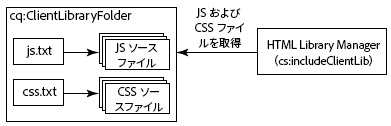
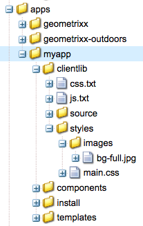

# クライアント側ライブラリの使用{#using-client-side-libraries}

最近の Web サイトは、複雑な JavaScript や CSS コードを利用したクライアント側の処理に大きく依存しています。このコードの提供を編成および最適化することが厄介な問題となることがあります。

この問題への対処に役立つように、AEM では、**クライアント側ライブラリフォルダー**&#x200B;が提供されています。これにより、クライアント側コードをリポジトリに格納し、カテゴリ別に整理して、それぞれのコードカテゴリをクライアントに保存するタイミングと方法を定義することができます。その後、クライアント側ライブラリシステムにより、最終的な Web ページで、正しいコードを読み込むための正しいリンクが作成されます。

## AEM でのクライアント側ライブラリの機能 {#how-client-side-libraries-work-in-aem}

The standard way to include a client-side library (that is, a JS or CSS file) in the HTML of a page is simply to include a `<script>` or `<link>` tag in the JSP for that page, containing the path to the file in question. 例：

```xml
...
<head>
   ...
   <script type="text/javascript" src="/etc/clientlibs/granite/jquery/source/1.8.1/jquery-1.8.1.js"></script>
   ...
</head>
...
```

この方法は AEM で機能しますが、ページやそれに含まれるコンポーネントが複雑になると、問題につながる可能性があります。そのような場合、同じ JS ライブラリの複数のコピーが最終的な HTML 出力に含まれる危険性があります。これを回避してクライアント側ライブラリを論理的に整理するために、AEM では&#x200B;**クライアント側ライブラリフォルダー**&#x200B;を使用します。

クライアント側ライブラリフォルダーは、タイプが `cq:ClientLibraryFolder` のリポジトリノードです。[CND 注釈](https://jackrabbit.apache.org/node-type-notation.html)での定義は次のとおりです。

```shell
[cq:ClientLibraryFolder] > sling:Folder
  - dependencies (string) multiple
  - categories (string) multiple
  - embed (string) multiple
  - channels (string) multiple
```

By default, `cq:ClientLibraryFolder` nodes can be placed anywhere within the `/apps`, `/libs` and `/etc` subtrees of the repository (these defaults, and other settings can be controlled through the **Adobe Granite HTML Library Manager** panel of the [System Console](https://localhost:4502/system/console/configMgr)).

各ファイル `cq:ClientLibraryFolder` には、JSファイルやCSSファイルのセットと、いくつかのサポートファイルが入力されます（以下を参照）。 のプロパティ `cq:ClientLibraryFolder` は次のように設定します。

* `categories`:この秋に含まれるJSファイルやCSSファイルのセットのカテゴリを特定 `cq:ClientLibraryFolder` します。 この `categories` プロパティは複数の値を取るため、ライブラリフォルダーを複数のカテゴリーの一部にすることができます（このプロパティの役立ちについては以下を参照）。

* `dependencies`:これは、このライブラリカテゴリが依存する他のクライアントライブラリフォルダーのリストです。 例えば、2つの `cq:ClientLibraryFolder` ノードを指定し、のファイルが正しく機能するために別のファイルを `F` 必要とする場合、のファイルの中の少なくとも1つは、の `G`ノードの中の少なくとも1つでなければなりません `F``G``categories``G``dependencies``F`。

* `embed`:他のライブラリからコードを埋め込むために使用します。 ノードFがノードGとHを埋め込むと、結果のHTMLはノードGとHからのコンテンツの集合になります。
* `allowProxy`:クライアントライブラリがの下にある場合、 `/apps`このプロパティを使用すると、プロキシサーブレット経由でアクセスできます。 See [Locating a Client Library Folder and Using the Proxy Client Libraries Servlet](/help/sites-developing/clientlibs.md#locating-a-client-library-folder-and-using-the-proxy-client-libraries-servlet) below.

## クライアント側ライブラリの参照 {#referencing-client-side-libraries}

HTL は、AEM のサイト開発での推奨テクノロジーなので、HTL を使用して AEM にクライアント側ライブラリを含める必要があります。ただし、JSP を使用しておこなうこともできます。

### HTL の使用 {#using-htl}

HTL では、クライアントライブラリは AEM 提供のヘルパーテンプレートを介して読み込まれます。テンプレートには [`data-sly-use`](https://helpx.adobe.com/experience-manager/htl/using/block-statements.html#use) を使用してアクセスできます。このファイルには 3 つのテンプレートが含まれ、[`data-sly-call`](https://helpx.adobe.com/experience-manager/htl/using/block-statements.html#template-call) で呼び出すことができます。

* **css** — 参照されるクライアントライブラリのCSSファイルのみを読み込みます。
* **js** — 参照されるクライアントライブラリのJavaScriptファイルのみを読み込みます。
* **all** — 参照されるクライアントライブラリ（CSSとJavaScriptの両方）のすべてのファイルを読み込みます。

各ヘルパーテンプレートには、必要なクライアントライブラリを参照するための `categories` オプションを指定できます。このオプションには、文字列値の配列またはコンマ区切り値のリストを含む文字列を指定できます。

For further details and exmple of usage, see the document [Getting Started with the HTML Template Language](https://helpx.adobe.com/experience-manager/htl/using/getting-started.html#loading-client-libraries).

### JSP の使用 {#using-jsp}

Add a `ui:includeClientLib` tag to your JSP code to add a link to client libraries in the generated HTML page. To reference the libraries, you use the value of the `categories` property of the `ui:includeClientLib` node.

```
<%@taglib prefix="ui" uri="https://www.adobe.com/taglibs/granite/ui/1.0" %>
<ui:includeClientLib categories="<%= categories %>" />
```

例えば、 `/etc/clientlibs/foundation/jquery` カテゴリのプロパティが値のノード `cq:ClientLibraryFolder` のタイプがあると `cq.jquery`します。 JSPファイル内の次のコードは、ライブラリを参照します。

```xml
<ui:includeClientLib categories="cq.jquery"/>
```

生成される HTML ページには次のコードが含まれます。

```xml
<script type="text/javascript" src="/etc/clientlibs/foundation/jquery.js"></script>
```

JS、CSS またはテーマライブラリをフィルタリングするための属性を含めた詳細は、[ui:includeClientLib](/help/sites-developing/taglib.md#lt-ui-includeclientlib) を参照してください。

>[!CAUTION]
>
>`<cq:includeClientLib>`は、以前はクライアントライブラリを含めるために一般的に使用されていたもので、AEM 5.6以降では廃止されています。 [ この代わりに、上記の説明に従っ `<ui:includeClientLib>`](/help/sites-developing/taglib.md#lt-ui-includeclientlib) て使用する必要があります。

## クライアントライブラリフォルダーの作成 {#creating-client-library-folders}

JavaScriptおよびカスケーディングスタイルシートライブラリを定義する `cq:ClientLibraryFolder` ノードを作成し、HTMLページで使用できるようにします。 ノードの `categories` プロパティを使用して、ノードが属するライブラリカテゴリを特定します。

ノードには、実行時に単一のJSファイルやCSSファイルに結合される1つ以上のソースファイルが含まれます。 生成されるファイルの名前は、ノード名の拡張子が `.js` またはフ `.css` ァイル名です。 例えば、という名前のライブラリノードは、 `cq.jquery` またはという名前の生成されたファイル `cq.jquery.js` に結果を返し `cq.jquery.css`ます。

クライアントライブラリフォルダーには次の項目が含まれます。

* 統合対象の JS／CSS ソースファイル（いずれかまたは両方）。
* 画像ファイルなど、CSS スタイルをサポートするリソース。

   **注意：**&#x200B;サブフォルダーを使用してソースファイルを整理できます。
* 生成される JS／CSS ファイルに統合するソースファイルを識別する 1 つの `js.txt` ファイルと 1 つの `css.txt` ファイル（いずれかまたは両方）。



ウィジェット用のクライアントライブラリ特有の要件について詳しくは、[ウィジェットの使用および拡張](/help/sites-developing/widgets.md)を参照してください。

Webクライアントは、 `cq:ClientLibraryFolder` ノードにアクセスする権限が必要です。 また、リポジトリの保護された領域からライブラリを公開することもできます（後述の「他のライブラリからのコードの埋め込み」を参照）。

### /lib でのライブラリの上書き{#overriding-libraries-in-lib}

下にあるクライアントライブラリフォルダ `/apps` ーは、同じフォルダー内にある同じ名前のフォルダーよりも優先され `/libs`ます。 例えば、は `/apps/cq/ui/widgets` より優先され `/libs/cq/ui/widgets`ます。 これらのライブラリが同じカテゴリに属する場合は、次のライブラリ `/apps` が使用されます。

### クライアントライブラリフォルダーの配置とプロキシクライアントライブラリサーブレットの使用 {#locating-a-client-library-folder-and-using-the-proxy-client-libraries-servlet}

In previous versions, client library folders were located below `/etc/clientlibs` in the repository. This is still supported, however it is recommended that client libraries now be located under `/apps`. This is to locate the client libraries near the other scripts, which are generally found below `/apps` and `/libs`.

>[!NOTE]
>
>クライアントライブラリフォルダーの下の静的リソースは、 *resourcesと呼ばれるフォルダーに存在する必要があります*。 フォルダー *リソースの下に画像などの静的リソースがない場合、その静的リソースは発行インスタンスで参照できません*。 次に例を示します。https://localhost:4503/etc.clientlibs/geometrixx/components/clientlibs/resources/example.gif

>[!NOTE]
>
>In order to better isolate code from content and configuration, it is recommended to locate client libraries under `/apps` and expose them via `/etc.clientlibs` by leveraging the `allowProxy` property.

In order for the client libraries under `/apps` to be accessible, a proxy servelt is used. The ACLs are still enforced on the client library folder, but the servlet allows for the content to be read via `/etc.clientlibs/` if the `allowProxy` property is set to `true`.

静的リソースは、クライアントライブラリフォルダーの下のリソースにある場合、プロキシ経由でのみアクセスできます。

次に例を示します。

* You have a clientlib in `/apps/myproject/clientlibs/foo`
* You have a static image in `/apps/myprojects/clientlibs/foo/resources/icon.png`

Then you set the `allowProxy` property on `foo` to true.

* You can then request `/etc.clientlibs/myprojects/clientlibs/foo.js`
* You can then reference the image via `/etc.clientlibs/myprojects/clientlibs/foo/resources/icon.png`

>[!CAUTION]
>
>プロキシ化されたクライアントライブラリを使用する場合、AEMディスパッチャーの設定で、拡張clientlibを持つURIが許可されるように更新する必要がある場合があります。

>[!CAUTION]
>
>Adobe recommends locating client libraries under `/apps` and making them available using the proxy servlet. However keep in mind that best practice still requires that public sites never include anything that is served directly over an `/apps` or `/libs` path.

### クライアントライブラリフォルダーの作成 {#create-a-client-library-folder}

1. Open CRXDE Lite in a web browser ([https://localhost:4502/crx/de](https://localhost:4502/crx/de)).
1. クライアントライブラリフォルダーの配置先のフォルダーを選択して、**作成／ノードを作成**&#x200B;をクリックします。
1. ライブラリファイルの名前を入力し、タイプリストで `cq:ClientLibraryFolder` を選択します。「**OK**」をクリックし、「**すべて保存**」をクリックします。
1. ライブラリが所属するカテゴリ（1 つまたは複数）を指定するには、`cq:ClientLibraryFolder` ノードを選択し、次のプロパティを追加して、「**すべて保存**」をクリックします。

   * 名前：categories
   * タイプ：String
   * 値：カテゴリ名
   * 複数：選択

1. 何らかの方法で、ソースファイルをライブラリフォルダーに追加します。例えば、WebDav クライアントを使用してファイルをコピーする、ファイルを作成してコンテンツを手動で作成する、などの方法があります。

   **注意：**&#x200B;必要に応じて、サブフォルダーを使用してソースファイルを整理できます。

1. クライアントライブラリフォルダーを選択して、**作成／ファイルを作成**&#x200B;をクリックします。
1. ファイル名ボックスに、次のいずれかのファイル名を入力して、「OK」をクリックします。

   * **`js.txt`：** JavaScript ファイルを生成する場合はこのファイル名を使用します。
   * **`css.txt`：** カスケーディングスタイルシート（CSS）を生成する場合はこのファイル名を使用します。

1. ファイルを開き、ソースファイルのパスのルートを識別する次のテキストを入力します。

   `#base=*[root]*`

   「* `[root]`*」は、TXTファイルを基準とした、ソースファイルが格納されているフォルダーのパスに置き換えます。 例えば、ソースファイルがTXTファイルと同じフォルダーにある場合は、次のテキストを使用します。

   `#base=.`

   次のコードで、`cq:ClientLibraryFolder` ノードの下の mobile という名前のフォルダーをルートに設定します。

   `#base=mobile`

1. 下の行に、ルートを基準としたソースファイルのパス `#base=[root]`を入力してください。 各ファイル名を別々の行に配置します。
1. 「**すべて保存**」をクリックします。

### 依存関係へのリンク {#linking-to-dependencies}

クライアントライブラリフォルダーのコードが他のライブラリを参照する場合、他のライブラリを依存関係として識別します。JSP では、クライアントライブラリフォルダーを参照する `ui:includeClientLib` タグが原因で、HTML コードに生成したライブラリファイルへのリンクおよび依存関係が含まれます。

依存関係は別のものでなければなりま `cq:ClientLibraryFolder`せん。 依存関係を識別するには、次の属性を持つプロパティを `cq:ClientLibraryFolder` ノードに追加します。

* **名前：** dependencies
* **タイプ：** String[]
* **値：**&#x200B;現在のライブラリフォルダーの依存先である cq:ClientLibraryFolder ノードの categories プロパティの値。

例えば、/はライブラリ `etc/clientlibs/myclientlibs/publicmain` に依存してい `cq.jquery` ます。 メインのクライアントライブラリを参照するJSPは、次のコードを含むHTMLを生成します。

```xml
<script src="/etc/clientlibs/foundation/cq.jquery.js" type="text/javascript">
<script src="/etc/clientlibs/mylibs/publicmain.js" type="text/javascript">
```

### 他のライブラリからのコードの埋め込み {#embedding-code-from-other-libraries}

クライアントライブラリから別のクライアントライブラリにコードを埋め込むことができます。実行時、埋め込みライブラリの生成されたJSファイルとCSSファイルには、埋め込みライブラリのコードが含まれます。

コードの埋め込みは、リポジトリのセキュリティ保護された領域に格納されているライブラリへのアクセスを提供する際に便利です。

#### アプリケーション専用のクライアントライブラリフォルダー {#app-specific-client-library-folders}

アプリケーション関連のすべてのファイルは、下のアプリケーションフォルダーに格納することをお勧め `/app`します。 Webサイトの訪問者に対するアクセスを拒否することもお勧めし `/app` ます。 両方のベストプラクティスを満たすには、下のクライアントライブラリを埋め込んだフォルダーの下にクライアントライブラリ `/etc` フォルダーを作成 `/app`します。

埋め込むクライアントライブラリカテゴリーを識別するには、フォルダープロパティを使用します。 ライブラリを埋め込むには、次のプロパティ属性を使用して、埋め込み `cq:ClientLibraryFolder` ノードにプロパティを追加します。

* **名前：** embed
* **タイプ：** String[]
* **値：** 埋め込む `cq:ClientLibraryFolder` ノードのカテゴリプロパティの値。

<!-- #### Using Embedding to Minimize Requests {#using-embedding-to-minimize-requests}

In some cases you may find that the final HTML generated for typical page by your publish instance includes a relatively large number of `<script>` elements, particularly if your site is using client context information for analaytics or targeting. For example, in a non-optimized project you might find the following series of `<script>` elements in the HTML for a page:

```xml
<script type="text/javascript" src="/etc/clientlibs/granite/jquery.js"></script>
<script type="text/javascript" src="/etc/clientlibs/granite/utils.js"></script>
<script type="text/javascript" src="/etc/clientlibs/granite/jquery/granite.js"></script>
<script type="text/javascript" src="/etc/clientlibs/foundation/jquery.js"></script>
<script type="text/javascript" src="/etc/clientlibs/foundation/shared.js"></script>
<script type="text/javascript" src="/etc/clientlibs/granite/underscore.js"></script>
<script type="text/javascript" src="/etc/clientlibs/foundation/personalization/kernel.js"></script>
```

In such cases, it can be useful to combine all the required client library code in to a single file so that the number of back and forth requests on page load is reduced. To do this you can `embed` the required libraries into you app-specific client library using the embed property of the `cq:ClientLibraryFolder` node.

The following client library categories are incuded with AEM. You should embed only those that are required for he functioning of your particular site. However, **you should maintain the order listed here**:

1. `browsermap.standard`
1. `browsermap`
1. `jquery-ui`
1. `cq.jquery.ui`
1. `personalization`
1. `personalization.core`
1. `personalization.core.kernel`
1. `personalization.clientcontext.kernel`
1. `personalization.stores.kernel`
1. `personalization.kernel`
1. `personalization.clientcontext`
1. `personalization.stores`
1. `cq.collab.comments`
1. `cq.collab.feedlink`
1. `cq.collab.ratings`
1. `cq.collab.toggle`
1. `cq.collab.forum`
1. `cq.cleditor`

EDITOR NOTE: removed as requested on CQDOC-16765

-->

#### CSS ファイル内のパス {#paths-in-css-files}

CSSファイルを埋め込むと、生成されるCSSコードは、埋め込みライブラリに対する相対的なリソースへのパスを使用します。 例えば、公開アクセス可能なライブラリによって `/etc/client/libraries/myclientlibs/publicmain``/apps/myapp/clientlib` クライアントライブラリが埋め込まれるとします。



`main.css` ファイルには次のスタイルが含まれます。

```xml
body {
  padding: 0;
  margin: 0;
  background: url(images/bg-full.jpg) no-repeat center top;
  width: 100%;
}
```

`publicmain` ノードが生成する CSS ファイルには、元の画像の URL を使用した、次のスタイルが含まれます。

```xml
body {
  padding: 0;
  margin: 0;
  background: url(../../../apps/myapp/clientlib/styles/images/bg-full.jpg) no-repeat center top;
  width: 100%;
}
```

### 特定のモバイルグループ用のライブラリの使用 {#using-a-library-for-specific-mobile-groups}

クライアントライブラリフォルダーの `channels` プロパティを使用して、ライブラリを使用するモバイルグループを特定します。 この `channels` プロパティは、同じカテゴリのライブラリが異なるデバイス機能用に設計されている場合に役立ちます。

To associate a client library folder with a device group, add a property to your `cq:ClientLibraryFolder` node with the following attributes:

* **名前：** チャネル
* **タイプ：** String[]
* **値：** モバイルグループの名前。ライブラリフォルダーをグループから除外するには、名前の前に感嘆符(&quot;!&quot;)を付けます。

例えば、次の表は、`channels` カテゴリの各クライアントライブラリフォルダーの `cq.widgets` プロパティの値を示しています。

| クライアントライブラリフォルダー | channels プロパティの値 |
|---|---|
| `/libs/cq/analytics/widgets` | `!touch` |
| `/libs/cq/analytics/widgets/themes/default` | `!touch` |
| `/libs/cq/cloudserviceconfigs/widgets` | `!touch` |
| `/libs/cq/searchpromote/widgets` | `!touch` |
| `/libs/cq/searchpromote/widgets/themes/default` | *[値なし]* |
| `/libs/cq/touch/widgets` | `touch` |
| `/libs/cq/touch/widgets/themes/default` | `touch` |
| `/libs/cq/ui/widgets` | `!touch` |
| `/libs/cq/ui/widgets/themes/default` | `!touch` |

## プリプロセッサーの使用 {#using-preprocessors}

AEM allows for pluggable preprocessors and ships with support for [YUI Compressor](https://github.com/yui/yuicompressor#yui-compressor---the-yahoo-javascript-and-css-compressor) for CSS and JavaScript and [Google Closure Compiler (GCC)](https://developers.google.com/closure/compiler/) for JavaScript with YUI set as AEM&#39;s default preprocessor.

プラグ可能なプリプロセッサーは、次のように柔軟な使用が可能です。

* スクリプトソースを処理できる ScriptProcessors を定義する
* プロセッサーはオプションを使用して設定できる
* プロセッサーは縮小用に使用できるが、縮小以外の場合にも使用できる
* clientlib はどのプロセッサーを使用するかを定義できる

>[!NOTE]
>
>デフォルトでは、AEM は YUI Compressor を使用します。既知の問題のリストについては、[YUI Compressor GitHub ドキュメント](https://github.com/yui/yuicompressor/issues)を参照してください。特定の clientlib 用の GCC コンプレッサーに切り替えると、YUI を使用しているときに発生していたいくつかの問題が解決することがあります。

>[!CAUTION]
>
>縮小化したライブラリをクライアントライブラリに配置しないでください。代わりに、生のライブラリを提供し、縮小が必要な場合は、プリプロセッサーのオプションを使用します。

### 使用方法 {#usage}

クライアントライブラリごとに、またはシステム全体でプリプロセッサーを設定できます。

* Add the multivalue properties `cssProcessor` and `jsProcessor` on the clientlibrary node

* または、**HTML ライブラリマネージャー**&#x200B;の OSGi 設定で、システムのデフォルト設定を定義します。

clientlibノードのプリプロセッサ構成は、OSGI構成よりも優先されます。

### 形式と例 {#format-and-examples}

#### 形式 {#format}

```xml
config:= mode ":" processorName options*;
mode:= "default" | "min";
processorName := "none" | <name>;
options := ";" option;
option := name "=" value;
```

#### CSS 縮小用の YUI Compressor と JS 用の GCC {#yui-compressor-for-css-minification-and-gcc-for-js}

```xml
cssProcessor: ["default:none", "min:yui"]
jsProcessor: ["default:none", "min:gcc;compilationLevel=advanced"]
```

#### 事前処理のための Typescript と縮小および不明化のための GCC {#typescript-to-preprocess-and-then-gcc-to-minify-and-obfuscate}

```xml
jsProcessor: [
   "default:typescript",
   "min:typescript",
   "min:gcc;obfuscate=true"
]
```

#### 追加の GCC オプション {#additional-gcc-options}

```xml
failOnWarning (defaults to "false")
languageIn (defaults to "ECMASCRIPT5")
languageOut (defaults to "ECMASCRIPT5")
compilationLevel (defaults to "simple") (can be "whitespace", "simple", "advanced")
```

GCC オプションについて詳しくは、[GCC ドキュメント](https://developers.google.com/closure/compiler/docs/compilation_levels)を参照してください。

### システムのデフォルト縮小ツールの設定 {#set-system-default-minifier}

YUI は、AEM のデフォルト縮小ツールとして設定されています。これを GCC に変更するには、次の手順に従います。

1. Go to Apache Felix Config Manager at [https://localhost:4502/system/console/configMgr](https://localhost:4502/system/console/configMgr)
1. Find and edit the **Adobe Granite HTML Library Manager**.
1. 「**Minify**」オプションを有効にします（まだ有効でない場合）。
1. Set the value **JS Processor Default Configs** to `min:gcc`.

   Options can be passed if separated with a semicolon e.g. `min:gcc;obfuscate=true`.

1. 「**保存**」をクリックして変更を保存します。

## デバッグツール {#debugging-tools}

AEM には、クライアントライブラリフォルダーをデバッグおよびテストするためのツールが用意されています。

### 埋め込みファイルの確認 {#see-embedded-files}

埋め込みコードの接触チャネルをトレースする、または埋め込みクライアントライブラリが期待どおりの結果を得られるようにするには、実行時に埋め込まれているファイルの名前を確認できます。 ファイル名を確認するには、WebページのURLに `debugClientLibs=true` パラメーターを追加します。 生成されるライブラリには、埋め込みコードの代わりに `@import` ステートメントが含まれています。

前の「 [Embedding Code From Other Libraries](/help/sites-developing/clientlibs.md#embedding-code-from-other-libraries)`/etc/client/libraries/myclientlibs/publicmain``/apps/myapp/clientlib` 」セクションの例では、クライアントライブラリフォルダーにクライアントライブラリフォルダーが埋め込まれています。 Webページにパラメーターを追加すると、Webページのソースコードに次のリンクが作成されます。

```xml
<link rel="stylesheet" href="/etc/clientlibs/mycientlibs/publicmain.css">
```

`publicmain.css` ファイルを開くと、次のコードが表示されます。

```xml
@import url("/apps/myapp/clientlib/styles/main.css");
```

1. Web ブラウザーのアドレスボックスで、HTML の URL に次のテキストを付加します。

   `?debugClientLibs=true`
1. ページが読み込まれたら、ページソースを表示します。
1. リンク要素の href として指定されているリンクをクリックしてファイルを開き、ソースコードを表示します。

### クライアントライブラリの確認 {#discover-client-libraries}

コンポー `/libs/cq/granite/components/dumplibs/dumplibs` ネントは、システム上のすべてのクライアントライブラリフォルダーに関する情報のページを生成します。 この `/libs/granite/ui/content/dumplibs` ノードは、コンポーネントをリソースタイプとして持ちます。 ページを開くには、次のURLを使用します（必要に応じてホストとポートを変更します）。

`https://<host>:<port>/libs/granite/ui/content/dumplibs.test.html`

情報には、ライブラリのパスおよびタイプ（CSS または JS）と、categories や dependencies などのライブラリ属性の値が含まれます。ページ上の後続のテーブルは、各カテゴリおよびチャネルに含まれるライブラリを示します。

### 生成される出力の確認 {#see-generated-output}

The `dumplibs` component includes a test selector that displays the source code that is generated for `ui:includeClientLib` tags. このページには、js、cssおよびテーマの設定された属性の様々な組み合わせに対するコードが含まれています。

1. 次のいずれかの方法で、テスト出力ページを開きます。

   * From the `dumplibs.html` page, click the link in the **Click here for output testing** text.

   * Webブラウザーで次のURLを開きます（必要に応じて別のホストとポートを使用します）。

      * `http://<host>:<port>/libs/granite/ui/content/dumplibs.html`

   デフォルトページに、categories 属性の値がないタグの出力が表示されます。

1. To see the output for a category, type the value of the client library&#39;s `categories` property and click **Submit Query**.

## 開発および本番用のライブラリ処理の設定 {#configuring-library-handling-for-development-and-production}

HTML ライブラリマネージャーサービスは、実行時に `cq:ClientLibraryFolder` タグを処理し、ライブラリを生成します。環境、開発または本番のタイプが、サービスの設定方法を決定します。

* セキュリティを強化：デバッグを無効化
* パフォーマンスを向上：空白を削除してライブラリを圧縮
* 読みやすさを改善：空白を含めて圧縮しない

サービスの設定について詳しくは、[AEM HTML ライブラリマネージャー](/help/sites-deploying/osgi-configuration-settings.md#aemhtmllibrarymanager)を参照してください。
