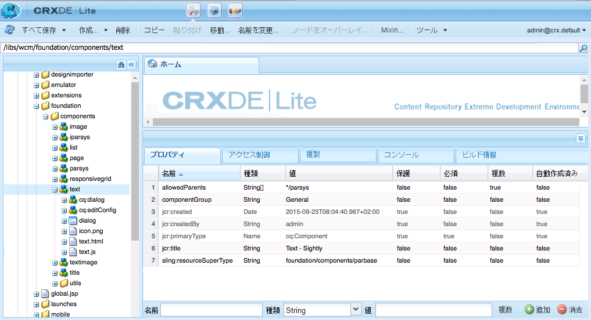
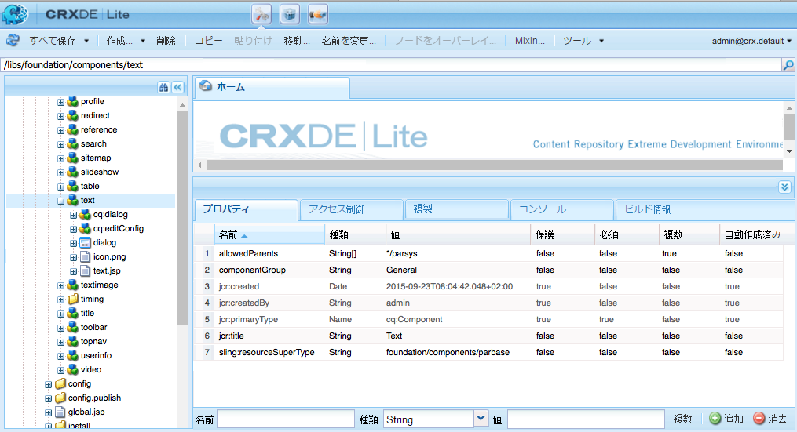
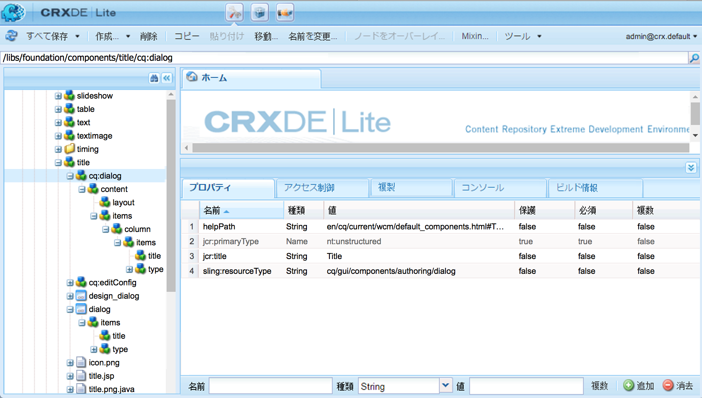
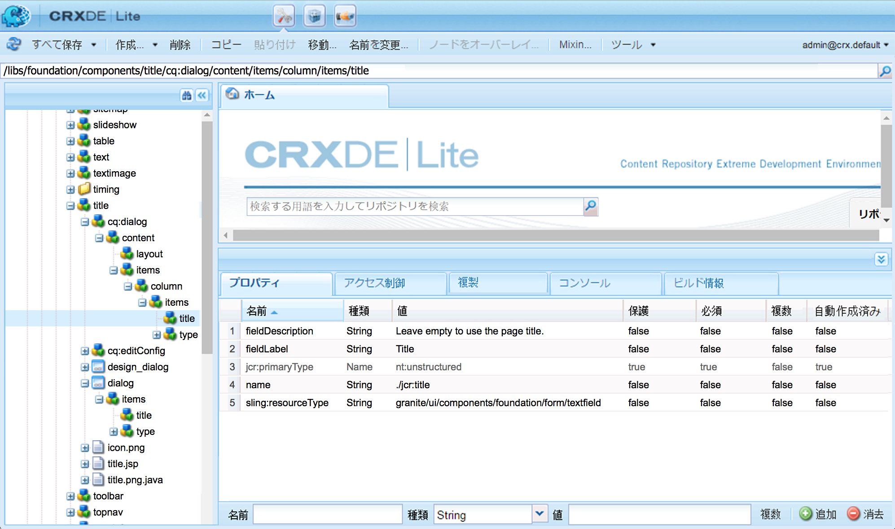
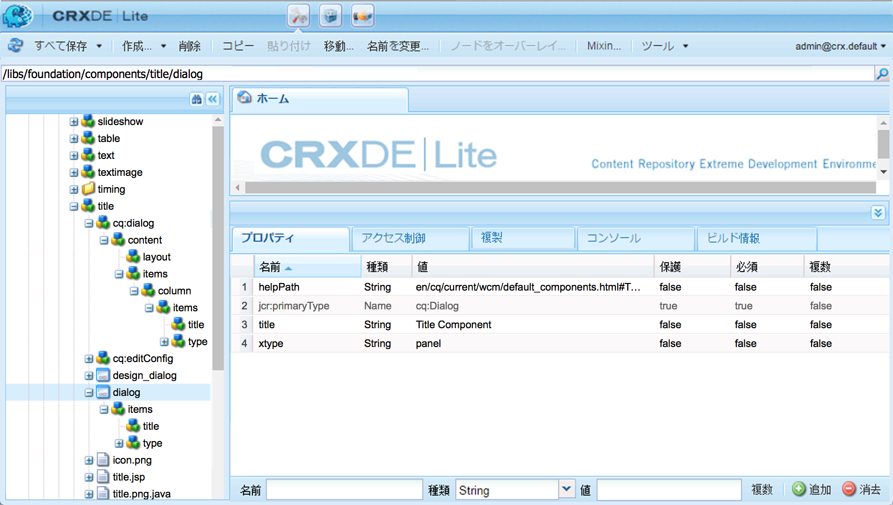
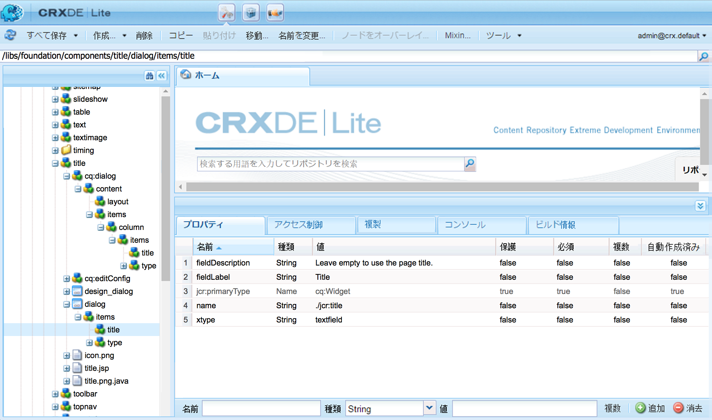
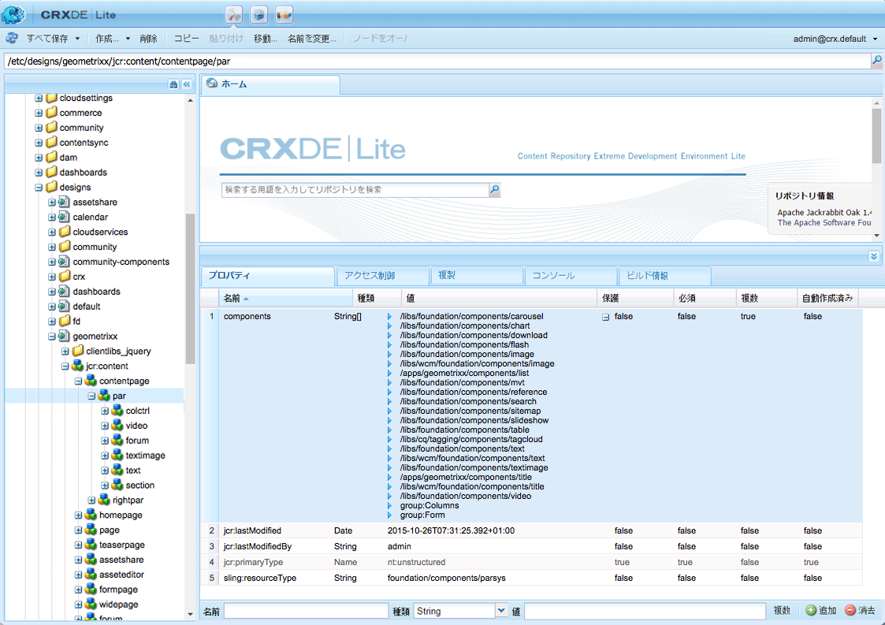
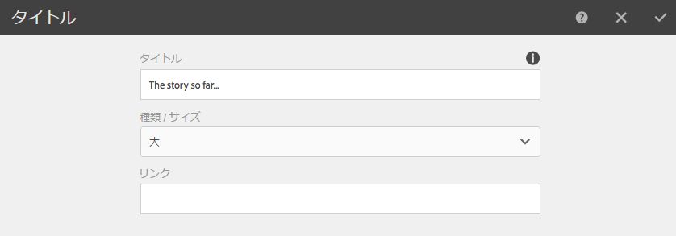
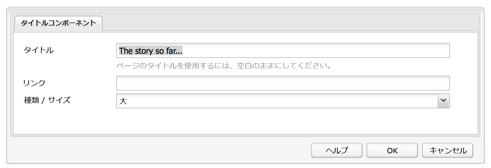
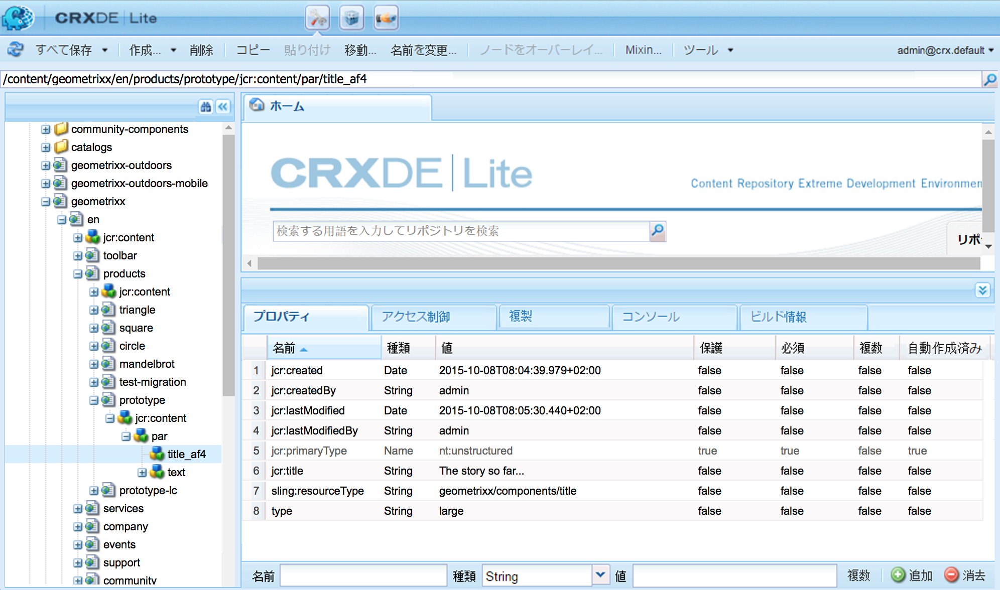

# AEM コンポーネント - 基本{#aem-components-the-basics}

新しいコンポーネントの開発にとりかかる際は、その構造と設定の基本を理解する必要があります。

これには、標準的なセオリーを学び、標準 AEM インスタンスでのコンポーネントの実装を幅広く知ることが含まれます。AEM は新しい標準のタッチ操作対応 UI に変更されましたが、引き続きクラシック UI をサポートしているので、この後者のアプローチは少し複雑です。

## 概要 {#overview}

この節では、独自コンポーネントの開発時に知っておくべき詳細の導入段階として、基本的な概念と注意点について説明します。

### 計画 {#planning}

実際にコンポーネントを設定またはコーディングする前に、次のように尋ねる必要があります。

* そもそも新しいコンポーネントで何をするか
   * 明確な仕様は、開発、テスト、引継ぎのあらゆる段階で役立ちます。詳細は時間と共に変化する可能性がありますが、仕様は更新可能です（ただし、変更箇所を記録しておく必要があります）。
* コンポーネントを一から作成する必要があるか、基本部分を既存のコンポーネントから継承できるか
   * 一から作成する必要があるとは限りません。
   * There are several mechanisms provided by AEM to allow you to inherit and extend details from another component definition including override, overlay, and the [Sling Resource Merger](/help/sites-developing/sling-resource-merger.md).
* コンポーネントのコンテンツを選択または操作するためのロジックが必要か
   * ロジックは、ユーザーインターフェイス層から分離しておく必要があります。HTL はこれに対応した設計になっています。
* コンポーネントを CSS で書式設定する必要があるか
   * CSS による書式設定は、コンポーネント定義から分離しておく必要があります。外部の CSS ファイルを通じて HTML 要素を変更できるように、HTML 要素の命名規約を定義してください。
* 考慮すべきセキュリティ要素は何か
   * 詳しくは、[セキュリティチェックリスト - 開発のベストプラクティス](/help/sites-administering/security-checklist.md#development-best-practices)を参照してください。

### タッチ操作対応 UI とクラシック UI の違い {#touch-enabled-vs-classic-ui}

コンポーネントの開発について本格的な検討を始める前に、作成者がどちらの UI を使用するかを知っておく必要があります。

* **タッチ操作対応 UI**
   [標準のユーザーインターフェイス](/help/sites-developing/touch-ui-concepts.md) は、 [Coral UI](/help/sites-developing/touch-ui-concepts.md#coral-ui) / [](/help/sites-developing/touch-ui-concepts.md#granite-ui)Granite UIの基盤テクノロジーを使用した、Adobe Marketing Cloudの統合ユーザーエクスペリエンスに基づいています。
* **AEM 6.4で廃止されたExtJSテクノロジに基づくクラシックUI**&#x200B;ユーザーインターフェイス。

詳しくは、[UI インターフェイスに関するお客様向け推奨事項](/help/sites-deploying/ui-recommendations.md)を参照してください。

タッチ操作対応 UI、クラシック UI または両方をサポートするようにコンポーネントを実装できます。標準インスタンスを見ると、最初にクラシックUI、タッチ対応UI、またはその両方用にデザインされた、標準搭載のコンポーネントも表示されます。

このため、このページでは両 UI の基本と識別方法について説明します。

>[!NOTE]
>
>Adobeでは、最新のテクノロジーを活用するために、タッチ対応UIの活用を推奨します。 [AEM最新化ツール](modernization-tools.md) ：移行を容易にします。

### コンテンツのロジックとマークアップのレンダリング  {#content-logic-and-rendering-markup}

マークアップおよびレンダリングをおこなうコードと、コンポーネントのコンテンツ選択に関するロジックを制御するコードは、分離しておくことをお勧めします。

この方法をサポートするテンプレート言語が [HTL](https://docs.adobe.com/content/help/ja-JP/experience-manager-htl/using/overview.html) です。HTL では、基盤となるビジネスロジックを定義するときにのみプログラミング言語を使用します。この（オプションの）ロジックは、特定のコマンドで HTL から呼び出されます。この仕組みでは、特定のビュー用に呼び出されるコードに焦点を当てることができるので、必要に応じて、同じコンポーネントの様々なビュー用のロジックを定義できます。

### HTL と JSP {#htl-vs-jsp}

HTLは、AEM 6.0で導入されたHTMLテンプレート言語です。

独自コンポーネントの開発時に [HTL](https://docs.adobe.com/content/help/ja-JP/experience-manager-htl/using/overview.html) と JSP（Java Server Pages）のどちらを使用すべきかという質問への回答は明快です。現在では、HTL が AEM の推奨スクリプティング言語とされています。

HTL と JSP はどちらも、クラシック UI とタッチ操作対応 UI の両方のコンポーネントの開発に使用できます。HTL はタッチ操作対応 UI 専用で JSP はクラシック UI 用だと想定する傾向があるかもしれませんが、これは時期に起因する誤解です。タッチ操作対応 UI と HTL は、ほぼ同時期に AEM に組み込まれました。HTL は現在推奨される言語なので、新しいコンポーネントに使用されており、このため、タッチ操作対応 UI に使用される傾向があります。

>[!NOTE]
>
>例外は、ダイアログで使用される Granite UI 基盤のフォームフィールドです。このフィールドには、引き続き JSP を使用する必要があります。

### 独自コンポーネントの開発 {#developing-your-own-components}

UI の種類に応じた独自コンポーネントを作成するには、（このページを読んでから）以下を参照してください。

* [タッチ操作対応 UI 用の AEM コンポーネント](/help/sites-developing/developing-components.md)
* [クラシック UI 用の AEM コンポーネント](/help/sites-developing/developing-components-classic.md)

既存のコンポーネントをコピーし、必要な変更をおこなうことが、開発を始めるうえで最も簡単な方法です。独自のコンポーネントを作成し、それを段落システムに追加する方法については、以下を参照してください。

* [コンポーネント開発](/help/sites-developing/developing-components-samples.md)（主にタッチ操作対応 UI）

### パブリッシュインスタンスへのコンポーネントの移動 {#moving-components-to-the-publish-instance}

コンテンツをレンダリングするコンポーネントは、コンテンツと同じ AEM インスタンスにデプロイする必要があります。したがって、オーサーインスタンス上でページをオーサリングおよびレンダリングするために使用するすべてのコンポーネントを、パブリッシュインスタンスにデプロイする必要があります。デプロイすると、コンポーネントを使用して、アクティブ化されたページをレンダリングできるようになります。

コンポーネントをパブリッシュインスタンスに移動するには、次のツールを使用します。

* [Package Manager](/help/sites-administering/package-manager.md) を使用してコンポーネントをパッケージに追加し、別のAEMインスタンスに移動します。
* コンポーネントをレプリケートするには、[「ツリーをアクティベート」レプリケーションツールを使用](/help/sites-authoring/publishing-pages.md#manage-publication)します。

>[!NOTE]
>
>これらの仕組みを利用して、開発インスタンスからテストインスタンスなど、インスタンス間でコンポーネントを移行することもできます。

### 最初から認識するコンポーネント {#components-to-be-aware-of-from-the-start}

* ページ:

   * AEM has the *page* component ( `cq:Page`).
   * このコンポーネントは、コンテンツ管理にとって重要なリソースです。
      * ページコンポーネントは、Web サイトのコンテンツを保持する Web ページに対応しています。

* 段落システム：

   * 段落システムは、Web サイトの重要な構成要素であり、段落のリストを管理します。実際のコンテンツを格納する個々のコンポーネントを保持し、構造化するために使用されます。
   * 段落システム内で、段落を作成、移動、コピーおよび削除できます。
   * 特定の段落システム内で使用可能にするコンポーネントを選択することもできます。
   * There are various paragraph systems available within a standard instance (for example `parsys`, ` [responsivegrid](/help/sites-authoring/responsive-layout.md)`).

## 構造 {#structure}

AEM コンポーネントの構造は強力で、柔軟性があります。主な考慮事項は次のとおりです。

* リソースタイプ
* コンポーネント定義
* コンポーネントのプロパティおよび子ノード
* ダイアログ
* デザインダイアログ
* 使用可能なコンポーネント
* コンポーネントおよびコンポーネントによって作成されるコンテンツ

### リソースタイプ {#resource-type}

構造の重要な構成要素となるのが、リソースタイプです。

* コンテンツの構造は意図を宣言します。
* リソースタイプはその意図を実装します。

このような抽象化をすることで、時間の経過と共にルックアンドフィールが変化しても、意図が変わることはありません。

### コンポーネント定義 {#component-definition}

#### コンポーネントの基本 {#component-basics}

コンポーネントの定義は次のように分解できます。

* AEM コンポーネントは、[Sling](https://sling.apache.org/documentation.html) に基づいています。
* AEM コンポーネントは、（通常は）次の場所に配置されます。

   * HTL: `/libs/wcm/foundation/components`
   * JSP：`/libs/foundation/components`

* プロジェクトまたはサイトに固有のコンポーネントは、（通常は）次の場所に配置されます。

   * `/apps/<myApp>/components`

* AEM の標準コンポーネントは、`cq:Component` として定義され、次の主要な構成要素を持ちます。

   * jcrプロパティ：

      A list of jcr properties; these are variable and some may be optional though the basic structure of a component node, its properties and subnodes are defined by the `cq:Component` definition

   * リソース:

      コンポーネントで使用される静的要素を定義します。

   * スクリプト:

   コンポーネントの結果のインスタンスの動作を実装するために使用されます。

* **ルートノード**：

   * `<mycomponent> (cq:Component)`  — コンポーネントの階層ノード。

* **重要なプロパティ**：

   * `jcr:title` - コンポーネントのタイトル。コンポーネントブラウザーまたはサイドキック内のコンポーネントリストに示すときのラベルとして使用されたりします。
   * `jcr:description` - コンポーネントの説明。コンポーネントブラウザーまたはサイドキック内でマウスを上に置くと表示されるヒントとして使用できます。
   * クラシック UI：

      * `icon.png`  — このコンポーネントのアイコン。
      * `thumbnail.png` - このコンポーネントを段落システム内にリストする場合に表示される画像。
   * タッチ UI

      * 詳しくは、[タッチ UI のコンポーネントアイコン](/help/sites-developing/components-basics.md#component-icon-in-touch-ui)の節を参照してください。


* **重要な子ノード**：

   * `cq:editConfig (cq:EditConfig)`  — コンポーネントの編集プロパティを定義し、コンポーネントをコンポーネントブラウザーまたはサイドキックに表示できるようにします。

      注意：コンポーネントにダイアログがある場合は、cq:editConfig が存在しなくても、コンポーネントは自動的にコンポーネントブラウザーまたはサイドキックに表示されます。

   * `cq:childEditConfig (cq:EditConfig)`  — 独自のコンポーネントを定義しない子コンポーネントの作成者UI要素を制御し `cq:editConfig`ます。
   * タッチ操作対応 UI：

      * `cq:dialog` ( `nt:unstructured`) — このコンポーネントのダイアログ。 ユーザーがコンポーネントを設定したり、コンテンツを編集したりできるインターフェイスを定義します。
      * `cq:design_dialog` ( `nt:unstructured`) — このコンポーネントのデザイン編集
   * クラシック UI：

      * `dialog` ( `cq:Dialog`) — このコンポーネントのダイアログ。 ユーザーがコンポーネントを設定したり、コンテンツを編集したりできるインターフェイスを定義します。
      * `design_dialog` ( `cq:Dialog`) — このコンポーネントのデザイン編集。


#### タッチ UI のコンポーネントアイコン {#component-icon-in-touch-ui}

コンポーネントのアイコンまたは省略形は、開発者がコンポーネントを作成する際に、コンポーネントのJCRプロパティを介して定義されます。 これらのプロパティは、次の順番で評価され、最初に見つかった有効なプロパティが使用されます。

1. `cq:icon`  — コンポーネントブラウザに表示する [Coral UIライブラリ内の標準アイコンを示す文字列プロパティ](https://helpx.adobe.com/experience-manager/6-5/sites/developing/using/reference-materials/coral-ui/coralui3/Coral.Icon.html) 。
   * Coral アイコンの HTML 属性の値を使用します。
1. `abbreviation`  — コンポーネントブラウザのコンポーネント名の省略形をカスタマイズする文字列プロパティ
   * 省略形は 最大2 文字までにする必要があります。
   * Providing an empty string will build the abbreviation from first two characters of the `jcr:title` property.
      * 例えば、「Image」の場合は「Im」になります。
      * ローカライズされたタイトルが省略形の作成に使用されます。
   * 省略形は、コンポーネントに `abbreviation_commentI18n` プロパティがある場合にのみ翻訳されます。これは、翻訳ヒントとして使用されます。
1. `cq:icon.png` または `cq:icon.svg` — コンポーネントのアイコン（コンポーネントブラウザに表示）
   * 20 x 20 pixel は、標準的なコンポーネントのアイコンのサイズです。
      * 大きいアイコンはクライアント側で縮小されます。
   * レコメンデーションカラーはrgb(112, 112, 112) > #707070です。
   * 標準的なコンポーネントアイコンの背景は、透明です。
   * Only `.png` and `.svg` files are supported.
   * If importing from the file system via Eclipse plugin, filenames need to be esacaped as `_cq_icon.png` or `_cq_icon.svg` for example.
   * `.png` 両者が存在する `.svg` 場合に先例となる

If none of the above properties ( `cq:icon`, `abbreviation`, `cq:icon.png` or `cq:icon.svg`) are found on the component:

* システムは、`sling:resourceSuperType` プロパティに続くスーパーコンポーネント上の同じプロパティを検索します。
* If nothing or an empty abbreviation is found at the super component level, the system will build the abbreviation from the first letters of the `jcr:title` property of the current component.

スーパーコンポーネントからアイコンの継承をキャンセルするために、コンポーネントで空の `abbreviation` プロパティを設定すると、デフォルトの動作に戻ります。

The [Component Console](/help/sites-authoring/default-components-console.md#component-details) displays how the icon for a particular component is defined.

#### SVG アイコンの例 {#svg-icon-example}

```xml
<?xml version="1.0" encoding="utf-8"?>
<!DOCTYPE svg PUBLIC "-//W3C//DTD SVG 1.1//EN" "https://www.w3.org/Graphics/SVG/1.1/DTD/svg11.dtd">
<svg version="1.1" id="Layer_1" xmlns="https://www.w3.org/2000/svg" xmlns:xlink="https://www.w3.org/1999/xlink" x="0px" y="0px"
     width="20px" height="20px" viewBox="0 0 20 20" enable-background="new 0 0 20 20" xml:space="preserve">
    <ellipse cx="5" cy="5" rx="3" ry="3" fill="#707070"/>
    <ellipse cx="15" cy="5" rx="4" ry="4" fill="#707070"/>
    <ellipse cx="5" cy="15" rx="5" ry="5" fill="#707070"/>
    <ellipse cx="15" cy="15" rx="4" ry="4" fill="#707070"/>
</svg>
```

### コンポーネントのプロパティおよび子ノード {#properties-and-child-nodes-of-a-component}

コンポーネントの定義に必要なノードまたはプロパティの多くは、両方の UI に共通です。コンポーネントがどちらの環境でも機能できるよう、相違点の独立性は確保されています。

コンポーネントはタイプ `cq:Component` のノードで、次のプロパティと子ノードがあります。

<table>
 <tbody>
  <tr>
   <td><strong>名前 <br /> </strong></td>
   <td><strong>型 <br /> </strong></td>
   <td><strong>説明 <br /> </strong></td>
  </tr>
  <tr>
   <td>.<br /> </td>
   <td><code>cq:Component</code></td>
   <td>現在のコンポーネント。A component is of node type <code>cq:Component</code>.<br /> </td>
  </tr>
  <tr>
   <td><code>componentGroup</code></td>
   <td><code>String</code></td>
   <td>コンポーネントブラウザー（タッチ操作対応 UI）またはサイドキック（クラシック UI）でコンポーネントを選択できるグループ。<br /> の値 <code>.hidden</code> は、実際の段落システムなど、UIから選択できないコンポーネントに使用されます。</td>
  </tr>
  <tr>
   <td><code>cq:isContainer</code></td>
   <td><code>Boolean</code></td>
   <td>コンポーネントがコンテナコンポーネントかどうか、したがって段落システムなど他のコンポーネントを格納できるかどうかを示します。</td>
  </tr>
  <tr>
   <td> </td>
   <td> </td>
   <td> </td>
  </tr>
  <tr>
   <td><code>cq:dialog</code></td>
   <td><code>nt:unstructured</code> </td>
   <td>タッチ操作対応 UI 用の編集ダイアログの定義。</td>
  </tr>
  <tr>
   <td><code>dialog</code></td>
   <td><code>cq:Dialog</code></td>
   <td>クラシック UI 用の編集ダイアログの定義。</td>
  </tr>
  <tr>
   <td><code>cq:design_dialog</code></td>
   <td><code>nt:unstructured</code></td>
   <td>タッチ操作対応 UI 用のデザインダイアログの定義。</td>
  </tr>
  <tr>
   <td><code>design_dialog</code></td>
   <td><code>cq:Dialog </code></td>
   <td>クラシック UI 用のデザインダイアログの定義。<br /> </td>
  </tr>
  <tr>
   <td><code>dialogPath</code></td>
   <td><code>String</code></td>
   <td>コンポーネントにダイアログノードがない場合のダイアログへのパス。<br /> </td>
  </tr>
  <tr>
   <td> </td>
   <td> </td>
   <td> </td>
  </tr>
  <tr>
   <td><code>cq:cellName</code></td>
   <td><code>String</code></td>
   <td>設定した場合、このプロパティはセル ID として取得されます。詳しくは、ナレッジベースの記事「<a href="https://helpx.adobe.com/experience-manager/kb/DesigneCellId.html">How are Design Cell IDs built</a>」を参照してください。<br /> </td>
  </tr>
  <tr>
   <td><code>cq:childEditConfig</code></td>
   <td><code>cq:EditConfig</code></td>
   <td>コンポーネントがコンテナの場合（例えば、段落システムの場合）は、これにより子ノードの設定を編集できます。<br /> </td>
  </tr>
  <tr>
   <td><code>cq:editConfig</code></td>
   <td><code>cq:EditConfig</code></td>
   <td><a href="#edit-behavior">コンポーネントの編集設定</a>。<br /> </td>
  </tr>
  <tr>
   <td><code>cq:htmlTag</code></td>
   <td><code>nt:unstructured </code></td>
   <td>対象を囲んでいる html タグに追加されたその他のタグ属性を返します。自動生成された div に属性を追加できます。</td>
  </tr>
  <tr>
   <td><code>cq:noDecoration</code></td>
   <td><code>Boolean</code></td>
   <td>true の場合、コンポーネントは、自動生成された div クラスと css クラスでレンダリングされません。<br /> </td>
  </tr>
  <tr>
   <td><code>cq:template</code></td>
   <td><code>nt:unstructured</code></td>
   <td>このプロパティがあると、コンポーネントがコンポーネントブラウザーまたはサイドキックから追加された場合に、このノードは、コンテンツテンプレートとして使用されます。</td>
  </tr>
  <tr>
   <td><code>cq:templatePath</code></td>
   <td><code>String</code></td>
   <td>コンポーネントブラウザーまたはサイドキックからコンポーネントを追加するときにコンテンツテンプレートとして使用されるノードのパス。これは、コンポーネントノードの相対パスではなく、絶対パスにする必要があります。<br />他の場所で既に使用可能なコンテンツを再利用しないのであれば不要であり、<code>cq:template</code> で十分です（下記参照）。</td>
  </tr>
  <tr>
   <td><code>jcr:created</code></td>
   <td><code>Date</code></td>
   <td>コンポーネントの作成日。<br /> </td>
  </tr>
  <tr>
   <td><code>jcr:description</code></td>
   <td><code>String</code></td>
   <td>コンポーネントの説明。<br /> </td>
  </tr>
  <tr>
   <td><code>jcr:title</code></td>
   <td><code>String</code></td>
   <td>コンポーネントのタイトル。<br /> </td>
  </tr>
  <tr>
   <td><code>sling:resourceSuperType</code></td>
   <td><code>String</code></td>
   <td>設定した場合、コンポーネントの継承元がこのコンポーネントになります。<br /> </td>
  </tr>
  <tr>
   <td><code>virtual</code></td>
   <td><code>sling:Folder</code></td>
   <td>仮想コンポーネントを作成できます。例を見るには、次の連絡先コンポーネントを参照してください。<br /> <code>/libs/foundation/components/profile/form/contact</code></td>
  </tr>
  <tr>
   <td><code>&lt;breadcrumb.jsp&gt;</code></td>
   <td><code>nt:file</code> </td>
   <td>スクリプトファイル。<br /> </td>
  </tr>
  <tr>
   <td><code>icon.png</code></td>
   <td><code>nt:file</code></td>
   <td>コンポーネントのアイコンがサイドキックのタイトルの隣に表示されます。<br /> </td>
  </tr>
  <tr>
   <td><code>thumbnail.png</code></td>
   <td><code>nt:file</code></td>
   <td>サイドキックからコンポーネントをドラッグしている間に表示されるオプションのサムネール。<br /> </td>
  </tr>
 </tbody>
</table>

**テキスト**&#x200B;コンポーネント（どちらかのバージョン）を見ると、次の要素が表示されます。

* HTL ( `/libs/wcm/foundation/components/text`)

   

* JSP ( `/libs/foundation/components/text`)

   

特に重要なプロパティを次に示します。

* `jcr:title` - コンポーネントのタイトル。コンポーネントブラウザーまたはサイドキック内のコンポーネントリストに表示されたりするコンポーネントの識別に使用できます。
* `jcr:description` - コンポーネントの説明。サイドキック内のコンポーネントリストでマウスオーバーヒントとして使用できます。
* `sling:resourceSuperType` - （定義のオーバーライドによる）コンポーネントの拡張時に、継承パスを示します。

特に重要な子ノードを次に示します。

* `cq:editConfig` ( `cq:EditConfig`) — 視覚的な外観を制御します。例えば、バーやウィジェットの外観を定義したり、カスタマイズしたコントロールを追加したりできます
* `cq:childEditConfig` ( `cq:EditConfig`) — 独自の定義を持たない子コンポーネントの視覚的な外観を制御します。
* タッチ操作対応 UI：
   * `cq:dialog` ( `nt:unstructured`) — このコンポーネントのコンテンツを編集するためのダイアログを定義します。
   * `cq:design_dialog` ( `nt:unstructured`) — このコンポーネントのデザイン編集オプションを指定します。
* クラシック UI：
   * `dialog` ( `cq:Dialog`) — このコンポーネントのコンテンツを編集するためのダイアログを定義します（クラシックUIに固有）。
   * `design_dialog` ( `cq:Dialog`) — このコンポーネントのデザイン編集オプションを指定します。
   * `icon.png` - サイドキック内のコンポーネントのアイコンとして使用されるグラフィックファイル
   * `thumbnail.png` - サイドキックからコンポーネントをドラッグしている間、そのサムネールとして使用されるグラフィックファイル

### ダイアログ {#dialogs}

ダイアログは、コンポーネントの主要な要素の一つです。作成者がコンポーネントを設定し、必要情報を提供するためのインターフェイスをダイアログが備えているからです。

コンポーネントの複雑さに応じて、ダイアログには 1 つ以上のタブが必要です。これは、ダイアログを簡潔にし、必要情報フィールドを分類するためです。

ダイアログの定義は UI に固有です。

>[!NOTE]
>
>* 互換性を保つために、タッチ操作対応 UI 用のダイアログが定義されていない場合、タッチ操作対応 UI でクラシック UI ダイアログの定義を使用できます。
>* クラシック UI 用のダイアログのみが定義されているコンポーネントを拡張または変換するときのために、[ダイアログ変換ツール](/help/sites-developing/dialog-conversion.md)も用意されています。

>


* タッチ操作対応 UI
   * `cq:dialog` ( `nt:unstructured`) nodes:
      * このコンポーネントのコンテンツ編集に使用するダイアログを定義します。
      * タッチ操作対応 UI 専用です。
      * Granite UI コンポーネントを使用して定義されます。
      * have a property `sling:resourceType`, as standard Sling content structure
      * `helpPath` プロパティを指定できます。このプロパティでは、ヘルプアイコン（「?」アイコン)が選択されている。
         * 既成のコンポーネントでは多くの場合、ドキュメントのページが参照されます。
         * `helpPath` が指定されていない場合、デフォルトのURL（ドキュメントの概要ページ）が表示されます。

   

   ダイアログ内で、個々のフィールドは次のように定義されます。

   

* クラシック UI
   * `dialog` ( `cq:Dialog`) nodes
      * このコンポーネントのコンテンツ編集に使用するダイアログを定義します。
      * クラシック UI 専用です。
      * ExtJS ウィジェットを使用して定義されます。
      * ExtJS を参照する `xtype` プロパティを持ちます。
      * `helpPath` プロパティを指定できます。このプロパティでは、**ヘルプ**&#x200B;ボタンが選択された場合に表示される状況依存型ヘルプリソースを定義します（絶対パスまたは相対パス）。
         * 既成のコンポーネントでは多くの場合、ドキュメントのページが参照されます。
         * `helpPath` が指定されていない場合、デフォルトのURL（ドキュメントの概要ページ）が表示されます。

   

   ダイアログ内で、個々のフィールドは次のように定義されます。

   

   クラシックダイアログボックス内では、次の操作を行います。

   * ダイアログを `cq:Dialog` として作成できます。これはテキストコンポーネント内のダイアログと同様に、タブを 1 つだけ含みます。複数のタブが必要な場合は、textimage コンポーネントと同様に、ダイアログを `cq:TabPanel`   として定義できます。
   * a `cq:WidgetCollection` ( `items`) is used to provide a base for either input fields ( `cq:Widget`) or further tabs ( `cq:Widget`). この階層は、拡張することが可能です。


### デザインダイアログ {#design-dialogs}

デザインダイアログは、コンテンツの編集や設定に使用されるダイアログによく似ていますが、そのコンポーネントのデザインの詳細を作成者が設定できるようにするインターフェイスを提供します。

[デザインダイアログはデザインモードで使用可能](/help/sites-authoring/default-components-designmode.md)ですが、必ずしもすべてのコンポーネントに必要なわけではありません。例えば、**タイトル**&#x200B;コンポーネントと&#x200B;**画像**&#x200B;コンポーネントにはどちらもデザインダイアログがありますが、**テキスト**&#x200B;コンポーネントにはありません。

段落システム（parsys など）用のデザインダイアログは特殊なケースで、ユーザーはこのデザインダイアログを使用して、特定の他のコンポーネントをページ上で（コンポーネントブラウザーまたはサイドキックから）選択することができます。

### コンポーネントを段落システムに追加 {#adding-your-component-to-the-paragraph-system}

コンポーネントを定義した上で、使用可能にする必要があります。コンポーネントを段落システムで使用可能にするには、次のどちらかの方法を実行します。

1. ページに対して[デザインモード](/help/sites-authoring/default-components-designmode.md)を開き、必要なコンポーネントを有効にします。
1. 必要なコンポーネントを次の場所にあるテンプレート定義の `components` プロパティに追加します。

   `/etc/designs/<*yourProject*>/jcr:content/<*yourTemplate*>/par`

   例：

   `/etc/designs/geometrixx/jcr:content/contentpage/par`

   

### コンポーネントおよびコンポーネントによって作成されるコンテンツ {#components-and-the-content-they-create}

If we create and configure an instance of the **Title** component on the page: `<content-path>/Prototype.html`

* タッチ操作対応 UI

   

* クラシック UI

   

ここで、リポジトリ内に作成されたコンテンツの構造を確認できます。



特に、**タイトル**&#x200B;コンポーネントの実際のテキストに着目した場合：

* （両方の UI の）定義にプロパティ `name`= `./jcr:title`

   * `/libs/foundation/components/title/cq:dialog/content/items/column/items/title`
   * `/libs/foundation/components/title/dialog/items/title`

* この定義によって、コンテンツ内に作成者のコンテンツを保持する `jcr:title` というプロパティが生成されます。

定義されるプロパティは、個々の定義によって異なります。上記と比べて複雑なプロパティの場合もありますが、なお同じ基本原則に従っています。

## コンポーネントの階層および継承 {#component-hierarchy-and-inheritance}

AEM 内のコンポーネントは、次の 3 種類の階層で表現されます。

* **リソースタイプの階層**

   This is used to extend components using the property `sling:resourceSuperType`. これにより、コンポーネントの継承ができるようになります。例えば、テキストコンポーネントは標準コンポーネントから様々な属性を継承します。

   * スクリプト（Sling によって解決）
   * ダイアログ
   * 説明（サムネール画像、アイコンなどを含む）

* **コンテナの階層**

   子コンポーネントに設定を適用するために使用されます。parsys シナリオで最もよく使用されています。

   例えば、編集バーのボタン、コントロールセットのレイアウト（編集バー、ロールオーバー）、ダイアログのレイアウト（インライン、浮動）の設定を親コンポーネントで定義して、子コンポーネントに適用できます。

   Configuration settings (related to edit functionality) in `cq:editConfig` and `cq:childEditConfig` are propagated.

* **階層を含む**

   これは、インクルードのシーケンスによって実行時に課されます。

   この階層は、デザイナーによって使用され、レンダリングの様々なデザイン側面、特にレイアウト情報、CSS 情報、parsys で使用可能なコンポーネントの基礎として機能します。

## 編集動作 {#edit-behavior}

この節では、コンポーネントの編集動作の設定方法について説明します。コンポーネントに対して使用可能なアクションなどの属性、インプレースエディターの特性、コンポーネントに対するイベントに関連するリスナーについても説明します。

固有の相違点は多少ありますが、設定はタッチ操作対応 UI とクラシック UI の両方に共通です。

コンポーネントの編集動作を設定するには、タイプ `cq:editConfig` の `cq:EditConfig` ノードをコンポーネントノード（タイプ `cq:Component`）の下に追加し、特定のプロパティと子ノードを追加します。使用可能なプロパティと子ノードを次に示します。

* [ `cq:editConfig` ノードのプロパティ](#configuring-with-cq-editconfig-properties):

   * `cq:actions` ( `String array`):コンポーネントに対して実行できるアクションを定義します。
   * `cq:layout` ( `String`)::クラシックUIでのコンポーネントの編集方法を定義します。
   * `cq:dialogMode` ( `String`):クラシックUIでコンポーネントダイアログを開く方法を定義します

      * タッチ操作対応 UI のダイアログは、デスクトップモードでは常に浮動し、モバイルでは自動的に全画面表示として開きます。
   * `cq:emptyText` ( `String`):視覚的なコンテンツがない場合に表示するテキストを定義します。
   * `cq:inherit` ( `Boolean`):見つからない値が継承元のコンポーネントから継承されるかどうかを定義します。
   * `dialogLayout`（String）：ダイアログの開き方を定義します。


* [ `cq:editConfig` 子ノード](#configuring-with-cq-editconfig-child-nodes):

   * `cq:dropTargets` (ノードタイプ `nt:unstructured`):コンテンツファインダーのアセットからのドロップを受け入れることができるドロップターゲットのリストを定義します。

      * 複数のドロップターゲットはクラシック UI でのみ使用できます。
      * タッチ操作対応 UI では、単一のドロップターゲットが許可されます。
   * `cq:actionConfigs` (ノードタイプ `nt:unstructured`):cq:actionsリストに追加される新しいアクションのリストを定義します。
   * `cq:formParameters` (ノードタイプ `nt:unstructured`):ダイアログフォームに追加する追加のパラメーターを定義します。
   * `cq:inplaceEditing` (ノードタイプ `cq:InplaceEditingConfig`):コンポーネントのインプレイス編集設定を定義します。
   * `cq:listeners` (ノードタイプ `cq:EditListenersConfig`):コンポーネントでアクションが発生する前または後の動作を定義します。


>[!NOTE]
>
>このページでは、ノード（プロパティおよび子ノード）は、次の例に示すように XML として表現されます。

```
<jcr:root xmlns:cq="https://www.day.com/jcr/cq/1.0" xmlns:jcr="https://www.jcp.org/jcr/1.0"
    cq:actions="[edit]"
    cq:dialogMode="floating"
    cq:layout="editbar"
    jcr:primaryType="cq:EditConfig">
    <cq:listeners
        jcr:primaryType="cq:EditListenersConfig"
        afteredit="REFRESH_PAGE"/>
</jcr:root>
```

リポジトリには、既存の設定が多数あります。ユーザーは、特定のプロパティや子ノードを簡単に検索できます。

* `cq:editConfig` ノードのプロパティ、例えば `cq:actions` を探すには、**CRXDE Lite** のクエリツールで、次の XPath クエリ文字列を指定して、検索を実行します。

   `//element(cq:editConfig, cq:EditConfig)[@cq:actions]`

* To look for a child node of `cq:editConfig`, e.g. you can search for `cq:dropTargets`, which is of type `cq:DropTargetConfig`; you can use the Query tool in** CRXDE Lite** and search with the following XPath query string:

   `//element(cq:dropTargets, cq:DropTargetConfig)`

### cq:EditConfig プロパティを使用した設定 {#configuring-with-cq-editconfig-properties}

### cq:actions {#cq-actions}

The `cq:actions` property ( `String array`) defines one or several actions that can be performed on the component. 設定に使用できる値を以下に示します。

<table>
 <tbody>
  <tr>
   <td><strong>プロパティの値</strong></td>
   <td><strong>説明</strong></td>
  </tr>
  <tr>
   <td><code>text:&lt;some text&gt;</code></td>
   <td>静的テキスト値 &lt;some text&gt; が表示されます。<br />クラシック UI でのみ表示可能です。タッチ操作対応 UI は、アクションがコンテキストメニューに表示されないので、適用されません。</td>
  </tr>
  <tr>
   <td>-</td>
   <td>スペーサーを追加します.<br />クラシック UI でのみ表示可能です。タッチ操作対応 UI は、アクションがコンテキストメニューに表示されないので、適用されません。</td>
  </tr>
  <tr>
   <td><code>edit</code></td>
   <td>コンポーネントを編集するボタンを追加します.</td>
  </tr>
      <tr>
    <td><code>editannotate</code></td>
    <td>コンポーネントを編集するボタンと <a href="/help/sites-authoring/annotations.md">注釈を許可するボタンを追加します</a>。</td>
   </tr>
  <tr>
   <td><code>delete</code></td>
   <td>コンポーネントを削除するボタンを追加します</td>
  </tr>
  <tr>
   <td><code>insert</code></td>
   <td>現在のコンポーネントの前に新しいコンポーネントを挿入するボタンを追加します</td>
  </tr>
  <tr>
   <td><code>copymove</code></td>
   <td>コンポーネントをコピーして切り取るボタンを追加します.</td>
  </tr>
 </tbody>
</table>

次の設定では、編集ボタン、スペーサー、削除ボタンおよび挿入ボタンがコンポーネントの編集バーに追加されます。

```
<jcr:root xmlns:cq="https://www.day.com/jcr/cq/1.0" xmlns:jcr="https://www.jcp.org/jcr/1.0"
    cq:actions="[edit,-,delete,insert]"
    cq:layout="editbar"
    jcr:primaryType="cq:EditConfig"/>
```

次の設定では、「Inherited Configurations from Base Framework」というテキストがコンポーネントの編集バーに追加されます。

```
<jcr:root xmlns:cq="https://www.day.com/jcr/cq/1.0" xmlns:jcr="https://www.jcp.org/jcr/1.0"
    cq:actions="[text:Inherited Configurations from Base Framework]"
    cq:layout="editbar"
    jcr:primaryType="cq:EditConfig"/>
```

### cq:layout (Classic UI Only) {#cq-layout-classic-ui-only}

The `cq:layout` property ( `String`) defines how the component can be edited in the classic UI. 使用可能な値を次に示します。

<table>
 <tbody>
  <tr>
   <td><strong>プロパティの値</strong></td>
   <td><strong>説明</strong></td>
  </tr>
  <tr>
   <td><code>rollover</code></td>
   <td>デフォルト値. コンポーネントを編集するには、「マウスポインターを重ねて」クリックするか、コンテキストメニューを使用します。<br /> 高度な使用の場合、対応するクライアント側のオブジェクトは次のとおりです。 <code>CQ.wcm.EditRollover</code>.</td>
  </tr>
  <tr>
   <td><code>editbar</code></td>
   <td>コンポーネントを編集するには、ツールバーを使用します。<br /> 高度な使用の場合、対応するクライアント側のオブジェクトは次のとおりです。 <code>CQ.wcm.EditBar</code>.</td>
  </tr>
  <tr>
   <td><code>auto</code></td>
   <td>クライアント側のコードによって方法が選択されます。</td>
  </tr>
 </tbody>
</table>

>[!NOTE]
>
>rollover と editbar の概念は、タッチ操作対応 UI では適用されません。

次の設定では、編集ボタンがコンポーネントの編集バーに追加されます。

```
<jcr:root xmlns:cq="https://www.day.com/jcr/cq/1.0" xmlns:jcr="https://www.jcp.org/jcr/1.0"
    cq:actions="[edit]"
    cq:layout="editbar"
    jcr:primaryType="cq:EditConfig">
</jcr:root>
```

### cq:dialogMode (Classic UI Only) {#cq-dialogmode-classic-ui-only}

コンポーネントを編集ダイアログにリンクできます。The `cq:dialogMode` property ( `String`) defines how the component dialog will be opened in the classic UI. 使用可能な値を次に示します。

<table>
 <tbody>
  <tr>
   <td><strong>プロパティの値</strong></td>
   <td><strong>説明</strong></td>
  </tr>
  <tr>
   <td><code>floating</code></td>
   <td>ダイアログが浮動になります。<br /> </td>
  </tr>
  <tr>
   <td><code>inline</code></td>
   <td>（デフォルト値）。ダイアログがコンポーネント上に固定されます。<br /> </td>
  </tr>
  <tr>
   <td><code>auto</code></td>
   <td>コンポーネントの幅がクライアント側の <code>CQ.themes.wcm.EditBase.INLINE_MINIMUM_WIDTH</code> 値よりも小さい場合、ダイアログは floating になります。それ以外の場合は、inline になります。</td>
  </tr>
 </tbody>
</table>

>[!NOTE]
>
>タッチ操作対応 UI のダイアログは、デスクトップモードでは常に浮動し、モバイルでは自動的に全画面表示として開きます。

次の設定では、編集ボタンを含む編集バーと浮動ダイアログが定義されます。

```
<jcr:root xmlns:cq="https://www.day.com/jcr/cq/1.0" xmlns:jcr="https://www.jcp.org/jcr/1.0"
    cq:actions="[edit]"
    cq:dialogMode="floating"
    cq:layout="editbar"
    jcr:primaryType="cq:EditConfig">
</jcr:root>
```

### cq:emptyText {#cq-emptytext}

The `cq:emptyText` property ( `String`) defines text that is displayed when no visual content is present. It defaults to: `Drag components or assets here`.

### cq:inherit {#cq-inherit}

The `cq:inherit` property ( `boolean`) defines whether missing values are inherited from the component that it inherits from. It defaults to `false`.

### dialogLayout {#dialoglayout}

`dialogLayout` プロパティは、デフォルトのダイアログの開き方を定義します。

* A value of `fullscreen` opens the dialog in full screen.
* 値が空かプロパティがない場合、デフォルトでは通常どおりにダイアログが開きます。
* ユーザーは、ダイアログ内で全画面モードを常に切り替えることができます。
* クラシック UI には適用されません。

### cq:EditConfig の子ノードを使用した設定 {#configuring-with-cq-editconfig-child-nodes}

### cq:dropTargets {#cq-droptargets}

The `cq:dropTargets` node (node type `nt:unstructured`) defines a list of drop targets that can accept a drop from an asset dragged from the content finder. これは、タイプ `cq:DropTargetConfig` のノードのコレクションとして機能します。

>[!NOTE]
>
>複数のドロップターゲットはクラシック UI でのみ使用できます。
>
>タッチ操作対応 UI では、最初のターゲットのみが使用されます。

Each child node of type `cq:DropTargetConfig` defines a drop target in the component. ノード名は重要です。ノード名は、JSP で次のように使用して、有効なドロップターゲットである DOM 要素に割り当てられる CSS クラス名を生成する必要があるからです。

```
<drop target css class> = <drag and drop prefix> +
 <node name of the drop target in the edit configuration>
```

は、Javaプロパティ `<drag and drop prefix>` で定義します。

`com.day.cq.wcm.api.components.DropTarget.CSS_CLASS_PREFIX`。

For example, the class name is defined as follows in the JSP of the Download component
( `/libs/foundation/components/download/download.jsp`), where `file` is the node name of the drop target in the edit configuration of the Download component:

`String ddClassName = DropTarget.CSS_CLASS_PREFIX + "file";`

タイプ `cq:DropTargetConfig` のノードには、次のプロパティが必要です。

<table>
 <tbody>
  <tr>
   <td><strong>プロパティ名</strong></td>
   <td><strong>プロパティの値<br /> </strong></td>
  </tr>
  <tr>
   <td><code>accept</code></td>
   <td>ドロップを許可するかどうかを検証するためにアセット MIME タイプに適用される regex。</td>
  </tr>
  <tr>
   <td><code>groups</code></td>
   <td>ドロップターゲットグループの配列。各グループは、コンテンツファインダーの拡張子に定義されていて、アセットに付加されているグループタイプに一致する必要があります。</td>
  </tr>
  <tr>
   <td><code>propertyName</code></td>
   <td>有効なドロップの後に更新されるプロパティの名前。</td>
  </tr>
 </tbody>
</table>

次の設定は、ダウンロードコンポーネントから取得されます。 この設定では、`media` グループの任意のアセット（MIME タイプが任意の文字列でよい）をコンテンツファインダーからコンポーネントにドロップすることが可能です。ドロップをおこなうと、コンポーネントのプロパティ `fileReference` が更新されます。

```
    <cq:dropTargets jcr:primaryType="nt:unstructured">
        <file
            jcr:primaryType="cq:DropTargetConfig"
            accept="[.*]"
            groups="[media]"
            propertyName="./fileReference"/>
    </cq:dropTargets>
```

### cq:actionConfigs (Classic UI Only) {#cq-actionconfigs-classic-ui-only}

The `cq:actionConfigs` node (node type `nt:unstructured`) defines a list of new actions that are appended to the list defined by the `cq:actions` property. `cq:actionConfigs` のそれぞれの子ノードでは、ウィジェットを定義することにより新しいアクションを定義します。

次の設定例では、（クラシック UI 用の区切り文字を持つ）新しいボタンを定義しています。

* xtype `tbseparator` で定義される区切り文字。

   * クラシック UI でのみ使用されます。
   * タッチ操作対応 UI では xtype が無視されるので、この定義は無視されます（また、タッチ操作対応 UI ではアクションツールバーの構造が異なるので、区切り文字は不要です）。

* a button named **Manage comments** that runs the handler function `CQ_collab_forum_openCollabAdmin()`.

```
<jcr:root xmlns:cq="https://www.day.com/jcr/cq/1.0" xmlns:jcr="https://www.jcp.org/jcr/1.0" xmlns:nt="https://www.jcp.org/jcr/nt/1.0"
    cq:actions="[EDIT,COPYMOVE,DELETE,INSERT]"
    jcr:primaryType="cq:EditConfig">
    <cq:actionConfigs jcr:primaryType="nt:unstructured">
        <separator0
            jcr:primaryType="nt:unstructured"
            xtype="tbseparator"/>
        <manage
            jcr:primaryType="nt:unstructured"
            handler="function(){CQ_collab_forum_openCollabAdmin();}"
            text="Manage comments"/>
    </cq:actionConfigs>
</jcr:root>
```

>[!NOTE]
>
>タッチ操作対応 UI の例については、[新しいアクションのコンポーネントツールバーへの追加](/help/sites-developing/customizing-page-authoring-touch.md#add-new-action-to-a-component-toolbar)を参照してください。

### cq:formParameters {#cq-formparameters}

The `cq:formParameters` node (node type `nt:unstructured`) defines additional parameters that are added to the dialog form. 各プロパティは、form パラメーターにマップされます。

次の設定では、値 `name` が設定された `photos/primary` という名前のパラメーターがダイアログフォームに追加されます。

```
    <cq:formParameters
        jcr:primaryType="nt:unstructured"
        name="photos/primary"/>
```

### cq:inplaceEditing {#cq-inplaceediting}

The `cq:inplaceEditing` node (node type `cq:InplaceEditingConfig`) defines an inplace editing configuration for the component. このノードは、次のプロパティを持つことができます。

<table>
 <tbody>
  <tr>
   <td><strong>プロパティ名</strong></td>
   <td><strong>プロパティの値<br /> </strong></td>
  </tr>
  <tr>
   <td><code>active</code></td>
   <td>(<code>boolean</code>) True to enable the inplace editing of the component.</td>
  </tr>
  <tr>
   <td><code>configPath</code></td>
   <td>（<code>String</code>）エディター設定のパス。設定は、設定ノードで指定できます。</td>
  </tr>
  <tr>
   <td><code>editorType</code></td>
   <td><p>(<code>String</code>)エディタのタイプ。 指定できるタイプを次に示します。</p>
    <ul>
     <li>plaintext：コンテンツが HTML 以外の場合に使用します。<br /> </li>
     <li>title：編集を開始する前にグラフィカルなタイトルをプレーンテキストに変換する拡張プレーンテキストエディター。Geometrixx タイトルコンポーネントで使用されます。<br /> </li>
     <li>text：コンテンツが HTML の場合に使用します（リッチテキストエディターを使用）。<br /> </li>
    </ul> </td>
  </tr>
 </tbody>
</table>

次の設定では、コンポーネントのインプレース編集が可能になり、テキストエディターとして `plaintext` が定義されます。

```
    <cq:inplaceEditing
        jcr:primaryType="cq:InplaceEditingConfig"
        active="{Boolean}true"
        editorType="plaintext"/>
```

### cq:listeners {#cq-listeners}

The `cq:listeners` node (node type `cq:EditListenersConfig`) defines what happens before or after an action on the component. 次の表では、使用する可能性のあるプロパティ値の定義を示します。

<table>
 <tbody>
  <tr>
   <td><strong>プロパティ名</strong></td>
   <td><strong>プロパティの値<br /> </strong></td>
   <td><p><strong>デフォルト値</strong></p> <p>（クラシック UI のみ）</p> </td>
  </tr>
  <tr>
   <td><code>beforedelete</code></td>
   <td>コンポーネントを削除する前にハンドラーが呼び出されます。<br /> </td>
   <td> </td>
  </tr>
  <tr>
   <td><code>beforeedit</code></td>
   <td>コンポーネントを編集する前にハンドラーが呼び出されます。</td>
   <td> </td>
  </tr>
  <tr>
   <td><code>beforecopy</code></td>
   <td>コンポーネントをコピーする前にハンドラーが呼び出されます。</td>
   <td> </td>
  </tr>
  <tr>
   <td><code>beforemove</code></td>
   <td>コンポーネントを移動する前にハンドラーが呼び出されます。</td>
   <td> </td>
  </tr>
  <tr>
   <td><code>beforeinsert</code></td>
   <td>コンポーネントを挿入する前にハンドラーが呼び出されます。<br /> タッチ対応UIでのみ動作します。</td>
   <td> </td>
  </tr>
  <tr>
   <td><code>beforechildinsert</code></td>
   <td>コンポーネントを別のコンポーネント（コンテナのみ）の内部に挿入する前にハンドラーが呼び出されます。</td>
   <td> </td>
  </tr>
  <tr>
   <td><code>afterdelete</code></td>
   <td>コンポーネントを削除した後にハンドラーが呼び出されます。</td>
   <td><code>REFRESH_SELF</code></td>
  </tr>
  <tr>
   <td><code>afteredit</code></td>
   <td>ハンドラーは、コンポーネントの編集後にトリガーされます。</td>
   <td><code>REFRESH_SELF</code></td>
  </tr>
  <tr>
   <td><code>aftercopy</code></td>
   <td>ハンドラーは、コンポーネントのコピー後にトリガーされます。</td>
   <td><code>REFRESH_SELF</code></td>
  </tr>
  <tr>
   <td><code>afterinsert</code></td>
   <td>ハンドラーは、コンポーネントの挿入後にトリガーされます。</td>
   <td><code>REFRESH_INSERTED</code></td>
  </tr>
  <tr>
   <td><code>aftermove</code></td>
   <td>コンポーネントを移動した後にハンドラーが呼び出されます。</td>
   <td><code>REFRESH_SELFMOVED</code></td>
  </tr>
  <tr>
   <td><code>afterchildinsert</code></td>
   <td>ハンドラーは、コンポーネントが別のコンポーネント内に挿入された後にトリガーされます(コンテナのみ)。</td>
   <td> </td>
  </tr>
 </tbody>
</table>

>[!NOTE]
>
>The `REFRESH_INSERTED` and `REFRESH_SELFMOVED` handlers are only available in the classic UI.

>[!NOTE]
>
>リスナーのデフォルト値は、クラシック UI にのみ設定されています。

>[!NOTE]
>
>コンポーネントがネストされている場合は、`cq:listeners` ノードでプロパティとして定義されるアクションに一定の制限があります。
>
>* For nested components, the values of the following properties *must* be `REFRESH_PAGE`: >
>  * `aftermove`
>  * `aftercopy`


イベントハンドラーを実装するときは、カスタム実装を組み込むことができます。次に例を示します（`project.customerAction` は静的メソッドです）。

`afteredit = "project.customerAction"`

The following example is equivalent to the `REFRESH_INSERTED` configuration:

`afterinsert="function(path, definition) { this.refreshCreated(path, definition); }"`

>[!NOTE]
>
>For the classic UI, to see which parameters can be used in the handlers, refer to the `before<action>` and `after<action>` events section of the [ `CQ.wcm.EditBar`](https://helpx.adobe.com/experience-manager/6-5/sites/developing/using/reference-materials/widgets-api/index.html?class=CQ.wcm.EditBar) and [ `CQ.wcm.EditRollover`](https://helpx.adobe.com/experience-manager/6-5/sites/developing/using/reference-materials/widgets-api/index.html?class=CQ.wcm.EditRollover) widget documentation.

次の設定では、コンポーネントを削除、編集、挿入または移動した後にページが更新されます。

```
    <cq:listeners
        jcr:primaryType="cq:EditListenersConfig"
        afterdelete="REFRESH_PAGE"
        afteredit="REFRESH_PAGE"
        afterinsert="REFRESH_PAGE"
        afterMove="REFRESH_PAGE"/>
```
