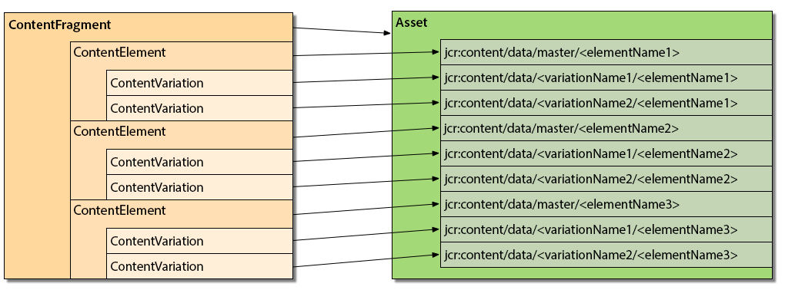

# コンテンツフラグメントのカスタマイズと拡張{#customizing-and-extending-content-fragments}

コンテンツフラグメントは、標準アセットを拡張します。

* コンテンツフラグメントについて詳しくは、[コンテンツフラグメントの作成と管理](/help/assets/content-fragments/content-fragments.md)および[コンテンツフラグメントを使用したページオーサリング](/help/sites-authoring/content-fragments.md)を参照してください。

* 標準アセットについて詳しくは、[アセットの管理](/help/assets/managing-assets-touch-ui.md)および[アセットのカスタマイズと拡張](/help/assets/extending-assets.md)を参照してください。

## アーキテクチャ {#architecture}

コンテンツフラグメントの基本的な[構成要素](/help/assets/content-fragments/content-fragments.md#constituent-parts-of-a-content-fragment)は次のとおりです。

* A *Content Fragment,*
* consisting of one or more *Content Element* s,
* and which can have one or more *Content Variation* s.

フラグメントのタイプによって、モデルまたはテンプレートも使用します。

>[!CAUTION]
>
>[コンテンツフラグメントモデル](/help/assets/content-fragments/content-fragments-models.md)は、すべてのフラグメント作成で使用することが推奨されています。
>
>コンテンツフラグメントモデルは、We.Retail のすべてのサンプルでも使用されています。

* コンテンツフラグメントモデル:

   * 構造化コンテンツを含むコンテンツフラグメントの定義に使用します。
   * コンテンツフラグメントモデルでは、コンテンツフラグメントの作成時にその構造を定義します。
   * フラグメントはモデルを参照するので、モデルに対する変更は、そのモデルに関連付けられているフラグメントにも影響します。
   * モデルはデータタイプで構成されています。
   * 新しいバリエーションを追加するときなどは、それに合わせてフラグメントを更新する必要があります。

   >[!CAUTION]
   >
   >既存のコンテンツフラグメントモデルに変更を加えると、そのモデルに関連付けられているフラグメントに影響が生じる場合があり、対象のフラグメントで孤立プロパティが生まれることもあります。

* コンテンツフラグメントテンプレート：

   * シンプルなコンテンツフラグメントの定義に使用します。
   * テンプレートでは、コンテンツフラグメントの作成時にその構造（基本的なテキストのみ）を定義します。
   * テンプレートは作成時にフラグメントにコピーされるので、それ以降にテンプレートに変更を加えても、既存のフラグメントには反映されません。
   * 新しいバリエーションを追加するときなどは、それに合わせてフラグメントを更新する必要があります。
   * [コンテンツフラグメントテンプレートの動作は](/help/sites-developing/content-fragment-templates.md) 、AEMエコシステム内の他のテンプレート化メカニズムとは異なります（ページテンプレートなど）。 そのため、分けて考える必要があります。
   * テンプレートを基にした場合、コンテンツの MIME タイプは実際のコンテンツに基づいて管理されます。つまり、要素およびバリエーションごとに MIME タイプが異なる場合もあります。

### AEM Assets との統合 {#integration-with-assets}

コンテンツフラグメント管理（CFM）は、次の理由から AEM Assets の一部と考えられます。

* コンテンツフラグメントはアセットである。
* 既存の AEM Assets 機能を使用する。
* AEM Assets に完全に統合されている（Admin Console など）。

#### 構造化コンテンツフラグメントのアセットへのマッピング {#mapping-structured-content-fragments-to-assets}



コンテンツフラグメントモデルがベースの構造化コンテンツフラグメントは、単一のアセットにマッピングされます。

* すべてのコンテンツはアセットの `jcr:content/data` ノードに格納されます。

   * 要素データは次のマスターサブノードに格納されます。
      `jcr:content/data/master`

   * バリエーションは、そのバリエーション名のサブノードに格納されます。
例：`jcr:content/data/myvariation`

   * 各要素のデータは、その要素名のプロパティとしてそれぞれのサブノードに格納されます。
例えば `text` 要素のコンテンツは、`text` プロパティとして `jcr:content/data/master` に格納されます。

* メタデータと関連コンテンツは、`jcr:content/metadata` に格納されます。
ただし、タイトルと説明は従来のメタデータと見なされないので、次の場所に格納されます。 
`jcr:content`

#### シンプルコンテンツフラグメントのアセットへのマッピング {#mapping-simple-content-fragments-to-assets}


テンプレートがベースのシンプルなコンテンツフラグメントは、メインアセットとサブアセット（オプション）の複合にマッピングされます。

* フラグメントのコンテンツ以外の情報（タイトル、説明、メタデータ、構造など）はすべて、メインアセットでのみ管理されます。
* フラグメントの最初の要素のコンテンツは、メインアセットのオリジナルレンディションにマッピングされます。

   * 最初の要素のバリエーション（存在する場合）は、メインアセットのその他のレンディションにマッピングされます。

* 追加要素（存在する場合）は、メインアセットのサブアセットにマッピングされます。

   * これらの追加要素のメインコンテンツは、それぞれのサブアセットのオリジナルレンディションにマッピングされます。
   * すべての追加要素のその他のバリエーション（該当する場合）は、それぞれのサブアセットのその他のレンディションにマッピングされます。

#### アセットの場所 {#asset-location}

標準アセットの場合、コンテンツフラグメントは次の場所に保持されます。

`/content/dam`

#### アセットの権限 {#asset-permissions}

詳しくは、[コンテンツフラグメント - 削除に関する考慮事項](/help/assets/content-fragments/content-fragments-delete.md)を参照してください。

#### 機能の統合 {#feature-integration}

* コンテンツフラグメント管理（CFM）機能は、Assets のコアを基盤として構築されていますが、できる限り独立させる必要があります。
* CFM は、カード／列／リスト表示の項目に独自の実装を提供します。つまり、それらの項目が、既存のアセットコンテンツのレンダリング実装に挿入されます。
* コンテンツフラグメントに対応するために、いくつかのアセットコンポーネントが拡張されています。

### ページでのコンテンツフラグメントの使用 {#using-content-fragments-in-pages}

>[!CAUTION]
>
>[コンテンツフラグメントコアコンポーネント](https://helpx.adobe.com/experience-manager/core-components/using/content-fragment-component.html)が推奨されます。詳しくは、[コアコンポーネントの開発](https://helpx.adobe.com/experience-manager/core-components/using/developing.html)を参照してください。

コンテンツフラグメントは、その他のアセットタイプと同様に、AEM ページから参照できます。AEM では、[****コンテンツフラグメントコアコンポーネント](https://helpx.adobe.com/experience-manager/core-components/using/content-fragment-component.html)を利用できます。これは、[コンテンツフラグメントをページ上に含めることができるコンポーネント](/help/sites-authoring/content-fragments.md#adding-a-content-fragment-to-your-page)です。You can also extend, this** Content Fragment **core component.

* このコンポーネントは、`fragmentPath` プロパティを使用して、実際のコンテンツフラグメントを参照します。`fragmentPath` プロパティは、その他のアセットタイプの類似プロパティと同じ方法で処理されます。例えば、コンテンツフラグメントが別の場所に移動された場合などです。

* このコンポーネントを使用して、表示するバリエーションを選択できます。
* さらに、一定範囲の段落を選択して、出力を制限できます。例えば、複数列の出力に利用できます。
* このコンポーネントは、[中間コンテンツ](/help/sites-developing/components-content-fragments.md#in-between-content)を許可します。

   * ここで、このコンポーネントを使用して、他のアセット（画像など）を参照されているフラグメントの段落の中間に配置できます。
   * 中間コンテンツの場合は、次のことを実行する必要があります。

      * 参照が不安定になる可能性に注意します。中間コンテンツ（ページのオーサリング時に追加）とその横にある段落の関係は、固定されていません。（コンテンツフラグメントエディター内で）中間コンテンツの位置の前に新しい段落を挿入すると、相対的な位置が失われることがあります。
      * 検索結果における偽陽性を回避するために、パラメーター（類似バリエーションや段落フィルターなど）の追加を検討します。

>[!NOTE]
>
>**コンテンツフラグメントモデル：**
>
>ページ上でコンテンツフラグメントモデルを基にしたコンテンツフラグメントを使用している場合は、そのモデルが参照されます。そのため、ページ公開時にモデルが公開されていない場合は、フラグが付けられ、リソースに追加されているモデルがページとともに公開されます。
>
>**コンテンツフラグメントテンプレート：**
>
>ページ上でコンテンツフラグメントテンプレートを基にしたコンテンツフラグメントを使用している場合は、フラグメントの作成時にテンプレートがコピーされるので、参照はおこなわれません。

#### OSGi コンソールを使用した設定 {#configuration-using-osgi-console}

コンテンツフラグメントのバックエンド実装は、ページ上で使用されるフラグメントのインスタンスを検索可能にしたり、複合メディアコンテンツを管理したりする役割を担います。この実装では、フラグメントのレンダリングに使用されるコンポーネントと、レンダリングがパラメーター化される方法を把握する必要があります。

The parameters for this can be configured in the [Web Console](/help/sites-deploying/configuring-osgi.md#osgi-configuration-with-the-web-console), for the OSGi bundle **Content Fragment Component Configuration**.

* **リソースタイプ** Aリスト 
`sling:resourceTypes` コンテンツフラグメントのレンダリングに使用されるコンポーネント、およびバックグラウンド処理の適用先を定義するために提供できます。

* **Reference Properties** プロパティのリストを設定し、それぞれのコンポーネントに対応するフラグメントの参照を格納する場所を指定できます。

>[!NOTE]
>
>プロパティとコンポーネントタイプ間に直接的なマッピングはありません。
>
>AEM では、段落内で最初に検出されたプロパティを利用します。そのため、プロパティは慎重に選択する必要があります。


次のガイドラインに沿って、コンポーネントがコンテンツフラグメントのバックグラウンド処理に対応できるようにする必要があります。

* The name of the property where the element(s) to be rendered is defined must be either `element` or `elementNames`.

* レンダリングされるバリエーションが定義するプロパティの名前は、`variation` または `variationName` にする必要があります。

* If the output of multiple elements is supported (by using `elementNames` to specify multiple elements), the actual display mode is defined by property `displayMode`:

   * If the value is `singleText` (and there is only one element configured) then the element is rendered as a text with in-between content, layout support, etc. レンダリングされる要素が 1 つのみのフラグメントでは、これがデフォルトです。
   * それ以外の場合は、よりシンプルな「フォーム表示」と呼ばれる方法が使用されます。この方法では中間コンテンツがサポートされず、フラグメントコンテンツが「そのまま」表示されます。

* If the fragment is rendered for `displayMode` == `singleText` (implicitly or explicitly) the following additional properties come into play:

   * `paragraphScope` すべての段落をレンダリングするか、段落の範囲のみをレンダリングするかを定義します(値： `all` vs. `range`)

   * if `paragraphScope` == `range` then the property `paragraphRange` defines the range of paragraphs to be rendered

### その他のフレームワークとの統合 {#integration-with-other-frameworks}

コンテンツフラグメントは、次のフレームワークと統合できます。

* **翻訳**

   Content Fragments are fully integrated with the [AEM translation workflow](/help/sites-administering/tc-manage.md). つまり、アーキテクチャレベルでは以下を意味します。

   * コンテンツフラグメントの個々の翻訳は、実際には別々のフラグメントです。例えば、以下のようになります。

      * 言語のルートが異なります。

         `/content/dam/<path>/en/<to>/<fragment>`

         上記に対して次のようになります。

         `/content/dam/<path>/de/<to>/<fragment>`

      * しかし、言語ルートの下では、まったく同じ相対パスを共有しています。

         `/content/dam/<path>/en/<to>/<fragment>`

         上記に対して次のようになります。

         `/content/dam/<path>/de/<to>/<fragment>`
   * ルールベースのパスを除き、コンテンツフラグメントの様々な言語バージョンの間にそれ以上のつながりはありません。UI には言語バリアント間を移動する手段が用意されていますが、それらは 2 つの別々のフラグメントとして扱われます。
   >[!NOTE]
   >
   >AEM 翻訳ワークフローでは、`/content` が使用されます。
   >
   >    * コンテンツフラグメントモデルは `/conf` 内に配置されるので、これらの翻訳には含まれません。[UI 文字列を国際化](/help/sites-developing/i18n-dev.md)できます。
      >
      >    
   * テンプレートをコピーしてフラグメントを作成するので、これは暗黙的になります。


* **メタデータスキーマ**

   * コンテンツフラグメントは、[メタデータのスキーマ](/help/assets/metadata-schemas.md)を（再）利用します。メタデータのスキーマは、標準アセットを使用して定義できます。
   * CFM には、次のような独自の固有のスキーマがあります。

      `/libs/dam/content/schemaeditors/forms/contentfragment`

      必要に応じて拡張できます。

   * 各スキーマフォームは、フラグメントエディターと統合されています。

## コンテンツフラグメント管理 API - サーバー側 {#the-content-fragment-management-api-server-side}

サーバー側 API を使用して、コンテンツフラグメントにアクセスできます。以下を参照してください。

[com.adobe.cq.dam.cfm](https://helpx.adobe.com/experience-manager/6-5/sites/developing/using/reference-materials/javadoc/com/adobe/cq/dam/cfm/package-summary.html)

>[!CAUTION]
>
>コンテンツ構造に直接アクセスする代わりに、サーバー側 API を使用することを強くお勧めします。

### 主要インターフェイス {#key-interfaces}

次の 3 つのインターフェイスが、入口の役割を果たします。

* **フラグメントテンプレート**（[FragmentTemplate](https://helpx.adobe.com/experience-manager/6-5/sites/developing/using/reference-materials/javadoc/com/adobe/cq/dam/cfm/FragmentTemplate.html)）

   Use `FragmentTemplate.createFragment()` for creating a new fragment.

   ```
   Resource templateOrModelRsc = resourceResolver.getResource("...");
   FragmentTemplate tpl = templateOrModelRsc.adaptTo(FragmentTemplate.class);
   ContentFragment newFragment = tpl.createFragment(parentRsc, "A fragment name", "A fragment description.");
   ```

   このインターフェイスは次を表します。

   * コンテンツフラグメントの作成元がコンテンツフラグメントモデルなのか、コンテンツフラグメントテンプレートなのか。
   * そして（作成後）そのフラグメントの構造情報

   この情報の例は次のとおりです。

   * 基本データ（タイトル、説明）にアクセスする
   * フラグメントの要素のテンプレート／モデルにアクセスする

      * 要素テンプレートを一覧表示する
      * 特定の要素の構造に関する情報を取得する
      * 要素テンプレートにアクセスする（`ElementTemplate` を参照）
   * フラグメントのバリエーションのテンプレートにアクセスする

      * バリエーションテンプレートを一覧表示する
      * 特定のバリエーションの構造情報を取得する
      * バリエーションテンプレートにアクセスする（`VariationTemplate` を参照）
   * 初期関連コンテンツを取得する

   重要な情報を表すインターフェイスには、次のものがあります。

   * `ElementTemplate`

      * 基本データ（名前、タイトル）を取得する
      * 初期要素コンテンツを取得する
   * `VariationTemplate`

      * 基本データ（名前、タイトル、説明）を取得する


* **コンテンツフラグメント**（[ContentFragment](https://helpx.adobe.com/experience-manager/6-5/sites/developing/using/reference-materials/javadoc/com/adobe/cq/dam/cfm/ContentFragment.html)）

   このインターフェイスでは、コンテンツフラグメントを抽象化して使用できます。

   >[!CAUTION]
   >
   >このインターフェイスを使用してフラグメントにアクセスすることを強く推奨します。コンテンツ構造を直接変更しないでください。

   このインターフェイスでは、次のことを実行できます。

   * 基本データを管理する（名前の取得、タイトルまたは説明の取得／設定など）
   * メタデータにアクセスする
   * 要素にアクセスする

      * 要素を一覧表示する
      * 要素を名前で取得する
      * 新しい要素を作成する（[注意事項](#caveats)を参照）

      * 要素データにアクセスする（`ContentElement` を参照）
   * そのフラグメントに対して定義されているバリエーションを一覧表示する
   * 新しいバリエーションをグローバルに作成する
   * 関連コンテンツを管理する

      * コレクションを一覧表示する
      * コレクションを追加する
      * コレクションを削除する
   * フラグメントのモデルにアクセスする またはテンプレート

   フラグメントの主要要素を表すインターフェイスには、次のものがあります。

   * **コンテンツ要素**（[ContentElement](https://helpx.adobe.com/experience-manager/6-5/sites/developing/using/reference-materials/javadoc/com/adobe/cq/dam/cfm/ContentElement.html)）

      * 基本データ（名前、タイトル、説明）を取得する
      * コンテンツを取得／設定する
      * 要素のバリエーションにアクセスする

         * バリエーションを一覧表示する
         * バリエーションを名前で取得する
         * 新しいバリエーションを作成する（[注意事項](#caveats)を参照）
         * バリエーションを削除する（[注意事項](#caveats)を参照）
         * バリエーションデータにアクセスする（`ContentVariation` を参照）
      * バリエーションを解決するためのショートカット（要素に指定されたバリエーションを使用できない場合は実装固有の追加のフォールバックロジックを適用）
   * **コンテンツバリエーション**（[ContentVariation](https://helpx.adobe.com/experience-manager/6-5/sites/developing/using/reference-materials/javadoc/com/adobe/cq/dam/cfm/ContentVariation.html)）

      * 基本データ（名前、タイトル、説明）を取得する
      * コンテンツを取得／設定する
      * 最後に変更された情報に基づくシンプルな同期

   3 つのインターフェイス（`ContentVariation`、`ContentFragment`、`ContentElement`、）すべてによって `Versionable` インターフェイスを拡張し、コンテンツフラグメントに必要な次のバージョン管理機能を追加します。

   * 要素の新しいバージョンを作成する
   * 要素のバージョンを一覧表示する
   * バージョン管理されている要素の特定のバージョンのコンテンツを取得する


### 適応 - adaptTo() の使用{#adapting-using-adaptto}

次のものを適応させることができます。

* `ContentFragment` は、次のものに適応させることができます。

   * `Resource`  — 基礎となるスリング資源。 基になるオブジェクトを `Resource` 直接更新する場合は、オブジェクトを再構築する必要があり `ContentFragment` ます。

   * `Asset`  — コンテンツフラグメントを表すDAM `Asset` 抽象。 更新を `Asset` 直接行うには、オブジェクトを再構築する必要があり `ContentFragment` ます。

* `ContentElement` は、次のものに適応させることができます。

   * `ElementTemplate` - 要素の構造に関する情報にアクセスするためのものです。

* `FragmentTemplate` は、次のものに適応させることができます。

   * `Resource` - `Resource` は、参照されているモデルまたはコピーされた元のテンプレートを決定します。

      * `Resource` を使用した変更は、`FragmentTemplate` に自動的に反映されません。

* `Resource` は、次のものに適応させることができます。

   * `ContentFragment`
   * `FragmentTemplate`

### 注意事項 {#caveats}

次のことに注意してください。

* API は、UI がサポートする機能を提供するために実装されています。
* API 全体は、（API JavaDoc で特に記載がない限り）変更を自動では保持&#x200B;**しない**&#x200B;ように設計されています。したがって、各リクエストのリソースリゾルバー（または実際に使用しているリゾルバー）を必ずコミットしなければなりません。
* 次のタスクには、追加作業が必要な場合があります。

   * 新しい要素を作成または削除しても、フラグメントテンプレートに基づくシンプルなフラグメントのデータ構造は更新されません。
   * `ContentElement` から新しいバリエーションを作成してもデータ構造は更新されません（ただし、`ContentFragment` からグローバルに新しいバリエーションを作成すると更新されます）。

   * 既存のバリエーションを削除してもデータ構造は更新されません。

## コンテンツフラグメント管理 API - クライアント側 {#the-content-fragment-management-api-client-side}

>[!CAUTION]
>
>AEM 6.5 では、クライアント側 API は内部用になります。

### 追加情報 {#additional-information}

次のファイルを参照してください。

* `filter.xml`

   コンテンツフラグメント管理のための `filter.xml` は、アセットのコアコンテンツパッケージと重複しないように設定されています。

## 編集セッション {#edit-sessions}

編集セッションは、ユーザーがエディターのいずれかのページでコンテンツフラグメントを開くと開始されます。ユーザーが「**保存**」または「**キャンセル**」を選択してエディターから移動すると、編集セッションは終了します。

### 要件 {#requirements}

編集セッションの制御には、次の要件があります。

* 複数の表示（= HTMLページ）にまたがるコンテンツフラグメントの編集は、アトミックで行う必要があります。
* さらに、編集はトランザクション単位&#x200B;**&#x200B;でおこなう必要があります。すなわち、編集セッションの終了時には、変更をコミット（保存）するか、ロールバック（キャンセル）します。
* エッジケースを適切に処理する必要があります。例としては、ユーザーが手動で URL を入力したりグローバルナビゲーションを使用したりしてページから移動する場合などが考えられます。
* データが失われないよう、定期的な自動保存（x 分ごと）をおこなう必要があります。
* 2 人のユーザーが同時に 1 つのコンテンツフラグメントを編集する場合に、互いの変更を上書きしてはなりません。

#### プロセス {#processes}

次のプロセスが含まれます。

* セッションの開始

   * コンテンツフラグメントの新しいバージョンが作成されます。
   * 自動保存が開始されます。
   * cookie が設定されます。この cookie により、現在編集しているフラグメントと、編集セッションがオープンしていることが記録されます。

* セッションの終了

   * 自動保存が停止されます。
   * コミット時：

      * 最後に変更した情報が反映されます。
      * cookie が削除されます。
   * ロールバックする場合：

      * 編集セッションの開始時に作成されたコンテンツフラグメントのバージョンが復元されます。
      * cookie が削除されます。


* 編集

   * すべての変更（自動保存を含む）は、分離され、保護された領域ではなく、アクティブなコンテンツフラグメントに対して実行されます。
   * したがって、このような変更は、各コンテンツフラグメントを参照する AEM ページに即座に反映されます。

#### アクション {#actions}

使用可能なアクションには次のものがあります。

* ページの入力

   * 対応する cookie を確認して、編集セッションが既に存在するかどうかを確認します。

      * 存在する場合は、編集セッションが現在編集中のコンテンツフラグメント用に開始されたことを確認します。

         * 現在のフラグメント用の場合は、セッションを再確立します。
         * それ以外の場合は、前に編集したコンテンツフラグメント用の編集のキャンセルと、cookie の削除をおこないます（以後、編集セッションは存在しなくなります）。
      * 編集セッションが存在しない場合は、ユーザーが最初の変更をおこなうまで待機します（下記を参照）。
   * コンテンツフラグメントが既にページ上で参照されているかどうかを確認し、参照されている場合は適切な情報を表示します。


* コンテンツ変更

   * Whenever the user changes content and there is no edit session present, a new edit session is created (see [Starting a session](#processes)).

* ページからの移動

   * 編集セッションが存在していて、変更が保持されていない場合は、コンテンツが失われる可能性があることをユーザーに通知し、ページに留まるかどうかを尋ねるモーダル確認ダイアログが表示されます。

## 例 {#examples}

### 例：既存のコンテンツフラグメントへのアクセス {#example-accessing-an-existing-content-fragment}

既存のコンテンツフラグメントにアクセスするには、API を表すリソースを以下に適応させます。

`com.adobe.cq.dam.cfm.ContentFragment`

次に例を示します。

```java
// first, get the resource
Resource fragmentResource = resourceResolver.getResource("/content/dam/fragments/my-fragment");
// then adapt it
if (fragmentResource != null) {
    ContentFragment fragment = fragmentResource.adaptTo(ContentFragment.class);
    // the resource is now accessible through the API
}
```

### 例：新しいコンテンツフラグメントの作成 {#example-creating-a-new-content-fragment}

新しいコンテンツフラグメントをプログラムによって作成するには、以下を使用する必要があります。

`com.adobe.cq.dam.cfm.ContentFragmentManager#create`

次に例を示します。

```java
Resource templateOrModelRsc = resourceResolver.getResource("...");
FragmentTemplate tpl = templateOrModelRsc.adaptTo(FragmentTemplate.class);
ContentFragment newFragment = tpl.createFragment(parentRsc, "A fragment name", "A fragment description.");
```

### 例：自動保存間隔の指定 {#example-specifying-the-auto-save-interval}

自動保存間隔（秒単位）は、設定マネージャー（ConfMgr）を使用して定義できます。

* ノード：`<*conf-root*>/settings/dam/cfm/jcr:content`
* プロパティ名：`autoSaveInterval`
* 型：`Long`

* デフォルト：`600`（10 分）。`/libs/settings/dam/cfm/jcr:content` で定義されています

自動保存間隔を 5 分に設定する場合は、次のようにノードにプロパティを定義する必要があります。

* ノード：`/conf/global/settings/dam/cfm/jcr:content`
* プロパティ名：`autoSaveInterval`

* 型：`Long`

* 値：`300`（5 分は 300 秒です）

## コンテンツフラグメントテンプレート {#content-fragment-templates}

詳しくは、[コンテンツフラグメントテンプレート](/help/sites-developing/content-fragment-templates.md)を参照してください。

## ページオーサリング用コンポーネント {#components-for-page-authoring}

詳しくは、次を参照してください。

* [コアコンポーネント - コンテンツフラグメントコンポーネント](https://helpx.adobe.com/experience-manager/core-components/using/content-fragment-component.html)（推奨）
* [コンテンツフラグメントコンポーネント — ページオーサリング用コンポーネント](/help/sites-developing/components-content-fragments.md#components-for-page-authoring)
