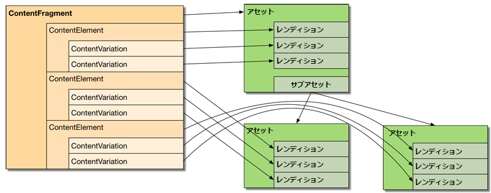

# コンテンツフラグメントのカスタマイズと拡張{#customizing-and-extending-content-fragments}

コンテンツフラグメントは、標準アセットを拡張します。以下を参照してください。

* コンテンツフラグメントについて詳しくは、[コンテンツフラグメントの作成と管理](/help/assets/content-fragments/content-fragments.md)および[コンテンツフラグメントを使用したページオーサリング](/help/sites-authoring/content-fragments.md)を参照してください。

* [アセットの管理](/help/assets/manage-assets.md) および [アセットのカスタマイズと拡張](/help/assets/extending-assets.md) standard assets について詳しくは、を参照してください。

## アーキテクチャ {#architecture}

コンテンツフラグメントの基本的な[構成要素](/help/assets/content-fragments/content-fragments.md#constituent-parts-of-a-content-fragment)は次の通りです。

* *コンテンツフラグメント、*
* コンテンツフラグメントを構成する 1 つ以上の&#x200B;*コンテンツ要素*、
* （場合によっては）1 つ以上の&#x200B;*コンテンツバリエーション*。

フラグメントのタイプによって、モデルまたはテンプレートも使用します。

>[!CAUTION]
>
>[コンテンツフラグメントモデル](/help/assets/content-fragments/content-fragments-models.md)は、すべてのフラグメント作成で使用することが推奨されています。
>
>コンテンツフラグメントモデルは、WKND のすべてのサンプルでも使用されています。

>[!NOTE]
>
>AEM 6.3 以前は、モデルではなくテンプレートに基づいてコンテンツフラグメントを作成していました。
>
>コンテンツフラグメントテンプレートは現在は廃止されています。フラグメントの作成には引き続き使用できますが、代わりにコンテンツフラグメントモデルを使用することをお勧めします。フラグメントテンプレートには新機能は追加されず、今後のバージョンで削除されます。

* コンテンツフラグメントモデル：

   * 構造化コンテンツを格納したコンテンツフラグメントの定義に使用します。
   * コンテンツフラグメントモデルでは、コンテンツフラグメントの作成時にその構造を定義します。
   * フラグメントはモデルを参照するので、モデルに対する変更は、そのモデルに関連付けられているフラグメントにも影響します。
   * モデルはデータタイプで構成されています。
   * 新しいバリエーションを追加する関数などは、それに応じてフラグメントを更新する必要があります。

  >[!CAUTION]
  >
  >既存のコンテンツフラグメントモデルに変更を加えると、そのモデルに関連付けられているフラグメントに影響が生じる場合があり、対象のフラグメントで孤立プロパティが生まれることもあります。

* コンテンツフラグメントテンプレート:

   * シンプルなコンテンツフラグメントの定義に使用します。
   * テンプレートは、コンテンツフラグメントの作成時にその構造（基本的なテキストのみ）を定義します。
   * テンプレートは、作成時にフラグメントにコピーされるので、テンプレートに対するそれ以上の変更は既存のフラグメントには反映されません。
   * 新しいバリエーションを追加する関数などは、それに応じてフラグメントを更新する必要があります。
   * [コンテンツフラグメントテンプレート](/help/sites-developing/content-fragment-templates.md) は、AEMエコシステム内の他のテンプレートメカニズム（ページテンプレートなど）とは異なる方法で動作します。 そのため、分けて考える必要があります。
   * テンプレートに基づいてコンテンツの MIME タイプが実際のコンテンツに基づいて管理されます。つまり、各要素とバリエーションの MIME タイプが異なる場合もあります。

### Assets との統合 {#integration-with-assets}

コンテンツフラグメント管理（CFM）は、次のように AEM Assets の一部です。

* コンテンツフラグメントはアセットです。
* 既存のアセット機能を使用します。
* Assets と完全に統合されています（管理コンソールなど）。

#### 構造化コンテンツフラグメントのアセットへのマッピング {#mapping-structured-content-fragments-to-assets}


コンテンツフラグメントモデルがベースの構造化コンテンツフラグメントは、単一のアセットにマッピングされます。

* すべてのコンテンツはアセットの `jcr:content/data` ノードに格納されます。

   * 要素データは次のプライマリサブノードに格納されます。
     `jcr:content/data/master`

   * バリエーションは、そのバリエーション名のサブノードに格納されます。例：`jcr:content/data/myvariation`

   * 各要素のデータは、その要素名のプロパティとしてそれぞれのサブノードに格納されます。例えば、`text` 要素のコンテンツは、`text` プロパティとして `jcr:content/data/master` に格納されます。

* メタデータと関連コンテンツは、`jcr:content/metadata` に格納されます。
ただし、タイトルと説明は従来のメタデータと見なされないので、次の場所に格納されます。 `jcr:content`

#### シンプルコンテンツフラグメントのアセットへのマッピング {#mapping-simple-content-fragments-to-assets}



単純なコンテンツフラグメント（テンプレートに基づく）は、メインアセットと（オプション）サブアセットで構成される複合にマッピングされます。

* フラグメントのコンテンツ以外の情報（タイトル、説明、メタデータ、構造など）はすべて、メインアセットでのみ管理されます。
* フラグメントの最初の要素のコンテンツは、メインアセットの元のレンディションにマッピングされます。

   * 最初の要素のバリエーション（存在する場合）は、メインアセットの他のレンディションにマッピングされます。

* 追加の要素（既存の場合）は、メインアセットのサブアセットにマッピングされます。

   * これらの追加要素のメインコンテンツは、それぞれのサブアセットのオリジナルレンディションにマッピングされます。
   * 追加の要素のその他のバリエーション（該当する場合）は、それぞれのサブアセットの他のレンディションにマッピングされます。

#### アセットの場所 {#asset-location}

標準アセットの場合、コンテンツフラグメントは次の場所に保持されます。

`/content/dam`

#### アセットの権限 {#asset-permissions}

詳しくは、[コンテンツフラグメント - 削除に関する考慮事項](/help/assets/content-fragments/content-fragments-delete.md)を参照してください。

#### 機能の統合 {#feature-integration}

* コンテンツフラグメント管理 (CFM) 機能は、Assets コアを基に構築されますが、可能な限り独立している必要があります。
* CFM は、カード／列／リスト表示の項目に独自の実装を提供します。つまり、それらの項目が、既存のアセットコンテンツのレンダリング実装に挿入されます。
* コンテンツフラグメントに対応するために、いくつかのアセットコンポーネントが拡張されています。

### ページでのコンテンツフラグメントの使用 {#using-content-fragments-in-pages}

>[!CAUTION]
>
>The [コンテンツフラグメントコアコンポーネント](https://experienceleague.adobe.com/docs/experience-manager-core-components/using/components/content-fragment-component.html?lang=ja) が推奨されました。 詳しくは、[コアコンポーネントの開発](https://experienceleague.adobe.com/docs/experience-manager-core-components/using/developing/overview.html?lang=ja)を参照してください。

コンテンツフラグメントは、他のアセットタイプと同様に、AEM ページから参照できます。AEMが [**コンテンツフラグメント** コアコンポーネント](https://experienceleague.adobe.com/docs/experience-manager-core-components/using/components/content-fragment-component.html?lang=ja) - a [ページにコンテンツフラグメントを組み込むためのコンポーネント](/help/sites-authoring/content-fragments.md#adding-a-content-fragment-to-your-page). この&#x200B;**コンテンツフラグメント**&#x200B;コアコンポーネントを拡張することもできます。

* このコンポーネントは、`fragmentPath` プロパティを使用して、実際のコンテンツフラグメントを参照します。`fragmentPath` プロパティは、その他のアセットタイプの類似プロパティと同じ方法で処理されます。例えば、コンテンツフラグメントが別の場所に移動された場合などです。

* コンポーネントを使用すると、表示するバリエーションを選択できます。
* さらに、出力を制限するために、段落の範囲を選択できます。例えば、複数列の出力に使用できます。
* このコンポーネントは、 [中間コンテンツ](/help/sites-developing/components-content-fragments.md#in-between-content):

   * ここで、コンポーネントを使用して、参照されるフラグメントの段落の間に他のアセット（画像など）を配置できます。
   * 中間コンテンツの場合は、次の操作が必要です。

      * 参照が不安定になる可能性に注意します。中間コンテンツ（ページのオーサリング時に追加）とその横にある段落の関係は、固定されていません。（コンテンツフラグメントエディター内で）中間コンテンツの位置の前に新しい段落を挿入すると、相対的な位置が失われることがあります。
      * 検索結果で誤検出を避けるために、追加のパラメーター（バリエーションや段落フィルターなど）を考慮します。

>[!NOTE]
>
>**コンテンツフラグメントモデル：**
>
>ページ上でコンテンツフラグメントモデルに基づいたコンテンツフラグメントを使用している場合、そのモデルが参照されます。 そのため、ページ公開時にモデルが公開されていない場合は、フラグが付けられ、リソースに追加されているモデルがページとともに公開されます。
>
>**コンテンツフラグメントテンプレート：**
>
>ページ上でコンテンツフラグメントテンプレートを基にしたコンテンツフラグメントを使用している場合は、フラグメントの作成時にテンプレートがコピーされるので、参照は行われません。

#### OSGi コンソールを使用した設定 {#configuration-using-osgi-console}

コンテンツフラグメントのバックエンド実装は、例えば、ページ上で使用されるフラグメントのインスタンスを検索可能にしたり、混在メディアコンテンツを管理したりする役割を果たします。 この実装では、フラグメントのレンダリングに使用されるコンポーネントと、レンダリングがパラメーター化される方法を把握する必要があります。

このパラメーターは、OSGi バンドルの **コンテンツフラグメントコンポーネント設定**&#x200B;用に、[web コンソール](/help/sites-deploying/configuring-osgi.md#osgi-configuration-with-the-web-console)で設定できます。

* **リソースタイプ**
以下のリスト`sling:resourceTypes` を使用して、コンテンツフラグメントのレンダリングに使用するコンポーネントと、バックグラウンド処理を適用する場所を定義できます。

* **Reference Properties**
プロパティのリストを設定し、それぞれのコンポーネントに対応するフラグメントの参照を格納する場所を指定できます。

>[!NOTE]
>
>プロパティとコンポーネントタイプの間に直接マッピングはありません。
>
>AEMは、段落にある最初のプロパティを取るだけです。 そのため、プロパティは慎重に選択する必要があります。


コンテンツフラグメントのバックグラウンド処理にコンポーネントが対応できるように、従う必要のあるガイドラインがまだいくつかあります。

* レンダリングされる要素を定義するプロパティの名前は、`element` または `elementNames` にする必要があります。

* レンダリングされるバリエーションを定義するプロパティの名前は、`variation` または `variationName` にする必要があります。

* 複数の要素の出力がサポートされている（`elementNames` で複数の要素を指定している）場合、実際の表示モードは、`displayMode` プロパティによって定義されます。

   * 値が `singleText` （および 1 つの要素のみが設定されています）その要素は、中間コンテンツ、レイアウトサポートなどを含むテキストとしてレンダリングされます。 これは、1 つの要素のみがレンダリングされるフラグメントのデフォルトです。
   * それ以外の場合は、よりシンプルな方法（「フォームビュー」と呼ばれます）が使用され、中間コンテンツはサポートされず、フラグメントコンテンツは「そのまま」レンダリングされます。

* フラグメントが `displayMode` == `singleText` 用に（暗黙的または明示的に）レンダリングされる場合、次の追加のプロパティも有効になります。

   * `paragraphScope` は、すべての段落をレンダリングするか、特定の範囲の段落のみをレンダリングするかを定義します（値は `all` または `range`）

   * `paragraphScope` == `range` の場合は、プロパティ `paragraphRange` でレンダリングする段落の範囲を定義します。

### その他のフレームワークとの統合 {#integration-with-other-frameworks}

コンテンツフラグメントは、次のものと統合できます。

* **翻訳**

  コンテンツフラグメントは、[AEM の翻訳ワークフロー](/help/sites-administering/tc-manage.md)と完全に統合されています。つまり、アーキテクチャレベルでは以下を意味します。

   * コンテンツフラグメントの個々の翻訳は、次の例のように、実際には別々のフラグメントです。

      * 様々な言語のルートの下に配置されています。

        `/content/dam/<path>/en/<to>/<fragment>`

        上記に対して次のようになります。

        `/content/dam/<path>/de/<to>/<fragment>`

      * ただし、言語ルートの下の相対パスはまったく同じものになります。

        `/content/dam/<path>/en/<to>/<fragment>`

        上記に対して次のようになります。

        `/content/dam/<path>/de/<to>/<fragment>`

   * ルールベースのパスを除き、コンテンツフラグメントの様々な言語バージョンの間にそれ以上のつながりはありません。UI には言語バリアント間を移動する手段が用意されていますが、それらは 2 つの別々のフラグメントとして扱われます。

  >[!NOTE]
  >
  >AEM 翻訳ワークフローでは、`/content` が使用されます。
  >
  >* コンテンツフラグメントモデルは `/conf` 内に配置されるので、これらの翻訳には含まれません。[UI 文字列を国際化](/help/sites-developing/i18n-dev.md)できます。
  >
  >* テンプレートをコピーしてフラグメントを作成するので、これは暗黙的になります。

* **メタデータスキーマ**

   * コンテンツフラグメントは、標準アセットで定義できる[メタデータスキーマ](/help/assets/metadata-schemas.md)を（再）使用します。
   * CFM には、次のような独自の固有のスキーマがあります。

     `/libs/dam/content/schemaeditors/forms/contentfragment`

     必要に応じて拡張できます。

   * 各スキーマフォームは、フラグメントエディターと統合されます。

## コンテンツフラグメント管理 API - サーバーサイド {#the-content-fragment-management-api-server-side}

サーバー側 API を使用して、コンテンツフラグメントにアクセスできます。以下を参照してください。

[com.adobe.cq.dam.cfm](https://www.adobe.io/experience-manager/reference-materials/6-5/javadoc/com/adobe/cq/dam/cfm/package-summary.html)

>[!CAUTION]
>
>コンテンツ構造に直接アクセスする代わりに、サーバーサイド API を使用することを強くお勧めします。

### 主要インターフェイス {#key-interfaces}

次の 3 つのインターフェイスが、入口の役割を果たします。

* **フラグメントテンプレート** ([FragmentTemplate](https://www.adobe.io/experience-manager/reference-materials/6-5/javadoc/com/adobe/cq/dam/cfm/FragmentTemplate.html))

  用途 `FragmentTemplate.createFragment()` フラグメントを作成するために使用します。

  ```
  Resource templateOrModelRsc = resourceResolver.getResource("...");
  FragmentTemplate tpl = templateOrModelRsc.adaptTo(FragmentTemplate.class);
  ContentFragment newFragment = tpl.createFragment(parentRsc, "A fragment name", "A fragment description.");
  ```

  このインターフェイスは次を表します。

   * コンテンツフラグメントの作成元がコンテンツフラグメントモデルなのか、コンテンツフラグメントテンプレートなのか。
   * （作成後の）そのフラグメントの構造に関する情報。

  この情報には次が含まれます。

   * 基本データへのアクセス（タイトル、説明）
   * フラグメントの要素のテンプレート/モデルにアクセスするには、次の手順を実行します。

      * 要素テンプレートのリスト
      * 特定の要素の構造情報を取得する
      * 要素テンプレートにアクセスする（`ElementTemplate` を参照）

   * フラグメントのバリエーションのテンプレートにアクセスするには、次の手順を実行します。

      * バリエーションテンプレートのリスト
      * 特定のバリエーションの構造に関する情報を取得する
      * バリエーションテンプレートにアクセス（`VariationTemplate` を参照）

   * 初期関連コンテンツを取得

  重要な情報を表すインターフェイス：

   * `ElementTemplate`

      * 基本データ（名前、タイトル）を取得する
      * 初期要素コンテンツを取得する

   * `VariationTemplate`

      * 基本データ（名前、タイトル、説明）を取得

* **コンテンツフラグメント**（[ContentFragment](https://www.adobe.io/experience-manager/reference-materials/6-5/javadoc/com/adobe/cq/dam/cfm/ContentFragment.html)）

  このインターフェイスを使用すると、コンテンツフラグメントを抽象的に操作できます。

  >[!CAUTION]
  >
  >このインターフェイスを使用してフラグメントにアクセスすることを強くお勧めします。 コンテンツ構造を直接変更するのは避ける必要があります。

  このインターフェイスでは、次のことを実行できます。

   * 基本データを管理する（名前の取得、タイトルまたは説明の取得／設定など）
   * メタデータへのアクセス
   * 要素にアクセスするには、次の操作を実行します。

      * 要素を一覧表示する
      * 名前で要素を取得する
      * 新しい要素を作成する（[注意事項](#caveats)を参照）

      * 要素データにアクセスする（`ContentElement` を参照）

   * フラグメントに定義されたバリエーションを一覧表示する
   * 新しいバリエーションをグローバルに作成する
   * 関連コンテンツを管理するには、次の操作を実行します。

      * コレクションを一覧表示する
      * コレクションを追加する
      * コレクションを削除する

   * フラグメントのモデルにアクセスするまたはテンプレート

  フラグメントの主要要素を表すインターフェイスは、次のとおりです。

   * **コンテンツ要素**（[ContentElement](https://www.adobe.io/experience-manager/reference-materials/6-5/javadoc/com/adobe/cq/dam/cfm/ContentElement.html)）

      * 基本データ（名前、タイトル、説明）を取得
      * コンテンツを取得／設定する
      * 要素のバリエーションにアクセスするには、次の操作を実行します。

         * バリエーションを一覧表示する
         * 名前でバリエーションを取得する
         * 新しい要素を作成する（[注意事項](#caveats)を参照）
         * バリエーションを削除する（[注意事項](#caveats)を参照）
         * バリエーションデータにアクセスする（`ContentVariation` を参照）

      * バリエーションを解決するためのショートカット（要素に指定されたバリエーションを使用できない場合は実装固有の追加のフォールバックロジックを適用）

   * **コンテンツのバリエーション**（[ContentVariation](https://www.adobe.io/experience-manager/reference-materials/6-5/javadoc/com/adobe/cq/dam/cfm/ContentVariation.html)）

      * 基本データ（名前、タイトル、説明）を取得
      * コンテンツを取得／設定する
      * 最終変更情報に基づく単純な同期

  3 つのインターフェイス（`ContentVariation`、`ContentFragment`、`ContentElement`、）すべてによって `Versionable` インターフェイスを拡張し、コンテンツフラグメントに必要な次のバージョン管理機能を追加します。

   * 要素の新しいバージョンを作成する
   * 要素のバージョンを一覧表示する
   * バージョン管理された要素の特定のバージョンのコンテンツを取得する

### 適応 - adaptTo() の使用  {#adapting-using-adaptto}

次のものを適応させることができます。

* `ContentFragment` は、次のものに適応させることができます。

   * `Resource` - 基になる Sling リソース。基になる `Resource` を直接更新するには、`ContentFragment` オブジェクトを再構築する必要があります。

   * `Asset` - コンテンツフラグメントを表す DAM `Asset` の抽象化。`Asset` を直接更新するには、`ContentFragment` オブジェクトを再構築する必要があります。

* `ContentElement` は、次のものに適応させることができます。

   * `ElementTemplate` - 要素の構造に関する情報にアクセスするためのものです。

* `FragmentTemplate` は、次のものに適応させることができます。

   * `Resource` - `Resource` は、参照されているモデルまたはコピーされた元のテンプレートを決定します。

      * `Resource` を使用した変更は、`FragmentTemplate` に自動的に反映されません。

* `Resource` は、次のものに適応させることができます。

   * `ContentFragment`
   * `FragmentTemplate`

### 注意事項 {#caveats}

次のことに注意してください。

* API は、UI でサポートされる機能を提供するために実装されています。
* API 全体は、（API JavaDoc で特に記載がない限り）変更を自動的に永続化&#x200B;**しない**&#x200B;ように設計されています。したがって、各リクエスト（または実際に使用しているリゾルバー）のリソースリゾルバーを常にコミットする必要があります。
* 追加の作業が必要になる可能性のあるタスクは、次のとおりです。

   * 新しい要素を作成または削除しても、（フラグメントテンプレートに基づく）単純なフラグメントのデータ構造は更新されません。
   * `ContentElement` から新しいバリエーションを作成してもデータ構造は更新されません（ただし、`ContentFragment` からグローバルに新しいバリエーションを作成すると更新されます）。

   * 既存のバリエーションを削除しても、データ構造は更新されません。

## コンテンツフラグメント管理 API - クライアントサイド {#the-content-fragment-management-api-client-side}

>[!CAUTION]
>
>AEM 6.5 では、クライアントサイドの API は内部用になります。

### 追加情報 {#additional-information}

次のファイルを参照してください。

* `filter.xml`

  コンテンツフラグメント管理のための `filter.xml` は、アセットのコアコンテンツパッケージと重複しないように設定されています。

## 編集セッション {#edit-sessions}

編集セッションは、ユーザーがいずれかのエディターページでコンテンツフラグメントを開くと開始されます。 ユーザーが&#x200B;**保存**&#x200B;または&#x200B;**キャンセル**&#x200B;を選択してエディターから移動すると、編集セッションは終了します。

### 要件 {#requirements}

編集セッションを制御するための要件は次のとおりです。

* 複数のビュー（= HTML ページ）にまたがる可能性があるコンテンツフラグメントを編集するときは、原子性を保証する必要があります。
* さらに、編集はトランザクション単位でおこなう必要があります。すなわち、編集セッションの終了時には、変更をコミット（保存）するか、ロールバック（キャンセル）します&#x200B;*。*
* エッジケースは適切に処理する必要があります。例えば、ユーザーが URL を手動で入力するか、グローバルナビゲーションを使用してページを離れる場合などです。
* データの損失を防ぐために、定期的な自動保存（x 分ごと）を使用できます。
* 2 人のユーザーが同時にコンテンツフラグメントを編集した場合、他のユーザーが変更内容を上書きしないようにする必要があります。

#### プロセス {#processes}

関連するプロセスは次のとおりです。

* セッションの開始

   * コンテンツフラグメントの新しいバージョンが作成されます。
   * 自動保存が開始されました。
   * Cookie が設定されます。この cookie により、現在編集しているフラグメントと、オープンな編集セッションが存在していることが定義されます。

* セッションの終了

   * 自動保存が停止しました。
   * コミットする場合：

      * 最終変更日の情報が更新されます。
      * Cookie が削除されます。

   * ロールバック時：

      * 編集セッションの開始時に作成されたコンテンツフラグメントのバージョンが復元されます。
      * Cookie が削除されます。

* 編集

   * すべての変更（自動保存を含む）は、分離された保護された領域ではなく、アクティブなコンテンツフラグメントに対して行われます。
   * したがって、これらの変更は、それぞれのコンテンツフラグメントを参照するAEMページに直ちに反映されます

#### アクション {#actions}

実行可能なアクションは次のとおりです。

* ページの入力

   * 編集セッションが既に存在するかどうかを確認します。それぞれの Cookie を確認します。

      * 存在する場合は、編集セッションが、現在編集中のコンテンツフラグメントに対して開始されたことを確認します

         * 現在のフラグメントの場合は、セッションを再確立します。
         * そうでない場合は、以前に編集したコンテンツフラグメントの編集をキャンセルし、cookie を削除してみます（後で編集セッションが存在しません）。

      * 編集セッションが存在しない場合は、ユーザーが最初におこなった変更を待ちます（以下を参照）。

   * コンテンツフラグメントが既にページで参照されているかどうかを確認し、参照している場合は適切な情報を表示します。

* コンテンツの変更

   * ユーザーがコンテンツを変更し、編集セッションが存在しない場合は必ず、新しい編集セッションが作成されます（[セッションの開始](#processes)を参照）。

* ページからの移動

   * 編集セッションが存在していて、変更が保持されていない場合は、コンテンツが失われる可能性があることをユーザーに通知し、ページに留まるかどうかを尋ねるモーダル確認ダイアログが表示されます。

## 例 {#examples}

### 例：既存のコンテンツフラグメントへのアクセス {#example-accessing-an-existing-content-fragment}

既存のコンテンツフラグメントにアクセスするには、API を表すリソースを以下に適応させます。

`com.adobe.cq.dam.cfm.ContentFragment`

次に例を示します。

```java
// first, get the resource
Resource fragmentResource = resourceResolver.getResource("/content/dam/fragments/my-fragment");
// then adapt it
if (fragmentResource != null) {
    ContentFragment fragment = fragmentResource.adaptTo(ContentFragment.class);
    // the resource is now accessible through the API
}
```

### 例：コンテンツフラグメントの作成 {#example-creating-a-new-content-fragment}

コンテンツフラグメントをプログラムで作成するには、次を使用する必要があります。

`com.adobe.cq.dam.cfm.ContentFragmentManager#create`

次に例を示します。

```java
Resource templateOrModelRsc = resourceResolver.getResource("...");
FragmentTemplate tpl = templateOrModelRsc.adaptTo(FragmentTemplate.class);
ContentFragment newFragment = tpl.createFragment(parentRsc, "A fragment name", "A fragment description.");
```

### 例：自動保存間隔の指定 {#example-specifying-the-auto-save-interval}

自動保存間隔（秒単位）は、設定マネージャー（ConfMgr）を使用して定義できます。

* ノード：`<*conf-root*>/settings/dam/cfm/jcr:content`
* プロパティ名：`autoSaveInterval`
* 型：`Long`

* デフォルト：`600`（10 分）。`/libs/settings/dam/cfm/jcr:content` で定義されています

自動保存間隔を 5 分に設定する場合は、次のようにノードにプロパティを定義する必要があります。

* ノード：`/conf/global/settings/dam/cfm/jcr:content`
* プロパティ名：`autoSaveInterval`

* 型：`Long`

* 値：`300`（5 分は 300 秒です）

## コンテンツフラグメントテンプレート {#content-fragment-templates}

詳しくは、 [コンテンツフラグメントテンプレート](/help/sites-developing/content-fragment-templates.md) を参照してください。

## ページオーサリング用コンポーネント {#components-for-page-authoring}

詳しくは、

* [コアコンポーネント - コンテンツフラグメントコンポーネント](https://experienceleague.adobe.com/docs/experience-manager-core-components/using/components/content-fragment-component.html?lang=ja)（推奨）
* [コンテンツフラグメントコンポーネント - ページオーサリング用コンポーネント](/help/sites-developing/components-content-fragments.md#components-for-page-authoring)
