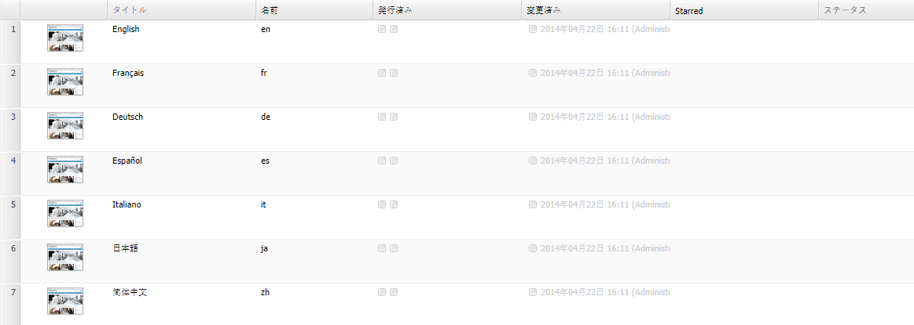

# Web サイトコンソールのカスタマイズ（クラシック UI）{#customizing-the-websites-console-classic-ui}

## Web サイト（サイト管理）コンソールにカスタム列を追加 {#adding-a-custom-column-to-the-websites-siteadmin-console}

カスタム列を表示するように Web サイト管理コンソールを拡張できます。このコンソールは JSON オブジェクトをベースに構築されており、これを拡張するには `ListInfoProvider` インターフェイスを実装する OSGI サービスを作成します。このサービスが、コンソール構築のためにクライアントに送信される JSON オブジェクトを修正します。

このステップバイステップのチュートリアルでは、`ListInfoProvider` インターフェイスを実装して Web サイト管理コンソールに新しい列を表示する方法について説明します。主な手順は次のとおりです。

1. [OSGI サービスを作成](#creating-the-osgi-service)し、そのサービスを含むバンドルを AEM サーバーにデプロイします。
1. （オプション）コンソールの構築に使用される JSON オブジェクトをリクエストする JSON 呼び出しを発行して、[新しいサービスをテスト](#testing-the-new-service)します。
1. リポジトリ内のコンソールのノード構造を拡張して、[新しい列を表示](#displaying-the-new-column)します。

>[!NOTE]
>
>このチュートリアルは、次のような管理コンソールの拡張にも利用できます。
>
>* デジタルアセットコンソール
>* コミュニティコンソール

>


### OSGI サービスの作成 {#creating-the-osgi-service}

`ListInfoProvider` インターフェイスは、次の 2 つのメソッドを定義します。

* リストのグローバルプロパティを更新する `updateListGlobalInfo`
* 単一のリスト項目を更新する `updateListItemInfo`

どちらのメソッドにも次の引数があります。

* `request`：関連付けられた Sling HTTP リクエストオブジェクト
* `info`：更新する JSON オブジェクト。グローバルリストまたは現在のリスト項目に 1 つずつ
* `resource`、Slingリソース。

次の実装例では、

* 各項目に *starred* プロパティを追加します。ページ名が「`true`e *」で始まる場合は*&#x200B;で、それ以外の場合は `false` です。

* *starredCount* プロパティを追加します。このプロパティはリストに対してグローバルで、星印の付いたリスト項目の数が格納されます。

OSGI サービスの作成手順

1. CRXDE Lite で[バンドルを作成します](/help/sites-developing/developing-with-crxde-lite.md#managing-a-bundle)。
1. 次のサンプルコードを追加します。
1. バンドルをビルドします。

新しいサービスが起動し、実行されます。

```java
package com.test;

import com.day.cq.commons.ListInfoProvider;
import com.day.cq.i18n.I18n;
import com.day.cq.wcm.api.Page;
import org.apache.felix.scr.annotations.Component;
import org.apache.felix.scr.annotations.Service;
import org.apache.sling.api.SlingHttpServletRequest;
import org.apache.sling.api.resource.Resource;
import org.apache.sling.commons.json.JSONException;
import org.apache.sling.commons.json.JSONObject;

@Component(metatype = false)
@Service(value = ListInfoProvider.class)
public class StarredListInfoProvider implements ListInfoProvider {

    private int count = 0;

    public void updateListGlobalInfo(SlingHttpServletRequest request, JSONObject info, Resource resource) throws JSONException {
        info.put("starredCount", count);
        count = 0; // reset for next execution
    }

    public void updateListItemInfo(SlingHttpServletRequest request, JSONObject info, Resource resource) throws JSONException {
        Page page = resource.adaptTo(Page.class);
        if (page != null) {
            // Consider starred if page name starts with 'e'
            boolean starred = page.getName().startsWith("e");
            if (starred) {
                count++;
            }
            I18n i18n = new I18n(request);
            info.put("starred", starred ? i18n.get("Yes") : i18n.get("No"));
        }
    }

}
```

>[!CAUTION]
>
>* 指定されたリクエストやリソースに基づいて、情報を JSON オブジェクトに追加すべきかどうかを実装が判断する必要があります。
>* `ListInfoProvider` の実装が、応答オブジェクト内に既に存在するプロパティを定義している場合、そのプロパティの値は、指定した値で上書きされます。

>
>  
[サービスランキング](https://www.osgi.org/javadoc/r2/org/osgi/framework/Constants.html#SERVICE_RANKING)を使用して、複数の `ListInfoProvider` 実装の実行順序を管理できます。

### 新しいサービスのテスト {#testing-the-new-service}

Web サイト管理コンソールを開いてサイトを閲覧すると、ブラウザーがコンソールの構築に使用されている JSON オブジェクトを取得するための ajax 呼び出しを発行します。例えば、`/content/geometrixx`フォルダーを参照すると、AEMサーバーに次の要求が送信され、コンソールが構築されます。

[https://localhost:4502/content/geometrixx.pages.json?start=0&amp;limit=30&amp;predicate=siteadmin](https://localhost:4502/content/geometrixx.pages.json?start=0&amp;limit=30&amp;predicate=siteadmin)

新しいサービスを含むバンドルのデプロイ後に、そのサービスが実行されていることを確認するには、以下をおこないます。

1. ブラウザーで次のURLを指定します。
   [https://localhost:4502/content/geometrixx.pages.json?start=0&amp;limit=30&amp;predicate=siteadmin](https://localhost:4502/content/geometrixx.pages.json?start=0&amp;limit=30&amp;predicate=siteadmin)

1. 応答によって、新しいプロパティが次のように表示されます。


### 新しい列の表示 {#displaying-the-new-column}

最後の手順では、Webサイト管理コンソールのノード構造を適合させ、`/libs/wcm/core/content/siteadmin`をオーバーレイしてすべてのGeometrixxページの新しいプロパティを表示します。 以下の手順を実行します。

1. CRXDE Liteで、ノード構造`/apps/wcm/core/content`をタイプ`sling:Folder`のノードで作成し、構造`/libs/wcm/core/content`を反映します。

1. ノード`/libs/wcm/core/content/siteadmin`をコピーして`/apps/wcm/core/content`の下に貼り付けます。

1. ノード`/apps/wcm/core/content/siteadmin/grid/assets`を`/apps/wcm/core/content/siteadmin/grid/geometrixx`にコピーし、そのプロパティを変更します。

   * **pageText** を削除

   * **pathRegex**&#x200B;を`/content/geometrixx(/.*)?`に設定
これにより、すべてのgeometrixx Webサイトでグリッド設定がアクティブになります。

   * **storeProxySuffix**&#x200B;を`.pages.json`に設定

   * 複数値プロパティ **storeReaderFields** を編集し、`starred` 値を追加します。

   * MSM機能をアクティブ化するには、次のMSMパラメーターをmulti-Stringプロパティ&#x200B;**storeReaderFields**&#x200B;に追加します。

      * **msm:isSource**
      * **msm:isInBlueprint**
      * **msm:isLiveCopy**

1. 追加`/apps/wcm/core/content/siteadmin/grid/geometrixx/columns`の下の`starred`ノード（タイプ&#x200B;**nt:unstructured**）で、次のプロパティが含まれます。

   * **dataIndex**: `starred` 文字列型

   * **header**: `Starred` 文字列型

   * **xtype**: `gridcolumn` 文字列型

1. （オプション）`/apps/wcm/core/content/siteadmin/grid/geometrixx/columns`に表示したくない列をドロップします。

1. `/siteadmin` は、デフォルトでは、を指すバニティパスで `/libs/wcm/core/content/siteadmin`す。これを`/apps/wcm/core/content/siteadmin`上のご使用のバージョンのsiteadminにリダイレクトするには、`/libs/wcm/core/content/siteadmin`上で定義された値より大きい値を持つプロパティ`sling:vanityOrder`を定義します。 デフォルト値は 300 なので、それより大きい値が適しています。

1. Webサイト管理コンソールに移動し、Geometrixxサイトに移動します。
   [https://localhost:4502/siteadmin#/content/geometrixx](https://localhost:4502/siteadmin#/content/geometrixx).

1. 「**Starred**」という新しい列が使用可能になり、次のようにカスタム情報が表示されます。



>[!CAUTION]
>
>**pathRegex** プロパティによって定義されるリクエストパスに複数のグリッド設定が一致する場合は、最も詳しい設定ではなく、最初の設定が使用されます。つまり、設定の順序が重要です。

### サンプルパッケージ  {#sample-package}

このチュートリアルの結果は、パッケージ共有の[Webサイト管理コンソール](https://localhost:4502/crx/packageshare/index.html/content/marketplace/marketplaceProxy.html?packagePath=/content/companies/public/adobe/packages/helper/customizing-siteadmin)パッケージのカスタマイズで確認できます。
