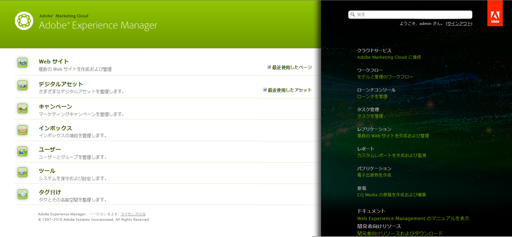
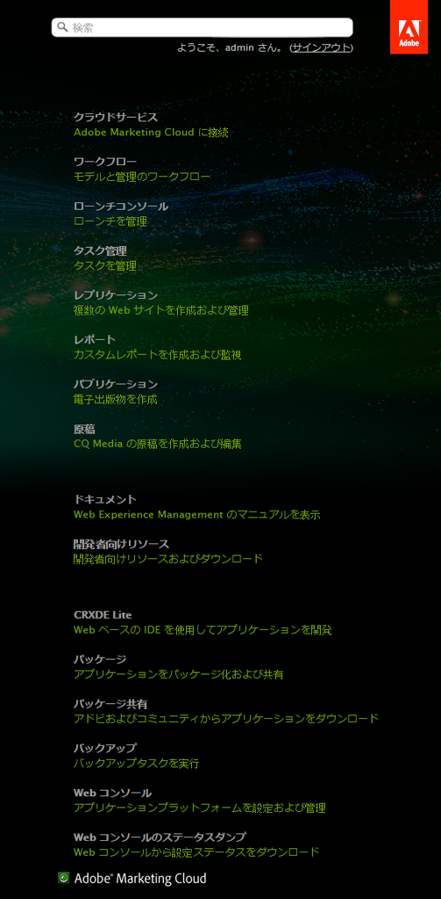

# ようこそコンソールのカスタマイズ（クラシック UI）{#customizing-the-welcome-console-classic-ui}

>[!CAUTION]
>
>このページでは、従来の UI が使用されています。
>
>標準のタッチ操作対応 UI について詳しくは、[コンソールのカスタマイズ](/help/sites-developing/customizing-consoles-touch.md)を参照してください。

ようこそコンソールには、AEM 内の各種コンソールおよび機能へのリンクのリストが表示されます。

表示されるリンクを設定できます。設定は、特定のユーザーまたはグループ向けに定義できます。実行されるアクションは、ターゲットタイプによって異なります（アクションが表示されるコンソールのセクションと相関関係があります）。

* [メインコンソール](#links-in-main-console-left-pane) - メインコンソール（左パネル）のリンク
* [リソース、ドキュメントとリファレンス、機能](#links-in-sidebar-right-pane) - サイドバー（右パネル）のリンク

## メインコンソール（左パネル）のリンク {#links-in-main-console-left-pane}

AEM のメインコンソールが一覧表示されます。

### メインコンソールのリンクを表示するかどうかの設定 {#configuring-whether-main-console-links-are-visible}

ノードレベルでの権限によって、リンクを表示するかどうかが決定されます。次のノードが対象となります。

* **Web サイト:** `/libs/wcm/core/content/siteadmin`

* **デジタルアセット:** `/libs/wcm/core/content/damadmin`

* **コミュニティ：** `/libs/collab/core/content/admin`

* **キャンペーン:** `/libs/mcm/content/admin`

* **インボックス:** `/libs/cq/workflow/content/inbox`

* **ユーザー：** `/libs/cq/security/content/admin`

* **ツール:** `/libs/wcm/core/content/misc`

* **タグ付け:** `/libs/cq/tagging/content/tagadmin`

次に例を示します。

* To restrict access to **Tools**, remove read access from

   `/libs/wcm/core/content/misc`

目的の権限の設定方法について詳しくは、[セキュリティ](/help/sites-administering/security.md)の節を参照してください。

### サイドバー（右パネル）のリンク {#links-in-sidebar-right-pane}

このリンクは、次のパスの下にノードが存在し、読み取りアクセス権があるかどうかに基づいています。**

`/libs/cq/core/content/welcome`

デフォルトでは、次の 3 つのセクションが（少しスペースを空けて）表示されます。

<table>
 <tbody>
  <tr>
   <td><strong>リソース</strong></td>
   <td> </td>
  </tr>
  <tr>
   <td> Cloud Services </td>
   <td><code>/libs/cq/core/content/welcome/resources/cloudservices</code></td>
  </tr>
  <tr>
   <td> ワークフロー</td>
   <td><code>/libs/cq/core/content/welcome/resources/workflows</code></td>
  </tr>
  <tr>
   <td> タスク管理</td>
   <td><code>/libs/cq/core/content/welcome/resources/taskmanager</code></td>
  </tr>
  <tr>
   <td> レプリケーション</td>
   <td><code>/libs/cq/core/content/welcome/resources/replication</code></td>
  </tr>
  <tr>
   <td> レポート</td>
   <td><code>/libs/cq/core/content/welcome/resources/reports</code></td>
  </tr>
  <tr>
   <td> 公開</td>
   <td><code>/libs/cq/core/content/welcome/resources/publishingadmin</code></td>
  </tr>
  <tr>
   <td> 原稿</td>
   <td><code>/libs/cq/core/content/welcome/resources/manuscriptsadmin</code></td>
  </tr>
  <tr>
   <td><strong>ドキュメントとリファレンス</strong></td>
   <td> </td>
  </tr>
  <tr>
   <td> ドキュメント</td>
   <td><code>/libs/cq/core/content/welcome/docs/docs</code></td>
  </tr>
  <tr>
   <td> 開発者リソース</td>
   <td><code>/libs/cq/core/content/welcome/docs/dev</code></td>
  </tr>
  <tr>
   <td><strong>機能</strong></td>
   <td> </td>
  </tr>
  <tr>
   <td> CRXDE Lite</td>
   <td><code>/libs/cq/core/content/welcome/features/crxde</code></td>
  </tr>
  <tr>
   <td> パッケージ</td>
   <td><code>/libs/cq/core/content/welcome/features/packages</code></td>
  </tr>
  <tr>
   <td> パッケージ共有</td>
   <td><code>/libs/cq/core/content/welcome/features/share</code></td>
  </tr>
  <tr>
   <td> クラスター化</td>
   <td><code>/libs/cq/core/content/welcome/features/cluster</code></td>
  </tr>
  <tr>
   <td> バックアップ</td>
   <td><code>/libs/cq/core/content/welcome/features/backup</code></td>
  </tr>
  <tr>
   <td> Web コンソール  </td>
   <td><code>/libs/cq/core/content/welcome/features/config</code></td>
  </tr>
  <tr>
   <td> Web コンソールのステータスダンプ  </td>
   <td><code>/libs/cq/core/content/welcome/features/statusdump</code></td>
  </tr>
 </tbody>
</table>

#### サイドバーのリンクを表示するかどうかの設定 {#configuring-whether-sidebar-links-are-visible}

リンクを表すノードへの読み取りアクセス権を削除することによって、特定のユーザーまたはグループからリンクを非表示にできます。

* リソース — 次へのアクセスを削除：

   `/libs/cq/core/content/welcome/resources/<link-target>`

* ドキュメント — 次へのアクセスを削除：

   `/libs/cq/core/content/welcome/docs/<link-target>`

* 機能 — 次へのアクセスを削除：

   `/libs/cq/core/content/welcome/features/<link-target>`

次に例を示します。

* To remove the link to **Reports**, remove read access from

   `/libs/cq/core/content/welcome/resources/reports`

* To remove the link to **Packages**, remove read access from

   `/libs/cq/core/content/welcome/features/packages`

目的の権限の設定方法について詳しくは、[セキュリティ](/help/sites-administering/security.md)の節を参照してください。

### リンク選択の仕組み {#link-selection-mechanism}

In `/libs/cq/core/components/welcome/welcome.jsp` use is made of [ConsoleUtil](https://helpx.adobe.com/experience-manager/6-5/sites/developing/using/reference-materials/javadoc/com/day/cq/commons/ConsoleUtil.html), which executes a query on nodes that have the property:

* `jcr:mixinTypes` に次の値を入力します。 `cq:Console`

>[!NOTE]
>
>既存のリストを表示するには、次のクエリーを実行します。
>
>* `select * from cq:Console`

>

ユーザーまたはグループが Mixin `cq:Console` を持つノードに対して読み取り権限を持たない場合、そのノードは `ConsoleUtil` 検索で取得されないので、コンソールに表示されません。

### カスタム項目の追加 {#adding-a-custom-item}

[リンク選択メカニズム](#link-selection-mechanism)を使用して、独自のカスタム項目をリンクのリストに追加できます。

Add your custom item to the list by adding the `cq:Console` mixin to your widget or resource. 次のプロパティを定義することによって、追加をおこないます。

* `jcr:mixinTypes` に次の値を入力します。 `cq:Console`

