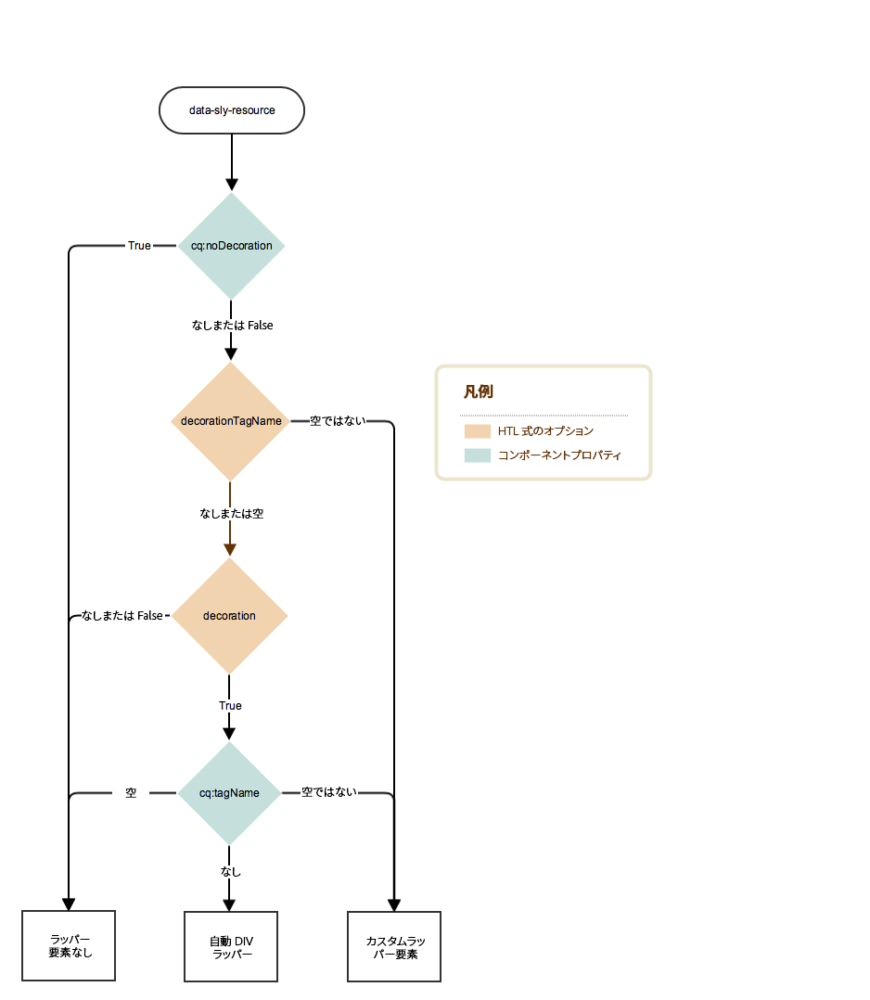

# 装飾タグ   {#decoration-tag}

Web ページのコンポーネントがレンダリングされる際に、レンダリングしたコンポーネントをラッピングする HTML 要素を生成できます。これは主に 2 つの目的を果たします。

* コンポーネントは、HTML 要素でラップされている場合に、編集のみできます。
* ラッピング要素は、次を提供する HTML クラスを適用するために使用されます。

   * レイアウト情報
   * スタイル設定情報

AEM は、開発者向けに、含まれているコンポーネントをラップする装飾タグを制御する明確でシンプルなロジックを提供します。このページで説明する 2 つの要素の組み合わせによって、装飾タグがレンダリングされるかどうかやその方法が定義されます。

* コンポーネント自体がプロパティのセットでその装飾タグを設定できます。
* コンポーネント（HTL、JSP、ディスパッチャーなど）を含むスクリプトは、パラメーターを含めることで装飾タグの側面を定義できます。

## 推奨事項 {#recommendations}

ここでは、予期しない問題の発生を防ぐのに役立つ、ラッパー要素を含めるタイミングに関する一般的な推奨事項を示します。

* ページの CSS および JavaScripts がすべての場合で同じように機能できるように、ラッパー要素の存在が、WCM モード間（編集またはプレビューモード）、インスタンス間（オーサーまたはパブリッシュ）または環境間（ステージングまたは本番）で違わないようにする必要があります。
* ページエディターが適切に初期化および更新できるように、ラッパー要素は、編集可能なすべてのコンポーネントに追加する必要があります。
* 編集できないコンポーネントの場合、特定の機能を提供しないのであれば、ラッパー要素は回避できるので、結果として得られるマークアップは不必要に肥大化しなくなります。

## コンポーネントの制御 {#component-controls}

次のプロパティおよびノードをコンポーネントに適用して、装飾タグの動作を制御できます。

* **`cq:noDecoration {boolean}`**：このプロパティは、コンポーネントに追加できます。true の値は、コンポーネントに対してラッパー要素を生成しないよう AEM を強制します。

* **`cq:htmlTag`ノード：**&#x200B;このノードは、コンポーネントに追加でき、次のプロパティを持つことができます。

   * **`cq:tagName {String}`**：これは、デフォルトのDIV 要素の代わりにコンポーネントをラッピングするために使用されるカスタム HTML タグを指定するために使用できます。
   * **`class {String}`**：これは、ラッパーに追加する css クラス名を指定するために使用できます。
   * 他のプロパティ名は、提供されたのと同じ String 値の HTML 属性として追加されます。

## スクリプトの制御  {#script-controls}

ただし、ラッパーの動作は、要素を含めるために[HTL](/help/sites-developing/decoration-tag.md#htl)または[JSP](/help/sites-developing/decoration-tag.md#jsp)が使用されるかどうかによって異なります。

### HTL {#htl}

通常、HTL のラッパー動作は、次のように要約できます。

* デフォルトでは、ラッパー DIV はレンダリングされない（`data-sly-resource="foo"` のみおこなう場合）。
* すべての wcm モード（オーサーおよびパブリッシュの両方で無効、プレビュー、編集）は同じようにレンダリングされる。

また、ラッパーの動作も完全に制御できます。

* HTL スクリプトは、結果として得られるラッパータグの動作を完全に制御します。
* コンポーネントプロパティ（`cq:noDecoration`、`cq:tagName` など）もラッパータグを定義します。

HTL スクリプトおよびその関連ロジックからラッパータグの動作を完全に制御できます。

HTL での開発について詳しくは、[HTL ドキュメント](https://docs.adobe.com/content/help/ja-JP/experience-manager-htl/using/overview.html)を参照してください。

#### デシジョンツリー {#decision-tree}

このデシジョンツリーは、ラッパータグの動作を決定するロジックの概要を示します。



#### ユースケース {#use-cases}

次の 3 つの使用例は、ラッパータグの処理方法の例です。また、目的のラッパータグの動作を制御するのがいかにシンプルかを説明しています。

すべての例で次のコンテンツ構造およびコンポーネントに従っていると想定しています。

```
/content/test/
  @resourceType = "test/components/one"
  child/
    @resourceType = "test/components/two"
```

```
/apps/test/components/
  one/
    one.html
  two/
    two.html
    cq:htmlTag/
      @cq:tagName = "article"
      @class = "component-two"
```

#### 使用例 1：コードの再利用のためのコンポーネントを含める {#use-case-include-a-component-for-code-reuse}

最も一般的な使用例は、コードの再利用のためにコンポーネントが他のコンポーネントを含む場合です。この場合、含まれるコンポーネントは、独自のツールバーおよびダイアログで編集できる必要はないので、ラッパーは不要で、コンポーネントの `cq:htmlTag` は無視されます。これはデフォルトの動作と見なすことができます。

`one.html: <sly data-sly-resource="child"></sly>`

`two.html: Hello World!`

`/content/test.html` に出力される結果：

**`Hello World!`**

この例は、画像を表示するためのコア画像コンポーネントを含むコンポーネントになります。その場合、通常、コンポーネントが持つすべてのプロパティを表す Map オブジェクトを data-sly-resource に渡すことで、仮想子コンポーネントを含んで構成される合成リソースを使用します。

#### 使用例 2：編集可能なコンポーネントを含める {#use-case-include-an-editable-component}

もうひとつの一般的な使用例は、コンテナコンポーネントがレイアウトコンテナのような編集可能な子コンポーネントを含む場合です。この場合、含まれた各子は、必ずエディターが機能するためのラッパーを必要とします（`cq:noDecoration` プロパティで明示的に無効になっている場合を除く）。

含まれるコンポーネントは、この場合、独立したコンポーネントなので、エディターが機能するためにはラッパー要素が必要で、適用するレイアウトおよびスタイルを定義する必要があります。この動作をトリガーするために、`decoration=true` オプションがあります。

`one.html: <sly data-sly-resource="${'child' @ decoration=true}"></sly>`

`two.html: Hello World!`

`/content/test.html` に出力される結果：

**`<article class="component-two">Hello World!</article>`**

#### 使用例 3：カスタム動作 {#use-case-custom-behavior}

複雑な使用例はいくつもありますが、明示的に次を提供する HTL を利用することで簡単に実現できます。

* **`decorationTagName='ELEMENT_NAME'`**：ラッパーの要素名を定義します。
* **`cssClassName='CLASS_NAME'`**：設定する CSS クラス名を定義します。

`one.html: <sly data-sly-resource="${'child' @ decorationTagName='aside', cssClassName='child'}"></sly>`

`two.html: Hello World!`

`/content/test.html` に出力される結果：

**`<aside class="child">Hello World!</aside>`**

## JSP {#jsp}

`cq:includ`eまたは`sling:include`を使用してコンポーネントを含める場合、AEMのデフォルトの動作では、DIVを使用して要素をラップします。 ただし、このラッピングは 2 つの方法でカスタマイズできます。

* `cq:noDecoration` を使用してコンポーネントをラッピングしないように明示的に AEM に指定します。
* カスタムHTMLタグを使用して、`cq:htmlTag`/ `cq:tagName`または`decorationTagName`を使用してコンポーネントをラップします。

### デシジョンツリー {#decision-tree-1}

次のデシジョンツリーは、`cq:noDecoration`、`cq:htmlTag`、`cq:tagName`および`decorationTagName`がラッパーの動作に与える影響を説明しています。


