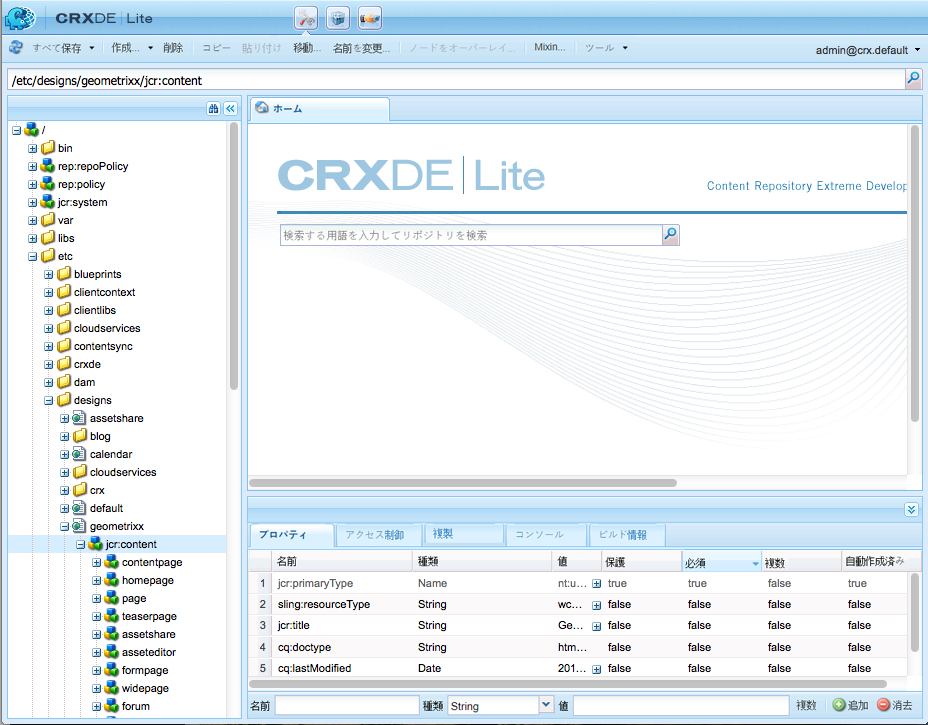

# デザインとデザイナー{#designs-and-the-designer}

>[!CAUTION]
>
>この記事では、クラシックUIを基にしてWebサイトを作成する方法を説明します。 アドビでは、[AEM Sites の開発の手引き](/help/sites-developing/getting-started.md)で詳しく説明しているように、Web サイトに最新の AEM テクノロジーを利用することをお勧めします。

Web サイト用に、また AEM で、デザインの作成が必要になります。その場合はデザイナーを使用します。

>[!NOTE]
>
>Web アクセシビリティについて詳しくは、[AEM と Web アクセシビリティのガイドライン](/help/managing/web-accessibility.md)を参照してください。

## デザイナーの使用 {#using-the-designer}

Your design can be defined in the **designs** section of the **Tools** tab:


ここで、デザインの格納に必要な構造を作成し、必要なカスケーディングスタイルシート（CSS）および画像をアップロードできます。

デザインは、に保存され `/etc/designs`ます。 Webサイトに使用するデザインのパスは、ノードの `cq:designPath` プロパティを使用して指定し `jcr:content` ます。



>[!NOTE]
>
>デザインモードのページ上でおこなわれたすべての変更は、サイトのデザインノードの下に保持され、同じデザインを持つすべてのページに自動的に適用されます。

## 必要なもの {#what-you-will-need}

デザインを実現するには、以下が必要です。

**CSS** — カスケードスタイルシートは、ページ上の特定領域の形式を定義します。
**画像** — 背景、ボタンなどの機能に使用する画像。

### Web サイトをデザインする際の考慮事項 {#considerations-when-designing-your-website}

When developing a website, it is highly recommended to store images and CSS files under `/etc/design/<project>` so you can reference your resources based on the current design like described by the following snippet.

```xml
<%= currentDesign.getPath() + "/static/img/icon.gif %>
```

前述の例では、いくつかのオファーの利点があります。

* 別々のデザインパスを使用しているサイトごとに、コンポーネントのルックアンドフィールを変化させることができます。
* Re-design of the website can be simply done by pointing the design path to a different node at the root of the site from `design/v1` to `design/v2.`

* `/etc/designs` とは、ツリ `/content``/apps` ーの下に何があるかを知りたがる外部ユーザを、ブラウザが保護しているのを見た唯一の外部URLです。 上記のURLの利点は、アセットの公開をいくつかの異なる場所に制限するので、システム管理者がより高いセキュリティを設定するのに役立ちます。

