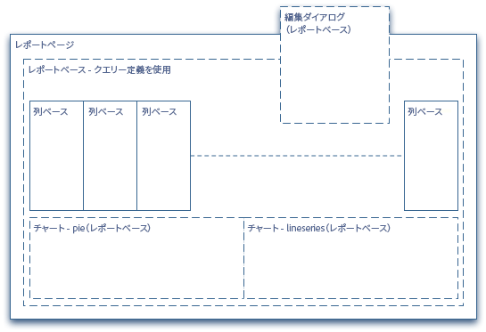
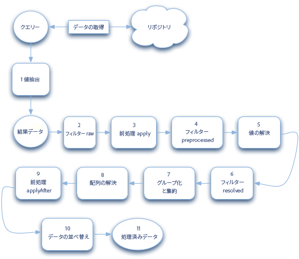

# レポートの開発{#developing-reports}

AEM provides a selection of [standard reports](/help/sites-administering/reporting.md) most of which are based on a reporting framework.

このフレームワークを使用して、これらの標準レポートを拡張することも、まったく新規のレポートを独自に開発することもできます。このレポートフレームワークは、既存のCQ5の概念や原則と密接に統合されているので、開発者は、CQ5に関する既存の知識をレポート作成の基盤として利用できます。

AEMに付属の標準レポートの場合：

* これらのレポートは、次のレポートフレームワークに基づいて作成されます。

   * [コンポーネントのレポート](/help/sites-administering/reporting.md#component-report)
   * [ページアクティビティレポート](/help/sites-administering/reporting.md#page-activity-report)
   * [ユーザーレポート](/help/sites-administering/reporting.md#user-report)
   * [ワークフローインスタンスレポート](/help/sites-administering/reporting.md#workflow-instance-report)

* 次のレポートは、個々の原則に基づいているので、拡張できません。

   * [ディスク使用量](/help/sites-administering/reporting.md#disk-usage)
   * [ヘルスチェック](/help/sites-administering/reporting.md#health-check)
   * [ワークフローレポート](/help/sites-administering/reporting.md#workflow-report)

>[!NOTE]
>
>[独自のレポートの作成 - 例](#creating-your-own-report-an-example)のチュートリアルでも、以下で説明する原理のうち使用できるものを示しています。
>
>標準レポートを参照し、他の実装例を確認することもできます。

>[!NOTE]
>
>以下の例と定義は、次の表記法を使用しています。
>
>* 各行は、次のようなノードまたはプロパティを定義します。
   >
   >  
* `N:<name> [<nodeType>]`
   >
   >     
   Describes a node with the name of `<*name*>` and node type of `<*nodeType*>`*.*
   >
   >  
* `P:<name> [<propertyType]`
   >
   >     
   Describes a property with the name of `<*name*>` and a property type of `<*propertyType*>`.
   >
   >  
* `P:<name> = <value>`
   >
   >     
   Describes a property `<name>` that must be set to the value of `<value>`.
   >
   >
* インデントは、ノード間の階層的な依存関係を示します。
>* 項目区切り|は可能なリストを表します。例えば、次のようなタイプや名前があります。
>
>  
e.g. `String|String[]` means that the property can be either String or String[].
>
>* `[]` 配列を表し例えば、文字列[] 、またはノードの配列( [クエリ定義](#query-definition))。
>
>
特に断りのない限り、デフォルトのタイプは次のとおりです。
>
>* ノード数 - `nt:unstructured`
>* プロパティ - `String`


## レポートフレームワーク {#reporting-framework}

レポートフレームワークは、次のような原理で使用されます。

* CQ5 QueryBuilder が実行するクエリによって返される結果セットに、完全に基づいています。
* 結果セットは、レポートに表示されるデータを定義します。 結果セットの各行は、レポートの表形式表示の行に対応します。
* 結果セットで実行できる操作は、RDBMSの概念と似ています。主にグル *ープ化* と集 *計です*。

* データの取得と処理は、ほとんどサーバー側でおこなわれます。
* クライアントは、事前に処理されたデータの表示の責任を負います。 小さな処理タスク（例えば、セルのコンテンツにリンクを作成する）のみがクライアント側で実行されます。

レポートフレームワーク（標準レポートの構造で示される）は、次の構築ブロックを使用し、処理キューによって供給されます。



### レポートページ {#report-page}

レポートページ：

* 標準のCQ5ページです。
* [レポート用に設定された CQ5 の標準テンプレート](#report-template)に基づいています。

### レポートベース {#report-base}

[`reportbase` コンポーネント](#report-base-component)は、次のようにすべてのレポートの基礎となるものです。

* 基になる結果セットのデータを提供する[クエリ](#the-query-and-data-retrieval)の定義を保持します。

* レポートに追加されるすべての列()を含む、適 `columnbase`応した段落システムです。
* 使用可能なチャートタイプおよび現在アクティブなチャートタイプを定義します。
* ユーザーがレポートの特定の要素を設定できる[編集]ダイアログを定義します。

### 列ベース {#column-base}

各列は、次のコンポーネントのインスタ [ ン `columnbase` スで](#column-base-component) す。

* は、各レポートのparsys ()で使 `reportbase`用される段落です。
* 基になる結果セットへのリ [ンクを定義します](#the-query-and-data-retrieval)。例えば、この結果セット内で参照される特定のデータと、その処理方法を定義します。
* 追加の定義を保持します。(使用可能な集計やフィルター、およびデフォルト値など)。

### クエリとデータの取得 {#the-query-and-data-retrieval}

クエリの概要は次のとおりです。

* [`reportbase`](#report-base) コンポーネントの一部として定義されます。
* [CQ QueryBuilder](https://helpx.adobe.com/experience-manager/6-5/sites/developing/using/reference-materials/javadoc/com/day/cq/search/QueryBuilder.html) に基づいています。
* レポートの基礎として使用するデータを取得します。 結果セット（テーブル）の各行が、ノードに 1 つずつ関連付けられ、クエリから返されます。次に、個々の列に関 [する特定の情報が](#column-base-component) 、このデータセットから抽出されます。

* 通常、次のデータから構成されます。

   * ルートパス。

      これにより、検索対象とするリポジトリのサブツリーが指定されます。

      パフォーマンスの低下を最小限にするため、クエリの対象をリポジトリの特定のサブツリーになるべく制限することをお勧めします。このルートパスは、[レポートテンプレート](#report-template)で事前定義するか、または[設定（編集）ダイアログ](#configuration-dialog)でユーザーが設定することができます。

   * [1 つ以上の条件](#query-definition)。

      これらは、（最初の）結果セットの生成時に適用されます。ノードタイプの制限や、プロパティの制限などがあります。

**重要な点は、クエリの結果セットに返されるノードを 1 つ使用して、レポートの行が 1 つ生成される（ノードと行は 1 対 1 の関係にある）ことです。**

開発者は、レポートに対して定義したクエリによって、そのレポートに適切なノードセットが返されることを確認する必要があります。ただし、ノード自体に必要な情報をすべて保持する必要はなく、親ノードや子ノードから派生させることもできます。 例えば、[ユーザーレポート](/help/sites-administering/reporting.md#user-report)で使用されるクエリでは、ノードタイプ（この場合は `rep:user`）に基づいてノードが選択されます。ただし、このレポートのほとんどの列は、これらのノードから直接データを取得せず、子ノードからデータを取得しま `profile`す。

### Processing Queue {#processing-queue}

[クエリ](#the-query-and-data-retrieval)によって返される結果セットのデータが、レポート上で行として表示されます。結果セットの各行は、（サーバー側の）[いくつかのフェーズ](#phases-of-the-processing-queue)で処理をおこなってから、クライアントに転送され、レポートに表示されます。

次のような操作が可能です。

* 基になる結果セットからの複数の値の抽出や取得。

   例えば、2 つのプロパティ値の差を計算することで、その 2 つの値を 1 つの値として処理できます。

* 抽出した値の解決。様々な方法でおこなうことができます。

   例えば、パスをタイトル（対応する *jcr:title* プロパティの、わかりやすいコンテンツ）にマップできます。

* 様々なポイントでフィルターを適用する。
* 必要に応じて、複合値を作成します。

   例えば、ユーザーに表示されるテキストから、値を作成してソートに使用したり、追加の URL を作成して（クライアント側で）リンクの作成に使用したりできます。

#### 処理キューのワークフロー {#workflow-of-the-processing-queue}

処理キューのワークフローを以下に示します。



#### 処理キューのフェーズ {#phases-of-the-processing-queue}

具体的な手順と要素は次のとおりです。

1. Transforms the results returned by the [initial query (reportbase)](#query-definition) into the basic result set using value extractors.

   値抽出は、[列のタイプ](#column-specific-definitions)によって自動的に選択されます。値抽出を使用して、基になる JCR クエリから値を読み取り、その値から結果セットを作成し、その後の処理で適用できるようにします。例えば、タイプの場合、値 `diff` 抽出器は2つのプロパティを読み取り、1つの値を計算して結果セットに追加します。 値抽出を構成できません。

1. 生データを含むこの初期結果セットに、[初期フィルター](#column-specific-definitions)（*raw* フェーズ）が適用されます。

1. *apply* フェーズの定義に従い、値が[前処理](#processing-queue)されます。

1. 前処理された値に対して、[フィルタリング](#column-specific-definitions)（*preprocessed* フェーズに割り当てられています）が実行されます。

1. [指定されたリゾルバー](#processing-queue)によって、値が解決されます。
1. 解決された値に対して、[フィルタリング](#column-specific-definitions)（*resolved* フェーズに割り当てられています）が実行されます。

1. データはグルー [プ化され、集計されます](#column-specific-definitions)。
1. 配列データは、（文字列ベースの）リストに変換されます。

   この手順は、複数の値を持つ結果をリストに変換して表示できるようにする暗黙の手順です。複数の値を持つ JCR プロパティに基づいた（集計されていない）セル値が必要です。

1. Values are again [preprocessed](#processing-queue); as defined for the *afterApply* phase.

1. データが並べ替えられます。
1. 処理されたデータがクライアントに転送されます。

>[!NOTE]
>
>基になるデータの結果セットを返す初期クエリは、`reportbase` コンポーネントで定義されます。
>
>処理キューの他の要素は、コンポーネント上で定義さ `columnbase` れます。

## レポートの構成と設定 {#report-construction-and-configuration}

レポートの構成および設定には、次の要素が必要です。

* [独自のレポートコンポーネントの定義で使用する場所](#location-of-report-components)
* 構成 [ 要 `reportbase` 素](#report-base-component)
* 1 つ以上の [`columnbase` コンポーネント](#column-base-component)
* [ページコンポーネント](#page-component)
* [レポートデザイン](#report-design)
* [レポートテンプレート](#report-template)

### レポートコンポーネントの場所 {#location-of-report-components}

The default reporting components are held under `/libs/cq/reporting/components`.

However, it is strongly recommended that you do not update these nodes, but create your own component nodes under `/apps/cq/reporting/components` or if more appropriate `/apps/<yourProject>/reports/components`.

定義（例）は次のとおりです。

```
N:apps
    N:cq [nt:folder]
        N:reporting|reports [sling:Folder]
            N:components [sling:Folder]
```

この下にレポートのルートを作成し、このルート下にレポートベースコンポーネントおよび列ベースコンポーネントを作成します。

```
N:apps
    N:cq [nt:folder]
        N:reporting|reports [sling:Folder]
            N:components [sling:Folder]
                N:<reportname> [sling:Folder]
                        N:<reportname> [cq:Component]  // report base component
                        N:<columnname> [cq:Component]  // column base component
```

### ページコンポーネント {#page-component}

A report page must use the `sling:resourceType` of `/libs/cq/reporting/components/reportpage`.

ページコンポーネントのカスタマイズは、（ほとんどの場合）必要ありません。

## レポートベースコンポーネント {#report-base-component}

Each report type requires a container component derived from `/libs/cq/reporting/components/reportbase`.

このコンポーネントは、レポート全体のコンテナとして使用され、次の情報が含まれます。

* [クエリ定義](#query-definition)。
* レポート設定用の[（オプションの）ダイアログ](#configuration-dialog)。
* レポートに組み込まれる[チャート](#chart-definitions)。

```
N:<reportname> [cq:Component]
    P:sling:resourceSuperType = "cq/reporting/components/reportbase"
    N:charting
    N:dialog [cq:Dialog]
    N:queryBuilder
```

### クエリ定義 {#query-definition}

```xml
N:queryBuilder
    N:propertyConstraints
    [
        N:<name> // array of nodes (name irrelevant), each with the following properties:
            P:name
            P:value
    ]
    P:nodeTypes [String|String[]]
    P:mandatoryProperties [String|String[]
  ]
```

* `propertyConstraints`

   特定のプロパティと値を持つノードのみを結果セットに含める場合に使用できます。複数の制限が指定された場合、含まれるノードはこれらすべての制限を満たす（AND 演算による）必要があります。

   次に例を示します。

   ```
   N:propertyConstraints
    [
    N:0
    P:sling:resourceType
    P:foundation/components/textimage
    N:1
    P:jcr:modifiedBy
    P:admin
    ]
   ```

   ユーザーが最後に変 `textimage` 更したすべてのコンポーネントを返 `admin` します。

* `nodeTypes`

   指定したノードタイプのみを結果セットに含める場合に使用します。複数のノードタイプを指定できます。

* `mandatoryProperties`

   指定したプロパティをすべて持つノードのみを結果セットに含める場合に使用できます。**&#x200B;プロパティの値は考慮されません。

すべてはオプションで、必要に応じて組み合わせることができますが、少なくとも1つは定義する必要があります。

### チャート定義 {#chart-definitions}

```xml
N:charting
    N:settings
        N:active [cq:WidgetCollection]
        [
            N:<name> // array of nodes, each with the following property
                P:id   // must match the id of a child node of definitions
        ]
    N:definitions [cq:WidgetCollection]
    [
        N:<name> // array of nodes, each with the following properties
            P:id
            P:type
            // additional, chart type specific configurations
    ]
```

* `settings`

   アクティブなグラフの定義を保持します。

   * `active`

      複数の設定を定義できるので、これを使用して現在アクティブなノードを定義できます。These are defined by an array of nodes (there is no compulsory naming convention for these nodes, but the standard reports often use `0`, `1`.. `x`), each having the following property:

      * `id`

         アクティブなグラフのID。 チャート定義（`definitions`）のいずれかのチャートの ID に一致する必要があります。

* `definitions`

   レポートでの使用が可能なチャートタイプを定義します。`definitions` のうち使用されるタイプが、`active` で指定されます。

   The definitions are specified using an array of nodes (again often named `0`, `1`.. `x`), each having the following properties:

   * `id`

      グラフID。

   * `type`

      使用可能なグラフのタイプ。 次から選択：

      * `pie`円グラフ。現在のデータからのみ生成されます。

      * `lineseries`線系列（実際のスナップショットを表す点をつないだもの）履歴データからのみ生成されます。
   * グラフのタイプに応じて、追加のプロパティを使用できます。

      * for the chart type `pie`:

         * `maxRadius` ( `Double/Long`)

            この円グラフで許容される半径の最大値、つまりこのチャートで許容される最大サイズ（凡例を使用しない場合）。Ignored if `fixedRadius` is defined.

         * `minRadius` ( `Double/Long`)

            円グラフで許容される最小半径です。 Ignored if `fixedRadius` is defined.

         * `fixedRadius` ( `Double/Long`)円グラフの固定半径を定義します。
      * for the chart type [`lineseries`](/help/sites-administering/reporting.md#display-limits):

         * `totals` ( `Boolean`)

            True if an additional line showing the **Total** should be shown.
デフォルト値: `false`

         * `series` ( `Long`)

            表示する行/系列の数。
デフォルト：`9`（この値は許容される最大値です）

         * `hoverLimit` ( `Long`)

            ポップアップを表示する集計スナップショット（個別の値を表す各横線に表示されるドット）の最大数。例えば、グラフの凡例内の個別の値または対応するラベルにマウスを移動したときに表示されます。

            デフォルト：`35`（現在のチャート設定で適用される個別の値が 35 個を超える場合は、ポップアップが表示されません）。

            このほかに、同時表示できるポップアップ数（凡例のテキストにマウスオーバーしたときに表示できる複数のポップアップ）を 10 個までに制限できます。


### 設定ダイアログ {#configuration-dialog}

各レポートには設定ダイアログが表示され、ユーザーはレポートの様々なパラメーターを指定できます。 このダイアログは、レポートページが開い **ているとき** 、「編集」ボタンからアクセスできます。

このダイアログは標準のCQダ [イアログ](/help/sites-developing/components-basics.md#dialogs) で、標準のCQダイアログとして設定できます(詳細は [CQ.Dialog](https://helpx.adobe.com/experience-manager/6-5/sites/developing/using/reference-materials/widgets-api/index.html?class=CQ.Dialog) を参照)。

ダイアログの例を次に示します。

```xml
<?xml version="1.0" encoding="UTF-8"?>
<jcr:root xmlns:cq="https://www.day.com/jcr/cq/1.0" xmlns:jcr="https://www.jcp.org/jcr/1.0"
    jcr:primaryType="cq:Dialog"
    height="{Long}424">
    <items jcr:primaryType="cq:WidgetCollection">
        <props jcr:primaryType="cq:Panel">
            <items jcr:primaryType="cq:WidgetCollection">
                <title
                    jcr:primaryType="cq:Widget"
                    path="/libs/cq/reporting/components/commons/title.infinity.json"
                    xtype="cqinclude"/>
                <description
                    jcr:primaryType="cq:Widget"
                    path="/libs/cq/reporting/components/commons/description.infinity.json"
                    xtype="cqinclude"/>
                <rootPath
                    jcr:primaryType="cq:Widget"
                    fieldLabel="Root path"
                    name="./report/rootPath"
                    rootPath=""
                    rootTitle="Repository root"
                    xtype="pathfield"/>
                <processing
                    jcr:primaryType="cq:Widget"
                    path="/libs/cq/reporting/components/commons/processing.infinity.json"
                    xtype="cqinclude"/>
                <scheduling
                    jcr:primaryType="cq:Widget"
                    path="/libs/cq/reporting/components/commons/scheduling.infinity.json"
                    xtype="cqinclude"/>
            </items>
        </props>
    </items>
</jcr:root>
```

いくつかの事前設定されたコンポーネントを使用できます。`xtype` プロパティに値 `cqinclude` を指定して、これらのコンポーネントをダイアログで参照できます。

* **`title`**

   `/libs/cq/reporting/components/commons/title`

   レポートのタイトルを定義するテキストフィールド。

* **`description`**

   `/libs/cq/reporting/components/commons/description`

   レポートの説明を定義するテキスト領域。

* **`processing`**

   `/libs/cq/reporting/components/commons/processing`

   レポートの処理モード（データを手動または自動で読み込む）のセレクター。

* **`scheduling`**

   `/libs/cq/reporting/components/commons/scheduling`

   履歴グラフのスナップショットをスケジュールするためのセレクターです。

>[!NOTE]
>
>The referenced components must be included using the `.infinity.json` suffix (see example above).

### ルートパス {#root-path}

このほか、レポートのルートパスを指定することもできます。

* **`rootPath`**

   レポートの対象を、リポジトリの特定のセクション（ツリーまたはサブツリー）に限定できます。パフォーマンスの最適化のために、限定することをお勧めします。このルートパスは、各レポートページの `rootPath` ノードの `report` プロパティで指定します（ページの作成時、テンプレートから取得されます）。

   次の方法で指定できます。

   * レポ [ートテンプレート](#report-template) （固定値または設定ダイアログのデフォルト値）。
   * ユーザー（このパラメーターを使用）

## 列ベースコンポーネント {#column-base-component}

各列タイプには、から派生するコンポーネントが必要で `/libs/cq/reporting/components/columnbase`す。

列コンポーネントは、次の組み合わせを定義します。

* [列固有のクエリ](#column-specific-query)の設定。
* [リゾルバーと前処理](#resolvers-and-preprocessing)。
* [列固有の定義](#column-specific-definitions)（フィルターや集計など。`definitions` の子ノード）。
* [列のデフォルト値](#column-default-values)。
* サーバーによって返されるデータから、表示する情報を抽出するための[クライアントフィルター](#client-filter)。
* 以上のほか、列コンポーネントの `cq:editConfig` で適切なインスタンスを指定し、必要な[イベントとアクション](#events-and-actions)を指定する必要があります。
* [一般列](#generic-columns)の設定。

```
N:<columnname> [cq:Component]
    P:componentGroup
    P:jcr:title
    P:sling:resourceSuperType = "cq/reporting/components/columnbase"
    N:cq:editConfig [cq:EditConfig] // <a href="#events-and-actions">Events and Actions</a>
    N:defaults // <a href="#column-default-values">Column Default Values</a>
    N:definitions
      N:queryBuilder // <a href="#column-specific-query">Column Specific Query</a>
        P:property [String|String[]] // Column Specific Query
        P:subPath // Column Specific Query
        P:secondaryProperty [String|String[]] // Column Specific Query
        P:secondarySubPath // Column Specific Query
      N:data
        P:clientFilter [String] // <a href="#client-filter">Client Filter</a>
        P:resolver // <a href="#resolvers-and-preprocessing">Resolvers and Preprocessing</a>
        N:resolverConfig // Resolvers and Preprocessing
        N:preprocessing // Resolvers and Preprocessing
      P:type // <a href="#column-specific-definitions">Column Specific Definitions</a>
      P:groupable [Boolean] // Column Specific Definitions
      N:filters [cq:WidgetCollection] // Column Specific Definitions
      N:aggregates [cq:WidgetCollection] // Column Specific Definitions
```

[新規レポートの定義](#defining-your-new-report)も参照してください。

### 列固有のクエリ {#column-specific-query}

個別の列で使用する特定のデータを（[レポートデータの結果セット](#the-query-and-data-retrieval)から）抽出する方法を定義します。

```xml
N:definitions
    N:queryBuilder
        P:property [String|String[]]
        P:subPath
        P:secondaryProperty [String|String[]]
        P:secondarySubPath
```

* `property`

   セルの実値の計算に使用するプロパティを指定します。

   If property is defined as String[] multiple properties are scanned (in sequence) to find the actual value.

   例えば、次の場合です。

   `property = [ "jcr:lastModified", "jcr:created" ]`

   対応する値抽出（ここで制御）は、次の処理を行います。

   * 有効な jcr:lastModified プロパティが存在するかどうかを確認し、存在する場合はそのプロパティを使用します。
   * jcr:lastModifiedプロパティを使用できない場合は、jcr:createdの内容が代わりに使用されます。

* `subPath`

   クエリによって返されるノードに結果を配置しない場合、このプロパティを実際に配置する場所を `subPath` で指定します。

* `secondaryProperty`

   セルの実値の計算に必要な、2 つ目のプロパティを定義します。このプロパティは、特定の列のタイプ（diff および sortable）でのみ使用されます。

   例えばワークフローインスタンスレポートの場合、開始時間と終了時間の時間差（ミリ秒単位）の実値を格納するときに使用するプロパティを指定できます。

* `secondarySubPath`

   Similar to subPath, when `secondaryProperty` is used.

ほとんどの場合、`property` のみを使用します。

### クライアントフィルター {#client-filter}

クライアントフィルタは、サーバから返されたデータから表示する情報を抽出する。

>[!NOTE]
>
>このフィルタは、サーバー側処理全体が適用された後、クライアント側で実行されます。

```xml
N:definitions
    N:data
        P:clientFilter [String]
```

`clientFilter` は、JavaScript 関数として、次のように定義されます。

* を入力として受け取り、1つのパラメータを受け取ります。サーバーから返されるデータ（処理が完全に行われている）
* 出力時、フィルターを適用した後の（処理後の）値を返します。返すデータは、入力時のデータから抽出または取得したものです。

次の例では、コンポーネントのパスから対応するページパスが抽出されます。

```
function(v) {
    var sepPos = v.lastIndexOf('/jcr:content');
    if (sepPos < 0) {
        return v;
    }
    return v.substring(sepPos + '/jcr:content'.length, v.length);
}
```

### リゾルバーと前処理 {#resolvers-and-preprocessing}

[処理キュー](#processing-queue)で様々なリゾルバーを指定し、前処理を設定します。

```xml
N:definitions
    N:data
        P:resolver
        N:resolverConfig
        N:preprocessing
            N:apply
            N:applyAfter
```

* `resolver`

   使用するリゾルバーを定義します。 次のリゾルバーを使用できます。

   * `const`

      値を他の値にマップします。例えば `en` などの定数を、対応する値 `English` に解決できます。

   * `default`

      デフォルトのリゾルバーです。 これは、実際には何も解決しないダミーのリゾルバーです。

   * `page`

      パスの値を、対応するページのパス（正確には、対応する `jcr:content` ノード）に解決します。例えば、はに解決 `/content/.../page/jcr:content/par/xyz` されます `/content/.../page/jcr:content`。

   * `path`

      パスの値にオプションとしてサブパスを付加し、解決されたパスにあるノードのプロパティ（`resolverConfig` で指定）から実値を取得することで、パスの値を解決します。例えば、の値をプロ `path` パテ `/content/.../page/jcr:content` ィのコンテンツに解決でき `jcr:title` る場合、これはページパスがページタイトルに解決されることを意味します。

   * `pathextension`

      パスを先頭に付加し、解決されたパスのノードのプロパティから実値を取得することで、値を解決します。例えば、国コードを言 `de` 語の説明に解決するために、値の前に、例えば `/libs/wcm/core/resources/languages`、プロパティから値を取得するパスを付ける `language`ことができます `de``German`。

* `resolverConfig`

   リゾルバーの定義をおこないます。以下のうち使用できるオプションは、`resolver` の選択によって決まります。

   * `const`

      プロパティを使用して、解決する定数を指定します。プロパティの名前で、解決する定数を指定します。プロパティの値で、解決後の値を指定します。

      For example a property with **Name**= `1` and **Value** `=One` will resolve 1 to One.

   * `default`

      設定が使用できません。

   * `page`

      * `propertyName` (オプション)

         値の解決に使用するプロパティの名前を指定します。指定しなかった場合、 *jcr:title* （ページタイトル）のデフォルト値が使用されます。リゾルバ `page` ーの場合、最初にパスがページパスに解決され、次にページタイトルに解決されます。
   * `path`

      * `propertyName` (オプション)

         値の解決に使用するプロパティの名前を指定します。指定しなかった場合、のデフォルト値が使 `jcr:title` 用されます。

      * `subPath` (オプション)

         このプロパティは、値を解決する前にパスに付加する接尾辞を指定するときに使用します。
   * `pathextension`

      * `path` (mandatory)

         先頭に付加するパスを指定します。

      * `propertyName` (mandatory)

         実際の値が存在する解決済みパスのプロパティを定義します。

      * `i18n` （オプション）type Boolean)

         Determines whether the resolved value should be *internationalized* (i.e. using [CQ5&#39;s internationalization services](/help/sites-administering/tc-manage.md)).


* `preprocessing`

   Preprocessing is optional and can be bound (separately) to the processing phases *apply* or *applyAfter*:

   * `apply`

      初期の前処理フェーズ（[処理キューの説明での手順 3](#processing-queue)）に適用。

   * `applyAfter`

      前処理後（[処理キューの説明での手順 9](#processing-queue)）に適用。

#### リゾルバー {#resolvers}

リゾルバーは、必要な情報の抽出に使用されます。 様々なリゾルバーの例を次に示します。

**定数**

次の式は、の定数値を文字列 `VersionCreated` に解決します `New version created`。

参照先 `/libs/cq/reporting/components/auditreport/typecol/definitions/data`.

```xml
N:data
    P:resolver=const
    N:resolverConfig
        P:VersionCreated="New version created"
```

**ページ**

対応するページのjcr:content（子）ノードのjcr:descriptionプロパティへのパス値を解決します。

参照先 `/libs/cq/reporting/components/compreport/pagecol/definitions/data`.

```xml
N:data
    P:resolver=page
    N:resolverConfig
        P:propertyName="jcr:description"
```

**パス**

次の例は、プロパティのコ `/content/.../page` ンテンツのパスを解決 `jcr:title` します。これは、ページパスがページタイトルに解決されることを意味します。

参照先 `/libs/cq/reporting/components/auditreport/pagecol/definitions/data`.

```xml
N:data
    P:resolver=path
    N:resolverConfig
        P:propertyName="jcr:title"
        P:subPath="/jcr:content"
```

**パスの拡張**

次の例では、パス拡張子の付い `de` た値の前に値を付 `/libs/wcm/core/resources/languages`加し、プロパティから値を取得して、国コードを言 `language`語の説明に `de` 解決します `German`。

参照先 `/libs/cq/reporting/components/userreport/languagecol/definitions/data`.

```xml
N:data
    P:resolver=pathextension
    N:resolverConfig
        P:path="/libs/wcm/core/resources/languages"
        P:propertyName="language"
```

#### 前処理 {#preprocessing}

`preprocessing` の定義は、次のどちらかに適用できます。

* 元の値：

   The preprocessing definition for the original value is specified on `apply` and/or `applyAfter` directly.

* の値を集計した状態で表示します。

   必要に応じて、集計ごとに別々の定義を指定できます。

   To specify explicit preprocessing for aggregated values, the preprocessing definitions have to reside on a respective `aggregated` child node ( `apply/aggregated`, `applyAfter/aggregated`). 個別の集計に対して、前処理を明示的に指定する必要がある場合は、各集計の名前が付いた子ノード（例えば `apply/aggregated/min/max` などの集計）で前処理の定義をおこなう必要があります。

前処理中に使用する次のいずれかを指定できます。

* [パターンの検索と置換](#preprocessing-find-and-replace-patterns)検索後、指定したパターン（正規表現として指定）を他のパターンに置き換えます。例えば、元の値からサブ文字列を抽出するときに使用できます。

* [データ型フォーマッター](#preprocessing-data-type-formatters)

   Converts a numeric value into a relative string; for example, the value ``representing a time difference of 1 hour would be resolved to a string such as `1:24PM (1 hour ago)`.

次に例を示します。

```xml
N:definitions
    N:data
        N:preprocessing
            N:apply|applyAfter
                P:pattern         // regex
                P:replace         // replacement for regex
                // and/or
                P:format          // data type formatter
```

#### 前処理 - パターンの検索と置換 {#preprocessing-find-and-replace-patterns}

前処理の場合、配置され `pattern` てパターンで置き換えら [れる](https://en.wikipedia.org/wiki/Regular_expression) (正規式またはregexとして定義される)を指定でき `replace` ます。

* `pattern`

   サブ文字列の検索に使用する正規表現。

* `replace`

   元の文字列の置き換えに使用する文字列、または文字列の表現。通常、`pattern` の正規表現によって検索される文字列のサブ文字列を示します。

置換の例は、次のように分類できます。

* 次の2つのプロパテ `definitions/data/preprocessing/apply` ィを持つノードの場合：

   * `pattern`: `(.*)(/jcr:content)(/|$)(.*)`
   * `replace`: `$1`

* 次のような文字列が検索されます。

   * `/content/geometrixx/en/services/jcr:content/par/text`

* 次の4つのセクションに分類されます。

   * `$1` - `(.*)` - `/content/geometrixx/en/services`
   * `$2` - `(/jcr:content)` - `/jcr:content`
   * `$3` - `(/|$)` - `/`
   * `$4` - `(.*)` - `par/text`

* 次に示す文字列に置き換えま `$1`す。

   * `/content/geometrixx/en/services`

#### 前処理 - データタイプフォーマッター {#preprocessing-data-type-formatters}

これらのフォーマッターは、数値を相対文字列に変換します。

例えば、これは、、およびを許可する時間列に使 `min`用で `avg` き `max` ます。 `min`/ `avg`/ `max` 集計は時 *間差として表示* (の場合、デ `10 days ago`ータフォーマッタが必要です。 この場合、フォーマ `datedelta` ッターが/ `min`/集計値に `avg`適用 `max` されます。 集計も使 `count` 用可能な場合は、フォーマッタは不要で、元の値も必要ありません。

現在、次のデータ型フォーマッタを使用できます。

* `format`

   データタイプフォーマッター：

   * `duration`

      期間は、2つの定義された日付の間の期間です。 例えば、ワークフローアクションの開始から終了までの時間を 1 時間とした場合、開始を 2011 年 2 月 13 日 11 時 23 分とすると、終了は 1 時間後の 2011 年 2 月 13 日 12 時 23 分となります。

      It converts a numeric value (interpreted as milliseconds) into a duration string; for example, `30000` is formatted as * `30s`.*

   * `datedelta`

      過去の日付から「現在」までのタイムスパンです（したがって、レポートを後の時点で表示すると、結果が異なります）。

      数値（日単位の時間差として解釈）が、対応する日付の文字列に変換されます。例えば、1 という値は 1 日前にフォーマットされます。

The following example defines `datedelta` formatting for `min` and `max` aggregates:

```xml
N:definitions
    N:data
        N:preprocessing
            N:apply
                N:aggregated
                    N:min
                        P:format = "datedelta"
                    N:max
                        P:format = "datedelta"
```

### 列固有の定義 {#column-specific-definitions}

列固有の定義は、その列で使用できるフィルターや集計を指定するものです。

```xml
N:definitions
    P:type
    P:groupable [Boolean]
    N:filters [cq:WidgetCollection]
    [
        N:<name> // array of nodes (names irrelevant) with the following properties:
            P:filterType
            P:id
            P:phase
    ]
    N:aggregates [cq:WidgetCollection]
    [
        N:<name> // array of nodes (names irrelevant) with the following properties:
            P:text
            P:type
    ]
```

* `type`

   標準オプションとして使用できるものは次のとおりです。

   * `string`
   * `number`
   * `int`
   * `date`
   * `diff`
   * `timeslot`

      日付から、集計に必要な部分を抽出する場合（例えば年でグループ化し、年ごとに集計したデータを取得する場合）に使用します。

   * `sortable`

      異なる値（異なるプロパティの値）を使用してソートし、表示できる値に適用します。
   それに加えて. any of the above can be defined as multi value; for example, `string[]` defines an array of strings.

   値抽出は、列のタイプによって選択されます。値抽出が列タイプで使用可能な場合は、この抽出が使用されます。 それ以外の場合は、デフォルト値の抽出が使用されます。

   タイプには、（オプションとして）パラメーターを指定できます。例えば、日付フ `timeslot:year` ィールドから年を抽出します。 パラメータを使用したタイプ：

   * `timeslot`  — 値は、の対応する定数と比較できます `java.utils.Calendar`。

      * `timeslot:year` - `Calendar.YEAR`
      * `timeslot:month-of-year` - `Calendar.MONTH`
      * `timeslot:week-of-year` - `Calendar.WEEK_OF_YEAR`
      * `timeslot:day-of-month` - `Calendar.DAY_OF_MONTH`
      * `timeslot:day-of-week` - `Calendar.DAY_OF_WEEK`
      * `timeslot:day-of-year` - `Calendar.DAY_OF_YEAR`
      * `timeslot:hour-of-day` - `Calendar.HOUR_OF_DAY`
      * `timeslot:minute-of-hour` - `Calendar.MINUTE`


* `groupable`

   レポートをこの列でグループ化できるかどうかを指定します。

* `filters`

   フィルターの定義。

   * `filterType`

      使用可能なフィルターは次のとおりです。

      * `string`

         文字列ベースのフィルター。
   * `id`

      フィルター識別子。

   * `phase`

      利用可能なフェーズ：

      * `raw`

         フィルターは生データに適用されます。

      * `preprocessed`

         フィルターは、事前に処理されたデータに適用されます。

      * `resolved`

         フィルターは解決されたデータに適用されます。


* `aggregates`

   集計定義。

   * `text`

      テキストの集計名。 `text` の指定がない場合、集計のデフォルトの説明が使用されます。例えば `minimum` 集計の場合、`min` が使用されます。

   * `type`

      集計タイプ。 使用可能な集計は次のとおりです。

      * `count`

         行数を数えます。

      * `count-nonempty`

         空でない行の数を数えます。

      * `min`

         最小値を指定します。

      * `max`

         最大値を指定します。

      * `average`

         平均値を提供します。

      * `sum`

         すべての値の合計を示します。

      * `median`

         中央値を提供します。

      * `percentile95`

         各値の 95 パーセンタイル値を求めます。

### 列のデフォルト値 {#column-default-values}

列のデフォルト値の定義を次に示します。

```xml
N:defaults
    P:aggregate
```

* `aggregate`

   Valid `aggregate` values are the same as for `type` under `aggregates` (see [Column Specific Definitions (definitions - filters / aggregates)](#column-specific-definitions) ).

### イベントおよびアクション {#events-and-actions}

編集設定を使用して、リスナーが検出する必要のあるイベントおよびそのイベント発生後に適用するアクションを定義できます。背景情報につい [ては、コンポーネント開発の概要](/help/sites-developing/components.md) を参照してください。

必要なアクションがすべて実行されるようにするには、次の値を指定します。

```xml
N:cq:editConfig [cq:EditConfig]
    P:cq:actions [String[]] = "insert", "delete"
    P:cq:dialogMode = "floating"
    P:cq:layout = "auto"
    N:cq:listeners [cq:EditListenersConfig]
        P:aftercreate = "REFRESH_INSERTED"
        P:afterdelete = "REFRESH_SELF"
        P:afteredit = "REFRESH_SELF"
        P:afterinsert = "REFRESH_INSERTED"
        P:aftermove = "REFRESH_SELF"
        P:afterremove = "REFRESH_SELF"
```

### 一般列 {#generic-columns}

汎用列とは、（ほとんどの）列定義が（コンポーネントノードではなく）列ノードのインスタンスに保存される拡張です。

各汎用コンポーネントの（標準）ダイアログを使用してカスタマイズします。 このダイアログを使用して、レポートのユーザーがレポートページ上の一般列のプロパティを指定できます（「**列のプロパティ...**」のメニューオプションを使用）。

An example is the **Generic** column of the **User Report**; see `/libs/cq/reporting/components/userreport/genericcol`.

列を汎用にするには：

* 列のノ `type` ードのプロパティをに設 `definition` 定します `generic`。

   参照先 `/libs/cq/reporting/components/userreport/genericcol/definitions`

* 列の `definition` ノードで、（標準）ダイアログの定義をおこないます。

   参照先 `/libs/cq/reporting/components/userreport/genericcol/definitions/dialog`

   * ダイアログのフィールドが、対応するコンポーネントプロパティと同じ名前（パスを含む）を参照する必要があります。

      For example, if you want to make the type of the generic column configurable through the dialog, use a field with the name of `./definitions/type`.

   * UI（ダイアログ）を使用して指定されるプロパティは、`columnbase` コンポーネントで指定されるプロパティより優先されます。

* 編集設定を定義します。

   参照先 `/libs/cq/reporting/components/userreport/genericcol/cq:editConfig`

* 標準的なAEMの方法を使用して、列のプロパティを定義（追加）します。

   プロパティがコンポーネントインスタンスと列インスタンスの両方で指定されている場合、列インスタンスの値が優先されることに注意してください。

   一般列で使用できるプロパティは次のとおりです。

   * `jcr:title`  — 列名
   * `definitions/aggregates` -集計
   * `definitions/filters` - filters
   * `definitions/type`— 列のタイプ（これは、ダイアログで、セレクター/コンボボックスまたは非表示フィールドを使用して定義する必要があります）
   * `definitions/data/resolver` および `definitions/data/resolverConfig` (またはで `definitions/data/preprocessing` はなく `.../clientFilter`) — リゾルバと設定
   * `definitions/queryBuilder` -クエリビルダの設定
   * `defaults/aggregate`  — デフォルトの集計
   「**ユーザーレポート**」の一般列に新しいインスタンスを作成した場合、ダイアログで指定されるプロパティは次の場所に保持されます。

   `/etc/reports/userreport/jcr:content/report/columns/genericcol/settings/generic`

## レポートデザイン {#report-design}

このデザインでは、レポートの作成に使用できる列のタイプを定義します。 列を追加する段落システムも定義します。

各レポートに個別のデザインを作成することを強くお勧めします。 これにより、最大限の柔軟性が確保されます。 [新規レポートの定義](#defining-your-new-report)も参照してください。

The default reporting components are held under `/etc/designs/reports`.

レポートの格納場所は、独自のコンポーネントを配置した場所によって次のいずれかになります。

* `/etc/designs/reports/<yourReport>` が `/apps/cq/reporting`

* `/etc/designs/<yourProject>/reports/<*yourReport*>` (パターンを使用したレポート `/apps/<yourProject>/reports` 用)

必要なデザインプロパティは、次の `jcr:content/reportpage/report/columns` 場所に登録されま `/etc/designs/reports/<reportName>/jcr:content/reportpage/report/columns`す（例：）。

* `components`

   レポートで使用できるコンポーネントやコンポーネントグループ。

* `sling:resourceType`

   値を持つプロパテ `cq/reporting/components/repparsys`ィ。

デザインスニペットの例を次に示します（コンポーネントレポートのデザインから取得）。

```xml
<!-- ... -->
    <jcr:content
        jcr:primaryType="nt:unstructured"
        jcr:title="Component Report"
        sling:resourceType="wcm/core/components/designer">
        <reportpage jcr:primaryType="nt:unstructured">
            <report jcr:primaryType="nt:unstructured">
                <columns
                    jcr:primaryType="nt:unstructured"
                    sling:resourceType="cq/reporting/components/repparsys"
                    components="group:Component Report"/>
            </report>
        </reportpage>
    </jcr:content>
<!-- ... -->
```

個々の列に対してデザインを指定する必要はありません。 使用可能な列は、デザインモードで定義できます。

>[!NOTE]
>
>標準のレポートデザインは変更しないことをお勧めします。 これは、ホットフィックスのアップグレードやインストール時に変更が失われないようにするためです。
>
>標準レポートをカスタマイズする場合は、レポートとそのデザインをコピーしてください。

>[!NOTE]
>
>デフォルトの列は、レポートの作成時に自動的に作成できます。 これらはテンプレートで指定されます。

## レポートテンプレート {#report-template}

各レポートタイプにはテンプレートが必要です。 これらは標準の [CQテンプレートで](/help/sites-developing/templates.md) 、そのように設定できます。

テンプレートは次の要件を満たす必要があります。

* set the `sling:resourceType` to `cq/reporting/components/reportpage`

* 使用する設計を示す
* プロパティ `report` を使用してコンテナ( `reportbase`)コンポーネントを参照する子ノードを作成 `sling:resourceType` する

テンプレートスニペットの例を次に示します（コンポーネントレポートテンプレートから取得）。

```xml
<!-- ... -->
    <jcr:content
        cq:designPath="/etc/designs/reports/compreport"
        jcr:primaryType="cq:PageContent"
        sling:resourceType="cq/reporting/components/reportpage">
        <report
            jcr:primaryType="nt:unstructured"
            sling:resourceType="cq/reporting/components/compreport/compreport"/>
    </jcr:content>
<!-- .. -->
```

（ユーザーレポートテンプレートから取得した）ルートパスの定義を示すテンプレートスニペットの例を次に示します。

```xml
<!-- ... -->
    <jcr:content
        cq:designPath="/etc/designs/reports/userreport"
        jcr:primaryType="cq:PageContent"
        sling:resourceType="cq/reporting/components/reportpage">
        <report
            jcr:primaryType="nt:unstructured"
            rootPath="/home/users"
            sling:resourceType="cq/reporting/components/compreport/compreport"/>
    </jcr:content>
<!-- .. -->
```

The default reporting templates are held under `/libs/cq/reporting/templates`.

However, it is strongly recommended that you do not update these nodes, but create your own component nodes under `/apps/cq/reporting/templates` or if more appropriate `/apps/<yourProject>/reports/templates`.

定義例は次のとおりです（[レポートコンポーネントの場所](#location-of-report-components)も参照）。

```xml
N:apps
    N:cq [nt:folder]
        N:reporting|reports [sling:Folder]
            N:templates [sling:Folder]
```

この場所に、テンプレートのルートを作成します。

```xml
N:apps
    N:cq [nt:folder]
        N:reporting|reports [sling:Folder]
            N:templates [sling:Folder]
                N:<reportname> [sling:Folder]
```

## 独自のレポートの作成 - 例 {#creating-your-own-report-an-example}

### 新しいレポートの定義 {#defining-your-new-report}

新しいレポートを定義するには、以下を作成して設定する必要があります。

1. レポートコンポーネントのルート
1. レポートベースコンポーネント
1. 1 つ以上の列ベースコンポーネント
1. レポートデザイン
1. レポートテンプレートのルート
1. レポートテンプレート

これらの手順を説明するために、次の例では、リポジトリ内のすべてのOSGi設定をリストするレポートを定義しています。つまり、ノードのすべてのインスタン `sling:OsgiConfig` ス。

>[!NOTE]
>
>既存のレポートをコピーして新しいバージョンにカスタマイズすることもできます。

1. 新しいレポートのルートノードを作成します。

   例えば、の下で `/apps/cq/reporting/components/osgireport`す。

   ```xml
   N:cq [nt:folder]
       N:reporting [sling:Folder]
           N:components [sling:Folder]
               N:osgireport [sling:Folder]
   ```

1. レポートベースを定義します。例えば、 `osgireport[cq:Component]` の下 `/apps/cq/reporting/components/osgireport`。

   ```xml
   N:osgireport [sling:Folder]
       N:osgireport [cq:Component]
           P:sling:resourceSuperType [String] = "cq/reporting/components/reportbase"
           N:charting [nt:unstructured]
               N:settings [nt:unstructured]
                   N:active [cq:WidgetCollection]
                       N:0 [nt:unstructured]
                           P:id [String] = "pie"
                       N:1 [nt:unstructured]
                           P:id [String] = "lineseries"
               N:definitions [cq:WidgetCollections]
                   N:0 [nt:unstructured]
                       P:id [String] = "pie"
                       P:maxRadius [Long] = 180
                       P:type [String] = "pie"
                   N:1 [nt:unstructured]
                       P:id [String] = "lineseries"
                       P:type [String] = "lineseries"
           N:dialog [cq:Dialog]
               P:height [Long] = 424
               N:items [cq:WidgetCollection]
                   N:props [cq:Panel]
                       N:items [cq:WidgetCollection]
                           N:title [cq:Widget]
                               P:path [String] = "/libs/cq/reporting/components/commons/title.infinity.json"
                               P:xtype [String] = "cqinclude"
                           N:description [cq:Widget]
                               P:path [String] = "/libs/cq/reporting/components/commons/description.infinity.json"
                               P:xtype [String] = "cqinclude"
                           N:rootPath [cq:Widget]
                               P:fieldLabel [String] = "Root path"
                               P:name [String] = "./report/rootPath"
                               P:xtype [String] = "pathfield"
                           N:processing [cq:Widget]
                               P:path [String] = "/libs/cq/reporting/components/commons/processing.infinity.json"
                               P:xtype [String] = "cqinclude"
                           N:scheduling [cq:Widget]
                               P:path [String] = "/libs/cq/reporting/components/commons/scheduling.infinity.json"
                               P:xtype [String] = "cqinclude"
           N:queryBuilder [nt:unstructured]
               P:nodeTypes [String[]] = "sling:OsgiConfig"
   ```

   これは、次のようなレポートの基本コンポーネントを定義します。

   * searches for all nodes of type `sling:OsgiConfig`
   * displays both `pie` and `lineseries` charts
   * ユーザーがレポート設定できるダイアログを提供する

1. 最初の列（columnbase）コンポーネントを定義します。例えば、 `bundlecol[cq:Component]` の下 `/apps/cq/reporting/components/osgireport`。

   ```xml
   N:osgireport [sling:Folder]
       N:bundlecol [cq:Component]
           P:componentGroup [String] = "OSGi Report"
           P:jcr:title = "Bundle"
           P:sling:resourceSuperType [String] = "cq/reporting/components/columnbase"
           N:cq:editConfig [cq:EditConfig]
               P:cq:actions [String[]] = "insert", "delete"
               P:cq:dialogMode [String] = "floating"
               P:cq:layout [String] = "auto"
               N:cq:listeners [cq:EditListenersConfig]
                   P:aftercreate [String] "REFRESH_INSERTED"
                   P:afterdelete [String] "REFRESH_SELF"
                   P:afteredit [String] "REFRESH_SELF"
                   P:afterinsert [String] "REFRESH_INSERTED"
                   P:aftermove [String] "REFRESH_SELF"
                   P:afterremove [String] "REFRESH_SELF"
           N:defaults [nt:unstructured]
               P:aggregate [String] = "count"
           N:definitions [nt:unstructured]
               P:groupable [Boolean] = false
               P:type [String] = "string"
               N:queryBuilder [nt:unstructured]
                   P:property [String] = "jcr:path"
   ```

   これは、次のような列の基本コンポーネントを定義します。

   * サーバーから受信する値（この場合、`jcr:path` の各ノードの `sling:OsgiConfig` プロパティ）を検索し、その値を返す
   * provides the `count` aggregate
   * グループ化はできない
   * タイトル（テーブル内の列タイトル）は `Bundle`
   * is in the sidekick group `OSGi Report`
   * 指定のイベントで更新される
   >[!NOTE]
   >
   >この例では、との定義はありま `N:data` せん `P:clientFilter`。 これは、サーバーから受け取った値が1:1単位で返されるためです。これがデフォルトの動作です。
   >
   >これは定義と同じです。
   >
   >
   ```
   >N:data [nt:unstructured]
   >   P:clientFilter [String] = "function(v) { return v; }"
   >```
   >
   >関数は受け取った値を返すだけです。

1. レポートデザインを定義します。例えば、 `osgireport[cq:Page]` の下 `/etc/designs/reports`。

   ```xml
   N:osgireport [cq:Page]
       N:jcr:content [nt:unstructured]
           P:jcr:title [String] = "OSGi report"
           P:sling:resourceType [String] = "wcm/core/components/designer"
           N:reportpage [nt:unstructured]
               N:report [nt:unstructured]
                   N:columns [nt:unstructured]
                       P:components [String] = "group:OSGi Report"
                       P:sling:resourceType [String] = "cq/reporting/components/repparsys"
   ```

1. 新しいレポートテンプレートのルートノードを作成します。

   例えば、の下で `/apps/cq/reporting/templates/osgireport`す。

   ```xml
   N:cq [nt:folder]
       N:reporting [sling:Folder]
           N:templates [sling:Folder]
               N:osgireport [cq:Template]
   ```

1. レポートテンプレートを定義します。例えば、 `osgireport[cq:Template]` の下 `/apps/cq/reporting/templates`。

   ```xml
   N:osgireport [cq:Template]
       P:allowedPaths [String[]] = "/etc/reports(/.*)?"
       P:jcr:description [String] = "Use this report generator to create a new OSGi report."
       P:jcr:title [String] = "OSGi Report Template"
       P:ranking [Long] = 100
       P:shortTitle [String] = "OSGi Report"
       N:jcr:content [cq:PageContent]
           P:cq:designPath [String] = "/etc/designs/reports/osgireport"
           P:sling:resourceType [String] = "cq/reporting/components/reportpage"
           N:report [nt:unstructured]
               P:rootPath [String] = "/"
               P:sling:resourceType [String] = "cq/reporting/components/osgireport/osgireport"
       N:thumbnail.png [nt:file]
   ```

   これは、次のようなテンプレートを定義します。

   * defines the `allowedPaths` for the resulting reports - in the above case anywhere under `/etc/reports`
   * テンプレートのタイトルと説明を指定する
   * テンプレートリストで使用するサムネール画像を指定する（このノードの詳細な定義は表示していません。既存のレポートから thumbnail.png のインスタンスをコピーするのが最も簡単な方法です）。

### 新規レポートのインスタンスの作成 {#creating-an-instance-of-your-new-report}

新しいレポートのインスタンスを、次のように作成できます。

1. **ツール**&#x200B;コンソールを開きます。

1. 左側のウィンドウで、「**レポート**」を選択します。
1. 次に **新規…** 」をクリックします。 タイトル **と名前** を定義 **し**、テンプレートのリストから新しいレポートタイプ( **OSGi Report Template**)を選択し、「Create **** CreateName」をクリックします。
1. 新しいレポートインスタンスがリストに表示されます。 重複キーを押しながらクリックして開きます。
1. サイドキックからコンポーネント（この例では、「**OSGi Report**」グループの「**バンドル**」）をドラッグして最初の列を作成し、[レポートの定義を開始](/help/sites-administering/reporting.md#the-basics-of-report-customization)します。

   >[!NOTE]
   >
   >この例にはグループ化可能な列がないので、グラフは使用できません。 グラフを表示するには、次のように `groupable` 設定しま `true`す。
   >
   >
   ```
   >N:osgireport [sling:Folder]
   > N:bundlecol [cq:Component]
   > N:definitions [nt:unstructured]
   > P:groupable [Boolean] = true
   >```

## レポートフレームワークサービスの設定 {#configuring-the-report-framework-services}

この節では、レポートフレームワークの実装に使用する OSGi サービスの高度な設定オプションについて説明します。

These can be viewed using the Configuration menu of the web console (available for example at `http://localhost:4502/system/console/configMgr`). AEM を操作しているときは、このようなサービスの設定を管理する方法がいくつかあります。詳細および推奨事項については、[OSGi の設定](/help/sites-deploying/configuring-osgi.md)を参照してください。

### 基本サービス（Day CQ レポート設定） {#basic-service-day-cq-reporting-configuration}

* **Timezoneは** 、作成されるタイムゾーンの履歴データを定義します。 これは、履歴グラフに、世界中の各ユーザーの同じデータが確実に表示されるようにするためです。
* **Localeは** 、履歴データのタイムゾーンと組み合わせて使用するロケ **ール** を定義します。 ロケールは、ロケールに固有のカレンダー設定（例えば、週の最初の日が日曜日か月曜日か）を決定するために使用されます。

* **スナップショット** ・パスは、履歴グラフのスナップショットが保存されるルート・パスを定義します。
* **レポートのパスは** 、レポートの配置場所のパスを定義します。 これは、実際にスナップショットを作成するレポートを決定するために、スナップショットサービスによって使用されます。
* **日別スナップショット** ：日別スナップショットが作成される1日の時間を定義します。 指定した時間は、サーバーのローカルタイムゾーンです。
* **時間別スナップショット** ：時間別スナップショットが作成される時間ごとの分を定義します。
* **Rows (max)は** 、各スナップショットに保存される最大行数を定義します。 この値は適切に選択されるべきです。値が大きすぎると、リポジトリのサイズに影響し、値が小さすぎると、履歴データの処理方法が原因でデータが正確でない場合があります。
* **偽のデータ**（有効な場合）は、セレクターを使用して偽の履歴データを作成で `fakedata` きます。無効にすると、セレクターを使用し `fakedata` た場合に例外が発生します。

   フェイクデータは、必ずテストおよびデバッグの用途でのみ使用してください。**

   `fakedata` セレクターを使用すると、レポートが暗黙的に終了するので、既存のデータがすべて失われます。データは手動で復元できますが、非常に時間のかかる作業となります。

* 「**Snapshot user**」で、スナップショットの取得に使用できるオプションのユーザーを指定します。

   通常、レポートを終了したユーザーに対してスナップショットが取得されます。例えばパブリッシュシステムで、ユーザーアカウントが複製されていないのでこのユーザーが存在しない場合など、このユーザーの代わりに使用する代替ユーザーの指定が必要な場合があります。

   ただし、ユーザーを指定するとセキュリティリスクが高まる可能性もあります。

* 「**Enforce snapshot user**」を有効にすると、すべてのスナップショットが、「Snapshot user **」で指定したユーザーを使用して取得されます。正しく処理されないと、セキュリティに重大な影響が出る可能性があります。

### Cache Settings (Day CQ Reporting Cache) {#cache-settings-day-cq-reporting-cache}

* **「有効** 」を選択すると、レポートデータのキャッシュを有効または無効にできます。 レポートのキャッシュを有効にすると、複数の要求がおこなわれる間、レポートデータがメモリに保持されます。これにより、パフォーマンスが向上しますが、メモリ消費が増え、極端な状況ではメモリ不足になる可能性があります。
* **TTLは** 、レポートデータがキャッシュされる時間（秒）を定義します。 数値を大きくするとパフォーマンスが向上しますが、期間内にデータが変更された場合は不正確なデータが返される場合があります。
* **「最大エントリ** 」は、一度にキャッシュされるレポートの最大数を定義します。

>[!NOTE]
>
>レポートデータは、ユーザーと言語ごとに異なる場合があります。 したがって、レポートデータは、レポート、ユーザー、言語ごとにキャッシュされます。 つまり、の **Maxエントリ値は** 、次のいずれかのデータ `2` を実際にキャッシュします。
>
>* 言語設定が異なる2人のユーザーの1つのレポート
>* 1 人のユーザーに対し、2 つのレポート
>


