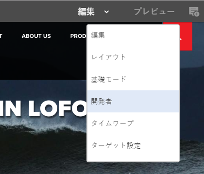
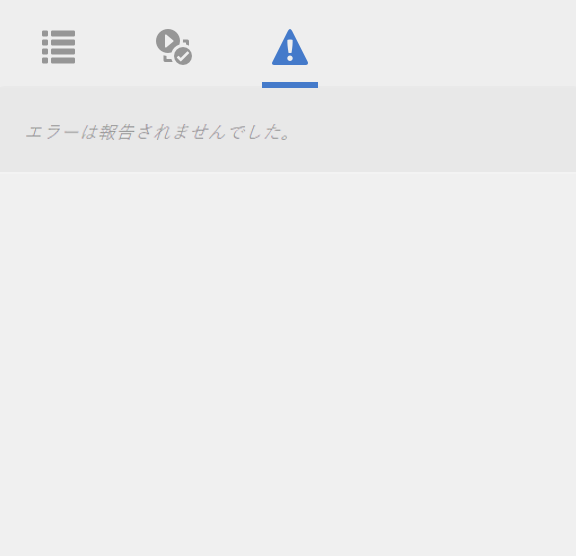
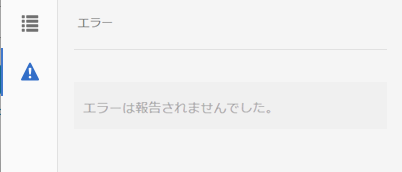

# 開発者モード{#developer-mode}

AEM でのページの編集には、いくつかの[モード](/help/sites-authoring/author-environment-tools.md#modestouchoptimizedui)を使用できます。開発者モードもその 1 つです。開発者モードで開かれるサイドパネルのタブには、現在のページに関する開発者向けの情報が表示されます。次の 3 つのタブがあります。

* **[コンポーネント](#components)**：構造およびパフォーマンスに関する情報を表示します。
* **[テスト](#tests)**：テストを実行し、結果を分析します。
* **[エラー](#errors)**：発生している問題が表示されます。

これらのタブで、開発者は以下を実行できます。

* 検出：ページが何から作成されているかを確認します。
* デバッグ：何がいつ、どこで起きているかを確認し、問題の解決に役立てます。
* テスト：アプリケーションが期待どおりに動作しているかをテストします。

>[!CAUTION]
>
>開発者モードには、次の特徴があります。
>
>* （ページの編集時に）タッチ操作対応 UI でのみ使用できます。
>* モバイルデバイスまたはデスクトップ上の小さいウィンドウでは、スペースの制約があるので使用できません。

   >
   >   
   * ウィンドウの幅が 1024 px 未満の場合は使用できません。
>* グループのメンバーであるユーザーのみが使用でき `administrators` ます。

>[!CAUTION]
>
>開発者モードは、nosamplecontent 実行モードを使用していない標準のオーサーインスタンスでのみ使用できます。
>
>必要に応じて、次の環境で使用するように設定できます。
>
>* nosamplecontent実行モードを使用した作成者インスタンスに対する
>* パブリッシュインスタンス

>
>
使用後は再度無効にする必要があります。

>[!NOTE]
>
>詳しくは以下を参照してください。
>
>* ナレッジベースの記事「[Troubleshooting AEM TouchUI issues](https://helpx.adobe.com/jp/experience-manager/kb/troubleshooting-aem-touchui-issues.html)」（有用なヒントとツールに関する記述あり）
>* [AEM 6.0 の開発者モード](https://docs.adobe.com/content/ddc/en/gems/aem-6-0-developer-mode.html)に関する AEM Gems セッション

>

## 開発者モードを開く {#opening-developer-mode}

開発者モードは、ページエディターのサイドパネルとして実装されています。パネルを開くには、ページエディターのツールバーにあるモードセレクターから「**開発者**」を選択します。

パネルは、次の 2 つのタブで構成されています。

* **[コンポーネント](/help/sites-developing/developer-mode.md#components)**— 作成者の[コンテンツツリーと同様のコンポーネントツリー](/help/sites-authoring/author-environment-tools.md#content-tree)。

* **[エラー](/help/sites-developing/developer-mode.md#errors)**- 問題が発生すると、各コンポーネントの詳細が表示されます。

### コンポーネント {#components}

コンポーネントツリーが表示されます。次の機能があります。

* ページ上にレンダリングされるコンポーネントとテンプレートのチェーンの概要を示します（SLY、JSP など）。このツリーを展開して、階層内のコンテキストを表示できます。
* コンポーネントのレンダリングに必要な、サーバー側の計算時間を示します。
* ツリーを展開して、ツリー内の特定のコンポーネントを選択できます。コンポーネントを選択すると、次のようなコンポーネント詳細にアクセスできます。

   * リポジトリパス
   * スクリプトへのリンク（CRXDE Lite でアクセス）

* 選択されたコンポーネント（コンテンツフローでは青い境界線で示されます）は、コンテンツツリーで強調表示されます（逆に、コンテンツツリーで選択されたコンポーネントはコンポーネントツリーで強調表示されます）。

コンポーネントツリーは、次の目的に役立ちます。

* コンポーネントごとのレンダリング時間を判断し、比較します。
* 階層を確認し、理解します。
* 時間がかかっているコンポーネントを把握することで、ページの読み込み時間について理解し、向上させます。

各コンポーネントエントリの表示例を以下に示します。

* **詳細を表示**：以下の項目を表示するリストへのリンクです。

   * コンポーネントのレンダリングに使用されるすべてのコンポーネントスクリプト。
   * この特定のコンポーネントのリポジトリコンテンツパス。

   

* **スクリプトを編集**：次のことをおこなうリンクです。

   * CRXDE Lite でコンポーネントスクリプトを開きます。

* コンポーネントエントリを展開（矢印の先端をクリック）すると、次の項目も表示されます。

   * 選択したコンポーネント内の階層。
   * 選択したコンポーネント単独でのレンダリング時間、そのコンポーネント内にネストされている個々のコンポーネントのレンダリング時間および両者の合計。

   

>[!CAUTION]
>
>Some links point to scripts under `/libs`. However, these are for reference only, you **must not** edit anything under `/libs`, as any changes you do make may be lost. このブランチは、アップグレードしたり、ホットフィックス／機能パックを適用するたびに変更される傾向にあります。Any changes you require should be made under `/apps`, see [Overlays and Overrides](/help/sites-developing/overlays.md).

### エラー {#errors}

「**エラー**」タブは常に（上図のように）何も表示されないのが理想ですが、問題が発生すると、コンポーネントごとに以下の詳細が表示されます。

* 警告とエラーの詳細および CRXDE Lite 内の適切なコードへの直接リンク（コンポーネントによってエラーログにエントリが作成された場合）
* 警告（コンポーネントによって管理セッションが開かれた場合）

例えば、未定義のメソッドが呼び出されたときは、その結果として発生したエラーが「**エラー**」タブに表示されます。

エラーが発生すると、「コンポーネント」タブのツリーにあるコンポーネントエントリもインジケーターでマークされます。

### テスト {#tests}

>[!CAUTION]
>
>AEM 6.2 では、開発者モードのテスト機能がスタンドアロンのツールアプリケーションとして再実装されました。
>
>For full details see [Testing Your UI](/help/sites-developing/hobbes.md).

