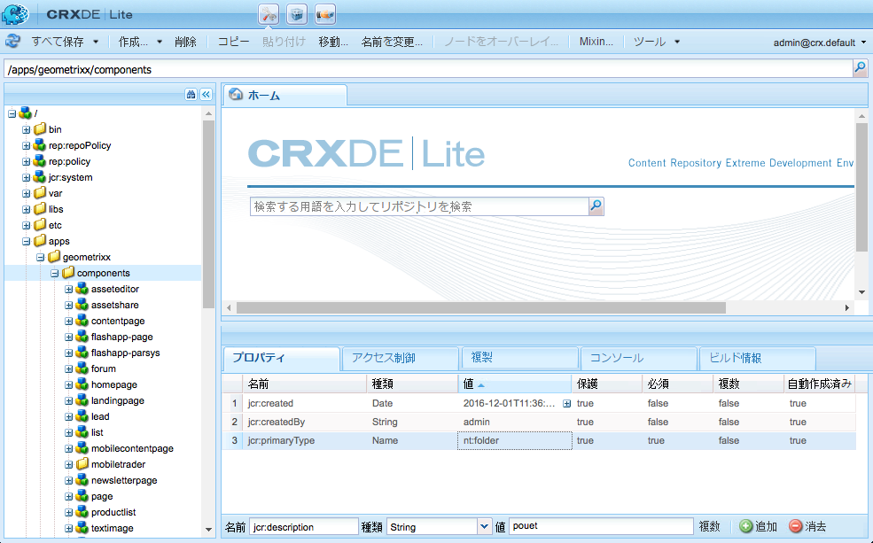
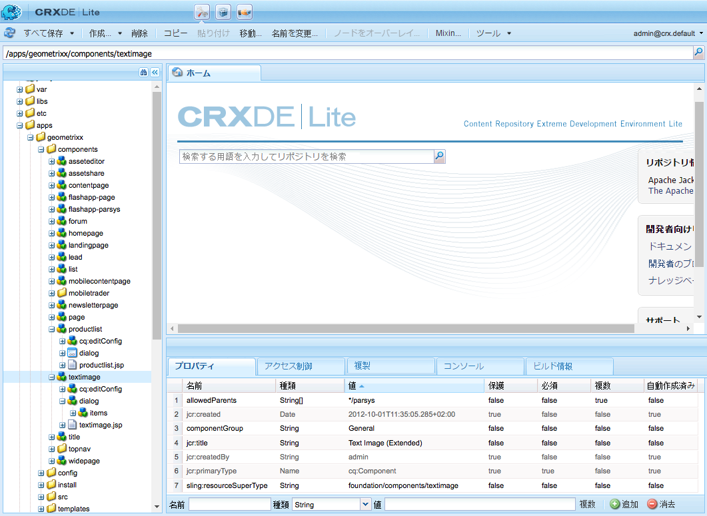
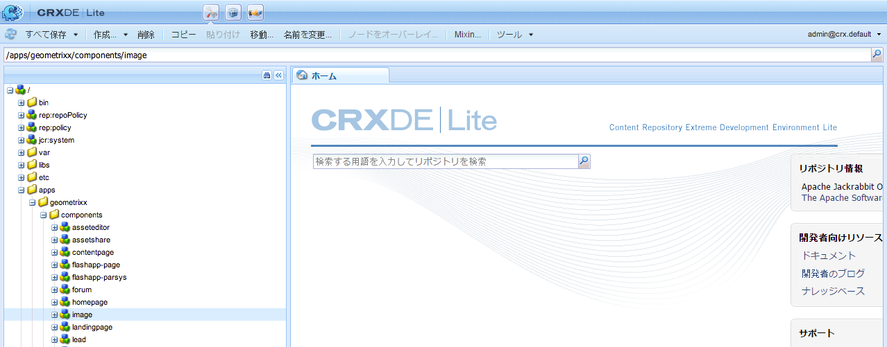
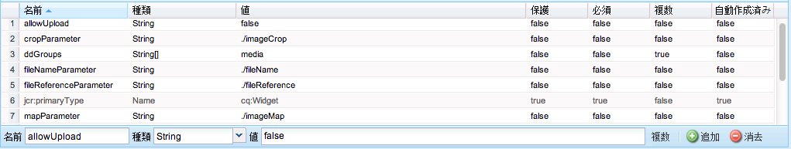
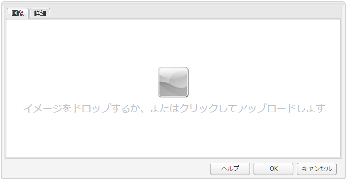
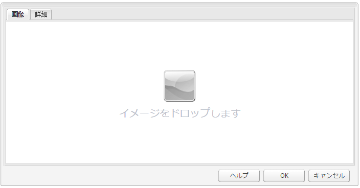

# AEM コンポーネントの開発（クラシック UI）{#developing-aem-components-classic-ui}

クラシック UI では、ExtJS を使用して、コンポーネントのルックアンドフィールを提供するウィジェットを作成します。このウィジェットの性質により、クラシック UI と[タッチ操作対応 UI](/help/sites-developing/developing-components.md) では、コンポーネントとのやり取りにいくつかの相違点があります。

>[!NOTE]
>
>コンポーネント開発の多くの側面は、クラシックUIとタッチ対応UIの両方に共通なので、**クラシックUIの詳細を扱うこのページを使用するには、[AEM Components - The Basics](/help/sites-developing/components-basics.md) before**&#x200B;を読む必要があります。

>[!NOTE]
>
>クラシック UI 用のコンポーネントの開発には HTML テンプレート言語（HTL）と JSP のどちらも使用できますが、このページでは JSP を使用した開発について説明します。これは単に、クラシック UI 内では JSP が使用されてきたからです。
>
>現在では、HTL が AEM の推奨スクリプティング言語とされています。方法を比較するには、[HTL](https://docs.adobe.com/content/help/ja-JP/experience-manager-htl/using/overview.html)と[AEMコンポーネントの開発](/help/sites-developing/developing-components.md)を参照してください。

## 構造 {#structure}

コンポーネントの基本構造は、「[AEM Components - The Basics](/help/sites-developing/components-basics.md#structure)」ページで説明しています。このページでは、タッチアンバールドとクラシックUIの両方を適用します。 新しいコンポーネントでタッチ操作対応 UI の設定を使用する必要がない場合でも、この情報は既存のコンポーネントを継承する際に設定を把握するのに役立ちます。

## JSP スクリプト {#jsp-scripts}

コンポーネントをレンダリングするには JSP スクリプトまたはサーブレットを使用します。Sling のリクエスト処理規則に従って、デフォルトスクリプトの名前は、

`<*componentname*>.jsp`

## global.jsp {#global-jsp}

JSP スクリプトファイルの `global.jsp` は、コンポーネントのレンダリングに使用される任意の JSP スクリプトの特定オブジェクト（コンテンツ）にすばやくアクセスするために使用されます。

したがって、`global.jsp` で提供される 1 つ以上のオブジェクトを使用する場合は、JSP スクリプトをレンダリングするすべてのコンポーネントに `global.jsp` を含める必要があります。

デフォルトの `global.jsp` は次の場所にあります。

`/libs/foundation/global.jsp`

>[!NOTE]
>
>バージョンCQ 5.3以前で使用されていたパス`/libs/wcm/global.jsp`は、現在は廃止されています。

### global.jsp、使用される API および Taglib の機能 {#function-of-global-jsp-used-apis-and-taglibs}

デフォルトの `global.jsp` から提供される最も重要なオブジェクトを次に示します。

概要：

* `<cq:defineObjects />`

   * `slingRequest`  — ラップされたリクエストオブジェクト(  `SlingHttpServletRequest`)。
   * `slingResponse`  — ラップされた応答オブジェクト(  `SlingHttpServletResponse`)。
   * `resource` - Slingリソースオブジェクト(  `slingRequest.getResource();`)。
   * `resourceResolver` - Sling Resource Resolverオブジェクト(  `slingRequest.getResoucreResolver();`)。
   * `currentNode` - リクエストに対して解決された JCR ノード。
   * `log`  — デフォルトのロガー()。
   * `sling` - Slingスクリプトヘルパー。
   * `properties`  — アドレス指定されたリソース(  `resource.adaptTo(ValueMap.class);`)のプロパティ。
   * `pageProperties` - 指定されたリソースのページのプロパティ。
   * `pageManager` - AEMコンテンツページにアクセスするためのページマネージャ(  `resourceResolver.adaptTo(PageManager.class);`)。
   * `component` - 現在の AEM コンポーネントのコンポーネントオブジェクト。
   * `designer`  — デザイン情報を取得するためのdesignerオブジェクト(  `resourceResolver.adaptTo(Designer.class);`)。
   * `currentDesign` - 指定されたリソースのデザイン。
   * `currentStyle` - 指定されたリソースのスタイル。

### コンテンツへのアクセス {#accessing-content}

AEM WCM のコンテンツにアクセスするには、3 つの方法があります。

* `global.jsp`で紹介されたプロパティオブジェクトを使用：

   properties オブジェクトは、ValueMap のインスタンス（[Sling API](https://sling.apache.org/apidocs/sling5/org/apache/sling/api/resource/ValueMap.html) を参照）で、現在のリソースのプロパティがすべて含まれています。

   例：`String pageTitle = properties.get("jcr:title", "no title");`は、ページコンポーネントのレンダリングスクリプトで使用されます。

   例：`String paragraphTitle = properties.get("jcr:title", "no title");`は、標準段落コンポーネントのレンダリングスクリプトで使用されます。

* `global.jsp`で導入された`currentPage`オブジェクトを使用：

   `currentPage`オブジェクトはページのインスタンスです([AEM API](https://helpx.adobe.com/experience-manager/6-5/sites/developing/using/reference-materials/javadoc/com/day/cq/wcm/api/Page.mhtml)を参照)。 ページクラスには、コンテンツにアクセスするためのメソッドがいくつかあります。

   例: `String pageTitle = currentPage.getTitle();`

* `global.jsp`で導入された`currentNode`オブジェクト経由：

   `currentNode`オブジェクトはノードのインスタンスです（[JCR API](https://jackrabbit.apache.org/api/2.16/org/apache/jackrabbit/standalone/cli/core/CurrentNode.html)を参照）。 ノードのプロパティは`getProperty()`メソッドでアクセスできます。

   例: `String pageTitle = currentNode.getProperty("jcr:title");`

## JSP タグライブラリ {#jsp-tag-libraries}

CQ と Sling のタグライブラリを使用すると、テンプレートやコンポーネントの JSP スクリプトで使用する特定の機能にアクセスできます。

詳しくは、「[タグライブラリ](/help/sites-developing/taglib.md)」ドキュメントを参照してください。

## クライアント側 HTML ライブラリの使用 {#using-client-side-html-libraries}

最近の Web サイトは、複雑な JavaScript や CSS コードを利用したクライアント側の処理に大きく依存しています。このコードの提供を編成および最適化することが厄介な問題となることがあります。

この問題の解決に役立つように、AEMは&#x200B;**クライアント側ライブラリフォルダー**&#x200B;を提供します。これにより、クライアント側コードをリポジトリに格納し、カテゴリに整理し、コードの各カテゴリをクライアントに提供するタイミングと方法を定義できます。 その後、クライアント側ライブラリシステムにより、最終的な Web ページで、正しいコードを読み込むための正しいリンクが作成されます。

詳しくは、「クライアント側HTMLライブラリの使用[」のドキュメントを参照してください。](/help/sites-developing/clientlibs.md)

## ダイアログ {#dialog}

コンポーネントのコンテンツを作成者が追加したり設定できるようにするには、ダイアログが必要です。

詳しくは、[AEMコンポーネント — 基本](/help/sites-developing/components-basics.md#dialogs)を参照してください。

## 編集動作の設定 {#configuring-the-edit-behavior}

コンポーネントの編集動作を設定できます。これには、コンポーネントに対して使用可能なアクションなどの属性、インプレースエディターの特性、コンポーネントに対するイベントに関連するリスナーも含まれます。固有の相違点は多少ありますが、設定はタッチ操作対応 UI とクラシック UI の両方に共通です。

コンポーネントの[編集動作は、タイプ`cq:EditConfig`の`cq:editConfig`ノードをコンポーネントノード（タイプ`cq:Component`）の下に追加し、特定のプロパティと子ノードを追加することで](/help/sites-developing/components-basics.md#edit-behavior)設定されます。

## ExtJS ウィジェットの使用と拡張 {#using-and-extending-extjs-widgets}

詳しくは、[ExtJS ウィジェットの使用と拡張](/help/sites-developing/widgets.md)を参照してください。

## ExtJS ウィジェットに xtype を使用 {#using-xtypes-for-extjs-widgets}

詳しくは、[xtype の使用](/help/sites-developing/xtypes.md)を参照してください。

## 新しいコンポーネントの開発  {#developing-new-components}

この節では、独自のコンポーネントを作成し、それを段落システムに追加する方法について説明します。

既存のコンポーネントをコピーし、必要な変更をおこなうことが、開発を始めるうえで最も簡単な方法です。

コンポーネントの開発方法の例について詳しくは、[テキストコンポーネントと画像コンポーネントの拡張 - 例](#extending-the-text-and-image-component-an-example)を参照してください。

### 新しいコンポーネントの開発（既存のコンポーネントの利用）  {#develop-a-new-component-adapt-existing-component}

既存のコンポーネントをベースに新しい AEM コンポーネントを開発するには、既存のコンポーネントをコピーし、新しいコンポーネント用の JavaScript ファイルを作成して、AEM からアクセスできる場所に保存します（「[コンポーネントおよびその他の要素のカスタマイズ](/help/sites-developing/dev-guidelines-bestpractices.md#customizing-components-and-other-elements)」も参照してください）。

1. CRXDE Lite を使用して、新しいコンポーネントフォルダーを以下の場所に作成します。

   / `apps/<myProject>/components/<myComponent>`

   libs 内にあるものと同じノード構造を再作成してから、テキストコンポーネントなどの既存のコンポーネントの定義をコピーします。例えば、テキストコンポーネントをカスタマイズするには、次のようにコピーします。

   * `/libs/foundation/components/text` から
   * を `/apps/myProject/components/text`

1. `jcr:title`を変更して新しい名前を反映します。
1. 新しいコンポーネントフォルダーを開き、必要な変更をおこないます。また、フォルダー内にある不要な情報を削除します。

   例えば、次のような変更をおこなうことができます。

   * ダイアログボックスへの新しいフィールドの追加

      * `cq:dialog`  — タッチ対応UIのダイアログ
      * `dialog` - クラシック UI 用ダイアログ
   * `.jsp`ファイルの置き換え（新しいコンポーネントの後に名前を付ける）
   * または、コンポーネント全体の作成し直し（必要な場合）

   例えば、標準のテキストコンポーネントのコピーを取得する場合、ダイアログボックスにフィールドを追加し、`.jsp`を更新してそこで行った入力を処理できます。

   >[!NOTE]
   >
   >使用するコンポーネント：
   >
   >* タッチ操作対応 UI では [Granite](https://helpx.adobe.com/experience-manager/6-5/sites/developing/using/reference-materials/granite-ui/api/jcr_root/libs/granite/ui/index.html) コンポーネントを使用します。
   >* クラシック UI では [ExtJS ウィジェット](https://helpx.adobe.com/jp/experience-manager/6-5/sites/developing/using/reference-materials/widgets-api/index.html)を使用します。


   >[!NOTE]
   >
   >クラシック UI 用に定義したダイアログは、タッチ操作対応 UI 内で動作します。
   >
   >タッチ操作対応 UI 用に定義したダイアログは、クラシック UI 内では動作しません。
   >
   >インスタンスと作成環境によっては、コンポーネント用に両方のタイプのダイアログを定義する必要が生じる場合があります。

1. 新しいコンポーネントを表示するには、次のいずれかのノードが存在し、適切に初期化されている必要があります。

   * `cq:dialog`  — タッチ対応UIのダイアログ
   * `dialog` - クラシック UI 用ダイアログ
   * `cq:editConfig` - 編集環境でのコンポーネントの動作（ドラッグ＆ドロップなど）
   * `design_dialog`  — デザインモードのダイアログ（クラシックUIのみ）

1. 次のどちらかの方法で、段落システムで新しいコンポーネントを利用できるようにします。

   * crxde liteを使用して`<path-to-component>`の値（例：`/apps/geometrixx/components/myComponent`）をノード`/etc/designs/geometrixx/jcr:content/contentpage/par`のプロパティコンポーネントに追加する
   * 「[段落システムへの新しいコンポーネントの追加](#adding-a-new-component-to-the-paragraph-system-design-mode)」の手順を実行します。

1. AEM WCM で、Web サイトのページを開き、作成した新しいタイプの段落を挿入してコンポーネントが正常に動作することを確認します。

>[!NOTE]
>
>ページ読み込みのタイミング統計を確認するには、Ctrl-Shift-U — を使用し、URLに`?debugClientLibs=true`を設定します。

### 段落システム（デザインモード）への新しいコンポーネントの追加{#adding-a-new-component-to-the-paragraph-system-design-mode}

コンポーネントを開発したら、段落システムに追加します。この操作により、ページの編集時に、作成者がコンポーネントを選択して使用できるようになります。

1. `<contentPath>/Test.html`のように、オーサリング環境内の段落システムを使用するページにアクセスします。
1. 次のどちらかの方法でデザインモードに切り替えます。

   * URLの末尾に`?wcmmode=design`を追加し、もう一度アクセスする、例：

      `<contextPath>/ Test.html?wcmmode=design`

   * サイドキックで「デザイン」をクリックします。

   デザインモードになり、段落システムを編集できるようになります。

1. 「編集」をクリックします。

   その段落システムに所属するコンポーネントのリストが一覧表示されます。新しいコンポーネントも一覧に表示されます。

   これらのコンポーネントをアクティブ化または非アクティブ化することで、ページの編集時に作成者に提供するコンポーネントを決定できます。

1. コンポーネントをアクティブ化したら、標準編集モードに戻り、利用可能かどうかを確認します。

### テキストコンポーネントと画像コンポーネントの拡張 - 例  {#extending-the-text-and-image-component-an-example}

この節では、広く利用されているテキストと画像の標準コンポーネントを、設定可能な画像配置機能を使用して拡張する方法について説明します。

テキストコンポーネントと画像コンポーネントの拡張により、エディターは、コンポーネントのすべての既存機能を使用できるだけでなく、次のどちらかの方法で画像の配置を指定できる追加のオプションも利用できます。

* テキストの左側（現在の動作および新しいデフォルト）
* テキストの右側

このコンポーネントを拡張したら、コンポーネントのダイアログボックスを使用して画像の配置を設定できます。

この演習では、以下の方法を説明します。

* 既存のコンポーネントノードのコピーとメタデータの変更
* コンポーネントのダイアログの変更（親ダイアログボックスからのウィジェットの継承を含む）
* 新機能を実装するためのコンポーネントのスクリプトの変更

>[!NOTE]
>
>この例は、クラシック UI を対象としています。

>[!NOTE]
>
>この例は、Geometrixx サンプルコンテンツに基づいています。これは、AEM に付属されなくなり、We.Retail に置き換えられました。Geometrixxのダウンロードおよびインストール方法については、ドキュメント[Web.Retail Reference Implementation](/help/sites-developing/we-retail.md#we-retail-geometrixx)を参照してください。

#### 既存の textimage コンポーネントの拡張 {#extending-the-existing-textimage-component}

新しいコンポーネントを作成するには、標準のtextimageコンポーネントを基に変更します。 ここでは、Geometrixx AEM WCM の例のアプリケーションに新しいコンポーネントを保存します。

1. ターゲットノード名としてtextimageを使用し、`/libs/foundation/components/textimage`からGeometrixxコンポーネントフォルダー`/apps/geometrixx/components`に標準のtextimageコンポーネントをコピーします。 （コンポーネントに移動し、右クリックして「コピー」を選択し、ターゲットディレクトリに移動することでコンポーネントをコピーします）。

   

1. この例ではシンプルに保つために、コピーしたコンポーネントに移動し、新しい textimage ノードから、以下に示すサブノードを除く、すべてのサブノードを削除します。

   * ダイアログ定義：`textimage/dialog`
   * コンポーネントスクリプト：`textimage/textimage.jsp`
   * 設定ノードを編集（アセットのドラッグ&amp;ドロップを可能にする）:`textimage/cq:editConfig`

   >[!NOTE]
   >
   >ダイアログの定義は、UI に依存します。
   >
   >* タッチ対応UI:`textimage/cq:dialog`
   >* クラシック UI：`textimage/dialog`


1. コンポーネントのメタデータを編集します。

   * コンポーネント名

      * `jcr:description`を`Text Image Component (Extended)`に設定
      * `jcr:title`を`Text Image (Extended)`に設定
   * サイドキック内でコンポーネントが一覧表示されるグループ（修正しない）

      * `componentGroup`を`General`に設定したままにします
   * 新しいコンポーネントの親コンポーネント（標準の textimage コンポーネント）

      * `sling:resourceSuperType`を`foundation/components/textimage`に設定

   この手順を終えると、コンポーネントのノードは以下のようになります。

   

1. 画像の設定の編集ノードの`sling:resourceType`プロパティを変更します(プロパティ：`textimage/cq:editConfig/cq:dropTargets/image/parameters/sling:resourceType`) ～ `geometrixx/components/textimage.`

   これで、画像がページ上のコンポーネントにドロップされると、拡張された textimage コンポーネントの `sling:resourceType` プロパティが `geometrixx/components/textimage.` に設定されます。

1. コンポーネントのダイアログボックスを変更して新しいオプションを含めます。新しいコンポーネントは元のコンポーネントと同じダイアログボックスのパーツを継承します。「**詳細**」タブを拡張するために、「**左**」と「**右**」のオプションのある「**画像の位置**」ドロップダウンリストだけを追加します。

   * `textimage/dialog`プロパティは変更しないでください。

   `textimage/dialog/items` に、textimage ダイアログボックスの 4 つのタブを表す 4 つのサブノード（tab1 から tab4）があることを確認します。

   * 最初の 2 つのタブ（tab1 および tab2）：

      * xtype を cqinclude に変更します（標準コンポーネントから継承するため）。
      * 値追加が`/libs/foundation/components/textimage/dialog/items/tab1.infinity.json`および`/libs/foundation/components/textimage/dialog/items/tab2.infinity.json`のパスプロパティ。
      * その他のすべてのプロパティとサブネットを削除します。
   * tab3：

      * プロパティとサブノードは変更せずに保持します。
      * 追加`tab3/items`に対する新しいフィールド定義、タイプ`cq:Widget`のノード位置
      * 新しい`tab3/items/position`ノードに次のプロパティ（文字列型）を設定します。

         * `name`: `./imagePosition`
         * `xtype`:  `selection`
         * `fieldLabel`:  `Image Position`
         * `type`:  `select`
      * 画像配置の2つの選択肢を表すタイプ`cq:WidgetCollection`の追加サブノード`position/options`。その下にタイプ`nt:unstructured`の2つのノード（o1とo2）が作成されます。
      * ノード`position/options/o1`に対して、次のプロパティを設定します。`text` ～ `Left`、`value` ～ `left.`
      * ノード`position/options/o2`に対して、次のプロパティを設定します。`text` ～ `Right`、および`value` ～ `right`です。
   * tab4 を削除します。

   画像の位置は、`imagePosition` の段落を表すノードの `textimage` プロパティとしてコンテンツ内で保持されます。これらの手順を終えると、コンポーネントのダイアログボックスは以下のようになります。

   

1. コンポーネントのスクリプト `textimage.jsp` を拡張し、新しいパラメーターの処理を追加します。

   ```xml
   Image image = new Image(resource, "image");
   
   if (image.hasContent() || WCMMode.fromRequest(request) == WCMMode.EDIT) {
        image.loadStyleData(currentStyle);
   ```

   強調表示したコードのフラグメント *%>&lt;div class=&quot;image&quot;>&lt;%* は、このタグのカスタムスタイルを生成する新しいコードで置き換える予定です。

   ```xml
   // todo: add new CSS class for the 'right image' instead of using
   // the style attribute
   String style="";
        if (properties.get("imagePosition", "left").equals("right")) {
             style = "style=\"float:right\"";
        }
        %><div <%= style %> class="image"><%
   ```

1. コンポーネントをリポジトリに保存します。コンポーネントをテストする準備ができました。

#### 新しいコンポーネントの確認 {#checking-the-new-component}

コンポーネントを開発したら、段落システムに追加します。この操作により、ページの編集時に、作成者がコンポーネントを選択して使用できるようになります。コンポーネントをテストするには、以下の手順を実行します。

1. Geometrixx でページを開きます（例：English／Company）。
1. サイドキックで「デザイン」をクリックし、デザインモードに切り替えます。
1. ページの中央の段落システムで、「編集」をクリックし、段落システムのデザインを編集します。段落システムに配置できるコンポーネントの一覧が表示されます。一覧には、新しく開発した Text Image (Extended) コンポーネントも含まれます。コンポーネントを選択し、「OK」をクリックして、段落システムに対してコンポーネントをアクティブ化します。
1. 編集モードに戻します。
1. Text Image (Extended) 段落を段落システムに追加し、サンプルコンテンツでテキストと画像を初期化します。変更内容を保存します。
1. テキストと画像の段落のダイアログを開き、「詳細」タブで画像の位置を「右」に変更し、「OK」をクリックして変更を保存します。
1. 段落の右側に画像がレンダリングされます。
1. コンポーネントを使用する準備ができました。

コンポーネントには、Company ページの段落のコンテンツが格納されます。

### 画像コンポーネントのアップロード機能の無効化  {#disable-upload-capability-of-the-image-component}

この機能を無効にするには、標準の画像コンポーネントを基に変更を加えます。 Geometrixx の例のアプリケーションに新しいコンポーネントを保存します。

1. 標準画像コンポーネントを`/libs/foundation/components/image`からGeometrixxコンポーネントフォルダー`/apps/geometrixx/components`にコピーし、ターゲットノード名としてimageを使用します。

   

1. コンポーネントのメタデータを編集します。

   * **jcr:title**&#x200B;を`Image (Extended)`に設定

1. `/apps/geometrixx/components/image/dialog/items/image` に移動します。
1. 新しいプロパティを追加します。

   * **名前**：`allowUpload`
   * **型**：`String`
   * **値**: `false`

   

1. 「**すべて保存**」をクリックします。コンポーネントをテストする準備ができました。
1. Geometrixx でページを開きます（例：English／Company）。
1. デザインモードに切り替え、Image (Extended) をアクティブ化します。
1. 編集モードに切り替え、画像を段落システムに追加します。次の画像で、元の画像コンポーネントと先ほど作成したコンポーネントの違いを確認できます。

   元の画像コンポーネント：

   

   新しい画像コンポーネント：

   

1. コンポーネントを使用する準備ができました。

