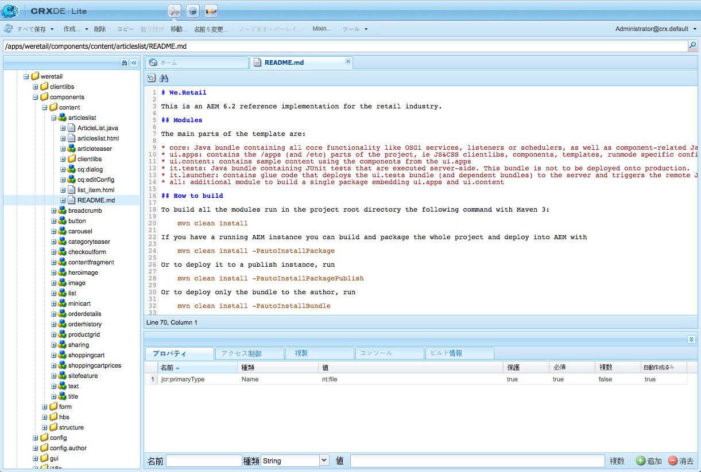

# AEM コンポーネントの開発{#developing-aem-components}

AEM コンポーネントを使用して、Web ページ上で使用できるコンテンツを保持、書式設定およびレンダリングします。

* [ページをオーサリング](/help/sites-authoring/default-components.md)するとき、作成者はコンポーネントを使用してコンテンツを編集および設定できます。

   * [コマース](/help/sites-administering/ecommerce.md)サイトを構築するときは、コンポーネントを使用して、例えばカタログの情報を収集してレンダリングできます。詳しくは、[e コマースの開発](/help/sites-developing/ecommerce.md)を参照してください。

   * [コミュニティ](/help/communities/author-communities.md)サイトを構築するときは、コンポーネントを使用して、訪問者に情報を提供したり、訪問者から情報を収集したりできます。詳しくは、[コミュニティの開発](/help/communities/communities.md)を参照してください。

* パブリッシュインスタンス上では、コンポーネントがコンテンツをレンダリングし、適切なタイミングで Web サイト訪問者に表示します。

>[!NOTE]
>
>This page is a continuation of the document [AEM Components - The Basics](/help/sites-developing/components-basics.md).

>[!CAUTION]
>
>Components below `/libs/cq/gui/components/authoring/dialog` are meant to be used only in the Editor (component dialogs in Authoring). 他の場所で使用すると（インスタンスのウィザードダイアログ内など）、予期したとおりに動作しないことがあります。

## コードサンプル {#code-samples}

このページでは、AEM 用の新しいコンポーネントの開発に必要なリファレンスドキュメント（またはリファレンスドキュメントへのリンク）を提供します。実践的な例については、[AEM コンポーネントの開発 - コードサンプル](/help/sites-developing/developing-components-samples.md)を参照してください。

## 構造 {#structure}

コンポーネントの基本構造については、[AEM コンポーネント - 基本](/help/sites-developing/components-basics.md#structure)で説明しています。このドキュメントは、タッチ対応UIとクラシックUIの両方に対応しています。 新しいコンポーネントでクラシック設定を使用する必要がない場合でも、既存のコンポーネントから継承する際にクラシック設定について知っていると役立ちます。

## 既存のコンポーネントおよびダイアログの拡張 {#extending-existing-components-and-dialogs}

実装するコンポーネントによっては、[構造](#structure)全体を一から定義して開発するのではなく、既存インスタンスを拡張したり、カスタマイズしたりするだけで済むことがあります。

既存のコンポーネントまたはダイアログを拡張またはカスタマイズする際に、構造全体またはダイアログに必要な構造をコピーまたは複製してから変更することができます。

### 既存コンポーネントの拡張 {#extending-an-existing-component}

既存コンポーネントは、[リソースタイプ階層](/help/sites-developing/components-basics.md#component-hierarchy-and-inheritance)と関連する継承メカニズムを使用して拡張できます。

>[!NOTE]
>
>コンポーネントは、検索パスロジックに基づいたオーバーレイを使用して再定義することもできます。However in such case, the [Sling Resource Merger](/help/sites-developing/sling-resource-merger.md) will not be triggered and `/apps` must define the entire overlay.

>[!NOTE]
>
>[コンテンツフラグメントコンポーネント](/help/sites-developing/customizing-content-fragments.md)もカスタマイズおよび拡張できますが、構造全体やアセットとの関係を考慮する必要があります。

### 既存のコンポーネントダイアログのカスタマイズ {#customizing-a-existing-component-dialog}

*Sling Resource Merger* を使用し、[ プロパティを定義して、コンポーネントダイアログをオーバーライドすることもできます。](/help/sites-developing/sling-resource-merger.md)`sling:resourceSuperType`

This means you only need to redefine the required differences, as opposed to redefining the entire dialog (using `sling:resourceSuperType`). これは、推奨されるコンポーネントダイアログ拡張方法です。

詳しくは、[Sling Resource Merger ](/help/sites-developing/sling-resource-merger.md) を参照してください。

## マークアップの定義 {#defining-the-markup}

コンポーネントは [HTML](https://www.w3schools.com/htmL/html_intro.asp) を使用してレンダリングされます。コンポーネントでは、リクエストされたコンテンツを取得して、オーサリング環境とパブリッシュ環境の両方で必要に応じてレンダリングするために必要な HTML を定義しなければなりません。

### HTML テンプレート言語の使用 {#using-the-html-template-language}

[HTML テンプレート言語（HTL）](https://docs.adobe.com/content/help/ja-JP/experience-manager-htl/using/overview.html)は、AEM 6.0 で JSP（JavaServer Pages）に代わって導入されたスクリプティング言語であり、HTML の扱いに適した、推奨されるサーバー側テンプレートシステムです。堅牢なエンタープライズ Web サイトを構築する必要のある Web 開発者にとって、HTL は安全性と開発効率の向上に役立ちます。

>[!NOTE]
>
>HTL と JSP のどちらを使用してもコンポーネントを開発できますが、AEM の推奨スクリプティング言語は HTL なので、ここでは HTL を使用した開発について説明します。

## コンテンツロジックの開発 {#developing-the-content-logic}

このオプションのロジックでは、レンダリングするコンテンツの選択や計算をおこないます。このロジックは、適切な Use-API パターンを持つ HTL 式から呼び出されます。

このようにロジックを外観から分離するメカニズムは、特定のビューで何が呼び出されるかを明確化するために役立ちます。同じリソースの異なるビューに対し、異なるロジックを使用することもできます。

### Java の使用 {#using-java}

[HTL Java Use-API を使用すると、HTL ファイルからカスタム Java クラスのヘルパーメソッドへのアクセスが可能になります](https://helpx.adobe.com/experience-manager/htl/using/use-api-java.html)。そのため、Java コードを使用して、コンポーネントのコンテンツを選択および設定するためのロジックを実装できます。

### JavaScript の使用 {#using-javascript}

[HTL JavaScript Use-API を使用すると、HTL ファイルから JavaScript で書かれたヘルパーコードへのアクセスが可能になります](https://helpx.adobe.com/experience-manager/htl/using/use-api-javascript.html)。そのため、JavaScript コードを使用して、コンポーネントのコンテンツを選択および設定するためのロジックを実装できます。

### クライアント側 HTML ライブラリの使用 {#using-client-side-html-libraries}

最近の Web サイトは、複雑な JavaScript や CSS コードを利用したクライアント側の処理に大きく依存しています。このコードの提供を編成および最適化することが厄介な問題となることがあります。

To help deal with this issue, AEM provides **Client-side Library Folders**, which allow you to store your client-side code in the repository, organize it into categories and define when and how each category of code is to be served to the client. その後、クライアント側ライブラリシステムにより、最終的な Web ページで、正しいコードを読み込むための正しいリンクが作成されます。

詳しくは、[クライアント側 HTML ライブラリの使用](/help/sites-developing/clientlibs.md)を参照してください。

## 編集動作の設定 {#configuring-the-edit-behavior}

コンポーネントの編集動作を設定できます。編集動作には、コンポーネントに使用できるアクション、インプレースエディターの特性、コンポーネントに対するイベントに関連するリスナーなどの属性が含まれます。固有の相違点は多少ありますが、設定はタッチ操作対応 UI とクラシック UI の両方に共通です。

The [edit behavior of a component is configured](/help/sites-developing/components-basics.md#edit-behavior) by adding a `cq:editConfig` node of type `cq:EditConfig` below the component node (of type `cq:Component`) and by adding specific properties and child nodes.

## プレビュー動作の設定 {#configuring-the-preview-behavior}

**プレビュー**&#x200B;モードに切り替えると、ページが更新されなくても [WCM モード](https://helpx.adobe.com/experience-manager/6-5/sites/developing/using/reference-materials/javadoc/com/day/cq/wcm/api/WCMMode.html) Cookie が設定されます。

レンダリングが WCM モードの影響を受けるコンポーネントの場合は、明確にそのコンポーネントを更新し、この Cookie の値を使用するように定義する必要があります。

>[!NOTE]
>
>値 `EDIT` と `PREVIEW` は、タッチ操作対応 UI でのみ [WCM モード](https://helpx.adobe.com/experience-manager/6-5/sites/developing/using/reference-materials/javadoc/com/day/cq/wcm/api/WCMMode.html) Cookie に使用されます。

## ダイアログの作成と設定 {#creating-and-configuring-a-dialog}

作成者はダイアログを使用してコンポーネントとやり取りできます。Using a dialog allows authors and/or administrators to edit content, configure the component or define design parameters (using a [Design Dialog](#creating-and-configuring-a-design-dialog))

### Coral UI と Granite UI {#coral-ui-and-granite-ui}

AEM の現代的なルックアンドフィールは [Coral UI](https://helpx.adobe.com/jp/experience-manager/6-5/sites/developing/using/reference-materials/coral-ui/coralui3/index.html) と [Granite UI](https://helpx.adobe.com/experience-manager/6-5/sites/developing/using/reference-materials/granite-ui/api/index.html) で定義されています。

[Granite UI で提供される幅広い基本コンポーネント（ウィジェット）](https://helpx.adobe.com/experience-manager/6-5/sites/developing/using/reference-materials/granite-ui/api/index.html)は、オーサー環境でダイアログを作成するために使用されます。必要な場合には、選択したウィジェットを拡張し、[独自のウィジェットを作成](#creatinganewwidget)することができます。

Coral および Granite リソースタイプを使用してコンポーネントを開発する方法について詳しくは、[Coral／Granite リソースタイプを使用した Experience Manager コンポーネントの作成](https://helpx.adobe.com/experience-manager/using/aem64_coral_resourcetypes.html)を参照してください。

詳しくは、以下を参照してください。

* Coral UI

   * すべてのクラウドソリューションに一貫性ある UI を提供
   * [AEM タッチ操作対応 UI の概念 - Coral UI](/help/sites-developing/touch-ui-concepts.md#coral-ui)
   * [Coral UI ガイド](https://helpx.adobe.com/jp/experience-manager/6-5/sites/developing/using/reference-materials/coral-ui/coralui3/index.html)

* Granite UI

   * UI コンソールおよびダイアログの構築用に Coral UI マークアップを Sling コンポーネントにラップして提供
   * [AEM Touch-Enabled UI - Granite UIの概念](/help/sites-developing/touch-ui-concepts.md#coral-ui)
   * [Granite UI ドキュメント](https://helpx.adobe.com/experience-manager/6-5/sites/developing/using/reference-materials/granite-ui/api/index.html)

>[!NOTE]
>
>Granite UI コンポーネントの性質（および ExtJS ウィジェットとの違い）により、タッチ操作対応 UI と[クラシック UI](/help/sites-developing/developing-components-classic.md) では、コンポーネントとのやり取りにいくつかの相違点があります。

### 新しいダイアログの作成 {#creating-a-new-dialog}

タッチ操作対応 UI 用ダイアログは、以下のように実装されます。

* are named `cq:dialog`.
* are defined as an `nt:unstructured` node with the `sling:resourceType` property set.

* `cq:Component` ノードの下のコンポーネント定義の横にあります。
* コンテンツ構造と `sling:resourceType` プロパティに基づいて、サーバー側で（Sling コンポーネントとして）レンダリングされます。
* Granite UI フレームワークを使用します。
* ダイアログ内のフィールドを記述したノード構造を含みます。

   * these nodes are `nt:unstructured` with the required `sling:resourceType` property.

ノード構造の例は次のようになります。

```xml
newComponent (cq:Component)
  cq:dialog (nt:unstructured)
    content
      layout
      items
        column
          items
            file
            description
```

ダイアログ自体が一種のコンポーネント（コンポーネントスクリプトによって動作と一緒にレンダリングされるマークアップや、クライアントライブラリが提供するスタイルなど）なので、ダイアログのカスタマイズはコンポーネントのカスタマイズに似ています。

例えば、次を参照してください。

* `/libs/foundation/components/text/cq:dialog`
* `/libs/foundation/components/download/cq:dialog`

>[!NOTE]
>
>コンポーネントにタッチ操作対応 UI 用のダイアログが定義されていない場合は、クラシック UI ダイアログが互換性レイヤー内でフォールバックとして使用されます。そのようなダイアログをカスタマイズするには、クラシック UI ダイアログをカスタマイズする必要があります。詳しくは、[クラシック UI 用の AEM コンポーネント](/help/sites-developing/developing-components-classic.md)を参照してください。

### ダイアログフィールドのカスタマイズ {#customizing-dialog-fields}

>[!NOTE]
>
>次のページを参照してください。
>
>* [ダイアログフィールドのカスタマイズ](https://docs.adobe.com/content/ddc/en/gems/customizing-dialog-fields-in-touch-ui.html)に関する AEM Gems セッション。
>* 「[コードサンプル - ダイアログフィールドのカスタマイズ方法](/help/sites-developing/developing-components-samples.md#code-sample-how-to-customize-dialog-fields)」で説明されている関連サンプルコード。

>


#### 新しいフィールドの作成 {#creating-a-new-field}

タッチ操作対応 UI 用のウィジェットは、Granite UI コンポーネントとして実装されています。

タッチ操作対応 UI 用のコンポーネントダイアログで使用する新しいウィジェットを作成するには、[新しい Granite UI フィールドコンポーネントを作成](/help/sites-developing/granite-ui-component.md)する必要があります。

>[!NOTE]
>
>Granite UI について詳しくは、[Granite UI ドキュメント](https://helpx.adobe.com/experience-manager/6-5/sites/developing/using/reference-materials/granite-ui/api/index.html)を参照してください。

ダイアログをフォーム要素のシンプルなコンテナと見なす場合は、ダイアログコンテンツの主要コンテンツをフォームフィールドと見なすこともできます。新しいフォームフィールドを作成するには、リソースタイプを作成する必要があります。これは、新しいコンポーネントの作成と同等です。この作業を容易にするために、Granite UI は、`sling:resourceSuperType` を使用して以下を継承する汎用フィールドコンポーネントを提供しています。

`/libs/granite/ui/components/coral/foundation/form/field`

より正確に言えば、Granite UI には、ダイアログ（より一般的に言えば[フォーム](https://helpx.adobe.com/jp/experience-manager/6-5/sites/developing/using/reference-materials/granite-ui/api/jcr_root/libs/granite/ui/components/foundation/form/index.html)）での使用に適した、幅広いフィールドコンポーネントが用意されています。

>[!NOTE]
>
>この点はクラシック UI とは異なります。クラシック UI では、ウィジェットは `cq:Widgets` ノードによって表され、各ノードには対応する ExtJS ウィジェットとの関係を確立するための特定の `xtype` があります。実装の観点から、これらのウィジェットは ExtJS フレームワークによってクライアント側でレンダリングされていました。

リソースタイプを作成したうえで、`sling:resourceType` プロパティで作成したリソースタイプを参照して、新しいノードをダイアログに追加することによって、フィールドをインスタンス化できます。

#### スタイル設定および動作用のクライアントライブラリの作成 {#creating-a-client-library-for-style-and-behavior}

コンポーネントのスタイル設定と動作を定義する場合は、カスタム CSS/LESS および JS を定義する専用の[クライアントライブラリ](/help/sites-developing/clientlibs.md)を作成できます。

To have your client library loaded solely for your component dialog (i.e. it will not be loaded for another component) you need to set the property `extraClientlibs`** **of your dialog to the category name of the client library you have just created. この方法は、クライアントライブラリが非常に大きい場合や、フィールドがそのダイアログに固有で、他のダイアログで必要になることがない場合にお勧めです。

クライアントライブラリをすべてのダイアログ用に読み込むには、クライアントライブラリのカテゴリプロパティを `cq.authoring.dialog` に設定します。これは、すべてのダイアログのレンダリング時にデフォルトで含まれるクライアントライブラリのカテゴリ名です。クライアントライブラリが小さい場合や、フィールドが汎用的で、他のダイアログで再利用できる場合には、この方法を使用できます。

例えば、次を参照してください。

* `cqgems/customizingfield/components/colorpicker/clientlibs`

   * [コードサンプル](/help/sites-developing/developing-components-samples.md#code-sample-how-to-customize-dialog-fields)で提供

#### フィールドの拡張（フィールドからの継承） {#extending-inheriting-from-a-field}

要件に応じて、次のどちらかを実行できます。

* コンポーネントの継承（`sling:resourceSuperType`）によって、指定された Granite UI フィールドを拡張する
* ウィジェットライブラリ API（JS/CSS 継承）に従って、指定されたウィジェットを基となるウィジェットライブラリ（Granite UI の場合は Coral UI）から拡張する

#### ダイアログフィールドへのアクセス {#access-to-dialog-fields}

レンダリング条件（`rendercondition`）を使用して、ダイアログ内の特定のタブやフィールドへのアクセス権を持つユーザーを制御することもできます。以下に例を示します。

```xml
+ mybutton
  - sling:resourceType = granite/ui/components/coral/foundation/button
  + rendercondition
    - sling:resourceType = myapp/components/renderconditions/group
    - groups = ["administrators"]
```

### Handling Field Events {#handling-field-events}

ダイアログフィールドのイベントの処理は、[カスタムクライアントライブラリのリスナー](#listeners-in-a-custom-client-library)でおこなわれるようになりました。これは以前の方法からの変更点です。以前は、[コンテンツ構造のリスナー](#listenersinthecontentstructureclassicui)を使用していました。

#### カスタムクライアントライブラリのリスナー {#listeners-in-a-custom-client-library}

フィールドにロジックを挿入するには、以下を実行する必要があります。

1. 対象となるフィールドを、指定された CSS クラス（フック&#x200B;**）でマークします。
1. クライアントライブラリ内で、その CSS クラス名に対してフックされる JS リスナーを定義します（これによって、カスタムロジックの範囲がそのフィールドのみに限定され、同じタイプの他のフィールドに影響を与えなくなります）。

これを実現するには、やり取りする、基になるウィジェットライブラリについて理解する必要があります。反応するイベントの識別については、[Coral UI ドキュメント](https://helpx.adobe.com/jp/experience-manager/6-5/sites/developing/using/reference-materials/coral-ui/coralui3/index.html)を参照してくださいExtJS を使用して実行する必要があったプロセスと非常によく似ています。指定されたウィジェットのドキュメントページを探し、そのイベント API の詳細を確認してください。

例えば、次を参照してください。

* `cqgems/customizingfield/components/clientlibs/customizingfield`

   * [コードサンプル](/help/sites-developing/developing-components-samples.md#code-sample-how-to-customize-dialog-fields)で提供

#### コンテンツ構造のリスナー {#listeners-in-the-content-structure}

ExtJS を使用するクラシック UI では、コンテンツ構造内に指定のウィジェットのリスナーを用意することが普通でした。タッチ操作対応 UI では、同じことを別の方法で実現します。JS のリスナーコード（またはあらゆるコード）はコンテンツ内で定義されないからです。

コンテンツ構造は意味構造を記述するものであり、基となるウィジェットの性質を示すものであってはなりません。コンテンツ構造に JS コードを含めないことで、コンテンツ構造を変更せずに実装の詳細を変更することが可能になります。言い換えると、コンテンツ構造に触れることなく、ウィジェットライブラリを変更できます。

### フィールドの検証 {#field-validation}

#### 必須フィールド {#mandatory-field}

指定されたフィールドを「必須」としてマークするには、フィールドのコンテンツノードに次のプロパティを設定します。

* 名前：`required`
* タイプ：`Boolean`

例えば、次を参照してください。

```xml
/libs/foundation/components/page/cq:dialog/content/items/tabs/items/basic/items/column/items/title/items/title
```

#### フィールドの検証（Granite UI） {#field-validation-granite-ui}

Granite UI でのフィールド検証および Granite UI コンポーネント（ウィジェットと同等）のフィールド検証は、`foundation-validation` API を使用して実行します。[詳しくは、`foundation-valdiation` に関する Granite のドキュメントを参照してください。](https://helpx.adobe.com/experience-manager/6-5/sites/developing/using/reference-materials/granite-ui/api/jcr_root/libs/granite/ui/components/coral/foundation/clientlibs/foundation/js/validation/index.html)

例えば、次を参照してください。

* `cqgems/customizingfield/components/clientlibs/customizingfield/js/validations.js`

   * [コードサンプル](/help/sites-developing/developing-components-samples.md#code-sample-how-to-customize-dialog-fields)で提供

* `/libs/cq/gui/components/authoring/dialog/clientlibs/dialog/js/validations.js`

## デザインダイアログの作成と設定 {#creating-and-configuring-a-design-dialog}

コンポーネントに[デザインモード](/help/sites-authoring/default-components-designmode.md)で編集できるデザイン詳細がある場合は、デザインダイアログを用意します。

デザインダイアログの定義は、[コンテンツの編集に使用されるダイアログ](#creating-a-new-dialog)の定義によく似ています。違いはノードとして定義される点です。

* ノード名: `cq:design_dialog`
* タイプ：`nt:unstructured`

## インプレースエディターの作成と設定 {#creating-and-configuring-an-inplace-editor}

インプレースエディターは、ユーザーはコンテンツを編集するときに、ダイアログを開かずに、段落フロー内で直接編集できるようにする機能です。例えば、標準のテキストコンポーネントとタイトルコンポーネントには、どちらもインプレースエディターがあります。

インプレースエディターは、すべてのコンポーネントタイプで必要または重要なものではありません。

詳しくは、[ページオーサリングの拡張 - 新しいインプレースエディターを追加](/help/sites-developing/customizing-page-authoring-touch.md#add-new-in-place-editor)を参照してください。

## コンポーネントツールバーのカスタマイズ {#customizing-the-component-toolbar}

[コンポーネントツールバー](/help/sites-developing/touch-ui-structure.md#component-toolbar)は、ユーザーがコンポーネントに対する幅広いアクション（編集、設定、コピー、削除など）にアクセスできるようにする機能です。

詳しくは、[ページオーサリングの拡張 - 新しいアクションをコンポーネントツールバーに追加](/help/sites-developing/customizing-page-authoring-touch.md#add-new-action-to-a-component-toolbar)を参照してください。

## 参照レール用のコンポーネント（借りた／貸したコンテンツ）の設定 {#configuring-a-component-for-the-references-rail-borrowed-lent}

新しいコンポーネントが他のページのコンテンツを参照する場合は、[**参照&#x200B;**](/help/sites-authoring/basic-handling.md#references)レールの「**借りたコンテンツ**」セクションおよび「**貸したコンテンツ**」セクションに影響を与えるかどうかを考慮できます。

初期状態の AEM は参照コンポーネントのみを確認します。コンポーネントを追加するには、OSGi バンドル **WCM オーサリングコンテンツ参照設定**&#x200B;を設定する必要があります。

定義に新しいエントリを作成し、確認するプロパティと共にコンポーネントを指定します。次に例を示します。

`/apps/<*your-Project*>/components/reference@parentPath`

>[!NOTE]
>
>AEM と連携する場合は、いくつかの方法でこのようなサービスの設定を管理できます。詳細および推奨事項については、[OSGi の設定](/help/sites-deploying/configuring-osgi.md)を参照してください。

## コンポーネントの有効化と段落システムへの追加 {#enabling-and-adding-your-component-to-the-paragraph-system}

コンポーネントを開発したら、必要なページで使用できるよう、適切な段落システムでの使用を有効にする必要があります。

次のどちらかの方法で有効化できます。

* 特定のページの編集時に[デザインモード](/help/sites-authoring/default-components-designmode.md)を使用する。
* [テンプレートの段落システムに `components` プロパティを定義する](/help/sites-developing/components-basics.md#adding-your-component-to-the-paragraph-system)。

## アセットをドラッグするとコンポーネントインスタンスが作成されるように段落システムを設定 {#configuring-a-paragraph-system-so-that-dragging-an-asset-creates-a-component-instance}

AEM では、ページの段落システムを設定するときに、常に空のコンテンツをページにドラッグするのではなく、[ユーザーが（適切な）アセットをページのインスタンスにドラッグすると新しいコンポーネントのインスタンスが自動的に作成される](/help/sites-authoring/editing-content.md#insertingacomponenttouchoptimizedui)ような設定にすることができます。

この動作と、必要なアセットとコンポーネントの関連付けは、次の方法で設定できます。

1. 次のようなページデザインの段落定義の下に、

   * `/etc/designs/<myApp>/page/par`

   新しいノードを作成します。

   * 名前：`cq:authoring`
   * タイプ：`nt:unstructured`


1. この下に、アセットとコンポーネントのマッピングをすべて保持する新しいノードを作成します。

   * 名前：`assetToComponentMapping`
   * タイプ：`nt:unstructured`

1. アセットとコンポーネントのマッピングごとに、ノードを作成します。

   * 名前：テキスト。アセットと関連するコンポーネントタイプを示す名前（例：image）にすることを推奨します。
   * タイプ：`nt:unstructured`

   それぞれが以下のプロパティを持ちます。

   *  `assetGroup` の下）で、次の手順をおこないます。

      * タイプ：`String`
      * Value: the group that the related asset belongs to; for example, `media`
   *  `assetMimetype` の下）で、次の手順をおこないます。

      * タイプ：`String`
      * 値：関連アセットの MIME タイプ（例：`image/*`/*）
   *  `droptarget` の下）で、次の手順をおこないます。

      * タイプ：`String`
      * 値：ドロップターゲット（例：`image`）
   *  `resourceType` の下）で、次の手順をおこないます。

      * タイプ：`String`
      * Value: the related component resource; for example, `foundation/components/image`
   *  `type` の下）で、次の手順をおこないます。

      * タイプ：`String`
      * 値：タイプ（例：`Images`）


例えば、次を参照してください。

* `/etc/designs/geometrixx/jcr:content/page/par/cq:authoring`
* `/etc/designs/geometrixx-outdoors/jcr:content/page/par/cq:authoring`
* `/etc/designs/geometrixx-media/jcr:content/article/article-content-par/cq:authoring`

GitHub のコード

このページのコードは GitHub にあります

* [GitHubでAEMプロジェクトのアーキタイププロジェクトを開く](https://github.com/Adobe-Marketing-Cloud/aem-project-archetype)
* プロジェクトを [ZIP ファイル](https://github.com/Adobe-Marketing-Cloud/aem-project-archetype/archive/master.zip)としてダウンロードします

>[!NOTE]
>
>The automatic creation of component instances can now be configured easily within the UI when using [Core Components](https://docs.adobe.com/content/help/ja-JP/experience-manager-core-components/using/introduction.html) and Editable Templates. See [Creating Page Templates](/help/sites-authoring/templates.md#editing-a-template-structure-template-author) for more information about defining which components are automatically associated with given media types.

## AEM Brackets 拡張の使用 {#using-the-aem-brackets-extension}

[AEM Brackets 拡張](/help/sites-developing/aem-brackets.md)は、AEM コンポーネントおよびクライアントライブラリを編集するためのスムーズなワークフローを提供します。この拡張は、[Brackets](https://brackets.io/) コードエディターをベースとしています。

この拡張には、次の機能があります。

* 同期を容易にして（Maven や File Vault は不要）、開発者の効率を向上させるだけでなく、AEM に関する知識が限られたフロントエンド開発者もプロジェクトに参加できるようにします。
* Provides some [HTL](https://docs.adobe.com/content/help/ja-JP/experience-manager-htl/using/overview.html) support, the template language designed to simplify component development and increase security.

>[!NOTE]
>
>Brackets は、コンポーネントを作成するための推奨メカニズムです。Brackets は、クラシック UI 向けに設計された CRXDE Lite のコンポーネント作成機能の代わりになります。

## クラシックコンポーネントからの移行 {#migrating-from-a-classic-component}

クラシック UI で使用するようにデザインされたコンポーネントを、タッチ操作対応 UI 専用または両方の UI で使用できるコンポーネントに移行する場合は、以下の問題を考慮する必要があります。

* HTL

   * [HTL](https://docs.adobe.com/content/help/ja-JP/experience-manager-htl/using/overview.html) の使用は必須条件ではありません。ただし、コンポーネントを更新する必要がある場合は、[JSP から HTL への移行](/help/sites-developing/components-basics.md#htl-vs-jsp)を検討することをお勧めします。

* コンポーネント

   * クラシック UI 固有の関数を使用する [`cq:listener`](/help/sites-developing/developing-components.md#migrating-cq-listener-code) コードを移行します。
   * RTE プラグイン。詳しくは、[リッチテキストエディターの設定](/help/sites-administering/rich-text-editor.md)を参照してください。
   * クラシック UI 固有の関数を使用する[ `cq:listener`](#migrating-cq-listener-code) コードを移行します。

* ダイアログ

   * タッチ操作対応 UI で使用される新しいダイアログを作成する必要があります。ただし、タッチ操作対応 UI 用のダイアログが定義されていないときは、互換性のために、タッチ操作対応 UI でクラシック UI ダイアログの定義を使用できます。
   * 既存コンポーネントを拡張できるよう、[ダイアログ変換ツール](/help/sites-developing/dialog-conversion.md)が提供されています。
   * [ExtJS の Granite UI コンポーネントへのマッピング](/help/sites-developing/touch-ui-concepts.md#extjs-and-corresponding-granite-ui-components)では、ExtJS の xtype およびノードタイプと同等な Granite UI リソースタイプに関する簡単な概要について説明しています。
   * フィールドをカスタマイズします。詳しくは、[ダイアログフィールドのカスタマイズ](https://docs.adobe.com/content/ddc/en/gems/customizing-dialog-fields-in-touch-ui.html)に関する AEM Gems セッションを参照してください。
   * vtypes から [Granite UI 検証](https://helpx.adobe.com/experience-manager/6-5/sites/developing/using/reference-materials/granite-ui/api/jcr_root/libs/granite/ui/components/foundation/clientlibs/foundation/js/validation/index.html)に移行します。
   * JS リスナーを使用します。詳しくは、[フィールドイベントの処理](#handling-field-events)および[ダイアログフィールドのカスタマイズ](https://docs.adobe.com/content/ddc/en/gems/customizing-dialog-fields-in-touch-ui.html)に関する AEM Gems セッションを参照してください。

### cq:listener コードの移行 {#migrating-cq-listener-code}

If you are migrating a project that was designed for the classic UI, then the `cq:listener` code (and component related clientlibs) might use functions that are specific to the classic UI (such as `CQ.wcm.*`). 移行するには、タッチ操作対応 UI 用の同等のオブジェクトまたは関数を使用して、このようなコードを更新する必要があります。

プロジェクトをタッチ操作対応 UI に完全に移行する場合は、タッチ操作対応 UI に関連するオブジェクトや関数を使用するように、このようなコードを置き換える必要があります。

ただし、移行期間中にプロジェクトがクラシック UI とタッチ操作対応 UI の両方に対応する必要がある場合（通常のシナリオ）は、適切なオブジェクトを参照する別々のコードを区別するためのスイッチを実装する必要があります。

このスイッチメカニズムは、次のように実装できます。

```
if (Granite.author) {
    // touch UI
} else {
    // classic UI
}
```

## コンポーネントのドキュメント化 {#documenting-your-component}

開発者は、以下をすばやく把握できるようにコンポーネントドキュメントに簡単にアクセスしたいと考えます。

* 説明
* 使用目的
* コンテンツの構造とプロパティ
* 公開済みの API と拡張ポイント
* その他

この理由から、既存のドキュメントマークダウンをコンポーネント自体の中で利用できるようにすることは非常に簡単です。

これには、コンポーネント構造に `README.md` ファイルを配置するだけです。その後、このマークダウンは[コンポーネントコンソール](/help/sites-authoring/default-components-console.md)に表示されるようになります。



The supported markdown is the same as that for [content fragments](/help/assets/content-fragments/content-fragments-markdown.md).
