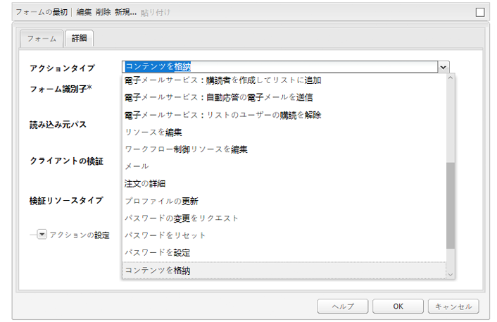
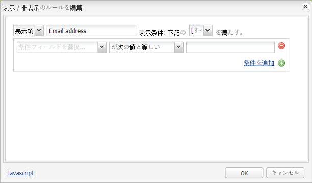
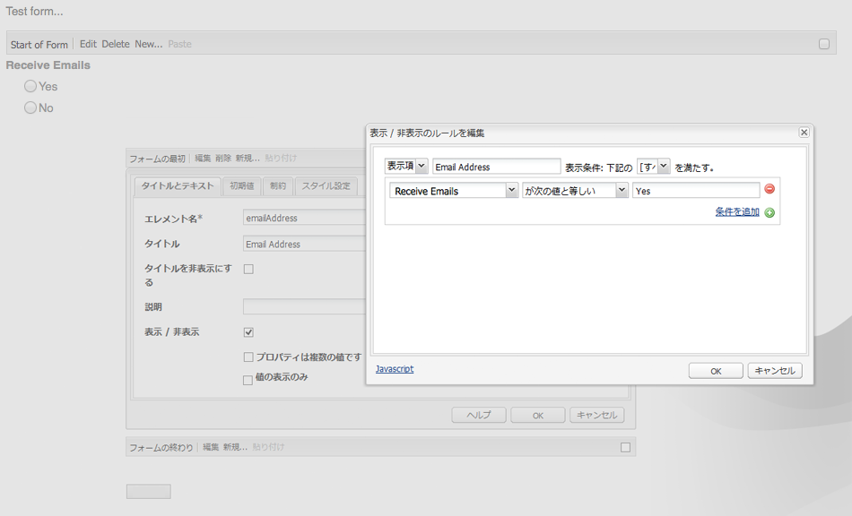
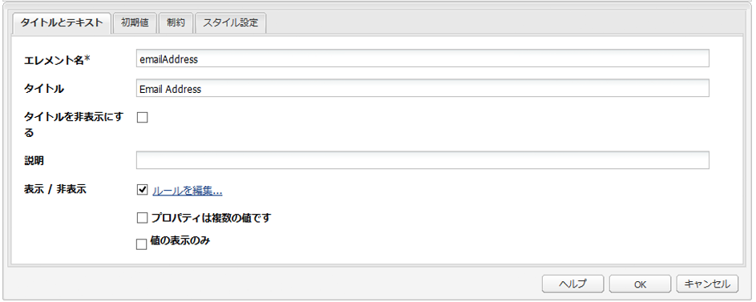

# フォームの作成（クラシック UI）{#developing-forms-classic-ui}

フォームの基本的な構造は次のとおりです。

* フォーム開始
* フォームエレメント
* フォーム終了

これらはすべて、標準の AEM インストールで利用できるデフォルトの一連の[フォームコンポーネント](/help/sites-authoring/default-components.md#form)を使用して実現されます。

フォームで使用する[新しいコンポーネントを開発する](/help/sites-developing/developing-components-samples.md)ほかに、次のこともできます。

* [フォームに値をプリロードする](#preloading-form-values)
* [（特定の）フィールドに複数値をプリロードする](#preloading-form-fields-with-multiple-values)
* [新しいアクションを作成する](#developing-your-own-form-actions)
* [新しい制約を作成する](#developing-your-own-form-constraints)
* [特定のフォームフィールドを表示または非表示にする](#showing-and-hiding-form-components)

必要に応じて、[スクリプトを使用して](#developing-scripts-for-use-with-forms)、機能を拡張できます。

>[!NOTE]
>
>このドキュメントでは、クラシック UI の[基盤コンポーネント](/help/sites-authoring/default-components-foundation.md)を使用したフォームの作成に重点を置いて説明します。アドビでは、タッチ操作対応 UI でのフォーム作成に新しい[コアコンポーネント](https://docs.adobe.com/content/help/ja-JP/experience-manager-core-components/using/introduction.html)と[非表示の条件](/help/sites-developing/hide-conditions.md)を使用することをお勧めします。

## フォーム値のプリロード {#preloading-form-values}

フォーム開始コンポーネントには、**読み込み元パス**（リポジトリ内のノードを指すオプションのパス）を指定するフィールドがあります。

読み込み元パスとは、定義済みの値をフォーム上の複数のフィールドに読み込むために使用するノードプロパティのパスです。

これは、リポジトリ内のノードへのパスを指定するオプションのフィールドです。このノードに、フィールド名と一致するプロパティがある場合、フォーム上の適切なフィールドがそのプロパティの値が設定された状態でプリロードされます。一致が存在しない場合、フィールドにはデフォルト値が使用されます。

>[!NOTE]
>
>[フォームアクション](#developing-your-own-form-actions)で初期値の読み込み元となるリソースを設定することもできます。This is done using `FormsHelper#setFormLoadResource` inside `init.jsp`.
>
>設定されていない場合にのみ、作成者がフォーム開始コンポーネントに設定したパスからフォームに値が読み込まれます。

### フォームフィールドへの複数値のプリロード {#preloading-form-fields-with-multiple-values}

様々なフォームフィールドには、**項目読み込みパス**（リポジトリ内のノードを指すオプションのパス）もあります。

**項目読み込みパス**&#x200B;とは、定義済みの値をフォーム上の特定のフィールド（[ドロップダウンリスト](/help/sites-authoring/default-components-foundation.md#dropdown-list)、[チェックボックスグループ](/help/sites-authoring/default-components-foundation.md#checkbox-group)、[ラジオグループ](/help/sites-authoring/default-components-foundation.md#radio-group)など）に読み込むために使用するノードプロパティのパスです。

#### 例 - ドロップダウンリストへの複数値のプリロード {#example-preloading-a-dropdown-list-with-multiple-values}

ドロップダウンリストは、選択肢の値を提供するように設定できます。

「**項目読み込みパス**」を使用すると、リポジトリ内のフォルダーからリストにアクセスし、リストの値をフィールドにプリロードできます。

1. 例えば、新しいSlingフォルダー( `sling:Folder`)を作成します。 `/etc/designs/<myDesign>/formlistvalues`

1. Add a new property (for example, `myList`) of type multi-value string ( `String[]`) to contain the list of drop down items. コンテンツはスクリプト（JSP スクリプトやシェルスクリプトの curl など）を使用してインポートすることもできます。

1. Use the full path in the **Items Load Path** field:
for example, `/etc/designs/geometrixx/formlistvalues/myList`

Note that if the values in the `String[]` are of the formatted like this:

* `AL=Alabama`
* `AK=Alaska`
* *等。*

次のリストが生成されます。

* `<option value="AL">Alabama</option>`
* `<option value="AK">Alaska</option>`

この機能は、多言語設定などに適しています。

### 独自のフォームアクションの作成 {#developing-your-own-form-actions}

フォームにはアクションが必要です。アクションでは、ユーザーデータが入力されたフォームが送信されたときに実行する操作を定義します。

標準の AEM インストールに用意されている一連のアクションは、

`/libs/foundation/components/form/actions`

および&#x200B;**フォーム**&#x200B;コンポーネントの「**アクションタイプ**」リストで確認できます。

この節では、このリストに含める独自のフォームアクションを作成する方法について説明します。

You can add your own action under `/apps` as follows:

1. Create a node of type `sling:Folder`. Specify a name that reflects the action to be implemented.

   次に例を示します。

   `/apps/myProject/components/customFormAction`

1. このノードで、次のプロパティを定義し、「**すべて保存**」をクリックして、変更を保存します。

   * `sling:resourceType` - `foundation/components/form/action`

   * `componentGroup`  — 次の形式で定義 `.hidden`

   * 省略可能：

      * `jcr:title`  — 選択したタイトルを指定します。これは、ドロップダウン選択リストに表示されます。 設定しない場合、ノード名が表示されます

      * `jcr:description`  — 選択した内容を入力します。

1. フォルダーにダイアログノードを作成します。

   1. アクションを選択したら、作成者がフォームダイアログを編集できるようにフィールドを追加します。

1. フォルダーに次のどちらかを作成します。

   1. ポストスクリプト。The name of the script is `post.POST.<extension>`, e.g. `post.POST.jsp`
The post script is invoked when a form is submitted to process the form, it contains the code that handles the data arriving from the form 
`POST`。

   1. フォームが送信されたときに呼び出される転送スクリプトを追加します。The name of the script is `forward.<extension`>, e.g. `forward.jsp`
This script can define a path. 現在の要求が、指定されたパスに転送されます。
   The necessary call is `FormsHelper#setForwardPath` (2 variants). 通常は、何らかの検証（ロジック）を実行して、ターゲットパスを見つけ、そのパスに転送し、デフォルトの Sling POST サーブレットで JCR への実際の保存を実行できるようにします。

   また、フォームアクションと `forward.jsp` が「グルー」コードとしてのみ動作するような場合には、別のサーブレットで実際の処理を実行することもできます。An example of this is the mail action at `/libs/foundation/components/form/actions/mail`, which forwards details to `<currentpath>.mail.html`where a mail servlet sits.

   まとめると、次のようになります。

   * `post.POST.jsp` は、アクション自体によって完全に実行される小さな操作に便利です。
   * `forward.jsp` は、委任のみが必要な場合に便利です。

   スクリプトは次の順序で実行されます。

   * Upon rendering the form ( `GET`):

      1. `init.jsp`
      1. for all field&#39;s constraints: `clientvalidation.jsp`
      1. form&#39;s validationRT: `clientvalidation.jsp`
      1. 設定されている場合は、読み込みリソースを介してフォームが読み込まれます
      1. `addfields.jsp` レンダリング内で `<form></form>`
   * upon handling a form `POST`:

      1. `init.jsp`
      1. for all field&#39;s constraints: `servervalidation.jsp`
      1. form&#39;s validationRT: `servervalidation.jsp`
      1. `forward.jsp`
      1. 転送パスが設定されていた場合（`FormsHelper.setForwardPath`）、要求を転送し、その後、`cleanup.jsp` を呼び出します

      1. 転送パスが設定されていなかった場合、`post.POST.jsp` を呼び出します（ここで終了し、`cleanup.jsp` は呼び出されません）

1. 必要に応じて、再びフォルダーに以下を追加します。

   1. フィールドを追加するためのスクリプト。The name of the script is `addfields.<extension>`, e.g. `addfields.jsp`
An addfields script is invoked immediately after the HTML for the form start is written. これにより、カスタム入力フィールドなどの HTML をフォーム内に追加するアクションを実行できます。

   1. 初期化スクリプト。The name of the script is `init.<extension>`, e.g. `init.jsp`
This script is invoked when the form is rendered. これは、アクションの詳細を初期化するために使用できます。&quot;

   1. クリーンアップスクリプト。The name of the script is `cleanup.<extension>`, e.g. `cleanup.jsp`
This script can be used to perform cleanup.

1. parsys でこの&#x200B;**フォーム**&#x200B;コンポーネントを使用します。これで「**アクションタイプ**」ドロップダウンに新しいアクションが含まれるようになります。

   >[!NOTE]
   >
   >製品に用意されているデフォルトのアクションは、以下で確認できます。
   >
   >
   >`/libs/foundation/components/form/actions`

### 独自のフォーム制約の作成 {#developing-your-own-form-constraints}

制約は、次の 2 つのレベルで課すことができます。

* [個々のフィールド（次の手順を参照してください）](#constraints-for-individual-fields)
* [フォームグローバル検証](#form-global-constraints)

#### 個々のフィールドの制約 {#constraints-for-individual-fields}

You can add your own constraints for an individual field (under `/apps`) as follows:

1. Create a node of type `sling:Folder`. Specify a name that reflects the constraint to be implemented.

   次に例を示します。

   `/apps/myProject/components/customFormConstraint`

1. このノードで、次のプロパティを定義し、「**すべて保存**」をクリックして、変更を保存します。

   * `sling:resourceType`  — 設定 `foundation/components/form/constraint`

   * `constraintMessage` - フォームの送信時に、制約に照らしてフィールドが無効な場合に表示されるカスタマイズされたメッセージ

   * 省略可能：

      * `jcr:title`  — 選択したタイトルを指定します。これは選択リストに表示されます。 設定しない場合、ノード名が表示されます
      * `hint` - ユーザーに向けたフィールドの使用方法に関する追加情報

1. このフォルダー内には、少なくとも次のどちらかのスクリプトが必要です。

   * クライアント検証スクリプト：スクリプトの名前 `clientvalidation.<extension>`(例：フォームフィールドがレンダリングされ `clientvalidation.jsp`るときに呼び出されます)。 このスクリプトを使用すると、クライアントでフィールドを検証するクライアント JavaScript を作成できます。

   * サーバー検証スクリプト：スクリプトの名前 `servervalidation.<extension>`(例： `servervalidation.jsp`フォームが送信されると呼び出されます)。 このスクリプトを使用すると、フォームの送信後にサーバーでフィールドを検証できます。

>[!NOTE]
>
>サンプルの制約は、以下で確認できます。
>
>`/libs/foundation/components/form/constraints`

#### フォームグローバル制約 {#form-global-constraints}

フォームグローバル検証は、開始フォームコンポーネントでリソースタイプを設定することで指定します（`validationRT`）。次に例を示します。

`apps/myProject/components/form/validation`

その後、以下を定義できます。

* a `clientvalidation.jsp` - injected after the field&#39;s client validation scripts
* and a `servervalidation.jsp` - also called after the individual field server validations upon a `POST`.

### フォームコンポーネントの表示と非表示 {#showing-and-hiding-form-components}

フォーム内の他のフィールドの値に応じてフォームコンポーネントの表示と非表示が切り替わるようにフォームを設定できます。

フォームフィールドの表示の変更は、フィールドが特定の条件のみで必要となる場合に便利です。例えば、フィードバックフォームで、顧客に電子メールで製品情報を送信してよいかを尋ねて、顧客が「はい」を選択すると、顧客が電子メールアドレスを入力できるテキストフィールドが表示されるような場合です。

フォームコンポーネントを表示または非表示にする条件を指定するには、**表示 / 非表示のルールを編集**&#x200B;ダイアログボックスを使用します。

ダイアログボックスの最上部にあるフィールドを使用して、次の情報を指定します。

* コンポーネントの表示または非表示に関する条件を指定するかどうか
* コンポーネントを表示または非表示にするのは、条件のいずれかが満たされた場合か、すべてが満たされた場合か

1 つ以上の条件がこれらのフィールドの下に表示されます。条件では、ある値に対して、同じフォーム上の別のフォームコンポーネントの値が比較されます。フィールドの実際の値が条件を満たした場合に、条件が真と評価されます。条件には以下の情報が含まれます。

* 評価するフォームフィールドのタイトル。
* 演算子
* フィールドの値と比較する値

例えば、ラジオグループコンポーネントのタイトル `Receive email notifications?`が* *の場合、ラジオボタン `Yes` と `No` ラジオボタンが含まれます。 「`Email Address`」というタイトルのテキストフィールドコンポーネントは、次の条件を使用しているので、「`Yes`」が選択された場合に表示されます。

JavaScript の場合、条件にはエレメント名プロパティの値を使用して、フィールドを参照します。In the previous example, the Element Name property of the Radio Group component is `contact`. 次のコードは、前の例と同等の JavaScript コードです。

`((contact == "Yes"))`

**フォームコンポーネントを表示または非表示にするには：**

1. 特定のフォームコンポーネントを編集します。

1. 「**表示 / 非表示**」を選択して、**表示 / 非表示のルールを編集**&#x200B;ダイアログを開きます。

   * 最初のドロップダウンリストで、「**表示**」または「**非表示**」を選択して、条件に応じてコンポーネントを表示するか、非表示にするかを指定します。

   * 一番上の行の末尾にあるドロップダウンリストで、次のどちらかを選択します。

      * **すべて** - すべての条件を満たした場合に、コンポーネントが表示または非表示になります。
      * **いずれか** - 1 つでも条件を満たした場合に、コンポーネントが表示または非表示になります。
   * 条件行で（デフォルトとして 1 つだけ表示されます）、コンポーネントと演算子を選択し、値を指定します。
   * 必要に応じて、「**条件を追加**」をクリックして、条件を追加します。

   次に例を示します。

   

1. 「**OK**」をクリックして、定義を保存します。

1. 定義を保存すると、フォームコンポーネントプロパティの「**表示 / 非表示**」オプションの横に「**ルールを編集**」リンクが表示されます。そのリンクをクリックすると、**表示 / 非表示のルールを編集**&#x200B;ダイアログボックスが開いて、変更できます。

   「**OK**」をクリックして、すべての変更を保存します。

   

   >[!CAUTION]
   >
   >表示／非表示の定義の効果は、以下で確認およびテストできます。
   >
   >
   >
   >    * 作成環境の&#x200B;**プレビュー**&#x200B;モード（最初にプレビューに切り替えるときに、ページをリロードする必要があります）
      >
      >    
   * パブリッシュ環境

#### 壊れたコンポーネント参照の処理 {#handling-broken-component-references}

表示／非表示の条件では、エレメント名プロパティの値を使用して、フォーム内の他のコンポーネントを参照します。削除されたコンポーネントを参照している条件や、Element Nameプロパティが変更された条件がある場合、表示/非表示の設定は無効です。 その場合は、手動で条件を更新する必要があります。更新しないと、フォームの読み込み時にエラーが発生します。

表示/非表示の設定が無効な場合、設定はJavaScriptコードとしてのみ提供されます。 コードを編集して、問題を修正します。そのコードでは、コンポーネントを参照するために元々使用していたエレメント名プロパティを使用しています。

### フォームで使用するスクリプトの作成 {#developing-scripts-for-use-with-forms}

スクリプトを記述する際に使用できる API エレメントについて詳しくは、[フォームに関連する javadoc](https://helpx.adobe.com/experience-manager/6-5/sites/developing/using/reference-materials/javadoc/com/day/cq/wcm/foundation/forms/package-summary.html) を参照してください。

これは、フォームが送信される前にサービスを呼び出し、呼び出しに失敗した場合にサービスをキャンセルするなどのアクションに使用できます。

* 検証リソースタイプを定義します。
* 検証用のスクリプトを含めます。

   * JSP で、Web サービスを呼び出し、エラーメッセージを含む `com.day.cq.wcm.foundation.forms.ValidationInfo` オブジェクトを作成します。エラーが発生した場合、フォームデータはポストされません。
