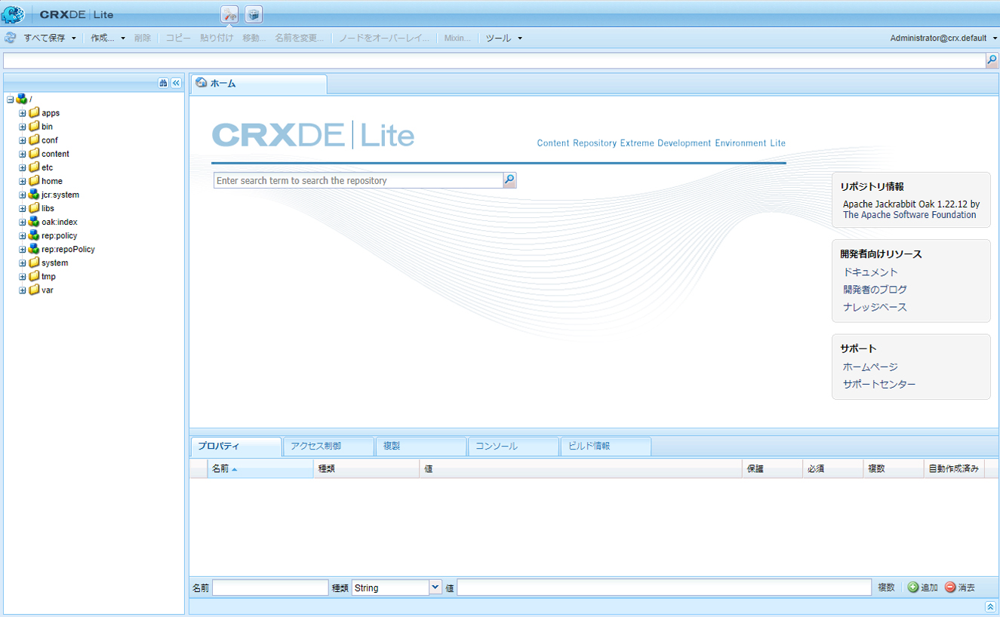

# CRXDE Lite による開発{#developing-with-crxde-lite}

ここでは、CRXDE Lite を使用して AEM アプリケーションを開発する方法について説明します。

使用可能な他の開発環境について詳しくは、概要のドキュメントを参照してください。

CRXDE Lite は AEM に搭載されており、これを使用してブラウザー内で標準的な開発作業を実行できます。CRXDE Liteでは、ログ記録時に、プロジェクトの作成、ファイル（.jspや.javaなど）の作成、ファイルの作成と編集、フォルダ、テンプレート、コンポーネント、ダイアログ、ノード、プロパティおよびバンドルを実行できます。
CRXDE Lite は、AEM サーバーに直接アクセスできない場合、すぐに使用可能なコンポーネントと Java バンドルを拡張または変更してアプリケーションを開発する場合、または専用のデバッガー、コード補完および構文のハイライト表示を必要としない場合にお勧めします。

>[!NOTE]
>
>AEM 6.5.5.0以降では、CRXDE Liteの匿名アクセスは不可能になりました。
>ユーザーはログイン画面にリダイレクトされます。

>[!NOTE]
>
>プロジェクトの開発時には [AEM Developer Tools for Eclipse](/help/sites-developing/aem-eclipse.md) および [AEM HTL Brackets Extension](/help/sites-developing/aem-brackets.md) を使用することをお勧めします。

## CRXDE Lite の使用 {#getting-started-with-crxde-lite}

CRXDE Lite の使用を開始するには、次の手順に従ってください。

1. AEM をインストールします。
1. ブラウザーに、と入力し `https://<host>:<port>/crx/de`ます。 デフォルトでは有効で `https://localhost:4502/crx/de`す。
1. **ユーザー名**&#x200B;と&#x200B;**パスワード**&#x200B;を入力します。By default it is `admin` and `admin`.

1. 「**OK**」をクリックします。

ブラウザーでは、CRXDE Lite のユーザーインターフェイスは次のように表示されます。 

これで、CRXDE Lite を使用してアプリケーションを開発できます。

## ユーザーインターフェイスの概要 {#overview-of-the-user-interface}

CRXDE Lite には以下の機能があります。

<table>
 <tbody>
  <tr>
   <td>上部のスイッチャーバー</td>
   <td>CRXDE Lite、パッケージマネージャー、パッケージ共有をすぐに切り替えることができます。</td>
  </tr>
  <tr>
   <td>ノードパスウィジェット</td>
   <td>
現在選択しているノードのパスを表示します。
 
このウィジェットに手動でパスを入力するか、または別の場所からパスを貼り付けて、Enter キーを押すと、特定のノードにジャンプできます。
 
また、特定の名前を持つノードの検索がサポートされます。検索するノードの名前を入力して待機します（または、右側にある検索の記号をクリックします）。例えば、<em>oak</em> などの文字列をウィジェットに入力して、検索がどのように機能するかを確認できます。特定のノードがエクスプローラーウィンドウに読み込まれると、リストが表示されます。パスを選択して Enter キーを押すと、その場所に移動できます。この機能は、ブラウザーで現在 CRXDE クライアントアプリケーションに読み込まれているノードでしか使用できません。リポジトリ全体を検索する場合は、ツール／クエリを使用します。
 </td>
  </tr>
  <tr>
   <td>エクスプローラーウィンドウ</td>
   <td>
リポジトリ内のすべてのノードのツリーを表示します。
 
ノードをクリックして、そのプロパティを「<strong>プロパティ</strong>」タブに表示します。ノードをクリックしたら、ツールバーでアクションを選択できます。ノード名を変更するには、ノードをもう一度クリックします。
 
ツリーナビゲーションフィルター（双眼鏡アイコン）：リポジトリ内のノードのうち、入力テキストが名前に含まれているノードをフィルタリングできます。このフィルターは、ローカルに読み込まれたノードにのみ適用されます。  
 </td>
  </tr>
  <tr>
   <td>編集ウィンドウ</td>
   <td>
「<strong>ホーム</strong>」タブ：コンテンツやドキュメントを検索したり、開発者リソース（ドキュメント、開発者向けブログ、ナレッジベース）とサポート（アドビのホームページとサポートセンター）にアクセスしたりできます。  
 
<strong>エクスプローラー</strong>ウィンドウでファイルをダブルクリックして、その内容を表示します（例：.jsp ファイルまたは .java ファイル）。次に、ファイルを変更して保存できます。
 
<strong>編集</strong>ウィンドウでファイルを編集した後は、ツールバーで次のツールを使用できるようになります。  
 - <strong>ツリーに表示：</strong>リポジトリツリー内のファイルを表示します。  - <strong>検索と置換</strong>：検索または置換をおこないます。   <strong>編集</strong>ウィンドウのステータス行をダブルクリックすると、<strong>行に移動</strong>ダイアログが開き、移動先の特定の行番号を入力できます。  </td>
  </tr>
  <tr>
   <td>「プロパティ」タブ  </td>
   <td>選択したノードのプロパティを表示します。新しいプロパティを追加したり、既存のプロパティを削除したりできます。  </td>
  </tr>
  <tr>
   <td>「アクセス制御」タブ</td>
   <td>
現在のパス、リポジトリレベルまたはプリンシパルに基づいて権限を表示します。
 
権限は次のように分類されます。
 
- <strong>適用可能なアクセス制御ポリシー</strong>：現在の選択項目に適用可能なポリシー。
 
- <strong>ローカルアクセス制御ポリシー</strong>：現在の選択項目に対してローカルに適用される現在のポリシー。
 
- <strong>有効なアクセス制御ポリシー</strong>：現在の選択項目に適用される現在のポリシーは、ローカルに設定されるか、親ノードから継承されます。
 
注意：アクセス制御情報を確認できるようにするには、CRXDE Lite にログインしたユーザーに ACL エントリを読み取る権限が割り当てられている必要があります。デフォルトでは、匿名ユーザーはこの情報を確認できません。情報を確認するには、例えば admin としてログインしてください。
 </td>
  </tr>
  <tr>
   <td>「レプリケーション」タブ</td>
   <td>
現在のノードのレプリケーションステータスを表示します。現在のノードをレプリケーションできます。または削除をレプリケーションできます。
 </td>
  </tr>
  <tr>
   <td>「コンソール」タブ  </td>
   <td>
<strong>サーバーログ</strong>：
 
ログメッセージを表示します。ログレベルの設定、コンソールのクリア、選択したスクロール位置での固定およびメッセージの表示の有効化／無効化をおこなうことができます。  
 
<strong>バージョン管理</strong>:
 
バージョン管理メッセージを表示します。  
 </td>
  </tr>
  <tr>
   <td>「ビルド情報」タブ  </td>
   <td>バンドルのビルド中に情報を表示します。  </td>
  </tr>
  <tr>
   <td>更新  </td>
   <td>現在の選択項目を更新します。他のユーザーによる変更が、リポジトリの自分のビューで更新されます。自分がおこなった変更には影響を及ぼしません。  </td>
  </tr>
  <tr>
   <td>すべて保存</td>
   <td>
<strong>すべて保存</strong>：  
 
おこなわれたすべての変更を保存します。「保存」をクリックするまで変更は一時的なものと見なされ、コンソールを終了すると失われます。
 
<strong>元に戻す</strong>:
 
前回の保存アクションの後に、選択したノードに対しておこなった変更をすべて破棄し、選択したノード用にリポジトリの現在の状態を再読み込みします。
 
<strong>すべて元に戻す</strong>：
 
前回の保存アクションの後に、リポジトリ全体でおこなった変更をすべて破棄し、リポジトリの現在の状態を再読み込みします。
 </td>
  </tr>
  <tr>
   <td>作成 ...  </td>
   <td>
選択したノードの下に次の項目を作成するためのドロップダウンメニューです。  
 
- <strong>ノード</strong>：任意のノードタイプを持つノード  
 
- <strong>File</strong>: nt:file node and its nt:resource subnode
 
- <strong>フォルダー</strong>：nt:folder ノード
 
- <strong>テンプレート</strong>：AEM テンプレート
 
- <strong>コンポーネント</strong>：AEM コンポーネント
 
- <strong>ダイアログ</strong>：AEM ダイアログ
 </td>
  </tr>
  <tr>
   <td>削除  </td>
   <td>選択したノードを削除します。  </td>
  </tr>
  <tr>
   <td>コピー</td>
   <td>選択したノードをコピーします。  </td>
  </tr>
  <tr>
   <td>貼り付け  </td>
   <td>Pastes the copied node under the selected node.  </td>
  </tr>
  <tr>
   <td>移動 ...  </td>
   <td>選択したノードを、ダイアログを使用して設定されたノードに移動します。</td>
  </tr>
  <tr>
   <td>名前を変更 ...  </td>
   <td>選択したノードの名前を変更します。  </td>
  </tr>
  <tr>
   <td>Mixin  </td>
   <td>Mixin タイプをノードタイプに追加できます。ほとんどの場合、Mixin タイプは高度な機能（バージョン管理、アクセス制御、参照、ロックなど）をノードに追加するために使用されます。</td>
  </tr>
  <tr>
   <td>ツール  </td>
   <td>
次のツールを含むドロップダウンメニューです。
 
- <strong>サーバー設定</strong>：Felix コンソールにアクセスします。
 
- <strong>クエリ</strong>：リポジトリを照会します。
 
- <strong>権限</strong>：権限管理を開いて、権限を確認および追加できます。
 
- <strong>アクセス制御をテスト</strong>：特定のパスまたはプリンシパルに対する権限をテストできる場所です。
 
- <strong>ノードタイプを書き出し</strong>：システム内のノードタイプを cnd 表記として書き出します。
 
- <strong>ノードタイプを読み込み</strong>：cnd 表記を使用してノードタイプを読み込みます。
 
- <strong>SiteCatalyst デバッガーをインストール</strong>：Analytics デバッガーをインストールする手順を示します。
 </td>
  </tr>
  <tr>
   <td>ログインウィジェット  </td>
   <td>
現在ログイン中のユーザーとログイン先のワークスペースを表示します（例：admin@crx.default）。
 
特定のユーザーとしてログインまたは再ログインするには、このウィジェットをクリックします。ログイン先のワークスペースを指定しない場合は、デフォルトのワークスペースである crx.default にログインします。
 
匿名ユーザーとしてリポジトリを参照する場合は、ログイン名に <strong>anonymous</strong> を使用し、任意のパスワード（例：スペース、ドット）を使用します。  
 
承認が無効になった場合（期限切れの場合など）は、ログインウィジェットに「<strong>無許可 - ログイン</strong>」と表示されます。もう一度ログインするには、このメッセージをクリックします。
 </td>
  </tr>
 </tbody>
</table>

## フォルダーの作成 {#creating-a-folder}

CRXDE Lite でフォルダーを作成するには：

1. ブラウザーで CRXDE Lite を開きます。
1. In the Navigation pane, right-click the folder under which you want to create the new folder, select **Create ...**, then **Create Folder ...**.

1. フォルダーの&#x200B;**名前**&#x200B;を入力して、「**OK**」をクリックします。

1. 「**すべて保存**」をクリックして、サーバーに変更を保存します。

## テンプレートの作成 {#creating-a-template}

CRXDE Lite でテンプレートを作成するには：

1. ブラウザーで CRXDE Lite を開きます。
1. ナビゲーションウィンドウで、テンプレートを作成するフォルダーを右クリックして、「**作成**」、「**テンプレートを作成**」の順に選択します。

1. テンプレートの&#x200B;**ラベル**、**タイトル**、**説明**、**リソースタイプ**&#x200B;および&#x200B;**ランキング**&#x200B;を入力します。「**次へ**」をクリックします。

1. （オプション）「**許可されているパス**」を設定します。「**次へ**」をクリックします。

1. This step is optional: set the **Allowed Parents**. Click **Next**.

1. This step is optional: set the **Allowed Children**. Click **OK**.

1. 「**すべて保存**」をクリックして、サーバーに変更を保存します。

次の項目が作成されます。

* A node of type `cq:Template` with Template properties

* ページコンテンツのプロパティを含む `cq:PageContent` タイプの子ノード

テンプレートにプロパティを追加できます。[プロパティの作成](#creating-a-property)の節を参照してください。

## コンポーネントの作成 {#creating-a-component}

ここで説明する機能を使用できるのは、CQ5 がインストールされている（つまり、ノードタイプ `cq:Component` をリポジトリで使用できる）場合のみです。

CRXDE Lite でコンポーネントを作成するには：

1. ブラウザーで CRXDE Lite を開きます。
1. ナビゲーションウィンドウで、コンポーネントを作成するフォルダーを右クリックして、「**作成**」、「**コンポーネントを作成**」の順に選択します。

1. コンポーネントの&#x200B;**ラベル**、**タイトル**、**説明**、**スーパーリソースタイプ**&#x200B;および&#x200B;**グループ**&#x200B;を入力します。「**次へ**」をクリックします。

1. （オプション）コンポーネントのプロパティ（「**コンテナです**」、「**装飾なし**」、「**セル名**」、「**ダイアログパス**」）を設定します。「**次へ**」をクリックします。

1. （オプション）コンポーネントのプロパティ「**許可されている親**」を設定します。「**次へ**」をクリックします。

1. （オプション）コンポーネントのプロパティ「**許可されている子**」を設定します。「**OK**」をクリックします。

1. 「**すべて保存**」をクリックして、サーバーに変更を保存します。

次の項目が作成されます。

* A node of type `cq:Component`
* コンポーネントのプロパティ
* コンポーネントの .jsp スクリプト

## ダイアログの作成 {#creating-a-dialog}

CRXDE Lite でダイアログを作成するには：

1. ブラウザーで CRXDE Lite を開きます。
1. In the Navigation pane, right-click the component where you want to create the dialog, select **Create ...**, then **Create Dialog ...**.

1. **ラベル**&#x200B;と&#x200B;**タイトル**&#x200B;を入力します。「**OK**」をクリックします。

1. 「**すべて保存**」をクリックして、サーバーに変更を保存します。

次の構造を持つダイアログが作成されます。

`dialog[cq:Dialog]/items[cq:Widget]/items[cq:WidgetCollection]/tab1[cq:Panel]`

これで、プロパティを変更するか、または新しいノードを作成すれば、ニーズに合ったダイアログを作成できます。

ダイアログエディターを使用してダイアログを編集することもできます。CRXDE Lite でダイアログノードをダブルクリックすると、エディターが表示されます。ダイアログエディターについて詳しくは、[こちら](/help/sites-developing/dialog-editor.md)を参照してください。

## ノードの作成 {#creating-a-node}

CRXDE Lite でノードを作成するには：

1. ブラウザーで CRXDE Lite を開きます。
1. ナビゲーションウィンドウで、新しいノードを作成するノードを右クリックして、「**作成**」、「**ノードを作成**」の順に選択します。
1. **名前**&#x200B;と&#x200B;**タイプ**&#x200B;を入力します。「**OK**」をクリックします。
1. 「**すべて保存**」をクリックして、サーバーに変更を保存します。

これで、プロパティを変更するか、または新しいノードを作成すれば、ニーズに合ったノードを作成できます。

>[!NOTE]
>
>ノードの作成を含むほとんどの編集操作では、すべての変更をメモリに保持し、保存時（「すべて保存」ボタンをクリックした場合）にのみそれらをリポジトリに格納します。ただし、移動などの一部の操作は自動的に保持されます。
>
>最初に変更を保存する際には、新しく作成したノードが親ノードのノードタイプで許可されるかどうかに関する検証も JCR リポジトリによって実行されます。ノードの保存時にエラーメッセージが表示された場合は、コンテンツ構造が有効かどうかを確認してください（例えば、`nt:unstructured` ノードを `nt:folder` ノードの子として作成することはできません）。

## プロパティの作成 {#creating-a-property}

CRXDE Lite でプロパティを作成するには：

1. ブラウザーで CRXDE Lite を開きます。
1. ナビゲーションウィンドウで、新しいプロパティを追加するノードを選択します。
1. 下部のウィンドウの「**プロパティ**」タブで、「**名前**」、「**タイプ**」および「**値**」に入力します。「**追加**」をクリックします。

1. 「**すべて保存**」をクリックして、サーバーに変更を保存します。

## スクリプトの作成 {#creating-a-script}

新しいスクリプトを作成するには：

1. ブラウザーで CRXDE Lite を開きます。
1. ナビゲーションウィンドウで、スクリプトを作成するコンポーネントを右クリックして、「**作成**」、「**ファイルを作成**」の順に選択します。

1. 拡張子を含む&#x200B;**ファイル名**&#x200B;を入力します。「**OK**」をクリックします。

1. 新しいファイルが編集ウィンドウ内のタブとして開きます。
1. ファイルを編集します。
1. 「**すべて保存**」をクリックして変更を保存します。

## ノードタイプの書き出しと読み込み {#exporting-and-importing-node-types}

With CRXDE Lite you can import and/or export node type definitions in [CND (Compact Namespace and Node Type Definition) notation](https://jackrabbit.apache.org/jcr/node-type-notation.html).

ノードタイプ定義を書き出すには：

1. ブラウザーで CRXDE Lite を開きます。
1. 必要なノードを選択します。
1. 「**ツール**」、「**ノードタイプを書き出し**」の順に選択します。

1. cnd 表記の定義がブラウザーに表示されます。必要に応じて情報を保存します。

ノードタイプ定義を読み込むには：

1. ブラウザーで CRXDE Lite を開きます。
1. 「**ツール**」、「**ノードタイプを読み込み**」の順に選択します。

1. テキストボックスに定義の CND 表記を入力します。
1. 既存の定義を更新する場合は、「**更新を許可**」を選択します。
1. 「**読み込み**」をクリックします。

## ログ {#logging}

With CRXDE Lite you can display the file `error.log` that is located on the file system at `<crx-install-dir>/crx-quickstart/server/logs` and filter it with the appropriate log level. 以下の手順を実行します。

1. ブラウザーで CRXDE Lite を開きます。
1. ウィンドウの下部にある「**コンソール**」タブの右側のドロップダウンメニューで、「**サーバーログ**」を選択します。

1. 「**停止**」アイコンをクリックして、メッセージを表示します。

以下の操作を実行できます。

* Adjust the log parameters in the Felix Console by clicking the **Logging Configurations** icon.
* **ブラシ**&#x200B;アイコンをクリックしてメッセージを消去します。
* **ピン**&#x200B;アイコンをクリックして、現在選択されている場所にメッセージを固定します。
* 「**停止**」アイコンをクリックしてメッセージの表示を有効または無効にします。

## アクセス制御 {#access-control}

>[!NOTE]
>
>詳しくは、[ユーザー、グループおよびアクセス権の管理](/help/sites-administering/user-group-ac-admin.md)を参照してください。
