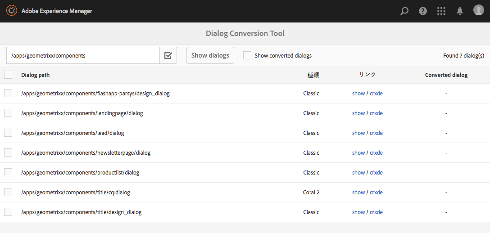

# ダイアログ変換ツール{#dialog-conversion-tool}

ダイアログ変換ツールは、（ExtJS に基づく）クラシック UI 用のダイアログ、または Granite UI および Coral 2 に基づくダイアログが 1 つしか定義されていない既存のコンポーネントを拡張する場合に役立ちます。このツールでは、元のダイアログを使用して、Granite UI および Coral 3 に基づく標準 UI 用の複製のダイアログを作成します。

このツールの目的は、アップグレードをできる限り自動化して効率を高め、エラーを削減することです。ただし、このツールはあらゆるシナリオに対応できるわけではないので、プロセスを完全に自動化することはできません。また、ユーザーは、変換後のダイアログを確認し、場合によっては再調整する必要があります。このツールは、変換プロセスの開始を支援するための補助用ツールですが、変換を完全に制御することを目的としていません。

このツールは、標準 UI、Granite UI および Coral 3 ベースの UI を使用して新しいダイアログを作成しますが、変換できない項目はスキップします。そのため、特定のコンポーネントに一致するルールがない場合は、作成されたダイアログに、コピー元のダイアログのノードがそのままの状態で含まれている場合があります。また、変換後のコンポーネントには変換されていないプロパティがいくつか含まれている場合があります。これは、そのプロパティの変換に適したルールが存在しなかったからです。

>[!CAUTION]
>
>このツールはあらゆるシナリオに対応できるわけではありません。これは、変換ルールが包括的なものではなく、ベストエフォート型であるからです。このツールは最も頻繁に使用される要素およびプロパティを変換しますが、カスタマイズまたは非常に特殊なダイアログを処理する際は変換が不完全になります。**変換後のダイアログではさらなる調整が必要になる場合があり、すべての変換を確認する必要があります。**

>[!NOTE]
>
>クラシック UI の開発または強化は終了しているので、アドビのユーザーには、最新のテクノロジーを利用できるよう、デフォルトの Granite UI ユーザーインターフェイスにアップグレードすることをお勧めしています。
>
>一般には最新プラットフォームへの移行が推奨されていますが、Coral 2 から Coral 3 への移行は重要ではありません。ただし、新しいプロジェクトは Coral 3 に基づいて開始することをお勧めします。

## ダイアログ変換ツールのダウンロードとインストール  {#download-and-install-the-dialog-conversion-tool}

ダイアログ変換ツールはオープンソース化されており、GitHub からアクセスできます。

GitHub のコード

このページのコードは GitHub にあります

* [GitHubでaem-dialog-conversionプロジェクトを開きます](https://github.com/Adobe-Marketing-Cloud/aem-dialog-conversion)
* プロジェクトを [ZIP ファイル](https://github.com/Adobe-Marketing-Cloud/aem-dialog-conversion/archive/master.zip)としてダウンロードします

>[!NOTE]
>
>AEM にはダイアログ変換ツールが付属していません。このツールを使用するには、ダウンロードしてインストールする必要があります。

ダイアログ変換ツールをインストールするには、次の手順を実行します。

1. [Dialog Conversion Tool GitHub プロジェクト](https://github.com/Adobe-Marketing-Cloud/aem-dialog-conversion/releases)からパッケージをダウンロードします。
1. インスタンスにパッケージをインストールします。パッケージ管理について詳しくは、[パッケージの使用方法](/help/sites-administering/package-manager.md)を参照してください。

## ダイアログの変換  {#converting-a-dialog}

このツールは、対応するGranite UI/Coral 3ダイアログをコンテンツツリーの元のダイアログと同じ場所に作成して、ダイアログを変換します。 Granite UI/Coral 2のダイアログの場合は、上書きされないように、これらのダイアログはバックアップの場所にコピーされます（ダイアログノード名に`.coral2`サフィックスが追加されます）。 このツールでは、デザインダイアログおよび編集ダイアログを変換できます。

1 つ以上のダイアログを変換するには、次の手順を使用します。

1. **ダイアログコンバージョン**&#x200B;コンソールを開き、**グローバルナビゲーション** -> **ツール** -> **操作**&#x200B;からアクセスできます。

   `https://<hostname>:<port>/libs/cq/dialogconversion/content/console.html`

   

1. `/apps/geometrixx/components`など、必要なパスを入力します。 `/apps/geometrixx/components/lead`などの単一のダイアログへのダイレクトパスを入力することもできます。

   

1. 「**ダイアログを表示**」を選択して、指定した場所にあるすべてのダイアログを表示します。

   

   この表では、入力されたパスの下にある既存のすべての従来のダイアログがリストされます。 各ダイアログには、種類が表示されます。 次のタイプがあります。

   * **クラシック：ノ** ード名を持つ `cq:Dialog` タイプ `dialog` または  `design_dialog`
   * **Coral 2：子コンテンツノードにGranite UI** /Coral 2リソースタイプ `cq:dialog` が指定され `cq:design_dialog` たノード、またはその子コンテンツノードに

   各行には、ダイアログを表示するためのリンクと、そのノード構造を表示するための CRXDE Lite へのリンクが含まれています。

   >[!NOTE]
   >
   >クラシック UI または Coral 2 用のダイアログがまったく存在しないコンポーネント（つまり Granite UI／Coral 3 でデザインされたコンポーネント）は表示されません。

1. 変換する1つまたは複数のダイアログを選択し、「**変換Xダイアログ**」をクリックまたはタップして、変換プロセスを開始します。

   

1. 選択したダイアログが変換の結果と共に表示されます。変換が成功した場合、その行には、変換後のダイアログを表示するためのリンク、または CRXDE Lite でこのダイアログを開くためのリンクが表示されます。

   「**戻る**」をクリックして、ダイアログ変換ツールに戻ります。

   

1. ダイアログ変換ツールに戻ると、変換されたダイアログはリストに表示されなくなります。ただし、検出されたダイアログの合計数は、変換済みのダイアログが含まれたまま表示されていることに注意してください。つまり、表の行数が検出された数と必ずしも一致しません。

   

1. 「**変換済みダイアログを表示**」チェックボックスをオンにすると、指定したパスにある変換済みのダイアログが表示されます。

   

   ダイアログが既に変換されている場合は、変換されたダイアログにもリンクが表示されます。 兄弟の Granite UI／Coral 3 ダイアログが存在する場合、ダイアログは変換済みであると見なされます。

## ダイアログの書き換えルール {#dialog-rewrite-rules}

対話変換ツールは、書き換え規則を適用して対象グラフを変換する&#x200B;**グラフ書き換え**&#x200B;の概念に基づく。 書き換えルールは、パターンと置き換えグラフとのペアリングです。 ルールが対象となるグラフの特定の部分グラフに一致すると、その部分グラフが置き換えられます。グラフの書き換えについて詳しくは、[https://en.wikipedia.org/wiki/Graph_rewriting](https://en.wikipedia.org/wiki/Graph_rewriting)も参照してください。

ダイアログ変換ツールでは、この手法を使用して、従来のダイアログツリー（クラシックまたは Granite UI／Coral 2）を Granite UI／Coral 3 のダイアログツリーに書き換えます。照合が単一のノードやプロパティに対してではなく、実際のサブツリーに対しておこなわれるので、変換の柔軟性が非常に高く、複雑なコンポートも考慮できるという利点があります。

### アルゴリズム  {#algorithm}

書き換えアルゴリズムでは、パラメーターとして、書き換え対象のツリーと一連の書き換えルールを受け取ります。ツリーは先行順でトラバースされ、ノードごとに、そのノードをルートとするサブツリーにルールが当てはまるかどうかがチェックされます。最初に一致したルールが、そのサブツリーを書き換えるために適用されます。次に、そのルートからトラバースが再開されます。ツリー全体がトラバースされ、サブツリーに一致するルールがなくなった時点ですぐにアルゴリズムは終了します。最適化の測定基準として、アルゴリズムは最終的なノードのセットを追跡し続けるので、後続のトラバルで一致を再チェックする必要はありません。 書き換えルールによって、書き換えられたツリーのどのノードが最終であるか、アルゴリズムを今後通過する際にどのノードを再確認する必要があるかを定義します。

変換のエントリポイントは`DialogConversionServlet`で、`/libs/cq/dialogconversion/content/convert.json`へのPOSTリクエストに登録されます。 変換する必要のあるダイアログへのパスを含む配列であるパス要求パラメータを受け取ります。 次に、サーブレットは、各ダイアログに対して、定義済みのダイアログ書き換え規則をすべて適用して、対応するダイアログツリーを書き換えます。

### 書き換えルールのタイプ {#rewrite-rule-types}

書き換えルールは、次に示す 2 つの異なる方法で定義できます。

* JCR ノード構造 - [ノードベースの書き換えルール](/help/sites-developing/dialog-conversion.md#node-based-rewrite-rules)

* 特定のインターフェイスを実装する Java クラス - [Java ベースの書き換えルール](/help/sites-developing/dialog-conversion.md#java-based-rewrite-rules)

[すぐに使える](#provided-rewrite-rules)が用意されているものもありますが、独自のカスタマイズルールを定義することもできます。 [サンプルの書き換えルール](/help/sites-developing/dialog-conversion.md#sample-rewrite-rules)も使用できます。

通常は、1 つのダイアログの書き換えルールで 1 つのダイアログ要素（pathbrowser 入力フィールドなど）を書き換えます。

>[!CAUTION]
>
>再書き込みループはアルゴリズムによって検出されないので、**再書き込みルールはツリーを循環的に**&#x200B;書き換えてはならない。

### ノードベースの書き換えルール {#node-based-rewrite-rules}

ダイアログの書き換えルールは、ノードとプロパティの観点から定義できます。

```xml
rule
  - jcr:primaryType = nt:unstructured
  - cq:rewriteRanking = 4
  + patterns
    - jcr:primaryType = nt:unstructured
    + foo
      - ...
      + ...
    + foo1
      - ...
      + ...
  + replacement
    + bar
      - ...
      + ...
```

次の例では、2つの&#x200B;**パターン**（`foo`と`foo1`にルートするツリー）と&#x200B;**置換**（`bar`にルートするツリー）を含むルールを定義します。 パターンツリーと置換ツリーは、ノードとプロパティを含む任意のツリーです。 定義されたパターンのいずれかが一致する場合は、サブツリーにルールが一致します。 パターンを一致させるには、そのパターンと同じノードが対象となるツリーに含まれている（名前が一致する）必要があります。また、パターンで定義されたすべてのプロパティがツリーのプロパティに一致する必要があります。

一致した場合、一致したサブツリー（元のツリーと呼ばれる）は、置換によって置換されます。 置き換えツリーは、元のツリーのプロパティの値を継承するマップ済みプロパティを定義できます。 これらは`String`型で、次の形式を持つ必要があります。

`${<path>}`

参照先のプロパティが元のツリーに存在しない場合、そのプロパティは省略されます。または、そのような場合のためのデフォルト値を指定できます（String タイプのプロパティの場合のみ）。

`${<path>:<default>}`

「 `:` 」文字を含むプロパティは、デフォルト値の指定との競合を避けるために、一重引用符で囲むことができます。 式の先頭に「`!`」が付いている場合、Booleanプロパティは無効になります。 マッピングされたプロパティは複数の値を持つことができ、その場合は、一致したツリー内の最初のプロパティの値が割り当てられます。

例えば、次のプロパティ`one`には、一致した元のツリーのプロパティ`./two/three`の値が割り当てられます。

```xml
...
  + replacement
    + bar
      - one = ${./two/three}
      - negated = !${./some/boolean/prop}
      - default = ${./some/prop:default}
      - multi = [${./prop1}, ${./prop2}]
```

ルールでは、次のオプションのプロパティもサポートされます。

* `cq:rewriteOptional` (ブール型)

   パターンを一致させるためにノードが存在する必要がないことを示すには、パターンノードにこのプロパティを設定します

* `cq:rewriteRanking` （整数）

   ルールの適用順序に影響を与えるには、ルールノードでこのプロパティを設定します。 このプロパティは、より具体的な構造を処理するルールがより一般的なルールで上書きされないようにする場合に役立ちます。ランキングの低いルールがランキングの高いルールより優先されます。デフォルトでは、すべてのルールは、ランキングとして`Integer.MAX_VALUE`を受け取ります。

さらに、リプレースメントツリーでは以下の（名前が `cq:rewrite` で始まる）特殊なプロパティがサポートされます。

* `cq:rewriteMapChildren` (string)

   このプロパティを含むノードは、プロパティ値(例：`cq:rewriteMapChildren=./items`)。

* `cq:rewriteFinal` (ブール型)

   これは、このプロパティを含むノードが最終的で、一致する書き換えルールを再チェックする必要がないことをアルゴリズムに伝える最適化メジャーです。 置き換えノード自体に配置すると、置き換えツリー全体が最終と見なされます。
* `cq:rewriteCommonAttrs` (ブール型)

   置き換えノード(`rule`/ `replacement`)にこのプロパティを設定して、元のルートノードの関連するプロパティをコピールート内のGranite共通属性にマップします。 ターゲット上の`granite:data`サブノードをコピー/作成し、`data-*`プロパティを書き込むことで、データ属性を処理します。
* `cq:rewriteRenderCondition` (ブール型)

   置き換えノード(`rule`/ `replacement`)にこのプロパティを設定して、元のルートノードからコピールートの`granite:rendercondition`子にGraniteレンダリング条件（`rendercondition`または`granite:rendercondition`）子ノードをコピーします。

さらに、`cq:rewriteProperties`ノードを置換ノードに追加して、結果でマップされたプロパティの文字列書き換えを定義できます。 このノードはリプレースメントから削除されます。`cq:rewriteProperties`ノードのプロパティは、書き換えを行うノードと同じ名前を持ち、2つのパラメーターを持つ文字列配列を受け取る必要があります。

* `pattern`:対応するレジックス  `"(?:coral-Icon-)(.+)"`

* `replacement`:matcher `replaceAll` 関数に渡されます。例：  `"$1"`

次の例では、Coral 2 の icon プロパティを Coral 3 の同等のプロパティに書き換えています。

```xml
...
  + replacement
    + bar
      - icon = ${./icon}
      + cq:rewriteProperties
       - icon = [(?:coral-Icon--)(.+), $1]
```

#### 独自のノードベースの書き換えルールの定義  {#defining-your-own-node-based-rewrite-rules}

提供されている書き換えルールは次の場所で定義されます。

`/libs/cq/dialogconversion/rules`

この場所ではさらに、クラシック用の書き換えルールと Coral 2 用の書き換えルールが以下のフォルダーに分類されています。

`/libs/cq/dialogconversion/rules/classic`

`/libs/cq/dialogconversion/rules/coral2`

次の場所に一連のルールを指定して、これらのルールを上書きできます。

`/apps/cq/dialogconversion/rules`

`/libs/cq/dialogconversion/rules`を`/apps`にコピーしてから、既存のルールを変更したり、新しいルールをこの新しいインスタンス&#39;&#39;&#39;に追加したりできます。

### Java ベースの書き換えルール {#java-based-rewrite-rules}

`com.adobe.cq.dialogconversion.DialogRewriteRule` インターフェイスの OSGi サービスを公開する Java クラスとして、さらに複雑な書き換えルールを定義できます。

このようなクラスでは次のメソッドを実装する必要があります。

```java
boolean matches(Node root) throws RepositoryException;
Node applyTo(Node root, Set<Node> finalNodes) throws DialogRewriteException, RepositoryException;
int getRanking();
```

ルールが指定されたルートノードをルートとするサブツリーと一致する場合、`matches`メソッドは`true`を返す必要があります。 ルールが一致する場合、ツリー書き換えアルゴリズムは次に`applyTo`メソッドを呼び出します。このメソッドは、指定されたルートノードにルートを持つサブツリーを書き換える必要があります。 通常、このメソッドは、元のツリーの名前を一時的に変更し、新しいツリーを元のツリーの親ノードの新しい子として（ノードとプロパティを使用して）構築し、最後に元のツリーを削除します。 より詳細な情報は、`com.adobe.cq.dialogconversion.DialogRewriteRule`インターフェイスのJavadocにあります。

#### その他の情報 - Javadoc {#further-information-javadocs}

詳しくは、[`com.adobe.cq.dialogconversion`](https://adobe-marketing-cloud.github.io/aem-touchui-dialogconversion-samples/javadoc/) の Javadoc を参照してください。

#### 独自の Java ベースの書き換えルールの定義 {#defining-your-own-java-based-rewrite-rules}

次のクラスは、`com.adobe.cq.dialogconversion.DialogRewriteRule`インターフェイスを実装するカスタム書き換えルールの例を示しています。

```java
@Component
@Service
public class CustomDialogRewriteRule implements DialogRewriteRule {

    public boolean matches(Node root) throws RepositoryException {
        // ...
    }

    public Node applyTo(Node root, Set<Node> finalNodes) throws DialogRewriteException, RepositoryException {
        // ...
    }

    int getRanking() {
        // ...
    }

}
```

または、`com.adobe.cq.dialogconversion.AbstractDialogRewriteRule`を以下のように拡張することもできます。 抽象クラスは`getRanking`メソッドを実装し、サービスの`service.ranking` OSGiプロパティを使用してルールのランクを決定します。

```java
@Component
@Service
@Properties({
        @Property(name="service.ranking", intValue = 10)
})
public class CustomDialogRewriteRule extends AbstractDialogRewriteRule {

    public boolean matches(Node root) throws RepositoryException {
        // ...
    }

    public Node applyTo(Node root, Set<Node> finalNodes) throws RewriteException, RepositoryException {
        // ...
    }

}
```

### 用意されている書き換えルール {#provided-rewrite-rules}

`cq-dialog-conversion-content`パッケージには、定義済みの書き換え規則がいくつか含まれています。 従来のUIウィジェットについては、[xtypes](/help/sites-developing/xtypes.md)の使用を参照してください)。

<table>
 <tbody>
  <tr>
   <td><strong>ルール</strong></td>
   <td><strong>レガシーコンポーネント</strong></td>
   <td><strong>花崗岩UI/Coral 3の置き換え</strong></td>
  </tr>
  <tr>
   <td><code>com.adobe.cq.dialogconversion.rules.CqDialogRewriteRule</code></td>
   <td>タイプ<code>cq:Dialog</code>のノード、異なるサブ構造を処理</td>
   <td><p><code>fixedcolumns</code>または<code>tabs</code>レイアウトを使用した<code>granite/ui/components/foundation/container</code></p> <p>ダイアログの実際のコンポーネントはコピーされ、アルゴリズムの後続のパスで書き換えられます。</p> </td>
  </tr>
  <tr>
   <td><code>com.adobe.cq.dialogconversion.rules.IncludeRule</code></td>
   <td>xtype = <code>cqinclude</code></td>
   <td>参照先のノードはGranite UI / Coral 3ダイアログにコピーされ、（場合によっては）アルゴリズムによって書き換えられます。</td>
  </tr>
  <tr>
   <td><code>com.adobe.cq.dialogconversion.rules.MultifieldRewriteRule</code></td>
   <td>xtype = <code>multifield</code></td>
   <td><p>A <code>granite/ui/components/coral/foundation/form/multifield</code></p> <p><code>fieldConfig</code>子ノード（存在する場合）は、別々に書き換えられるので、サポートされるコンポーネントに制限はありません。</p> </td>
  </tr>
  <tr>
   <td><code>/libs/cq/dialogconversion/rules/classic</code></td>
   <td><code class="code">button
      checkbox
      colorfield
      combobox
      componentselector
      datetime
      fieldset
      fileupload
      hidden
      numberfield
      panel
      password
      pathfield
      radio
      radiogroup
      select
      sizefield
      tabpanel
      tags
      textarea
      textfield</code></td>
   <td> </td>
  </tr>
  <tr>
   <td><code>/libs/cq/dialogconversion/rules/coral2</code></td>
   <td><code class="code">actionfield
      autocomplete
      button
      checkbox
      collapsible
      colorpicker
      container
      datepicker
      fieldset
      fileupload
      fixedcolumns
      heading
      hidden
      hyperlink
      include
      multifield
      nestedcheckboxlist
      nestedcheckboxlist-checkbox
      numberfield
      password
      pathbrowser
      radio
      radiogroup
      reset
      select
      submit
      switch
      tabs
      tags
      text
      textarea
      textfield
      userpicker
      well</code></td>
   <td> </td>
  </tr>
 </tbody>
</table>

### サンプルの書き換えルール {#sample-rewrite-rules}

GitHub のコード

このページのコードは GitHub にあります

* [GitHubでaem-touchui-dialogconversion-samplesプロジェクトを開きます](https://github.com/Adobe-Marketing-Cloud/aem-touchui-dialogconversion-samples)
* プロジェクトを [ZIP ファイル](https://github.com/Adobe-Marketing-Cloud/aem-touchui-dialogconversion-samples/archive/master.zip)としてダウンロードします

