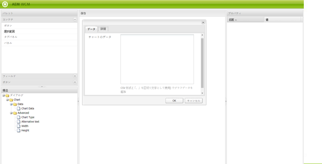

# ダイアログエディター{#dialog-editor}

ダイアログエディターは、ダイアログボックスおよび基礎モードを簡単に作成および編集できるグラフィカルインターフェイスを提供します。

機能を確認するには、CRXDE Lite に移動して、エクスプローラーツリーを `/libs/foundation/components/chart` で開き、ノード `dialog` をダブルクリックします。

dialog ノードが&#x200B;**ダイアログエディター**&#x200B;で開かれます。

## ユーザーインターフェイスの概要 {#user-interface-overview}

ダイアログエディターのインターフェイスは次の 4 つのウィンドウで構成されています。

* 左上の&#x200B;**パレット**。このウィンドウには、タブパネル、テキストフィールド、選択リスト、ボタンなど、ダイアログボックスの作成に使用できるウィジェットが表示されます。パレット内の様々なカテゴリを展開するには、該当する分割バーをクリックします。
* 左下の&#x200B;**構造**&#x200B;ウィンドウ。このウィンドウには、ダイアログの定義を構成するノードの構造が表示されます。CRXDE Lite または CRX Content Explorer で dialog ノードを展開した場合も、同じ構造が表示されます。
* ウィンドウの中央の&#x200B;**レンダリング**&#x200B;ペイン。このペインには、構造ペインで定義したダイアログ定義が実際のダイアログボックスとしてどのようにレンダリングされるかが表示されます。
* **プロパティ**&#x200B;ウィンドウ。このウィンドウには、構造ウィンドウで現在選択されているノードのプロパティが表示されます。

### ダイアログエディターの使用 {#using-the-dialog-editor}

ダイアログボックスを作成するには、パレットから構造ウィンドウへ要素をドラッグ＆ドロップして、ダイアログ定義階層内に配置します。

必要な構造が完成したら、レンダリングウィンドウ上部の「**保存**」をクリックします。

>[!CAUTION]
>
>ダイアログエディターは、比較的単純なダイアログの作成を目的としているので、複雑なダイアログ定義は編集できない場合があります。ダイアログエディターで編集できないダイアログ構造がある場合は、CRXDE Lite や CRX Content Explorer などを使用してノード構造を直接編集することにより、ダイアログ定義を手動で作成／編集する必要があります。

### 新しいダイアログの作成 {#creating-a-new-dialog}

新しいダイアログボックスを作成するには、必要なコンポーネントを選択して、「**作成**」をクリックし、「**ダイアログを作成**」をクリックします。

必要な詳細を入力して「**すべて保存**」をクリックします。ここでダイアログをダブルクリックすると、エディターで開くことができます。

### ダイアログエディターを使用した基礎モードの作成 {#using-the-dialog-editor-for-scaffolds}

基礎モードは、ワンステップで入力および送信が可能なフォームを含む特殊なページです。これを使用すると、入力されたコンテンツを使用して、短時間でページを作成できます。

基礎モードを構成するフォームは、通常のダイアログと同様に、ダイアログ定義によって定義されます。ただし、基礎モードページ上では別のフォームで表示されます。ダイアログ定義は基礎モードの定義に使用されるので、基礎モードはダイアログエディターを使用して設計することができます。 この方法でダイアログエディターを使用する場合、レンダリングペインには、ダイアログ定義が基礎モードとして表示されず、ダイアログボックスの形式で表示されます。

ダイアログエディターを使用して基礎モードを作成する方法について詳しくは、[基礎モード](/help/sites-authoring/scaffolding.md)を参照してください。
