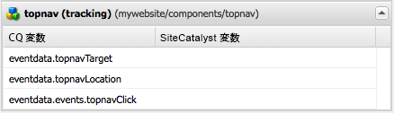

# コンポーネントへのAdobe Analyticsトラッキングの追加{#adding-adobe-analytics-tracking-to-components}

## Including the Adobe Analytics Module in a Page Component {#including-the-adobe-analytics-module-in-a-page-component}

Page template components (e.g. `head.jsp, body.jsp`) need JSP includes in order to load the ContextHub and the Adobe Analytics integration (which is a part of Cloud Services). すべてに、JavaScriptファイルの読み込みが含まれます。

ContextHubエントリはタグのすぐ下に含まれ、 `<head>` Cloud Servicesは `<head>` セクションの前後に含まれ `</body>` る必要があります。例：

```xml
<head>
   <sling:include path="contexthub" resourceType="granite/contexthub/components/contexthub" />
...
   <cq:include script="/libs/cq/cloudserviceconfigs/components/servicelibs/servicelibs.jsp"/>
...
</head>
<body>
...
    <cq:include path="cloudservices" resourceType="cq/cloudserviceconfigs/components/servicecomponents"/>
</body>
```

The `contexthub` script that you insert after the `<head>` element adds the ContextHub features to the page.

との `cloudservices` セクションに追加する `<head>` スクリプトは、ページに追加され `<body>` るクラウドサービスの設定に適用されます。 (ページで複数のCloud Services設定を使用する場合は、ContextHub JSPとCloud ServicesJSPを1回だけ含める必要があります)。

ページにAdobe Analyticsフレームワークを追加すると、次の例のように、 `cloudservices` スクリプトはAdobe Analytics関連のjavascriptとクライアント側ライブラリへの参照を生成します。

```xml
<div class="sitecatalyst cloudservice">
<script type="text/javascript" src="/etc/clientlibs/foundation/sitecatalyst/sitecatalyst.js"></script>
<script type="text/javascript" src="/etc/clientlibs/foundation/sitecatalyst/util.js"></script>
<script type="text/javascript" src="/content/geometrixx-outdoors/_jcr_content/analytics.sitecatalyst.js"></script>
<script type="text/javascript" src="/etc/clientlibs/mac/mac-sc.js"></script>
<script type="text/javascript" src="/etc/clientlibs/foundation/sitecatalyst/plugins.js"></script>
<script type="text/javascript">
<!--
CQ_Analytics.Sitecatalyst.frameworkComponents = ['foundation/components/page'];
/**
 * Sets Adobe Analytics variables accordingly to mapped components. If <code>options</code>
 * object is provided only variables matching the options.componentPath are set.
 *
 * @param {Object} options Parameter object from CQ_Analytics.record() call. Optional.
 */
CQ_Analytics.Sitecatalyst.updateEvars = function(options) {
    this.frameworkMappings = [];
 this.frameworkMappings.push({scVar:"pageName",cqVar:"pagedata.title",resourceType:"foundation/components/page"});
    for (var i=0; i<this.frameworkMappings.length; i++){
  var m = this.frameworkMappings[i];
  if (!options || options.compatibility || (options.componentPath == m.resourceType)) {
   CQ_Analytics.Sitecatalyst.setEvar(m);
  }
    }
}

CQ_Analytics.CCM.addListener("storesinitialize", function(e) {
 var collect = true;
    var lte = s.linkTrackEvents;
    s.pageName="content:geometrixx-outdoors:en";
    CQ_Analytics.Sitecatalyst.collect(collect);
    if (collect) {
  CQ_Analytics.Sitecatalyst.updateEvars();
     /************* DO NOT ALTER ANYTHING BELOW THIS LINE ! **************/
     var s_code=s.t();if(s_code)document.write(s_code);
     s.linkTrackEvents = lte;
     if(s.linkTrackVars.indexOf('events')==-1){delete s.events};
     $CQ(document).trigger("sitecatalystAfterCollect");
    }
});
//-->
</script>
<script type="text/javascript">
<!--
if(navigator.appVersion.indexOf('MSIE')>=0)document.write(unescape('%3C')+'\!-'+'-')
//-->
</script>
<noscript></noscript>
<span data-tracking="{event:'pageView', values:{}, componentPath:'foundation/components/page'}"></span>
<div id="cq-analytics-texthint" style="background:white; padding:0 10px; display:none;">
 <h3 class="cq-texthint-placeholder">Component clientcontext is missing or misplaced.</h3>
</div>
<script type="text/javascript">
$CQ(function(){
 if( CQ_Analytics &&
  CQ_Analytics.ClientContextMgr &&
  !CQ_Analytics.ClientContextMgr.isConfigLoaded )
  {
   $CQ("#cq-analytics-texthint").show();
  }
});
</script>
</div>
```

Geometrixx Outdoors をはじめ、すべての AEM サンプルサイトにはこのコードが含まれています。

### sitecatalystAfterCollect イベント {#the-sitecatalystaftercollect-event}

The `cloudservices` script triggers the `sitecatalystAfterCollect` event:

```
$CQ(document).trigger("sitecatalystAfterCollect");
```

このイベントは、ページの追跡が完了したことを示すために呼び出されます。このページに対して追加の追跡操作を実行する場合は、ドキュメント読み込みイベントやドキュメント準備完了イベントではなく、このイベントをリスンする必要があります。Using the `sitecatalystAfterCollect` event avoids collisions or other unpredictable behavior.

>[!NOTE]
>
>この `/libs/cq/analytics/clientlibs/sitecatalyst/sitecatalyst.js` ライブラリには、Adobe Analytics `s_code.js` ファイルのコードが含まれています。

## カスタムコンポーネントのAdobe Analyticsトラッキングの導入 {#implementing-adobe-analytics-tracking-for-custom-components}

AEMコンポーネントがAdobe Analyticsフレームワークとやり取りできるようにします。 次に、Adobe Analyticsがコンポーネントデータを追跡するようにフレームワークを設定します。

フレームワークを編集する際に、Adobe Analyticsフレームワークとやり取りするコンポーネントがサイドキックに表示されます。 コンポーネントをフレームワークにドラッグすると、コンポーネントのプロパティが表示され、Adobe Analyticsのプロパティを使用してマッピングできます。 (See [Setting Up a Framework For Basic Tracking](/help/sites-administering/adobeanalytics-connect.md#creating-a-adobe-analytics-framework).)

Components can interact with the Adobe Analytics framework when the component has a child node named `analytics`. `analytics` ノードには以下のプロパティがあります。

* `cq:trackevents`:コンポーネントが公開するCQイベントを識別します。 （カスタムイベントを参照）。
* `cq:trackvars`:Adobe AnalyticsプロパティでマッピングされるCQ変数の名前を指定します。
* `cq:componentName`：サイドキックに表示されるコンポーネントの名前。
* `cq:componentGroup`:コンポーネントを含むサイドキックのグループです。

コンポーネントの JSP のコードによって、追跡を呼び出し、追跡対象のデータを定義する Javascript がページに追加されます。The event name and data names used in the javascript must match the corresponding values of the `analytics` node properties.

* ページの読み込み時にイベントデータを追跡するには、data-tracking 属性を使用します（[ページの読み込み時のカスタムイベントの追跡](/help/sites-developing/extending-analytics.md#tracking-custom-events-on-page-load)を参照）。
* ユーザーがページの機能とやり取りするときにイベントデータを追跡するには、CQ_Analytics.record 関数を使用します（[ページの読み込み後のカスタムイベントの追跡](/help/sites-developing/extending-analytics.md#tracking-custom-events-after-page-load)を参照）。

これらのデータ追跡方法を使用すると、Adobe Analytics統合モジュールは、イベントとデータを記録するためにAdobe Analyticsへの呼び出しを自動的に実行します。

### 例：topnav クリック数の追跡 {#example-tracking-topnav-clicks}

Foundation TopNavコンポーネントを拡張し、Adobe Analyticsがページの上部にあるナビゲーションリンクのクリックを追跡できるようにします。 ナビゲーションリンクがクリックされると、Adobe Analyticsはクリックされたリンクとクリックされたページを記録します。

以降の手順をおこなうには、以下のタスクを終えている必要があります。

* CQ アプリケーションの作成。
* Adobe Analytics構成とAdobe Analytics枠組みを作成。

#### topnav コンポーネントのコピー {#copy-the-topnav-component}

topnav コンポーネントを CQ アプリケーションにコピーします。この手順では、アプリケーションが CRXDE Lite で設定されている必要があります。

1. Right-click the `/libs/foundation/components/topnav` node and click Copy.
1. アプリケーションフォルダーの下の Components フォルダーを右クリックして、「貼り付け」をクリックします。
1. 「すべて保存」をクリックします。

#### TopnavとAdobe Analyticsフレームワークの統合 {#integrating-topnav-with-the-adobe-analytics-framework}

topnav コンポーネントを設定し、追跡するイベントとデータを定義するように JSP ファイルを編集します。

1. topnav ノードを右クリックして、作成／ノードを作成をクリックします。次のプロパティ値を指定して、「OK」をクリックします。

   * 名前：`analytics`
   * 型：`nt:unstructured`

1. 次のプロパティを analytics ノードに追加して、追跡するイベントに名前を付けます。

   * 名前：cq:trackevents
   * タイプ：String
   * 値：topnavClick

1. 次のプロパティを analytics ノードに追加して、データ変数に名前を付けます。

   * 名前：cq:trackvars
   * タイプ：String
   * 値：topnavTarget、topnavLocation

1. 次のプロパティを analytics ノードに追加して、サイドキックのコンポーネントに名前を付けます。

   * 名前：cq:componentName
   * タイプ：String
   * 値：topnav（追跡）

1. 次のプロパティを analytics ノードに追加して、サイドキックのコンポーネントグループに名前を付けます。

   * 名前：cq:componentGroup
   * タイプ：String
   * 値：一般

1. 「すべて保存」をクリックします。
1. Open the `topnav.jsp` file.
1. 要素内で、次の属性を追加します。

   ```xml
   onclick = "tracknav('<%= child.getPath() %>.html')"
   ```

1. ページの下部に以下の Javascript コードを追加します。

   ```xml
   <script type="text/javascript">
       function tracknav(target) {
               if (CQ_Analytics.Sitecatalyst) {
                   CQ_Analytics.record({
                       event: 'topnavClick',
                       values: {
                           topnavTarget: target,
                           topnavLocation:'<%=currentPage.getPath() %>.html'
                       },
                       componentPath: '<%=resource.getResourceType()%>'
                   });
               }
       }
   </script>
   ```

1. 「すべて保存」をクリックします。

The content of the `topnav.jsp` file should appear as follows:

```xml
<%@page session="false"%><%--
  Copyright 1997-2008 Day Management AG
  Barfuesserplatz 6, 4001 Basel, Switzerland
  All Rights Reserved.

  This software is the confidential and proprietary information of
  Day Management AG, ("Confidential Information"). You shall not
  disclose such Confidential Information and shall use it only in
  accordance with the terms of the license agreement you entered into
  with Day.

  ==============================================================================

  Top Navigation component

  Draws the top navigation

--%><%@include file="/libs/foundation/global.jsp"%><%
%><%@ page import="java.util.Iterator,
        com.day.text.Text,
        com.day.cq.wcm.api.PageFilter,
        com.day.cq.wcm.api.Page,
        com.day.cq.commons.Doctype,
        org.apache.commons.lang3.StringEscapeUtils" %><%

    // get starting point of navigation
    long absParent = currentStyle.get("absParent", 2L);
    String navstart = Text.getAbsoluteParent(currentPage.getPath(), (int) absParent);

    //if not deep enough take current node
    if (navstart.equals("")) navstart=currentPage.getPath();

    Resource rootRes = slingRequest.getResourceResolver().getResource(navstart);
    Page rootPage = rootRes == null ? null : rootRes.adaptTo(Page.class);
    String xs = Doctype.isXHTML(request) ? "/" : "";
    if (rootPage != null) {
        Iterator<Page> children = rootPage.listChildren(new PageFilter(request));
        while (children.hasNext()) {
            Page child = children.next();
            %><a onclick = "tracknav('<%= child.getPath() %>.html')"  href="<%= child.getPath() %>.html"><%
            %>" src="<%= child.getPath() %>.navimage.png"<%= xs %>></a><%
        }
    }
%><script type="text/javascript">
    function tracknav(target) {
            if (CQ_Analytics.Sitecatalyst) {
                CQ_Analytics.record({
                    event: 'topnavClick',
                    values: {
                        topnavTarget:target,
                        topnavLocation:'<%=currentPage.getPath() %>.html'
                    },
                    componentPath: '<%=resource.getResourceType()%>'
                });
            }
    }
</script>
```

>[!NOTE]
>
>多くの場合、ContextHubからのデータを追跡することが望ましいです。 For information about using javascript to obtain this information, see [Accessing Values in the ContextHub](/help/sites-developing/extending-analytics.md#accessing-values-in-the-contexthub).

#### サイドキックへの追跡コンポーネントの追加 {#adding-the-tracking-component-to-sidekick}

フレームワークに追加できるように、サイドキックへのAdobe Analyticsを使用した追跡を有効にする追加コンポーネント。

1. Adobe Analytics設定からAdobe Analyticsのフレームワークを開きます。 （[http://localhost:4502/etc/cloudservices/sitecatalyst.html](http://localhost:4502/etc/cloudservices/sitecatalyst.html)）。
1. サイドキックでデザインボタンをクリックします。

   

1. 「リンクトラッキング設定」領域で、「継承を設定」をクリックします。

   

1. 許可されたコンポーネントリストで、「一般」セクションの「topnav（追跡）」を選択して、「OK」をクリックします。
1. サイドキックを展開して編集モードに入ります。コンポーネントが一般グループに表示されるようになっています。

#### topnav コンポーネントのフレームワークへの追加 {#adding-the-topnav-component-to-your-framework}

topnavコンポーネントをAdobe Analyticsフレームワークにドラッグし、コンポーネント変数とイベントをAdobe Analytics変数とイベントにマップします。 (See [Setting Up a Framework For Basic Tracking](/help/sites-administering/adobeanalytics-connect.md).)



topnavコンポーネントは、現在はAdobe Analyticsフレームワークと統合されています。 コンポーネントをページに追加する際に、上部ナビゲーションバーの項目をクリックすると、トラッキングデータがAdobe Analyticsに送信されます。

### s.productsデータをAdobe Analyticsに送信する {#sending-s-products-data-to-adobe-analytics}

コンポーネントは、Adobe Analyticsに送信されるs.products変数のデータを生成できます。 s.products変数に貢献するようにコンポーネントを設計します。

* 特定の構造の `product` という値を記録します。
* Expose the data members of the `product` value so that they can be mapped with Adobe Analytics variables in the Adobe Analytics framework.

Adobe Analyticsのs.products変数は次の構文を使用します。

```
s.products="category;product;quantity;price;eventY={value}|eventZ={value};evarA={value}|evarB={value}"
```

The Adobe Analytics integration module constructs the `s.products` variable using the `product` values that AEM components generate. The `product` value in the javascript that AEM components generate is an array of values that have the following structure:

```
"product": [{
    "category": "",
    "sku"     : "path to product node",
    "quantity": quantity,
    "price"   : price,
    "events   : {
      "eventName1": "eventValue1",
      "eventName_n": "eventValue_n"
    }
    "evars"   : {
      "eVarName1": "eVarValue1",
      "eVarName_n": "eVarValue_n"
    }
}]
```

`product` 値からデータ項目を省略すると、s.products 内の空の文字列として送信されます。

>[!NOTE]
>
>When no event is associated with a product value, Adobe Analytics uses the `prodView` event by default.

The `analytics` node of the component must expose the variable names using the `cq:trackvars` property:

* product.category
* product.sku
* product.quantity
* product.price
* product.events.eventName1
* product.events.eventName_n
* product.evars.eVarName1
* product.evars.eVarName_n

e コマースモジュールには、s.products 変数データを生成するいくつかのコンポーネントがあります。例えば、submitorder コンポーネント（[http://localhost:4502/crx/de/index.jsp#/libs/commerce/components/submitorder/submitorder.jsp](http://localhost:4502/crx/de/index.jsp#/libs/commerce/components/submitorder/submitorder.jsp)）は、以下の例のような Javascript を生成します。

```
<script type="text/javascript">
    function trackCartPurchase() {
        if (CQ_Analytics.Sitecatalyst) {
            CQ_Analytics.record({
                "event": ["productsCartPurchase"],
                "values": {
                    "product": [
                        {
                            "category": "",
                            "sku"     : "/path/to/prod/1",
                            "quantity": 3,
                            "price"   : 179.7,
                            "evars"   : {
                                "childSku": "/path/to/prod/1/green/xs",
                                "size"    : "XS"
                            }
                        },
                        {
                            "category": "",
                            "sku"     : "/path/to/prod/2",
                            "quantity": 10,
                            "price"   : 150,
                            "evars"   : {
                                "childSku": "/path/to/prod/2",
                                "size"    : ""
                            }
                        },
                        {
                            "category": "",
                            "sku"     : "/path/to/prod/3",
                            "quantity": 2,
                            "price"   : 102,
                            "evars"   : {
                                "childSku": "/path/to/prod/3/m",
                                "size"    : "M"
                            }
                        }
                    ]
                },
                "componentPath": "commerce/components/submitorder"
            });
            CQ_Analytics.record({
                "event": ["discountRedemption"],
                "values": {
                    "discount": "/path/to/discount/1 - /path/to/discount/2",
                    "product" : [{
                        "category": "",
                        "sku"     : "Promotional Discount",
                        "events"  : {"discountRedemption": 20.00}
                    }]
                },
                "componentPath": "commerce/components/submitorder"
            });
            CQ_Analytics.record({
                "event": ["cartPurchase"],
                "values": {
                    "orderId"       : "00e40e2d-13a2-4a00-a8ee-01a9ebb0bf68",
                    "shippingMethod": "overnight",
                    "paymentMethod" : "Amex",
                    "billingState"  : "NY",
                    "billingZip"    : "10458",
                    "product"       : [{"category": "", "sku": "", "quantity": "", "price": ""}]
                },
                "componentPath": "commerce/components/submitorder"
            });
        }
        return true;
    }
</script>
```

#### トラッキングコールのサイズの制限 {#limiting-the-size-of-tracking-calls}

一般的に、Web ブラウザーでは GET リクエストのサイズが制限されます。CQ の product と SKU の値はリポジトリのパスなので、複数の値を含む product 配列はリクエストサイズの制限を超えることがあります。Therefore, your components should limit the number of items in the `product` array of each `CQ_Analytics.record function`. 追跡する必要がある項目数が制限を超える可能性がある場合は、複数の関数を作成します。

例えば、e コマースの submitorder コンポーネントでは、1 つのコール内の `product` 項目数が 4 に制限されています。カートに 5 つ以上の製品が含まれると、このコンポーネントは複数の `CQ_Analytics.record` 関数を生成します。
