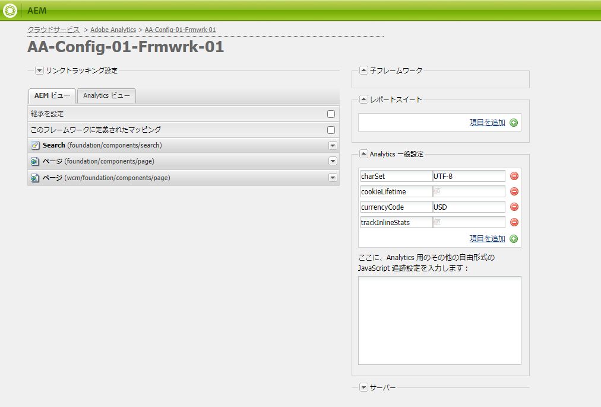
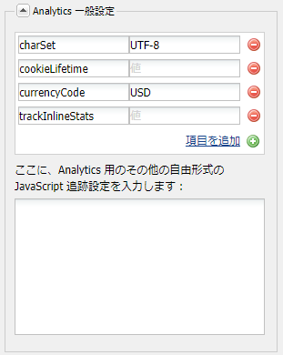

# Adobe Analyticsフレームワークのカスタマイズ{#customizing-the-adobe-analytics-framework}

Adobe Analyticsの枠組みは、Adobe Analyticsで追跡される情報を決定する。 デフォルトのフレームワークをカスタマイズするには、javascriptを使用してカスタムトラッキングの追加、Adobe Analyticsプラグインの統合、およびトラッキングに使用するフレームワーク内の一般設定の変更を行います。

## フレームワーク用に生成される Javascript について {#about-the-generated-javascript-for-frameworks}

ページがAdobe Analyticsのフレームワークに関連付けられ、そのページにAnalyticsモジュール](/help/sites-administering/adobeanalytics.md)への[参照が含まれる場合、そのページに対してanalytics.sitecatalyst.jsファイルが自動的に生成されます。

ページ内のjavascriptは、(s_code.jsAdobe Analyticsライブラリで定義する)`s_gi`オブジェクトを作成し、そのプロパティに値を割り当てます。 オブジェクトインスタンスの名前は `s` です。この節で示すコード例は、この`s`変数をいくつか参照しています。

次のコード例は、analytics.sitecatalyst.js ファイルのコードによく似ています。

```
var s_account = "my_sitecatalyst_account";
var s = s_gi(s_account);
s.fpCookieDomainPeriods = "3";
s.currencyCode= 'USD';
s.trackInlineStats= true;
s.linkTrackVars= 'None';
s.charSet= 'UTF-8';
s.linkLeaveQueryString= false;
s.linkExternalFilters= '';
s.linkTrackEvents= 'None';
s.trackExternalLinks= true;
s.linkDownloadFileTypes= 'exe,zip,wav,mp3,mov,mpg,avi,wmv,doc,pdf,xls';
s.linkInternalFilters= 'javascript:,'+window.location.hostname;
s.trackDownloadLinks= true;

s.visitorNamespace = "mynamespace";
s.trackingServer = "xxxxxxx.net";
s.trackingServerSecure = "xxxxxxx.net";

/* Plugin Config */
/*
s.usePlugins=false;
function s_doPlugins(s) {
    //add your custom plugin code here
}
s.doPlugins=s_doPlugins;
*/
```

カスタム Javascript コードを使用してフレームワークをカスタマイズする場合は、このファイルの内容を変更します。

## Adobe Analyticsプロパティの設定{#configuring-adobe-analytics-properties}

Adobe Analyticsには、フレームワーク上で設定可能な定義済みの変数が多数あります。 **charset**、**cookieLifetime**、**currencyCode**&#x200B;および&#x200B;**trackInlineStats**&#x200B;変数は、デフォルトで&#x200B;**一般的な解析設定**&#x200B;リストに含まれます。



このリストに、変数名と値を追加することができます。これらの定義済み変数と追加する変数は、analytics.sitecatalyst.jsファイルの`s`オブジェクトのプロパティの設定に使用されます。 次の例は、`prop10` という値を持つ追加プロパティ `CONSTANT` が Javascript コード内でどのように表現されるかを示しています。

```
var s_account = "my_sitecatalyst_account";
var s = s_gi(s_account);
s.fpCookieDomainPeriods = "3";
s.currencyCode= 'USD';
s.trackInlineStats= true;
s.linkTrackVars= 'None';
s.charSet= 'UTF-8';
s.linkLeaveQueryString= false;
s.linkExternalFilters= '';
s.linkTrackEvents= 'None';
s.trackExternalLinks= true;
s.linkDownloadFileTypes= 'exe,zip,wav,mp3,mov,mpg,avi,wmv,doc,pdf,xls';
s.prop10= 'CONSTANT';
s.linkInternalFilters= 'javascript:,'+window.location.hostname;
s.trackDownloadLinks= true;

s.visitorNamespace = "mynamespace";
s.trackingServer = "xxxxxxx.net";
s.trackingServerSecure = "xxxxxxx.net";
```

変数を一般設定リストに追加するには、以下の手順を実行します。

1. Adobe Analyticsのフレームワークページで、「**一般的な解析設定**」領域を展開します。
1. 変数のリストの下の「項目を追加」をクリックして、新しい変数をリストに追加します。
1. 左側のセルに変数の名前（例：`prop10`）を入力します。

1. 右側の列に変数の値（例：`CONSTANT`）を入力します。

1. 変数を削除するには、変数の横の（-）ボタンをクリックします。

>[!NOTE]
>
>変数と値を入力する際は、形式とスペルが正しいことを確認してください。そうでない場合は、正しい値と変数のペアを使用して&#x200B;**呼び出しが送信されません**。変数や値のスペルが間違っていると、呼び出しを実行することさえできない場合があります。
>
>これらの変数が正しく設定されていることを確認するには、Adobe Analyticsの担当者にお問い合わせください。

>[!CAUTION]
>
>Adobe Analyticsの呼び出しが正しく機能するため、このリストの変数の一部は&#x200B;**必須**&#x200B;です(例：**currencyCode**、**charSet**)
>
>したがって、フレームワーク自体から削除されても、Adobe Analytics呼び出しが行われる際には、デフォルト値が付加されます。

### Adobe Analyticsフレームワークへのカスタムjavascriptの追加{#adding-custom-javascript-to-an-adobe-analytics-framework}

「**一般的なAnalytics設定**」領域の「無料のjavascript」ボックスを使用すると、カスタムコードをAdobe Analyticsフレームワークに追加できます。



追加するコードは、analytics.sitecatalyst.js ファイルに付加されます。したがって、`s`変数にアクセスできます。これは、`s_code.js`で定義されている`s_gi` javascriptオブジェクトのインスタンスです。 例えば、次のコードの追加は、前の節の例の値 `prop10` の変数 `CONSTANT` の追加と同等です。

`s.prop10= 'CONSTANT';`

[analytics.sitecatalyst.js](/help/sites-developing/extending-analytics-components.md)ファイル内のコード(Adobe Analytics`s-code.js`ファイルの内容を含む)には、次のコードが含まれています。

`if (s.usePlugins) s.doPlugins(s)`

次の手順では、javascriptボックスを使用してAdobe Analytics追跡をカスタマイズする方法を示します。 JavaScriptでAdobe Analyticsプラグインを使用する必要がある場合、[それらのプラグイン](/help/sites-administering/adobeanalytics.md)をAEMに統合します。

1. `s.doPlugins` を実行するように、次の Javascript コードをボックスに追加します。

   ```
   s.usePlugins=true;
   function s_doPlugins(s) {
       //add your custom code here
   }
   s.doPlugins=s_doPlugins;
   ```

   >[!CAUTION]
   >
   >このコードは、基本的なドラッグ&amp;ドロップインターフェイスまたはAdobe Analytics表示のインラインjavascriptを使用して実行できない方法でカスタマイズされたAdobe Analytics呼び出しで変数を送信する場合に必要です。
   >
   >カスタム変数がs_doPlugins関数の外部にある場合、Adobe Analytics呼び出しでは*undefined *として送信されます

1. 追加&#x200B;**s_doPlugins**&#x200B;関数内のjavascriptコード。

次の例では、一般的な区切り文字「|」を使用して、ページ上でキャプチャされたデータを階層順に連結しています。

Adobe Analytics・フレームワークは、次の構成を備えています。

* `prop2`Adobe Analytics変数は`pagedata.sitesection`サイトプロパティにマップされます。

* `prop3`Adobe Analytics変数は`pagedata.subsection`サイトプロパティにマップされます。

* 次のコードがフリーフォームの Javascript ボックスに追加されます。

   ```
   s.usePlugins=true;
    function s_doPlugins(s) {
    s.prop1 = s.prop2+'|'+s.prop3;
    }
    s.doPlugins=s_doPlugins;
   ```

* フレームワークを使用するWebページにアクセスする（または編集モードでページが再読み込みまたはプレビューする）と、Adobe Analyticsへの呼び出しが実行されます。

例えば、次の値がAdobe Analyticsで生成されます。


### すべてのAdobe Analyticsフレームワークに対するグローバルカスタムコードの追加{#adding-global-custom-code-for-all-adobe-analytics-frameworks}

すべてのAdobe Analyticsフレームワークに統合されるカスタムJavaScriptコードを提供します。 ページのAdobe Analyticsフレームワークにカスタムの[フリーフォームのjavascript](/help/sites-administering/adobeanalytics.md)が含まれていない場合、/libs/cq/analytics/components/sitecatalyst/config.js.jspスクリプトで生成されるjavascriptは[analytics.sitecatalyst.js](/help/sites-administering/adobeanalytics.md)ファイルに追加されます。 デフォルトでは、このスクリプトはコメントアウトされているので無効です。また、コードは`s.usePlugins`を`false`に設定します。

```
/* Plugin Config */
/*
s.usePlugins=false;
function s_doPlugins(s) {
    //add your custom plugin code here
}
s.doPlugins=s_doPlugins;
*/
```

analytics.sitecatalyst.jsファイル内のコード(Adobe Analyticsのs_code.jsファイルの内容を含む)には、次のコードが含まれています。

if (s.usePlugins) s.doPlugins(s)

したがって、javascriptは`s.usePlugins`を`true`に設定して、`s_doPlugins`関数内の任意のコードが実行されるようにする必要があります。 このコードをカスタマイズするには、独自の Javascript を使用するファイルで config.js.jsp ファイルをオーバーレイします。JavaScriptでAdobe Analyticsプラグインを使用する必要がある場合、[それらのプラグイン](/help/sites-administering/adobeanalytics.md)をAEMに統合します。

>[!NOTE]
>
>/libs/cq/analytics/components/sitecatalyst/config.js.jsp ファイルは編集しないでください。特定の AEM アップグレードタスクまたはメンテナンスタスクによって、元のファイルが再インストールされ、変更内容が削除されることがあります。

1. CRXDE Lite で、/apps/cq/analytics/components フォルダー構造を作成します。

   1. /apps フォルダーを右クリックして、作成／フォルダーを作成をクリックします。
   1. フォルダー名として「`cq`」を指定し、「OK」をクリックします。
   1. 同様に、`analytics`フォルダーと`components`フォルダーを作成します。

1. 作成した `components` フォルダーを右クリックし、作成／コンポーネントを作成をクリックします。次のプロパティ値を指定します。

   * ラベル: `sitecatalyst`
   * タイトル: `sitecatalyst`
   * スーパータイプ：`/libs/cq/analytics/components/sitecatalyst`
   * グループ: `hidden`

1. 「OK」が有効になるまで「次へ」を繰り返しクリックしてから、「OK」をクリックします。

   sitecatalyst コンポーネントには、自動的に作成された sitecatalyst.jsp ファイルが含まれます。

1. sitecatalyst.jsp ファイルを右クリックして、「削除」をクリックします。

1. sitecatalyst コンポーネントを右クリックして、作成／ファイルを作成をクリックします。「`config.js.jsp`」という名前を指定して、「OK」をクリックします。

   config.js.jsp ファイルが自動的に編集用に開きます。

1. 次のテキストをファイルに追加して、「すべて保存」をクリックします。

   ```java
   <%@page session="true"%>
   /* Plugin Config */
   s.usePlugins=true;
   function s_doPlugins(s) {
       //add your custom plugin code here
   }
   s.doPlugins=s_doPlugins;
   ```

   /apps/cq/analytics/components/sitecatalyst/config.js.jspスクリプトで生成されるjavascriptコードは、Adobe Analyticsフレームワークを使用するすべてのページのanalytics.sitecatalyst.jsファイルに挿入されるようになりました。

1. `s_doPlugins` 関数で実行する Javascript コードを追加して、「すべて保存」をクリックします。

>[!CAUTION]
>
>ページのフレームワークのフリーフォームの Javascript に何らかのテキストが存在する場合（スペースのみでも）、config.js.jsp は無視されます。

### AEM {#using-adobe-analytics-plugins-in-aem}でのAdobe Analyticsプラグインの使用

Adobe Analyticsプラグインのjavascriptコードを取得し、AEMのAdobe Analyticsフレームワークに統合します。 カスタム Javascript コードで使用できるよう、コードを `sitecatalyst.plugins` カテゴリのクライアントライブラリフォルダーに追加します。

例えば、`getQueryParams` プラグインを組み込む場合、カスタム Javascript の `s_doPlugins` 関数からプラグインを呼び出すことができます。次のコード例では、Adobe Analyticsの呼び出しがトリガーされると、転送者のURLから&#x200B;**&quot;pid&quot;**&#x200B;のクエリ文字列が&#x200B;**eVar1**&#x200B;として送信されます。

```
s.usePlugins=true;
function s_doPlugins(s) {
   // take the query string from the referrer
   s.eVar1=s.getQueryParam('pid','',document.referrer);
}
s.doPlugins=s_doPlugins;
```

AEMは、次のAdobe Analyticsプラグインをインストールして、デフォルトで使用できるようにします。

* getQueryParam()
* getPreviousValue()
* split()

/libs/cq/analytics/clientlibs/sitecatalyst/pluginsクライアントライブラリカテゴリーのsitecatalyst.pluginsフォルダーにこれらのプラグインが含まれています。

>[!NOTE]
>
>プラグインを追加するときは、新しいクライアントライブラリフォルダーを作成してください。`/libs/cq/analytics/clientlibs/sitecatalyst/plugins`フォルダーにプラグインを追加しないでください。 こうしておけば、AEM の再インストールやアップグレードをおこなっても、`sitecatalyst.plugins` カテゴリに加えた変更が上書きされずに済みます。

以下の手順を実行して、プラグイン用のクライアントライブラリフォルダーを作成します。この手順を実行する必要があるのは 1 回だけです。プラグインをクライアントライブラリフォルダーに追加するには、以降の手順を実行します。

1. Web ブラウザーで CRXDE Lite を開きます。([http://localhost:4502/crx/de](http://localhost:4502/crx/de))

1. /apps/my-app/clientlibsフォルダーを右クリックし、作成/ノードを作成をクリックします。 次のプロパティ値を入力して、「OK」をクリックします。

   * 名前：クライアントライブラリフォルダーの名前（例：my-plugins）

   * タイプ：cq:ClientLibraryFolder

1. 作成したクライアントライブラリフォルダーを選択し、右下のプロパティバーを使用して、次のプロパティを追加します。

   * 名前：categories
   * タイプ：String
   * 値：sitecatalyst.plugins
   * マルチ：selected

   編集ウィンドウで「OK」をクリックして、プロパティの値を確認します。

1. 作成したクライアントライブラリフォルダーを右クリックし、作成／ファイルを作成をクリックします。ファイル名として「js.txt」と入力し、「OK」をクリックします。

1. 「すべて保存」をクリックします。

以下の手順を実行して、プラグインのコードを取得し、AEM リポジトリ内に保存し、クライアントライブラリフォルダーに追加します。

1. Adobe Analyticsアカウントを使用して[sc.omniture.com](https://sc.omniture.com)にログインします。
1. ランディングページで、ヘルプ／ヘルプホームに移動します。
1. 左側の目次で、「実装プラグイン」をクリックします。
1. 追加するプラグインへのリンクをクリックし、ページが表示されたら、プラグインの Javascript ソースコードを探して、そのコードを選択し、コピーします。

1. クライアントライブラリフォルダーを右クリックして、作成／ファイルを作成をクリックします。ファイル名として、組み込むプラグインの名前に「.js」を付けて入力し、「OK」をクリックします。例えば、getQueryParam プラグインを組み込む場合は、ファイルに「getQueryParam.js」という名前を付けます。

   作成したファイルが編集用に開かれます。

1. プラグインの Javascript コードをファイルに貼り付け、「すべて保存」をクリックし、ファイルを閉じます。

1. クライアントライブラリフォルダーの js.txt ファイルを開きます。

1. 新しい行に、プラグインを格納しているファイルの名前（例：getQueryParam.js）を追加します。「すべて保存」をクリックして、ファイルを閉じます。

>[!NOTE]
>
>プラグインの使用時は、サポートプラグインも必ず組み込んでください。さもないと、プラグインの Javascript がサポートプラグイン内の関数に対しておこなわれる呼び出しを認識しません。例えば、getPreviousValue() プラグインを正しく機能させるには、split() プラグインが必要です。
>
> サポートプラグインの名前も **js.txt** に追加する必要があります。
