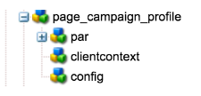
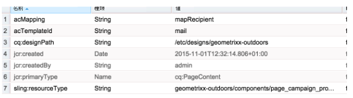

# Adobe Campaign フォームコンポーネントを使用したカスタム AEM ページテンプレートの作成{#creating-custom-aem-page-template-with-adobe-campaign-form-components}

This page explains how to build a custom page template that uses [Adobe Campaign Form](/help/sites-authoring/adobe-campaign-components.md) components by examining how the Geometrixx-outdoors template ( `/apps/geometrixx-outdoors/components/page_campaign_profile`) is implemented, and points you to important information you may need when creating your own custom template.

>[!NOTE]
>
>[電子メールとフォームのサンプルは、Geometrixx でのみ使用できます](/help/sites-developing/we-retail.md)。パッケージ共有からサンプルGeometrixxコンテンツをダウンロードしてください。

Adobe Campaign フォームコンポーネントを使用してカスタム AEM ページテンプレートを作成するには以下が必要な条件となります。

1. **適切な resourceSuperType**

   Make sure the page-component inherits from `mcm/campaign/components/profile`.

   情報を取得して保存するには、サーブレットに対してこれが必要です

   * `com.day.cq.mcm.campaign.servlets.TemplateListServlet`
   * `com.day.cq.mcm.campaign.servlets.SaveProfileServlet`

   

1. **ClientContext 設定**

   When you look at the clientcontext settings ( `/etc/designs/geometrixx-outdoors/jcr:content/page_campaign_profile`) you see the following settings:

   * ClientContext points to `/etc/clientcontext/campaign`
   * 追加の *config* ノードもあります。

   

1. **head.jsp（/apps/geometrixx-outdoors/components/page_campaign_profile/head.jsp）**

   **head.jsp** には、**clientcontext-config** と **cloudservice-hook** を使用する以下の行があります。

   ```
   <cq:include path="config" resourceType="cq/personalization/components/clientcontext_optimized/config"/>
   <sling:include path="contexthub" resourceType="granite/contexthub/components/contexthub"/>
   <cq:include script="/libs/cq/cloudserviceconfigs/components/servicelibs/servicelibs.jsp"/>
   ```

1. **body.jsp（/apps/geometrixx-outdoors/components/page_campaign_profile/body.jsp）**

   **body.jsp内**、クラウドサービスはページの下部に読み込まれます。

   ```
   <cq:include path="cloudservices" resourceType="cq/cloudserviceconfigs/components/servicecomponents"/>
   ```

1. **Campaign のページプロパティ**

   Adobe Campaign テンプレートを選択できるようにするには、「**Campaign**」タブを使用して、ページプロパティを拡張します。

   `/apps/geometrixx-outdoors/components/page_campaign_profile/dialog/items/tabs/items/campaign`

   

1. **テンプレートの設定**

   In the template ( `/apps/geometrixx-outdoors/templates/campaign_profile/jcr:content`) you see the following default values:

   | **acMapping** | mapRecipient（Adobe Campaign 6.1 の場合）、profile（Adobe Campaign Standard の場合） |
   |---|---|
   | **acTemplateId** | mail |

   

