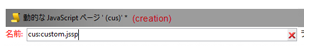
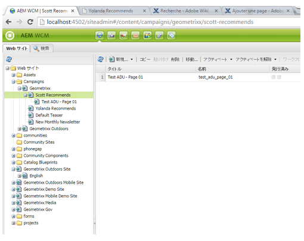

# カスタム拡張の作成{#creating-custom-extensions}

一般的に、プロジェクトを実装する場合は、AEM と Adobe Campaign の両方にカスタムコードを含めます。既存の API を使用して、AEM から Adobe Campaign のカスタムコードを呼び出したり、AEM から Adobe Campaign への呼び出しをおこなうことができます。ここでは、その具体的な方法を説明します。

## 前提条件 {#prerequisites}

以下の製品がインストールされている必要があります。

* Adobe Experience Manager
* Adobe Campaign 6.1

詳しくは、[AEM と Adobe Campaign 6.1 の統合](/help/sites-administering/campaignonpremise.md)を参照してください。

## 例 1：AEM から Adobe Campaign {#example-aem-to-adobe-campaign}

AEM と Adobe Campaign の標準の統合は、JSON と JSSP（JavaScript Server Page）を基盤としています。この JSSP ファイルはキャンペーンコンソールにあり、すべて「**amc**」（Adobe Marketing Cloud）で始まります。


>[!NOTE]
>
>[この例については、「パッケージ共有](/help/sites-developing/we-retail.md)」から利用できるGeometrixxを参照してください。

この例では、新しいカスタム JSSP ファイルを作成し、AEM 側から呼び出して、結果を取得します。例えば、この方法を利用して、Adobe Campaign からデータを取得したり、Adobe Campaign にデータを保存したりできます。

1. In Adobe Campaign, to create a new JSSP file, click the **New** icon.

   

1. この JSSP ファイルの名前を入力します。In this example, we use **cus:custom.jssp** (meaning it will be in the **cus** namespace).

   

1. 以下のコードを JSSP ファイル内に挿入します。

   ```
   <%
   var origin = request.getParameter("origin");
   document.write("Hello from Adobe Campaign, origin : " + origin);
   %>
   ```

1. ファイルを保存します。残りの作業は AEM でおこないます。
1. この JSSP を呼び出す簡単なサーブレットを AEM 側に作成します。この例では、次のように仮定しています。

   * AEM と Adobe Campaign 間に有効な接続がある
   * Adobe Campaign クラウドサービスが **/content/geometrixx-outdoors** に設定されている

   The most important object in this example is the **GenericCampaignConnector**, which allows you to call (get and post) jssp files on the Adobe Campaign side.

   コードの抜粋を以下に示します。

   ```
   @Reference
   private GenericCampaignConnector campaignConnector;
   ...
   Map<String, String> params = new HashMap<String, String>();
   params.put("origin", "AEM");
   CallResults results = campaignConnector.callGeneric("/jssp/cus/custom.jssp", params, credentials);
   return results.bodyAsString();
   ```

1. この例でわかるように、呼び出しに資格情報を渡す必要があります。この資格情報を getCredentials() メソッドを使用して取得し、Adobe Campaign クラウドサービスが設定されているページに渡すことができます。

   ```xml
   // page containing the cloudservice for Adobe Campaign
   Configuration config = campaignConnector.getWebserviceConfig(page.getContentResource().getParent());
   CampaignCredentials credentials = campaignConnector.retrieveCredentials(config);
   ```

完全なコードは以下のようになります。

```java
import java.io.IOException;
import java.io.PrintWriter;
import java.util.HashMap;
import java.util.Map;

import javax.servlet.ServletException;

import org.apache.felix.scr.annotations.Reference;
import org.apache.felix.scr.annotations.sling.SlingServlet;
import org.apache.sling.api.SlingHttpServletRequest;
import org.apache.sling.api.SlingHttpServletResponse;
import org.apache.sling.api.servlets.SlingSafeMethodsServlet;
import org.slf4j.Logger;
import org.slf4j.LoggerFactory;

import com.day.cq.mcm.campaign.CallResults;
import com.day.cq.mcm.campaign.CampaignCredentials;
import com.day.cq.mcm.campaign.GenericCampaignConnector;
import com.day.cq.wcm.api.Page;
import com.day.cq.wcm.api.PageManager;
import com.day.cq.wcm.api.PageManagerFactory;
import com.day.cq.wcm.webservicesupport.Configuration;

@SlingServlet(paths="/bin/campaign", methods="GET")
public class CustomServlet extends SlingSafeMethodsServlet {

 private final Logger log = LoggerFactory.getLogger(this.getClass());

 @Reference
 private GenericCampaignConnector campaignConnector;

 @Reference
 private PageManagerFactory pageManagerFactory;

 @Override
 protected void doGet(SlingHttpServletRequest request,
   SlingHttpServletResponse response) throws ServletException,
   IOException {

  PageManager pm = pageManagerFactory.getPageManager(request.getResourceResolver());

  Page page = pm.getPage("/content/geometrixx-outdoors");

  String result = null;
  if ( page != null) {
   result = callCustomFunction(page);
  }
  if ( result != null ) {
   PrintWriter pw = response.getWriter();
   pw.print(result);
  }
 }

 private String callCustomFunction(Page page ) {
  try {
   Configuration config = campaignConnector.getWebserviceConfig(page.getContentResource().getParent());
   CampaignCredentials credentials = campaignConnector.retrieveCredentials(config);

   Map<String, String> params = new HashMap<String, String>();
   params.put("origin", "AEM");
   CallResults results = campaignConnector.callGeneric("/jssp/cus/custom.jssp", params, credentials);
   return results.bodyAsString();
  } catch (Exception e ) {
   log.error("Something went wrong during the connection", e);
  }
  return null;

 }

}
```

## 例 2：Adobe Campaign から AEM {#example-adobe-campaign-to-aem}

AEM には、サイト管理エクスプローラービューのどこでも使用できるオブジェクトを取得するための API がデフォルトで用意されています。



>[!NOTE]
>
>[この例については、「パッケージ共有](/help/sites-developing/we-retail.md)」から利用できるGeometrixxを参照してください。

エクスプローラー内の各ノードにリンクされたAPIがあります。 例えば、ノードの場合：

* [http://localhost:4502/siteadmin#/content/campaigns/geometrixx/scott-recommends](http://localhost:4502/siteadmin#/content/campaigns/geometrixx/scott-recommends)

API は以下のようになります。

* [http://localhost:4502/content/campaigns/geometrixx/scott-recommends.1.json](http://localhost:4502/content/campaigns/geometrixx/scott-recommends.2.json)

URL の末尾の「**.1.json**」は、取得したいサブレベルの番号に応じて、「**.2.json**」や「**.3.json**」に置き換えることができます。すべてのサブレベルを取得するには、キーワード「**infinity**」を使用します。

* [http://localhost:4502/content/campaigns/geometrixx/scott-recommends.infinity.json](http://localhost:4502/content/campaigns/geometrixx/scott-recommends.2.json)

API を利用するには、デフォルトでは、AEM が基本認証を使用することを理解する必要があります。

6.1.1（build 8624 以上）では、複数のロジックの中でこのロジックを実装する JS ライブラリ **amcIntegration.js** を使用できます。

### AEM の API 呼び出し {#aem-api-call}

```java
loadLibrary("nms:amcIntegration.js");

var cmsAccountId = sqlGetInt("select iExtAccountId from NmsExtAccount where sName=$(sz)","aemInstance")
var cmsAccount = nms.extAccount.load(String(cmsAccountId));
var cmsServer = cmsAccount.server;

var request = new HttpClientRequest(cmsServer+"/content/campaigns/geometrixx.infinity.json")
aemAddBasicAuthentication(cmsAccount, request);
request.method = "GET"
request.header["Content-Type"] = "application/json; charset=UTF-8";
request.execute();
var response = request.response;
```

