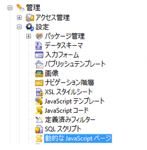

# カスタム Adobe Campaign拡張機能{#creating-custom-extensions}

通常、プロジェクトを実装する場合、AEM と Adobe Campaign の両方にカスタムコードが存在します。既存の API を使用して、AEM から Adobe Campaign で、または AEM から Adobe Campaign にカスタムコードを呼び出すことができます。このドキュメントでは、その方法について説明します。

## 前提条件 {#prerequisites}

次をインストールする必要があります。

* Adobe Experience Manager
* Adobe Campaign 6.1

詳しくは、[AEM と Adobe Campaign 6.1 の統合](/help/sites-administering/campaignonpremise.md)を参照してください。

## 例 1：AEM から Adobe Campaign へ {#example-aem-to-adobe-campaign}

AEM と Campaign の標準的な統合は、JSON と JSSP（JavaScript Server Page）に基づいています。JSSP ファイルは Campaign コンソールにあり、すべてが **aec**（Adobe Experience Cloud）で始まります。



この例では、新しいカスタム JSSP ファイルが作成され、結果を取得するために AEM 側から呼び出します。例えば、Adobe Campaign からデータを取得したり、Adobe Campaign にデータを保存したりするために使用できます。

1. Adobe Campaign で新しい JSSP ファイルを作成するには、**新規**&#x200B;アイコンをクリックします。

   

1. この JSSP ファイルの名前を入力します。この例では、**cus:custom.jssp** が使用されます（**cus** 名前空間にあることを意味します）。

   

1. 次のコードを jssp ファイル内に配置します。

   ```
   <%
   var origin = request.getParameter("origin");
   document.write("Hello from Adobe Campaign, origin : " + origin);
   %>
   ```

1. 作業内容を保存します。残りの作業は AEM で行います。
1. この JSSP を呼び出せるように、AEM 側でシンプルなサーブレットを作成します。この例では、次のような場合を想定できます。

   * AEM と Campaign の間の接続が機能している
   * Campaign クラウドサービスが、**/content/geometrixx-outdoors** 上で設定されている

   この例で最も重要なオブジェクトは、**GenericCampaignConnector** です。このオブジェクトを使用すると、Adobe Campaign 側にある JSSP ファイルを呼び出す（GET および POST）ことができます。

   次に、小さなコードスニペットを示します。

   ```
   @Reference
   private GenericCampaignConnector campaignConnector;
   ...
   Map<String, String> params = new HashMap<String, String>();
   params.put("origin", "AEM");
   CallResults results = campaignConnector.callGeneric("/jssp/cus/custom.jssp", params, credentials);
   return results.bodyAsString();
   ```

1. この例では、資格情報を呼び出しに渡す必要があります。この資格情報を getCredentials() メソッドを使用して取得し、Adobe Campaign クラウドサービスが設定されているページに渡すことができます。

   ```xml
   // page containing the cloudservice for Adobe Campaign
   Configuration config = campaignConnector.getWebserviceConfig(page.getContentResource().getParent());
   CampaignCredentials credentials = campaignConnector.retrieveCredentials(config);
   ```

完全なコードは以下のようになります。

```java
import java.io.IOException;
import java.io.PrintWriter;
import java.util.HashMap;
import java.util.Map;

import javax.servlet.ServletException;

import org.apache.felix.scr.annotations.Reference;
import org.apache.felix.scr.annotations.sling.SlingServlet;
import org.apache.sling.api.SlingHttpServletRequest;
import org.apache.sling.api.SlingHttpServletResponse;
import org.apache.sling.api.servlets.SlingSafeMethodsServlet;
import org.slf4j.Logger;
import org.slf4j.LoggerFactory;

import com.day.cq.mcm.campaign.CallResults;
import com.day.cq.mcm.campaign.CampaignCredentials;
import com.day.cq.mcm.campaign.GenericCampaignConnector;
import com.day.cq.wcm.api.Page;
import com.day.cq.wcm.api.PageManager;
import com.day.cq.wcm.api.PageManagerFactory;
import com.day.cq.wcm.webservicesupport.Configuration;

@SlingServlet(paths="/bin/campaign", methods="GET")
public class CustomServlet extends SlingSafeMethodsServlet {

 private final Logger log = LoggerFactory.getLogger(this.getClass());

 @Reference
 private GenericCampaignConnector campaignConnector;

 @Reference
 private PageManagerFactory pageManagerFactory;

 @Override
 protected void doGet(SlingHttpServletRequest request,
   SlingHttpServletResponse response) throws ServletException,
   IOException {

  PageManager pm = pageManagerFactory.getPageManager(request.getResourceResolver());

  Page page = pm.getPage("/content/geometrixx-outdoors");

  String result = null;
  if ( page != null) {
   result = callCustomFunction(page);
  }
  if ( result != null ) {
   PrintWriter pw = response.getWriter();
   pw.print(result);
  }
 }

 private String callCustomFunction(Page page ) {
  try {
   Configuration config = campaignConnector.getWebserviceConfig(page.getContentResource().getParent());
   CampaignCredentials credentials = campaignConnector.retrieveCredentials(config);

   Map<String, String> params = new HashMap<String, String>();
   params.put("origin", "AEM");
   CallResults results = campaignConnector.callGeneric("/jssp/cus/custom.jssp", params, credentials);
   return results.bodyAsString();
  } catch (Exception e ) {
   log.error("Something went wrong during the connection", e);
  }
  return null;

 }

}
```

## 例 2：Adobe Campaign から AEM へ {#example-adobe-campaign-to-aem}

AEM には、サイト管理エクスプローラービューの任意の場所で使用できるオブジェクトを取得するための API がデフォルトで用意されています。


>[!NOTE]
>
>[この例については、Package Share から入手できる Geometrixx](/help/sites-developing/we-retail.md) を参照してください。

エクスプローラーの各ノードには、API がリンクされています。例えば、以下のノードの場合、

* [http://localhost:4502/siteadmin#/content/campaigns/geometrixx/scott-recommends](http://localhost:4502/siteadmin#/content/campaigns/geometrixx/scott-recommends)

API は以下のようになります。

* [http://localhost:4502/content/campaigns/geometrixx/scott-recommends.1.json](http://localhost:4502/content/campaigns/geometrixx/scott-recommends.2.json)

URL の末尾の「**.1.json**」は、取得したいサブレベルの番号に応じて、「**.2.json**」や「**.3.json**」に置き換えることができます。すべてのサブレベルを取得するには、キーワード「**infinity**」を使用します。

* [http://localhost:4502/content/campaigns/geometrixx/scott-recommends.infinity.json](http://localhost:4502/content/campaigns/geometrixx/scott-recommends.2.json)

API を利用するには、デフォルトでは、AEM が基本認証を使用します。

6.1.1（8624 以降のビルド）では、複数のロジックの中でこのロジックを実装する JS ライブラリ **amcIntegration.js** を使用できます。

### AEM の API 呼び出し {#aem-api-call}

```java
loadLibrary("nms:amcIntegration.js");

var cmsAccountId = sqlGetInt("select iExtAccountId from NmsExtAccount where sName=$(sz)","aemInstance")
var cmsAccount = nms.extAccount.load(String(cmsAccountId));
var cmsServer = cmsAccount.server;

var request = new HttpClientRequest(cmsServer+"/content/campaigns/geometrixx.infinity.json")
aemAddBasicAuthentication(cmsAccount, request);
request.method = "GET"
request.header["Content-Type"] = "application/json; charset=UTF-8";
request.execute();
var response = request.response;
```
