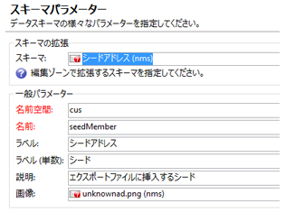
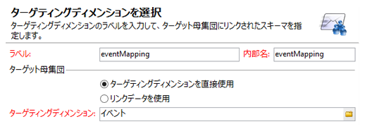
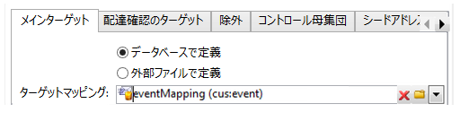
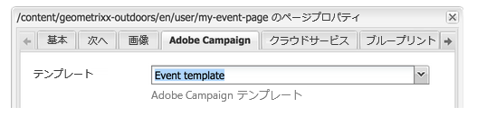
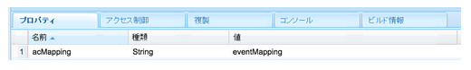
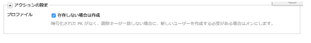
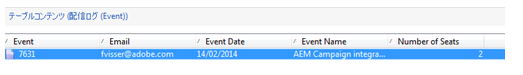

# カスタムフォームマッピングの作成{#creating-custom-form-mappings}

Adobe Campaign にカスタムテーブルを作成したら、そのカスタムテーブルにマップするフォームを AEM で作成できます。

このドキュメントでは、カスタムフォームマッピングの作成方法について説明します。このドキュメントのステップを完了すると、今後のイベントに新規登録できるイベントページを表示できます。その後、Adobe Campaign を使用して、登録したユーザーをフォローアップします。

## 前提条件 {#prerequisites}

以下の製品がインストールされている必要があります。

* Adobe Experience Manager
* Adobe Campaign Classic

See [Integrating AEM with Adobe Campaign Classic](/help/sites-administering/campaignonpremise.md) for more information.

## カスタムフォームマッピングの作成 {#creating-custom-form-mappings-2}

カスタムフォームマッピングを作成するには、次の詳細な手順を実行する必要があります。詳しくは、以下の節を参照してください。

1. カスタムテーブルの作成。
1. **シード**&#x200B;テーブルの拡張。
1. カスタムマッピングの作成。
1. カスタムマッピングに基づいた配信の作成。
1. 作成した配信を使用するフォームを AEM で作成。
1. フォームを送信してテスト。

### Adobe Campaign でのカスタムテーブルの作成 {#creating-the-custom-table-in-adobe-campaign}

まず、Adobe Campaign でカスタムテーブルを作成します。この例では、次の定義を使用してイベントテーブルを作成します。

```xml
<element autopk="true" label="Event" labelSingular="Event" name="event">
 <attribute label="Event Date" name="eventdate" type="date"/>
 <attribute label="Event Name" name="eventname" type="string"/>
 <attribute label="Email" name="email" type="string"/>
 <attribute label="Number of Seats" name="seats" type="long"/>
</element>
```

イベントテーブルを作成したら、**データベース構造更新ウィザード**&#x200B;を実行して、テーブルを作成します。

### シードテーブルの拡張 {#extending-the-seed-table}

Adobe Campaign で、「**追加**」をタップまたはクリックして、**シードアドレス（nms）**&#x200B;テーブルの新しい拡張を作成します。



Now, use the fields from the **event** table to extend the **seed** table:

```xml
<element label="Event" name="custom_cus_event">
 <attribute name="eventname" template="cus:event:event/@eventname"/>
 <attribute name="eventdate" template="cus:event:event/@eventdate"/>
 <attribute name="email" template="cus:event:event/@email"/>
 <attribute name="seats" template="cus:event:event/@seats"/>
 </element>
```

拡張後、**データベース更新ウィザード**&#x200B;を実行して、変更を適用します。

### カスタムターゲットマッピングの作成 {#creating-custom-target-mapping}

**管理／キャンペーン管理**&#x200B;で、**ターゲットマッピング**&#x200B;に移動し、新しい&#x200B;**ターゲットマッピング**&#x200B;を追加します。

>[!NOTE]
>
>**内部名**&#x200B;にはわかりやすい名前を使用してください。



### Creating a Custom Delivery Template {#creating-a-custom-delivery-template}

この手順では、作成した&#x200B;**ターゲットマッピング**&#x200B;を使用する配信テンプレートを追加します。

**リソース／テンプレート**&#x200B;で、配信テンプレートに移動し、既存の AEM 配信を複製します。「**宛先**」をクリックしたら、作成イベント「**ターゲットマッピング**」を選択します。



### AEM でのフォームの作成 {#building-the-form-in-aem}

AEM の&#x200B;**ページのプロパティ**&#x200B;で、クラウドサービスが設定されていることを確認します。

その後、「**Adobe Campaign**」タブで、「[カスタム配信テンプレートの作成](#creating-a-custom-delivery-template)」で作成した配信を選択します。



フィールドを設定する際は、フォームフィールドに一意の要素名を指定します。

フィールドの設定が完了したら、手動でマッピングを変更する必要があります。

CRXDE Lite で、（ページ）ノードの **jcr:content** に移動して、**acMapping** の値を&#x200B;**ターゲットマッピング**&#x200B;の内部名に変更します。



フォームの設定で、「存在しない場合は作成」チェックボックスをオンにします。



### フォームの送信 {#submitting-the-form}

フォームを送信して、値が保存されているかどうかを Adobe Campaign 側で検証できるようになりました。



## トラブルシューティング {#troubleshooting}

**&quot;Invalid type for value &#39;02/02/2015&#39; from element &#39;@eventdate&#39; (document of type &#39;Event ([adb:event])&#39;)&quot;**

フォームを送信すると、このエラーが AEM の **error.log** に記録されます。

日付フィールドのフォーマットが無効であることが原因です。回避策は、値を **yyyy-mm-dd** 形式で指定することです。

