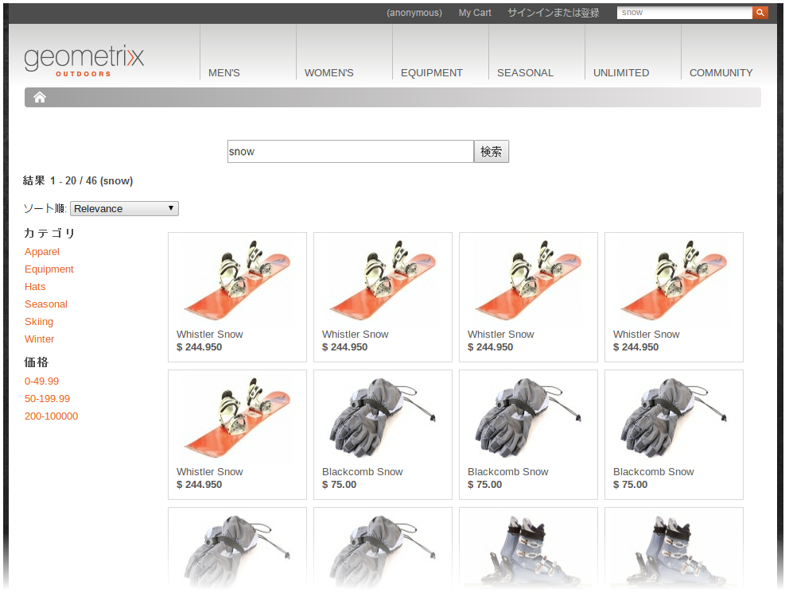

# 開発（汎用）{#developing-generic}

>[!NOTE]
>
>[API に関するドキュメント](/help/sites-developing/ecommerce.md#api-documentation)もお読みください。

統合フレームワークには、API を備えた統合レイヤーが含まれます。これにより、特定の e コマースエンジンに依存しない e コマース機能用の AEM コンポーネントを作成できます。さらに、内部 CRX データベースを使用したり、e コマースシステムを組み込んだりして、製品データを AEM に取り込むこともできます。

統合レイヤーを使用するために、標準搭載の多数のAEMコンポーネントが提供されています。 現時点では、以下のようなものがあります。

* 製品表示コンポーネント
* 買い物かご
* プロモーションと割引券
* カタログおよびセクションのブループリント
* チェックアウト
* 検索

AEM 検索やサードパーティ検索（Search&amp;Promote など）、またはこれらを組み合わせた検索をおこなうための、統合フックが提供されています。

## e コマースエンジンの選択 {#ecommerce-engine-selection}

e コマースフレームワークは任意の e コマースソリューションと組み合わせて使用できますが、使用するエンジは AEM によって識別される必要があります（AEM の汎用エンジンを使用する場合でも同様です）。

* e コマースエンジンは、`CommerceService` インターフェイスをサポートする OSGi サービスです。

   * エンジンは、`commerceProvider` サービスプロパティによって区別できます。

* AEM `Resource.adaptTo()` での `CommerceService` および `Product`

   * The `adaptTo` implementation looks for a `cq:commerceProvider` property in the resource&#39;s hierarchy:

      * 見つかった場合は、その値を使用してコマースサービスの検索をフィルタリングします。
      * 見つからなかった場合は、最上位のコマースサービスが使用されます。
   * A `cq:Commerce` mixin is used so the `cq:commerceProvider` can be added to strongly-typed resources.


* 適切なコマースファクトリ定義を参照するために、`cq:commerceProvider` プロパティも使用されます。

   * 例えば、 という値を持つ `cq:commerceProvider` プロパティは、**Geometrixx-Outdoors 向け Day CQ コマースファクトリ**（`com.adobe.cq.commerce.hybris.impl.GeoCommerceServiceFactory`）の OSGi 設定に関連付けられます（ここでも、`commerceProvider` パラメーターの値は `geometrixx`geometrixx となります）。
   * ここで、その他のプロパティも設定できます（適切かつ使用可能な場合）。

標準の AEM インストールでは、例えば次のような特定の実装が必要です。

|  |  |
|---|---|
| `cq:commerceProvider = geometrixx` | geometrixx の例。汎用 API に対する最小限の拡張が含まれます。 |

### 例 {#example}

```shell
/etc/commerce/products/geometrixx-outdoors
+ cq:commerceProvider = geometrixx
  + adobe-logo-shirt
    + cq:commerceType = product
    + price = 12.50
  + adobe-logo-shirt_S
    + cq:commerceType = variant
    + size = S
  + adobe-logo-shirt_XL
    + cq:commerceType = variant
    + size = XL
    + price = 14.50
```

>[!NOTE]
>
>CRXDE Lite を使用して、AEM の汎用実装の場合に製品コンポーネントでこれがどのように処理されるかを確認できます。
>
>`/apps/geometrixx-outdoors/components/product`

### セッション処理 {#session-handling}

顧客の買い物かごに関連する情報を保存するためのセッションです。

**CommerceSession** は、

* 買い **物かごを所有**

   * 追加や削除などを実行します。
   * は、買い物かごにさまざまな計算を行います。

      `commerceSession.getProductPriceInfo(Product product, Predicate filter)`

* Owns persistance of the **order** data:

   `CommerceSession.getUserContext()`

* Can retrieve/update delivery details by using `updateOrder(Map<String, Object> delta)`
* **支払**&#x200B;処理の接続も管理します。
* **フルフィルメント**&#x200B;の接続も管理します。

### アーキテクチャ {#architecture}

#### 製品とバリアントのアーキテクチャ {#architecture-of-product-and-variants}

1 つの製品に複数のバリエーションがある場合があります。例えば、カラーやサイズで異なるバリエーションがある場合があります。製品では、バリエーションを構成するプロパティを定義する必要があります。このようなプロパティをバリアント軸と呼びます。**

ただし、すべてのプロパティがバリアント軸になるわけではありません。バリエーションは、他のプロパティにも影響を与えることがあります。例えば、価格はサイズに依存することがあります。買い物客はこのようなプロパティを選択できないので、バリアント軸とは見なされません。

各製品やバリアントはリソースによって表現されるので、リポジトリノードに 1 対 1 でマップされます。必然的に、特定の製品やバリアントはそのパスによって一意に識別できます。

Any product resource can be represented by a `Product API`. Most calls in the product API are variation specific (although variations might inherit shared values from an ancestor), but there are also calls which list the set of variations ( `getVariantAxes()`, `getVariants()`, etc.).

>[!NOTE]
>
>In effect a variant axes is determined by whatever `Product.getVariantAxes()` returns:
>
>* 汎用実装の場合、AEM が製品データのプロパティ（`cq:productVariantAxes`）からバリアント軸を読み取ります。
>
>
（一般的に）製品には多数のバリアント軸を持たせることができますが、デフォルトの製品コンポーネントでは次の 2 つのバリアント軸のみが処理されます。
>
>1. `size`
>1. もう一度

>
>   
This additional variant is selected via the `variationAxis` property of the product reference (usually `color` for Geometrixx Outdoors).

#### 製品リファレンスと PIM データ {#product-references-and-pim-data}

一般的な手順は次のとおりです。

* PIM data is located under `/etc`

* Product references under `/content`.

製品バリエーションと製品データノードの間には 1 対 1 のマッピングが必要です。

製品リファレンスには、各バリエーションを表すノードも必要ですが、すべてのバリエーションを表す必要はありません。例えば、製品のバリエーションがS、M、Lの場合、製品データは次のようになります。

```shell
etc
  commerce
    products
      shirt
        shirt-s
        shirt-m
        shirt-l
```

「Big and Tall」カタログには次のバリエーションだけが含まれます。

```shell
content
  big-and-tall
    shirt
      shirt-l
```

最後に、製品データを使用するための要件はありません。カタログ内の参照の下に、すべての製品データを配置できます。しかし、すべての製品データを複製しない限り、実際には複数のカタログを持つことはできません。

**API**

#### com.adobe.cq.commerce.api.Product インターフェイス {#com-adobe-cq-commerce-api-product-interface}

```java
public interface Product extends Adaptable {

    public String getPath();            // path to specific variation
    public String getPagePath();        // path to presentation page for all variations
    public String getSKU();             // unique ID of specific variation

    public String getTitle();           // shortcut to getProperty(TITLE)
    public String getDescription();     // shortcut to getProperty(DESCRIPTION)
    public String getImageUrl();        // shortcut to getProperty(IMAGE_URL)
    public String getThumbnailUrl();    // shortcut to getProperty(THUMBNAIL_URL)

    public <T> T getProperty(String name, Class<T> type);

    public Iterator<String> getVariantAxes();
    public boolean axisIsVariant(String axis);
    public Iterator<Product> getVariants(VariantFilter filter) throws CommerceException;
}
```

#### com.adobe.cq.commerce.api.VariantFilter  {#com-adobe-cq-commerce-api-variantfilter}

```java
/**
 * Interface for filtering variants and AxisFilter provided as common implementation
 *
 * The <code>VariantFilter</code> is used to filter variants,
 * e.g. when using {@link Product#getVariants(VariantFilter filter)}.
 */
public interface VariantFilter {
    public boolean includes(Product product);
}

/**
 * A {@link VariantFilter} for filtering variants by the given
 * axis and value. The following example returns a list of
 * variant products that have a value of <i>blue</i> on the
 * <i>color</i> axis.
 *
 * <p>
 * <code>product.getVariants(new AxisFilter("color", "blue"));</code>
 */
public class AxisFilter implements VariantFilter {

    private String axis;
    private String value;

    public AxisFilter(String axis, String value) {
        this.axis = axis;
        this.value = value;
    }

    /**
     * {@inheritDoc}
     */
    public boolean includes(Product product) {
        ValueMap values = product.adaptTo(ValueMap.class);

        if(values != null) {
            String v = values.get(axis, String.class);

            return v != null && v == value;
        }

        return false;
    }
}
```

* **一般的なストレージの構成**

   * 製品ノードは nt:unstructured です。
   * 製品ノードは次のどちらかになります。

      * リファレンス。製品データは他の場所に保存されています。

         * Product references contain a `productData` property, which points to the product data (typically under `/etc/commerce/products`).
         * 製品データは階層化されています。製品属性は、製品データノードの祖先から継承されます。
         * 製品リファレンスには、ローカルプロパティも含めることができます。このようなプロパティは、製品データ内で指定されるプロパティをオーバーライドします。
      * 製品自体

         * Without a `productData` property.
         * すべてのプロパティをローカルに保持している（そして productData プロパティを含まない）製品ノードは、製品属性を自身の祖先から直接継承します。


* **AEM の汎用の製品構造**

   * 各バリアントには、独自のリーフノードが必要です。
   * 製品インターフェイスは、製品とバリアントの両方を表しますが、関連リポジトリノードはそれぞれに固有です。
   * 製品ノードは、製品属性とバリアント軸を示します。

#### 例 {#example-1}

```shell
+ banyan_shirt
    - cq:commerceType = product
    - cq:productAttributes = [jcr:title, jcr:description, size, price, color]
    - cq:productVariantAxes = [color, size]
    - jcr:title = Banyan Shirt
    - jcr:description = Flowery, all-cotton shirt.
    - price = 14.00
    + banyan_shirt_s
        - cq:commerceType = variant
        - size = S
        + banyan_shirt_s_red
            - cq:commerceType = variant
            - color = red
        + banyan_shirt_s_blue
            - cq:commerceType = variant
            - color = blue
    + banyan_shirt_m
        - cq:commerceType = variant
        - size = M
        + banyan_shirt_m_red
            - cq:commerceType = variant
            - color = red
        + banyan_shirt_m_blue
            - cq:commerceType = variant
            - color = blue
    + banyan_shirt_l
        - cq:commerceType = variant
        - size = L
        + banyan_shirt_l_red
            - cq:commerceType = variant
            - color = red
        + banyan_shirt_l_blue
            - cq:commerceType = variant
            - color = blue
    + banyan_shirt_xl
        - cq:commerceType = variant
        - size = XL
        - price = 18.00
```

#### 買い物かごのアーキテクチャ {#architecture-of-the-shopping-cart}

**コンポーネント**

* 買い物かごは、`CommerceSession:` によって管理されます。

   * `CommerceSession` は、追加や削除などを実行します。
   * `CommerceSession` は、買い物かごに対する様々な計算も実行します。
   * `CommerceSession` は、トリガーされた割引券とプロモーションも買い物かごに適用します。

* 買い物かごに直接関連はしませんが、`CommerceSession` はカタログの価格情報も提供する必要があります（価格を管理しているので）。

   * 価格には、次の複数の変更要素があります。

      * 数量割引。
      * 様々な通貨。
      * VAT 支払い義務ありと VAT なし。
   * 変更要素は、次のインターフェイスを使用して完全に変更できます。

      * `int CommerceSession.getQuantityBreakpoints(Product product)`
      * `String CommerceSession.getProductPrice(Product product)`


**ストレージ**

* ストレージ

   * AEM 汎用ケースでは、買い物かごは [ClientContext](/help/sites-administering/client-context.md) に保存されます。

**パーソナライズ機能**

* パーソナライズは、常に [ClientContext](/help/sites-administering/client-context.md) から取得する必要があります。
* A ClientContext `/version/` of the cart is created in all cases:

   * Products should be added by using the `CommerceSession.addCartEntry()` method.

* 次の図は、ClientContext に格納される買い物かご情報の例を示しています。


#### チェックアウトのアーキテクチャ {#architecture-of-checkout}

**買い物かごと注文データ**

`CommerceSession` は、次の 3 つの要素を管理します。

1. **買い物かごコンテンツ**

   買い物かごコンテンツのスキーマは、API によって決められています。

   ```java
       public void addCartEntry(Product product, int quantity);
       public void modifyCartEntry(int entryNumber, int quantity);
       public void deleteCartEntry(int entryNumber);
   ```

1. **価格**

   価格のスキーマも、API によって決められています。

   ```java
       public String getCartPreTaxPrice();
       public String getCartTax();
       public String getCartTotalPrice();
       public String getOrderShipping();
       public String getOrderTotalTax();
       public String getOrderTotalPrice();
   ```

1. **注文の詳細**

   しかし、注文の詳細は API によって決められていません&#x200B;**。

   ```java
       public void updateOrderDetails(Map<String, String> orderDetails);
       public Map<String, String> getOrderDetails();
       public void submitOrder();
   ```

**送料の計算**

* 多くの場合、注文フォームには複数の出荷オプション（および価格）を表示する必要があります。
* 価格は、品目と注文の詳細（重さや配送先住所など）に基づきます。
* `CommerceSession` はすべての依存関係にアクセスするので、製品価格と同じ方法で扱うことができます。

   * The `CommerceSession` owns shipping pricing.
   * Use `updateOrder(Map<String, Object> delta)` to retrieve/update delivery details.

### 検索の定義 {#search-definition}

標準のサービス API モデルに従い、e コマースプロジェクトは、個々のコマースエンジンで実装できる一連の検索関連 API を提供しています。

>[!NOTE]
>
>現在、この検索 API をデフォルトで実装しているのは hybris エンジンだけです。
>
>しかし、検索 API は汎用的なものであり、各 CommerceService で個別に実装できます。
>
>そのため、標準で提供される汎用実装ではこの API は実装されませんが、拡張して検索機能を追加することができます。

e コマースプロジェクトには、デフォルトの検索コンポーネントが含まれます。このコンポーネントは次の場所にあります。

`/libs/commerce/components/search`



ここでは、検索 API を利用して、選択されたコマースエンジンをクエリしています（[e コマースエンジンの選択](#ecommerce-engine-selection)を参照）。

#### 検索 API {#search-api}

コアプロジェクトは、いくつかの汎用クラスまたはヘルパークラスを提供します。

1. `CommerceQuery`

    検索クエリの記述に使用します（クエリテキスト、現在のページ、ページサイズ、並べ替え、選択されているファセットについての情報を含みます）。検索 API を実装するすべての e コマースサービスは、検索を実行するために、このクラスのインスタンスを受け取ります。A `CommerceQuery` can be instantiated from a request object ( `HttpServletRequest`).

1. `FacetParamHelper`

    1 つの静的メソッド（`toParams`）を提供するユーティリティクラス。このメソッドを使用して、ファセットのリストと 1 つのトグル値から `GET` パラメーター文字列を生成します。これは、UI 側で、ユーザーがハイパーリンクをクリックすると対応する値に切り替わる（選択された場合はクエリから削除され、選択されていない場合は追加される）ように、各ファセットの値ごとのハイパーリンクを表示する必要がある場合に役立ちます。これによって、複数または単一の値を持つファセットの処理や値のオーバーライドなど、すべてのロジックを扱うことができます。

検索 API のエントリポイントは、`CommerceService#search` オブジェクトを返す `CommerceResult` メソッドです。このトピックについて詳しくは、API ドキュメントを参照してください。

### プロモーションと割引券の作成 {#developing-promotions-and-vouchers}

* 割引券：

   * バウチャーは、Webサイトコンソールで作成/編集され、次の場所に保存されるページベースのコンポーネントです。

      `/content/campaigns`

   * 割引券は、次のものを提供します。

      * 割引券コード（買い物客が買い物かごに入力する）。
      * 割引券ラベル（買い物客が買い物かごに入力した後に表示される）。
      * プロモーションパス（割引券が適用されるアクションを定義）。
   * 割引券には、独自の開始および終了日付／時刻はありませんが、親キャンペーンの開始および終了日付／時刻を使用します。
   * 外部のコマースエンジンも割引券を提供できます。少なくとも以下が必要です。

      * 割引券コード
      * メソッド `isValid()`
   * The **Voucher** component ( `/libs/commerce/components/voucher`) provides:

      * 割引券管理用のレンダラー。買い物かごに現在入っている割引券があれば表示します。
      * 割引券を管理（追加／削除）するための編集ダイアログ（フォーム）。
      * 割引券を買い物かごに追加／買い物かごから削除するために必要なアクション。


* プロモーション：

   * プロモーションは、Webサイトコンソールで作成/編集し、次の場所に保存するページベースのコンポーネントです。

      `/content/campaigns`

   * プロモーションは、次のものを提供します。

      * 優先度
      * プロモーションハンドラーパス
   * プロモーションをキャンペーンに関連付けて、有効／無効日付／回数を定義できます。
   * プロモーションをエクスペリエンスに関連付けて、セグメントを定義できます。
   * エクスペリエンスに関連付けられていないプロモーションは、単独では呼び出されませんが、割引券によって呼び出せます。
   * The Promotion component ( `/libs/commerce/components/promotion`) contains:

      * プロモーション管理用のレンダラーとダイアログ
      * プロモーションハンドラーに固有の設定パラメーターをレンダリングおよび編集するためのサブコンポーネント
   * 次の 2 つのプロモーションハンドラーが、デフォルトで提供されています。

      * `DiscountPromotionHandler`。買い物かご全体に絶対価格による割引またはパーセンテージ割引を適用します。
      * `PerfectPartnerPromotionHandler`。パートナー製品も買い物かごに入っている場合に、製品の絶対価格による割引またはパーセンテージ割引を適用します。
   * The ClientContext `SegmentMgr` resolves segments and the ClientContext `CartMgr` resolves promotions. 少なくとも 1 つの解決されたセグメントを対象とする各プロモーションがトリガーされます。

      * トリガーされたプロモーションは、買い物かごを再計算する AJAX 呼び出しによって、サーバーに返送されます。
      * トリガーされたプロモーション（および追加された割引券）は、ClientContext パネルにも表示されます。


割引券の買い物かごへの追加または買い物かごからの削除は、`CommerceSession` API を使用して実行されます。

```java
/**
 * Apply a voucher to this session's cart.
 *
 * @param code the voucher's code
 * @throws CommerceException
 */
public void addVoucher(String code) throws CommerceException;

/**
 * Remove a voucher that was previously added with {@link #addVoucher(String)}.
 *
 * @param code the voucher's code
 * @throws CommerceException
 */
public void removeVoucher(String code) throws CommerceException;

/**
 * Get a list of vouchers that were added to this cart via {@link #addVoucher(String)}.
 *
 * @throws CommerceException
 */
public List<Voucher> getVouchers() throws CommerceException;
```

このように、`CommerceSession` は、割引券が存在するかどうか、割引券を適用できるかどうかをチェックします。このチェックは、特定の条件を満たした場合（例えば、買い物かごの合計価格が 1 万円を超える場合など）にのみ適用できる割引券に対して実行されます。何らかの理由で割引券を適用できない場合は、`addVoucher` メソッドが例外をスローします。また、`CommerceSession` によって、割引券の追加または削除後に買い物かごの価格の更新もおこないます。

`Voucher` は、以下のフィールドを含む、Bean のようなクラスです。

* 割引券コード
* 簡単な説明
* 割引タイプおよび値を示す関連プロモーションの参照

提供される `AbstractJcrCommerceSession` によって割引券を適用できます。The vouchers returned by the class `getVouchers()` are instances of `cq:Page` containing a jcr:content node with the following properties (amongst others):

* `sling:resourceType` （文字列） — これは、 `commerce/components/voucher`

* `jcr:title` （文字列） — 伝票の説明
* `code`（String） - この割引券を適用するためにユーザーが入力する必要があるコード。
* `promotion` （文字列） — 適用されるプロモーション。例えば `/content/campaigns/geometrixx-outdoors/article/10-bucks-off`

プロモーションハンドラーは、買い物かごを変更する OSGi サービスです。買い物かごは、`PromotionHandler` インターフェイスで定義される、複数のフックをサポートします。

```java
/**
 * Apply promotion to a cart line item. The method returns a discount
 * <code>PriceInfo</code> instance or <code>null</code> if no discount
 * was applied.
 * @param commerceSession The commerce session
 * @param promotion The configured promotion
 * @param cartEntry The cart line item
 * @return A discounted <code>PriceInfo</code> or <code>null</code>
 */
public PriceInfo applyCartEntryPromotion(CommerceSession commerceSession,
                                         Promotion promotion, CartEntry cartEntry)
    throws CommerceException;

/**
 * Apply promotion to an order. The method returns a discount
 * <code>PriceInfo</code> instance or <code>null</code> if no discount
 * was applied.
 * @param commerceSession The commerce session
 * @param promotion The configured promotion
 * @return A discounted <code>PriceInfo</code> or <code>null</code>
 */
public PriceInfo applyOrderPromotion(CommerceSession commerceSession, Promotion promotion)
    throws CommerceException;

public PriceInfo applyShippingPromotion(CommerceSession commerceSession, Promotion promotion)
    throws CommerceException;

/**
 * Allows a promotion handler to define a custom, author-oriented message for a promotion.
 * The {@link com.adobe.cq.commerce.common.promotion.PerfectPartnerPromotionHandler}, for instance,
 * uses this to list the qualifying pairs of products in the current cart.
 * @param commerceSession
 * @param promotion
 * @return A message to display
 * @throws CommerceException
 */
public String getMessage(SlingHttpServletRequest request, CommerceSession commerceSession, Promotion promotion) throws CommerceException;

/**
 * Informs the promotion handler that something under the promotions root has been edited, and the handler
 * should invalidate any caches it might be keeping.
 */
public void invalidateCaches();
```

次の 3 つのプロモーションハンドラーが、デフォルトで提供されています。

* `DiscountPromotionHandler`。買い物かご全体に絶対価格による割引またはパーセンテージ割引を適用します。
* `PerfectPartnerPromotionHandler`。製品パートナーも買い物かごに入っている場合に、製品の絶対価格による割引またはパーセンテージ割引を適用します。
* `FreeShippingPromotionHandler` 送料無料

