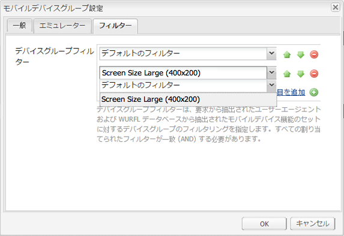
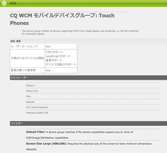

# デバイスグループフィルターの作成{#creating-device-group-filters}

>[!NOTE]
>
>単一ページアプリケーションフレームワークを基にしたクライアント側レンダリング（React など）が必要なプロジェクトでは、SPA エディターを使用することをお勧めします。[詳細情報](/help/sites-developing/spa-overview.md)を参照してください。

デバイスグループフィルターを作成して、一連のデバイスの機能の要件を定義します。デバイスの機能の必要なグループをターゲットとして指定するのに必要な数のフィルターを作成してください。

フィルターを組み合わせて機能のグループを定義できるようにフィルターを設計します。通常、異なるデバイスグループの機能は重複します。そのため、一部のフィルターを複数のデバイスグループ定義と共に使用できます。

作成したフィルターは[グループ設定](/help/sites-developing/mobile.md#creating-a-device-group)で使用できます。

## フィルターの Java クラス {#the-filter-java-class}

デバイスグループフィルターは、[com.day.cq.wcm.mobile.api.device.DeviceGroupFilter](https://helpx.adobe.com/experience-manager/6-5/sites/developing/using/reference-materials/javadoc/index.html?com/day/cq/wcm/mobile/api/device/DeviceGroupFilter.html) インターフェイスを実装する OSGi コンポーネントです。この実装クラスをデプロイすると、デバイスグループ設定に使用可能なフィルターサービスが提供されます。

この記事に示すソリューションでは、Apache Felix Maven SCR Plugin を使用して、コンポーネントとサービスの開発を容易にします。Therefore, the example Java class uses the `@Component`and `@Service` annotations. このクラスの構造は次のとおりです。

```java
package com.adobe.example.myapp;

import java.util.Map;

import com.day.cq.wcm.mobile.api.device.DeviceGroup;
import com.day.cq.wcm.mobile.api.device.DeviceGroupFilter;

import org.apache.felix.scr.annotations.Component;
import org.apache.felix.scr.annotations.Service;

@Component(metatype = false)
@Service
public class myDeviceGroupFilter implements DeviceGroupFilter {

       public String getDescription() {
  return null;
 }

 public String getTitle() {
  return null;
 }

 public boolean matches(DeviceGroup arg0, String arg1, Map arg2) {
  return false;
 }

}
```

次のメソッドのコードを指定する必要があります。

* `getDescription`:フィルターの説明を返します。 この説明はデバイスグループ設定ダイアログに表示されます。
* `getTitle`：フィルターの名前を返します。この名前は、デバイスグループ用のフィルターを選択した場合に表示されます。
* `matches`：デバイスに必要な機能が搭載されているかどうかを判断します。

### フィルターの名前と説明の指定 {#providing-the-filter-name-and-description}

`getTitle` メソッドと `getDescription` メソッドは、それぞれフィルターの名前と説明を返します。次のコードは、最も単純な実装を示しています。

```java
public String getDescription() {
    return "An example device group filter";
}

public String getTitle() {
 return "myFilter";
}
```

1 言語のオーサリング環境の場合、名前と説明のテキストをハードコードするだけで十分です。複数言語を使用する場合や、ソースコードを再コンパイルせずに文字列の変更を有効にする場合は、文字列をエクスターナライズすることを検討してください。

### フィルター条件に対する評価 {#evaluating-against-filter-criteria}

デバイスの機能がすべてのフィルター条件を満たす場合、`matches` 関数は `true` を返します。デバイスがグループに属しているかどうかを判断するには、メソッドの引数に指定された情報を評価します。次の値が引数として指定されます。

* DeviceGroup オブジェクト
* ユーザーエージェントの名前
* デバイスの機能を格納する Map オブジェクト。Map のキーは WURFL™ の機能名であり、値は WURFL™ データベースの対応する値です。

[com.day.cq.wcm.mobile.api.devicespecs.DeviceSpecsConstants](https://helpx.adobe.com/experience-manager/6-5/sites/developing/using/reference-materials/javadoc/index.html?com/day/cq/wcm/mobile/api/device/DeviceGroupFilter.html) インターフェイスの静的なフィールドには WURFL™ の機能名のサブセットが含まれます。デバイスの機能の Map から値を取得する場合は、これらのフィールドの定数をキーとして使用します。

例えば、次のコード例では、デバイスが CSS をサポートするかどうかを指定します。

```xml
boolean cssSupport = true;
cssSupport = NumberUtils.toInt(capabilities.get(DeviceSpecsConstants.DSPEC_XHTML_SUPPORT_LEVEL)) > 1;
```

The `org.apache.commons.lang.math` package provides the `NumberUtils` class.

>[!NOTE]
>
>AEM にデプロイされる WURFL™ データベースには、フィルター条件として使用する機能が含まれます（[デバイスの検出に関するページ](/help/sites-developing/mobile.md#server-side-device-detection)を参照）。

### 画面サイズ用のサンプルフィルター {#example-filter-for-screen-size}

以下に示すサンプルの DeviceGroupFilter 実装では、デバイスの物理サイズが最小要件を満たしているかどうかを判断します。このフィルターは、タッチデバイスグループに精度を追加します。アプリケーション UI のボタンのサイズは、画面の物理サイズに関係なく同じにしてください。他の項目（テキストなど）のサイズは変更できます。フィルターを使用すると、UI 要素のサイズを制御する特定の CSS を動的に選択できます。

This filter applies size criteria to the `physical_screen_height` and `physical_screen_width` WURFL™ property names.

```java
package com.adobe.example.myapp;

import java.util.Map;

import com.day.cq.wcm.mobile.api.device.DeviceGroup;
import com.day.cq.wcm.mobile.api.device.DeviceGroupFilter;

import org.apache.commons.lang.math.NumberUtils;
import org.apache.felix.scr.annotations.Component;
import org.apache.felix.scr.annotations.Service;

@Component(metatype = false)
@Service
@SuppressWarnings("unused")
public class ScreenSizeLarge implements DeviceGroupFilter {
    private int len=400;
    private int wid=200;
    public String getDescription() {

        return "Requires the physical size of the screen to have minimum dimensions " + len + "x" + wid+".";
    }

    public String getTitle() {
        return "Screen Size Large ("+len + "x" + wid+")";
    }

    public boolean matches(DeviceGroup deviceGroup, String userAgent,
            Map<String, String> deviceCapabilities) {

        boolean longEnough=true;
        boolean wideEnough=false;
        int dimension1=NumberUtils.toInt(deviceCapabilities.get("physical_screen_height"));
        int dimension2=NumberUtils.toInt(deviceCapabilities.get("physical_screen_width"));
        if(dimension1>dimension2){
            longEnough=dimension1>=len;
            wideEnough=dimension2>=wid;
        }else{
            longEnough=dimension2>=len;
            wideEnough=dimension1>=wid;
        }

        return longEnough && wideEnough;
    }
}
```

getTitle メソッドが返す値 String は、デバイスグループのプロパティのドロップダウンリストに表示されます。



getTitle メソッドと getDescription メソッドが返す値 String は、デバイスグループの概要ページの下部に表示されます。



### Maven POM ファイル {#the-maven-pom-file}

次の POM コードは、Maven を使用してアプリケーションをビルドする場合に役立ちます。POM は、必要な複数のプラグインおよび依存関係を参照します。

**プラグイン：**

* Apache Maven Compiler Plugin：ソースコードから Java クラスをコンパイルします。
* Apache Felix Maven Bundle Plugin：バンドルとマニフェストを作成します。
* Apache Felix Maven SCR Plugin：コンポーネント記述子ファイルを作成し、service-component マニフェストヘッダーを設定します。

**依存関係:**

* `cq-wcm-mobile-api-5.5.2.jar`:DeviceGroupとDeviceGroupFilterインターフェイスを提供します。

* `org.apache.felix.scr.annotations.jar`：Component アノテーションと Service アノテーションを提供します。

DeviceGroupインターフェイスとDeviceGroupFilterインターフェイスは、Day Communique 5 WCM Mobile APIバンドルに含まれています。Felix注釈は、Apache Felix Declarative Servicesバンドルに含まれます。このJARファイルは、パブリックAdobeリポジトリから取得できます。

この記事の作成時点では、最新リリースの AEM に含まれている WCM Mobile API バンドルのバージョンは 5.5.2 です。Use Adobe Web Console ([https://localhost:4502/system/console/bundles](https://localhost:4502/system/console/bundles)) to ensure this is the bundle version that is deployed in your environment.

**POM：**（ユーザーの POM では別の groupId と version が使用されます。）

```xml
<project xmlns="https://maven.apache.org/POM/4.0.0"
        xmlns:xsi="https://www.w3.org/2001/XMLSchema-instance"
        xsi:schemaLocation="https://maven.apache.org/POM/4.0.0 https://maven.apache.org/xsd/maven-4.0.0.xsd">
      <modelVersion>4.0.0</modelVersion>
      <groupId>com.adobe.example.myapp</groupId>
      <artifactId>devicefilter</artifactId>
      <version>0.0.1-SNAPSHOT</version>
      <name>my app device filter</name>
      <url>https://dev.day.com/docs/en/cq/current.html</url>
  <packaging>bundle</packaging>
<build>
    <plugins>
        <plugin>
            <groupId>org.apache.maven.plugins</groupId>
            <artifactId>maven-compiler-plugin</artifactId>
            <configuration>
                <source>1.5</source>
                <target>1.5</target>
            </configuration>
        </plugin>
        <plugin>
            <groupId>org.apache.felix</groupId>
            <artifactId>maven-scr-plugin</artifactId>
            <executions>
                  <execution>
                    <id>generate-scr-scrdescriptor</id>
                    <goals>
                          <goal>scr</goal>
                    </goals>
                  </execution>
            </executions>
          </plugin>
        <plugin>
            <groupId>org.apache.felix</groupId>
            <artifactId>maven-bundle-plugin</artifactId>
            <version>1.4.3</version>
            <extensions>true</extensions>
            <configuration>
                <instructions>
                    <Export-Package>com.adobe.example.myapp.*;version=${project.version}</Export-Package>
                </instructions>
            </configuration>
        </plugin>
    </plugins>
</build>
<dependencies>
     <dependency>
         <groupId>com.day.cq.wcm</groupId>
         <artifactId>cq-wcm-mobile-api</artifactId>
         <version>5.5.2</version>
         <scope>provided</scope>
     </dependency>
     <dependency>
        <groupId>org.apache.felix</groupId>
        <artifactId>org.apache.felix.scr.annotations</artifactId>
        <version>1.6.0</version>
        <scope>compile</scope>
    </dependency>
</dependencies>
</project>
```

アドビの公開リポジトリを使用するには、[Content Package Maven Plugin の入手](/help/sites-developing/vlt-mavenplugin.md)の節に記載されているプロファイルを maven 設定ファイルに追加してください。
