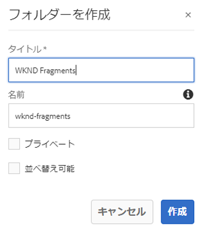
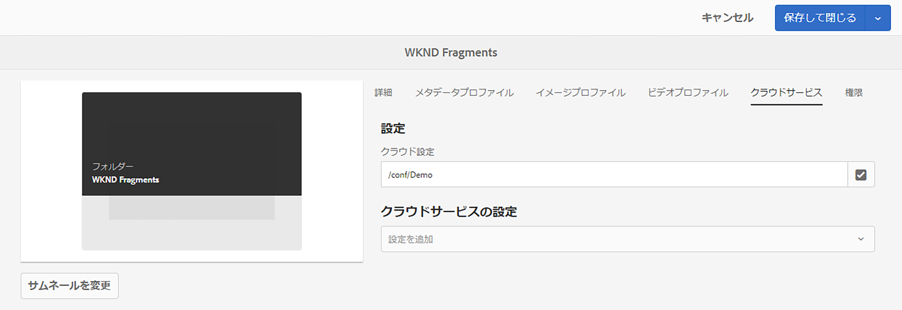
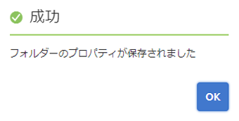

# アセットフォルダーのヘッドレスクイックスタートガイドの作成 {#creating-an-assets-folder}

AEM コンテンツフラグメントモデルを使用すると、ヘッドレスコンテンツの基盤となるコンテンツフラグメントの構造を定義できます。コンテンツフラグメントはアセットフォルダーに保存されます。

## Assets フォルダーとは {#what-is-an-assets-folder}

今後のコンテンツフラグメントに必要な構造を定義する[コンテンツフラグメントモデルを作成](create-content-model.md)できたので、フラグメントを作成するのが楽しみかと思います。

ただし、まず、アセットを保存するアセットフォルダーを作成する必要があります。

アセットフォルダーは、 [従来のコンテンツアセットを整理する](/help/assets/manage-assets.md) 画像やビデオ、コンテンツフラグメントと同様です。

## アセットフォルダーの作成方法 {#how-to-create-an-assets-folder}

管理者は、コンテンツの作成時にフォルダーを作成してコンテンツを整理するだけで済みます。この「はじめる前に」ガイドの目的上、フォルダーを 1 つだけ作成します。

1. AEMにログインし、メインメニューからを選択します。 **ナビゲーション/アセット/ファイル**.
1. クリック **作成/フォルダー**.
1. フォルダーの&#x200B;**タイトル**&#x200B;と&#x200B;**名前**&#x200B;を指定します。
   * **タイトル**&#x200B;は内容がわかるように付けます。
   * **名前**&#x200B;はリポジトリのノード名になります。
      * タイトルに基づいて自動的に生成され、[AEM の命名規則](/help/sites-developing/naming-conventions.md)に従って調整されます。
      * 必要に応じて調整できます。

   
1. 作成したフォルダーを選択し、「 」を選択します。 **プロパティ** をツールバーから ( または `p` [キーボードショートカット。](/help/sites-authoring/keyboard-shortcuts.md))
1. **プロパティ**&#x200B;ウィンドウで、「**Cloud Services**」タブを選択します。
1. **クラウド設定**&#x200B;で、[以前に作成した設定](create-configuration.md)を選択します。
   
1. 「**保存して閉じる**」をクリックします。
1. クリック **OK** をクリックします。

   

作成したフォルダ内にサブフォルダを追加で作成できます。 サブフォルダーは、親フォルダーの&#x200B;**クラウド設定**&#x200B;を継承します。別の設定モデルを使用する場合は、この設定を上書きできます。

ローカライズされたサイト構造を使用している場合は、新しいフォルダーの下に[言語ルート](/help/assets/multilingual-assets.md)を作成できます。

## 次の手順 {#next-steps}

コンテンツフラグメント用のフォルダーを作成したら、「はじめる前に」ガイドの第 4 部に進み、[コンテンツフラグメントを作成します。](create-content-fragment.md)

>[!TIP]
>
>コンテンツフラグメントの管理について詳しくは、[コンテンツフラグメントのドキュメント](/help/assets/content-fragments/content-fragments.md)を参照してください。
