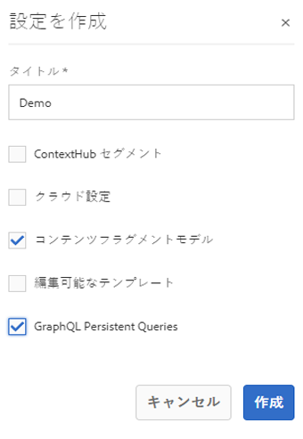

# ヘッドレス設定の作成に関するクイックスタートガイド {#creating-configuration}

AEM 6.5 でヘッドレス機能を使い始めるには、まず設定を作成する必要があります。

## 設定とは {#what-is-a-configuration}

設定ブラウザーには、AEM の設定用の汎用設定 API、コンテンツ構造、解決メカニズムが用意されています。

AEM のヘッドレスなコンテンツ管理に関しては、AEM 内でコンテンツモデルを作成できるワークプレイスとして設定を考えてみてください。これにより、将来のコンテンツとコンテンツフラグメントの構造を定義できます。複数の設定を作成して、これらのモデルを分離できます。

>[!NOTE]
>
>コンテンツモデルの管理での設定の使用方法は、[フルスタック AEM の実装ページテンプレート](/help/sites-authoring/templates.md)と似ています。

## 設定の作成方法 {#how-to-create-a-configuration}

管理者は、設定を 1 回だけ作成する必要があります。コンテンツモデルの整理のために新しいワークスペースが必要になることはほとんどありません。この「はじめる前に」ガイドの目的上、設定を 1 つ作成する必要があります。

1. AEM にログインし、メインメニューで&#x200B;**ツール／一般／設定ブラウザー**&#x200B;を選択します。
1. 設定の&#x200B;**タイトル**&#x200B;を入力します。
   * 名前は、タイトルにもとづいて自動的に生成され、[AEM の命名規則に従って調整されます。](/help/sites-developing/naming-conventions.md) を使用して作成します。これは、リポジトリ内のノード名になります。
1. 次のオプションを確認します。
   * **コンテンツフラグメントモデル**
   * **GraphQL の永続的なクエリ**

   

1. 「**作成**」をタップまたはクリックします。

必要に応じて、複数の設定を作成できます。設定は入れ子にすることもできます。

>[!NOTE]
>
>実装要件に応じて、**コンテンツフラグメントモデル**&#x200B;および **GraphQL の永続的なクエリ**&#x200B;に加えて、設定オプションが必要になる場合があります。

## 次の手順 {#next-steps}

この設定を使用して、「はじめる前に」ガイドの第 2 部に進み、[コンテンツフラグメントモデルを作成します。](create-content-model.md)

<!--
>[!TIP]
>
>For complete details about the Configuration Browser, [see the Configuration Browser documentation.](/help/sites-developing/configurations.md)
-->
