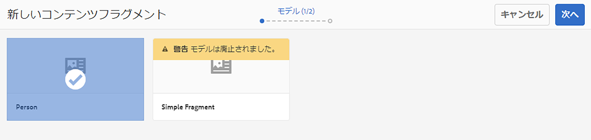
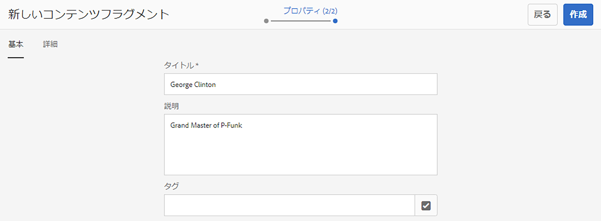
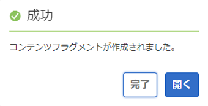
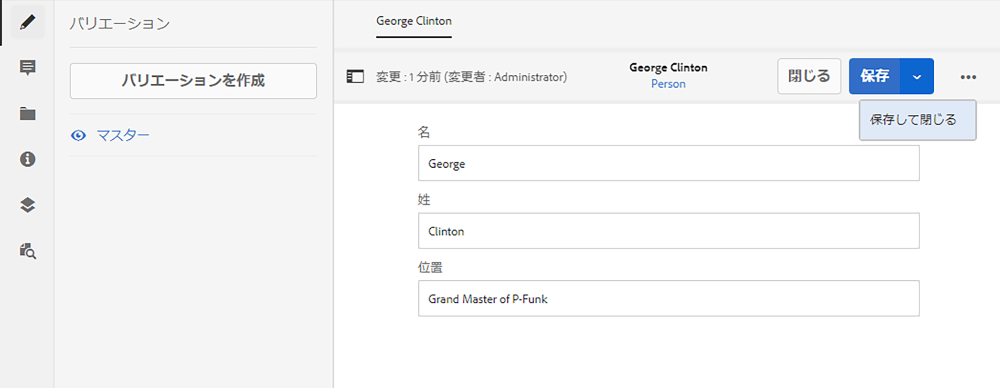

# コンテンツフラグメントのヘッドレス作成のクイック開始ガイド {#creating-content-fragments}

AEM のコンテンツフラグメントを使用して、ページに依存しないヘッドレス配信用コンテンツを設計、作成、キュレーションおよび使用する方法を説明します。

## コンテンツフラグメントとは  {#what-are-content-fragments}

コンテンツフラグメントを保存できる[アセットフォルダーを作成したので](create-assets-folder.md)、フラグメントを作成できるようになります。

コンテンツフラグメントを使用すると、ページに依存しないコンテンツの設計、作成、キュレーションおよび公開が可能になります。複数の場所や複数のチャネルで使用可能なコンテンツを用意できるようになります。

コンテンツフラグメントには構造化されたコンテンツが含まれ、JSON 形式で配信できます。

## コンテンツフラグメントの作成方法 {#how-to-create-a-content-fragment}

コンテンツ作成者は、作成したコンテンツを表す任意の数のコンテンツフラグメントを作成します。これが AEM での主なタスクとなります。この「はじめる前に」ガイドの目的上、1 つだけ作成します。

1. AEM にログインし、メインメニューから、**ナビゲーション／アセット**&#x200B;を選択します。
1. 以前に作成した [ フォルダーに移動します。](create-assets-folder.md)
1. **作成／コンテンツフラグメント**&#x200B;をクリックします。
1. コンテンツフラグメントの作成は、2 つの手順でウィザードとして表示されます。まず、コンテンツフラグメントの作成に使用するモデルを選択し、「**次へ**」をクリックします。
   * 使用できるモデルは、コンテンツフラグメントを作成する&#x200B;[**アセットフォルダーに対して定義した**&#x200B;クラウド設定](create-assets-folder.md)によって異なります。
   * `We could not find any models` というメッセージが表示された場合は、アセットフォルダーの設定を確認してください。

   
1. 必要に応じて、「**タイトル**」、「**説明**」、「**タグ**」を指定し、「**作成**」をクリックします。

   
1. 確認ウィンドウで「**開く**」をクリックします。

   
1. コンテンツフラグメントエディターで、コンテンツフラグメントの詳細を指定します。

   
1. 「**保存**」または「**保存して閉じる**」をクリックします。

コンテンツフラグメントは他のコンテンツフラグメントを参照でき、必要に応じてネストされたコンテンツ構造を作成できます。

コンテンツフラグメントは、AEM 内の他のアセットを参照することもできます。参照するコンテンツフラグメントを作成する前に、[これらのアセットを AEM に保存する必要があります](/help/assets/manage-assets.md)。

## 次の手順 {#next-steps}

コンテンツフラグメントを作成したら、「はじめる前に」ガイドの最後の部分に進み、[コンテンツフラグメントにアクセスして配信するための API リクエストを作成](create-api-request.md)できます。

>[!TIP]
>
>コンテンツフラグメントの管理について詳しくは、[コンテンツフラグメントのドキュメント](/help/assets/content-fragments/content-fragments.md)を参照してください。
