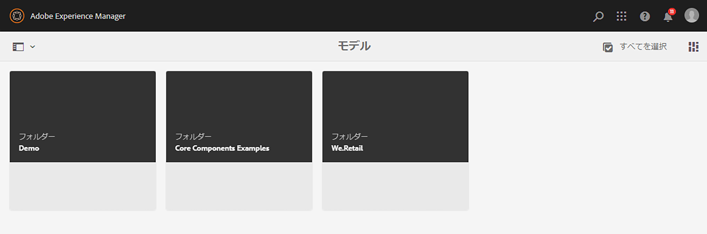
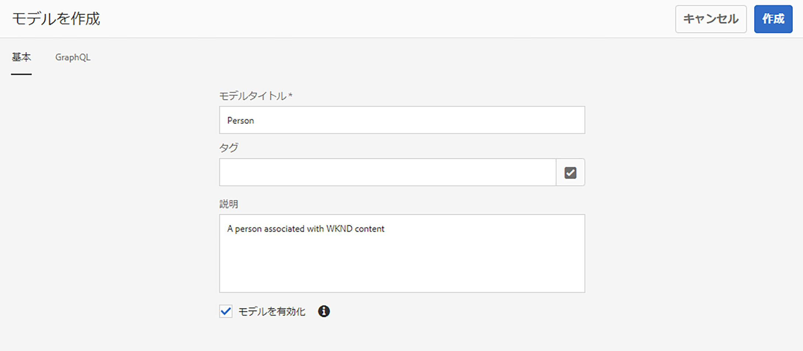
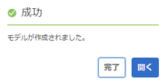
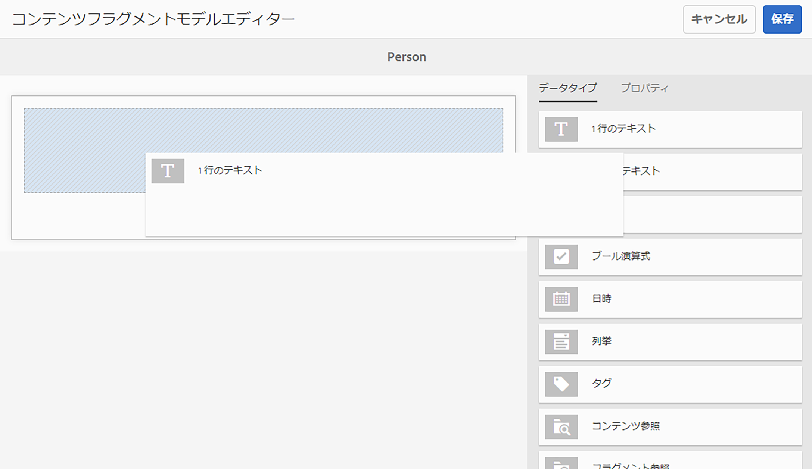
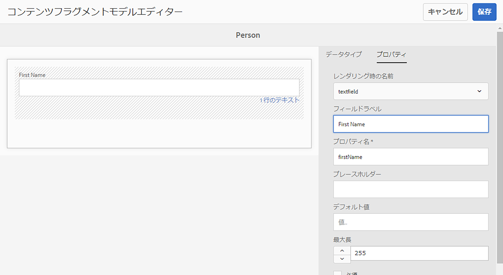
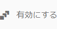
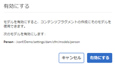
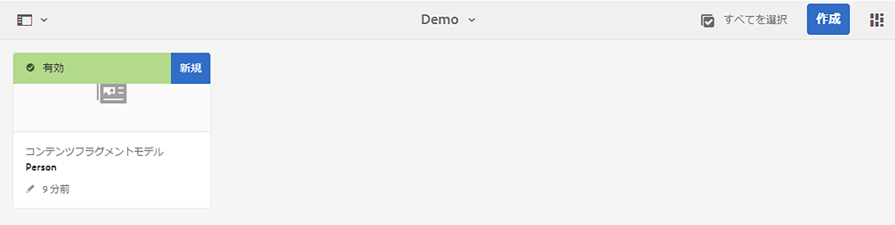

# コンテンツフラグメントモデルのヘッドレス作成のクイックスタートガイド {#creating-content-fragment-models}

コンテンツフラグメントモデルを使用して、Adobe Experience Manager(AEM) ヘッドレス機能を使用して作成および提供するコンテンツの構造を定義します。

## コンテンツフラグメントモデルとは  {#what-are-content-fragment-models}

[設定を作成したので、](create-configuration.md)この設定を使用してコンテンツフラグメントモデルを作成できます。

コンテンツフラグメントモデルは、AEM で作成および管理するデータとコンテンツの構造を定義するもので、コンテンツの一種の基礎として機能します。コンテンツの作成を選択すると、作成者はあなたが定義したコンテンツフラグメントモデルから選択します。これが、コンテンツの作成のガイドとなります。

## コンテンツフラグメントモデルの作成方法 {#how-to-create-a-content-fragment-model}

新しいモデルが必要な場合、情報アーキテクトはこれらのタスクを実行します。この入門ガイドでは、1 つのモデルのみを作成します。

1. AEM にログインし、メインメニューで&#x200B;**ツール／アセット／コンテンツフラグメントモデル**&#x200B;を選択します。
1. 設定を作成したフォルダーをタップまたはクリックします。

   
1. 「**作成**」をタップまたはクリックします。
1. 次を提供： **モデルタイトル**, **タグ**、および **説明**. また、「**モデルを有効化**」を選択／選択解除して、モデルを作成時にすぐに有効にするかどうかを指定することもできます。

   
1. 確認ウィンドウで、「**開く**」をタップまたはクリックして、モデルを設定します。

   
1. **コンテンツフラグメントモデルエディター** を使用して、 **データタイプ** 列からフィールドをドラッグ&amp;ドロップして、コンテンツフラグメントモデルを作成します。

   

1. フィールドを配置した後、そのプロパティを設定する必要があります。エディターが自動的に **プロパティ** タブを使用して、必須フィールドを指定できます。

   
1. モデルの構築が完了したら、「**保存**」をタップまたはクリックします。

1. 新しく作成されたモデルのモードは、選択した **モデルを有効にする** モデルの作成時：
   * 選択済み — 新しいモデルは既に存在します **有効**
   * 未選択 — 新しいモデルが次の場所に作成されます： **ドラフト** mode

1. モデルがまだ有効になっていない場合は、モデルを **有効** を使用します。
   1. 作成したモデルを選択し、をタップまたはクリックします。 **有効にする**.

      
   1. 確認ダイアログで「**有効にする**」をタップまたはクリックして、モデルの有効化を確認します。

      
1. モデルが有効になり、使用できる状態になります。

   

The **コンテンツフラグメントモデルエディター** は、単純なテキストフィールド、アセット参照、他のモデルへの参照、JSON データなど、様々なデータタイプをサポートしています。

モデルは複数作成できます。モデルは他のコンテンツフラグメントを参照できます。[設定](create-configuration.md)を使用して、モデルを整理します。

## 次の手順 {#next-steps}

モデルを作成してコンテンツフラグメントの構造を定義したので、はじめにガイドの 3 番目の部分に進み、 [フラグメントを保存するフォルダーを作成します。](create-assets-folder.md)

>[!TIP]
>
>コンテンツフラグメントモデルについて詳しくは、 [コンテンツフラグメントモデルドキュメント](/help/assets/content-fragments/content-fragments-models.md)
