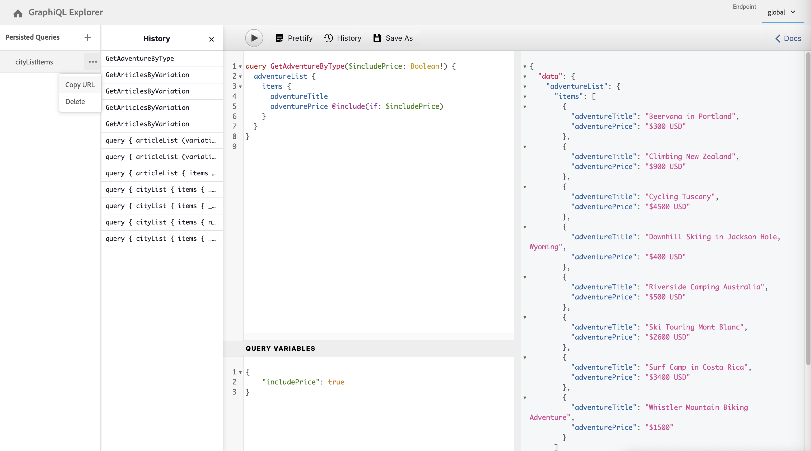

# GraphiQL IDE の使用 {#graphiql-ide}

標準の [GraphiQL](https://graphql.org/learn/serving-over-http/#graphiql) IDE の実装は、Adobe Experience Manager（AEM） の GraphQL API で使用できます。

>[!NOTE]
>
>GraphiQL は AEM のすべての環境に含まれています（ただし、エンドポイントを設定した場合にのみアクセス可能／表示可能になります）。
>
>以前のリリースでは、GraphiQL IDE をインストールするためにパッケージが必要でした。これをインストール済みの場合は、削除できます。

>[!NOTE]
>GraphiQL IDE を使用する前に、[設定ブラウザー](/help/assets/content-fragments/content-fragments-configuration-browser.md)で[エンドポイントを設定](/help/sites-developing/headless/graphql-api/graphql-endpoint.md)しておく必要があります。

**GraphiQL** ツールを使用すると、次のことが可能になるので、GraphQL クエリをテストおよびデバッグできます。

* クエリに使用する Sites 設定に適した&#x200B;**エンドポイント**&#x200B;を選択する
* 新しいクエリを直接入力する
* **[永続クエリ](/help/sites-developing/headless/graphql-api/persisted-queries.md)**&#x200B;を作成してアクセスする
* クエリを実行して結果をすぐに確認する
* **クエリ変数**&#x200B;を管理する
* **永続クエリ**&#x200B;を保存して管理する
* **永続クエリ**&#x200B;を公開または非公開にする（`dev-publish` との間など）
* 以前のクエリの&#x200B;**履歴**&#x200B;を確認する
* **ドキュメントエクスプローラー**&#x200B;を使用してドキュメントにアクセスし、使用可能な方法を学び理解するのに役立てる

クエリエディターには、次のいずれかの方法でアクセスできます。

* **ツール**／**一般**／**GraphQL クエリエディター**
* 直接アクセス（例：`http://localhost:4502/aem/graphiql.html`）

システムで GraphiQL を使用すると、GET リクエストを使用してクライアントアプリケーションからクエリをリクエストしたり、クエリを公開したりできます。実稼動環境で使用する場合は、その後[クエリを実稼動環境に移動](/help/sites-developing/headless/graphql-api/persisted-queries.md#transfer-persisted-query-production)できます。最初は実稼動オーサーに移行して、新しくオーサリングしたコンテンツをクエリで検証し、最終的には実稼動パブリッシュに移行してライブで利用できるようにします。

## エンドポイントの選択 {#selecting-endpoint}

まず、クエリに使用する&#x200B;**[エンドポイント](/help/sites-developing/headless/graphql-api/graphql-endpoint.md)**&#x200B;を選択する必要があります。クエリに使用する Sites 設定に適したエンドポイントです。

これは、右上のドロップダウンリストから選択できます。

## 新しいクエリの作成と永続化 {#creating-new-query}

エディターに新しいクエリを入力できます（エディターは左中央パネルの GraphiQL ロゴのすぐ下にあります）。

>[!NOTE]
>
>永続クエリが既に選択されていて、エディターパネルに表示されている場合は、（**永続クエリ**&#x200B;の横にある）「`+`」を選択してエディターを空にし、新しいクエリを作成できるようにします。

入力を開始します。エディターには次の機能があります。

* マウスオーバーを使用して、要素に関する追加情報を表示します
* 構文のハイライト表示、オートコンプリート、自動候補表示などの機能が用意されています

>[!NOTE]
>
>GraphQL クエリは通常、`{` 文字で始まります。
>
>`#` で始まる行は無視されます。

「**名前を付けて保存**」を使用して、新しいクエリを永続化します。

## 永続クエリの更新 {#updating-persisted-query}

更新するクエリを（左端の）**[永続クエリ](/help/sites-developing/headless/graphql-api/persisted-queries.md)**&#x200B;パネルのリストから選択します。

クエリがエディターパネルに表示されます。必要な変更を加えたあと、「**保存**」を使用して、更新内容を永続クエリにコミットします。

## クエリの実行 {#running-queries}

新しいクエリをすぐに実行することもできますし、永続クエリを読み込んで実行することもできます。永続クエリを読み込むには、該当するクエリをリストから選択します。そのクエリがエディターパネルに表示されます。

どちらの場合も、エディターパネルに表示されるクエリは、次のいずれかの場合に実行されるクエリです。

* 「**クエリを実行**」アイコンをクリックまたはタップする
* キーボードショートカット `Control-Enter` を使用する

## クエリ変数 {#query-variables}

<!-- more details needed here? -->

また、GraphiQL IDE では、[クエリ変数](/help/sites-developing/headless/graphql-api/graphql-api-content-fragments.md#graphql-variables)を管理することもできます。

例：

<!--
## Managing cache for your persisted queries {#managing-cache}

[Persisted queries](/help/headless/graphql-api/persisted-queries.md) are recommended as they can be cached at the dispatcher and CDN layers, ultimately improving the performance of the requesting client application. By default AEM will invalidate the Content Delivery Network (CDN) cache based on a default Time To Live (TTL).

>[!NOTE]
>
>Custom rewrite rules on the Dispatcher might override defaults from AEM publish. 
>
>In the case that you are sending TTL-based cache-control headers from the dispatcher, based on a location match pattern, then, if necessary, you might want to exclude `/graphql/execute.json/*` from the matches.

Using GraphQL you can configure the HTTP Cache Headers  to control these parameters for your individual persisted query.

1. The **Headers** option is accessible via the three vertical dots to the right of the persisted query name (far left panel):

   

1. Selecting this will open the **Cache Configuration** dialog:

   

1. Select the appropriate parameter, then adjust the value as required:

   * **cache-control** - **max-age**
     Caches can store this content for specified number of seconds. Typically this is the browser TTL (Time To Live).
   * **surrogate-control** - **s-maxage**
     Same as max-age but applies specifically to proxy caches.
   * **surrogate-control** - **stale-while-revalidate**
     Caches may continue to serve a cached response after it becomes stale, for up to the specified number of seconds.
   * **surrogate-control** - **stale-if-error**
     Caches may continue to serve a cached response in case of or origin error, for up to the specified number of seconds.

1. Select **Save** to persist the changes.
-->

## 永続クエリの公開 {#publishing-persisted-queries}

リスト（左パネル）から [永続クエリ](/help/sites-developing/headless/graphql-api/persisted-queries.md)を選択したら、「**公開**」アクションと「**非公開**」アクションを使用できます。これにより、パブリッシュ環境（`dev-publish` など）に対してアクティブ化され、テスト時にアプリケーションから簡単にアクセスできるようになります。

>[!NOTE]
>
>永続クエリのキャッシュ `Time To Live` {&quot;cache-control&quot;:&quot;parameter&quot;:value} の定義では、デフォルト値は 2 時間（7200 秒）になっています。

## URL をコピーしてクエリに直接アクセスする {#copy-url}

「**URL をコピー**」オプションを使用すると、永続クエリに直接アクセスする URL をコピーしてクエリをシミュレートし、結果を確認することができます。これは、ブラウザーでアクセスするなどしてテストに使用できます。

<!--
  >[!NOTE]
  >
  >The URL will need [encoding before using programmatically](/help/headless/graphql-api/persisted-queries.md#encoding-query-url).
  >
  >The target environment might need adjusting, depending on your requirements.
-->

例：

`http://localhost:4502/graphql/execute.json/global/article-list-01`

この URL をブラウザーで使用すると、結果を確認できます。

「**URL をコピー**」オプションには、永続クエリ名（左端のパネル）の右側にある 3 ドットアイコンを使用してアクセスできます。

## 永続クエリの削除 {#deleting-persisted-queries}

永続クエリ名（左端のパネル）の右側にある 3 ドットアイコンを使用すると、「**削除**」オプションにもアクセスできます。

<!-- what happens if you try to delete something that is still published? -->

## 実稼動環境への永続クエリのインストール {#installing-persisted-query-production}

GraphiQL を使用して永続クエリを作成およびテストした後は、その永続クエリを[実稼動環境に転送](/help/sites-developing/headless/graphql-api/persisted-queries.md#transfer-persisted-query-production)してアプリケーションで使用できるようにします。

## キーボードショートカット {#keyboard-shortcuts}

IDE のアクションアイコンに直接アクセスできる一連のキーボードショートカットが用意されています。

* クエリの修飾：`Shift-Control-P`
* クエリの結合：`Shift-Control-M`
* クエリの実行：`Control-Enter`
* オートコンプリート：`Control-Space`

>[!NOTE]
>
>一部のキーボードでは、`Control` キーには `Ctrl` のラベルが付いています。
