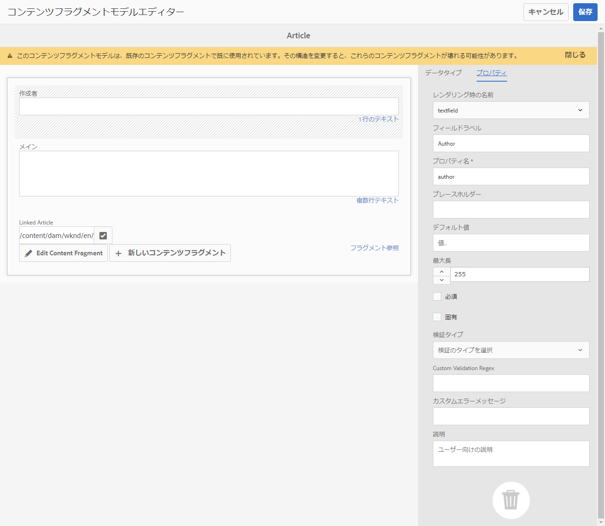

# コンテンツフラグメントと共に使用する AEM GraphQL API {#graphql-api-for-use-with-content-fragments}

Adobe Experience Manager（AEM） のコンテンツフラグメントを AEM GraphQL API と共に使用してヘッドレスコンテンツ配信を実現する方法を説明します。

コンテンツフラグメントと共に使用する AEM GraphQL API は、オープンソースの標準 GraphQL API に大いに基づいています。

AEM の GraphQL API を使用すると、ヘッドレス CMS 実装の JavaScript クライアントにコンテンツフラグメントを効率的に配信できます。

* REST で API リクエストの反復を回避
* 特定の要件に限定された配信を確保
* 1 つの API クエリへの応答としてレンダリングに必要なものだけを一括配信

>[!NOTE]
>
>GraphQL は現在 Adobe Experience Manager（AEM）の 2 つの（別々の）シナリオで使用されています。
>
>* [AEM Commerce が、GraphQL 経由でコマースプラットフォームのデータを使用する](/help/commerce/cif/integrating/magento.md)。
>* AEM コンテンツフラグメントが、AEM GraphQL API（標準の GraphQL に基づくカスタム実装）と連携して、アプリケーションで使用するための構造化コンテンツを配信する。

## 前提条件 {#prerequisites}

GraphQL を使用しているお客様は、GraphQL インデックスパッケージ 1.0.5 を使用した AEM コンテンツフラグメントをインストールする必要があります。詳しくは、[リリースノート](/help/release-notes/release-notes.md#install-aem-graphql-index-add-on-package)を参照してください。

## GraphQL API {#graphql-api}

GraphQL とは次のことを意味します。

* 「*...API のクエリ言語と、既存のデータを使用してこれらのクエリを満たすランタイムです。GraphQL は、API でデータの完全で理解可能な説明を提供します。必要なものと不要なものを正確に求める力をクライアントに提供し、API を時間の経過と共に発展させ、強力な開発者ツールを実現します*」。

  [GraphQL.org](https://graphql.org) を参照

* 「*...柔軟な API レイヤー用のオープンな仕様。GraphQL を既存のバックエンドに重ね合わせ、これまでにない速さで製品を構築できます…*」

  [Explore GraphQL](https://graphql.com/) を参照してください。

* *「...2012 年に Facebook 社内で開発されたデータクエリ言語および仕様です。その後、2015 年には公式にオープンソースとなりました。開発者の生産性を高め、転送データの量を最小限に抑えるために、REST ベースのアーキテクチャに代わる手段を提供します。GraphQL は、あらゆる規模の数百の組織により実稼働環境で使用されています...」*

  [GraphQL Foundation](https://graphql.org/foundation) を参照してください。

<!--
"*Explore GraphQL is maintained by the Apollo team. Our goal is to give developers and technical leaders around the world all the tools they need to understand and adopt GraphQL.*". 
-->

GraphQL API について詳しくは、（多くのリソースの中でも特に）次の節を参照してください。

* [graphql.org](https://graphql.org)：

   * [GraphQL の概要](https://graphql.org/learn)

   * [GraphQL の仕様](https://spec.graphql.org/)

* [graphql.com](https://graphql.com)：

   * [チュートリアル](https://graphql.com/tutorials/)


AEM 用 GraphQL の実装は、標準の GraphQL Java™ ライブラリをベースにしています。以下を参照してください。

* [graphQL.org - Java](https://graphql.org/code/#java)

* [GitHub の GraphQL Java™](https://github.com/graphql-java)

### GraphQL 用語 {#graphql-terminology}

GraphQL では次を使用します。

* **[クエリ](https://graphql.org/learn/queries/)**

* **[スキーマとタイプ](https://graphql.org/learn/schema/)**：

   * スキーマは、コンテンツフラグメントモデルに基づいて AEM で生成されます。
   * GraphQL では、スキーマを使用して、AEM 用 GraphQL の実装で使用可能なタイプと操作を提供します。

* **[フィールド](https://graphql.org/learn/queries/#fields)**

* **[GraphQL エンドポイント](/help/sites-developing/headless/graphql-api/graphql-endpoint.md#graphql-aem-endpoint)**
   * GraphQL クエリに応答し、GraphQL スキーマへのアクセスを提供する AEM 内のパス。

   * 詳しくは、[GraphQL エンドポイントの有効化](/help/sites-developing/headless/graphql-api/graphql-endpoint.md#enabling-graphql-endpoint)を参照してください。

[ベストプラクティス](https://graphql.org/learn/best-practices/)を含む包括的な詳細については、「[(GraphQL.org) GraphQL の概要](https://graphql.org/learn/)」を参照してください。

### GraphQL クエリタイプ {#graphql-query-types}

GraphQL では、次のいずれかを返すクエリを実行できます。

* **1 つのエントリ**

* **[エントリのリスト](https://graphql.org/learn/schema/#lists-and-non-null)**

AEM は、クエリ（両方のタイプ）を Dispatcher と CDN によってキャッシュできる[永続クエリ](/help/sites-developing/headless/graphql-api/persisted-queries.md)に変換する機能を提供します。

### GraphQL クエリのベストプラクティス（Dispatcher と CDN） {#graphql-query-best-practices}

[永続クエリ](/help/sites-developing/headless/graphql-api/persisted-queries.md)は、パブリッシュインスタンスで次のように使用することをお勧めします。

* キャッシュされます
* AEM で一元管理されます

<!-- is this fully accurate? -->
>[!NOTE]
>
>通常、オーサーには Dispatcher／CDN がないので、永続クエリをテストする以外に使用してもパフォーマンス上のメリットはありません。

POST リクエストを使用する GraphQL クエリは、キャッシュされないのでお勧めしません。そのため、デフォルトのインスタンスでは、Dispatcher はそれらのクエリをブロックするように設定されています。

GraphQL は GET リクエストもサポートしていますが、これらのリクエストは制限（URL の長さなど）に達する可能性があり、これは永続クエリを使用することで回避できます。

詳しくは、[永続クエリのキャッシュの有効化](#enable-caching-persisted-queries)を参照してください。

>[!NOTE]
>
>直接クエリを実行する機能は、将来、廃止される可能性があります。

## GraphiQL インターフェイス {#graphiql-interface}

標準の [GraphiQL](https://graphql.org/learn/serving-over-http/#graphiql) インターフェイスの実装は、AEM GraphQL で使用できます。

>[!NOTE]
>
>GraphiQL は AEM のすべての環境に含まれています（ただし、エンドポイントを設定した場合にのみアクセス可能／表示可能になります）。
>
>以前のリリースでは、GraphiQL IDE をインストールするためにパッケージが必要でした。このパッケージをインストール済みの場合、削除できます。

このインターフェイスを使用すると、クエリを直接入力してテストできます。

例：

* `http://localhost:4502/content/graphiql.html`

構文のハイライト表示、オートコンプリート、自動候補表示などの機能と共に、履歴およびオンラインドキュメントが用意されています。


>[!NOTE]
>
>[GraphiQL IDE の使用](/help/sites-developing/headless/graphql-api/graphiql-ide.md)を参照してください。

## オーサー環境とパブリッシュ環境の使用例 {#use-cases-author-publish-environments}

使用例は、AEM 環境のタイプによって異なる場合があります。

* パブリッシュ環境の使用目的：
   * JS アプリケーションのデータのクエリ（標準の使用例）

* オーサー環境の使用目的：
   * 「コンテンツ管理用」のデータのクエリ：
      * AEM の GraphQL は読み取り専用の API です。
      * REST API は、CR(U)D の操作に使用できます。

## 権限 {#permission}

Assets にアクセスするには権限が必要です。

GraphQL クエリは、基になるリクエストの AEM ユーザーの権限で実行されます。ユーザーが一部の（Assets として保存された）フラグメントへの読み取りアクセス権を持っていない場合、ユーザーは結果セットの一部になりません。

また、ユーザーが GraphQL クエリを実行するには、GraphQL エンドポイントへのアクセス権を持っている必要があります。

## スキーマ生成 {#schema-generation}

GraphQL は、型指定された API です。つまり、データは型別に明確に構造化され編成される必要があります。

GraphQL の仕様には、特定のインスタンス上のデータをクエリするための堅牢な API を作成する方法に関する一連のガイドラインが用意されています。これらのガイドラインを完了するには、クライアントは、クエリに必要なすべての型を含む[スキーマ](#schema-generation)を取得する必要があります。

コンテンツフラグメントの場合、GraphQL スキーマ（構造とタイプ）は、**有効**&#x200B;な[コンテンツフラグメントモデル](/help/assets/content-fragments/content-fragments-models.md)とそれらのデータタイプに基づいています。

>[!CAUTION]
>
>（**有効**&#x200B;になっているコンテンツフラグメントモデルから派生した）すべての GraphQL スキーマは、GraphQL エンドポイントを通じて読み取り可能です。
>
>この機能は、この方法で機密データが漏洩する可能性があるので、機密データを利用できないようにする必要があることを意味します。例えば、モデル定義のフィールド名として存在する情報が含まれます。

例えば、ユーザーが `Article` というコンテンツフラグメントモデルを作成した場合、AEM は GraphQL タイプ `ArticleModel` を生成します。このタイプに含まれるフィールドは、モデルで定義されているフィールドとデータタイプに対応しています。さらに、`articleByPath` や `articleList` など、このタイプで動作するクエリのいくつかのエントリポイントを作成します。

1. コンテンツフラグメントモデル：

   

1. 対応する GraphQL スキーマ（GraphiQL 自動生成ドキュメントからの出力）:
   

   この画像では、生成された型 `ArticleModel` に複数の[フィールド](#fields)が含まれていることがわかります。

   * そのうちの 3 つ（`author`、`main`、`referencearticle`）は、ユーザーが管理しています。

   * その他のフィールドは AEM によって自動的に追加されたもので、特定のコンテンツフラグメントに関する情報を提供する便利な手段となっています。この例では、
（[ヘルパーフィールド](#helper-fields)）`_path`、`_metadata`、`_variations`。

1. ユーザーが Article モデルに基づいてコンテンツフラグメントを作成すると、GraphQL を使用してそれをクエリできます。例については、（[GraphQL で使用するコンテンツフラグメント構造のサンプル](/help/sites-developing/headless/graphql-api/content-fragments-graphql-samples.md#content-fragment-structure-graphql)に基づいた）[サンプルクエリ](/help/sites-developing/headless/graphql-api/content-fragments-graphql-samples.md#graphql-sample-queries)を参照してください。

AEM 用 GraphQL では、スキーマには柔軟性があります。この柔軟性は、コンテンツフラグメントモデルを作成、更新、削除するたびに、スキーマが自動生成されることを意味します。また、コンテンツフラグメントモデルを更新すると、データスキーマキャッシュも更新されます。

Sites GraphQL サービスは、コンテンツフラグメントモデルに対する変更を（バックグラウンドで）リッスンします。更新が検出されると、スキーマのその部分だけが再生成されます。この最適化により、時間が節約され、安定性も確保されます。

例えば、次のようになります。

1. `Content-Fragment-Model-1` と `Content-Fragment-Model-2` を含んだパッケージをインストールすると、

   1. `Model-1` および `Model-2` の GraphQL タイプが生成されます。

1. 次に `Content-Fragment-Model-2` を変更すると、

   1. `Model-2` GraphQL のタイプのみが更新されます。

   1. 一方で `Model-1` は変わりません。

>[!NOTE]
>
>この詳細は、REST API を使用してコンテンツフラグメントモデルの一括更新を行う場合などに留意することが大切です。

スキーマは、GraphQL クエリと同じエンドポイントを通じて提供され、クライアントはスキーマが拡張子 `GQLschema` で呼び出されることに対処します。例えば、`/content/cq:graphql/global/endpoint.GQLschema` で単純な `GET` リクエストを実行すると、`text/x-graphql-schema;charset=iso-8859-1` の Content-type を持つスキーマが出力されます。

### スキーマの生成 - 未公開のモデル {#schema-generation-unpublished-models}

コンテンツフラグメントがネストされると、親のコンテンツフラグメントモデルは公開されますが、参照モデルは公開されません。

>[!NOTE]
>
>AEM ユーザーインターフェイスはこのような問題を回避しますが、プログラムを使用して、またはコンテンツパッケージを使用して公開すると、この問題が発生する可能性があります。

この場合、AEM は親コンテンツフラグメントモデルの&#x200B;*不完全な*&#x200B;スキーマを生成します。非公開のモデルに依存するフラグメント参照がスキーマから削除されることを意味します。

## フィールド {#fields}

スキーマ内には、次の 2 つの基本的なカテゴリに属する個々のフィールドがあります。

* ユーザーが生成するフィールド

  選択された[フィールドタイプ](#data-types)を使用して、コンテンツフラグメントモデルの設定方法に基づいてフィールドが作成されます。フィールド名は、**データタイプ**&#x200B;の「**プロパティ名**」フィールドから取得されます。

   * ユーザーが特定のデータタイプを設定できるので、**レンダリング形式**&#x200B;設定も考慮する必要があります。例えば、1 行のテキストフィールドに複数の 1 行のテキストを含めるように設定するには、ドロップダウンから「`multifield`」を選択します。

* AEM の GraphQL も、複数の[ヘルパーフィールド](#helper-fields)を生成します。

  これらは、コンテンツフラグメントを識別するためや、コンテンツフラグメントに関する詳細を取得するために使用されます。

### データタイプ {#data-types}

AEM 用 GraphQL では一連のタイプをサポートしています。サポートされているすべてのコンテンツフラグメントモデルデータ型と、それに対応する GraphQL 型を以下の表に示します。

| コンテンツフラグメントモデル - データ型 | GraphQL の型 | 説明 |
|--- |--- |--- |
| 1 行のテキスト | `String`、`[String]` | 作成者名、場所名などの単純な文字列に使用します。 |
| 複数行のテキスト | `String` |  記事の本文などのテキストを出力するために使用します |
| Number |  `Float`、`[Float]` | 浮動小数点数と整数を表示するために使用します |
| ブーリアン |  `Boolean` |  チェックボックスを表示するために使用します（単純な真／偽のステートメント） |
| 日時 | `Calendar` |  日時を ISO 8086 形式で表示するために使用します。選択したタイプに応じて、AEM GraphQL で使用できるフレーバーは、`onlyDate`、`onlyTime`、`dateTime` の 3 つです。 |
| 定義済みリスト |  `String` |  モデルの作成時に定義されたオプションのリストに含まれるオプションを表示するために使用します |
|  タグ |  `[String]` |  AEM で使用されているタグを表す文字列のリストを表示するために使用します |
| コンテンツ参照 |  `String` |  AEM 内の別のアセットへのパスを表示するために使用します |
| フラグメント参照 | *モデル型の*<br><br>単一のフィールド：`Model` - 直接参照されるモデル型 <br><br>マルチフィールド（1 つの参照タイプ）：`[Model]` - 型の配列 `Model`（配列から直接参照）<br><br>複数の参照型を持つマルチフィールド：`[AllFragmentModels]` - 和集合型を持つ配列から参照される、すべてのモデル型の配列 | モデルの作成時に定義された、特定のモデル型の 1 つ以上のコンテンツフラグメントの参照に使用します |

{style="table-layout:auto"}

### ヘルパーフィールド {#helper-fields}

ユーザー生成フィールドのデータ型に加えて、AEM 用 GraphQL では、コンテンツフラグメントの識別やコンテンツフラグメントに関する追加情報の提供に役立つ多数の&#x200B;*ヘルパー*&#x200B;フィールドも生成されます。

これらの[ヘルパーフィールド](#helper-fields)は、ユーザーが定義したものと自動生成されたものを区別するために、先頭に `_` が付きます。

#### パス  {#path}

パスフィールドは、AEM GraphQL で識別子として使用され、AEM リポジトリ内のコンテンツフラグメントアセットのパスを表します。このパスは、次の理由で、コンテンツフラグメントの識別子として選択されます。

* AEM 内で一意である
* 取得しやすい

次のコードでは、コンテンツフラグメントモデル `Person` に基づいて作成されたすべてのコンテンツフラグメントのパスを表示します。

```graphql
{
  personList {
    items {
      _path
    }
  }
}
```

特定のタイプのコンテンツフラグメントを 1 つ取得するには、まずそのパスも決定する必要があります。例：

```graphql
{
  authorByPath(_path: "/content/dam/path/to/fragment/john-doe") {
    item {
      _path
      firstName
      name
    }
  }
}
```

[サンプルクエリ - ある 1 つの特定の都市フラグメント](/help/sites-developing/headless/graphql-api/content-fragments-graphql-samples.md#sample-single-specific-city-fragment)を参照してください。

#### メタデータ {#metadata}

また、AEM では GraphQL を通じて、コンテンツフラグメントのメタデータも公開します。メタデータは、次のようなコンテンツフラグメントを記述する情報です。

* コンテンツフラグメントのタイトル
* サムネールのパス
* コンテンツフラグメントの説明
* および作成された日付など。

メタデータはスキーマエディターで生成され、特定の構造を持たないので、コンテンツフラグメントのメタデータを公開するために GraphQL 型 `TypedMetaData` が実装されました。`TypedMetaData` では、次のスカラー型でグループ化された情報を公開します。

| フィールド |
|--- |
| `stringMetadata:[StringMetadata]!` |
| `stringArrayMetadata:[StringArrayMetadata]!` |
| `intMetadata:[IntMetadata]!` |
| `intArrayMetadata:[IntArrayMetadata]!` |
| `floatMetadata:[FloatMetadata]!` |
| `floatArrayMetadata:[FloatArrayMetadata]!` |
| `booleanMetadata:[BooleanMetadata]!` |
| `booleanArrayMetadata:[booleanArrayMetadata]!` |
| `calendarMetadata:[CalendarMetadata]!` |
| `calendarArrayMetadata:[CalendarArrayMetadata]!` |

各スカラー型は、名前と値の 1 つのペアを表すか、名前と値のペアの配列を表します。このペアの値は、グループ化されたときの型になります。

例えば、コンテンツフラグメントのタイトルを取得する場合は、このプロパティが String 型プロパティであるためで、すべての String 型メタデータをクエリすることになります。

メタデータをクエリするには、次のようにします。

```graphql
{
  personByPath(_path: "/content/dam/path/to/fragment/john-doe") {
    item {
      _path
      _metadata {
        stringMetadata {
          name
          value
        }
      }
    }
  }
}
```

生成された GraphQL スキーマを表示するには、すべてのメタデータ GraphQL 型を表示します。すべてのモデルタイプは同じ `TypedMetaData` を持ちます。

>[!NOTE]
>
>**標準メタデータと配列メタデータの違い**：
>`StringMetadata` と `StringArrayMetadata` はどちらも、リポジトリに格納されているものについての指定であり、その取得手段についての指定ではありません。
>
>例えば、`stringMetadata` フィールドを呼び出すことで、`String` としてリポジトリに保存されているすべてのメタデータの配列を受け取ります。また、`stringArrayMetadata` を呼び出した場合、`String[]` としてリポジトリに格納されているすべてのメタデータの配列を受け取ります。

詳しくは、[メタデータのサンプルクエリ - 「GB」という賞のメタデータのリスト](/help/sites-developing/headless/graphql-api/content-fragments-graphql-samples.md#sample-metadata-awards-gb)を参照してください。

#### バリエーション {#variations}

コンテンツフラグメントのバリエーションに対するクエリを簡略化するために、`_variations` フィールドが実装されています。次に例を示します。

```graphql
{
  personByPath(_path: "/content/dam/path/to/fragment/john-doe") {
    item {
      _variations
    }
  }
}
```

>[!NOTE]
>
>技術的には元のデータ（UI で&#x200B;*マスター*&#x200B;として参照される）は明示的なバリエーションと見なされず、「`_variations`」フィールドには `master` バリエーションが含まれません。

詳しくは、[サンプルクエリ - 名前付きバリエーションを持つすべての都市](/help/sites-developing/headless/graphql-api/content-fragments-graphql-samples.md#sample-cities-named-variation)を参照してください。

>[!NOTE]
>
>コンテンツフラグメントに指定されたバリエーションが存在しない場合は、元のデータ（プライマリバリエーション）が（フォールバック）デフォルトとして返されます。

<!--
## Security Considerations {#security-considerations}
-->

## GraphQL 変数 {#graphql-variables}

GraphQL では、クエリに変数を含めることができます。詳細情報は、[変数に関する GraphQL のドキュメント](https://graphql.org/learn/queries/#variables)を参照してください。

例えば、特定のバリエーションを持つ `Article` タイプのコンテンツフラグメントをすべて取得するには、次のように、GraphiQL で変数 `variation` を指定します。


```graphql
### query
query GetArticlesByVariation($variation: String!) {
    articleList(variation: $variation) {
        items {
            _path
            author
            _variations
        }
    }
}
 
### in query variables
{
    "variation": "uk"
}
```

## GraphQL ディレクティブ {#graphql-directives}

GraphQL では、GraphQL ディレクティブと呼ばれる変数に基づいてクエリを変更する可能性があります。

例えば、変数 `includePrice` に基づいて、すべての `AdventureModels` のクエリに `adventurePrice` フィールドを含めることができます。


```graphql
### query
query GetAdventureByType($includePrice: Boolean!) {
  adventureList {
    items {
      adventureTitle
      adventurePrice @include(if: $includePrice)
    }
  }
}
 
### in query variables
{
    "includePrice": true
}
```

## フィルタリング {#filtering}

GraphQL クエリでフィルタリングを使用して、特定のデータを返すこともできます。

フィルタリングでは、論理演算子と論理式に基づいた構文を使用します。

最もアトミックな部分は、特定のフィールドの内容に適用できる単一の式です。フィールドの内容を指定された定数値と比較します。

例えば、次の式はフィールドの内容と値 `some text` を比較し、内容と値が等しい場合は成功します。それ以外の場合、式は失敗します。

```graphql
{
  value: "some text"
  _op: EQUALS
}
```

次の演算子を使用して、フィールドを特定の値と比較できます。

| 演算子 | タイプ | 次の場合、式は成功します |
|--- |--- |--- |
| `EQUALS` | `String`、`ID`、`Boolean` | ... 値がフィールドの内容と同じである |
| `EQUALS_NOT` | `String`、`ID` | ... 値がフィールドの内容と同じ&#x200B;*ではない* |
| `CONTAINS` | `String` | ... フィールドの内容に値が含まれる（`{ value: "mas", _op: CONTAINS }` が `Christmas`、`Xmas`、`master` などと一致） |
| `CONTAINS_NOT` | `String` | ... フィールドの内容に値が含まれて&#x200B;*いない* |
| `STARTS_WITH` | `ID` | ... ID が特定の値で始まる（`{ value: "/content/dam/", _op: STARTS_WITH` は `/content/dam/path/to/fragment` と一致するが、`/namespace/content/dam/something` とは一致しない） |
| `EQUAL` | `Int`、`Float` | ... 値がフィールドの内容と同じである |
| `UNEQUAL` | `Int`、`Float` | ... 値がフィールドの内容と同じで&#x200B;*はない* |
| `GREATER` | `Int`、`Float` | ... フィールドの内容が値より大きい |
| `GREATER_EQUAL` | `Int`、`Float` | ... フィールドの内容が値以上である |
| `LOWER` | `Int`、`Float` | ... フィールドの内容が値よりも小さい |
| `LOWER_EQUAL` | `Int`、`Float` | ... フィールドの内容が値以下である |
| `AT` | `Calendar`、`Date`、`Time` | ... フィールドの内容が値とまったく同じである（タイムゾーン設定を含む） |
| `NOT_AT` | `Calendar`、`Date`、`Time` | ... フィールドの内容が値と同じで&#x200B;*はない* |
| `BEFORE` | `Calendar`、`Date`、`Time` | ... 値によって示される時点が、フィールドの内容によって示される時点よりも前である |
| `AT_OR_BEFORE` | `Calendar`、`Date`、`Time` | ... 値によって示される時点が、フィールドの内容によって示される時点より前または同じ時点である |
| `AFTER` | `Calendar`、`Date`、`Time` | ... 値によって示される時点が、フィールドの内容によって示される時点よりも後である |
| `AT_OR_AFTER` | `Calendar`、`Date`、`Time` | ... 値によって示される時点が、フィールドの内容によって示される時点より後または同じ時点である |

また、次のように式の評価方法を変更する追加のオプションを指定できるタイプもあります。

| オプション | タイプ | 説明 |
|--- |--- |--- |
| `_ignoreCase` | `String` | 文字列の大文字と小文字を無視します（例：`time` の値は `TIME`、`time`、`tImE` ...に一致） |
| `_sensitiveness` | `Float` | `float` 値が同じと見なされるための一定のマージンを許可します（`float` 値の内部表現による技術的な制限を回避するため）。このオプションはパフォーマンスに悪影響を及ぼす可能性があるので、避ける必要があります。 |

式は、論理演算子（`_logOp`）を使用して設定に組み合わせることができます。

* `OR` - 少なくとも 1 つの式が成功した場合、式のセットは成功します
* `AND` - すべての式が成功した場合、式のセットは成功します（デフォルト）

各フィールドは、独自の式セットでフィルタリングできます。フィルター引数で指定されたすべてのフィールドの式セットは、最終的に独自の論理演算子で結合されます。

フィルター定義（`filter` 引数としてクエリに渡される）には次が含まれます。

* 各フィールドのサブ定義（フィールド名を使用してアクセスできます。例えば、データ（フィールド）タイプの `lastName` フィールドのフィルターには `lastName` フィールドがあります）
* 各サブ定義には、式セットを提供する `_expressions` 配列と、式を組み合わせる必要がある論理演算子を定義する `_logOp` フィールドが含まれます
* 各式は、値（`value` フィールド）と演算子（`_operator` フィールド）によって定義され、フィールドの内容を比較する必要があります

項目を `AND` と組み合わせる場合は `_logOp` を、等しいかどうかを確認する場合は `_operator` を省略できます（これらの値はデフォルトのため）。

次の例は、大文字と小文字を区別せずに、`Provo` が `lastName` である、または `sjö` を含むすべてのユーザーをフィルタリングする完全なクエリを示しています。

```graphql
{
  authorList(filter: {
    lastname: {
      _logOp: OR
      _expressions: [
        {
          value: "sjö",
          _operator: CONTAINS,
          _ignoreCase: true
        },
        {
          value: "Provo"
        }
      ]
    }
  }) {
    items {
      lastName
      firstName
    }
  }
}
```

オプション変数を使用して GraphQL クエリを実行する際、オプション変数に特定の値が指定されて&#x200B;**いない**&#x200B;場合、その変数はフィルター評価で無視されます。つまり、クエリ結果には、フィルター変数に関連するプロパティのすべての値（`null` と `null` 以外の両方）が含まれます。

>[!NOTE]
>
>そのような変数に `null` 値が&#x200B;*明示的に*&#x200B;指定されている場合、フィルターは、対応するプロパティの `null` 値のみを照合します。

例えば、以下のクエリでは、`lastName` プロパティの値が指定されていません。

```graphql
query getAuthorsFilteredByLastName($authorLastName: String) {
  authorList(filter:
    {
      lastName: {_expressions: {value: $authorLastName}
      }}) {
    items {
      lastName
    }
  }
}
```

次のように、すべての作成者が返されます。

```graphql
{
  "data": {
    "authorList": {
      "items": [
        {
          "lastName": "Hammer"
        },
        {
          "lastName": "Provo"
        },
        {
          "lastName": "Wester"
        },
        {
          "lastName": null
        },
         ...
      ]
    }
  }
}
```

ネストされたフィールドに対してフィルターを適用することもできますが、パフォーマンスの問題が発生する可能性があるため、お勧めしません。

その他の例については、以下を参照してください。

* [AEM 用 GraphQL の拡張機能](#graphql-extensions)の詳細

* [このサンプルコンテンツおよび構造を使用したサンプルクエリ](/help/sites-developing/headless/graphql-api/content-fragments-graphql-samples.md#graphql-sample-queries-sample-content-fragment-structure)

   * さらに、サンプルクエリ用に準備されている[サンプルコンテンツおよび構造](/help/sites-developing/headless/graphql-api/content-fragments-graphql-samples.md#content-fragment-structure-graphql)

* [WKND プロジェクトに基づいたサンプルクエリ](/help/sites-developing/headless/graphql-api/content-fragments-graphql-samples.md#sample-queries-using-wknd-project)

## 並べ替え {#sorting}

>[!NOTE]
>
>最高のパフォーマンスを得るには、[GraphQL フィルタリングのページングと並べ替え用にコンテンツフラグメントを更新すること](/help/sites-developing/headless/graphql-api/graphql-optimized-filtering-content-update.md)を検討してください。

この機能を使用すると、指定したフィールドに従ってクエリ結果を並べ替えることができます。

並び替え条件：

* フィールドパスを表すコンマ区切りの値のリスト
   * リスト内の最初のフィールドで、主な並べ替え順を定義します
      * 2 番目のフィールドは、主な並べ替え条件の 2 つの値が等しい場合に使用されます
      * 最初の 2 つの条件が等しい場合は 3 番目のフィールドを、などのように使用されます
   * `field1.subfield.subfield` などのドット表記になります。
* （オプション）並べ替えの方向
   * ASC（昇順）または DESC（降順）。デフォルトでは ASC が適用されます
   * 方向は、フィールドごとに指定できます。つまり、あるフィールドを昇順で、別のフィールドを降順で並べ替えることができます（name、firstName DESC）

例：

```graphql
query {
  authorList(sort: "lastName, firstName") {
    items {
      firstName
      lastName
    }
  }
}
```

次のようにすることもできます。

```graphql
{
  authorList(sort: "lastName DESC, firstName DESC") {
    items {
        lastName
        firstName
    }
  }
}
```

また、`nestedFragmentname.fieldname` の形式を使用して、ネストされたフラグメント内のフィールドで並べ替えることもできます。

>[!NOTE]
>
>この形式は、パフォーマンスに悪影響を及ぼす可能性があります。

例：

```graphql
query {
  articleList(sort: "authorFragment.lastName")  {
    items {
      title
      authorFragment {
        firstName
        lastName
        birthDay
      }
      slug
    }
  }
}
```

## ページング {#paging}

>[!NOTE]
>
>最高のパフォーマンスを得るには、[GraphQL フィルタリングのページングと並べ替え用にコンテンツフラグメントを更新すること](/help/sites-developing/headless/graphql-api/graphql-optimized-filtering-content-update.md)を検討してください。

この機能を使用すると、リストを返すクエリタイプに対してページングを実行できます。 次の 2 つの方法があります。

* `List` クエリの `offset` と `limit`
* `Paginated` クエリの `first` と `after`

### リストクエリ - オフセットと制限 {#list-offset-limit}

`...List` クエリでは、`offset` と `limit` を使用して、特定の結果サブセットを返すことができます。

* `offset`：返される最初のデータセットを指定します
* `limit`：返されるデータセットの最大数を指定します

例えば、*完全な*&#x200B;結果リストの 5 番目の記事から開始して、最大 5 つの記事を含む結果のページを出力するには、次のようにします。

```graphql
query {
   articleList(offset: 5, limit: 5) {
    items {
      authorFragment {
        lastName
        firstName
      }
    }
  }
}
```

<!-- When available link to BP and replace "JCR query level" with a more neutral term. -->

<!-- When available link to BP and replace "JCR query result set" with a more neutral term. -->

>[!NOTE]
>
>* ページングには安定した並べ替え順序が必要です。同じ結果セットの異なるページをリクエストする複数のクエリで正しく動作するようにします。デフォルトでは、結果セットの各項目のリポジトリパスを使用して、順序が常に同じであることを確認します。異なる並べ替え順を使用していて、その並べ替えを JCR クエリレベルで実行できない場合、パフォーマンスに悪影響を及ぼします。これは、ページが決定される前に結果セット全体をメモリに読み込む必要があるからです。
>
>* オフセットが大きいほど、JCR クエリの結果セット全体から項目をスキップするのに時間がかかります。大規模な結果セットに対する代替ソリューションは、`first` および `after` メソッドでページ分割されたクエリを使用することです。

### ページ分割されたクエリ - first と after {#paginated-first-after}

`...Paginated` クエリタイプは、ほとんどの `...List` クエリタイプの機能（フィルタリング、並べ替え）を再利用しますが、`offset`／`limit` 引数の代わりに、[GraphQL カーソル接続仕様](https://relay.dev/graphql/connections.htm)で定義されている `first`／`after` 引数を使用します。[GraphQL の概要](https://graphql.org/learn/pagination/#pagination-and-edges)では、堅苦しくない概要を見つけることができます。

* `first`：返される最初の `n` 個の項目。
デフォルトは、`50` です。
最大値は `100` です。
* `after`：リクエストされたページの先頭を決定するカーソル。カーソルで表される項目は結果セットに含まれません。項目のカーソルは、`edges` 構造体の `cursor` フィールドによって決定されます。

例えば、*完全な*&#x200B;結果リスト内の指定されたカーソル項目から開始して、最大 5 つのアドベンチャーを含む結果のページを出力します。

```graphql
query {
    adventurePaginated(first: 5, after: "ODg1MmMyMmEtZTAzMy00MTNjLThiMzMtZGQyMzY5ZTNjN2M1") {
        edges {
          cursor
          node {
            title
          }
        }
        pageInfo {
          endCursor
          hasNextPage
        }
    }
}
```

<!-- When available link to BP -->
<!-- Due to internal technical constraints, performance will degrade if sorting and filtering is applied on nested fields. Therefore it is recommended to use filter/sort fields stored at root level. For more information, see the [Best Practices document](link). -->

>[!NOTE]
>
>* デフォルトのページングでは、結果の順序が常に同じになるように、フラグメントを表すリポジトリノードの UUID を順序付けに使用します。`sort` を使用すると、UUID は一意の並べ替えを保証するために暗黙的に使用されます。同じ並べ替えキーを持つ 2 つの項目の場合も同様です。
>
>* 内部の技術的制約により、ネストされたフィールドに並べ替えとフィルタリングを適用すると、パフォーマンスが低下します。そのため、ルートレベルで格納されたフィルターや並べ替えのフィールドを使用してください。これは、ページ分割された大きな結果セットをクエリする場合にも推奨される方法です。

## GraphQL の永続クエリ - Dispatcher でのキャッシュの有効化 {#graphql-persisted-queries-enabling-caching-dispatcher}

>[!CAUTION]
>
>Dispatcher でのキャッシュが有効な場合、[CORS フィルター](#cors-filter)が不要なので、セクションを無視できます。

永続化されたクエリのキャッシュは、Dispatcher ではデフォルトで有効になっていません。複数のオリジンで CORS（クロスオリジンリソース共有）を使用している場合、Dispatcher 設定を確認し、場合によっては更新する必要があるので、デフォルトで有効にすることはできません。

>[!NOTE]
>
>Dispatcher では `Vary` ヘッダーはキャッシュされません。
>
>他の CORS 関連ヘッダーのキャッシュは、Dispatcher で有効にすることができますが、CORS オリジンが複数ある場合は不十分な可能性があります。

### 永続クエリのキャッシュの有効化 {#enable-caching-persisted-queries}

永続クエリのキャッシュを有効にするには、Dispatcher 設定ファイルを次のように更新する必要があります。

* `<conf.d/rewrites/base_rewrite.rules>`

  ```xml
  # Allow the dispatcher to be able to cache persisted queries - they need an extension for the cache file
  RewriteCond %{REQUEST_URI} ^/graphql/execute.json
  RewriteRule ^/(.*)$ /$1;.json [PT] 
  ```

  >[!NOTE]
  >
  >Dispatcher がすべての永続クエリ URL にサフィックス `.json` を追加して、結果をキャッシュできるようにします。
  >
  >これは、キャッシュ可能なドキュメントに対する Dispatcher の要件にクエリが確実に従うようにするためです。詳しくは、[Dispatcher がドキュメントを返す方法](https://experienceleague.adobe.com/docs/experience-manager-dispatcher/using/troubleshooting/dispatcher-faq.html?lang=ja#how-does-the-dispatcher-return-documents%3F)を参照してください。

* `<conf.dispatcher.d/filters/ams_publish_filters.any>`

  ```xml
  # Allow GraphQL Persisted Queries & preflight requests
  /0110 { /type "allow" /method '(GET|POST|OPTIONS)' /url "/graphql/execute.json*" }
  ```

### Dispatcher での CORS の設定 {#cors-configuration-in-dispatcher}

CORS リクエストを使用するお客様は、Dispatcher で CORS の設定を確認および更新する必要が生じる場合があります。

* `Origin` ヘッダーは、Dispatcher を介して AEM パブリッシュに渡さないでください。
   * `clientheaders.any` ファイルを確認します。
* 代わりに、許可されたオリジンに対して、Dispatcher レベルで CORS リクエストを評価する必要があります。また、この方法では、CORS 関連のヘッダーが、どの場合でも 1 か所で正しく設定されます。
   * このような設定は `vhost` ファイルに追加されます。次に設定例を示します。簡単にするために、CORS 関連の部分のみが提供されています。特定のユースケースに合わせて調整してください。

  ```xml
  <VirtualHost *:80>
     ServerName "publish"
  
     # ...
  
     <IfModule mod_headers.c>
         Header add X-Vhost "publish"
  
          ################## Start of the CORS specific configuration ##################
  
          SetEnvIfExpr "req_novary('Origin') == ''"  CORSType=none CORSProcessing=false
          SetEnvIfExpr "req_novary('Origin') != ''"  CORSType=cors CORSProcessing=true CORSTrusted=false
  
          SetEnvIfExpr "req_novary('Access-Control-Request-Method') == '' && %{REQUEST_METHOD} == 'OPTIONS' && req_novary('Origin') != ''  " CORSType=invalidpreflight CORSProcessing=false
          SetEnvIfExpr "req_novary('Access-Control-Request-Method') != '' && %{REQUEST_METHOD} == 'OPTIONS' && req_novary('Origin') != ''  " CORSType=preflight CORSProcessing=true CORSTrusted=false
          SetEnvIfExpr "req_novary('Origin') -strcmatch 'https://%{HTTP_HOST}*'"  CORSType=samedomain CORSProcessing=false
  
          # For requests that require CORS processing, check if the Origin can be trusted
          SetEnvIfExpr "%{HTTP_HOST} =~ /(.*)/ " ParsedHost=$1
  
          ################## Adapt the regex to match CORS origin for your environment
          SetEnvIfExpr "env('CORSProcessing') == 'true' && req_novary('Origin') =~ m#(https://.*.your-domain.tld(:\d+)?$)#" CORSTrusted=true
  
          # Extract the Origin header 
          SetEnvIfNoCase ^Origin$ ^https://(.*)$ CORSTrustedOrigin=https://$1
  
          # Flush If already set
          Header unset Access-Control-Allow-Origin
          Header unset Access-Control-Allow-Credentials
  
          # Trusted
          Header always set Access-Control-Allow-Credentials "true" "expr=reqenv('CORSTrusted') == 'true'"
          Header always set Access-Control-Allow-Origin "%{CORSTrustedOrigin}e" "expr=reqenv('CORSTrusted') == 'true'"
          Header always set Access-Control-Allow-Methods "GET" "expr=reqenv('CORSTrusted') == 'true'"
          Header always set Access-Control-Max-Age 1800 "expr=reqenv('CORSTrusted') == 'true'"
          Header always set Access-Control-Allow-Headers "Origin, Accept, X-Requested-With, Content-Type, Access-Control-Request-Method, Access-Control-Request-Headers" "expr=reqenv('CORSTrusted') == 'true'"
  
          # Non-CORS or Not Trusted
          Header unset Access-Control-Allow-Credentials "expr=reqenv('CORSProcessing') == 'false' || reqenv('CORSTrusted') == 'false'"
          Header unset Access-Control-Allow-Origin "expr=reqenv('CORSProcessing') == 'false' || reqenv('CORSTrusted') == 'false'"
          Header unset Access-Control-Allow-Methods "expr=reqenv('CORSProcessing') == 'false' || reqenv('CORSTrusted') == 'false'"
          Header unset Access-Control-Max-Age "expr=reqenv('CORSProcessing') == 'false' || reqenv('CORSTrusted') == 'false'"
  
          # Always vary on origin, even if its not there.
          Header merge Vary Origin
  
          # CORS - send 204 for CORS requests which are not trusted
          RewriteCond expr "reqenv('CORSProcessing') == 'true' && reqenv('CORSTrusted') == 'false'"
          RewriteRule "^(.*)" - [R=204,L]
  
          ################## End of the CORS specific configuration ##################
  
     </IfModule>
  
     <Directory />
  
         # ...
  
     </Directory>
  
     # ...
  
  </VirtualHost>
  ```

## AEM 用の GraphQL - 拡張機能の概要 {#graphql-extensions}

AEM 用の GraphQL でのクエリの基本操作は、標準の GraphQL 仕様に従います。AEM での GraphQL クエリには、次のような拡張機能があります。

* 結果が 1 つだけ必要な場合：
   * 市区町村などのモデル名を使用します。

* 結果のリストを想定している場合：
   * モデル名に `List` を付け加えます（例：`cityList`）
   * [サンプルクエリ - すべての都市に関するすべての情報](/help/sites-developing/headless/graphql-api/content-fragments-graphql-samples.md#sample-all-information-all-cities)を参照してください

  これにより、以下のことが可能になります。

   * [結果の並べ替え](#sorting)

      * `ASC` : 昇順
      * `DESC` : 降順

   * 次のいずれかを使用して、結果のページを返します。

      * [オフセットと制限を指定したリストクエリ](/help/sites-developing/headless/graphql-api/content-fragments-graphql-samples.md#list-offset-limit)
      * [最初とその後を指定したページ分割クエリ](/help/sites-developing/headless/graphql-api/content-fragments-graphql-samples.md#paginated-first-after)
   * [サンプルクエリ - すべての都市に関するすべての情報](/help/sites-developing/headless/graphql-api/content-fragments-graphql-samples.md#sample-all-information-all-cities)を参照してください

* フィルター `includeVariations` は `List` のクエリタイプに含まれます。クエリ結果でコンテンツフラグメントのバリエーションを取得するには、`includeVariations` フィルターを `true` に設定する必要があります。

  >[!CAUTION]
  >フィルター `includeVariations` は、システム生成フィールド `_variation` と併用できません。

* 論理和（OR）を使用する場合：
   * ` _logOp: OR` を使用します
   * [サンプルクエリ - 「Jobs」または「Smith」という名前を持つすべての人物](/help/sites-developing/headless/graphql-api/content-fragments-graphql-samples.md#sample-all-persons-jobs-smith)を参照してください

* 論理積（AND）も存在しますが、（多くの場合）暗黙的です

* コンテンツフラグメントモデル内のフィールドに対応するフィールド名に対してクエリを実行できます
   * [サンプルクエリ - ある会社の CEO と従業員の詳細](/help/sites-developing/headless/graphql-api/content-fragments-graphql-samples.md#sample-full-details-company-ceos-employees)を参照してください

* モデルのフィールドに加えて、次のようなシステム生成フィールドがあります（フィールド名の先頭にアンダースコアが付きます）。

   * コンテンツの場合：

      * `_locale`：言語を表示します（言語マネージャーに基づく）
         * [特定ロケールの複数のコンテンツフラグメントのサンプルクエリ](/help/sites-developing/headless/graphql-api/content-fragments-graphql-samples.md#sample-wknd-multiple-fragments-given-locale)を参照してください

      * `_metadata`：フラグメントのメタデータを表示します
         * [メタデータのサンプルクエリ - 「GB」という賞のメタデータのリスト](/help/sites-developing/headless/graphql-api/content-fragments-graphql-samples.md#sample-metadata-awards-gb)を参照してください

      * `_model`：コンテンツフラグメントモデル（パスとタイトル）のクエリを許可します
         * [モデルからのコンテンツフラグメントモデルのサンプルクエリ](/help/sites-developing/headless/graphql-api/content-fragments-graphql-samples.md#sample-wknd-content-fragment-model-from-model)を参照してください

      * `_path`：リポジトリ内のコンテンツフラグメントへのパス
         * [サンプルクエリ - 1 つの特定の都市フラグメント](/help/sites-developing/headless/graphql-api/content-fragments-graphql-samples.md#sample-single-specific-city-fragment)を参照してください

      * `_reference`：参照（リッチテキストエディターでのインライン参照など）を表示します
         * [プリフェッチされた参照を含んだ複数のコンテンツフラグメントのサンプルクエリ](/help/sites-developing/headless/graphql-api/content-fragments-graphql-samples.md#sample-wknd-multiple-fragments-prefetched-references)を参照してください

      * `_variation`：コンテンツフラグメント内の特定のバリエーションを表示します

        >[!NOTE]
        >
        >コンテンツフラグメントに指定されたバリエーションが存在しない場合は、プライマリバリエーションが（フォールバック）デフォルトとして返されます。

        >[!CAUTION]
        >システム生成フィールド `_variation` は、フィルター `includeVariations` と併用できません。

         * [サンプルクエリ - 名前付きバリエーションを持つすべての都市](/help/sites-developing/headless/graphql-api/content-fragments-graphql-samples.md#sample-cities-named-variation)を参照してください

      * `_tags`：タグを含むコンテンツフラグメントまたはバリエーションの ID を表示します。このリストは `cq:tags` 識別子の配列です。

         * [サンプルクエリ - 市区町村の区切り文字としてタグ付けされた、すべての都市の名前](/help/sites-developing/headless/graphql-api/content-fragments-graphql-samples.md#sample-names-all-cities-tagged-city-breaks)を参照してください。
         * 詳しくは、[特定のタグが添付された、任意のモデルのコンテンツフラグメントバリエーションのサンプルクエリ](/help/sites-developing/headless/graphql-api/content-fragments-graphql-samples.md#sample-wknd-fragment-variations-given-model-specific-tag)を参照してください。

        >[!NOTE]
        >
        >また、コンテンツフラグメントのメタデータを一覧表示して、タグをクエリできます。

   * 操作の場合：

      * `_operator`：特定の演算子（`EQUALS`、`EQUALS_NOT`、`GREATER_EQUAL`、`LOWER`、`CONTAINS`、`STARTS_WITH`）を適用します
         * [サンプルクエリ - 「Jobs」という名前を持たないすべての人物](/help/sites-developing/headless/graphql-api/content-fragments-graphql-samples.md#sample-all-persons-not-jobs)を参照してください
         * [サンプルクエリ - `_path` が特定のプレフィックスで始まるすべてのアドベンチャーを参照してください](/help/sites-developing/headless/graphql-api/content-fragments-graphql-samples.md#sample-wknd-all-adventures-cycling-path-filter)

      * `_apply`：特定の条件（例：`AT_LEAST_ONCE`）を適用します
         * [サンプルクエリ - 少なくとも 1 回は現れる項目を含んだ配列をフィルタリング](/help/sites-developing/headless/graphql-api/content-fragments-graphql-samples.md#sample-array-item-occur-at-least-once)を参照してください

      * `_ignoreCase`：クエリの実行時に大文字と小文字を区別しません
         * [サンプルクエリ - 名前に SAN が含まれるすべての都市（大文字と小文字を区別しない場合）](/help/sites-developing/headless/graphql-api/content-fragments-graphql-samples.md#sample-all-cities-san-ignore-case)を参照してください

* GraphQL のユニオン型がサポートされています

   * `... on` を使用します
      * [特定モデルのコンテンツフラグメントのうちコンテンツ参照を含んだものを取得するサンプルクエリ](/help/sites-developing/headless/graphql-api/content-fragments-graphql-samples.md#sample-wknd-fragment-specific-model-content-reference)を参照してください

* ネストされたフラグメントに対するクエリ時のフォールバック：

   * 要求されたバリエーションがネストされたフラグメントに存在しない場合、**プライマリ**&#x200B;バリエーションが返されます。

### CORS フィルター {#cors-filter}

>[!CAUTION]
>
>[Dispatcher のキャッシュが有効になっている](#graphql-persisted-queries-enabling-caching-dispatcher)場合、CORS フィルターは不要なので、このセクションは無視できます。

>[!NOTE]
>
>AEM での CORS リソース共有ポリシーについて詳しくは、[クロスオリジンリソース共有（CORS）について](https://experienceleague.adobe.com/docs/experience-manager-learn/foundation/security/understand-cross-origin-resource-sharing.html?lang=ja#understand-cross-origin-resource-sharing-(cors))を参照してください。

GraphQL エンドポイントにアクセスするには、顧客の Git リポジトリに CORS ポリシーを設定します。この設定は、1 つ以上の目的のエンドポイントに対して適切な OSGi CORS 設定ファイルを追加することで実行されます。

この設定では、アクセスを許可する必要がある、信頼できる web サイトオリジン `alloworigin` または `alloworiginregexp` を指定する必要があります。

例えば、`https://my.domain` の GraphQL エンドポイントと永続クエリのエンドポイントへのアクセスを許可するには、以下を使用します。

```xml
{
  "supportscredentials":true,
  "supportedmethods":[
    "GET",
    "HEAD",
    "POST"
  ],
  "exposedheaders":[
    ""
  ],
  "alloworigin":[
    "https://my.domain"
  ],
  "maxage:Integer":1800,
  "alloworiginregexp":[
    ""
  ],
  "supportedheaders":[
    "Origin",
    "Accept",
    "X-Requested-With",
    "Content-Type",
    "Access-Control-Request-Method",
    "Access-Control-Request-Headers"
  ],
  "allowedpaths":[
    "/content/_cq_graphql/global/endpoint.json",
    "/graphql/execute.json/.*"
  ]
}
```

エンドポイントのバニティーパスを設定した場合は、`allowedpaths` でも使用できます。

### リファラーフィルター {#referrer-filter}

CORS 設定に加えて、サードパーティホストからのアクセスを許可するために、リファラーフィルターを設定する必要があります。

このフィルターは、以下を行う適切な OSGi リファラーフィルター設定ファイルを追加することで実行されます。

* 信頼できる web サイトのホスト名（`allow.hosts` または `allow.hosts.regexp`）を指定する。
* この名前のホストに対するアクセスを許可する。

例えば、リファラー `my.domain` を持つリクエストにアクセスを許可するには、次の操作を行います。

```xml
{
    "allow.empty":false,
    "allow.hosts":[
      "my.domain"
    ],
    "allow.hosts.regexp":[
      ""
    ],
    "filter.methods":[
      "POST",
      "PUT",
      "DELETE",
      "COPY",
      "MOVE"
    ],
    "exclude.agents.regexp":[
      ""
    ]
}
```

>[!CAUTION]
>
>以下は顧客の責任で行う必要があります。
>
>* 信頼できるドメインにのみアクセスを許可する
>* 機密情報が公開されていないことを確認する
>* ワイルドカードの [*] 構文を使用しない。この機能を使用すると、GraphQL エンドポイントへの認証済みアクセスが無効になり、エンドポイントが世界中に公開されることになります。

>[!CAUTION]
>
>（**有効**&#x200B;になっているコンテンツフラグメントモデルから派生した）すべての GraphQL [スキーマ](#schema-generation)は、GraphQL エンドポイントを通じて読み取り可能です。
>
>この機能は、このように機密データが漏洩する可能性があるため、機密データを使用できないようにする必要があることを意味します。例えば、モデル定義のフィールド名として存在する情報が含まれます。

## 制限事項 {#limitations}

潜在的な問題から保護するために、クエリにはデフォルトの制限が課されています。

* クエリには 100 万（1024 * 1024）文字を超える文字を含めることはできません
* クエリには、15,000 個を超えるトークンを含めることはできません
* クエリには、200,000 個を超える空白トークンを含めることはできません

また、次の事項にも注意する必要があります。

* GraphQL クエリに 2 つ（またはそれ以上）のモデルで同じ名前のフィールドが含まれており、次の条件が満たされる場合、フィールド競合エラーが返されます。

   * したがって

      * 2 つ（またはそれ以上のモデル）が可能な参照として使用されます（コンテンツフラグメント参照で許可された&#x200B;**モデルタイプ**&#x200B;として定義されている場合）。

     また

      * これら 2 つのモデルには共通の名前を持つフィールドがあります。つまり、両方のモデルに同じ名前が存在します。

     また

      * これらのフィールドは異なるデータタイプです。

   * 次に例を示します。

      * 異なるモデルを持つ 2 つ（またはそれ以上）のフラグメント（`M1`、`M2` など）が、別のフラグメントからの参照（コンテンツ参照またはフラグメント参照）として使用される場合。例：`Fragment1` `MultiField/List`
      * 異なるモデルを持つこれら 2 つのフラグメント（`M1`、`M2`）には、同じ名前のフィールドがありますが、タイプが異なります。
次に例を示します。
         * `M1.Title` は `Text`
         * `M2.Title` は `Text/MultiField`
      * GraphQL クエリに `Title` フィールドが含まれる場合、フィールド競合エラーが発生します。

## 認証 {#authentication}

[コンテンツフラグメントに対するリモート AEM GraphQL クエリの認証](/help/sites-developing/headless/graphql-api/graphql-authentication-content-fragments.md)を参照してください。

## FAQ {#faqs}

次のような質問が寄せられました。

1. **Q**：「*AEM 用 GraphQL API と Query Builder API の違いは何ですか？*」

   * **A**：「AEM GraphQL API *は JSON 出力の完全な制御が可能であり、コンテンツをクエリするための業界標準になっています。今後、AEM は AEM GraphQL API への投資を計画しています。*」

## チュートリアル - AEM ヘッドレスと GraphQL をはじめる前に {#tutorial}

実践的なチュートリアルを探している場合は、[AEM ヘッドレスおよび GraphQL 入門](https://experienceleague.adobe.com/docs/experience-manager-learn/getting-started-with-aem-headless/graphql/overview.html?lang=ja)をご覧ください。これは、AEM の GraphQL API を使用してコンテンツを構築および公開し、ヘッドレス CMS シナリオで外部アプリによって使用する方法を説明する包括的なチュートリアルです。
