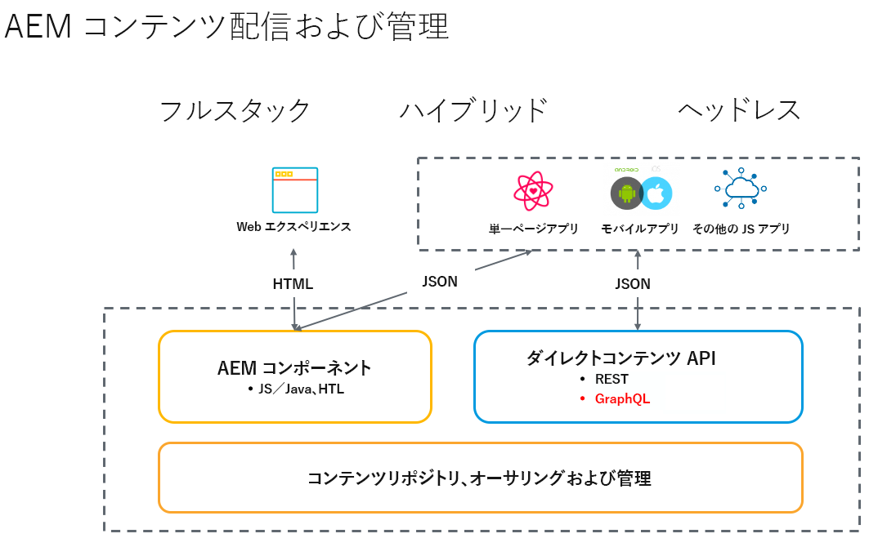

# AEM 6.5 Sites 向けヘッドレス開発 {#headless-development}

コンテンツモデル、コンテンツフラグメント、GraphQL API などAEM 6.5 の強力なヘッドレス機能を連携させて、エクスペリエンスを一元管理し、複数のチャネルで提供する方法を説明します。

## 概要 {#overview}

ヘッドレス実装は、オーディエンスの場所やチャネルに関係なく、オーディエンスにエクスペリエンスを提供する上で、ますます重要になってきています。

ヘッドレス実装は、フルスタックおよびハイブリッドソリューションにおける従来のようなページおよびコンポーネント管理ではなく、チャネルに依存しない再利用可能なコンテンツフラグメントの作成とそのクロスチャネル配信に重点を置いています。これは、Web エクスペリエンスを実装するための最新の動的な開発パターンです。

## ヘッドフルとヘッドレスの比較 {#headful-headless}

このドキュメントでは、AEM の完全なヘッドレス実装モデルを重点的に説明します。ただし、AEM でヘッドフルとヘッドレスは二者択一である必要はありません。ヘッドレス機能を使用すると、コンテンツを管理し様々なエンドポイントに配信できると同時に、コンテンツ作成者が単一ページアプリケーションを編集できるようになります。すべてが AEM にあります。

<!--
>[!TIP]
>
>See the document [Headful and Headless in AEM](/help/implementing/developing/headful-headless.md) for more information.
-->

## AEM 6.5 およびヘッドレス {#aem-headless}

AEM 6.5 は、次の 3 つの強力なサービスを提供することで、ヘッドレス実装モデルの柔軟なツールです。

1. コンテンツモデル
   * コンテンツモデルはコンテンツの構造化表現です。
   * これらは、情報アーキテクトが AEM コンテンツフラグメントモデルエディターで定義します。
   * コンテンツモデルはコンテンツフラグメントの基盤となります。
1. コンテンツフラグメント
   * コンテンツフラグメントは、コンテンツモデルをインスタンス化したものです。
   * これらは、コンテンツ作成者が AEM コンテンツフラグメントエディターで作成します。
   * 作成後は AEM Assets に保存され、AEM Assets 管理 UI で管理されます。
1. 配信用のコンテンツ API
   * AEM GraphQL API では、コンテンツフラグメント配信をサポートしています。
   * AEM Assets REST API では、コンテンツフラグメントの CRUD 操作をサポートしています。
   * [コンテンツフラグメントコアコンポーネントの JSON エクスポート](https://experienceleague.adobe.com/docs/experience-manager-core-components/using/components/content-fragment-component.html?lang=ja)を使用すると、直接コンテンツ配信も可能です。

## AEM ヘッドレスを使用した最初の手順 {#first-steps}

AEM ヘッドレス機能を使い始めるためのリソースは多数用意されています。ユースケースはそれぞれ異なりますが、いずれも AEM ヘッドレス機能の概要を明確に説明ｓしています。

| リソース | 説明 | タイプ | 対象者 | 予測時刻 |
|---|---|---|---|---|
| [AEM ヘッドレスをはじめる前に：実践チュートリアル](https://experienceleague.adobe.com/docs/experience-manager-learn/getting-started-with-aem-headless/graphql/multi-step/overview.html?lang=ja) | **実践的なアプローチを好み、AEMに精通している場合**&#x200B;このチュートリアルでは、シンプルなヘッドレスプロジェクトの作成に直接取り組みます。 | チュートリアル | デベロッパー向け | 2 時間 |

<!--
|Resource|Description|Type|Audience|Est. Time|
|---|---|---|---|---|
|[Headless Developer Journey](/help/journey-headless/developer/overview.md)|**For users new to AEM and headless** technologies, start here for a comprehensive introduction to AEM and its headless features from the theory of headless through going live with your first headless project.|Guide|Developers **new to AEM and headless**|1 hour|
|[Headless Getting Started Guide](/help/implementing/developing/headless/getting-started/introduction.md)|**For experienced AEM users** who need a short summary of the key AEM headless features, check out this quick start overview.|Quick Start|Developers, Administrators **with AEM experience**|20 minutes|
|[Getting Started with AEM Headless hands-on tutorial](https://experienceleague.adobe.com/docs/experience-manager-learn/getting-started-with-aem-headless/graphql/multi-step/overview.html)|**If you prefer a hands-on approach and are familiar with AEM**, this tutorial dives directly into creating a simple headless project.|Tutorial|Developers|2 hours|
-->
