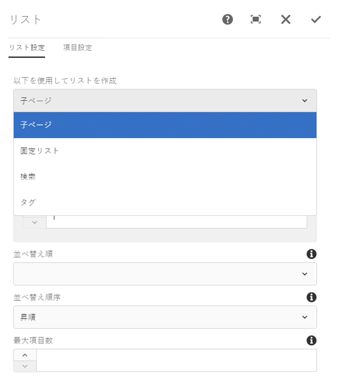
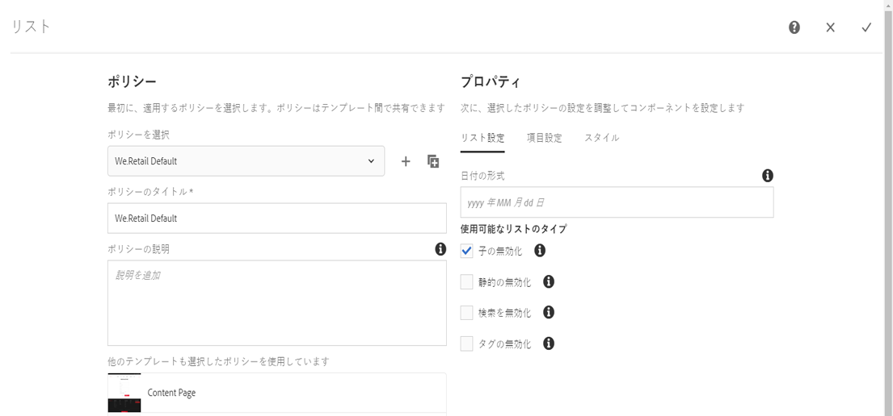
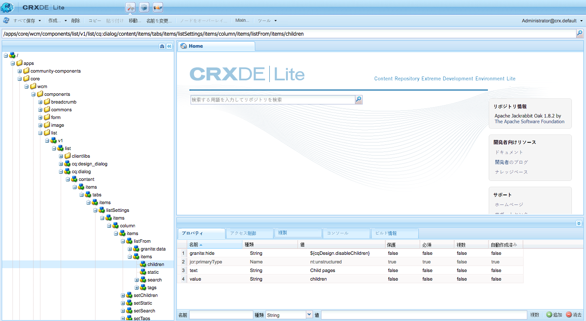
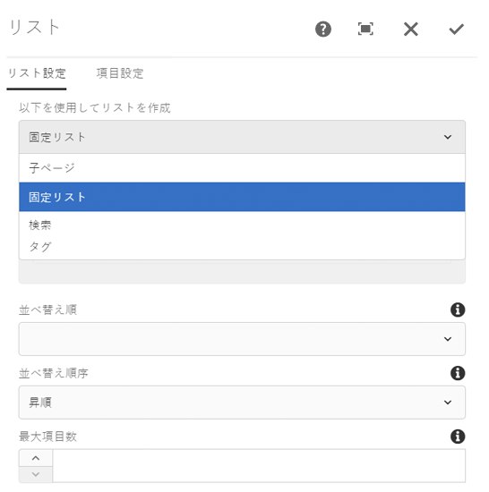

# 非表示の条件の使用{#using-hide-conditions}

非表示の条件を使用して、コンポーネントリソースをレンダリングするかどうかを決定できます。その一例として、テンプレート作成者が[テンプレートエディター](/help/sites-authoring/templates.md)でコアコンポーネントの[リストコンポーネント](https://helpx.adobe.com/experience-manager/core-components/using/list.html)を設定し、子ページに基づいてリストを作成するオプションを無効にすることを決定する場合があります。デザインダイアログでこのオプションを無効にすると、リストコンポーネントのレンダリング時に非表示の条件が評価され、子ページを表示するオプションが表示されないようにプロパティが設定されます。

## 概要 {#overview}

オプションのごく一部しか使用しないユーザーにとって、多数のオプションが表示されたダイアログは非常に複雑になります。これにより、ユーザーは、ユーザーインターフェイスエクスペリエンスに困惑する場合があります。

管理者、開発者およびスーパーユーザーは、非表示の条件を使用することで、一連のルールに基づいてリソースを非表示にできます。この機能を使用すると、作成者がコンテンツを編集する際に表示されるリソースを決定できます。

>[!NOTE]
>
>式に基づいたリソースの非表示は、ACL アクセス権限の代わりにはなりません。コンテンツは編集可能なまま、表示されなくなるだけです。

## 実装と使用の詳細 {#implementation-and-usage-details}

`com.adobe.granite.ui.components.FilteringResourceWrapper` は、フィルタ対象のフィールド上にあるプロパティの存在と値に基づいてリソースをフィルタリングします。 `granite:hide` の実装には、 `/libs/cq/gui/components/authoring/dialog/dialog.jsp` `FilteringResourceWrapper.`

The implementation makes use of the Granite [ELResolver API](https://helpx.adobe.com/experience-manager/6-5/sites/developing/using/reference-materials/granite-ui/api/jcr_root/libs/granite/ui/docs/server/el.html) and adds a `cqDesign` custom variable via the ExpressionCustomizer.

以下に、`etc/design` の下かコンテンツポリシーとして配置されているデザインノードの非表示の条件の例をいくつか示します。

```
${cqDesign.myProperty}
${!cqDesign.myProperty}
${cqDesign.myProperty == 'someText'}
${cqDesign.myProperty != 'someText'}
${cqDesign.myProperty == true}
${cqDesign.myProperty == true}
${cqDesign.property1 == 'someText' && cqDesign.property2 || cqDesign.property3 != 1 || header.myHeader}
```

非表示式を定義する際は、以下の点に留意してください。

* 式を有効にするには、プロパティの検索範囲を表します（例：`cqDesign.myProperty`）。
* 値は読み取り専用です。
* 関数（必要な場合）は、サービスによって提供される所定の関数に限られます。

## 例 {#example}

非表示の条件の例は、AEM 全体（特に、[コアコンポーネント](https://docs.adobe.com/content/help/ja-JP/experience-manager-core-components/using/introduction.html)）で確認できます。例えば、[リストコアコンポーネント](https://helpx.adobe.com/experience-manager/core-components/using/list.html)について検討してみましょう。

[テンプレート作成者は、テンプレートエディターを使用して](/help/sites-authoring/templates.md)、デザインダイアログで、ページ作成者が使用できるリストコンポーネントのオプションを定義できます。 リストを静的リスト、子ページのリスト、タグ付けされたページのリストなどにできるようにするかどうかといったオプションを有効または無効にできます。

テンプレート作成者が子ページオプションを無効にすると、デザインプロパティが設定され、非表示の条件がそのプロパティに対して評価されます。その結果、このオプションはページ作成者には表示されません。

1. デフォルトでは、ページ作成者は、リストコアコンポーネントでオプション「**子ページ**」を選択して、子ページを使用したリストを作成できます。

   

1. テンプレート作成者は、リストコアコンポーネントのデザインダイアログでオプション「**子を無効にする**」を選択して、子ページに基づいたリストを生成するオプションがページ作成者に対して表示されないようにできます。

   

1. ポリシーノードが `/conf/we-retail/settings/wcm/policies/weretail/components/content/lis`tの下に作成され、プロパティがに `disableChildren` 設定され `true`ます。
1. The hide condition is defined as the value of a `granite:hid`e property on the dialog property node `/conf/we-retail/settings/wcm/policies/weretail/components/content/list`

   

1. The value of `disableChildren` is pulled from the design configuration and the expression `${cdDesign.disableChildren}` evaluates to `false`, meaning the option will not be rendered as part of the component.

   `granite:hide` プロパティの値として非表示式を使用している例は、[GitHub のこちらのページ](https://github.com/Adobe-Marketing-Cloud/aem-core-wcm-components/blob/master/content/src/content/jcr_root/apps/core/wcm/components/list/v1/list/_cq_dialog/.content.xml#L40)で確認できます。

1. ページ作成者がリストコンポーネントを使用するときに、オプション「**子ページ**」が表示されなくなりました。

   

