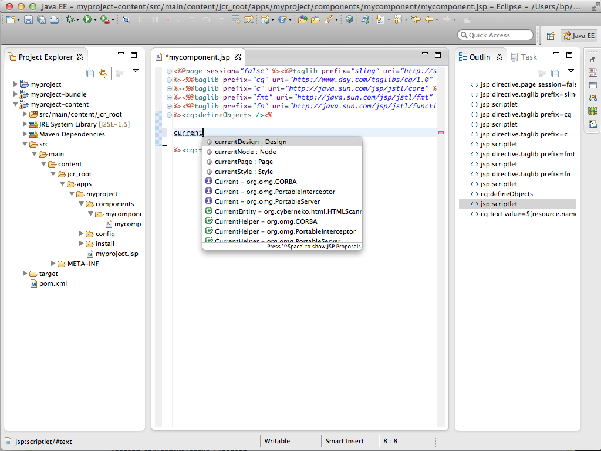

# Eclipse を使用して AEM プロジェクトを開発する方法{#how-to-develop-aem-projects-using-eclipse}

このガイドでは、Eclipse を使用して AEM ベースのプロジェクトを開発する方法について説明します。

>[!NOTE]
>
>アドビでは、Eclipse による AEM ソリューションの開発を支援する [AEM Developer Tools for Eclipse](/help/sites-developing/aem-eclipse.md) を提供しています。

## 概要 {#overview}

Eclipse で AEM の開発を開始するには、次の手順を実行する必要があります。

各手順の詳細については、このページで後述します。

* Eclipse 4.3（Kepler）のインストール
* Maven に基づく AEM プロジェクトの設定
* Maven POM での Eclipse 用の JSP サポートの準備
* Eclipse への Maven プロジェクトの読み込み

>[!NOTE]
>
>このガイドは Eclipse 4.3（Kepler）と AEM 5.6.1 を基に作成されています。

## Eclipse のインストール  {#install-eclipse}

[Eclipse のダウンロードページ](https://www.eclipse.org/downloads/)から「Eclipse IDE for Java EE Developers」をダウンロードします。

[インストール手順](https://wiki.eclipse.org/Eclipse/Installation)に従って Eclipse をインストールします。

## Maven に基づく AEM プロジェクトの設定  {#set-up-your-aem-project-based-on-maven}

次に、[Apache Mavenを使用したAEMプロジェクトの構築方法](/help/sites-developing/ht-projects-maven.md)の説明に従って、Mavenを使用してプロジェクトを設定します。

## Eclipse 用の JSP サポートの準備 {#prepare-jsp-support-for-eclipse}

Eclipse では JSP との連携もサポートされます。サポートされる項目の例を次に示します。

* タグライブラリのオートコンプリート
* &lt;cq:defineObjects /> と &lt;sling:defineObjects /> で定義されたオブジェクトの Eclipse での認識

サポートを有効にするには、次の手順を実行します。

1. [How-To Build AEM Projects using Apache Maven](/help/sites-developing/ht-projects-maven.md)の[How-To Work with JSPs](/help/sites-developing/ht-projects-maven.md#how-to-work-with-jsps)の説明に従ってください。
1. コンテンツモジュールの POM 内の &lt;build /> セクションに次の項目を追加します。

   Eclipse の Maven サポートプラグインである m2e は maven-jspc-plugin のサポートを提供しません。この設定は、プラグインおよび一時的なコンパイルの結果のクリーンアップの関連タスクを無視するように m2e に通知します。

   これは問題ではありません。[JSPとの使い方](/help/sites-developing/ht-projects-maven.md#how-to-work-with-jsps)で述べたように、この設定のmaven-jspc-pluginは、ビルドプロセスの一部としてコンパイルされたJSPを検証する目的でのみ使用されます。EclipseはJSP内の問題を既に報告しており、このMavenプラグインを使用して問題を報告していません。

   **myproject/content/pom.xml**

   ```xml
   <build>
     <!-- ... -->
     <pluginManagement>
       <plugins>
         <!--This plugin's configuration is used to store Eclipse m2e settings only. It has no influence on the Maven build itself.-->
         <plugin>
           <groupId>org.eclipse.m2e</groupId>
           <artifactId>lifecycle-mapping</artifactId>
           <version>1.0.0</version>
           <configuration>
             <lifecycleMappingMetadata>
               <pluginExecutions>
                 <pluginExecution>
                   <pluginExecutionFilter>
                     <groupId>org.apache.sling</groupId>
                     <artifactId>maven-jspc-plugin</artifactId>
                     <versionRange>[2.0.6,)</versionRange>
                     <goals>
                       <goal>jspc</goal>
                     </goals>
                   </pluginExecutionFilter>
                   <action>
                     <ignore/>
                   </action>
                 </pluginExecution>
                 <pluginExecution>
                   <pluginExecutionFilter>
                     <groupId>org.apache.maven.plugins</groupId>
                     <artifactId>maven-clean-plugin</artifactId>
                     <versionRange>[2.4.1,)</versionRange>
                     <goals>
                       <goal>clean</goal>
                     </goals>
                   </pluginExecutionFilter>
                   <action>
                     <ignore/>
                   </action>
                 </pluginExecution>
               </pluginExecutions>
             </lifecycleMappingMetadata>
           </configuration>
         </plugin>
       </plugins>
     </pluginManagement>
   </build>
   ```

### Eclipse への Maven プロジェクトの読み込み {#import-the-maven-project-into-eclipse}

1. Eclipse で、File／Import を選択します。
1. Import ダイアログで、Maven／Existing Maven Projects を選択し、「Next」をクリックします。

   

1. プロジェクトの最上位のフォルダーのパスを入力して、「Select All」、「Finish」の順にクリックします。

   

1. これで、Eclipse を使用して AEM プロジェクトを開発するための設定（JSP のオートコンプリートを含む）がすべて完了しました。

   

   >[!NOTE]
   >
   >`/libs`に`/libs/foundation/global.jsp`または他のJSPを含める場合は、Eclipseが含める処理を解決できるように、それをプロジェクトにコピーする必要があります。 同時に、Mavenによってコンテンツパッケージにバンドルされていないことを確認する必要があります。 これを達成する方法は、[Apache Mavenを使用したAEMプロジェクトの構築方法](/help/sites-developing/ht-projects-maven.md)で説明されています。

