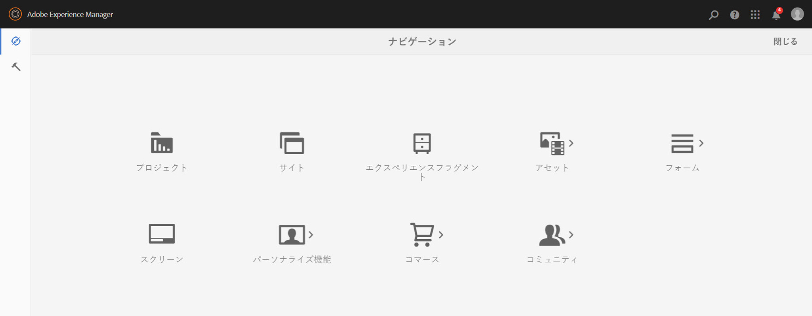
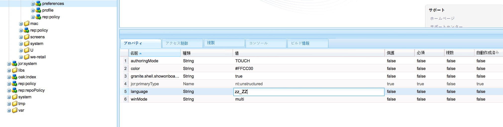

# UI 文字列の国際化  {#internationalizing-ui-strings}

Java および JavaScript API を使用することにより、以下のタイプのリソースで文字列を国際化することができます。

* Java ソースファイル。
* JSP スクリプト。
* クライアント側のライブラリまたはページソースの JavaScript。
* ダイアログおよびコンポーネントの設定プロパティで使用される JCR ノードのプロパティ値。

国際化とローカリゼーションのプロセスの概要について詳しくは、[コンポーネントの国際化](/help/sites-developing/i18n.md)を参照してください。

## Java および JSP コードでの文字列の国際化  {#internationalizing-strings-in-java-and-jsp-code}

`com.day.cq.i18n` Javaパッケージを使用すると、ローカライズされた文字列をUIに表示できます。 `I18n`クラスは、AEMディクショナリからローカライズされた文字列を取得する`get`メソッドを提供します。 `get` メソッドの必須パラメーターは、英語の文字列リテラルのみです。英語は UI のデフォルトの言語です。次に、`Search` という単語をローカライズする例を示します。

`i18n.get("Search");`

英語の文字列を識別する方法は、ID で文字列を識別し、実行時に ID を文字列の参照に使用する典型的な国際化フレームワークとは異なります。英語の文字列リテラルを使用すると、以下のような利点があります。

* コードがわかりやすい。
* デフォルトの言語の文字列を常に利用できる。

### ユーザーの言語の特定  {#determining-the-user-s-language}

ユーザーの使用言語は、2 とおりの方法で特定できます。

* 認証されたユーザーの場合、ユーザーアカウントの環境設定から言語を特定できます。
* 要求されたページのロケール。

ユーザーアカウントの言語プロパティの方が信頼性が高いので、こちらを使用することをお勧めします。ただし、この方法を使用する場合、ユーザーはログインする必要があります。

#### I18n Java オブジェクトの作成  {#creating-the-i-n-java-object}

I18n クラスには、2 つのコンストラクターが用意されています。使用するコンストラクターは、ユーザーの使用言語を特定する方法に応じて決まります。

ユーザーアカウントで指定された言語で文字列を表示するには、`com.day.cq.i18n.I18n)` の読み込み後に次のコンストラクターを使用します。

```java
I18n i18n = new I18n(slingRequest);
```

このコンストラクターは、`SlingHTTPRequest` を使用して、ユーザーの言語設定を取得します。

ページのロケールを使用して言語を特定するには、まず、要求されたページの言語の ResourceBundle を取得する必要があります。

```java
Locale pageLang = currentPage.getLanguage(false);
ResourceBundle resourceBundle = slingRequest.getResourceBundle(pageLang);
I18n i18n = new I18n(resourceBundle);
```

#### 文字列の国際化  {#internationalizing-a-string}

文字列を国際化するには、`I18n`オブジェクトの`get`メソッドを使用します。 `get` メソッドの必須パラメーターは、国際化する文字列のみです。文字列は、トランスレーターの辞書の文字列と対応します。get メソッドは、辞書内の文字列を調べ、現在使用されている言語の翻訳を返します。

`get` メソッドの最初の引数は、次の規則に従ったものである必要があります。

* 値は文字列リテラルである必要があります。`String` タイプの変数は使用できません。
* 文字列リテラルは 1 行で表す必要があります。
* 文字列では大文字と小文字が区別されます。

```xml
i18n.get("Enter a search keyword");
```

#### 翻訳のヒントの使用  {#using-translation-hints}

辞書内で重複する文字列を識別できるようにするために、国際化される文字列の[翻訳のヒント](/help/sites-developing/i18n-translator.md#adding-changing-and-removing-strings)を指定します。変換ヒントを提供するには、`get`メソッドの2番目のオプションのパラメーターを使用します。 翻訳のヒントは、辞書の項目のコメントプロパティと正確に一致させる必要があります。

例えば、文字列 `Request` が動詞と名詞としてそれぞれ 1 回ずつ、計 2 回辞書に記載されているとします。次のコードでは、`get` メソッドの引数として翻訳のヒントが記述されています。

```java
i18n.get("Request","A noun, as in a request for a web page");
```

#### ローカライズされるセンテンスへの変数の追加 {#including-variables-in-localized-sentences}

ローカライズされる文字列に変数を追加し、センテンスに文脈に応じた意味を持たせます。例えば、Web アプリケーションにログインした後、ホームページに「Welcome back Administrator.  You have 2 messages in your inbox.」ページのコンテキストに応じて、ユーザー名とメッセージ数が決定されます。

[辞書内では](/help/sites-developing/i18n-translator.md#adding-changing-and-removing-strings)、変数は括弧で囲まれたインデックスとして文字列に表示されます。変数の値を`get`メソッドの引数として指定します。 引数は翻訳のヒントの次に置かれ、インデックスは引数の順番と一致します。

```xml
i18n.get("Welcome back {0}. You have {1} messages.", "user name, number of messages", user.getDisplayName(), numItems);
```

国際化された文字列および翻訳のヒントは、辞書内の文字列およびコメントと正確に一致する必要があります。2 つ目の引数に `null` 値を指定することで、翻訳のヒントを省略できます。

#### 静的 get メソッドの使用 {#using-the-static-get-method}

`I18N` クラスには、少数の文字列をローカライズする必要がある場合に役立つ静的 `get` メソッドが定義されています。この静的メソッドには、ユーザーの使用言語を特定する方法に応じて、オブジェクトの `get` メソッドのパラメーターに加え、`SlingHttpRequest` オブジェクトまたは使用する `ResourceBundle` が必要です。

* ユーザーの言語の環境設定を使用する場合：SlingHttpRequest を第 1 パラメーターとして指定します。

   `I18n.get(slingHttpRequest, "Welcome back {}. You have {} messages.", "user name, number of messages", user.getDisplayName(), numItems);`
* ページの言語を使用する場合：ResourceBundle を第 1 パラメーターとして指定します。

   `I18n.get(resourceBundle,"Welcome back {}. You have {} messages.", "user name, number of messages", user.getDisplayName(), numItems);`

### Javascript コードでの文字列の国際化 {#internationalizing-strings-in-javascript-code}

Javascript API を利用して、クライアント側の文字列をローカライズできます。[JavaおよびJSP](#internationalizing-strings-in-java-and-jsp-code)コードと同様に、JavaScript APIを使用して、ローカライズする文字列を識別し、ローカライゼーションヒントを提供し、ローカライズする文字列に変数を含めることができます。

`granite.utils`[ クライアントライブラリフォルダー](/help/sites-developing/clientlibs.md)には、Javascript API が用意されています。この API を使用するには、ページにこのクライアントライブラリフォルダーを含めます。ローカライゼーション関数は`Granite.I18n`名前空間を使用します。

ローカライズされた文字列を表示する前に、`Granite.I18n.setLocale`関数を使用してロケールを設定する必要があります。 この関数には、引数としてロケールの言語コードが必要です。

```
Granite.I18n.setLocale("fr");
```

ローカライズされた文字列を表示するには、`Granite.I18n.get`関数を使用します。

```
Granite.I18n.get("string to localize");
```

次の例では、文字列「Welcome back」を国際化します。

```
Granite.I18n.setLocale("fr");
Granite.I18n.get("string to localize", [variables], "localization hint");
```

この関数のパラメーターは、Java I18n.get メソッドとは異なります。

* 最初のパラメーターは、ローカライズ対象の文字列リテラルです。
* 2 つ目のパラメーターは、文字列リテラルに挿入する値の配列です。
* 3 つ目のパラメーターは、翻訳のヒントです。

次の例では、JavaScript を使用して「Welcome back Administrator.  You have 2 messages in your inbox.」という文をローカライズします。

```
Granite.I18n.setLocale("fr");
Granite.I18n.get("Welcome back {0}. You have {1} new messages in your inbox.", [username, numMsg], "user name, number of messages");
```

### JCR ノードの文字列の国際化  {#internationalizing-strings-from-jcr-nodes}

UI 文字列は、ほとんどの場合、JCR ノードのプロパティに基づいています。例えば、ページの `jcr:title` プロパティは通常、ページコードの `h1` 要素のコンテンツとして使用されます。`I18n`クラスは、これらの文字列をローカライズする`getVar`メソッドを提供します。

次の例の JSP スクリプトは、リポジトリから `jcr:title` プロパティを取得し、ページにローカライズされた文字列を表示します。

```java
<% title = properties.get("jcr:title", String.class);%>
<h1><%=i18n.getVar(title) %></h1>
```

#### JCR ノードの翻訳のヒントの指定 {#specifying-translation-hints-for-jcr-nodes}

[Java API の翻訳のヒント](#using-translation-hints)と同様に、辞書内の重複する文字列を識別できるようにするために翻訳のヒントを指定できます。この翻訳のヒントは、国際化されるプロパティを含むノードのプロパティとして指定します。ヒントプロパティの名前は、`_commentI18n`サフィックスを持つ国際化プロパティ名の名前で構成されます。

`${prop}_commentI18n`

例えば、`cq:page` ノードにローカライズされる jcr:title プロパティが含まれるとします。ヒントは、jcr:title_commentI18n という名前のプロパティの値として指定されます。

### 国際化の実行範囲のテスト  {#testing-internationalization-coverage}

UI のすべての文字列が国際化されたかどうかをテストします。対象となった文字列を確認するには、ユーザー言語を zz_ZZ に設定し、Web ブラウザーで UI を開きます。国際化された文字列は、スタブ翻訳として次の形式で表示されます。

`USR_*Default-String*_尠`

次の画像は、AEM ホームページのスタブ翻訳です。



ユーザーの言語を設定するには、ユーザーアカウントの環境設定ノードで言語プロパティを設定します。

ユーザーの環境設定ノードのパスは次のようになります。

`/home/users/<letter>/<hash>/preferences`



