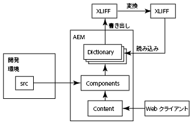
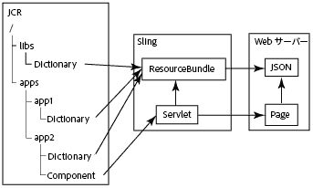

# コンポーネントの国際化{#internationalizing-components}

コンポーネントとダイアログを国際化して、UI 文字列を様々な言語で表示できるようにします。国際化を想定して設計されたコンポーネントでは、UI 文字列を外部化し、翻訳して、リポジトリに読み込むことができます。実行時に、ユーザーの言語の環境設定またはページのロケールによって、UI に表示される言語が決まります。

次のプロセスを使用して、コンポーネントを国際化し、様々な言語で UI を提供します。

1. [文字列を国際化するコードを使用してコンポーネントを実装します。](/help/sites-developing/i18n-dev.md)コードは翻訳対象の文字列を識別し、実行時に表示する言語を選択します。
1. [辞書を作成](/help/sites-developing/i18n-translator.md#creating-a-dictionary)し、翻訳する英語の文字列を[追加](/help/sites-developing/i18n-translator.md#adding-changing-and-removing-strings)します。

1. 辞書を XLIFF 形式に[書き出して](/help/sites-developing/i18n-translator.md#exporting-a-dictionary)文字列を翻訳し、その XLIFF ファイルを AEM に[読み込み](/help/sites-developing/i18n-translator.md#importing-a-dictionary)ます。また、辞書に[手動で翻訳を追加](/help/sites-developing/i18n-translator.md#editing-translated-strings)することもできます。

1. [辞書をアプリケーションのリリース管理プロセスに組み込みます](/help/sites-developing/i18n-translator.md#publishing-dictionaries)。

>[!NOTE]
>
>ここで説明するコンポーネントの国際化の方法は、静的文字列の翻訳を対象としています。コンポーネントの文字列が変化する可能性がある場合は、従来の翻訳ワークフローを使用する必要があります。例えば、作成者がコンポーネントの編集ダイアログ内のプロパティを使用して UI 文字列を編集できる場合は、文字列の国際化に言語の辞書を使用しないでください。

## 言語の辞書 {#language-dictionaries}

AEM 国際化フレームワークでは、リポジトリ内の辞書を使用して英語の文字列と他の言語での翻訳を格納します。このフレームワークは、デフォルトの言語として英語を使用します。文字列は英語版を使用して識別されます。国際化フレームワークは通常、UI 文字列に英数字の ID を使用します。ID として文字列の英語版を使用することには、いくつかの利点があります。

* コードが読みやすい。
* デフォルトの言語を常に利用できる。

ローカライズされた文字列は、リポジトリ内の複数の辞書に格納できます。AEM system dictionaries are located below the `/libs` node. You can create dictionaries for your components below the `/apps` node. AEM 国際化フレームワークは辞書を統合して、Sling 内で 1 つの `ResourceBundle` オブジェクトとして使用できるようにします。コンポーネントがレンダリングされると、翻訳された文字列がリソースバンドルから取得されます。統合された辞書も JSON 形式で Web サーバーにデプロイされ、 Web ページの Javascript コードに翻訳された文字列を提供します。

また、[トランスレーターツール](/help/sites-developing/i18n-translator.md)を使用すると、すべての辞書を 1 つの場所で一元的に管理できます。

>[!NOTE]
>
>Do not modify the AEM system dictionaries that are located below the `/libs` node.

### システム辞書内の文字列のオーバーレイ {#overlaying-strings-in-system-dictionaries}

Strings in dictionaries below the `/apps` node override duplicate strings in dictionaries that are below the `/libs` node. AEM システム辞書に含まれる文字列をコンポーネントが使用している場合、独自の辞書にその文字列が複製されます。すべてのコンポーネントは独自の辞書の文字列を使用します。

Note that you cannot predict which translation is used when strings are duplicated in dictionaries that are all located below the `/apps` node.
