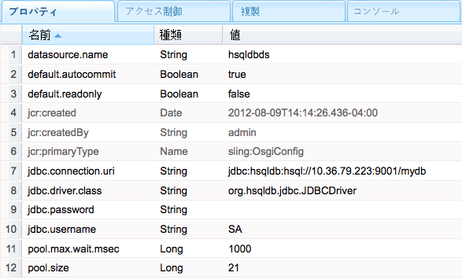

# SQL データベースへの接続{#connecting-to-sql-databases}

CQ アプリケーションがデータを操作できるように、外部 SQL データベースにアクセスします。

1. [JDBC ドライバーパッケージを書き出す OSGi バンドルを作成または取得します](#bundling-the-jdbc-database-driver).
1. [JDBC データソースプールプロバイダーの設定](#configuring-the-jdbc-connection-pool-service).
1. [データソースオブジェクトを取得し、コード内で接続を作成する](#connecting-to-the-database).

## JDBC データベースドライバのバンドル {#bundling-the-jdbc-database-driver}

一部のデータベースベンダー（[MySQL](https://dev.mysql.com/downloads/connector/j/) など）は、JDBC ドライバーを OSGi バンドル内で提供しています。お使いのデータベース用の JDBC ドライバーが OSGi バンドルとして提供されていない場合は、ドライバーの JAR を取得して、それを OSGi バンドル内にラップします。このバンドルは、データベースサーバーとのやり取りに必要なパッケージを書き出す必要があり、バンドルは参照先のパッケージも読み込む必要もあります。

次の例では、 [Maven 用 Bundle プラグイン](https://felix.apache.org/documentation/subprojects/apache-felix-maven-bundle-plugin-bnd.html) HSQLDB ドライバーを OSGi バンドルにラップします。 POM は、依存関係として識別された hsqldb.jar ファイルを埋め込むようプラグインに指示します。 すべての org.hsqldb パッケージがエクスポートされます。

プラグインは、読み込むパッケージを自動的に決定し、バンドルの MANIFEST.MF ファイルにリストします。 CQ サーバーで使用できないパッケージがある場合、インストール時にバンドルが起動しません。 次の 2 つの解決策が考えられます。

* POM で、パッケージがオプションであることを示します。 このソリューションは、JDBC 接続が実際にパッケージメンバーを必要としない場合に使用します。 次の例に示すように、 Import-Package 要素を使用してオプションのパッケージを指定します。

   `<Import-Package>org.jboss.*;resolution:=optional,*</Import-Package>`
* パッケージを含む JAR ファイルを、パッケージを書き出す OSGi バンドルにラップし、そのバンドルをデプロイします。 このソリューションは、コード実行中にパッケージメンバーが必要な場合に使用します。

ソースコードを知っていれば、どのソリューションを使用するかを決定できます。 また、いずれかのソリューションを試してテストを実行し、ソリューションを検証することもできます。

### hsqldb.jar をバンドルする POM {#pom-that-bundles-hsqldb-jar}

```xml
<project xmlns="https://maven.apache.org/POM/4.0.0"
  xmlns:xsi="https://www.w3.org/2001/XMLSchema-instance"
  xsi:schemaLocation="https://maven.apache.org/POM/4.0.0 https://maven.apache.org/xsd/maven-4.0.0.xsd">
  <modelVersion>4.0.0</modelVersion>

  <groupId>com.adobe.example.myapp</groupId>
  <artifactId>hsqldb-jdbc-driver-bundle</artifactId>
  <version>0.0.1-SNAPSHOT</version>
  <name>wrapper-bundle-hsqldb-driver</name>
  <url>www.adobe.com</url>
  <description>Exports the HSQL JDBC driver</description>
  <packaging>bundle</packaging>
  <properties>
    <project.build.sourceEncoding>UTF-8</project.build.sourceEncoding>
  </properties>
  <build>
    <plugins>
      <plugin>
        <groupId>org.apache.felix</groupId>
        <artifactId>maven-bundle-plugin</artifactId>
        <version>1.4.3</version>
        <extensions>true</extensions>
        <configuration>
         <instructions>
            <Embed-Dependency>*</Embed-Dependency>
            <_exportcontents>org.hsqldb.*</_exportcontents>
          </instructions>
        </configuration>
      </plugin>
    </plugins>
  </build>
  <dependencies>
    <dependency>
      <groupId>hsqldb</groupId>
      <artifactId>hsqldb</artifactId>
      <version>2.2.9</version>
    </dependency>
  </dependencies>
</project>
```

次のリンクは、一部の一般的なデータベース製品のダウンロードページを開きます。

* [Microsoft® SQL Server](https://www.microsoft.com/ja-jp/download/details.aspx?displaylang=ja&amp;id=11774)
* [Oracle](https://www.oracle.com/database/technologies/appdev/jdbc-downloads.html)
* [IBM® DB2®](https://www.ibm.com/support/pages/download-db2-fix-packs-version-db2-linux-unix-and-windows)

### JDBC 接続プールサービスの設定 {#configuring-the-jdbc-connection-pool-service}

JDBC ドライバーを使用してデータソースオブジェクトを作成する JDBC Connections Pool サービスの設定を追加します。アプリケーションコードではこのサービスを使用してデータソースオブジェクトを取得し、データベースに接続します。

JDBC 接続プール（`com.day.commons.datasource.jdbcpool.JdbcPoolService`）はファクトリサービスです。異なるプロパティ（読み取り専用アクセスと読み取り／書き込みアクセスなど）を使用する接続が必要な場合は、複数の設定を作成します。

CQ を操作する場合、このようなサービスの設定を管理する方法はいくつかあります。参照 [OSGi の設定](/help/sites-deploying/configuring-osgi.md) 詳細はこちら。

プールに入れられた接続サービスを設定するには、次のプロパティを使用できます。 プロパティ名は、Web コンソールに表示されるとおりに表示されます。 `sling:OsgiConfig` ノードに対応する名前を括弧内に示しています。エイリアスが `mydb` である HSQLDB サーバーおよびデータベースの値の例を示しています。

* JDBC ドライバークラス ( `jdbc.driver.class`):java.sql.Driver インターフェイスを実装するために使用する Java™クラス。例： `org.hsqldb.jdbc.JDBCDriver`. データタイプは `String` です。

* JDBC 接続 URI（`jdbc.connection.uri`）：接続の作成に使用するデータベースの URL。例：`jdbc:hsqldb:hsql//10.36.79.223:9001/mydb`。URL の形式は、java.sql.DriverManager クラスの getConnection メソッドで使用する場合に有効である必要があります。データタイプは `String` です。

* ユーザー名（`jdbc.username`）：データベースサーバーでの認証に使用するユーザー名。データタイプは `String` です。

* Password（`jdbc.password`）：ユーザーの認証に使用するパスワード。データタイプは `String` です。

* 検証クエリ（`jdbc.validation.query`）：接続が成功したことを検証するために使用する SQL 文（例：`select 1 from INFORMATION_SCHEMA.SYSTEM_USERS`）。データタイプは `String` です。

* デフォルトで読み取り専用（default.readonly）：この接続を読み取り専用アクセスにする場合に、このオプションを選択します。データタイプは `Boolean` です。
* デフォルトで自動コミット（`default.autocommit`）：データベースに送信される SQL コマンドごとに個別のトランザクションを作成し、各トランザクションを自動的にコミットする場合は、このオプションを選択します。コード内でトランザクションを明示的にコミットする場合は、このオプションを選択しないでください。データタイプは `Boolean` です。

* プールサイズ（`pool.size`）：データベースに対して使用可能にする同時接続の数です。データタイプは `Long` です。

* プール待機時間（`pool.max.wait.msec`）：接続リクエストがタイムアウトするまでの時間です。データタイプは `Long` です。

* データソース名（`datasource.name`）：このデータソースの名前です。データタイプは `String` です。

* 追加のサービスプロパティ（`datasource.svc.properties`）：接続 URL に追加する名前と値のペアのセットです。データタイプは `String[]` です。

JDBC 接続プールサービスはファクトリです。そのため、`sling:OsgiConfig` ノードを使用して接続サービスを設定する場合、ノード名には、ファクトリサービス PID に *`-alias`* が続く名前を含める必要があります。使用するエイリアスは、その PID のすべての設定ノードで一意である必要があります。 ノード名は、例えば `com.day.commons.datasource.jdbcpool.JdbcPoolService-myhsqldbpool` のような形式になります。



### データベースへの接続 {#connecting-to-the-database}

Java™コードで、DataSourcePool サービスを使用して `javax.sql.DataSource` オブジェクトを作成します。 DataSourcePool サービスには `getDataSource` メソッドがあり、このメソッドは指定したデータソース名の `DataSource` オブジェクトを返します。メソッド引数として、JDBC 接続プール設定で指定した データソース名（または `datasource.name`）プロパティの値を使用します。

次の JSP コードの例では、 hsqldbds データソースのインスタンスを取得し、単純な SQL クエリを実行し、返される結果の数を表示します。

#### データベースルックアップを実行する JSP {#jsp-that-performs-a-database-lookup}

```java
<%@include file="/libs/foundation/global.jsp"%><%
%><%@page session="false"%><%
%><%@ page import="com.day.commons.datasource.poolservice.DataSourcePool" %><%
%><%@ page import="javax.sql.DataSource" %><%
%><%@ page import="java.sql.Connection" %><%
%><%@ page import="java.sql.SQLException" %><%
%><%@ page import="java.sql.Statement" %><%
%><%@ page import="java.sql.ResultSet"%><%
%><html>
<cq:include script="head.jsp"/>
<body>
<%DataSourcePool dspService = sling.getService(DataSourcePool.class);
  try {
     DataSource ds = (DataSource) dspService.getDataSource("hsqldbds");
     if(ds != null) {
         %><p>Obtained the datasource!</p><%
         %><%final Connection connection = ds.getConnection();
          final Statement statement = connection.createStatement();
          final ResultSet resultSet = statement.executeQuery("SELECT * from INFORMATION_SCHEMA.SYSTEM_USERS");
          int r=0;
          while(resultSet.next()){
             r=r+1;
          }
          resultSet.close();
          %><p>Number of results: <%=r%></p><%
      }
   }catch (Exception e) {
        %><p>error! <%=e.getMessage()%></p><%
    }
%></body>
</html>
```

>[!NOTE]
>
>データソースが見つからず、getDataSource メソッドが例外をスローした場合は、Connections Pool サービスの設定が正しいことを確認してください。 プロパティ名、値、およびデータタイプを確認します。

<!-- Link below redirects to the "Get started with AEM Sites - WKND tutorial"
>[!NOTE]
>
>To learn how to inject a DataSourcePool into an OSGi bundle, see [Injecting a DataSourcePool Service into an Adobe Experience Manager OSGi bundle](https://helpx.adobe.com/experience-manager/using/datasourcepool.html). -->
