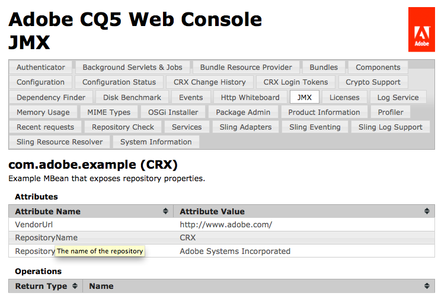

# JMX コンソールを使用したサービスの統合 {#integrating-services-with-the-jmx-console}

JMX コンソールを使用して MBean を作成し、デプロイしてサービスを管理します。 管理タスクを実行できるように、サービス属性と操作を公開します。

JMX コンソールの使用について詳しくは、 [JMX コンソールを使用したサーバーリソースの監視](/help/sites-administering/jmx-console.md).

## Felix と CQ5 の JMX フレームワーク {#the-jmx-framework-in-felix-and-cq}

Apache Felix プラットフォームで、MBean を OSGi サービスとしてデプロイします。 MBean サービスを OSGi サービスレジストリに登録すると、Aries JMX Whiteboard モジュールがその MBean を自動的に MBean サーバーに登録します。これにより、公開属性および操作を公開する JMX コンソールに MBean が表示されます。


## CQ5 および CRX 用の MBean の作成 {#creating-mbeans-for-cq-and-crx}

CQ5 または CRX リソースを管理するために作成する MBean は、javax.management.DynamicMBean インターフェイスに基づいています。 作成するには、JMX 仕様で概要を説明している通常のデザインパターンに従います。

* 属性を定義する get、set、is メソッド、および操作を定義する他のメソッドなど、管理インターフェイスを作成します。
* 実装クラスを作成します。 このクラスは、DynamicMBean を実装するか、DynamicMBean の実装クラスを拡張する必要があります。
* 標準の命名規則に従って、実装クラスの名前が MBean サフィックスを持つインターフェイス名になるようにします。

管理インターフェイスを定義するだけでなく、OSGi サービスインターフェイスも定義します。 実装クラスは OSGi サービスを実装します。

### 注釈を使用した MBean 情報の提供 {#using-annotations-to-provide-mbean-information}

The [com.adobe.granite.jmx.annotation](https://helpx.adobe.com/experience-manager/6-5/sites/developing/using/reference-materials/javadoc/com/adobe/granite/jmx/annotation/package-summary.html) パッケージには、MBean メタデータを JMX コンソールに簡単に提供するための注釈とクラスがいくつか用意されています。 MBean の MBeanInfo オブジェクトに情報を直接追加する代わりに、これらの注釈およびクラスを使用します。

**注釈**

MBean メタデータを指定するための注釈を管理インターフェイスに追加します。 この情報は、デプロイされる各実装クラスの JMX コンソールに表示されます。 以下の注釈を使用できます ( 詳しくは、 [com.adobe.granite.jmx.annotation JavaDocs](https://helpx.adobe.com/experience-manager/6-5/sites/developing/using/reference-materials/javadoc/com/adobe/granite/jmx/annotation/package-summary.html)):

* **説明：** MBean クラスまたはメソッドの説明を提供します。 クラス宣言で使用すると、MBean の JMX コンソールページに説明が表示されます。 メソッドで使用すると、対応する属性または操作のホバーテキストとして説明が表示されます。
* **Impact：**&#x200B;メソッドの影響。有効なパラメーター値は、[javax.management.MBeanOperationInfo](https://docs.oracle.com/javase/1.5.0/docs/api/javax/management/MBeanOperationInfo.html) によって定義されるフィールドです。

* **名前：** 操作パラメータに対して表示する名前を指定します。 この注釈を使用して、インターフェイスで使用されるメソッドパラメータの実際の名前を上書きします。
* **OpenTypeInfo:** JMX コンソールで複合データまたは表形式データを表すために使用するクラスを指定します。 オープン MBean で使用
* **TabularTypeInfo:** 表形式データを表すために使用するクラスに注釈を付けるために使用します。

**クラス**

インターフェイスに追加した注釈を使用する Dynamic MBean を作成するためのクラスが提供されます。

* **AnnotatedStandardMBean:** JMX コンソールに注釈メタデータを自動的に提供する javax.management.StandardMBean クラスのサブクラスです。
* **OpenAnnotatedStandardMBean：** AnnotatedStandardMBean クラスのサブクラスで、OpenTypeInfo 注釈を利用する Open Mbean を作成するためのものです。

### MBean の開発 {#developing-mbeans}

通常、MBean は、管理する OSGi サービスへの反映です。 Felix プラットフォームでは、他の Java サーバープラットフォームにデプロイする場合と同様に MBean を作成します。 主な違いは、注釈を使用して MBean 情報を指定できる点です。

* 管理インターフェイス：ゲッター、セッターおよび is メソッドを使用して属性を定義します。 他のいずれかの公開メソッドを使用して操作を定義します。注釈を使用して、BeanInfo オブジェクトのメタデータを入力します。
* MBean クラス：管理インターフェイスを実装します。 AnnotatedStandardMBean クラスを拡張して、インターフェイス上で注釈を処理するようにします。

次のサンプル MBean は、CRX リポジトリに関する情報を提供します。 このインターフェイスでは、Description 注釈を使用して JMX コンソールに情報を提供します。

#### 管理インターフェイス {#management-interface}

```java
package com.adobe.example.myapp;

import com.adobe.granite.jmx.annotation.Description;

@Description("Example MBean that exposes repository properties.")
public interface ExampleMBean {

    @Description("The name of the repository.")
    String getRepositoryName();

    @Description("The vendor of the repository.")
    String   getRepositoryVendor();

    @Description("The URL of repository vendor.")
    String getVendorUrl();
}
```

実装クラスは、SlingRepository サービスを使用して CRX リポジトリに関する情報を取得します。

#### MBean 実装クラス {#mbean-implementation-class}

```java
package com.adobe.example.myapp;

import org.apache.felix.scr.annotations.*;
import org.apache.sling.jcr.api.SlingRepository;

import com.adobe.granite.jmx.annotation.AnnotatedStandardMBean;

import javax.management.*;

public class ExampleMBeanImpl extends AnnotatedStandardMBean implements ExampleMBean {

    @Reference(cardinality = ReferenceCardinality.OPTIONAL_UNARY)
    private SlingRepository repository;

    public ExampleMBeanImpl() throws NotCompliantMBeanException {
        super(ExampleMBean.class);
    }

    public String getRepositoryName() {
        return repository.getDescriptor("jcr.repository.name");
    }

    public String getRepositoryVendor() {
        return repository.getDescriptor("jcr.repository.vendor");
    }

    public String getVendorUrl() {
        return repository.getDescriptor("jcr.repository.vendor.url");
    }
}
```

次の図は、JMX コンソールでのこの MBean のページを示しています。



### MBean の登録 {#registering-mbeans}

MBean を OSGi サービスとして登録すると、MBean サーバーに自動的に登録されます。 CQ5 に MBean をインストールするには、他の OSGi サービスと同様に、バンドルに MBean サービスを含めて MBean サービスを書き出します。

OSGi 関連のメタデータに加えて、Aries JMX Whiteboard モジュールが MBean を MBean サーバーに登録するために必要なメタデータも指定する必要があります。

* **DynamicMBean インターフェイス名：** MBean サービスが `javax.management.DynamicMBea`n インターフェイスを実装することを宣言します。この宣言によって、サービスが MBean サービスであることが Aries JMX Whiteboard モジュールに通知されます。

* **MBean ドメインおよびキーのプロパティ：** Felix 上で、この情報を MBean の OSGi サービスのプロパティとして提供します。これは、通常 `javax.management.ObjectName` オブジェクトの MBean サーバーに提供する情報と同じです。

MBean が単一のサービスの反射である場合は、MBean サービスの 1 つのインスタンスのみが必要です。 この場合、Felix SCR Maven プラグインを使用する場合、MBean 実装クラスで Apache Felix Service Component Runtime(SCR) 注釈を使用して、JMX 関連のメタデータを指定できます。 複数の MBean インスタンスをインスタンス化するには、MBean の OSGi サービスの登録を実行する別のクラスを作成できます。 この場合、JMX 関連のメタデータが実行時に生成されます。

**単一の MBean**

設計時にすべての属性と操作を定義できる MBean は、MBean 実装クラスの SCR 注釈を使用してデプロイできます。 次の例では、`Service` 注釈の `value` 属性によって、サービスが `DynamicMBean` インターフェイスを実装することを宣言しています。`Property` 注釈の `name` 属性は、JMX ドメインおよびキーのプロパティを指定します。

#### SCR 注釈付き MBean 実装クラス {#mbean-implementation-class-with-scr-annotations}

```java
package com.adobe.example.myapp;

import org.apache.felix.scr.annotations.*;
import org.apache.sling.jcr.api.SlingRepository;

import com.adobe.granite.jmx.annotation.AnnotatedStandardMBean;

import javax.management.*;

@Component(immediate = true)
@Property(name = "jmx.objectname", value="com.adobe.example:type=CRX")
@Service(value = DynamicMBean.class)
public class ExampleMBeanImpl extends AnnotatedStandardMBean implements ExampleMBean {

    @Reference(cardinality = ReferenceCardinality.OPTIONAL_UNARY)
    private SlingRepository repository;

    public ExampleMBeanImpl() throws NotCompliantMBeanException {
        super(ExampleMBean.class);
    }

    public String getRepositoryName() {
        return repository.getDescriptor("jcr.repository.name");
    }

    public String getRepositoryVendor() {
        return repository.getDescriptor("jcr.repository.vendor");
    }

    public String getVendorUrl() {
        return repository.getDescriptor("jcr.repository.vendor.url");
    }
}
```

**複数の MBean サービスインスタンス**

管理対象サービスの複数のインスタンスを管理するには、対応する MBean サービスの複数のインスタンスを作成します。 さらに、管理対象インスタンスの開始または終了時に、MBean サービスインスタンスを作成または削除する必要があります。MBean マネージャークラスを作成して、実行時に MBean サービスをインスタンス化し、サービスのライフサイクルを管理することができます。

BundleContext を使用して、MBean を OSGi サービスとして登録します。 BundleContext.registerService メソッドの引数として使用する Dictionary オブジェクトに、JMX 関連の情報を含めます。

次のコードの例では、ExampleMBean サービスがプログラムによって登録されています。 componentContext オブジェクトは ComponentContext で、BundleContext へのアクセスを提供します。

#### コードスニペット：プログラムを使用した MBean サービスの登録 {#code-snippet-programmatic-mbean-service-registration}

```java
Dictionary mbeanProps = new Hashtable();
mbeanProps.put("jmx.objectname", "com.adobe.example:type=CRX");
ExampleMBeanImpl mbean = new ExampleMBeanImpl();
ServiceRegistration serviceregistration =
            componentContext.getBundleContext().registerService(DynamicMBean.class.getName(), mbean, mbeanProps);
```

詳しくは、次の節の MBean の例を参照してください。

MBean サービスマネージャーは、サービス設定がリポジトリに格納される場合に役立ちます。 マネージャーは、サービス情報を取得し、それを使用して、対応する MBean を設定および作成できます。 manager クラスは、リポジトリの変更イベントをリッスンし、それに応じて MBean サービスを更新することもできます。

## 例：JMX を使用したワークフローモデルの監視 {#example-monitoring-workflow-models-using-jmx}

この例の MBean は、リポジトリに保存されている CQ5 ワークフローモデルに関する情報を提供します。 MBean マネージャークラスは、リポジトリに保存されるワークフローモデルに基づいて MBean を作成し、実行時に OSGi サービスを登録します。 この例は、次のメンバーが含まれる 1 つのバンドルで構成されています。

* WorkflowMBean：管理インターフェイス。
* WorkflowMBeanImpl: MBean 実装クラス。
* WorkflowMBeanManager: MBean マネージャークラスのインターフェイス。
* WorkflowMBeanManagerImpl: MBean マネージャーの実装クラス。

**注意：**&#x200B;わかりやすくするために、このサンプルのコードではログを実行したり、投げられた例外に対応したりはしていません。

WorkflowMBeanManagerImpl には、コンポーネントのアクティベーションメソッドが含まれています。 コンポーネントがアクティブになると、メソッドは次のタスクを実行します。

* バンドルの BundleContext を取得します。
* リポジトリに対してクエリを実行して、既存のワークフローモデルのパスを取得します。
* ワークフローモデルごとに MBean を作成します。
* MBean を OSGi サービスレジストリに登録します。

MBean メタデータは、JMX コンソールに com.adobe.example ドメイン、workflow_model タイプ、プロパティはワークフローモデル設定ノードのパスで表示されます。


### サンプル MBean {#the-example-mbean}

このサンプルには、MBean インターフェイスと、`com.day.cq.workflow.model.WorkflowModel` インターフェイスを表す実装が必要です。MBean は非常にシンプルなので、この例ではデザインの設定とデプロイメントの側面に焦点を当てることができます。 MBean は、1 つの属性（モデル名）を公開します。

#### WorkflowMBean インターフェイス {#workflowmbean-interface}

```java
package com.adobe.example.myapp.api;

import com.adobe.granite.jmx.annotation.Description;

@Description("Example MBean that exposes Workflow model properties.")
public interface WorkflowMBean {

 @Description("The name of the Workflow model.")
 String getModelName();
}
```

#### WorkflowMBeanImpl {#workflowmbeanimpl}

```java
package com.adobe.example.myapp.impl;

import javax.management.NotCompliantMBeanException;

import com.day.cq.workflow.model.WorkflowModel;
import com.adobe.example.myapp.api.WorkflowMBean;
import com.adobe.granite.jmx.annotation.AnnotatedStandardMBean;

public class WorkflowMBeanImpl extends AnnotatedStandardMBean implements WorkflowMBean {

 WorkflowModel model;

 protected WorkflowMBeanImpl(WorkflowModel inmodel)
   throws NotCompliantMBeanException {
  super(WorkflowMBean.class);
  model=inmodel;
 }

 public String getModelName() {
  return model.getTitle();
 }
}
```

### サンプルの MBean マネージャ {#the-example-mbean-manager}

WorkflowMBeanManager サービスには、WorkflowMBean サービスを作成するコンポーネントアクティベーションメソッドが含まれています。 このサービスの実装には、次のメソッドが含まれます。

* activate：コンポーネントアクティベーター。 WorkflowModel 設定ノードを読み取るための JCR セッションを作成します。 モデル設定が格納されるルートノードは、静的フィールドで定義されます。 設定ノードの名前も、静的フィールドで定義されます。 このメソッドは、ノードモデルパスを取得し、モデル WorkflowMBean を作成する他のメソッドを呼び出します。
* getModelIds：ルートノードの下のリポジトリを走査し、各モデルノードのパスを取得します。
* makeMBean：モデルパスを使用して WorkflowModel オブジェクトを作成し、その WorkflowMBean を作成して、その OSGi サービスを登録します。

>[!NOTE]
>
>WorkflowMBeanManager 実装は、コンポーネントがアクティベートされたときに存在するモデル設定用の MBean サービスのみを作成します。 より堅牢な実装では、新しいモデル設定に関するリポジトリイベント、および既存のモデル設定の変更や削除に関するリポジトリイベントをリッスンします。 変更が発生すると、マネージャーは対応する WorkflowMBean サービスを作成、変更または削除できます。
>

#### WorkflowMBeanManager インターフェイス {#workflowmbeanmanager-interface}

```java
package com.adobe.example.myapp.api;

public interface WorkflowMBeanManager {

}
```

#### WorkflowMBeanManagerImpl {#workflowmbeanmanagerimpl}

```java
package com.adobe.example.myapp.impl;

import java.util.*;

import org.apache.felix.scr.annotations.*;

import javax.jcr.Session;
import javax.jcr.Node;
import javax.jcr.NodeIterator;
import javax.jcr.RepositoryException;
import javax.management.ObjectName;

import org.apache.sling.jcr.api.SlingRepository;
import org.osgi.framework.ServiceRegistration;
import org.osgi.service.component.ComponentContext;

import org.slf4j.Logger;
import org.slf4j.LoggerFactory;

import com.day.cq.workflow.WorkflowService;
import com.day.cq.workflow.WorkflowSession;
import com.adobe.example.myapp.api.WorkflowMBean;
import com.adobe.example.myapp.api.WorkflowMBeanManager;

/**Instantiates and registers WorkflowMBean services */
@Component(immediate=true)
@Service(value=WorkflowMBeanManager.class)
public class WorkflowMBeanManagerImpl implements WorkflowMBeanManager {
 //The ComponentContext provides access to the BundleContext
 private ComponentContext componentContext;

 //Use the SlingRepository service to read model nodes
 @Reference
        private SlingRepository repository = null;

 //Use the WorkflowService service to create WorkflowModel objects
 @Reference
 private WorkflowService workflowservice = null;

  private Session session;

         //Details about model nodes
  private static final String MODEL_ROOT ="/etc/workflow/models";
  private static final String MODEL_NODE = "model";

  private Set<String> modelIds = new HashSet<String>();

        //Storage for ServiceRegistrations for MBean services
  private Collection<ServiceRegistration> mbeanRegistrations= new Vector<ServiceRegistration>(0,1);

 @Activate
        protected void activate(ComponentContext ctx) {
             //Traverse the repository and load the model nodes
             try {
                   session = repository.loginAdministrative(null);
                   // load and store model node paths
                   if (session.nodeExists(MODEL_ROOT)) {
                          getModelIds(session.getNode(MODEL_ROOT));
                   }
                   //Create MBeans for each model
                   for(String modid: modelIds){
                    makeMBean(modid);
                    }
             }catch(Exception e){ }
          }

        /**
         * Add JMX domain and key properties to a collection
         * Instantiate a WorkflowModel and its WorkflowMBeanImpl object
         * Register the MBean OSGi service
         */
 private void makeMBean(String modelId) {
             // create MBean for the model
             try {
                 Dictionary<String, String> mbeanProps = new Hashtable<String, String>();
                 //These properties appear on the JMX Console home page
                 mbeanProps.put("jmx.objectname", "com.adobe.example:type=workflow_model,id=" + ObjectName.quote(modelId));
                 WorkflowSession wfsession = workflowservice.getWorkflowSession(session);
                 WorkflowMBeanImpl mbean = new WorkflowMBeanImpl(wfsession.getModel(modelId));

                ServiceRegistration serviceregistration = componentContext.getBundleContext().registerService(WorkflowMBean.class.getName(), mbean, mbeanProps);
                //Store the ServiceRegistration objects for deactivation
                mbeanRegistrations.add(serviceregistration);
             } catch (Throwable t) {}
         }

        /**
         * Traverses the repository branch below a given Node. Stores the path of each model node.
         */
 private void getModelIds(Node node) throws RepositoryException {
  try{
                     NodeIterator iter = node.getNodes();
                     while (iter.hasNext()) {
                           Node n = iter.nextNode();
                           //Look for "jcr:content" nodes
                           if (n.getName().equals("jcr:content")) {
                                //get the path of the model node and save it
                                if(n.hasNode(MODEL_NODE)){
                                      modelIds.add(n.getNode(MODEL_NODE).getPath());
                                 }
                           } else{
                                   //Scan child nodes
                                   getModelIds(n);
                           }
                       }
  }catch(Exception e){ }
       }

        /**
         * Log out of the JCR session and unregister WorkflowMBean services
         */
        @Deactivate
        protected void deactivate() {
          session.logout();
          session=null;
          for(ServiceRegistration sr:mbeanRegistrations){
         sr.unregister();
          }
        }
}
```

### サンプル MBean の POM ファイル {#the-pom-file-for-the-example-mbean}

以下の XML コードをコピーしてプロジェクトの pom.xml ファイルに貼り付け、コンポーネントバンドルを作成できます。POM は、必要な複数のプラグインおよび依存関係を参照します。

**プラグイン:**

* Apache Maven Compiler Plugin：ソースコードから Java クラスをコンパイルします。
* Apache Felix Maven Bundle Plugin：バンドルとマニフェストを作成します。
* Apache Felix Maven SCR Plugin：コンポーネント記述子ファイルを作成し、service-component マニフェストヘッダーを設定します。

**注意：** 書き込み時には、maven scr プラグインは Eclipse 用 m2e プラグインと互換性がありません。 ( 詳しくは、 [Felix バグ 3170](https://issues.apache.org/jira/browse/FELIX-3170).) Eclipse IDE を使用するには、Maven をインストールし、コマンドラインインターフェイスを使用してビルドを実行します。

#### POM ファイルの例 {#example-pom-file}

```xml
<project xmlns="https://maven.apache.org/POM/4.0.0"
  xmlns:xsi="https://www.w3.org/2001/XMLSchema-instance"
  xsi:schemaLocation="https://maven.apache.org/POM/4.0.0 https://maven.apache.org/xsd/maven-4.0.0.xsd">
  <modelVersion>4.0.0</modelVersion>
  <groupId>com.adobe.example.myapp</groupId>
  <artifactId>workflow-mbean</artifactId>
  <version>0.0.2-SNAPSHOT</version>
  <name>mbean-simple</name>
  <url>www.adobe.com</url>
  <description>A simple MBean</description>
  <packaging>bundle</packaging>
    <properties>
        <project.build.sourceEncoding>UTF-8</project.build.sourceEncoding>
    </properties>
    <build>
        <plugins>
        <plugin>
            <groupId>org.apache.maven.plugins</groupId>
            <artifactId>maven-compiler-plugin</artifactId>
            <configuration>
                <source>1.5</source>
                <target>1.5</target>
            </configuration>
        </plugin>
            <plugin>
                <groupId>org.apache.felix</groupId>
                <artifactId>maven-scr-plugin</artifactId>
                <version>1.7.2</version>
                <executions>
                    <execution>
                        <id>generate-scr-scrdescriptor</id>
              <goals>
                 <goal>scr</goal>
              </goals>
            </execution>
         </executions>
            </plugin>
             <plugin>
            <groupId>org.apache.felix</groupId>
            <artifactId>maven-bundle-plugin</artifactId>
            <version>1.4.3</version>
            <extensions>true</extensions>
            <configuration>
                <instructions>
                    <Export-Package>com.adobe.example.myapp.*;version=${project.version}</Export-Package>
                </instructions>
            </configuration>
        </plugin>
        </plugins>
    </build>
    <dependencies>
        <dependency>
            <groupId>org.apache.felix</groupId>
            <artifactId>org.apache.felix.scr.annotations</artifactId>
            <version>1.6.0</version>
            <scope>provided</scope>
        </dependency>
         <dependency>
            <groupId>org.apache.sling</groupId>
            <artifactId>org.apache.sling.api</artifactId>
            <version>2.0.8</version>
            <scope>provided</scope>
        </dependency>
         <dependency>
            <groupId>org.apache.felix</groupId>
            <artifactId>org.apache.felix.scr</artifactId>
            <version>1.6.1-R1236132</version>
            <scope>provided</scope>
        </dependency>
        <dependency>
            <groupId>org.apache.sling</groupId>
            <artifactId>org.apache.sling.jcr.api</artifactId>
            <version>2.0.4</version>
        </dependency>
        <dependency>
            <groupId>com.adobe.granite</groupId>
            <artifactId>com.adobe.granite.jmx</artifactId>
            <version>0.1.6</version>
            <scope>provided</scope>
        </dependency>
        <dependency>
       <groupId>com.day.cq.wcm</groupId>
       <artifactId>cq-wcm-mobile-api</artifactId>
       <version>5.5.2</version>
       <scope>provided</scope>
      </dependency>
      <dependency>
       <groupId>com.day.cq.workflow</groupId>
       <artifactId>cq-workflow-api</artifactId>
       <version>5.5.0</version>
       <scope>provided</scope>
      </dependency>
      <dependency>
       <groupId>javax.jcr</groupId>
       <artifactId>jcr</artifactId>
       <version>2.0</version>
       <scope>provided</scope>
      </dependency>
      <dependency>
                <groupId>org.slf4j</groupId>
  <artifactId>slf4j-api</artifactId>
  <version>1.6.4</version>
  <scope>provided</scope>
 </dependency>
    </dependencies>
</project>
```

次のプロファイルを Maven 設定ファイルに追加して、パブリックAdobeリポジトリを使用します。

#### Maven プロファイル {#maven-profile}

```xml
<profile>
    <id>adobe-public</id>
    <activation>
         <activeByDefault>false</activeByDefault>
    </activation>
    <properties>
         <releaseRepository-Id>adobe-public-releases</releaseRepository-Id>
         <releaseRepository-Name>Adobe Public Releases</releaseRepository-Name>
         <releaseRepository-URL>https://repo1.maven.org/maven2/com/adobe/</releaseRepository-URL>
    </properties>
    <repositories>
         <repository>
             <id>adobe-public-releases</id>
             <name>Adobe  Public Repository</name>
             <url>https://repo1.maven.org/maven2/com/adobe/</url>
             <releases>
                 <enabled>true</enabled>
                 <updatePolicy>never</updatePolicy>
             </releases>
             <snapshots>
                 <enabled>false</enabled>
             </snapshots>
         </repository>
     </repositories>
     <pluginRepositories>
         <pluginRepository>
             <id>adobe-public-releases</id>
             <name>Adobe Public Repository</name>
             <url>https://repo1.maven.org/maven2/com/adobe/</url>
             <releases>
                 <enabled>true</enabled>
                 <updatePolicy>never</updatePolicy>
             </releases>
             <snapshots>
                 <enabled>false</enabled>
             </snapshots>
         </pluginRepository>
     </pluginRepositories>
</profile>
```
