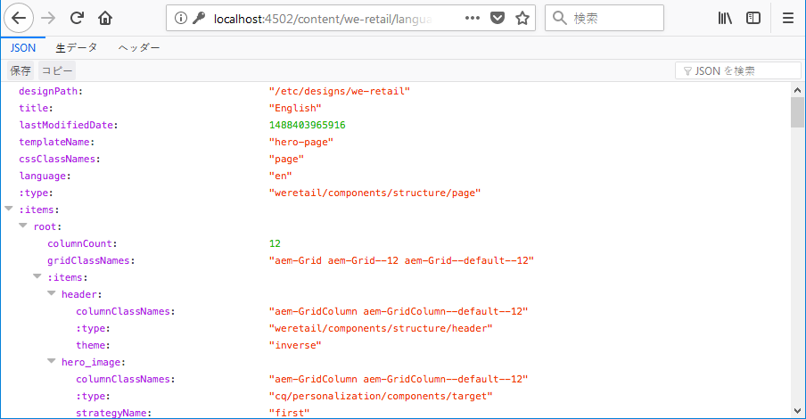
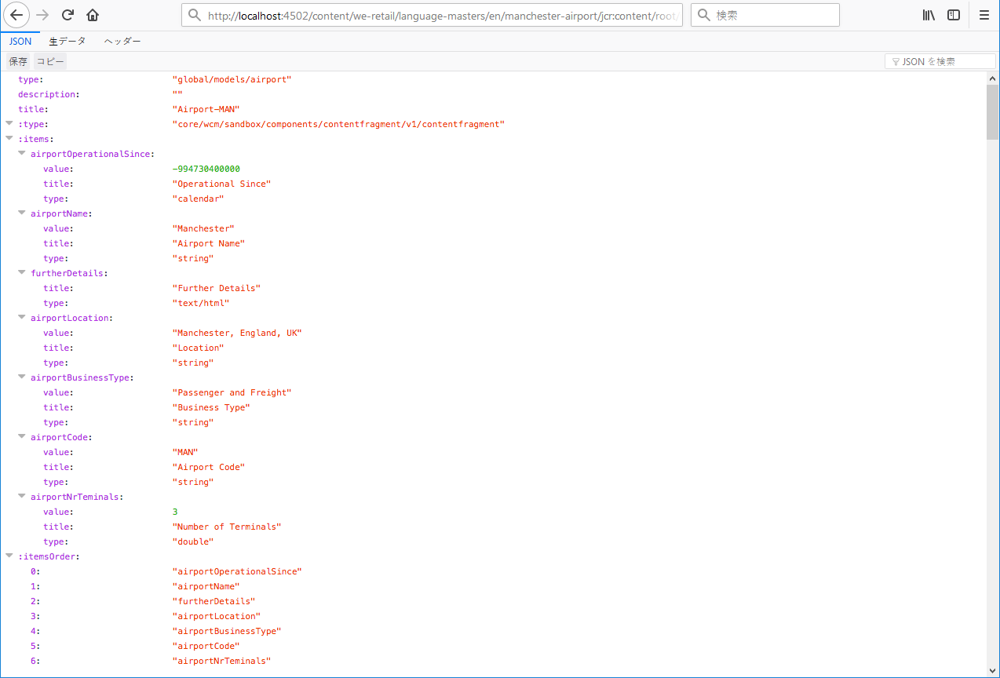

# コンテンツサービス用の JSON エクスポーター{#json-exporter-for-content-services}

AEM コンテンツサービスは、Web ページだけに焦点を置かずに AEM のコンテンツの記述と配信を一般化するように設計されています。

AEM コンテンツサービスにより、あらゆるクライアントで使用できる標準化された方法で、従来の AEM Web ページとは異なるチャネルにコンテンツを配信できます。そうしたチャネルの例を次に示します。

* [シングルページアプリケーション](spa-walkthrough.md)
* ネイティブモバイルアプリケーション
* AEM の外部の他のチャネルおよびタッチポイント

構造化コンテンツを使用するコンテンツフラグメントでは、JSONエクスポーターを使用してAEMページのコンテンツをJSONデータモデル形式で配信することで、コンテンツサービスを提供できます。 その後、コンテンツを独自のアプリケーションで使用することができます。

>[!NOTE]
>
>The functionality described here is available for all Core Components since [release 1.1.0 of the Core Components](https://docs.adobe.com/content/docs/en/core-components/v1.html).

## JSON エクスポーターとコンテンツフラグメントコアコンポーネント {#json-exporter-with-content-fragment-core-components}

AEM JSON エクスポーターを使用すると、任意の AEM ページのコンテンツを JSON データモデル形式で配信できます。その後、コンテンツを独自のアプリケーションで使用することができます。

AEM内では、セレクター `model` と拡張機能を使用して配信を行い `.json` ます。

`.model.json`

1. 例えば、次の URL では

   ```shell
   http://localhost:4502/content/we-retail/language-masters/en.model.json
   ```

1. 次のようなコンテンツが配信されます。

   

代わりに、構造化コンテンツフラグメントのコンテンツを、ターゲット設定して配信することもできます。

これをおこなうには、（`jcr:content` を介して）フラグメントへのパス全体を使用します。例えば、次のようなサフィックスを付けます。

`.../jcr:content/root/responsivegrid/contentfragment.model.json`

ページには、単一のコンテンツフラグメントまたはタイプが異なる複数のコンポーネントを含めることができます。また、リストコンポーネントなどのメカニズムを使用して、関連するコンテンツを自動的に検索することもできます。

* 例えば、次の URL では

   ```shell
   http://localhost:4502/content/we-retail/language-masters/en/manchester-airport/jcr:content/root/responsivegrid/contentfragment.model.json
   ```

* 次のようなコンテンツが配信されます。

   

   >[!NOTE]
   >
   >このデータにアクセスして使用するように[独自のコンポーネントを変更する](/help/sites-developing/json-exporter-components.md)ことができます。

   >[!NOTE]
   >
   >標準的な実装ではありませんが、 [複数のセレクターがサポートされます](json-exporter-components.md#multiple-selectors) が、最初 `model` にセレクターを指定する必要があります。

### その他の情報 {#further-information}

関連トピック：

* Assets HTTP API

   * [Assets HTTP API](/help/assets/mac-api-assets.md)

* Sling Model:

   * [Sling モデル - 130 以降のモデルクラスとリソースタイプの関連付け](https://sling.apache.org/documentation/bundles/models.html#associating-a-model-class-with-a-resource-type-since-130)

* AEM と JSON：

   * [JSON 形式のページ情報の取得](/help/sites-developing/pageinfo.md)

## 関連ドキュメント {#related-documentation}

詳しくは、以下を参照してください。

* [Assets ユーザーガイドのコンテンツフラグメントに関するトピック](https://helpx.adobe.com/experience-manager/6-4/assets/user-guide.html?topic=/experience-manager/6-4/assets/morehelp/content-fragments.ug.js)

* [コンテンツフラグメントモデル](/help/assets/content-fragments/content-fragments-models.md)
* [コンテンツフラグメントを使用したオーサリング](/help/sites-authoring/content-fragments.md)
* [コンポーネントの JSON 書き出しの有効化](/help/sites-developing/json-exporter-components.md)

* [コアコンポーネント](https://docs.adobe.com/content/help/ja-JP/experience-manager-core-components/using/introduction.html)および[コンテンツフラグメントコンポーネント](https://helpx.adobe.com/experience-manager/core-components/using/content-fragment-component.html)

