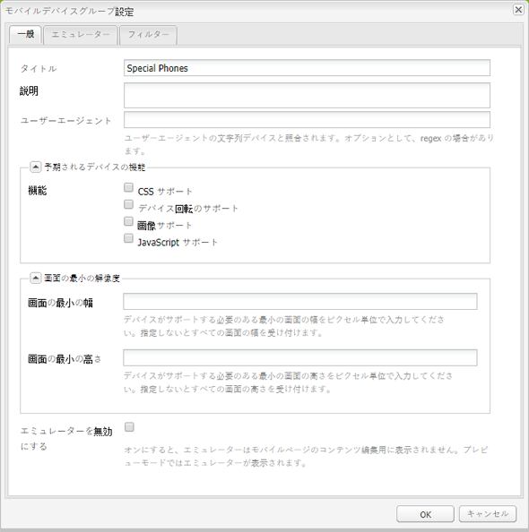

# モバイルデバイス用サイトの作成{#creating-sites-for-mobile-devices}

>[!NOTE]
>
>単一ページアプリケーションフレームワークを基にしたクライアント側レンダリング（React など）が必要なプロジェクトでは、SPA エディターを使用することをお勧めします。[詳細情報](/help/sites-developing/spa-overview.md)を参照してください。

モバイルサイトの作成は標準サイトの作成と同様ですが、この処理にはテンプレートとコンポーネントの作成も含まれます。テンプレートとコンポーネントの作成について詳しくは、[テンプレート](/help/sites-developing/templates.md)、[コンポーネント](/help/sites-developing/components.md)および [AEM Sites の開発の手引き](/help/sites-developing/getting-started.md)を参照してください。主な違いは、サイト内での AEM の組み込みのモバイル機能の有効化です。そのためには、モバイルページコンポーネントを使用するテンプレートを作成します。

また、[レスポンシブデザイン](/help/sites-developing/responsive.md)を使用して、複数の画面サイズに対応する単一のサイトを作成することも検討してください。

作業を開始する際は、AEM で使用可能な **We.Retail モバイルデモサイト**&#x200B;を確認できます。

モバイルサイトを作成するには、次の手順を実行します。

1. ページコンポーネントを作成します。

   * Set the `sling:resourceSuperType` property to `wcm/mobile/components/page`
This way the component relies on the mobile page component.

   * プロジェクトに特有のロジックを使用して `body.jsp` を作成します。

1. ページテンプレートを作成します。

   * Set the `sling:resourceType` property to the newly created page component.
   * Set the `allowedPaths` property.

1. サイト用のデザインページを作成します。
1. Create the site root page below the `/content` node:

   * Set the `cq:allowedTemplates` property.
   * Set the `cq:designPath` property.

1. サイトのルートページのページプロパティの「**モバイル**」タブで、デバイスグループを設定します。
1. 新しいテンプレートを使用してサイトページを作成します。

モバイルページコンポーネント( `/libs/wcm/mobile/components/page`):

* ページプロパティダイアログに「**モバイル**」タブを追加します。
* Through its `head.jsp`, it retrieves the current mobile device group from the request and if a device group is found, uses the group&#39;s `drawHead()` method to include the device group&#39;s associated emulator init component (only in author mode) and the device group&#39;s rendering CSS.

>[!NOTE]
>
>モバイルサイトのルートページはノード階層のレベル 1 に位置する必要があります。また、このページを /content ノードの下に配置することをお勧めします。

## マルチサイトマネージャーによるモバイルサイトの作成 {#creating-a-mobile-site-with-the-multi-site-manager}

Use Multi Site Manager (MSM) to create a mobile live copy from a standard site. The standard site is automatically transformed into a mobile site: the mobile site has all the features of the mobile sites (e.g. edition within an emulator) and can be managed in sync with the standard site. Refer to the section [Creating a Live Copy for different Channels](/help/sites-administering/msm.md) in the Multi Site Manager page.

## サーバー側のモバイル API {#server-side-mobile-api}

モバイルクラスを格納する Java パッケージを次に示します。

* [com.day.cq.wcm.mobile.api](https://helpx.adobe.com/experience-manager/6-5/sites/developing/using/reference-materials/javadoc/com/day/cq/wcm/mobile/api/device/capability/package-summary.html) - MobileConstantsを定義します。
* [com.day.cq.wcm.mobile.api.device](https://helpx.adobe.com/experience-manager/6-5/sites/developing/using/reference-materials/javadoc/com/day/cq/wcm/mobile/api/device/package-summary.html) - Device、DeviceGroupおよびDeviceGroupListを定義します。
* [com.day.cq.wcm.mobile.api.device.capability](https://helpx.adobe.com/experience-manager/6-5/sites/developing/using/reference-materials/javadoc/com/day/cq/wcm/mobile/api/device/capability/package-summary.html) - DeviceCapabilityを定義します。
* [com.day.cq.wcm.mobile.api.wurfl](https://helpx.adobe.com/experience-manager/6-5/sites/developing/using/reference-materials/javadoc/com/day/cq/wcm/workflow/api/package-summary.html) - WurflQueryEngineを定義します。
* [com.day.cq.wcm.mobile.core](https://helpx.adobe.com/experience-manager/6-5/sites/developing/using/reference-materials/javadoc/com/day/cq/wcm/mobile/core/package-summary.html) - WCM Mobileを中心に回転する様々なユーティリティメソッドを提供するMobileUtilを定義します。

### モバイルコンポーネント {#mobile-components}

The **We.Retail Mobile Demo Site** uses the following mobile components which are located below `/libs/foundation/components`:

<table>
 <tbody>
  <tr>
   <td>名前</td>
   <td>グループ</td>
   <td>特徴</td>
  </tr>
  <tr>
   <td>mobilefooter</td>
   <td>hidden</td>
   <td>- フッター</td>
  </tr>
  <tr>
   <td>mobileimage</td>
   <td>モバイル</td>
   <td>- image 基盤コンポーネントに基づく<br />
- 画像をレンダリングする（デバイスが対応している場合）<br /> </td>
  </tr>
  <tr>
   <td>mobilelist</td>
   <td>モバイル</td>
   <td>- list 基盤コンポーネントに基づく<br />
- listitem_teaser.jsp が画像をレンダリングする（デバイスが対応している場合）<br /> </td>
  </tr>
  <tr>
   <td>mobilelogo</td>
   <td>hidden</td>
   <td>- logo 基盤コンポーネントに基づく<br />
- 画像をレンダリングする（デバイスが対応している場合）<br /> </td>
  </tr>
  <tr>
   <td>mobilereference</td>
   <td>モバイル</td>
   <td><p> — 参照基礎コンポーネントと類似</p> <p>- textimage コンポーネントを mobiletextimage コンポーネントにマップし、image コンポーネントを mobileimage コンポーネントにマップする</p> </td>
  </tr>
  <tr>
   <td>mobiletextimage</td>
   <td>モバイル</td>
   <td>- textimage 基盤コンポーネントに基づく<br />
- 画像をレンダリングする（デバイスが対応している場合）</td>
  </tr>
  <tr>
   <td>mobiletopnav</td>
   <td>hidden</td>
   <td><p>- topnav foundationコンポーネントに基づく</p> <p>- テキストのみをレンダリングする</p> </td>
  </tr>
 </tbody>
</table>

#### モバイルコンポーネントの作成 {#creating-a-mobile-component}

AEM モバイルフレームワークを使用すると、要求を発行するデバイスを感知するコンポーネントを開発できます。以降の節のコード例は、コンポーネントの jsp で AEM モバイル API を使用する方法を示しています。具体的には、次に示す処理の方法を示します。

* リクエストからデバイスを取得する：
   `Device device = slingRequest.adaptTo(Device.class);`

* デバイスグループの取得：
   `DeviceGroup deviceGroup = device.getDeviceGroup();`

* デバイス・グループ機能の取得：
   `Collection<DeviceCapability> capabilities = deviceGroup.getCapabilities();`

* デバイス属性（WURFLデータベースから生の機能キー/値）を取得します。
   `Map<String,String> deviceAttributes = device.getAttributes();`

* デバイスのユーザーエージェントを取得します。
   `String userAgent = device.getUserAgent();`

* 現在のページから、デバイスグループリスト（作成者によってサイトに割り当てられたデバイスグループ）を取得します。
   `DeviceGroupList deviceGroupList = currentPage.adaptTo(DeviceGroupList.class);`

* デバイスグループが画像をサポートしているかどうかを確認します
   `if (deviceGroup.hasCapability(DeviceCapability.CAPABILITY_IMAGES)) {`
...
または

...   `if MobileUtil.hasCapability(request, DeviceCapability.CAPABILITY_IMAGES) {`
...

>[!NOTE]
>
>In a jsp, `slingRequest` is available through the `<sling:defineObjects>` tag and `currentPage` through the `<cq:defineObjects>` tag.

### エミュレーター {#emulators}

エミュレータベースのオーサリングは、モバイルクライアント向けのコンテンツページを作成する手段を作成者に提供します。モバイルコンテンツのオーサリングは、インプレースWYSIWYGの編集と同じ原則に従います。作成者がモバイルデバイス上でページの外観を認識できるように、モバイルコンテンツページはデバイスエミュレーターを使用して編集されます。

モバイルデバイスエミュレーターは汎用のエミュレーターフレームワークに基づいています。詳しくは、[エミュレーター](/help/sites-developing/emulators.md)を参照してください。

デバイスエミュレーターのページには、モバイルデバイスが表示されます。一方、通常の編集（parsys、コンポーネント）は、デバイスの画面内でおこなわれます。デバイスエミュレーターは、サイト用に設定されるデバイスグループに依存します。1 つのデバイスグループに複数のエミュレーターを割り当てることができます。これにより、すべてのエミュレーターをコンテンツページで使用できるようになります。デフォルトで表示されるのは、サイトに割り当てた最初のデバイスグループに割り当てられた最初のエミュレーターです。ページ上部にあるエミュレーターのカルーセルまたはサイドキックの編集ボタンを使用してエミュレーターを切り替えることができます。

**エミュレーターの作成**

エミュレーターを作成するには、汎用エミュレーターに関するページの[カスタムモバイルエミュレーターの作成](/help/sites-developing/emulators.md)を参照してください。

**モバイルエミュレーターの主な特徴**

* デバイス・グループは、次のいずれかのエミュレータで構成されます。デバイス・グループ構成ページ(例：/etc/mobile/groups/touch。ノードの下に `emulators` プロパティが含まれ `jcr:content` ます。
注意：同じエミュレータが複数のデバイスグループに属している可能性はありますが、あまり意味がありません。

* Via the device group&#39;s configuration dialog, the `emulators` property is set with the path of the desired emulator(s). 例：`/libs/wcm/mobile/components/emulators/iPhone4`

* エミュレータコンポーネント(例： `/libs/wcm/mobile/components/emulators/iPhone4`)拡張モバイルエミュレータコンポーネント( `/libs/wcm/mobile/components/emulators/base`)。

* 基本のモバイルエミュレーターを拡張する各コンポーネントは、デバイスグループの設定時に選択できます。これにより、カスタムエミュレーターを簡単に作成または拡張できます。
* 編集モードでの要求時には、エミュレーターの実装を使用してページをレンダリングします。
* ページのテンプレートでモバイルページコンポーネントを使用する場合は、エミュレーターの機能が（モバイルページコンポーネントの `head.jsp` を使用して）自動的にページに統合されます。

### Device Groups {#device-groups}

モバイルデバイスグループを使用すると、デバイスの機能に基づくモバイルデバイスのセグメント化が可能になります。デバイスグループは、オーサーインスタンスでのエミュレーターベースのオーサリングおよびパブリッシュインスタンスに適したコンテンツのレンダリングに必要な情報を提供します。作成者がモバイルページにコンテンツを追加して公開すると、そのページをパブリッシュインスタンスで要求できます。その場合、エミュレーターの編集ビューではなく、設定済みのいずれかのデバイスグループを使用してコンテンツページがレンダリングされます。デバイスグループの選択は[モバイルデバイスの検出](#devicedetection)に基づいておこなわれます。一致するデバイスグループが必要なスタイル設定情報を提供します。

Device groups are defined as content pages below `/etc/mobile/devices` and use the **Mobile Device Group** template. デバイスグループテンプレートは、コンテンツページのフォームでデバイスグループ定義用の設定テンプレートとして機能します。このダイアログの主な特徴を次に示します。

* 場所: `/libs/wcm/mobile/templates/devicegroup`
* 許可されているパス： `/etc/mobile/groups/*`
* ページコンポーネント: `wcm/mobile/components/devicegroup`

#### サイトへのデバイスグループの割り当て {#assigning-device-groups-to-your-site}

モバイルサイトを作成する場合は、デバイスグループをサイトに割り当てる必要があります。AEM には、デバイスの HTML および JavaScript のレンダリング機能に対応した 3 つのデバイスグループが用意されています。

* **フィーチャー**&#x200B;フォン：Sony Ericsson W800 などのフィーチャーデバイス用。基本的な HTML はサポートされますが、画像と JavaScript はサポートされません。
* **スマートフォン** 。基本的なHTMLと画像はサポートするが、JavaScriptはサポートしない、Blackberryなどのデバイス用です。

* **タッチ**&#x200B;フォン：iPad などのデバイス用。HTML、画像、JavaScript およびデバイスの回転が完全にサポートされます。

As emulators can be associated with a device group (see the section [Creating a Device Group](#creating-a-device-group)), assigning a device group to a site enables authors to select between the emulators that are associated with the device group to edit the page.

デバイスグループをサイトに割り当てるには：

1. ブラウザーで、**サイト管理者コンソール**&#x200B;に移動します。
1. 「**Web サイト**」の下にあるモバイルサイトのルートページを開きます。
1. ページプロパティを開きます。
1. 「**モバイル**」タブを選択します。

   * デバイスグループを定義します。
   * 「**OK**」をクリックします。

>[!NOTE]
>
>サイト用のデバイスグループが定義済みの場合は、そのグループがサイトのすべてのページによって継承されます。

#### デバイスグループフィルター {#device-group-filters}

デバイスグループフィルターは、デバイスがグループに属するかどうかを指定するための、機能に基づく条件を定義します。デバイスグループの作成時には、デバイスの評価に使用するフィルターを選択できます。

実行時に AEM がデバイスから HTTP 要求を受信すると、グループに関連付けられている各フィルターはデバイスの機能を特定の条件と比較します。フィルターが要求するすべての機能を備えたデバイスは、グループに属していると見なされます。機能は WURFL™ データベースから取得されます。

デバイスグループでは、0 個以上のフィルターを使用して機能を検出できます。また、複数のデバイスグループで 1 つのフィルターを使用することもできます。AEM には、グループ用に選択された機能がデバイスにあるかどうかを判断するデフォルトのフィルターが用意されています。

* CSS
* JPG 画像と PNG 画像
* JavaScript
* デバイスの回転

デバイスグループでフィルターを使用しない場合、デバイスが要求するのは、グループ用に設定された選択済みの機能のみです。

詳しくは、[デバイスグループフィルターの作成](/help/sites-developing/groupfilters.md)を参照してください。

#### デバイスグループの作成 {#creating-a-device-group}

AEM がインストールするグループが要件を満たさない場合は、デバイスグループを作成します。

1. ブラウザーで、**ツール**&#x200B;コンソールに移動します。
1. Create a new page below **Tools** > **Mobile** > **Device Groups**. In the **Create Page** dialog:

   * As **Title** enter `Special Phones`.

   * As **Name** enter `special`.

   * 「**モバイルデバイスグループテンプレート**」を選択します。
   * 「**作成**」をクリックします。

1. In CRXDE, add a **static.css** file containing the styles for the device group below the `/etc/mobile/groups/special` node.

1. Open the **Special Phones** page.
1. デバイスグループを設定するには、「**設定**」の横にある「**編集**」ボタンをクリックします。「**一般**」タブで、次の設定をおこないます。

   * **タイトル**:モバイルデバイスグループの名前。
   * **説明**：グループの説明
   * **ユーザーエージェント**：デバイスを照合するユーザーエージェント文字列。省略可能です。正規表現を使用できます。例: `BlackBerryZ10`
   * **機能**：グループで画像、CSS、JavaScript またはデバイスの回転を処理できるかどうかを定義します。
   * 「**画面の最小の幅**」と「**画面の最小の高さ**」
   * **エミュレーターを無効にする**：コンテンツの編集時にエミュレーターを有効または無効にします。

   「**エミュレーター**」タブで、次の設定をおこないます。

   * **エミュレーター**：デバイスグループに割り当てられたエミュレーターを選択します。

   「**フィルター**」タブで、次の設定をおこないます。

   * フィルターを追加するには、「項目を追加」をクリックして、ドロップダウンリストからフィルターを選択します。
   * フィルターは表示順に評価されます。デバイスがフィルターの条件を満たしていない場合、リスト内の後続のフィルターは評価されません。


1. 「OK」をクリックします。

モバイルデバイスグループ設定ダイアログを次に示します。



#### デバイスグループ別のカスタム CSS {#custom-css-per-device-group}

前述のとおり、デザインページの CSS と同様に、カスタム CSS をデバイスグループページに関連付けることができます。この CSS はオーサーインスタンスおよびパブリッシュインスタンスでページコンテンツのデバイスグループ固有のレンダリングに影響を与えるために使用されます。この CSS は次のページに自動的にインクルードされます。

* このデバイスグループで使用する各エミュレーターのオーサーインスタンスのページ
* パブリッシュインスタンスのページ（要求のユーザーエージェントがこの特定のデバイスグループ内のモバイルデバイスに一致する場合）

## サーバー側のデバイス検出 {#server-side-device-detection}

HTTP 要求を実行するデバイスの機能を特定するには、フィルターおよびデバイス仕様のライブラリを使用します。

### デバイスグループフィルターの開発 {#develop-device-group-filters}

デバイスグループフィルターを作成して、一連のデバイスの機能の要件を定義します。デバイスの機能の必要なグループをターゲットとして指定するのに必要な数のフィルターを作成してください。

フィルターを組み合わせて機能のグループを定義できるようにフィルターを設計します。通常、異なるデバイスグループの機能は重複します。そのため、一部のフィルターを複数のデバイスグループ定義と共に使用できます。

作成したフィルターはグループ設定で使用できます。

詳しくは、[デバイスグループフィルターの作成](/help/sites-developing/groupfilters.md)を参照してください。

### WURFL™ データベースの使用 {#using-the-wurfl-database}

AEM uses a truncated version of the [WURFL](https://wurfl.sourceforge.net/)™ database to query device capabilities, such as screen resolution or javascript support, based on the device&#39;s User-Agent.

The XML code of the WURFL™ database is represented as nodes below `/var/mobile/devicespecs` by parsing the `wurfl.xml`file at `/libs/wcm/mobile/devicespecs/wurfl.xml.` The expansion to nodes occurs the first time that the `cq-mobile-core` bundle is started.

デバイスの機能はノードプロパティとして格納されます。ノードはデバイスのモデルを表します。クエリを使用して、デバイスまたはユーザーエージェントの機能を取得できます。

WURFL™ データベースは進化しているので、データベースのカスタマイズまたは置き換えが必要になる場合があります。モバイルデバイスデータベースを更新するためのオプションは次のとおりです。

* この使用方法を許可するライセンスを所有している場合は、ファイルを最新バージョンに置き換えます。別の WURFL データベースのインストールを参照してください。
* Use the version that is available in AEM and configure a regexp that matches your User-Agent strings and points to an existing WURFL™ device. See [Adding a regexp-based User-Agent Matching](#adding-a-regexp-based-user-agent-matching).

#### WURFL™ の機能へのユーザーエージェントのマッピングのテスト {#testing-the-mapping-of-a-user-agent-to-wurfl-capabilities}

デバイスがモバイルサイトにアクセスすると、AEM はそのデバイスを検出し、機能に従ってデバイスグループにマップします。また、デバイスグループに対応するページのビューを送信します。一致するデバイスグループが必要なスタイル設定情報を提供します。マッピングは、モバイルユーザーエージェントのテストページでテストできます。

`https://localhost:4502/etc/mobile/useragent-test.html`

#### 別の WURFL™ データベースのインストール {#installing-a-different-wurfl-database}

AEM と共にインストールされた WURFL™ データベースのうち、サポート対象外になるのは、2011 年 8 月 30 日以前のリリースです。
WURFL のバージョンが 2011 年 8 月 30 日以降にリリースされたものである場合は、使用方法がライセンスに適合していることを確認してください。

WURFL™ データベースをインストールするには：

1. In CRXDE Lite, create the following folder: `/apps/wcm/mobile/devicespecs`
1. WURFL™ ファイルをそのフォルダーにコピーします。
1. Rename the file as `wurfl.xml`.

AEM automatically parses the `wurfl.xml` file and updates the nodes below `/var/mobile/devicespecs`.

>[!NOTE]
>
>WURFL™ データベース全体が有効な場合は、解析とアクティブ化に数分かかることがあります。進行状況の情報については、ログで確認できます。

#### 正規表現に基づくユーザーエージェント照合の追加 {#adding-a-regexp-based-user-agent-matching}

/apps/wcm/mobile/devicespecs/wurfl/regexpの下の追加正規式としてのuser-agentは、既存のWURFL™デバイスタイプを指すように指定します。

1. **CRXDE Lite** で、/apps/wcm/mobile/devicespecs/regexp の下にノード（例：apple_ipad_ver1）を作成します。
1. このノードに次のプロパティを追加します。

   * **regexp**:ユーザーエージェントを定義する正規式。例：.*Mozilla.*iPad.*AppleWebKit.*Safari.*
   * **deviceId**:wurfl.xmlで定義されるデバイスID(例：apple_ipad_ver1

上記の設定では、User-Agentが指定された正規式と一致するデバイスが存在する場合、そのデバイスはapple_ipad_ver1 WURFL™デバイスIDにマップされます。

## クライアント側のデバイス検出 {#client-side-device-detection}

この節では、ページレンダリングを最適化するため、またはクライアントに代替のWebサイトバージョンを提供するために、AEMのデバイスのクライアント側検出を使用する方法について説明します。

AEMは、に基づくデバイスのクライアント側検出をサポートし `BrowserMap`ます。 `BrowserMap` は、のクライアントライブラリとしてAEMに出荷され `/etc/clientlibs/browsermap`ます。

`BrowserMap` には、次の順序で使用される代替webサイトをクライアントに提供する3つの方法があります。

1. [代替リンク](#providing-alternate-links)
1. [デバイスグループ専用の URL](#definingdevicegroupspecificurl)
1. [セレクターベースの URL](#defining-selector-based-urls)

>[!NOTE]
>
>クライアントライブラリの統合について詳しくは、[クライアント側 HTML ライブラリの使用](/help/sites-developing/clientlibs.md)を参照してください。

### 代替リンクの設定 {#providing-alternate-links}

OSGiサー `PageVariantsProvider` ビスは、同じファミリに属するサイトの代替リンクを生成できます。 サービスが考慮するサイトを設定するには、サイトのルートから `cq:siteVariant` ノードを `jcr:content` ノードに追加する必要があります。

The `cq:siteVariant` node needs to have the following properties:

* `cq:childNodesMapTo`  — 子ノードをマップするリンク要素の属性を決定します。ルートノードの子がグローバルwebサイトの言語バリアント(例： `/content/mysite/en`, `/content/mysite/de`)の場合、の値は次のと `cq:childNodesMapTo` おりで `hreflang`す。
* `cq:variantDomain` - ページバリアントの絶対 URL を生成するために使用する `Externalizer` ドメインを示します。この値が設定されていない場合は、相対リンクを使用してページバリアントが生成されます。
* `cq:variantFamily` - このサイトが属する Web サイトのファミリーを示します。同じ Web サイトのデバイス特有の複数の表現は同じファミリーに属している必要があります。
* `media` - リンク要素のメディア属性の値を格納します。`BrowserMap` が登録した `DeviceGroups` の名前を使用することをお勧めします。これにより、`BrowserMap` ライブラリは、クライアントを Web サイトの適切なバリアントに自動的に転送できます。

#### PageVariantsProvider と Externalizer {#pagevariantsprovider-and-externalizer}

ノードの `cq:variantDomain` プロパティの値が空でない場合、サー `cq:siteVariant` ビスは、この値をサービスの設定済みドメインとして使用する絶対リンクを生成し `PageVariantsProvider``Externalizer` ます。 設定を反映するように `Externalizer` サービスを設定してください。

>[!NOTE]
>
>AEM を操作しているときは、このようなサービスの設定を管理する方法がいくつかあります。詳細および推奨事項については、[OSGi の設定](/help/sites-deploying/configuring-osgi.md)を参照してください。

### デバイスグループ専用の URL の定義 {#defining-a-device-group-specific-url}

代替リンクを使用しない場合は、各 `DeviceGroup` にグローバル URL を設定できます。クライアントライブラリを埋め込み、デバイスグループを再定義する独自の `browsermap.standard` クライアントライブラリを作成することをお勧めします。

 は、カスタマイズされたクライアントライブラリから同名の新しいデバイスグループを作成して `BrowserMap`BrowserMap オブジェクトに追加することで、デバイスグループ定義を上書きできるように設計されます。

>[!NOTE]
>
>詳しくは、[カスタマイズされた BrowserMap](#creatingacustomisedbrowsermap) に関する節を参照してください。

### セレクターベースの URL の定義 {#defining-selector-based-urls}

`BrowserMap` 用の代替サイトを指定するために以前のメカニズムを採用していない場合は、`DeviceGroups` の名前を使用するセレクターが `URL` に追加されます。この場合、要求を処理する独自のサーブレットを指定する必要があります。

For example a device browsing `www.example.com/index.html` identified as `smartphone` by BrowserMap is forwarded to `www.example.com/index.smartphone.html.`

### ページでの BrowserMap の使用 {#using-browsermap-on-your-pages}

In order to use the standard BrowserMap client library in a page, you have to include the `/libs/wcm/core/browsermap/browsermap.jsp` file using a `cq:include`tag in your page&#39;s `head` section.

```xml
<cq:include script="/libs/wcm/core/browsermap/browsermap.jsp" />
```

Besides adding the `BrowserMap` client library in your `JSP` files, you also have to add a `cq:deviceIdentificationMode` String property set to `client-side` to the `jcr:content` node below the root of your web site.

### BrowserMap のデフォルトの動作の上書き {#overriding-browsermap-s-default-behaviour}

（`BrowserMap` を上書きするか、またはプローブを追加して）`DeviceGroups` をカスタマイズする場合は、`browsermap.standard` クライアント側ライブラリを埋め込む独自のクライアント側ライブラリを作成する必要があります。

Furthermore, you have to manually call the `BrowserMap.forwardRequest()` method in your `JavaScript` code.

>[!NOTE]
>
>クライアントライブラリの統合について詳しくは、[クライアント側 HTML ライブラリの使用](/help/sites-developing/clientlibs.md)を参照してください。

カスタマイズされた `BrowserMap` クライアントライブラリの作成が完了したら、次の手順を実行することをお勧めします。

1. アプリケーションで `browsermap.jsp` ファイルを作成します。

   ```xml
   <%@include file="/libs/foundation/global.jsp" %>
   <%@ taglib prefix="c" uri="https://java.sun.com/jsp/jstl/core" %>
   <%@ page import="
       com.day.cq.wcm.api.variants.PageVariant,
       com.day.cq.wcm.api.variants.PageVariantsProvider,
       com.day.cq.wcm.api.devicedetection.DeviceIdentificationMode,
       com.day.cq.wcm.api.WCMMode"
   %>
   <%
       final PageVariantsProvider p = sling.getService(PageVariantsProvider.class);
       if(p == null) {
           throw new IllegalStateException("Missing PageVariantsProvider service");
       }
       for(PageVariant v : p.getVariants(currentPage, slingRequest)) {
           final String curVar = v.getAttributes().get("data-current-variant");
           String media = v.getAttributes().get("media");
           if (media != null) {
               media = media.replaceAll(" ", "");
           }
   %>
       <link
           rel="alternate"
           data-cq-role="site.variant"
           title="<%= xssAPI.encodeForHTMLAttr(v.getTitle()) %>"
           hreflang="<%= xssAPI.encodeForHTMLAttr(v.getAttributes().get("hreflang")) %>"
           media="<%= xssAPI.encodeForHTMLAttr(media) %>"
           href="<%= xssAPI.getValidHref(v.getURL()) %>"
           <% if(curVar != null) { %> data-current-variant="<%= curVar %>"<% } %>
       />
   <%
       }
       Boolean browserMapEnabled = true;
       final DeviceIdentificationMode dim = sling.getService(DeviceIdentificationMode.class);
       String[] selectors  = slingRequest.getRequestPathInfo().getSelectors();
       boolean isPortletRequest = false;
       for (int i = 0; i < selectors.length; i++) {
           if ("portlet".equals(selectors[i])) {
               isPortletRequest = true;
               break;
           }
       }
       if (isPortletRequest) {
           log.debug("Request was made by a portlet container - BrowserMap will not be embedded");
       } else {
           final WCMMode wcmMode = WCMMode.fromRequest(slingRequest);
           boolean shouldIncludeClientLib = false;
           if (WCMMode.EDIT != wcmMode && WCMMode.PREVIEW != wcmMode && WCMMode.DESIGN != wcmMode) {
               if (dim != null) {
                   final String mode = dim.getDeviceIdentificationModeForPage(currentPage);
                   shouldIncludeClientLib = DeviceIdentificationMode.CLIENT_SIDE.equals(mode);
                   if (shouldIncludeClientLib) {
                       browserMapEnabled = (Boolean) request.getAttribute("browsermap.enabled");
                       if (browserMapEnabled == null) {
                           browserMapEnabled = true;
                       }
                   }
               }
           }
   %>
           <c:if test="<%= !browserMapEnabled %>">
               <meta name="browsermap.enabled" content="false">
           </c:if>
           <c:if test="<%= shouldIncludeClientLib %>">
               <meta name="viewport" content="width=device-width, initial-scale=1.0">
               <cq:includeClientLib categories="browsermap.custom"/>
           </c:if>
   <%
       }
   %>
   ```

1. head セクションに `broswermap.jsp` ファイルをインクルードします。

   ```xml
   <cq:include script="browsermap.jsp" />
   ```

### 特定のページからの BrowserMap の除外 {#excluding-browsermap-from-certain-pages}

クライアント検出が不要な一部のページから BrowserMap ライブラリを除外する場合は、request 属性を追加できます。

```xml
<%
request.setAttribute("browsermap.enabled", false);
%>
```

This will make the `/libs/wcm/core/browsermap/browsermap.jsp` script to add a meta tag to the page that will make `BrowserMap` to not perform any detection:

```xml
<meta name="browsermap.enabled" content="false">
```

### 特定のバージョンの Web サイトのテスト {#testing-a-specific-version-of-a-web-site}

通常、BrowserMap スクリプトは常に訪問者を最適なバージョンの Web サイト（デスクトップ、または必要に応じてモバイルサイト）にリダイレクトします。

特定のバージョンの Web サイトをテストするために、`device` パラメーターを URL に追加して、要求のデバイスを強制することができます。次の URL は、モバイルバージョンの Geometrixx Outdoors Web サイトをレンダリングします。

`https://localhost:4502/content/geometrixx-outdoors/en.html?wcmmode=disabled&device=smartphone`

>[!NOTE]
>
>パブリッシュインスタンスの動作をシミュレートするために、`wcmmode` パラメーターは `disabled` に設定されます。

上書きされた の値は Cookie に格納されるので、`device`device パラメーターを各 `URL` に追加せずに Web サイトを閲覧できます。

その結果、デスクトップバージョンの Web サイトに戻るには、`URL` が `device` に設定された同じ `browser` を呼び出す必要があります。

>[!NOTE]
>
>BrowserMap は、上書きされた device の値を `BMAP_device` という Cookie に格納します。この Cookie を削除すると、CQ は現在のデバイス（デスクトップまたはモバイル）に従って適切なバージョンの Web サイトを提供します。

## モバイルの要求の処理 {#mobile-request-processing}

AEM は、タッチデバイスグループに属するモバイルデバイスが発行した要求を次のように処理します。

1. An iPad sends a request to the AEM publish instance, e.g. `https://localhost:4503/content/geometrixx_mobile/en/products.html`
1. AEM determines whether the site of the requested page is a mobile site (by checking whether the first level page `/content/geometrixx_mobile` extends the mobile page component). 「はい」の場合：
1. AEMは、リクエストヘッダー内のUser-Agentに基づいてデバイス機能を検索します。
1. AEM maps the device capabilities to the device group and sets `touch` as the device group selector.
1. AEMは、 `https://localhost:4503/content/geometrixx_mobile/en/products.touch.html.`
1. AEMが応答をiPadに送信します。

   * `products.touch.html` は通常の方法でレンダリングされます。このページはキャッシュ可能です。
   * レンダリングコンポーネントでは、セレクターを使用してプレゼンテーションを変更します。
   * AEMは、モバイルセレクターをページ内のすべての内部リンクに自動的に追加します。

### 統計 {#statistics}

モバイルデバイスによってAEMサーバーに対して行われた要求の数に関する統計を取得できます。リクエストの数は次のように分類できます。

* デバイスグループ別およびデバイス別
* 年別、月別、日別

統計を表示するには：

1. **ツール**&#x200B;コンソールに移動します。
1. **ツール**／**モバイル**&#x200B;から&#x200B;**デバイスの統計**&#x200B;ページを開きます。
1. リンクをクリックして、特定の年、月または日の統計を表示します。

**統計**&#x200B;ページを次に示します。


>[!NOTE]
>
>The **Statistics** page is created the first time a mobile device accesses AEM and is detected. Before that, it is not available.

統計内にエントリを生成する必要がある場合は、次の手順を実行できます。

1. モバイルデバイスまたはエミュレーター(例：https://chrispederick.com/work/user-agent-switcher/ on Firefox)を使用します。
1. オーサリングモードを無効にして、オーサーインスタンスのモバイルページをリクエストします。例：
   `https://localhost:4502/content/geometrixx_mobile/en/products.html?wcmmode=disabled`

これで、**統計**&#x200B;ページを使用できるようになります。

### 「友人にリンクを送信」リンク用のページキャッシュのサポート{#supporting-page-caching-for-send-link-to-a-friend-links}

モバイルページは、通常、デバイスグループに対してレンダリングされるページは、デバイスグループセレクターなどによってページURL内で識別されるので、ディスパッチャーでキャッチ可能で `/content/mobilepage.touch.html`す。セレクターのないモバイルページへのリクエストはキャッシュされないので、この場合のようにデバイス検出は動作し、最後に一致するデバイスグループ（その場合は「一致」）にリダイレクトされます。 デバイスグループセレクターを使用してレンダリングされるモバイルページは、リンクリライターで処理されます。リンクリライターは、デバイスグループセレクターも含めるようにページ内のすべてのリンクを書き換えて、既に要件を満たしているページをクリックするたびにデバイスの検出が再実行されないようにします。

そのため、次のような状況が発生する可能性があります。

Alice というユーザーが `coolpage.feature.html` にリダイレクトされ、その URL を友人の Bob に送信します。Bob は `touch` デバイスグループに分類される別のクライアントを使用してその URL にアクセスします。

`coolpage.feature.html` がフロントエンドキャッシュから提供される場合、要求を分析して、モバイルセレクターが新しいユーザーエージェントに一致しないことを確認する機会が AEM にはありません。そのため、Bob は誤った表現を取得することになります。

この問題を解決するために、単純な選択の UI をページにインクルードできます。このようなページでは、AEM で選択されたデバイスグループをエンドユーザーが上書きできます。上記の例では、ページ上のリンク（またはアイコン）を使用して、エンドユーザーが自分のデバイスがそれに十分なものと考えている `coolpage.touch.html` かを確認できます。
