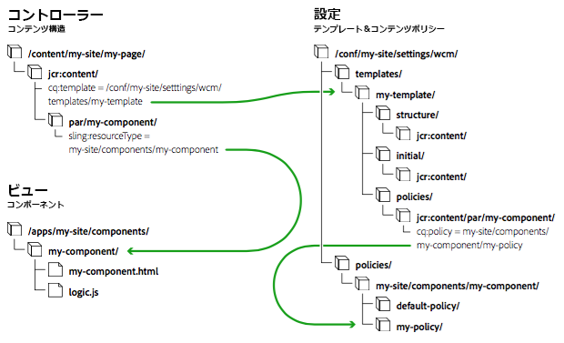

# ページテンプレート - 編集可能 {#page-templates-editable}

編集可能テンプレートが導入された目的は次のとおりです。

* 専門的な作成者が[テンプレートを作成および編集](/help/sites-authoring/templates.md)できるようにすること。

   * このような専門的な作成者は、**テンプレート作成者**&#x200B;と呼ばれます。
   * テンプレート作成者は、`template-authors` グループのメンバーである必要があります。

* テンプレートとそこから作成されたすべてのページとの間に動的接続が維持されるようにすること。これにより、テンプレートに加えた変更が各ページに反映されるようになります。
* ページコンポーネントの汎用性を高め、核となるページコンポーネントをカスタマイズなしで使用できるようにすること。

編集可能テンプレートを使用すると、ページの構成要素がコンポーネント内で分離されます。UI で必要なコンポーネントの組み合わせを設定できるので、ページのバリエーションごとに新しいページコンポーネントを開発する必要はなくなります。

>[!NOTE]
>
>[静的テンプレート](/help/sites-developing/page-templates-static.md)も使用できます。

このドキュメントでは、

* 編集可能テンプレートの作成の概要

   * 詳しくは、[ページテンプレートの作成](/help/sites-authoring/templates.md)を参照してください

* 編集可能テンプレートの作成に必要な管理者／開発者のタスク
* 編集可能テンプレートの技術基盤

このドキュメントでは、テンプレートの作成と編集について既に理解していることを前提としています。オーサリングに関するドキュメント[ページテンプレートの作成](/help/sites-authoring/templates.md)を参照してください。ここでは、テンプレート作成者に公開されている編集可能テンプレートの機能について詳しく説明されています。

>[!NOTE]
>
>次のチュートリアルは、新しいプロジェクトで編集可能なページテンプレートを設定する場合にも役立ちます。
>[「AEM Sitesの使い始めに」パート2 — ベースページとテンプレートの作成](https://helpx.adobe.com/jp/experience-manager/kt/sites/using/getting-started-wknd-tutorial-develop/part2.html)

## 新しいテンプレートの作成 {#creating-a-new-template}

編集可能テンプレートの作成は、主にテンプレート作成者が、[テンプレートコンソールおよびテンプレートエディター](/help/sites-authoring/templates.md)を使用しておこないます。ここでは、そのプロセスの概要を示し、技術的なレベルでどのような処理がおこなわれるかを説明します。

AEM プロジェクトで編集可能テンプレートを使用する方法について詳しくは、[Lazybones を使用した AEM プロジェクトの作成](https://helpx.adobe.com/jp/experience-manager/using/aem_lazybones.html)を参照してください。

新しい編集可能テンプレートを作成する場合は、次の手順を実行します。

1. [テンプレート用のフォルダー](#template-folders)を作成します。これは必須ではありませんが、推奨されるベストプラクティスです。
1. [テンプレートタイプ](#template-type)を選択します。[テンプレート定義](#template-definitions)を作成するために、このタイプがコピーされます。

   >[!NOTE]
   >
   >様々なテンプレートタイプが標準で提供されています。必要に応じて、[独自のサイト固有のテンプレートタイプを作成する](/help/sites-developing/page-templates-editable.md#creating-template-types)こともできます。

1. 新しいテンプレートの構造、コンテンツポリシー、初期コンテンツおよびレイアウトを設定します。

   **構造**

   * 構造では、テンプレートのコンポーネントとコンテンツを定義できます。
   * テンプレート構造で定義されたコンポーネントは、結果ページに移動することも、結果ページから削除することもできません。

      * We.Retail サンプルコンテンツ外のカスタムフォルダーにテンプレートを作成する場合は、基盤コンポーネントを選択するか、[コアコンポーネント](https://helpx.adobe.com/experience-manager/core-components/using/developing.html)を使用することができます。
   * ページ作成者がコンポーネントを追加または削除するには、テンプレートに段落システムを追加する必要があります。
   * コンポーネントのロックを解除（再度ロックできます）して、初期コンテンツを定義できます。

   テンプレート作成者が構造を定義する方法について詳しくは、[ページテンプレートの作成](/help/sites-authoring/templates.md#editing-a-template-structure-template-author)を参照してください。

   構造の技術的な詳細については、このドキュメントの[構造](/help/sites-developing/page-templates-editable.md#structure)を参照してください。

   **ポリシー**

   * コンテンツポリシーでは、コンポーネントのデザインプロパティを定義します。

      * 例えば、使用できるコンポーネントや最小／最大サイズを定義できます。
   * これらのポリシーは、テンプレートと、そのテンプレートを使用して作成されるページに適用されます。

   テンプレート作成者がポリシーを定義する方法について詳しくは、[ページテンプレートの作成](/help/sites-authoring/templates.md#editing-a-template-structure-template-author)を参照してください。

   ポリシーの技術的な詳細については、このドキュメントの[コンテンツポリシー](/help/sites-developing/page-templates-editable.md#content-policies)を参照してください。

   **初期コンテンツ**

   * 初期コンテンツでは、テンプレートに基づいてページが最初に作成されたときに表示されるコンテンツを定義します。
   * その後、ページ作成者が初期コンテンツを編集できます。

   テンプレート作成者が構造を定義する方法について詳しくは、[ページテンプレートの作成](/help/sites-authoring/templates.md#editing-a-template-initial-content-author)を参照してください。

   初期コンテンツの技術的な詳細については、このドキュメントの[初期コンテンツ](/help/sites-developing/page-templates-editable.md#initial-content)を参照してください。

   **レイアウト**

   * デバイスの形式に合わせてテンプレートのレイアウトを定義できます。
   * テンプレートがページオーサリングと同じように動作するには、レスポンシブレイアウトを使用します。

   テンプレート作成者がテンプレートレイアウトを定義する方法について詳しくは、[ページテンプレートの作成](/help/sites-authoring/templates.md#editing-a-template-layout-template-author)を参照してください。

   テンプレートレイアウトの技術的な詳細については、このドキュメントの[レイアウト](/help/sites-developing/page-templates-editable.md#layout)を参照してください。

1. テンプレートを有効化し、特定のコンテンツツリーに対して許可します。

   * テンプレートを有効にするか無効して、ページ作成者による使用可否を決めることができます。
   * テンプレートは、特定のページブランチに対して使用可能または使用不可にすることができます。

   テンプレート作成者がテンプレートを有効にする方法について詳しくは、[ページテンプレートの作成](/help/sites-authoring/templates.md#enabling-and-allowing-a-template-template-author)を参照してください。

   テンプレートの有効化の技術的な詳細については、このドキュメントの[使用するテンプレートの有効化と許可](/help/sites-developing/page-templates-editable.md#enabling-and-allowing-a-template-for-use)を参照してください。

1. テンプレートを使用してコンテンツページを作成します。

   * テンプレートを新しいページを作成するために使用するときは、静的テンプレートと編集可能なテンプレートの間に視覚的な違いはありません。
   * ページの作成者にとって、この処理は透過的です。

   ページ作成者がテンプレートを使用してページを作成する方法について詳しくは、[ページの作成と整理](/help/sites-authoring/managing-pages.md#templates)を参照してください。

   編集可能テンプレートを使用したページ作成の技術的な詳細については、このドキュメントの[作成されるコンテンツページ](/help/sites-developing/page-templates-editable.md#resultant-content-pages)を参照してください。

>[!NOTE]
>
>エディタークライアントライブラリは、コンテンツページに `cq.shared` 名前空間が存在することを前提としています。名前空間が存在しない場合は、JavaScript エラー「`Uncaught TypeError: Cannot read property 'shared' of undefined`」が発生します。
>
>すべてのサンプルコンテンツページには `cq.shared` が含まれているので、それらをベースとするコンテンツには自動的に `cq.shared` が含められます。ただし、サンプルコンテンツをベースとせず、ゼロから独自のコンテンツページを作成する場合は、`cq.shared` 名前空間を含める必要があります。
>
>詳しくは、[クライアントサイドライブラリの使用](/help/sites-developing/clientlibs.md)を参照してください。

>[!CAUTION]
>
>テンプレートには[国際化](/help/sites-developing/i18n.md)が必要な情報は絶対に入れないようにしてください。

## テンプレートフォルダー {#template-folders}

以下のフォルダーを使用してテンプレートを整理できます。

* **global**
* サイト固有テンプレートを整理するためのサイト固有のフォルダーは、管理者権限を保持しているアカウントによって作成されます。

>[!NOTE]
>
>フォルダーはネストできますが、**テンプレート**&#x200B;コンソールで表示すると、フラット構造として表されます。

標準の AEM インスタンスでは、テンプレートコンソールに既に&#x200B;**グローバル**&#x200B;フォルダーが存在します。この中にデフォルトのテンプレートが格納されており、現在のフォルダーにポリシーやテンプレートタイプがない場合にはフォールバックとして機能します。このフォルダーにデフォルトのテンプレートを追加することも、新しいフォルダーを作成すること（推奨）もできます。

>[!NOTE]
>
>カスタマイズしたテンプレートを格納する新しいフォルダーを作成し、グローバルフォルダーは使用しないことをお勧めします。

>[!CAUTION]
>
>フォルダーは、`admin` 権限を持つユーザーが作成する必要があります。

テンプレートのタイプやポリシーは、次の優先順位に従ってすべてのフォルダーに継承されます。

1. 現在のフォルダー。
1. 現在のフォルダーの親.
1. `/conf/global`
1. `/apps`
1. `/libs`

許可されたすべてのエントリのリストが表示されます。オーバーラップする設定がある場合（`path`／`label`）、現在のフォルダーに最も近いインスタンスがユーザーに表示されます。

新しいフォルダーを作成するには、次のいずれかの方法を使用できます。

* プログラムで自動的に、または CRXDE Lite を使用して作成する
* 設定ブラウザーの使用

## CRXDE Lite の使用  {#using-crxde-lite}

1. インスタンスの新しいフォルダー（/conf の下）は、プログラムで自動的にまたは CRXDE Lite を使用して作成できます。

   次の構造を使用する必要があります。

   ```xml
   /conf
       <your-folder-name> [sling:Folder]
           settings [sling:Folder]
               wcm [cq:Page]
                   templates [cq:Page]
                   policies [cq:Page]
   ```

1. その後、フォルダーのルートノードに次のプロパティを定義できます。

   `<your-folder-name> [sling:Folder]`

   名前：`jcr:title`

   * 型：`String`

   * 値：**テンプレート**&#x200B;コンソールに表示される（フォルダーの）タイトルです。

1. 作成者が新しいフォルダーにテンプレートを作成できるようにするには、標準のオーサリング権限（*など）に加え*`content-authors`、グループを割り当てて作成者に必要なアクセス権限（ACL）を定義する必要があります。

   割り当てる必要があるデフォルトのグループは、`template-authors` グループです。詳しくは、次の節[ACL とグループ](/help/sites-developing/page-templates-editable.md#acls-and-groups)を参照してください。

   アクセス権の管理と割り当ての詳細については、[アクセス権の管理](/help/sites-administering/user-group-ac-admin.md#access-right-management)を参照してください。

### 設定ブラウザーの使用 {#using-the-configuration-browser}

1. **グローバルナビゲーション**／**ツール**／**設定ブラウザー**&#x200B;に移動します。

   **グローバル**&#x200B;フォルダーなどの既存のフォルダーは左側に一覧表示されます。

1. 「**作成**」をクリックします。
1. **設定を作成**&#x200B;ダイアログで、以下のフィールドを設定する必要があります。

   * **タイトル**：設定フォルダーのタイトルを指定します。
   * **編集可能なテンプレート**：このフォルダー内で編集可能テンプレートを許可する場合にチェックします。

1. 「**作成**」をクリックします。

>[!NOTE]
>
>グローバルフォルダーにテンプレートを作成する場合は、設定ブラウザーでグローバルフォルダーを編集し、「**編集可能なテンプレート**」オプションをオンにします。ただし、これは推奨されるベストプラクティスではありません。
>
>詳しくは、[設定ブラウザー](/help/sites-administering/configurations.md)のドキュメントを参照してください。

### ACL とグループ {#acls-and-groups}

（CRXDE または設定ブラウザーを使用して）テンプレートフォルダーが作成されたら、セキュリティを確保するために、テンプレートフォルダーの適切なグループに ACL を定義する必要があります。

例として、[We.Retail 参照実装](/help/sites-developing/we-retail.md)のテンプレートフォルダーを使用できます。

#### template-authors グループ {#the-template-authors-group}

`template-authors` グループは、テンプレートへのアクセスを管理するために使用されるグループで、AEM に標準で付属していますが空です。ユーザーは、プロジェクト／サイトのグループに追加する必要があります。

>[!CAUTION]
>
>`template-authors` グループは、新しいテンプレートを作成する必要があるユーザー専用です。**
>
>テンプレートの編集は非常に強力なので、正しくおこなわないと既存のテンプレートが壊れる場合があります。そのため、この役割には注意深く、ふさわしいユーザーだけを含めてください。

次の表に、テンプレートの編集に必要な権限の詳細を示します。

<table>
 <tbody>
  <tr>
   <th>パス</th>
   <th>役割／グループ</th>
   <th>権限<br /> </th>
   <th>説明</th>
  </tr>
  <tr>
   <td rowspan="3"><code>/conf/&lt;<i>your-folder</i>&gt;/settings/wcm/templates</code></td>
   <td>テンプレート作成者<br /> </td>
   <td>読み取り、書き込み、複製</td>
   <td>サイト固有の <code>/conf</code> スペースでテンプレートを作成、読み取り、更新、削除、複製するテンプレート作成者</td>
  </tr>
  <tr>
   <td>匿名 Web ユーザー</td>
   <td>読み取り</td>
   <td>匿名 Web ユーザーは、ページのレンダリング中にテンプレートを読む必要があります</td>
  </tr>
  <tr>
   <td>コンテンツ作成者</td>
   <td>複製</td>
   <td>replicateContent 作成者は、ページをアクティブ化する際に、ページのテンプレートをアクティブ化する必要があります</td>
  </tr>
  <tr>
   <td rowspan="3"><code>/conf/&lt;<i>your-folder</i>&gt;/settings/wcm/policies</code></td>
   <td><code>Template Author</code></td>
   <td>読み取り、書き込み、複製</td>
   <td>サイト固有の <code>/conf</code> スペースでテンプレートを作成、読み取り、更新、削除、複製するテンプレート作成者</td>
  </tr>
  <tr>
   <td>匿名 Web ユーザー</td>
   <td>読み取り</td>
   <td>匿名 Web ユーザーは、ページのレンダリング中にポリシーを読む必要があります</td>
  </tr>
  <tr>
   <td>コンテンツ作成者</td>
   <td>複製</td>
   <td>コンテンツ作成者は、ページをアクティブ化する際に、ページのテンプレートのポリシーをアクティブ化する必要があります</td>
  </tr>
  <tr>
   <td rowspan="2"><code>/conf/&lt;site&gt;/settings/template-types</code></td>
   <td>テンプレート作成者</td>
   <td>読み取り</td>
   <td>テンプレート作成者は、定義済みのテンプレートタイプの 1 つに基づいて新しいテンプレートを作成します。</td>
  </tr>
  <tr>
   <td>匿名 Web ユーザー</td>
   <td>なし</td>
   <td>匿名 Web ユーザーはテンプレートの種類にアクセスできません</td>
  </tr>
 </tbody>
</table>

デフォルトの `template-authors` グループは、プロジェクト設定のみに対応しています。この場合、`template-authors` のすべてのメンバーは、すべてのテンプレートへのアクセスとそれらの作成が許可されています。より複雑な設定では、テンプレートに個別にアクセスするためにテンプレート作成者グループが複数必要になるので、さらに多くのカスタムテンプレート作成者グループを作成する必要があります。ただし、テンプレート作成者グループの権限は変わりません。

#### /conf/global の下の従来のテンプレート  {#legacy-templates-under-conf-global}

テンプレートは`/conf/global`に保存されなくなりますが、一部のレガシーインストールでは、この場所にテンプレートが引き続き存在する可能性があります。 このような従来の状況でのみ、次の`/conf/global`パスを明示的に設定する必要があります。

<table>
 <tbody>
  <tr>
   <th>パス</th>
   <th>役割／グループ</th>
   <th>権限<br /> </th>
   <th>説明</th>
  </tr>
  <tr>
   <td rowspan="3"><code>/conf/global/settings/wcm/templates</code></td>
   <td>テンプレート作成者</td>
   <td>読み取り、書き込み、複製</td>
   <td>テンプレート作成者。 <code>/conf/global</code></td>
  </tr>
  <tr>
   <td>匿名 Web ユーザー</td>
   <td>読み取り</td>
   <td>匿名 Web ユーザーは、ページのレンダリング中にテンプレートを読む必要があります</td>
  </tr>
  <tr>
   <td>コンテンツ作成者</td>
   <td>複製</td>
   <td>コンテンツ作成者は、ページをアクティブ化する際に、ページのテンプレートをアクティブ化する必要があります。</td>
  </tr>
  <tr>
   <td rowspan="3"><code>/conf/global/settings/wcm/policies</code></td>
   <td><code>Template Author</code></td>
   <td>読み取り、書き込み、複製</td>
   <td>テンプレート作成者。 <code>/conf/global</code></td>
  </tr>
  <tr>
   <td>匿名 Web ユーザー</td>
   <td>読み取り</td>
   <td>匿名 Web ユーザーは、ページのレンダリング中にポリシーを読む必要があります</td>
  </tr>
  <tr>
   <td>コンテンツ作成者</td>
   <td>複製</td>
   <td>コンテンツ作成者は、ページをアクティブ化する際に、ページのテンプレートのポリシーをアクティブ化する必要があります</td>
  </tr>
  <tr>
   <td rowspan="2"><code>/conf/global/settings/wcm/template-types</code></td>
   <td>テンプレート作成者</td>
   <td>読み取り</td>
   <td>テンプレート作成者は、定義済みのテンプレートタイプの1つに基づいて新しいテンプレートを作成します</td>
  </tr>
  <tr>
   <td>匿名 Web ユーザー</td>
   <td>なし</td>
   <td>匿名 Web ユーザーはテンプレートの種類にアクセスできません</td>
  </tr>
 </tbody>
</table>

## テンプレートタイプ {#template-type}

新しいテンプレートの作成時には、テンプレートタイプを指定する必要があります。

* テンプレートタイプは、テンプレートのためのテンプレートとなるものです。テンプレート作成時に選択したテンプレートタイプの構造と初期コンテンツに基づいて、新しいテンプレートが作成されます。

   * テンプレートはテンプレートタイプをコピーして作成されます。
   * コピー後のテンプレートとテンプレートタイプとの関連付けは、情報を取得するだけの静的参照のみとなります。

* テンプレートタイプでは、以下の項目を定義できます。

   * ページコンポーネントのリソースタイプ。
   * ルートノードのポリシー。テンプレートエディターで許可されるコンポーネントを定義します。
   * そのテンプレートタイプで、モバイルエミュレーターのレスポンシブグリッドと設定のブレークポイントを定義することをお勧めします。設定は個々のテンプレートで定義することもできるので（[テンプレートタイプとモバイルデバイスグループ](/help/sites-developing/page-templates-editable.md#p-template-type-and-mobile-device-groups-br-p)を参照）、これはオプションです。

* AEM には、既製のテンプレートタイプがいくつか用意されています（HTML5 ページ、アダプティブフォームページなど）。

   * その他の例は、[We.Retail](/help/sites-developing/we-retail.md) サンプルコンテンツの一部として提供されています。

* テンプレートタイプは通常、開発者が定義します。

既製のテンプレートタイプは次のフォルダーに保存されています。

* `/libs/settings/wcm/template-types`

>[!CAUTION]
>
>`/libs` パス内の設定は一切変更しないでください。これは、次回インスタンスをアップグレードする際に`/libs`の内容が上書きされるためです（修正プログラムまたは機能パックを適用すると、上書きされる場合があります）。

サイト固有のテンプレートタイプは、以下に相当する場所に保存してください。

* `/apps/settings/wcm/template-types`

カスタマイズしたテンプレートタイプの定義は、ユーザー定義フォルダー（推奨）または `global` フォルダーに保存してください。次に例を示します。

* `/conf/<my-folder-01>/<my-folder-02>/settings/wcm/template-types`
* `/conf/<my-folder>/settings/wcm/template-types`
* `/conf/global/settings/wcm/template-types`

>[!CAUTION]
>
>テンプレートタイプの保存は、正しいフォルダー構造（`/settings/wcm/...`）に従う必要があります。そうしないと、テンプレートタイプが見つからなくなります。

### テンプレートタイプとモバイルデバイスグループ {#template-type-and-mobile-device-groups-br}

編集可能テンプレートで使用される[デバイスグループ](/help/sites-developing/mobile.md#device-groups)（プロパティ `cq:deviceGroups` の相対パスとして設定）によって、ページオーサリングの[レイアウトモード](/help/sites-authoring/responsive-layout.md)のエミュレーターとして利用できるモバイルデバイスが決まります。この値は次の 2 つの場所で設定できます。

* 編集可能テンプレートのタイプ
* 編集可能テンプレート

新しい編集可能テンプレートを作成すると、この値がテンプレートタイプから個々のテンプレートにコピーされます。値がタイプで設定されていない場合は、テンプレートで設定できます。テンプレートの作成後に、タイプからテンプレートに継承されることはありません。

>[!CAUTION]
>
>`cq:deviceGroups`の値は、`/etc/mobile/groups/responsive`のような絶対パスではなく、`mobile/groups/responsive`のような相対パスとして設定する必要があります。

>[!NOTE]
>
>[静的テンプレート](/help/sites-developing/page-templates-static.md)では、`cq:deviceGroups` の値はサイトのルートに設定できます。
>
>編集可能テンプレートでは、この値はテンプレートレベルで保管されるようになっており、ページのルートレベルではサポートされません。

### テンプレートタイプの作成 {#creating-template-types}

他のテンプレートの基盤となるテンプレートを作成した場合、このテンプレートをテンプレートタイプとしてコピーできます。

1. ここで説明する](/help/sites-authoring/templates.md#creating-a-new-template-template-author)に従って、編集可能なテンプレート[と同様にテンプレートを作成します。これは、テンプレートタイプの基盤となります。
1. CRXDE Lite を使用している場合は、新しく作成したテンプレートを `templates` ノードから`template-types`テンプレートフォルダー[の下の ](/help/sites-developing/page-templates-editable.md#template-folders) ノードにコピーします。
1. このテンプレートを[テンプレートフォルダー](/help/sites-developing/page-templates-editable.md#template-folders)の下の `templates` ノードから削除します。
1. `template-types` ノードの下にあるテンプレートのコピーで、`cq:template` および `cq:templateType` `jcr:content` プロパティをすべて削除します。

また、GitHub で入手できる、編集可能テンプレートのサンプルを基盤として使用し、独自のテンプレートタイプを作成することもできます。

GitHub のコード

このページのコードは GitHub にあります

* [GitHub の aem-sites-example-custom-template-type プロジェクトを開きます](https://github.com/Adobe-Marketing-Cloud/aem-sites-example-custom-template-type)
* プロジェクトを [ZIP ファイル](https://github.com/Adobe-Marketing-Cloud/aem-sites-example-custom-template-type/archive/master.zip)としてダウンロードします

## テンプレート定義 {#template-definitions}

編集可能テンプレートの定義は、[ユーザー定義フォルダー](/help/sites-developing/page-templates-editable.md#template-folders)（推奨）または `global` フォルダーに格納されます。次に例を示します。

* `/conf/<my-folder>/settings/wcm/templates`
* `/conf/<my-folder-01>/<my-folder-02>/settings/wcm/templates`
* `/conf/global/settings/wcm/templates`

テンプレートのルートノードは、以下のスケルトン構造を持つ `cq:Template` タイプです。

```xml
<template-name>
  initial
    jcr:content
      root
        <component>
        ...
        <component>
  jcr:content
    @property status
  policies
    jcr:content
      root
        @property cq:policy
        <component>
          @property cq:policy
        ...
        <component>
          @property cq:policy
  structure
    jcr:content
      root
        <component>
        ...
        <component>
      cq:responsive
        breakpoints
  thumbnail.png
```

主な要素は以下のとおりです。

* `<template-name>`

   * ` [initial](#initial-content)`
   * `jcr:content`
   * ` [structure](#structure)`
   * ` [policies](#policies)`
   * `thumbnail.png`

### jcr:content {#jcr-content}

このノードは、テンプレートのプロパティを保持します。

* **名前**：`jcr:title`

* **名前**：`status`

   * ``**型**：`String`

   * **値**：`draft`、`enabled` または `disabled`

### 構造 {#structure}

作成されるページの構造を定義します。

* 新しいページの作成時に初期コンテンツ（`/initial`）と統合されます。
* 構造に加えた変更は、そのテンプレートを使用して作成されたすべてのページに反映されます。
* `structure/jcr:content/root`（`root`）ノードは、作成されたページで使用できるコンポーネントのリストを定義します。

   * テンプレート構造で定義されたコンポーネントは、作成されたページで移動することも、作成されたページから削除することもできません。
   * コンポーネントをロック解除すると、`editable` プロパティが `true` に設定されます。

   * 既にコンテンツを含むコンポーネントをロック解除すると、このコンテンツは `initial` ブランチに移動されます.

* `cq:responsive` ノードは、レスポンシブレイアウトの定義を保持します。

### 初期コンテンツ {#initial-content}

作成時に新しいページに表示される初期コンテンツを定義します。

* すべての新しいページにコピーされる `jcr:content` ノードが含まれます。
* 新しいページの作成時に構造（`/structure`）と統合されます。
* 作成後に初期コンテンツが変更されても、既存のページはすべて更新されません。
* `root` ノードは、作成されたページで使用できるコンポーネントを定義する、コンポーネントのリストを保持します。
* コンテンツが構造モードでコンポーネントに追加され、その後、そのコンポーネントがロック解除された場合（またはコンポーネントのロック解除後にコンテンツが追加された場合）、このコンテンツは初期コンテンツとして使用されます。

### レイアウト {#layout}

[テンプレートの編集時にレイアウト](/help/sites-authoring/templates.md)を定義するとき、[標準のレスポンシブレイアウト](/help/sites-authoring/responsive-layout.md)を使用します。これは[設定](/help/sites-administering/configuring-responsive-layout.md)にもなります。

### コンテンツポリシー {#content-policies}

コンテンツ（またはデザイン）ポリシーでは、コンポーネントのデザインプロパティを定義します。例えば、使用できるコンポーネントや最小／最大サイズを定義できます。これらのポリシーは、テンプレートと、そのテンプレートを使用して作成されるページに適用されます。テンプレートエディターでコンテンツポリシーを作成して選択できます。

* `root` ノード上の `cq:policy` プロパティ
   `/conf/<your-folder>/settings/wcm/templates/<your-template>/policies/jcr:content/root`
ページの段落システムのコンテンツポリシーに対する相対参照を提供します。

* `root` の下のコンポーネントを明示的に示すノードの `cq:policy` プロパティは、個々のコンポーネントのポリシーへのリンクを提供します。

* 実際のポリシー定義は、次の場所に保存されます。
   `/conf/<your-folder>/settings/wcm/policies/wcm/foundation/components`

>[!NOTE]
>
>ポリシー定義のパスは、コンポーネントのパスによって異なります。`cq:policy` は、設定自体への相対参照を保持します。

>[!NOTE]
>
>編集可能テンプレートから作成されたページの場合は、ページエディターでデザインモードが提供されません。
>
>編集可能なテンプレートの`policies`ツリーは、次の下にある静的テンプレートのデザインモード設定と同じ階層を持ちます。
>
>`/etc/designs/<my-site>/jcr:content/<component-name>`
>
>静的テンプレートのデザインモード設定は、ページコンポーネントごとに定義されたものです。

### ページポリシー {#page-policies}

ページポリシーを使用して、テンプレートまたは作成されるページで、ページ（メインの parsys）の[コンテンツポリシー](#content-policies)を定義できます。

### 使用するテンプレートの有効化と許可  {#enabling-and-allowing-a-template-for-use}

1. **テンプレートの有効化**

   テンプレートは、次のどちらかの方法で有効化してからでなければ使用できません。

   * **テンプレート**&#x200B;コンソールから[テンプレートを有効化](/help/sites-authoring/templates.md#enablingatemplateauthor)する。

   * `jcr:content` ノードの status プロパティを設定する。

      * 例：
         `/conf/<your-folder>/settings/wcm/templates/<your-template>/jcr:content`

      * プロパティの定義

         * 名前：status
         * タイプ：String
         * 値：`enabled`

1. **許可されたテンプレート**

   * 適切なページまたはサブブランチのルートページの[**ページプロパティ**](/help/sites-authoring/templates.md#allowing-a-template-author)&#x200B;に対して許可されたテンプレートのパスを定義します。
   * プロパティを設定します。
      `cq:allowedTemplates` 
を 
必要なブランチの `jcr:content` ノードに設定します。
   例えば、次の値を使用します。

   `/conf/<your-folder>/settings/wcm/templates/.*`

## 作成されるコンテンツページ {#resultant-content-pages}

編集可能テンプレートから作成されるページには、次の特徴があります。

* テンプレートの `structure` と `initial` を統合したサブツリーを使用して作成されます。

* テンプレートおよびテンプレートタイプに保持されている情報への参照を保持します。これは、次のプロパティを持つ `jcr:content` ノードを使用しておこないます。

   * `cq:template`実際のテンプレートへの動的参照を提供します。テンプレートへの変更を実際のページに反映させることができます。

   * `cq:templateType`
テンプレートタイプの参照を提供します。



上の図は、テンプレート、コンテンツおよびコンポーネントの相関関係を示したものです。

* コントローラ — `/content/<my-site>/<my-page>`
テンプレートを参照する結果ページです。 コンテンツがプロセス全体を制御します。定義に従って、適切なテンプレートとコンポーネントにアクセスします。

* 構成 — `/conf/<my-folder>/settings/wcm/templates/<my-template>`
[テンプレートと関連するコンテンツポリシー](#template-definitions)は、ページ設定を定義します。

* モデル - OSGi バンドル[OSGi バンドル](/help/sites-deploying/osgi-configuration-settings.md)が機能を実装します。

* 表示- `/apps/<my-site>/components`
作成者とパブリッシュの両方の環境で、コンテンツは[コンポーネント](/help/sites-developing/components.md)によってレンダリングされます。

ページのレンダリング時

* **テンプレート**:

   * `cq:template` ノードの `jcr:content` プロパティが、そのページに対応するテンプレートにアクセスするために参照されます。

* **コンポーネント**:

   * ページコンポーネントは、テンプレートの `structure/jcr:content` ツリーとページの `jcr:content` ツリーを統合します。

   * 作成者は、ページコンポーネントを使用して、「編集可能」のフラグが設定されているテンプレート構造のノード（およびいずれかの子）を編集できるだけです。
   * ページ上にコンポーネントをレンダリングする際、そのコンポーネントの相対パスが `jcr:content` ノードから取得されます。その後、テンプレートの `policies/jcr:content` ノードの下の同じパスが検索されます。

      * このノードの `cq:policy` プロパティは、実際のコンテンツポリシーを指します（すなわち、このプロパティは、そのコンポーネントのデザイン設定を保持しています）。

      * このため、同じコンテンツポリシー設定を再利用する複数のテンプレートを持つことができます。
