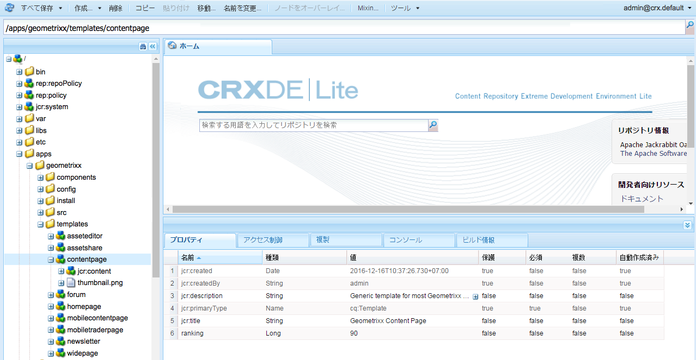
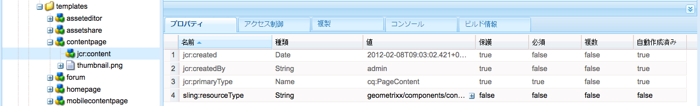
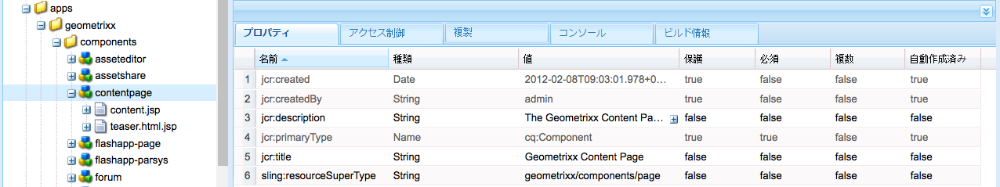
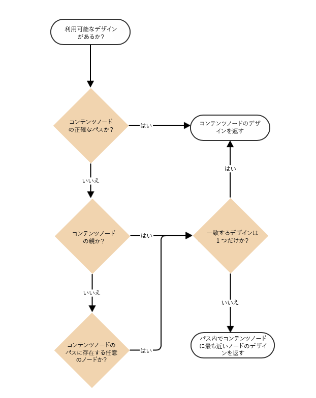
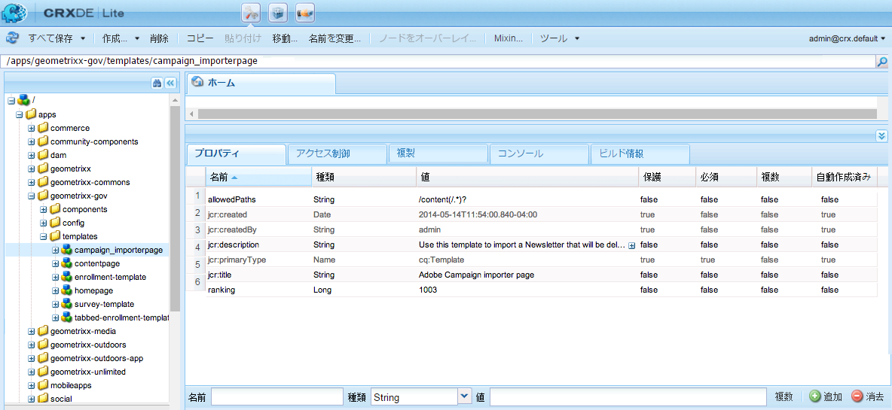
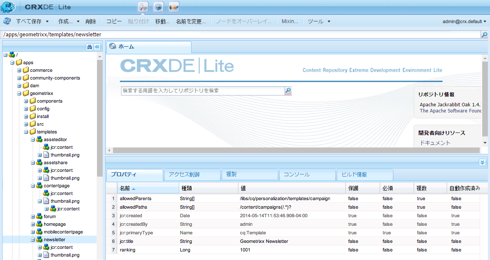

# ページテンプレート - 静的{#page-templates-static}

テンプレートはページを作成するための雛形として使用され、選択した範囲内で使用できるコンポーネントを定義します。テンプレートは、そこから作成されるページと同じ構造を持つノードの階層ですが、実際のコンテンツは含みません。

テンプレートごとに、使用可能なコンポーネントが提示されます。

* テンプレートは[コンポーネント](/help/sites-developing/components.md)で構成されています。
* コンポーネントによって使用され、アクセスが許可されるウィジェットを使用して、コンテンツがレンダリングされます。

>[!NOTE]
>
>[編集可能なテンプレート](/help/sites-developing/page-templates-editable.md) (Editable Templates)も利用でき、最も柔軟性の高い最新の機能を実現するために推奨されるテンプレートタイプです。

## テンプレートのプロパティおよび子ノード {#properties-and-child-nodes-of-a-template}

テンプレートは、タイプが cq:Template のノードであり、以下のプロパティおよび子ノードが含まれます。

<table>
 <tbody>
  <tr>
   <td><strong>名前   </strong></td>
   <td><strong>型   </strong></td>
   <td><strong>説明   </strong></td>
  </tr>
  <tr>
   <td>.   </td>
   <td> cq:Template</td>
   <td>現在のテンプレート。 テンプレートのノードタイプは cq:Template です。  </td>
  </tr>
  <tr>
   <td> allowedChildren </td>
   <td> String[]</td>
   <td>このテンプレートの子となることが許可されているテンプレートのパス。  </td>
  </tr>
  <tr>
   <td> allowedParents</td>
   <td> String[]</td>
   <td>Path of a template that is allowed to be a parent of this template.  </td>
  </tr>
  <tr>
   <td> allowedPaths</td>
   <td> String[]</td>
   <td>このテンプレートをベースとすることが許可されているページのパス。  </td>
  </tr>
  <tr>
   <td> jcr:created</td>
   <td> 日付</td>
   <td>テンプレートの作成日。  </td>
  </tr>
  <tr>
   <td> jcr:description</td>
   <td> String</td>
   <td>テンプレートの説明。  </td>
  </tr>
  <tr>
   <td> jcr:title</td>
   <td> 文字列</td>
   <td>テンプレートのタイトル。  </td>
  </tr>
  <tr>
   <td> ranking</td>
   <td> Long</td>
   <td>テンプレートのランク。 ユーザーインターフェイスにテンプレートを表示する際に使用します。  </td>
  </tr>
  <tr>
   <td> jcr:content</td>
   <td> cq:PageContent</td>
   <td>テンプレートのコンテンツを含むノード。  </td>
  </tr>
  <tr>
   <td> thumbnail.png</td>
   <td> nt:file</td>
   <td>テンプレートのサムネール。  </td>
  </tr>
  <tr>
   <td> icon.png</td>
   <td> nt:file</td>
   <td>テンプレートのアイコン。  </td>
  </tr>
 </tbody>
</table>

テンプレートはページの基礎です。

To create a page, the template must be copied (node-tree `/apps/<myapp>/template/<mytemplate>`) to the corresponding position in the site-tree: this is what happens if a page is created using the **Websites** tab.

このコピー処理により、ページには、初期コンテンツ（通常はトップレベルコンテンツのみ）と sling:resourceType プロパティ、ページのレンダリングに使用するページコンポーネントのパス（子ノード jcr:content に含まれるすべてのもの）が与えられます。

## テンプレートの構造 {#how-templates-are-structured}

以下の 2 つの側面について考慮する必要があります。

* テンプレート自体の構造
* テンプレート使用時に作成されるコンテンツの構造

### テンプレートの構造 {#the-structure-of-a-template}

テンプレートは **cq:Template** タイプのノードの下に作成されます。

様々なプロパティを設定できます。具体例は以下のとおりです。

* **jcr:title** - テンプレートのタイトル。ページ作成時にダイアログに表示されます。
* **jcr:description** - テンプレートの説明。ページ作成時にダイアログに表示されます。

このノードには jcr:content（cq:PageContent）ノードが含まれており、結果ページのコンテンツノードの基礎として使用できます。これが、sling:resourceType を使用して、新しいページの実際のコンテンツをレンダリングする際に使用するコンポーネントを参照します。

このコンポーネントは、新しいページを作成する際に、コンテンツの構造およびデザインを定義するために使用します。

### テンプレートによって作成されるコンテンツ {#the-content-produced-by-a-template}

テンプレートは、タイプのページの作成に使用され `cq:Page` ます（前述したように、ページは特別なタイプのコンポーネントです）。 各AEMページには構造化されたノードがあ `jcr:content`ります。 このスケーリングは：

* タイプが cq:PageContent である。
* 定義済みのコンテンツ定義を保持する構造化ノードタイプである。
* has a property `sling:resourceType` to reference the component holding the sling scripts used for rendering the content

### デフォルトテンプレート {#default-templates}

AEM にはそのまま使用できるデフォルトのテンプレートが多数付属しています。テンプレートをそのまま使用したほうがよい場合もあります。その場合は、実際の Web サイトでテンプレートが使用可能であることを確認する必要があります。

例えば、AEM には、コンテンツページやホームページを含む、いくつかのテンプレートが付属しています。

| **タイトル** | **コンポーネント** | **場所** | **目的** |
|---|---|---|---|
| ホームページ | homepage | geometrixx | Geometrixx ホームページテンプレート。 |
| コンテンツページ | contentpage | geometrixx | Geometrixx コンテンツページテンプレート。 |

#### デフォルトテンプレートの表示 {#displaying-default-templates}

リポジトリ内のすべてのテンプレートのリストを確認するには、以下の手順を実行します。

1. CRXDE Lite で、**ツール**&#x200B;メニューを開いて、「**クエリ**」をクリックします。

1. 「クエリ」タブで、
1. 「**タイプ**」で、「**XPath**」を選択します。

1. 「**クエリ**」入力フィールドに、次の文字列を入力します。
//element(*, cq:Template)

1. 「**実行**」をクリックします。結果ボックスにリストが表示されます。

多くの場合、既存のテンプレートを使用して、各自の用途に合わせて新しいテンプレートを開発します。詳しくは、[ページテンプレートの開発](#developing-page-templates)を参照してください。

To enable an existing template for your website and you want it to be displayed in the **Create Page** dialog when creating a page right under **Websites** from the **Websites** console, set the allowedPaths property of the template node to: **/content(/.*)?**

## テンプレートデザインの適用方法 {#how-template-designs-are-applied}

UIで [デザインモードを使用してスタイルを定義する場合](/help/sites-authoring/default-components-designmode.md)、スタイルが定義されているコンテンツノードの正確なパスでデザインが維持されます。

>[!CAUTION]
>
>Adobeでは、 [デザインモードでのみデザインを適用することをお勧めします](/help/sites-authoring/default-components-designmode.md)。
>
>例えば、CRX DE でデザインを変更することはベストプラクティスではなく、そのようなデザインのアプリケーションは、意図した動作とは異なることがあります。

デザインモードを使用してのみデザインが適用される場合は、次の節、「 [デザインパスの解像度](/help/sites-developing/page-templates-static.md#design-path-resolution)」、「デシジョンツリー [」](/help/sites-developing/page-templates-static.md#decision-tree)[、](/help/sites-developing/page-templates-static.md#example) 例は適用されません。

### デザインパスの解像度 {#design-path-resolution}

静的テンプレートに基づいてコンテンツをレンダリングする場合、AEMは、コンテンツ階層の移動に基づいて、最も関連性の高いデザインとスタイルをコンテンツに適用しようとします。

AEMは、次の順序で、コンテンツノードに最も適したスタイルを決定します。

* コンテンツノードの完全で正確なパスのデザインがある場合（デザインモードでデザインを定義した場合など）、そのデザインを使用します。
* 親のコンテンツノードのデザインがある場合は、そのデザインを使用します。
* コンテンツノードのパス上のノードにデザインがある場合は、そのデザインを使用します。

最後の2つの場合、該当するデザインが複数ある場合は、コンテンツノードに最も近いデザインを使用します。

### デシジョンツリー {#decision-tree}

これは、 [デザインパスの解像度](/help/sites-developing/page-templates-static.md#design-path-resolution) (Design Path Resolution)ロジックをグラフィカルに表したものです。

### 例 {#example}

任意のノードにデザインを適用できる単純なコンテンツ構造を次に示します。

`/root/branch/leaf`

次の表に、AEMがデザインを選択する方法を示します。

<table>
 <tbody>
  <tr>
   <td><strong>デザインの検索  </strong></td>
   <td><strong>のデザインが存在する  </strong></td>
   <td><strong>選択されたデザイン  </strong></td>
   <td><strong>コメント</strong></td>
  </tr>
  <tr>
   <td><code class="code">leaf
      </code></td>
   <td>
<code>root</code>
 
<code>branch</code>
 
<code>leaf</code>
 </td>
   <td><code>leaf</code></td>
   <td>最も正確な一致が常に取得されます。  </td>
  </tr>
  <tr>
   <td><code>leaf</code></td>
   <td>
<code>root</code>
 
<code>branch</code>
 </td>
   <td><code>branch</code></td>
   <td>ツリー内で最も近いマッチの下位にフォールバックします。</td>
  </tr>
  <tr>
   <td><code>leaf</code></td>
   <td><code>root</code></td>
   <td><code>root</code></td>
   <td>他のすべてが失敗した場合は、残りのものを取り上げます。  </td>
  </tr>
  <tr>
   <td><code>branch</code></td>
   <td><code>branch</code></td>
   <td><code>branch</code></td>
   <td> </td>
  </tr>
  <tr>
   <td><code>branch</code></td>
   <td>
<code>branch</code>
 
<code class="code">leaf
       </code>
 </td>
   <td><code>branch</code></td>
   <td> </td>
  </tr>
  <tr>
   <td><code>branch</code></td>
   <td>
<code>root</code>
 
<code class="code">branch
       </code>
 </td>
   <td><code>branch</code></td>
   <td> </td>
  </tr>
  <tr>
   <td><code>branch</code></td>
   <td>
<code>root</code>
 
<code class="code">leaf
       </code>
 </td>
   <td><code>root</code></td>
   <td>
完全一致がない場合は、ツリーの下の方を選択します。
 
この設定は常に適用できるが、ツリーの上の方は特に指定しすぎる可能性があると想定しています。  
 </td>
  </tr>
 </tbody>
</table>

## ページテンプレートの開発 {#developing-page-templates}

AEM ページのテンプレートは、新しいページを作成する際に使用する単なるモデルです。初期コンテンツは必要に応じて増減できます。テンプレートの役割は、編集やレンダリングが可能なように必要なプロパティ（主に sling:resourceType）が設定された、正しい初期ノード構造を作成することです。

### 新しいテンプレートの作成（既存のテンプレートを使用） {#creating-a-new-template-based-on-an-existing-template}

言うまでもなく、新しいテンプレートは完全にゼロから作成することもできますが、多くの場合は、既存のテンプレートをコピーして更新したほうが、時間と労力を節約できます。例えば、Geometrixx 内のテンプレートを使用して作業を開始できます。

既存のテンプレートに基づいた新しいテンプレートの作成手順

1. 既存のテンプレート（作成したいテンプレートに定義が最も近いものが望ましい）を、新しいノードにコピーします。

   テンプレートは、通常、**/apps/&lt;website-name>/templates/&lt;template-name>** に格納されています。

   >[!NOTE]
   >
   >使用可能なテンプレートのリストは、新しいページの場所と、各テンプレートで指定されている配置制限によって異なります。[使用可能なテンプレート](#templateavailibility)を参照してください。

1. 新しいテンプレートノードの **jcr:title** を、新しい役割を反映するように変更します。適宜、**jcr:description** も更新できます。ページで使用可能なテンプレートは、適宜変更してください。

   >[!NOTE]
   >
   >If you want your template to be displayed in the **Create Page** dialog when creating a page right under **Websites** from the **Websites** console, set the `allowedPaths` property of the template node to: `/content(/.*)?`

   

1. テンプレートの基礎となっているコンポーネント（テンプレート内の **jcr:content** ノードの **sling:resourceType** プロパティを参照）をコピーして、新しいインスタンスを作成します。

   コンポーネントは、通常、**/apps/&lt;website-name>/components/&lt;component-name>** に格納されています。

1. 新しいコンポーネントの **jcr:title** と **jcr:description** を更新します。
1. テンプレート選択リストに新しいサムネール画像を表示する場合は、thumbnail.png を置き換えます（サイズは 128 x 98 px）。
1. テンプレートの **jcr:content** ノードの **sling:resourceType** を、新しいコンポーネントを参照するように更新します。
1. テンプレートとその基になるコンポーネントのいずれかまたは両方に関して、機能やデザインをさらに変更します。

   >[!NOTE]
   >
   >**/apps/&lt;website>/templates/&lt;template-name>** ノードに対する変更は、テンプレートインスタンスに影響します（選択リストの場合と同様）。
   **/apps/&lt;website>/components/&lt;component-name>** ノードに対する変更は、テンプレート使用時に作成されるコンテンツページに影響します。

   これで、新しいテンプレートを使用して Web サイト内にページを作成できます。

>[!NOTE]
The editor client library assumes the presence of the `cq.shared` namespace in content pages, and if it is absent the JavaScript error `Uncaught TypeError: Cannot read property 'shared' of undefined` will result.
すべてのサンプルコンテンツページには `cq.shared` が含まれているので、それらをベースとするコンテンツには自動的に `cq.shared` が含められます。ただし、サンプルコンテンツをベースとせず、ゼロから独自のコンテンツページを作成する場合は、`cq.shared` 名前空間を含める必要があります。
詳しくは、[クライアント側ライブラリの使用](/help/sites-developing/clientlibs.md)を参照してください。

## 既存のテンプレートを使用可能にする {#making-an-existing-template-available}

この例では、特定のコンテンツパスにテンプレートを使用できるようにする方法を示しています。The templates that are available to the page author when creating new pages are determined by the logic defined in [Template Availability](/help/sites-developing/templates.md#template-availability).

1. CRXDE Lite で、ページに使用するテンプレート（Newsletter テンプレートなど）に移動します。
1. テン `allowedPaths` プレートの可用性に使用する [プロパティおよびその他のプロパティを変更します](/help/sites-developing/templates.md#template-availability)。 For example, `allowedPaths`: `/content/geometrixx-outdoors/[^/]+(/.*)?` means that this template is allowed in any path under `/content/geometrixx-outdoors`.

   
