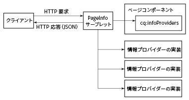
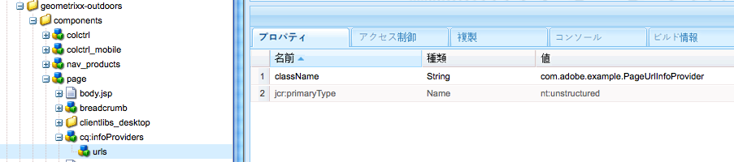

# JSON 形式のページ情報の取得{#obtaining-page-information-in-json-format}

ページ情報を取得するには、JSON 形式のページメタデータを取得するための要求を PageInfo サーブレットに送信します。

PageInfoサーブレットは、リポジトリ内のリソースに関する情報を返します。 サーブレットはURL `https://<server>:<port>/libs/wcm/core/content/pageinfo.json`にバインドされ、`path`パラメーターを使用してリソースを識別します。 次の例のURLは、`/content/we-retail/us/en`ノードに関する情報を返します。

```shell
http://localhost:4502/libs/wcm/core/content/pageinfo.json?path=/content/we-retail/us/en
```

>[!NOTE]
>
>次のような従来の AEM Web ページではないチャネルにコンテンツを配信するために、JSON 形式のページ情報が必要な場合は、ご注意ください。
>
>* 単一ページアプリケーション
>* ネイティブモバイルアプリケーション
>* AEM の外部の他のチャネルおよびタッチポイント

>
>
その場合は、[コンテンツサービス用の JSON エクスポーター](/help/sites-developing/json-exporter.md)のドキュメントを参照してください。

## ページ情報プロバイダー {#page-information-providers}

ページコンポーネントは、ページメタデータを生成する 1 つ以上の `com.day.cq.wcm.api.PageInfoProvider` サービスに関連付けることができます。PageInfo サーブレットは、各 PageInfoProvider サービスを呼び出して、メタデータを集約します。

1. HTTP クライアントは、ページの URL を含む要求を PageInfo サーブレットに送信します。
1. PageInfo サーブレットは、ページをレンダリングするコンポーネントを検出します。
1. PageInfo サーブレットは、そのコンポーネントに関連付けられている各 PageInfoProvider を呼び出します。
1. サーブレットは、各 PageInfoProvider が返したメタデータを集約し、それらのメタデータを JSON オブジェクトとして HTTP 応答に追加します。



>[!NOTE]
>
>JSON 形式の情報のリストを更新するには、PageInfoProvider と同様に ListInfoProvider を使用してください。（[Web サイト管理コンソールのカスタマイズ](/help/sites-developing/customizing-siteadmin.md)を参照。）

## デフォルトのページ情報プロバイダー  {#default-page-information-providers}

`/libs/foundation/components/page`コンポーネントは、次のPageInfoProviderサービスに関連付けられています。

* **デフォルトのページステータスプロバイダー：**&#x200B;ページステータスに関する情報。例えば、ページのロックの有無、ページがアクティブワークフローのペイロードであるかどうか、ページで使用できるワークフローなど。
* **ライブ関係情報プロバイダー：**&#x200B;マルチサイト管理（MSM）に関する情報。例えば、ページがブループリントの一部であるかどうか、ページがライブコピーであるかどうかなど。
* **コンテンツ言語サーブレット：**&#x200B;現在のページの言語と、ページが表示される際の各言語に関する情報。
* **ワークフローステータスプロバイダー：**&#x200B;ペイロードとしてのページを持つ実行中のワークフローに関するステータス情報。
* **ワークフローパッケージ情報プロバイダー：**&#x200B;リポジトリに保存される各ワークフローパッケージに関する情報と、各パッケージに現在のリソースが含まれているかどうか。
* **エミュレーター情報プロバイダー：**&#x200B;このリソースで使用可能なモバイルデバイスエミュレーターに関する情報。ページコンポーネントがモバイルページをレンダリングしない場合、エミュレーターは使用できません。
* **注釈情報プロバイダー：**&#x200B;ページ上の注釈に関する情報。

例えば、PageInfoサーブレットは`/content/we-retail/us/en`ノードに対して次のJSON応答を返します。

```
{
   "status":{
      "path":"/content/we-retail/us/en",
      "isLocked":false,
      "lockOwner":"",
      "canUnlock":false,
      "lastModified":1467202845038,
      "lastModifiedBy":"admin",
      "timeUntilValid":0,
      "onTime":0,
      "offTime":0,
      "replication":{
         "numQueued":0
      },
      "isDesignable":true,
      "isDeveloper":true
   },
   "isPage":true,
   "pageResourceType":"weretail/components/structure/page",
   "enableFragmentIdentifier":false,
   "workflow":{
      "isRunning":false
   },
   "workflows":{
      "wcm":{
         "models":[
            {
               "wid":"/etc/workflow/models/dam/adddamsize/jcr:content/model",
               "label":"Add Asset Size",
               "label_xss":"Add Asset Size"
            },
            {
               "wid":"/etc/workflow/models/ac-newsletter-workflow-simple/jcr:content/model",
               "label":"Approve for Adobe Campaign",
               "label_xss":"Approve for Adobe Campaign"
            },
            {
               "wid":"/etc/workflow/models/dam/dam-autotag-assets/jcr:content/model",
               "label":"DAM Smart Tag Assets",
               "label_xss":"DAM Smart Tag Assets"
            },
            {
               "wid":"/etc/workflow/models/dam/update_asset/jcr:content/model",
               "label":"DAM Update Asset",
               "label_xss":"DAM Update Asset"
            },
            {
               "wid":"/etc/workflow/models/cloudservices/DTM_bundle_download/jcr:content/model",
               "label":"Default DTM Bundle Download",
               "label_xss":"Default DTM Bundle Download"
            },
            {
               "wid":"/etc/workflow/models/dam/dam_download_asset/jcr:content/model",
               "label":"Download Asset",
               "label_xss":"Download Asset"
            },
            {
               "wid":"/etc/workflow/models/dam/dynamic-media-video-thumbnail-replacement/jcr:content/model",
               "label":"Dynamic Media Video Thumbnail Replacement",
               "label_xss":"Dynamic Media Video Thumbnail Replacement"
            },
            {
               "wid":"/etc/workflow/models/dam/dynamic-media-video-user-uploaded-thumbnail/jcr:content/model",
               "label":"Dynamic Media Video User Uploaded Thumbnail Process",
               "label_xss":"Dynamic Media Video User Uploaded Thumbnail Process"
            },
            {
               "wid":"/etc/workflow/models/projects/approval_workflow/jcr:content/model",
               "label":"Project Approval Workflow",
               "label_xss":"Project Approval Workflow"
            },
            {
               "wid":"/etc/workflow/models/publish_example/jcr:content/model",
               "label":"Publish Example",
               "label_xss":"Publish Example"
            },
            {
               "wid":"/etc/workflow/models/publish_to_campaign/jcr:content/model",
               "label":"Publish to Adobe Campaign",
               "label_xss":"Publish to Adobe Campaign"
            },
            {
               "wid":"/etc/workflow/models/s7dam/request_to_publish_to_youtube/jcr:content/model",
               "label":"Publish to YouTube",
               "label_xss":"Publish to YouTube"
            },
            {
               "wid":"/etc/workflow/models/projects/request_copy/jcr:content/model",
               "label":"Request Copy",
               "label_xss":"Request Copy"
            },
            {
               "wid":"/etc/workflow/models/request_for_activation/jcr:content/model",
               "label":"Request for Activation",
               "label_xss":"Request for Activation"
            },
            {
               "wid":"/etc/workflow/models/request_for_deactivation/jcr:content/model",
               "label":"Request for Deactivation",
               "label_xss":"Request for Deactivation"
            },
            {
               "wid":"/etc/workflow/models/request_for_deletion/jcr:content/model",
               "label":"Request for Deletion",
               "label_xss":"Request for Deletion"
            },
            {
               "wid":"/etc/workflow/models/request_to_complete_move_operation/jcr:content/model",
               "label":"Request to complete Move operation",
               "label_xss":"Request to complete Move operation"
            },
            {
               "wid":"/etc/workflow/models/screens-update-asset/jcr:content/model",
               "label":"Screens Update Asset",
               "label_xss":"Screens Update Asset"
            },
            {
               "wid":"/etc/workflow/models/s7dam/request_to_remove_from_youtube/jcr:content/model",
               "label":"Unpublish from YouTube",
               "label_xss":"Unpublish from YouTube"
            },
            {
               "wid":"/etc/workflow/models/wcm-translation/create_language_copy/jcr:content/model",
               "label":"WCM: Create Language Copy",
               "label_xss":"WCM: Create Language Copy"
            },
            {
               "wid":"/etc/workflow/models/wcm-translation/prepare_translation_project/jcr:content/model",
               "label":"WCM: Prepare Translation Project",
               "label_xss":"WCM: Prepare Translation Project"
            },
            {
               "wid":"/etc/workflow/models/wcm-translation/translate-i18n-dictionary/jcr:content/model",
               "label":"WCM: Prepare and Translate I18n-Dictionary",
               "label_xss":"WCM: Prepare and Translate I18n-Dictionary"
            },
            {
               "wid":"/etc/workflow/models/wcm-translation/sync_translation_job/jcr:content/model",
               "label":"WCM: Sync Translation Job",
               "label_xss":"WCM: Sync Translation Job"
            },
            {
               "wid":"/etc/workflow/models/wcm-translation/update_language_copy/jcr:content/model",
               "label":"WCM: Update Language Copy",
               "label_xss":"WCM: Update Language Copy"
            }
         ]
      },
      "translation":{
         "models":[
            {
               "wid":"/etc/workflow/models/dam/adddamsize/jcr:content/model",
               "label":"Add Asset Size",
               "label_xss":"Add Asset Size"
            },
            {
               "wid":"/etc/workflow/models/ac-newsletter-workflow-simple/jcr:content/model",
               "label":"Approve for Adobe Campaign",
               "label_xss":"Approve for Adobe Campaign"
            },
            {
               "wid":"/etc/workflow/models/dam/dam-autotag-assets/jcr:content/model",
               "label":"DAM Smart Tag Assets",
               "label_xss":"DAM Smart Tag Assets"
            },
            {
               "wid":"/etc/workflow/models/cloudservices/DTM_bundle_download/jcr:content/model",
               "label":"Default DTM Bundle Download",
               "label_xss":"Default DTM Bundle Download"
            },
            {
               "wid":"/etc/workflow/models/dam/dam_download_asset/jcr:content/model",
               "label":"Download Asset",
               "label_xss":"Download Asset"
            },
            {
               "wid":"/etc/workflow/models/dam/dynamic-media-video-thumbnail-replacement/jcr:content/model",
               "label":"Dynamic Media Video Thumbnail Replacement",
               "label_xss":"Dynamic Media Video Thumbnail Replacement"
            },
            {
               "wid":"/etc/workflow/models/dam/dynamic-media-video-user-uploaded-thumbnail/jcr:content/model",
               "label":"Dynamic Media Video User Uploaded Thumbnail Process",
               "label_xss":"Dynamic Media Video User Uploaded Thumbnail Process"
            },
            {
               "wid":"/etc/workflow/models/projects/approval_workflow/jcr:content/model",
               "label":"Project Approval Workflow",
               "label_xss":"Project Approval Workflow"
            },
            {
               "wid":"/etc/workflow/models/publish_to_campaign/jcr:content/model",
               "label":"Publish to Adobe Campaign",
               "label_xss":"Publish to Adobe Campaign"
            },
            {
               "wid":"/etc/workflow/models/s7dam/request_to_publish_to_youtube/jcr:content/model",
               "label":"Publish to YouTube",
               "label_xss":"Publish to YouTube"
            },
            {
               "wid":"/etc/workflow/models/projects/request_copy/jcr:content/model",
               "label":"Request Copy",
               "label_xss":"Request Copy"
            },
            {
               "wid":"/etc/workflow/models/request_for_deletion/jcr:content/model",
               "label":"Request for Deletion",
               "label_xss":"Request for Deletion"
            },
            {
               "wid":"/etc/workflow/models/request_to_complete_move_operation/jcr:content/model",
               "label":"Request to complete Move operation",
               "label_xss":"Request to complete Move operation"
            },
            {
               "wid":"/etc/workflow/models/screens-update-asset/jcr:content/model",
               "label":"Screens Update Asset",
               "label_xss":"Screens Update Asset"
            },
            {
               "wid":"/etc/workflow/models/translation/jcr:content/model",
               "label":"Translation Prepare",
               "label_xss":"Translation Prepare"
            },
            {
               "wid":"/etc/workflow/models/s7dam/request_to_remove_from_youtube/jcr:content/model",
               "label":"Unpublish from YouTube",
               "label_xss":"Unpublish from YouTube"
            }
         ]
      }
   },
   "translation":{

   },
   "design":{
      "path":"/conf/we-retail/settings/wcm/templates/hero-page/policies",
      "lastModified":0
   },
   "componentsRef":"/libs/wcm/core/content/components.1497341312569.json",
   "editableTemplate":"/conf/we-retail/settings/wcm/templates/hero-page",
   "msm":{
      "msm:isLiveCopy":true,
      "msm:isInBlueprint":false,
      "msm:isSource":false
   },
   "launches":{
      "isLaunch":false,
      "isInLaunch":false
   },
   "language":"en",
   "languages":{
      "rows":[
         {
            "path":"/content/we-retail/us/en",
            "exists":true,
            "hasContent":true,
            "lastModified":0,
            "iso":"en",
            "country":"gb",
            "language":"English"
         },
         {
            "path":"/content/we-retail/us/es",
            "exists":true,
            "hasContent":true,
            "lastModified":0,
            "iso":"es",
            "country":"es",
            "language":"Spanish"
         }
      ]
   },
   "workflowInfo":{
      "isRunning":false
   },
   "workflowPackageInfo":{
      "workflowPackages":[

      ],
      "selectedWorkflowPackages":[

      ],
      "runningSelectedWorkflowPackages":[

      ]
   },
   "emulators":{
      "groups":{
         "responsive":{
            "title":"Responsive Devices",
            "description":"The devices in this group are able to display a website built using responsive design patterns.",
            "path":"/etc/mobile/groups/responsive",
            "galaxy5":{
               "text":"Galaxy S5",
               "action":"start",
               "path":"/libs/wcm/mobile/components/emulators/galaxy5",
               "canRotate":true,
               "hasTouchScrolling":true,
               "contentCssPath":"/etc/mobile/groups/responsive/static.css",
               "width":1080,
               "height":1920,
               "device-pixel-ratio":3
            },
            "ipad":{
               "text":"iPad",
               "action":"start",
               "path":"/libs/wcm/mobile/components/emulators/ios/ipad",
               "canRotate":true,
               "hasTouchScrolling":true,
               "contentCssPath":"/etc/mobile/groups/responsive/static.css",
               "width":768,
               "height":1024,
               "device-pixel-ratio":1
            },
            "iphone5":{
               "text":"iPhone 5",
               "action":"start",
               "path":"/libs/wcm/mobile/components/emulators/ios/iphone5",
               "canRotate":true,
               "hasTouchScrolling":true,
               "contentCssPath":"/etc/mobile/groups/responsive/static.css",
               "width":640,
               "height":1136,
               "device-pixel-ratio":2
            },
            "iphone6":{
               "text":"iPhone 6",
               "action":"start",
               "path":"/libs/wcm/mobile/components/emulators/ios/iphone6",
               "canRotate":true,
               "hasTouchScrolling":true,
               "contentCssPath":"/etc/mobile/groups/responsive/static.css",
               "width":750,
               "height":1334,
               "device-pixel-ratio":2
            },
            "iphone4":{
               "text":"iPhone 4",
               "action":"start",
               "path":"/libs/wcm/mobile/components/emulators/ios/iphone4",
               "canRotate":true,
               "hasTouchScrolling":true,
               "contentCssPath":"/etc/mobile/groups/responsive/static.css",
               "width":640,
               "height":960,
               "device-pixel-ratio":2
            },
            "iphone6plus":{
               "text":"iPhone 6 Plus",
               "action":"start",
               "path":"/libs/wcm/mobile/components/emulators/ios/iphone6plus",
               "canRotate":true,
               "hasTouchScrolling":true,
               "contentCssPath":"/etc/mobile/groups/responsive/static.css",
               "width":1080,
               "height":1920,
               "device-pixel-ratio":2.6
            },
            "nexuss":{
               "text":"Nexus S",
               "action":"start",
               "path":"/libs/wcm/mobile/components/emulators/nexuss",
               "canRotate":true,
               "hasTouchScrolling":true,
               "contentCssPath":"/etc/mobile/groups/responsive/static.css",
               "width":320,
               "height":533,
               "device-pixel-ratio":1
            }
         }
      }
   },
   "annotations":[

   ],
   "permissions":{
      "modify":true,
      "replicate":true,
      "read":true,
      "create":true,
      "delete":true,
      "acl_read":true,
      "acl_edit":true
   },
   "isTargetable":"true",
   "responsive":{
      "breakpoints":{
         "phone":{
            "width":650,
            "title":"Smaller Screen"
         },
         "tablet":{
            "width":1200,
            "title":"Tablet"
         }
      }
   }
}
```

## ワークフローパッケージ情報のフィルター処理 {#filtering-workflow-package-information}

Day CQ WCMワークフローパッケージ情報プロバイダーサービスを設定し、関心のあるワークフローパッケージに関する情報のみが返されるようにします。 デフォルトでは、Workflow Package Info Providerサービスはリポジトリ内のすべてのワークフローパッケージに関する情報を返します。 ワークフローパッケージのサブセットを反復すると、使用されるサーバーリソースが減少します。

>[!NOTE]
>
>サイドキックの「ワークフロー」タブでは、PageInfo サーブレットを使用して、ワークフローパッケージのリストが取得されます。このリストから、現在のページを追加するパッケージを選択できます。このリストは、ユーザーが作成したフィルターの影響を受けます。


サービスのIDは`com.day.cq.wcm.workflow.impl.WorkflowPackageInfoProvider`です。 フィルターを作成するには、`workflowpackageinfoprovider.filter` プロパティの値を指定します。

プロパティの値の前には、+ または - の文字があり、その後にパッケージのパスが続きます。

* このパスは、ワークフローパッケージのルートノードのパスです。パスでは、FileVault 構文が使用されます。
* パッケージを組み込むには、+ プレフィックスを使用します。
* パッケージを除外するには、- プレフィックスを使用します。

サービスにより、すべてのフィルターを累積した結果が適用されます。例えば、次のフィルター値を指定すると、Editions フォルダー内にあるものを除き、すべてのワークフローパッケージが除外されます。

```
-/etc/workflow/packages(/.*)?
+/etc/workflow/packages/Editions(/.&ast;)?
```

>[!NOTE]
>
>AEM と連携する場合は、いくつかの方法でこのようなサービスの設定を管理できます。詳しくは、[OSGi の設定](/help/sites-deploying/configuring-osgi.md)を参照してください。

例えば、CRXDE Lite を使用してサービスを設定するには、次の手順を実行します。

1. CRXDE Lite（[http://localhost:4502/crx/de](http://localhost:4502/crx/de)）を開きます。
1. アプリケーションの config フォルダーでノードを作成します。

   * 名前：`com.day.cq.wcm.workflow.impl.WorkflowPackageInfoProvider`
   * 型：`sling:OsgiConfig`

1. ノードを選択してプロパティを追加します。

   * 名前：`workflowpackageinfoprovider.filter`
   * 型：`String[]`
   * 値：正しい形式を使用したワークフローパッケージのパス

1. 「すべて保存」をクリックします。

プロジェクトソースでサービスを設定するには：

1. プロジェクトソースで AEM アプリケーションの config フォルダーを探すか、作成します。

   例えば、コンテンツパッケージMavenプラグインのマルチモジュールアーキタイプを使用してプロジェクトを作成した場合、フォルダーパスは`<projectroot>/content/src/ for example content/src/main/content/jcr_root/apps/<appname>/config`になります。
1. config フォルダー内に com.day.cq.wcm.workflow.impl.WorkflowPackageInfoProvider.xml という名前のテキストファイルを作成します。
1. このファイルに次のテキストをコピーします。

   ```
   <?xml version="1.0" encoding="UTF-8"?>
    <jcr:root xmlns:sling="https://sling.apache.org/jcr/sling/1.0"
    xmlns:jcr="https://www.jcp.org/jcr/1.0"
    jcr:primaryType="sling:OsgiConfig"
    workflowpackageinfoprovider.filter="[]"/>
   ```

1. `workflowpackageinfoprovider.filter`プロパティを囲む角括弧(`[]`)内に、次の例のようなフィルター値のカンマ区切りリストを入力します。

   `workflowpackageinfoprovider.filter="[-/etc/workflow/packages(/.*)?,+/etc/workflow/packages/Editions(/.*)?]"/>`

1. ファイルを保存します。

## ページ情報プロバイダーの作成  {#creating-a-page-information-provider}

アプリケーションが簡単に取得可能なページメタデータを追加するためにカスタムページ情報プロバイダーサービスを作成します。

1. `com.day.cq.wcm.api.PageInfoProvider` インターフェイスを実装します。
1. クラスをバンドルし、OSGi サービスとしてデプロイします。
1. アプリケーションのページコンポーネントを作成します。`foundation/components/page`を`sling:resourceSuperType`プロパティの値として使用します。

1. &lt;a0追加/>という名前のコンポーネントノードの下のノード。`cq:infoProviders`
1. `cq:infoProviders` ノードの下に、PageInfoProvider サービスのノードを追加します。ノードには、任意の名前を指定できます。
1. PageInfoProvider ノードに次のプロパティを追加します。

   * 名前：className
   * タイプ：String
   * 値：PageInfoProvider サービスの PID

アプリケーションページコンポーネントを `sling:resourceType` として使用するリソースの場合、PageInfo サーブレットは、デフォルトの PageInfoProvider メタデータに加えて、カスタム PageInfoProvider メタデータも返します。

### PageInfoProvider の実装例 {#example-pageinfoprovider-implementation}

次の Java クラスは、[PageInfoProvider](https://helpx.adobe.com/experience-manager/6-5/sites/developing/using/reference-materials/javadoc/index.html) を実装しており、現在のページリソースの公開済み URL を返します。

```java
package com.adobe.example;

import org.apache.felix.scr.annotations.Component;
import org.apache.felix.scr.annotations.Properties;
import org.apache.felix.scr.annotations.Property;
import org.apache.felix.scr.annotations.ReferenceCardinality;
import org.apache.felix.scr.annotations.Service;
import org.apache.felix.scr.annotations.Reference;

import org.apache.sling.api.SlingHttpServletRequest;
import org.apache.sling.api.resource.Resource;
import org.apache.sling.api.resource.ResourceResolver;

import org.apache.sling.commons.json.JSONException;
import org.apache.sling.commons.json.JSONObject;

import com.day.cq.wcm.api.Page;
import com.day.cq.wcm.api.PageInfoProvider;

@Component(metatype = false)
@Properties({
 @Property(name="service.description", value="Returns the public URL of a resource.")
})
@Service
public class PageUrlInfoProvider implements PageInfoProvider {

 @Reference(cardinality = ReferenceCardinality.OPTIONAL_UNARY)
 private com.day.cq.commons.Externalizer externalizer;

 private String fetchExternalUrl(ResourceResolver rr, String path) {
  return externalizer.publishLink(rr, path);
 }

 public void updatePageInfo(SlingHttpServletRequest request, JSONObject info, Resource resource)
   throws JSONException {

  Page page = resource.adaptTo(Page.class);
  JSONObject urlinfo = new JSONObject();
  urlinfo.put("publishURL", fetchExternalUrl(null,page.getPath()));
  info.put("URLs",urlinfo);
 }
}
```

次の CRXDE Lite における例は、PageUrlInfoProvider サービスを使用するように設定されたページコンポーネントを示しています。



PageUrlInfoProviderサービスは、`/content/we-retail/us/en`ノードに対して次のデータを返します。

```xml
"URLs": {
    "publishURL": "http://localhost:4503/content/we-retail/us/en"
}
```

