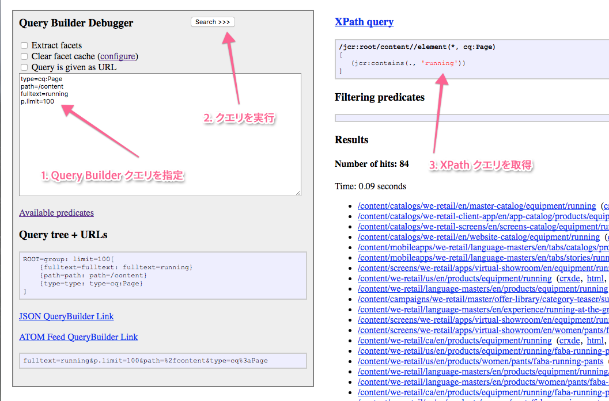

# Query Builder API{#query-builder-api}

[アセット共有の Query Builder](/help/assets/assets-finder-editor.md)の機能は、Java API と REST API を通して公開されます。ここでは、これらの API について説明します。

サーバー側 Query Builder（[`QueryBuilder`](https://helpx.adobe.com/experience-manager/6-5/sites/developing/using/reference-materials/javadoc/com/day/cq/search/QueryBuilder.html)）はクエリの記述を受け入れ、XPath クエリを作成して実行します。オプションで結果セットのフィルタリング、必要に応じてファセットの抽出もおこないます。

クエリの記述は、単に述語（[`Predicate`](https://helpx.adobe.com/experience-manager/6-5/sites/developing/using/reference-materials/javadoc/com/day/cq/search/Predicate.html)）のセットです。例としては、XPathの関数に対応するフルテキスト述語が `jcr:contains()` あります。

各述語タイプに、1 つのエバリュエーターコンポーネント（[`PredicateEvaluator`](https://helpx.adobe.com/experience-manager/6-5/sites/developing/using/reference-materials/javadoc/com/day/cq/search/eval/PredicateEvaluator.html)）があります。これらのコンポーネントは、XPath、フィルタリングおよびファセットの抽出に対してその特定の述語を処理する方法を理解しています。OSGi コンポーネントのランタイムによってプラグインされる、カスタムのエバリュエーターを作成するのは簡単です。

REST API を使用すると、JSON で送信される応答を使用した HTTP によって、まったく同じ機能にアクセスできます。

>[!NOTE]
>
>QueryBuilder API は JCR API を使用して構築されています。また、OSGi バンドル内から JCR API を使用して、Adobe Experience Manager JCR をクエリすることもできます。詳しくは、[JCR API を使用した Adobe Experience Manager データのクエリ](https://helpx.adobe.com/experience-manager/using/querying-experience-manager-data-using1.html)を参照してください。

## Gem セッション {#gem-session}

[AEM Gems](https://helpx.adobe.com/experience-manager/kt/eseminars/gems/aem-index.html) は、アドビの専門家が提供する、Adobe Experience Manager を技術的に深く掘り下げた一連のセッションです。Query Builder 専用のこのセッションは、ツールを大まかに把握したり使用したりするのに非常に便利です。

>[!NOTE]
>
>See the AEM Gem session [Search forms made easy with the AEM querybuilder](https://helpx.adobe.com/experience-manager/kt/eseminars/gems/aem-search-forms-using-querybuilder.html) for a detailed overview of the query builder.

## サンプルクエリ {#sample-queries}

以下のサンプルは、Java プロパティのスタイル表記法で示されています。これらのサンプルを Java API で使用するには、この後の API サンプルのように Java `HashMap` を使用します。

`QueryBuilder` JSON サーブレットについては、各例にローカルの CQ インストールへのリンク（デフォルトは `http://localhost:4502`）が含まれています。これらのリンクを使用する前に、CQ インスタンスにログインする必要があります。

>[!CAUTION]
>
>デフォルトでは、この Query Builder JSON サーブレットは最大 10 件のヒットを表示します。
>
>次のパラメーターを追加すると、サーブレットですべてのクエリ結果を表示できます。
>
>**`p.limit=-1`**

>[!NOTE]
>
>返された JSON データをブラウザーで表示するのに、Firefox 用 JSONView などのプラグインを使用できます。

### すべての結果を返す {#returning-all-results}

以下のクエリは **10 件の結果を返します**（正確には最大 10 件）が、通知されるのは実際に表示可能な&#x200B;**ヒット数**&#x200B;です。

`http://localhost:4502/bin/querybuilder.json?path=/content&1_property=sling:resourceType&1_property.value=foundation/components/text&1_property.operation=like&orderby=path`

```xml
path=/content
1_property=sling:resourceType
1_property.value=foundation/components/text
1_property.operation=like
orderby=path
```

同じクエリで、パラメーター `p.limit=-1` を使用すると、**すべての結果が返されます**（インスタンスによっては非常に多くなることがあります）。

`http://localhost:4502/bin/querybuilder.json?path=/content&1_property=sling:resourceType&1_property.value=foundation/components/text&1_property.operation=like&p.limit=-1&orderby=path`

```xml
path=/content
1_property=sling:resourceType
1_property.value=foundation/components/text
1_property.operation=like
p.limit=-1
orderby=path
```

### p.guessTotal を使用して結果を返す {#using-p-guesstotal-to-return-the-results}

`p.guessTotal` パラメーターの目的は、実用最小限の p.offset 値と p.limit 値を組み合わせることによって、表示できる適切な結果数を返すことです。このパラメーターを使用するメリットは、結果セットが大きい場合にパフォーマンスが向上することです。これにより、総合計の計算（例：result.getSize() の呼び出し）と結果セット全体の読み込みが回避され、OAK エンジンおよびインデックスに至るまですべてが最適化されます。結果が 10 万件ある場合、実行時間とメモリ使用量の両方で大きな変化が見られる可能性があります。

このパラメーターのデメリットは、ユーザーには正確な合計が表示されないことです。ただし、p.guessTotal=1000 のように最小値を設定できるので、1000 件までは必ず読み込まれます。その結果、それより小さな結果セットについては正確な合計を取得できますが、それを超えた場合は「それ以上」ということしかわかりません。

以下のクエリに `p.guessTotal=true` を追加して、どのように機能するかを見てみましょう。

`http://localhost:4502/bin/querybuilder.json?path=/content&1_property=sling:resourceType&1_property.value=foundation/components/text&1_property.operation=like&p.guessTotal=true&orderby=path`

```xml
path=/content
1_property=sling:resourceType
1_property.value=foundation/components/text
1_property.operation=like
p.guessTotal=true
orderby=path
```

このクエリは、`p.limit` のデフォルトである `10` 件の結果をオフセット `0` で返します。

```xml
"success": true,
"results": 10,
"total": 10,
"more": true,
"offset": 0,
```

AEM 6.0 SP2 の時点では、数値を使用してカスタムの最大結果数までカウントアップすることもできます。上述と同じクエリを使用して、`p.guessTotal` の値を `50` に変更してみます。

`http://localhost:4502/bin/querybuilder.json?path=/content&1_property=sling:resourceType&1_property.value=foundation/components/text&1_property.operation=like&p.guessTotal=50&orderby=path`

デフォルトの10件の結果と同じ数値が返され、0件のオフセットが返されますが、表示される結果は最大50件までです。

```xml
"success": true,
"results": 10,
"total": 50,
"more": true,
"offset": 0,
```

### ページネーションの実装 {#implementing-pagination}

デフォルトでは、Query Builder はヒット数も通知します。正確な数を決定するために、アクセス制御を結果ごとに確認するので、結果のサイズによっては長い時間がかかることがあります。合計は、主としてエンドユーザー向け UI のページネーションの実装に使用されます。正確な数の決定には時間がかかることがあるので、guessTotal 機能を使用してページネーションを実装することをお勧めします。

例えば、この UI は以下の手法に適応できます。

* Get and display the accurate count of the number of total hits ([SearchResult.getTotalMatches()](https://helpx.adobe.com/experience-manager/6-5/sites/developing/using/reference-materials/javadoc/com/day/cq/search/result/SearchResult.html#gettotalmatches) or total in the querybuilder.json response) are less than or equal to 100;
* `guessTotal` を 100 に設定して、Query Builder への呼び出しを作成します。

* 応答は、以下のような結果になる可能性があります。

   * `total=43`, `more=false` — 合計ヒット数が43であることを示します。 UI には先頭ページの一部として 10 件の結果が表示され、続く 3 ページのページネーションが提供されます。この実装を使用して、「**43 件の結果が見つかりました**」のような説明テキストを表示することもできます。
   * `total=100`, `more=true` — 合計ヒット数が100を超え、正確な数が不明であることを示します。 UI には先頭ページの一部として 10 件の結果が表示され、続く 10 ページのページネーションが提供されます。この実装を使用して、「**100 件を超える結果が見つかりました**」のようなテキストを表示することもできます。ユーザーが次のページに移動すると、Query Builder への呼び出しによって `guessTotal` の制限と、`offset` パラメーターおよび `limit` パラメーターの制限が増やされます。

UI が無限スクロールを使用する必要がある場合は、Query Builder によって正確なヒット数が決定されないように、`guessTotal` も使用する必要があります。

### jar ファイルを検索して新しい順に並べ替える {#find-jar-files-and-order-them-newest-first}

`http://localhost:4502/bin/querybuilder.json?type=nt:file&nodename=*.jar&orderby=@jcr:content/jcr:lastModified&orderby.sort=desc`

```xml
type=nt:file
nodename=*.jar
orderby=@jcr:content/jcr:lastModified
orderby.sort=desc
```

### すべてのページを検索して最終変更日で並べ替える {#find-all-pages-and-order-them-by-last-modified}

`http://localhost:4502/bin/querybuilder.json?type=cq:Page&orderby=@jcr:content/cq:lastModified`

```xml
type=cq:Page
orderby=@jcr:content/cq:lastModified
```

### すべてのページを検索して最終変更日で降順に並べ替える {#find-all-pages-and-order-them-by-last-modified-but-descending}

`http://localhost:4502/bin/querybuilder.json?type=cq:Page&orderby=@jcr:content/cq:lastModified&orderby.sort=desc]`

```xml
type=cq:Page
orderby=@jcr:content/cq:lastModified
orderby.sort=desc
```

### フルテキスト検索（スコアで並べ替え） {#fulltext-search-ordered-by-score}

`http://localhost:4502/bin/querybuilder.json?fulltext=Management&orderby=@jcr:score&orderby.sort=desc`

```xml
fulltext=Management
orderby=@jcr:score
orderby.sort=desc
```

### 特定のタグ付きページの検索 {#search-for-pages-tagged-with-a-certain-tag}

`http://localhost:4502/bin/querybuilder.json?type=cq:Page&amp;tagid=marketing:interest/product&amp;tagid.property=jcr:content/cq:tags``

```xml
type=cq:Page
tagid=marketing:interest/product
tagid.property=jcr:content/cq:tags
```

Use the `tagid` predicate as in the example if you know the explicit tag ID.

タグタイトルのパス（スペースなし）には、`tag` 述語を使用します。

Because, in the previous example, you are searching for pages ( `cq:Page` nodes), you need to use the relative path from that node for the `tagid.property` predicate, which is `jcr:content/cq:tags`. By default, the `tagid.property` would simply be `cq:tags`.

### Search under multiple paths (using groups) {#search-under-multiple-paths-using-groups}

`http://localhost:4502/bin/querybuilder.json?fulltext=Management&group.1_path=/content/geometrixx/en/company/management&group.2_path=/content/geometrixx/en/company/bod&group.p.or=true`

```xml
fulltext=Management
group.p.or=true
group.1_path=/content/geometrixx/en/company/management
group.2_path=/content/geometrixx/en/company/bod
```

このクエリでは、クエリ内のサブ式を区切る役目を果たす「グループ&#x200B;**」（`group`）を使用しているので、標準の表記法よりも多くの括弧が含まれています。例えば、前の例は、次のように、よりわかりやすいスタイルで表現することができます。

`"Management" and ("/content/geometrixx/en/company/management" or "/content/geometrixx/en/company/bod")`

例にあるグループの内部では、`path` 述語が複数回使用されています。To differentiate and order the two instances of the predicate (ordering is required for some predicates), you must prefix the predicates with *N* `_ where`*N *is the ordering index. In the previous example, the resulting predicates are`1_path`and`2_path`.

The `p` in `p.or` is a special delimiter indicating that what follows (in this case an `or`) is a *parameter* of the group, as opposed to a subpredicate of the group, such as `1_path`.

If no `p.or` is given then all predicates are ANDed together, that is, each result must satisfy all predicates.

>[!NOTE]
>
>異なる述語に対してであっても、単一のクエリ内で同じ数値のプレフィックスを使用することはできません。

### プロパティの検索 {#search-for-properties}

`cq:template` プロパティを使用して、特定のテンプレートのすべてのページを検索できます。

`http://localhost:4502/bin/querybuilder.json?property=cq%3atemplate&property.value=%2fapps%2fgeometrixx%2ftemplates%2fhomepage&type=cq%3aPageContent`

```xml
type=cq:PageContent
property=cq:template
property.value=/apps/geometrixx/templates/homepage
```

これには、ページ自身ではなく、ページの `jcr:content` ノードが返されるという欠点があります。この問題を解決するには、相対パスで検索します。

`http://localhost:4502/bin/querybuilder.json?property=jcr%3acontent%2fcq%3atemplate&property.value=%2fapps%2fgeometrixx%2ftemplates%2fhomepage&type=cq%3aPage`

```xml
type=cq:Page
property=jcr:content/cq:template
property.value=/apps/geometrixx/templates/homepage
```

### 複数のプロパティの検索 {#search-for-multiple-properties}

property 述語を複数回使用する場合、ここでも、数字のプレフィックスを付加する必要があります。

`http://localhost:4502/bin/querybuilder.json?1_property=jcr%3acontent%2fcq%3atemplate&1_property.value=%2fapps%2fgeometrixx%2ftemplates%2fhomepage&2_property=jcr%3acontent%2fjcr%3atitle&2_property.value=English&type=cq%3aPage`

```xml
type=cq:Page
1_property=jcr:content/cq:template
1_property.value=/apps/geometrixx/templates/homepage
2_property=jcr:content/jcr:title
2_property.value=English
```

### プロパティの複数の値の検索 {#search-for-multiple-property-values}

To avoid big groups when you want to search for multiple values of a property ( `"A" or "B" or "C"`), you can provide multiple values to the `property` predicate:

`http://localhost:4502/bin/querybuilder.json?property=jcr%3atitle&property.1_value=Products&property.2_value=Square&property.3_value=Events`

```xml
property=jcr:title
property.1_value=Products
property.2_value=Square
property.3_value=Events
```

For multi-value properties, you can also require that multiple values match ( `"A" and "B" and "C"`):

`http://localhost:4502/bin/querybuilder.json?property=jcr%3atitle&property.and=true&property.1_value=test&property.2_value=foo&property.3_value=bar`

```xml
property=jcr:title
property.and=true
property.1_value=test
property.2_value=foo
property.3_value=bar
```

## 返されるプロパティの絞り込み {#refining-what-is-returned}

デフォルトでは、次の JSON サーブレットは検索結果内の各ノードに関するデフォルトのプロパティのセット（path、name、title など）を返します。QueryBuilder返されるプロパティを制御するために、次のいずれかの操作を実行できます。

指定

```
p.hits=full
```

この場合、各ノードのすべてのプロパティが含まれます。

`http://localhost:4502/bin/querybuilder.json?p.hits=full&property=jcr%3atitle&property.value=Triangle`

```xml
property=jcr:title
property.value=Triangle
p.hits=full
```

使用方法

```
p.hits=selective
```

をクリックし、取得するプロパティを指定します

```
p.properties
```

スペースで区切る：

`http://localhost:4502/bin/querybuilder.json?p.hits=selective&property=jcr%3atitle&property.value=Triangle`

[ `http://localhost:4502/bin/querybuilder.json?`](http://localhost:4502/bin/querybuilder.json?p.hits=selective&p.properties=sling%3aresourceType%20jcr%3aprimaryType&property=jcr%3atitle&property.value=Triangle) [p.hits=selective&amp;](http://localhost:4502/bin/querybuilder.json?p.hits=selective&p.nodedepth=5&p.properties=sling%3aresourceType%20jcr%3apath&property=jcr%3atitle&property.value=Triangle)p.properties=sling%3aresourceType%20jcr%3aprimaryType&amp;property=jcr%3atitle&amp;property.value=Triangle

```xml
property=jcr:title
property.value=Triangle
p.hits=selective
p.properties=sling:resourceType jcr:primaryType
```

他に実行可能な方法として、QueryBuilder 応答に子ノードを含めることができます。これを行うには、

```
p.nodedepth=n
```

は、 `n` 返すレベルの数をクエリに指定します。 子ノードを返すには、プロパティセレクターで子ノードを指定する必要があります

```
p.hits=full
```

例：

`http://localhost:4502/bin/querybuilder.json?p.hits=full&p.nodedepth=5&property=jcr%3atitle&property.value=Triangle`

```xml
property=jcr:title
property.value=Triangle
p.hits=full
p.nodedepth=5
```

## 述語の詳細 {#morepredicates}

述語の詳細については、[Query Builder の述語リファレンスのページ](/help/sites-developing/querybuilder-predicate-reference.md)を参照してください。

You can also check the [Javadoc for the `PredicateEvaluator` classes](https://helpx.adobe.com/experience-manager/6-5/sites/developing/using/reference-materials/javadoc/com/day/cq/search/eval/PredicateEvaluator.html). これらのクラスの Javadoc ドキュメントには、使用できるプロパティのリストが含まれています。

The prefix of the class name (for example, &quot; `similar`&quot; in [`SimilarityPredicateEvaluator`](https://helpx.adobe.com/experience-manager/6-5/sites/developing/using/reference-materials/javadoc/com/day/cq/search/eval/SimilarityPredicateEvaluator.html)) is the *principal property* of the class. このプロパティは、クエリ内で使用する述語の名前（小文字で使用）でもあります。

For such principal properties, you can shorten the query and use &quot; `similar=/content/en`&quot; instead of the fully qualified variant &quot; `similar.similar=/content/en`&quot;. 完全修飾形式は、クラスのプリンシパルプロパティではないすべてのプロパティに対して使用する必要があります。

## Query Builder API の使用例 {#example-query-builder-api-usage}

```java
   String fulltextSearchTerm = "Geometrixx";

    // create query description as hash map (simplest way, same as form post)
    Map<String, String> map = new HashMap<String, String>();

// create query description as hash map (simplest way, same as form post)
    map.put("path", "/content");
    map.put("type", "cq:Page");
    map.put("group.p.or", "true"); // combine this group with OR
    map.put("group.1_fulltext", fulltextSearchTerm);
    map.put("group.1_fulltext.relPath", "jcr:content");
    map.put("group.2_fulltext", fulltextSearchTerm);
    map.put("group.2_fulltext.relPath", "jcr:content/@cq:tags");

    // can be done in map or with Query methods
    map.put("p.offset", "0"); // same as query.setStart(0) below
    map.put("p.limit", "20"); // same as query.setHitsPerPage(20) below

    Query query = builder.createQuery(PredicateGroup.create(map), session);
    query.setStart(0);
    query.setHitsPerPage(20);

    SearchResult result = query.getResult();

    // paging metadata
    int hitsPerPage = result.getHits().size(); // 20 (set above) or lower
    long totalMatches = result.getTotalMatches();
    long offset = result.getStartIndex();
    long numberOfPages = totalMatches / 20;

    //Place the results in XML to return to client
    DocumentBuilderFactory factory =     DocumentBuilderFactory.newInstance();
    DocumentBuilder builder = factory.newDocumentBuilder();
    Document doc = builder.newDocument();

    //Start building the XML to pass back to the AEM client
    Element root = doc.createElement( "results" );
    doc.appendChild( root );

    // iterating over the results
    for (Hit hit : result.getHits()) {
       String path = hit.getPath();

      //Create a result element
      Element resultel = doc.createElement( "result" );
      root.appendChild( resultel );

      Element pathel = doc.createElement( "path" );
      pathel.appendChild( doc.createTextNode(path ) );
      resultel.appendChild( pathel );
    }
```

>[!NOTE]
>
>QueryBuilder API を使用する OSGi バンドルを作成し、その OSGi バンドルを Adobe Experience Manager アプリケーション内で使用する方法については、[Query Builder API を使用する Adobe CQ OSGi バンドルの作成](https://helpx.adobe.com/experience-manager/using/using-query-builder-api.html)を参照してください。

同じクエリが、Query Builder（JSON）サーブレットを使用して HTTP を介して実行されます。

`http://localhost:4502/bin/querybuilder.json?path=/content&type=cq:Page&group.p.or=true&group.1_fulltext=Geometrixx&group.1_fulltext.relPath=jcr:content&group.2_fulltext=Geometrixx&group.2_fulltext.relPath=jcr:content/@cq:tags&p.offset=0&p.limit=20`

## クエリの保存と読み込み {#storing-and-loading-queries}

クエリはリポジトリに保存して後で使用することができます。The `QueryBuilder` provides the `` `storeQuery` method with the following signature:

```java
void storeQuery(Query query, String path, boolean createFile, Session session) throws RepositoryException, IOException;
```

[`QueryBuilder#storeQuery`](https://helpx.adobe.com/experience-manager/6-5/sites/developing/using/reference-materials/javadoc/com/day/cq/search/QueryBuilder.html#storequerycomdaycqsearchqueryjavalangstringbooleanjavaxjcrsession) メソッドを使用すると、指定した `Query` が、`createFile` 引数の値に応じてファイルまたはプロパティとしてリポジトリに保存されます。The following example shows how to save a `Query` to the path `/mypath/getfiles` as a file:

```java
builder.storeQuery(query, "/mypath/getfiles", true, session);
```

以前に保存したクエリはすべて、[`QueryBuilder#loadQuery`](https://helpx.adobe.com/experience-manager/6-5/sites/developing/using/reference-materials/javadoc/com/day/cq/search/QueryBuilder.html#loadqueryjavalangstringjavaxjcrsession) メソッドを使用してリポジトリから読み込むことができます。

```java
Query loadQuery(String path, Session session) throws RepositoryException, IOException
```

For example, a `Query` stored to the path `/mypath/getfiles` can be loaded by the following snippet:

```java
Query loadedQuery = builder.loadQuery("/mypath/getfiles", session);
```

## テストとデバッグ {#testing-and-debugging}

Query Builder のクエリを試してみたり、デバッグしたりする場合は、次の URL にアクセスして、QueryBuilder のデバッガーコンソールを使用できます。

`http://localhost:4502/libs/cq/search/content/querydebug.html`

または、次の URL にアクセスして、QueryBuilder JSON サーブレットを使用することもできます。

`http://localhost:4502/bin/querybuilder.json?path=/tmp`

( `path=/tmp` is only an example).

### デバッグに関する一般的な推奨事項 {#general-debugging-recommendations}

### ログから説明可能な XPath を取得する {#obtain-explain-able-xpath-via-logging}

開発サイクルでは、設定されたターゲットインデックスに対して、**すべての**&#x200B;クエリの説明を実行します。

* QueryBuilder の DEBUG ログを有効にして、基になる説明可能な XPath クエリを取得します。

   * https://&lt;serveraddress>:&lt;serverport>/system/console/slinglogに移動します。 Create a new logger for `com.day.cq.search.impl.builder.QueryImpl` at **DEBUG**.

* 上述のクラスで DEBUG を有効にすると、Query Builder で生成された XPath がログに表示されます。
* 関連する QueryBuilder クエリのログエントリから XPath クエリをコピーします。以下に例を示します。

   * `com.day.cq.search.impl.builder.QueryImpl XPath query: /jcr:root/content//element(*, cq:Page)[(jcr:contains(jcr:content, "Geometrixx") or jcr:contains(jcr:content/@cq:tags, "Geometrixx"))]`

* Paste the XPath query into [Explain Query](/help/sites-administering/operations-dashboard.md#explain-query) as XPath to obtrain the query plan

### Query Builder Debugger を使用して説明可能な XPath を取得する {#obtain-explain-able-xpath-via-the-query-builder-debugger}

* AEM QueryBuilder のデバッガーを使用して、説明可能な XPath クエリを生成します。

開発サイクルでは、設定されたターゲットインデックスに対して、**すべての**&#x200B;クエリの説明を実行します。

**ログから説明可能な XPath を取得する**

* QueryBuilder の DEBUG ログを有効にして、基になる説明可能な XPath クエリを取得します。

   * https://&lt;serveraddress>:&lt;serverport>/system/console/slinglogに移動します。 Create a new logger for `com.day.cq.search.impl.builder.QueryImpl` at **DEBUG**.

* 上述のクラスで DEBUG を有効にすると、Query Builder で生成された XPath がログに表示されます。
* 関連する QueryBuilder クエリのログエントリから XPath クエリをコピーします。以下に例を示します。

   * `com.day.cq.search.impl.builder.QueryImpl XPath query: /jcr:root/content//element(*, cq:Page)[(jcr:contains(jcr:content, "Geometrixx") or jcr:contains(jcr:content/@cq:tags, "Geometrixx"))]`

* Paste the XPath query into [Explain Query](/help/sites-administering/operations-dashboard.md#explain-query) as XPath to obtain the query plan

**Query Builder Debugger を使用して説明可能な XPath を取得する**

* AEM QueryBuilder のデバッガーを使用して、説明可能な XPath クエリを生成します。



1. Query Builder Debugger で Query Buidler クエリを指定します。
1. 検索を実行します。
1. 生成された XPath を取得します。
1. XPathクエリをXPathとしてExplainクエリに貼り付けて、クエリ計画を取得します

>[!NOTE]
>
>Query Builder 以外のクエリ（XPath、JCR-SQL2）は、クエリの説明を実行に直接指定できます。

QueryBuilder でクエリをデバッグする方法の概要については、以下のビデオを参照してください。

>[!NOTE]
>
>[https://www.youtube.com/watch?v=BnyXjhRKYKc](https://www.youtube.com/watch?v=BnyXjhRKYKc)

## ログ出力付きのクエリのデバッグ {#debugging-queries-with-logging}

>[!NOTE]
>
>The configuration of the loggers is described in the section [Creating Your Own Loggers and Writers](/help/sites-deploying/configure-logging.md#creating-your-own-loggers-and-writers).

テストおよびデバッグの際に、記述されたクエリを実行したときの Query Builder 実装のログ出力（情報レベル）：

```xml
com.day.cq.search.impl.builder.QueryImpl executing query (predicate tree):
null=group: limit=20, offset=0[
    {group=group: or=true[
        {1_fulltext=fulltext: fulltext=Geometrixx, relPath=jcr:content}
        {2_fulltext=fulltext: fulltext=Geometrixx, relPath=jcr:content/@cq:tags}
    ]}
    {path=path: path=/content}
    {type=type: type=cq:Page}
]
com.day.cq.search.impl.builder.QueryImpl XPath query: /jcr:root/content//element(*, cq:Page)[(jcr:contains(jcr:content, "Geometrixx") or jcr:contains(jcr:content/@cq:tags, "Geometrixx"))]
com.day.cq.search.impl.builder.QueryImpl no filtering predicates
com.day.cq.search.impl.builder.QueryImpl query execution took 69 ms
```

フィルターをおこなう述語エバリュエーターや、コンパレーターでカスタム順序を使用する述語エバリュエーターを使用するクエリがある場合は、クエリ内にそのことも記述されます。

```xml
com.day.cq.search.impl.builder.QueryImpl executing query (predicate tree):
null=group: [
    {nodename=nodename: nodename=*.jar}
    {orderby=orderby: orderby=@jcr:content/jcr:lastModified}
    {type=type: type=nt:file}
]
com.day.cq.search.impl.builder.QueryImpl custom order by comparator: jcr:content/jcr:lastModified
com.day.cq.search.impl.builder.QueryImpl XPath query: //element(*, nt:file)
com.day.cq.search.impl.builder.QueryImpl filtering predicates: {nodename=nodename: nodename=*.jar}
com.day.cq.search.impl.builder.QueryImpl query execution took 272 ms
```

## Javadoc リンク {#javadoc-links}

| **Javadoc** | **説明** |
|---|---|
| [com.day.cq.search](https://helpx.adobe.com/experience-manager/6-5/sites/developing/using/reference-materials/javadoc/com/day/cq/search/package-summary.html) | 基本の QueryBuilder と Query API |
| [com.day.cq.search.result](https://helpx.adobe.com/experience-manager/6-5/sites/developing/using/reference-materials/javadoc/com/day/cq/search/result/package-summary.html) | Result API |
| [com.day.cq.search.facets](https://helpx.adobe.com/experience-manager/6-5/sites/developing/using/reference-materials/javadoc/com/day/cq/search/facets/package-summary.html) | ファセット |
| [com.day.cq.search.facets.buckets](https://helpx.adobe.com/experience-manager/6-5/sites/developing/using/reference-materials/javadoc/com/day/cq/search/facets/buckets/package-summary.html) | バケット（ファセット内に含まれる） |
| [com.day.cq.search.eval](https://helpx.adobe.com/experience-manager/6-5/sites/developing/using/reference-materials/javadoc/com/day/cq/search/eval/package-summary.html) | 述語エバリュエーター |
| [com.day.cq.search.facets.extractors](https://helpx.adobe.com/experience-manager/6-5/sites/developing/using/reference-materials/javadoc/com/day/cq/search/facets/extractors/package-summary.html) | ファセット抽出（エバリュエーター用） |
| [com.day.cq.search.writer](https://helpx.adobe.com/experience-manager/6-5/sites/developing/using/reference-materials/javadoc/com/day/cq/search/writer/package-summary.html) | QueryBuilder サーブレット（/bin/querybuilder.json）用の JSON 結果ヒットライター |

