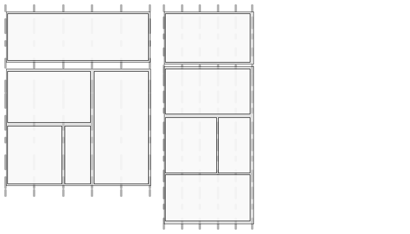

# Web ページのレスポンシブデザイン{#responsive-design-for-web-pages}

>[!NOTE]
>
>単一ページアプリケーションフレームワークにもとづくクライアントサイドレンダリング（_React_ など）が必要なプロジェクトでは、SPA エディターを使用することをお勧めします。[詳細情報](/help/sites-developing/spa-overview.md)を参照してください。

Web ページが表示されるクライアントの表示域に適応するように Web ページをデザインします。レスポンシブデザインを使用すると、同じページを複数のデバイスで、縦、横の両方の向きで効果的に表示できます。次の画像の例は、表示域サイズの変更に対してページがどのように応答するかを示しています。

* レイアウト：表示域が小さい場合は 1 列レイアウトを使用し、表示域が大きい場合は複数列レイアウトを使用します。
* テキストサイズ：表示域が大きい場合は、（見出しなどの適切な箇所で）大きいテキストサイズを使用します。
* コンテンツ：小型デバイスに表示する場合は、重要なコンテンツのみを表示します。
* ナビゲーション：他のページにアクセスするためのデバイス専用のツールを提供します。
* 画像：ウィンドウのサイズに応じて、クライアントの表示域に適した画像レンディションを配信します。


複数のウィンドウサイズと向きに適応可能な HTML5 ページを生成する Adobe Experience Manager（AEM）アプリケーションを開発します。例えば、次のような表示域の幅の範囲が、様々なデバイスタイプと向きに対応します。

* 幅 480 ピクセル以下（携帯電話、縦置き）
* 幅 767 ピクセル以下（携帯電話、横置き）
* 幅 768 ～ 979 ピクセル（タブレット、縦置き）
* 幅 980 ～ 1,199 ピクセル（タブレット、横置き）
* 幅 1,200 ピクセル以上（デスクトップ）

レスポンシブデザインの動作の実装について詳しくは、次のトピックを参照してください。

* [メディアクエリ](/help/sites-developing/responsive.md#using-media-queries)
* [可変グリッド](/help/sites-developing/responsive.md#developing-a-fluid-grid)
* [アダプティブ画像](/help/sites-developing/responsive.md#using-adaptive-images)

デザインの際には、**[!UICONTROL サイドキック]**&#x200B;を使用してページを様々なスクリーンサイズでプレビューします。

## 開発の前に {#before-you-develop}

Web ページをサポートする AEM アプリケーションを開発する前に、デザインについていくつかの決定をおこなう必要があります。例えば、次の情報が必要になります。

* ターゲットとするデバイス。
* ターゲットの表示域サイズ。
* ターゲットの表示域サイズごとのページレイアウト。

### アプリケーション構造 {#application-structure}

以下のような一般的な AEM アプリケーション構造により、すべてのレスポンシブデザイン実装をサポートできます。

* ページコンポーネント：/apps/*application_name*/components 以下に存在
* テンプレート：/apps/*application_name*/templates 以下に存在
* デザイン：/etc/designs 以下に存在

## メディアクエリの使用 {#using-media-queries}

メディアクエリによって、ページレンダリング用の CSS スタイルを選択的に使用できます。AEM 開発ツールおよび機能を使用すれば、アプリケーションでメディアクエリを効果的かつ効率的に実装できます。

W3C グループが、この CSS3 機能と構文について示した、[メディアクエリ](https://www.w3.org/TR/css3-mediaqueries/)に関する推奨事項を提供しています。

### CSS ファイルの作成 {#creating-the-css-file}

CSS ファイルでは、ターゲットとしているデバイスのプロパティにもとづいてメディアクエリを定義します。以下の実装方法は、各メディアクエリのスタイルを管理するのに効果的です。

* ClientLibraryFolder を使用して、ページのレンダリング時に組み立てられる CSS を定義します。
* 各メディアクエリおよび関連するスタイルを、それぞれ個別の CSS ファイルで定義します。メディアクエリのデバイスの特徴を表したファイル名を使用すると便利です。
* すべてのデバイスに共通するスタイルを、個別の 1 つの CSS ファイルで定義します。
* ClientLibraryFolder の css.txt ファイルで、組み立てられた CSS ファイル内で必要とされる順に CSS ファイルを並べます。

We.Retail Media サンプルではこの実装方法を使用して、サイトデザインのスタイルを定義しています。We.Retail で使用される CSS ファイルは `*/apps/weretail/clientlibs/clientlib-site/less/grid.less` にあります。

以下の表に、css 子フォルダー内のファイルを示します。

<table>
 <tbody>
  <tr>
   <th>ファイル名</th>
   <th>説明</th>
   <th>メディアクエリ</th>
  </tr>
  <tr>
   <td>style.css</td>
   <td>共通のスタイル。</td>
   <td>該当なし</td>
  </tr>
  <tr>
   <td>bootstrap.css</td>
   <td>共通のスタイル（Twitter Bootstrap による定義）。</td>
   <td>該当なし</td>
  </tr>
  <tr>
   <td>responsive-1200px.css</td>
   <td>幅 1,200 ピクセル以上のすべてのメディア用のスタイル。</td>
   <td><p>@media (min-width: 1200px) {<br /> ...<br /> }</p> </td>
  </tr>
  <tr>
   <td>responsive-980px-1199px.css</td>
   <td>幅 980 ～ 1,199 ピクセルのメディア用のスタイル。</td>
   <td><p>@media (min-width: 980px) and (max-width: 1199px) {<br /> ...<br /> }</p> </td>
  </tr>
  <tr>
   <td>responsive-768px-979px.css</td>
   <td>幅 768 ～ 979 ピクセルのメディア用のスタイル。 </td>
   <td><p>@media (min-width: 768px) and (max-width: 979px) {<br /> ...<br /> }</p> </td>
  </tr>
  <tr>
   <td>responsive-767px-max.css</td>
   <td>幅 768 ピクセル未満のすべてのメディア用のスタイル。</td>
   <td><p>@media (max-width: 767px) {<br /> ...<br /> }</p> </td>
  </tr>
  <tr>
   <td>responsive-480px.css</td>
   <td>幅 481 ピクセル未満のすべてのメディア用のスタイル。</td>
   <td>@media (max-width: 480) {<br /> ...<br /> }</td>
  </tr>
 </tbody>
</table>

`/etc/designs/weretail/clientlibs` フォルダー内の css.txt ファイルには、このクライアントライブラリフォルダーに含まれる CSS ファイルの一覧が記載されています。ファイルの記載順序により、スタイルの優先順位が実装されます。スタイルは、デバイスのサイズが小さくなるほど特化されます。

`#base=css`

```
style.css
 bootstrap.css
```

```
responsive-1200px.css
 responsive-980px-1199px.css
 responsive-768px-979px.css
 responsive-767px-max.css
 responsive-480px.css
```

**ヒント**：わかりやすいファイル名を使用することで、ターゲットの表示域サイズを容易に識別できます。

### AEM ページでのメディアクエリの使用 {#using-media-queries-with-aem-pages}

ページコンポーネントの JSP スクリプトにクライアントライブラリフォルダーを含めることで、メディアクエリを含む CSS ファイルを生成し、そのファイルを参照できます。

```xml
<ui:includeClientLib categories="apps.weretail.all"/>
```

>[!NOTE]
>
>`apps.weretail.all` クライアントライブラリフォルダーに clientlibs ライブラリが組み込まれています。

この JSP スクリプトにより、スタイルシートを参照する以下の HTML コードが生成されます。

```xml
<link rel="stylesheet" href="/etc/designs/weretail/clientlibs-all.css" type="text/css">
<link href="/etc/designs/weretail.css" rel="stylesheet" type="text/css">
```

## 特定のデバイスのプレビュー {#previewing-for-specific-devices}

異なる表示域サイズでページのプレビューを参照して、レスポンシブデザインの動作をテストします。**[!UICONTROL プレビュー]**&#x200B;モードでは、**[!UICONTROL サイドキック]**&#x200B;に「**[!UICONTROL デバイス]**」ドロップダウンメニューが表示されます。このドロップダウンメニューを使用して、デバイスを選択します。デバイスを選択すると、その表示域サイズに合わせてページが変更されます。


**[!UICONTROL サイドキック]**&#x200B;でデバイスのプレビューを有効にするには、ページと **[!UICONTROL MobileEmulatorProvider]** サービスを設定する必要があります。別のページ設定で、「**[!UICONTROL デバイス]**」リストに表示されるデバイスのリストを制御します。

### 「デバイス」リストの追加 {#adding-the-devices-list}

 ページに&#x200B;**[!UICONTROL デバイス]**&#x200B;リストをレンダリングする JSP スクリプトが含まれる場合、**[!UICONTROL デバイス]**&#x200B;リストが&#x200B;**[!UICONTROL サイドキック]**&#x200B;に表示されます。**[!UICONTROL デバイス]**&#x200B;リストを&#x200B;**[!UICONTROL サイドキック]**&#x200B;に追加するには、ページの `head` セクションに `/libs/wcm/mobile/components/simulator/simulator.jsp` スクリプトを含めます。

`head` セクションを定義する JSP で次のコードを含めます。

`<cq:include script="/libs/wcm/mobile/components/simulator/simulator.jsp"/>`

例を参照するには、CRXDE Lite で `/apps/weretail/components/page/head.jsp` ファイルを開きます。

### シミュレーション用のページコンポーネントの登録 {#registering-page-components-for-simulation}

デバイスシミュレーターを有効にしてページで使用できるようにするには、MobileEmulatorProvider ファクトリサービスでページコンポーネントを登録して `mobile.resourceTypes` プロパティを定義します。

AEM と連携する場合は、いくつかの方法でこのようなサービスの設定を管理できます。詳しくは、[OSGi の設定](/help/sites-deploying/configuring-osgi.md)を参照してください。

例えば、アプリケーションで ` [sling:OsgiConfig](/help/sites-deploying/configuring-osgi.md#adding-a-new-configuration-to-the-repository)` ノードを作成するには、次のように設定します。

* 親フォルダー：`/apps/application_name/config`
* 名前：`com.day.cq.wcm.mobile.core.impl.MobileEmulatorProvider-*alias*`

   MobileEmulatorProvider サービスがファクトリサービスであるので、- `*alias*` サフィックスは必須です。このファクトリで一意となる任意のエイリアスを使用します。

* jcr:primaryType: `sling:OsgiConfig`

次のノードプロパティを追加します。

* 名前：`mobile.resourceTypes`
* 型：`String[]`
* 値：Web ページをレンダリングするページコンポーネントへのパス。例えば、geometrixx-media アプリケーションでは次の値を使用します。

   ```
   geometrixx-media/components/page
    geometrixx-unlimited/components/pages/page
    geometrixx-unlimited/components/pages/coverpage
    geometrixx-unlimited/components/pages/issue
   ```

### デバイスグループの指定 {#specifying-the-device-groups}

「デバイス」リストに表示されるデバイスグループを指定するには、`cq:deviceGroups` プロパティをサイトのルートページの `jcr:content` ノードに追加します。プロパティの値は、デバイスグループノードへのパスの配列です。

デバイスグループノードは `/etc/mobile/groups` フォルダー内にあります。

例えば、Geometrixx Media サイトのルートページは `/content/geometrixx-media` です。`/content/geometrixx-media/jcr:content` ノードには次のプロパティがあります。

* 名前：`cq:deviceGroups`
* タイプ：`String[]`
* 値：`/etc/mobile/groups/responsive`

[デバイスグループを作成および編集する](/help/sites-developing/groupfilters.md)には、ツールコンソールを使用します。

>[!NOTE]
>
>レスポンシブデザインに使用するデバイスグループについては、「一般」タブでデバイスグループを編集して、「エミュレーターを無効にする」を選択します。このオプションによって、レスポンシブデザインに関係のないエミュレーターカルーセルが表示されなくなります。

## アダプティブ画像の使用 {#using-adaptive-images}

メディアクエリを使用して、ページに表示する画像リソースを選択できます。ただし、使用条件の設定にメディアクエリを使用しているすべてのリソースがクライアントにダウンロードされます。メディアクエリは、ダウンロードされたリソースが表示されるかどうかを決定するものに過ぎません。

画像などの大きいリソースの場合、すべてのリソースをダウンロードするとなると、クライアントのデータパイプラインを効率的に使用しているとは言えません。リソースを選択的にダウンロードするには、JavaScript を使用してリソース要求を開始してから、メディアクエリでリソースの選択を実行するようにします。

次の方法では、メディアクエリを使用して選択されたリソースが 1 つだけ読み込まれます。

1. リソースの各バージョンに対して DIV 要素を追加します。リソースの URI を属性値として追加します。ブラウザーには、この属性がリソースとして解釈されません。
1. リソースとして該当する各 DIV 要素にメディアクエリを追加します。
1. ドキュメントの読み込み時またはウィンドウのサイズ変更時に、JavaScript コードによって各 DIV 要素のメディアクエリが評価されます。
1. クエリの結果に基づいて、追加するリソースが決定されます。
1. そのリソースを参照する HTML 要素が DOM に挿入されます。

### JavaScript を使用したメディアクエリの評価 {#evaluating-media-queries-using-javascript}

W3C により定義されている [MediaQueryList インターフェイス](https://dev.w3.org/csswg/cssom-view/#the-mediaquerylist-interface)の実装では、JavaScript を使用してメディアクエリを評価できます。メディアクエリの結果にロジックを適用して、現在のウィンドウ用にターゲットされたスクリプトを実行できます。

* MediaQueryList インターフェイスを実装するブラウザーは `window.matchMedia()` 関数をサポートします。この関数は、指定された文字列に対してメディアクエリをテストします。この関数は、クエリ結果へのアクセスを提供する `MediaQueryList` オブジェクトを返します。

* このインターフェイスを実装していないブラウザーの場合は、`matchMedia()` のポリフィル（無料で利用できる JavaScript ライブラリの [matchMedia.js](https://github.com/paulirish/matchMedia.js) など）を使用できます。

#### メディア特有のリソースの選択 {#selecting-media-specific-resources}

W3C で提言されている [picture 要素](https://picture.responsiveimages.org/)では、メディアクエリを使用して画像要素用のソースを決定します。picture 要素では、要素の属性を使用してメディアクエリを画像パスに関連付けます。

無料で利用可能な [picturefill.js ライブラリ](https://github.com/scottjehl/picturefill)は、提案された `picture` 要素と同様の機能を提供し、同様の戦略を使用します。picturefill.js ライブラリは `window.matchMedia` を呼び出して、一連の `div` 要素に対して定義されているメディアクエリを評価します。また、各 `div` 要素は、Image Source を指定します。Source は、`div` 要素のメディアクエリが `true` を返す際に使用されます。

`picturefill.js` ライブラリを使用するには、次の例のような HTML コードが必要になります。

```xml
<div data-picture>
    <div data-src='path to default image'></div>
    <div data-src='path to small image'    data-media="(media query for phone)"></div>
    <div data-src='path to medium image'   data-media="(media query for tablet)"></div>
    <div data-src='path to large image'     data-media="(media query for monitor)"></div>
</div>
```

ページがレンダリングされる際に、picturefull.js は次のように `<div data-picture>` 要素を`img` 要素の最後の子として挿入します。

```xml
<div data-picture>
    <div data-src='path to default image'></div>
    <div data-src='path to small image'    data-media="(media query for phone)"></div>
    <div data-src='path to medium image'   data-media="(media query for tablet)"></div>
    <div data-src='path to large image'     data-media="(media query for monitor)"></div>
    
</div>
```

AEM ページでは、`data-src` 属性の値は、リポジトリ内のリソースへのパスを表します。

### AEM でのアダプティブ画像の実装 {#implementing-adaptive-images-in-aem}

AEM アプリケーションでアダプティブ画像を実装するには、必要な JavaScript ライブラリを追加し、ページに必要な HTML マークアップを含める必要があります。

**ライブラリ**

次の JavaScript ライブラリを取得し、クライアントライブラリフォルダーに格納します。

* [matchMedia.js](https://github.com/paulirish/matchMedia.js)（MediaQueryList インターフェイスを実装していないブラウザー用）
* [picturefill.js](https://github.com/scottjehl/picturefill)
* jquery.js（`/etc/clientlibs/granite/jquery` クライアントライブラリフォルダー（カテゴリ= jquery）で利用可能
* [jquery.debouncedresize.js](https://github.com/louisremi/jquery-smartresize)（ウィンドウのサイズ変更後に一度発生する jquery イベント）

**ヒント：**&#x200B;複数のクライアントライブラリフォルダーは、[埋め込み](/help/sites-developing/clientlibs.md#embedding-code-from-other-libraries)をすることによって自動的に連結できます。

**HTML**

picturefill.js コードが必要とする必須 div 要素を生成するコンポーネントを作成します。AEM ページでは、data-src 属性の値は、リポジトリ内のリソースへのパスになります。例えば、ページコンポーネントは、DAM での画像レンディション用のメディアクエリと関連パスをハードコーディングできます。または、作成者が画像レンディションを選択したり実行時のレンダリングオプションを指定したりできる、カスタムの画像コンポーネントを作成します。

次の HTML の例では、同じ画像の 2 つの DAM レンディションから選択されます。

```xml
<div data-picture>
    <div data-src='/content/dam/geometrixx-media/articles/meridien.png'></div>
    <div data-src='/content/dam/geometrixx-media/articles/meridien.png/jcr:content/renditions/cq5dam.thumbnail.319.319.png'    data-media="(min-width: 769px)"></div>
    <div data-src='/content/dam/geometrixx-media/articles/meridien.png/jcr:content/renditions/cq5dam.thumbnail.140.100.png'   data-media="(min-width: 481px)"></div>
</div>
```

>[!NOTE]
>
>アダプティブ画像基盤コンポーネントは、次の場所でアダプティブ画像を実装します。
>
>* クライアントライブラリフォルダー：`/libs/foundation/components/adaptiveimage/clientlibs`
>* HTML を生成するスクリプト：`/libs/foundation/components/adaptiveimage/adaptiveimage.jsp`
>
>次節では、このコンポーネントの詳細について説明します。

### AEM の画像レンダリングについて {#understanding-image-rendering-in-aem}

画像レンダリングをカスタマイズするには、静的画像レンダリングの AEM デフォルト実装を理解する必要があります。AEM は画像コンポーネントと画像レンダリングサーブレットを提供しており、これらが連携して Web ページ用の画像をレンダリングします。ページの段落システムに画像コンポーネントが含まれる場合に、次の一連のイベントが発生します。

1. オーサリング：作成者は画像コンポーネントを編集し、HTML ページに含める画像ファイルを指定します。このファイルパスが、その画像コンポーネントノードのプロパティ値として格納されます。
1. ページの要求：ページコンポーネントの JSP により HTML コードが生成されます。画像コンポーネントの JSP により img 要素が生成され、この要素がページに追加されます。
1. 画像の要求：Web ブラウザーがページを読み込み、img 要素の src 属性に従って画像を要求します。
1. 画像レンダリング：画像レンダリングサーブレットが Web ブラウザーに画像を返します。


例えば、画像コンポーネントの JSP により、次のような HTML 要素が生成されます。

``

ブラウザーがページを読み込むときに、src 属性の値を URL として使用して画像を要求します。Sling によりこの URL が次のように分解されます。

* リソース：`/content/mywebsite/en/_jcr_content/par/image_0`
* ファイル名拡張子：`.jpg`
* セレクター：`img`
* サフィックス：`1358372073597.jpg`

`image_0` ノードの `jcr:resourceType` 値は `foundation/components/image` で、`sling:resourceSuperType` 値は `foundation/components/parbase` です。parbase コンポーネントには、セレクターとリクエスト URL のファイル名拡張子に一致する img.GET.java スクリプトが含まれています。CQ はこのスクリプト（サーブレット）を使用して画像をレンダリングします。

このスクリプトのソースコードを参照するには、CRXDE Lite を使用して `/libs/foundation/components/parbase/img.GET.java`
ファイルを開いてください。

## 現在の表示域サイズに合わせた画像の拡大／縮小 {#scaling-images-for-the-current-viewport-size}

クライアントの表示域の特性に合わせて画像を実行時に拡大縮小し、レスポンシブデザインの原則に従った画像を配信します。静的画像レンダリングと同じ、サーブレットとオーサリングコンポーネントによるデザインパターンを使用します。

コンポーネントは次のタスクを実行する必要があります。

* 画像リソースのパスと必要なサイズをプロパティ値として保存します。
* メディアセレクターと画像レンダリング用のサービス呼び出しを含む `div` 要素を生成します。

>[!NOTE]
>
>Web クライアントは matchMedia および Picturefill JavaScript ライブラリ（またはこれらと同様のライブラリ）を使用してメディアセレクターを評価します。

画像要求を処理するサーブレットは、次のタスクを実行する必要があります。

* コンポーネントのプロパティから画像のパスとサイズを取得します。
* プロパティに従って画像の拡大縮小をおこない、画像を返します。

**利用できるソリューション**

AEM により、ユーザーが利用または拡張できる次の実装がインストールされます。

* メディアクエリを生成するアダプティブ画像基盤コンポーネント、および画像の拡大縮小をおこなう Adaptive Image Component Servlet への HTTP 要求
* Geometrixx Commons パッケージによりインストールされる、画像の解像度を変更するための Image Reference Modification Servlet サンプルサーブレット

### アダプティブ画像コンポーネントについて {#understanding-the-adaptive-image-component}

アダプティブ画像コンポーネントは、デバイス画面に応じてサイズ変更される画像をレンダリングするためのアダプティブ画像コンポーネントサーブレットへの呼び出しを生成します。このコンポーネントには次のリソースが含まれています。

* JSP：メディアクエリと Adaptive Image Component Servlet への呼び出しを関連付ける div 要素を追加します。
* クライアントライブラリ：clientlib フォルダーは、matchMedia polyfill JavaScript ライブラリと変更後の Picturefill JavaScript ライブラリをアセンブリする `cq:ClientLibraryFolder` です。
* 編集ダイアログボックス：`cq:editConfig` ノードは、ドロップターゲットで基盤画像コンポーネントではなくアダプティブ画像コンポーネントが作成されるように、CQ 基盤画像コンポーネントをオーバーライドします。

#### DIV 要素の追加 {#adding-the-div-elements}

adaptive-image.jsp スクリプトには div 要素とメディアクエリを生成する次のコードが含まれています。

```
<div data-picture data-alt='<%= alt %>'>
    <div data-src='<%= path + ".img.320.low." + extension + suffix %>'       data-media="(min-width: 1px)"></div>                                        <%-- Small mobile --%>
    <div data-src='<%= path + ".img.320.medium." + extension + suffix %>'    data-media="(min-width: 320px)"></div>  <%-- Portrait mobile --%>
    <div data-src='<%= path + ".img.480.medium." + extension + suffix %>'    data-media="(min-width: 321px)"></div>  <%-- Landscape mobile --%>
    <div data-src='<%= path + ".img.476.high." + extension + suffix %>'      data-media="(min-width: 481px)"></div>   <%-- Portrait iPad --%>
    <div data-src='<%= path + ".img.620.high." + extension + suffix %>'      data-media="(min-width: 769px)"></div>  <%-- Landscape iPad --%>
    <div data-src='<%= path + ".img.full.high." + extension + suffix %>'     data-media="(min-width: 1025px)"></div> <%-- Desktop --%>

    <%-- Fallback content for non-JS browsers. Same img src as the initial, unqualified source element. --%>
    <noscript>
        ' alt='<%= alt %>'>
    </noscript>
</div>
```

`path` 変数には、現在のリソース（adaptive-image コンポーネントノード）のパスが含まれています。このコードにより、次の構造を持つ一連の `div` 要素が生成されます。

`<div data-scr = "*path-to-parent-node*.adaptive-image.adapt.*width*.*quality*.jpg" data-media="*media query*"></div>`

`data-scr` 属性の値は、Sling が画像をレンダリングするアダプティブ画像コンポーネントサーブレットに解決する URL です。data-media 属性には、クライアントプロパティに対して評価されるメディアクエリが含まれます。

次の HTML コードは、JSP によって生成される `div` 要素の例です。

```xml
<div data-src='/content/geometrixx-media/en/events/the-lineup-you-ve-been-waiting-for/jcr:content/article-content-par/adaptive_image.adapt.320.low.jpg'></div>
    <div data-src='/content/geometrixx-media/en/events/the-lineup-you-ve-been-waiting-for/jcr:content/article-content-par/adaptive_image.adapt.320.medium.jpg'    data-media="(min-width: 320px)"></div>
    <div data-src='/content/geometrixx-media/en/events/the-lineup-you-ve-been-waiting-for/jcr:content/article-content-par/adaptive_image.adapt.480.medium.jpg'    data-media="(min-width: 321px)"></div>
    <div data-src='/content/geometrixx-media/en/events/the-lineup-you-ve-been-waiting-for/jcr:content/article-content-par/adaptive_image.adapt.476.high.jpg'     data-media="(min-width: 481px)"></div>
    <div data-src='/content/geometrixx-media/en/events/the-lineup-you-ve-been-waiting-for/jcr:content/article-content-par/adaptive_image.adapt.620.high.jpg'     data-media="(min-width: 769px)"></div>
    <div data-src='/content/geometrixx-media/en/events/the-lineup-you-ve-been-waiting-for/jcr:content/article-content-par/adaptive_image.adapt.full.high.jpg'     data-media="(min-width: 1025px)"></div>
```

#### 画像サイズセレクターの変更 {#changing-the-image-size-selectors}

アダプティブ画像コンポーネントをカスタマイズし、幅セレクターを変更する場合は、その幅をサポートするように Adaptive Image Component Servlet を設定する必要もあります。

### Adaptive Image Component Servlet について {#understanding-the-adaptive-image-component-servlet}

アダプティブ画像コンポーネントサーブレットは、指定された幅に応じて JPEG 画像のサイズを変更し、JPEG 画質を設定します。

#### アダプティブ画像コンポーネントサーブレットのインターフェイス {#the-interface-of-the-adaptive-image-component-servlet}

アダプティブ画像コンポーネントサーブレットは、デフォルトの Sling サーブレットにバインドされ、.jpg、.jpeg、.gif および .png ファイル拡張子をサポートします。このサーブレットのセレクターは img です。

>[!CAUTION]
>
>アダプティブレンディション用のアニメーション .gif ファイルは AEM でサポートされていません。

そのため、Sling は次の形式の HTTP リクエスト URL をこのサーブレットに解決します。

`*path-to-node*.img.*extension*`

例えば、Sling は URL が `http://localhost:4502/content/geometrixx/adaptiveImage.img.jpg` の HTTP リクエストをアダプティブ画像コンポーネントサーブレットに転送します。

2 つの追加セレクターにより、要求される画像の幅と JPEG 画質を指定します。次の例では、幅 480 ピクセルで中程度の画質の画像を要求します。

`http://localhost:4502/content/geometrixx/adaptiveImage.adapt.480.MEDIUM.jpg`

**サポートされている画像プロパティ**

このサーブレットは、有限個の画像の幅と画質を受け入れます。次の幅はデフォルトでサポートされています（ピクセル単位）。

* full
* 320
* 480
* 476
* 620

full 値は、拡大縮小しないことを示します。

JPEG 画質については、次の値がサポートされています。

* LOW
* MEDIUM
* HIGH

対応する数値はそれぞれ、0.4、0.82、1.0 です。

**サポートされているデフォルトの幅の変更**

Web コンソール（[http://localhost:4502/system/console/configMgr](http://localhost:4502/system/console/configMgr)）または sling:OsgiConfig ノードを使用して、Adobe CQ Adaptive Image Component Servlet でサポートされる幅を設定します。

AEM サービスの設定方法について詳しくは、[OSGi の設定](/help/sites-deploying/configuring-osgi.md)を参照してください。

<table>
 <tbody>
  <tr>
   <th> </th>
   <th>Web コンソール</th>
   <th>sling:OsgiConfig</th>
  </tr>
  <tr>
   <th>サービスまたはノード名</th>
   <td>「設定」タブのサービス名：Adobe CQ Adaptive Image Component Servlet</td>
   <td>com.day.cq.wcm.foundation.impl.AdaptiveImageComponentServlet</td>
  </tr>
  <tr>
   <th>プロパティ</th>
   <td><p>サポートされる幅</p>
    <ul>
     <li>サポートされる幅を追加するには、+ ボタンをクリックし、正の整数を入力します。</li>
     <li>サポートされる幅を削除するには、該当する項目の「-」ボタンをクリックします。</li>
     <li>サポートされる幅を変更するには、フィールド値を編集します。</li>
    </ul> </td>
   <td><p>adapt.supported.widths</p>
    <ul>
     <li>このプロパティは複数値の String です。</li>
    </ul> </td>
  </tr>
 </tbody>
</table>

#### 実装の詳細 {#implementation-details}

`com.day.cq.wcm.foundation.impl.AdaptiveImageComponentServlet` クラスは、[AbstractImageServlet](https://helpx.adobe.com/experience-manager/6-5/sites/developing/using/reference-materials/javadoc/com/day/cq/wcm/commons/AbstractImageServlet.html) クラスを拡張します。AdaptiveImageComponentServlet のソースコードは、`/libs/foundation/src/impl/src/com/day/cq/wcm/foundation/impl` フォルダーにあります。

このクラスは、Felix SCR アノテーションを使用して、サーブレットが関連付けられるリソースタイプとファイル拡張子および 1 つ目のセレクターの名前を設定します。

```java
@Component(metatype = true, label = "Adobe CQ Adaptive Image Component Servlet",
        description = "Render adaptive images in a variety of qualities")
@Service
@Properties(value = {
    @Property(name = "sling.servlet.resourceTypes", value = "foundation/components/adaptiveimage", propertyPrivate = true),
    @Property(name = "sling.servlet.selectors", value = "img", propertyPrivate = true),
    @Property(name = "sling.servlet.extensions", value ={
            "jpg",
            "jpeg",
            "png",
            "gif"
    }, propertyPrivate = true)
})
```

このサーブレットは Property SCR アノテーションを使用して、サポートされるデフォルトの画質と画像サイズを設定します。

```java
@Property(value = {
            "320", // iPhone portrait
            "480", // iPhone landscape
            "476", // iPad portrait
            "620" // iPad landscape
    },
            label = "Supported Widths",
            description = "List of widths this component is permitted to generate.")
```

`AbstractImageServlet` クラスは、HTTP リクエストを処理する `doGet` メソッドを提供します。このメソッドは、リクエストに関連付けられるリソースを決定し、リポジトリからリソースのプロパティを取得し、それらのプロパティを [ImageContext](https://helpx.adobe.com/experience-manager/6-5/sites/developing/using/reference-materials/javadoc/com/day/cq/wcm/commons/AbstractImageServlet.ImageContext.html) オブジェクトに返します。

>[!NOTE]
>
>[com.day.cq.commons.DownloadResource](https://helpx.adobe.com/experience-manager/6-5/sites/developing/using/reference-materials/javadoc/com/day/cq/commons/DownloadResource.html) クラスは、リソースの `fileReference` プロパティの値を取得する `getFileReference method` を提供します。

`AdaptiveImageComponentServlet` クラスは、`createLayer` メソッドをオーバーライドします。このメソッドは、`ImageContext` オブジェクトから画像リソースのパスとリクエストされた画像幅を取得します。その後、実際の画像の拡大／縮小を実行する `info.geometrixx.commons.impl.AdaptiveImageHelper` クラスのメソッドを呼び出します。

AdaptiveImageComponentServlet クラスは、writeLayer メソッドもオーバーライドします。このメソッドでは、JPEG 画質が画像に適用されます。

### Image Reference Modification Servlet（Geometrixx Common） {#image-reference-modification-servlet-geometrixx-common}

サンプルの Image Reference Modification Servlet は、Web ページ上の画像の拡大縮小をおこなうために、img 要素のサイズ関連属性を生成します。

#### サーブレットの呼び出し {#calling-the-servlet}

このサーブレットは `cq:page` リソースにバインドされ、.jpg ファイル拡張子をサポートします。このサーブレットのセレクターは `image` です。そのため、Sling は、このサーブレットで以下の形式の HTTP リクエスト URL を解決します。

`path-to-page-node.image.jpg`

例えば、Sling は URL が `http://localhost:4502/content/geometrixx/en.image.jpg` である HTTP リクエストを Image Reference Modification Servlet に転送します。

3 つの追加セレクターにより、要求される画像の幅、高さおよび画質（任意）を指定します。以下の例では、幅 770 ピクセル、高さ 360 ピクセルで中程度の画質の画像を要求します。

`http://localhost:4502/content/geometrixx/en.image.770.360.MEDIUM.jpg`

**サポートされている画像プロパティ**

このサーブレットは、有限個の画像サイズと画質の値を受け入れます。

次の値はデフォルトでサポートされています（幅 x 高さ）。

* 256 x 192
* 370 x 150
* 480 x 200
* 127 x 127
* 770 x 360
* 620 x 290
* 480 x 225
* 320 x 150
* 375 x 175
* 303 x 142
* 1170 x 400
* 940 x 340
* 770 x 300
* 480 x 190

画質については、次の値がサポートされています。

* LOW
* MEDIUM
* HIGH

AEM と連携する場合は、いくつかの方法でこのようなサービスの設定を管理できます。詳しくは、[OSGi の設定](/help/sites-deploying/configuring-osgi.md)を参照してください。

#### 画像リソースの指定 {#specifying-the-image-resource}

画像のパス、サイズおよび画質の値は、リポジトリ内のノードのプロパティとして格納する必要があります。

* ノード名は `image` です。
* 親ノードは `cq:page` リソースの `jcr:content` ノードです。

* 画像のパスは、`fileReference` というプロパティの値として格納します。

ページをオーサリングする際には、以下のように&#x200B;**サイドキック**&#x200B;を使用して画像を指定し、ページのプロパティに `image` ノードを追加します。

1. **サイドキック**&#x200B;で「**ページ**」タブをクリックし、「**ページのプロパティ**」をクリックします。
1. 「**画像**」タブをクリックし、画像を指定します。
1. 「**OK**」をクリックします。

#### 実装の詳細 {#implementation-details-1}

info.geometrixx.commons.impl.servlets.ImageReferenceModificationServlet クラスは、[AbstractImageServlet](https://helpx.adobe.com/experience-manager/6-5/sites/developing/using/reference-materials/javadoc/com/day/cq/wcm/commons/AbstractImageServlet.html) クラスを拡張します。cq-geometrixx-commons-pkg パッケージがインストールされている場合、ImageReferenceModificationServlet のソースコードは `/apps/geometrixx-commons/src/core/src/main/java/info/geometrixx/commons/impl/servlets` フォルダーにあります。

このクラスは、Felix SCR アノテーションを使用して、サーブレットが関連付けられるリソースタイプとファイル拡張子および 1 つ目のセレクターの名前を設定します。

```java
@Component(metatype = true, label = "Adobe CQ Image Reference Modification Servlet",
        description = "Render the image associated with a page in a variety of dimensions and qualities")
@Service
@Properties(value = {
    @Property(name = "sling.servlet.resourceTypes", value = NameConstants.NT_PAGE, propertyPrivate = true),
    @Property(name = "sling.servlet.selectors", value = "image", propertyPrivate = true),
    @Property(name = "sling.servlet.extensions", value = "jpg", propertyPrivate = true)
})
```

このサーブレットは Property SCR アノテーションを使用して、サポートされるデフォルトの画質と画像サイズを設定します。

```java
@Property(label = "Image Quality",
            description = "Quality must be a double between 0.0 and 1.0", value = "0.82")
@Property(value = {
                "256x192", // Category page article list images
                "370x150", // "Most popular" desktop & iPad & carousel min-width: 1px
                "480x200", // "Most popular" phone
                "127x127", // article summary phone square images
                "770x360", // article summary, desktop
                "620x290", // article summary, tablet
                "480x225", // article summary, phone (landscape)
                "320x150", // article summary, phone (portrait) and fallback
                "375x175", // 2-column article summary, desktop
                "303x142", // 2-column article summary, tablet
                "1170x400", // carousel, full
                "940x340",  // carousel min-width: 980px
                "770x300",  // carousel min-width: 768px
                "480x190"   // carousel min-width: 480px
            },
            label = "Supported Resolutions",
            description = "List of resolutions this component is permitted to generate.")
```

`AbstractImageServlet` クラスには、HTTP リクエストを処理する `doGet` メソッドが含まれます。このメソッドは、呼び出しに関連付けられるリソースを決定し、リポジトリからリソースのプロパティを取得して、[ImageContext](https://helpx.adobe.com/experience-manager/6-5/sites/developing/using/reference-materials/javadoc/com/day/cq/wcm/commons/AbstractImageServlet.ImageContext.html) オブジェクトにそれらのプロパティを保存します。

`ImageReferenceModificationServlet` クラスは、`createLayer` メソッドをオーバーライドし、レンダリングする画像リソースを決定するロジックを実装します。このメソッドは、該当するページで `jcr:content` ノードの子ノード（`image`）を取得します。[画像](https://helpx.adobe.com/jp/experience-manager/6-5/sites/developing/using/reference-materials/javadoc/com/day/cq/wcm/foundation/Image.html) オブジェクトはこの `image` ノードから作成され、`getFileReference` メソッドは、画像ノードの `fileReference` プロパティから画像ファイルへのパスを返します。

>[!NOTE]
>[com.day.cq.commons.DownloadResource](https://helpx.adobe.com/experience-manager/6-5/sites/developing/using/reference-materials/javadoc/com/day/cq/commons/DownloadResource.html) クラスには getFileReference メソッドが含まれます。

## 可変グリッドの開発 {#developing-a-fluid-grid}

AEM では、可変グリッドを効率的かつ効果的に実装できます。ここでは、新しく作成した可変グリッドや既存のグリッドの実装（[Bootstrap](https://twitter.github.com/bootstrap/) など）を AEM アプリケーションに統合する方法について説明します。

可変グリッドについて詳しくない場合は、このページの下部にある[可変グリッドの概要](/help/sites-developing/responsive.md#developing-a-fluid-grid)を参照してください。この概要では、可変グリッドの概要を説明し、その設計方法についてアドバイスしています。

### ページコンポーネントを使用したグリッドの定義 {#defining-the-grid-using-a-page-component}

ページコンポーネントを使用して、ページのコンテンツブロックを定義する HTML 要素を生成します。ページが参照する ClientLibraryFolder には、コンテンツブロックのレイアウトを制御する CSS が含まれています。

* ページコンポーネント：一連のコンテンツブロックを表す div 要素を追加します。コンテンツブロックを表す div 要素には、作成者がコンテンツを追加できる parsys コンポーネントなどがあります。
* クライアントライブラリフォルダー：div 要素用のメディアクエリとスタイルが含まれる CSS ファイルが格納されています。

例えば、サンプルの geometrixx-media アプリケーションには、media-home コンポーネントが含まれています。このページコンポーネントは、2 つのスクリプトを挿入します。これらは、`row-fluid` クラスの 2 つの `div` 要素を生成します。

* 最初の行には、`span12` クラスの `div` 要素（コンテンツは 12 列に及びます）が含まれます。`div` 要素には parsys コンポーネントが含まれます。

* 2 行目には 2 つの `div` 要素が含まれます。1 つは `span8` クラス、もう 1 つは `span4` クラスのものです。それぞれの `div` 要素には parsys コンポーネントが含まれます。

```xml
<div class="page-content">
    <div class="row-fluid">
        <div class="span12">
            <cq:include path="grid-12-par" resourceType="foundation/components/parsys" />
        </div>
    </div>
    <div class="row-fluid">
        <div class="span8">
            <cq:include path="grid-8-par" resourceType="foundation/components/parsys" />
        </div>
        <div class="span4">
            <cq:include path="grid-4-par" resourceType="foundation/components/parsys" />
        </div>
    </div>
</div>
```

>[!NOTE]
>
>1 つのコンポーネントに、parsys コンポーネントを参照する `cq:include` 要素が複数含まれている場合、それぞれの `path` 属性には異なる値を指定する必要があります。

#### ページコンポーネントグリッドの拡大縮小 {#scaling-the-page-component-grid}

geometrixx-media ページコンポーネントに関連付けられているデザイン（`/etc/designs/geometrixx-media`）には、`clientlibs` ClientLibraryFolder が含まれます。この ClientLibraryFolder は、`row-fluid` クラスの子である `row-fluid` クラス、`span*` クラス、`span*` クラスの CSS スタイルを定義します。メディアクエリを使用すると、異なる表示域サイズに合わせてスタイルを再定義できます。

次の CSS の例は、これらのスタイルのサブセットです。このサブセットでは、 `span12`、`span8` および `span4` の各クラスのほか、2 つの表示域サイズ用のメディアクエリを重点的に取り上げています。CSS の次の特性に留意してください。

* `.span` スタイルでは、絶対数を使用して要素の幅を定義しています。
* `.row-fluid .span*` スタイルでは、要素の幅を親を基準としたパーセンテージとして定義しています。パーセンテージは、幅の絶対数から計算します。
* 大きい表示域のメディアクエリでは、大きい幅の絶対数が割り当てられます。

>[!NOTE]
>
>Geometrixx Media サンプルでは、[Bootstrap](https://twitter.github.com/bootstrap/javascript.html) JavaScript フレームワークを、その可変グリッド実装に統合しています。Bootstrap フレームワークは bootstrap.css ファイルを提供します。

```xml
/* default styles (no media queries) */
 .span12 { width: 940px }
 .span8 { width: 620px }
 .span4 { width: 300px }
 .row-fluid .span12 { width: 100% }
 .row-fluid .span8 { width: 65.95744680851064% }
 .row-fluid .span4 { width: 31.914893617021278% }

@media (min-width: 768px) and (max-width: 979px) {
 .span12 { width: 724px; }
 .span8 {     width: 476px; }
 .span4 {     width: 228px; }
 .row-fluid .span12 {     width: 100%;}
 .row-fluid .span8 {     width: 65.74585635359117%; }
 .row-fluid .span4 {     width: 31.491712707182323%; }
}

@media (min-width: 1200px) {
 .span12 { width: 1170px }
 .span8 { width: 770px }
 .span4 { width: 370px }
 .row-fluid .span12 { width: 100% }
 .row-fluid .span8 { width: 65.81196581196582% }
 .row-fluid .span4 { width: 31.623931623931625% }
}
```

#### ページコンテンツグリッド内のコンテンツの再配置 {#repositioning-content-in-the-page-component-grid}

Geometrixx Media サンプルアプリケーションのページでは、幅の広い表示域の場合に、コンテンツブロックの行が水平方向に広げられます。小さい表示域では、同じブロックが垂直方向に広げられます。次の CSS の例は、media-home ページコンポーネントが生成する HTML コードに対してこの動作を実装するスタイルを示しています。

* media-welcome ページのデフォルトの CSS は、`row-fluid` クラスの内部にある `span*` クラスに対して `float:left` スタイルを割り当てます。

* 小さい表示域用のメディアクエリーでは、同じクラスに対して `float:none` スタイルを割り当てます。

```xml
/* default styles (no media queries) */
    .row-fluid [class*="span"] {
        width: 100%;
        float: left;
}

@media (max-width: 767px) {
    [class*="span"], .row-fluid [class*="span"] {
        float: none;
        width: 100%;
    }
}
```

#### ページコンポーネントのモジュール化 {#tip-modularize-your-page-components}

コンポーネントをモジュール化すると、コードを効率的に使用できます。サイトでは、ようこそページ、記事ページ、製品ページなどの様々なタイプのページを使用します。それぞれのタイプのページには、様々なタイプのコンテンツが含まれ、おそらく様々なレイアウトが使用されます。ただし、各レイアウトの特定の要素が複数のページで共通している場合、そのレイアウト部を実装するコードを再利用できます。

**ページコンポーネントのオーバーレイの使用**

ページの各部分（`head` セクションや `body` セクションのほか、本文内の `header` や `content`、`footer` などの各セクション）を生成するためのスクリプトを提供するメインページコンポーネントを作成します。

そのメインページコンポーネントを `cq:resourceSuperType` として使用する他のページコンポーネントを作成します。これらのコンポーネントには、必要に応じてメインページのスクリプトをオーバーライドするスクリプトが含まれます。

例えば、goemetrixx-media アプリケーションにはページコンポーネントが含まれています（`sling:resourceSuperType` は基盤ページコンポーネントです）。複数の子コンポーネント（article、category および media-home など）はこのページコンポーネントを `sling:resourceSuperType` として使用します。それぞれの子コンポーネントには、ページコンポーネントの content.jsp ファイルをオーバーライドする content.jsp ファイルが含まれます。

**スクリプトの再利用**

複数のページコンポーネントに共通する行と列の組み合わせを生成する、複数の JSP スクリプトを作成します。例えば、article コンポーネントと media-home コンポーネントの `content.jsp` スクリプトは、両方とも `8x4col.jsp` スクリプトを参照します。

**ターゲットの表示域サイズによる CSS スタイルの整理**

異なる表示域サイズ用の CSS スタイルとメディアクエリを、それぞれ別のファイルに追加します。クライアントライブラリフォルダーを使用してこれらのファイルを連結します。

### ページグリッドへのコンポーネントの挿入 {#inserting-components-into-the-page-grid}

コンポーネントが 1 つのコンテンツブロックを生成する場合、一般に、そのページコンポーネントが構築するグリッドがコンテンツの配置を制御します。

作成者は、コンテンツブロックが様々なサイズや相対位置でレンダリングされる可能性があることを意識する必要があります。コンテンツのテキストでは、他のコンテンツブロックを指すために相対方向を使用しないようにしてください。

必要であれば、コンポーネントで、生成する HTML コード用に必要となる CSS または JavaScript ライブラリを提供してください。コンポーネント内のクライアントライブラリフォルダーを使用して、CSS および JS ファイルを生成します。ファイルにアクセスできるようにするには、/etc フォルダー内の別のクライアントライブラリフォルダー内で[依存関係を作成するかライブラリを組み込みます](/help/sites-developing/clientlibs.md#creating-client-library-folders)。

**サブグリッド**

コンポーネントに複数のコンテンツブロックが含まれている場合は、コンテンツブロックを行の内部に追加して、ページ上にサブグリッドを構築します。

* div 要素を行およびコンテンツブロックとして表現するには、周囲のページコンポーネントと同じクラス名を使用します。
* ページデザインの CSS で実装している動作をオーバーライドするには、行の div 要素に対して 2 つ目のクラス名を使用し、クライアントライブラリフォルダー内に関連する CSS を格納します。

例えば、`/apps/geometrixx-media/components/2-col-article-summary` コンポーネントは、2 列のコンテンツを生成します。このコンポーネントが生成する HTML の構造は次のとおりです。

```xml
<div class="row-fluid mutli-col-article-summary">
    <div class="span6">
        <article>
            <div class="article-summary-image">...</div>
            <div class="social-header">...</div>
            <div class="article-summary-description">...</div>
            <div class="social">...</div>
        </article>
    </div>
</div>
```

ページの CSS の `.row-fluid .span6` セレクターが、この HTML 内の同じクラスおよび構造の `div` 要素に対して適用されます。ただし、このコンポーネントには /apps/geometrixx-media/components/2-col-article-summary/clientlibs クライアントライブラリフォルダーも含まれます。

* CSS ではページコンポーネントと同じメディアクエリを使用して、レイアウトの変更を、同じ離散したページ幅により確立します。
* セレクターでは、行の `div` 要素の `multi-col-article-summary` クラスを使用して、ページの `row-fluid` クラスの動作をオーバーライドします。

例えば、以下のスタイルは `/apps/geometrixx-media/components/2-col-article-summary/clientlibs/css/responsive-480px.css` ファイルに含まれています。

```xml
@media (max-width: 480px) {
    .mutli-col-article-summary .article-summary-image {
        float: left;
        width: 127px;
    }
    .mutli-col-article-summary .article-summary-description {
        width: auto;
        margin-left: 127px;
    }
    .mutli-col-article-summary .article-summary-description h4 {
        padding-left: 10px;
    }
    .mutli-col-article-summary .article-summary-text {
        margin-left: 127px;
        min-height: 122px;
        top: 0;
    }
}
```

## 可変グリッドの概要 {#introduction-to-fluid-grids}

可変グリッドでは、ページレイアウトをクライアントの表示域サイズに合わせて変更できます。グリッドは、ページ上のコンテンツブロックを配置する論理的な列と行で構成されます。

* 列はコンテンツブロックの水平方向の位置と幅を決定します。
* 行はコンテンツブロックの垂直方向の相対位置を決定します。

HTML5 テクノロジーを使用すれば、グリッドを実装して、ページレイアウトを異なる表示域サイズに合わせて変更するようにグリッドを操作できます。

* HTML `div` 要素には、特定の列数にまたがるコンテンツブロックが格納されます。
* 1 つ以上の div 要素が共通の親 div 要素を共有する場合、それらの要素が 1 行を構成します。

### 離散した幅の使用 {#using-discrete-widths}

ターゲットにしている表示域の幅の各範囲について、静的なページ幅と、一定の幅を持つコンテンツブロックを使用します。ブラウザーウィンドウのサイズを手動で変更すると、離散したウィンドウ幅のそれぞれでコンテンツサイズが変更されます（これらの離散した幅はブレークポイントとも呼ばれます）。そのため、ページデザインはより安定し、ユーザーエクスペリエンスを最大化できます。

#### グリッドの拡大縮小 {#scaling-the-grid}

グリッドを使用してコンテンツブロックを異なる表示域サイズに合わせて拡大縮小します。コンテンツブロックは特定の列数にまたがります。列の幅が異なる表示域サイズに合うように拡大縮小し、それに合わせてコンテンツブロックの幅も拡大縮小します。拡大縮小では、コンテンツブロックを隣り合わせで配置できる十分な幅を持つ大規模から中規模の表示域がサポートされます。


#### グリッド内のコンテンツの再配置 {#repositioning-content-in-the-grid}

コンテンツブロックのサイズは、幅の最小値による制約を受けます。その幅未満になると、拡大縮小は実行されません。小さい表示域の場合、コンテンツブロックを水平方向ではなく垂直方向に広げるためにグリッドを使用できます。



### グリッドのデザイン {#designing-the-grid}

ページ上にコンテンツブロックを配置するために必要になる列と行を決定します。ページレイアウトによって、グリッドにまたがる列数と行数が決まります。

**列数**

すべての表示域サイズのすべてのレイアウトで、コンテンツブロックを水平方向に配置できる十分な列を用意します。将来のページデザインに対応するために、現在必要な列数よりも多い数を使用してください。

**行のコンテンツ**

行を使用して、コンテンツブロックの垂直方向の位置を制御します。同じ行を共有するコンテンツブロックを次のように決定します。

* すべてのレイアウトで、水平方向に隣り合うコンテンツブロックは同じ行内に位置します。
* 水平方向（幅の広い表示域の場合）および垂直方向（小さい表示域の場合）で隣り合うコンテンツブロックは同じ行内に位置します。

### グリッドの実装 {#grid-implementations}

ページ上のコンテンツブロックのレイアウトを制御するには、CSS クラスおよびスタイルを作成します。ページデザインは多くの場合、表示域内のコンテンツブロックの相対的なサイズと位置に基づいています。表示域によってコンテンツブロックの実際のサイズが決定します。CSS では、相対サイズと絶対サイズを指定する必要があります。次の 3 つのタイプの CSS クラスを使用して可変グリッドを実装できます。

* すべての行のコンテナーである `div` 要素のクラス。このクラスは、グリッドの幅の絶対値を設定します。
* 行を表す `div` 要素用のクラス。このクラスでは、格納するコンテンツブロックの水平方向または垂直方向の位置を制御します。
* 異なる幅のコンテンツブロックを表す `div` 要素用のクラス。幅は親（行）のパーセンテージとして表します。

ターゲットとなる表示域の幅（およびその関連するメディアクエリ）が、ページレイアウトに使用される離散した幅を定めます。

#### コンテンツブロックの幅 {#widths-of-content-blocks}

一般に、コンテンツブロッククラスの `width` スタイルは、ページおよびグリッドの以下の特徴にもとづいています。

* ターゲットとなるそれぞれの表示域サイズで使用しているページの幅の絶対値。これらは既知の値です。
* それぞれのページの幅に対応するグリッドの列の幅の絶対値。これらの値はユーザーが指定します。
* ページ全体の幅のパーセンテージとして指定した、各列の幅の相対値。これらの値はユーザーが計算して指定します。

CSS には、次の構造を使用した一連のメディアクエリが含まれます。

```xml
@media(query_for_targeted_viewport){

  .class_for_container{ width:absolute_page_width }
  .class_for_row { width:100%}

  /* several selectors for content blocks   */
  .class_for_content_block1 { width:absolute_block_width1 }
  .class_for_content_block2 { width:absolute_block_width2 }
  ...

  /* several selectors for content blocks inside rows */
  .class_for_row .class_for_content_block1 { width:relative_block_width1 }
  .class_for_row .class_for_content_block2 { width:relative_block_width2 }
  ...
}
```

ページ用の要素のクラスと CSS スタイルを開発するための出発点として、次のアルゴリズムを使用します。

1. すべての行を含む div 要素のクラス名を定義します（例：`content.`）。
1. 行を表す div 要素用の CSS クラスを定義します（例：`row-fluid`）。
1. コンテンツブロック要素のクラス名を定義します。列の範囲という観点で、それぞれの幅に対して 1 つのクラスが必要です。例えば、3 列にまたがる `div` 要素には `span3` クラスを使用し、4 列にまたがる範囲には `span4` クラスを使用します。グリッドにある列と同じ数のクラスを定義します。

1. ターゲットとする表示域サイズごとに、対応するメディアクエリを CSS ファイルに追加します。各メディアクエリに次の項目を追加します。

   * `content` クラス用のセレクター（例：`.content{}`）。
   * 各 span クラス用のセレクター（例：`.span3{ }`）。
   * `row-fluid` クラス用のセレクター（例：`.row-fluid{ }`）。
   * row-fluid クラス内にある span クラス用のセレクター（例：`.row-fluid span3 { }`）。

1. 各セレクターに幅のスタイルを追加します。

   1. `content` セレクターの幅を、ページの絶対サイズに設定します（例：`width:480px`）。
   1. すべての row-fluid セレクターの幅を 100％に設定します。
   1. すべての span セレクターの幅を、コンテンツブロックの幅の絶対値に設定します。単純なグリッドでは、同じ幅を等しく並べた列、つまり `(absolute width of page)/(number of columns)` を使用します。
   1. `.row-fluid .span` セレクターの幅を、全体の幅のパーセンテージとして設定します。この幅を計算するには、数式 `(absolute span width)/(absolute page width)*100` を使用します。

#### 行内のコンテンツブロックの配置 {#positioning-content-blocks-in-rows}

`.row-fluid` クラスの float スタイルを使用して、行内のコンテンツブロックを水平方向に配置するか垂直方向に配置するかを制御します。

* `float:left` または `float:right` スタイルでは、子要素（コンテンツブロック）が水平方向に広げられます。

* `float:none` スタイルでは、子要素が垂直方向に広げられます。

各メディアクエリ内の `.row-fluid` セレクターにスタイルを追加します。そのメディアクエリに使用するページレイアウトに従って値を設定します。例えば、次の図は、幅の広い表示域ではコンテンツを水平方向に、幅の狭い表示域では垂直方向に広げる行を示しています。


次の CSS によりこの動作を実装できます。

```xml
@media (min-width: 768px) and (max-width: 979px) {
   .row-fluid {
       width:100%;
       float:left
   }
}

@media (max-width:480px){
    .row-fluid {
       width:100%;
       float:none
   }
}
```

#### コンテンツブロックへのクラスの割り当て {#assigning-classes-to-content-blocks}

ターゲットとしているそれぞれの表示域サイズのページレイアウトに対して、各コンテンツブロックがまたがる列数を決定します。次に、それぞれのコンテンツブロックの div 要素で使用するクラスを決定します。

このような div クラスを確立したら、AEM アプリケーションを使用してグリッドを実装できます。
