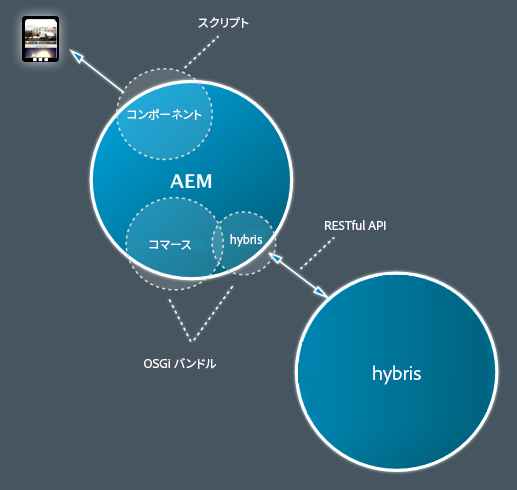
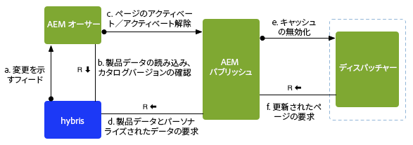
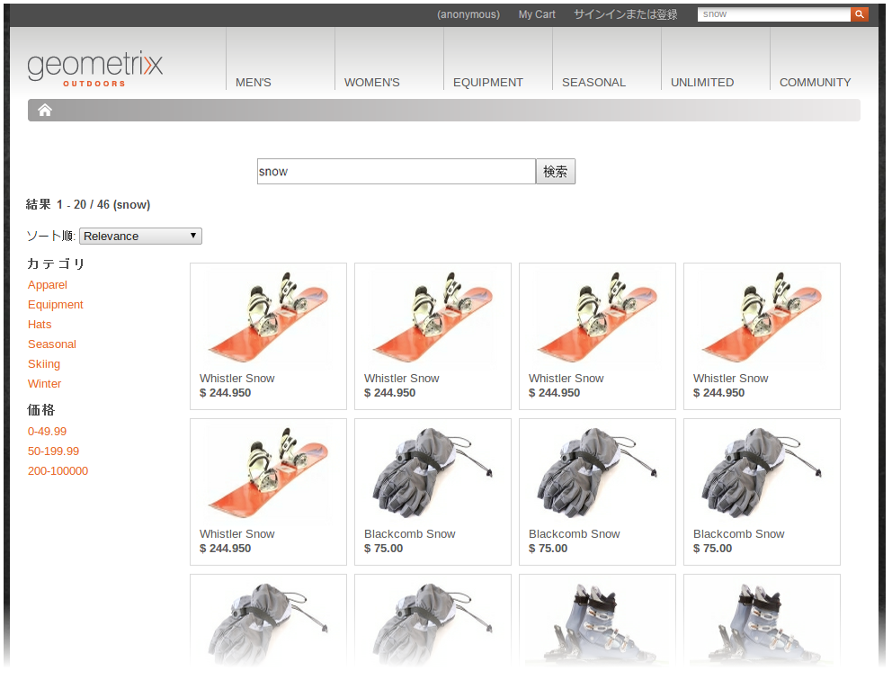

# SAP Commerce Cloud を使用した開発 {#developing-with-sap-commerce-cloud}

>[!NOTE]
>
>e コマースフレームワークは、任意の e コマースソリューションで使用できます。ここで取り上げる詳細や例は、[hybris](https://www.hybris.com/) のソリューションに関係しています。

統合フレームワークには、API を備えた統合レイヤーが含まれます。以下を実行できます。

* e コマースシステムを組み込んで、製品データを AEM に取り込む
* 特定の e コマースエンジンに依存しないコマース機能用の AEM コンポーネントを作成する



>[!NOTE]
>
>[API に関するドキュメント](/help/sites-developing/ecommerce.md#api-documentation)もお読みください。

統合レイヤーを使用するために、標準搭載のAEMコンポーネントが多数用意されています。 現時点では、以下のようなものがあります。

* 製品表示コンポーネント
* 買い物かご
* チェックアウト

検索のために、AEM 検索、e コマースシステムの検索、サードパーティ検索（Search&amp;Promote など）、またはこれらを組み合わせた検索をおこなうための、統合フックが提供されています。

## e コマースエンジンの選択 {#ecommerce-engine-selection}

e コマースフレームワークは任意の e コマースソリューションと組み合わせて使用できますが、使用されるエンジンは AEM によって識別できる必要があります。

* e コマースエンジンは、`CommerceService` インターフェイスをサポートする OSGi サービスです。

   * エンジンは、`commerceProvider` サービスプロパティによって区別できます。

* AEMは、および `Resource.adaptTo()` をサポート `CommerceService` します `Product`

   * The `adaptTo` implementation looks for a `cq:commerceProvider` property in the resource&#39;s hierarchy:

      * 見つかった場合は、その値を使用してコマースサービスの検索をフィルタリングします。
      * 見つからなかった場合は、最上位のコマースサービスが使用されます。
   * A `cq:Commerce` mixin is used so the `cq:commerceProvider` can be added to strongly-typed resources.


* 適切なコマースファクトリ定義を参照するために、`cq:commerceProvider` プロパティも使用されます。

   * 例えば、`cq:commerceProvider` という値を持つ `hybris` プロパティは、**向け Day CQ コマースファクトリ**（com.adobe.cq.commerce.hybris.impl.HybrisServiceFactory）の OSGi 設定に関連付けられます（ここでも、`commerceProvider` パラメーターの値は `hybris`hybris となります）。

   * ここで、**カタログバージョン**&#x200B;など、さらに別のプロパティを設定できます（適切かつ使用可能な場合）。

以下の例を参照してください。

| `cq:commerceProvider = geometrixx` | 標準の AEM インストール内に具体的な実装が必要。例：geometrixx のサンプル（汎用 API に対する最小限の拡張が含まれます）。 |
|---|---|
| `cq:commerceProvider = hybris` | hybris 実装 |

### 例 {#example}

```shell
/content/store
+ cq:commerceProvider = hybris
  + mens
    + polo-shirt-1
    + polo-shirt-2
    + employee
+ cq:commerceProvider = jcr
  + adobe-logo-shirt
    + cq:commerceType = product
    + price = 12.50
  + adobe-logo-shirt_S
    + cq:commerceType = variant
    + size = S
  + adobe-logo-shirt_XL
    + cq:commerceType = variant
    + size = XL
    + price = 14.50
```

>[!NOTE]
>
>CRXDE Lite を使用して、hybris 実装の場合に製品コンポーネントでこれがどのように処理されるかを確認できます。
>
>`/apps/geometrixx-outdoors/components/hybris/product/product.jsp`

### hybris 4 向けの開発 {#developing-for-hybris}

Hybris 4との後方互換性を維持しつつ、Hybris 5をサポートするようにeCommerce Integration Frameworkのhybris拡張が更新されました。

コード内のデフォルト設定は hybris 5 向けに最適化されています。

hybris 4 向けの開発をおこなうには、以下が必要です。

* Mavenを呼び出すときに、次のコマンドライン引数をコマンドに追加します

   `-P hybris4`

   事前設定済みのHybris 4配布物をダウンロードし、バンドルに埋め込みます。

   ```
   cq-commerce-hybris-server
   ```

* OSGi 設定マネージャーで、

   * Default Response Parser サービスの Hybris 5 サポートを無効にします。
   * Hybris Basic Authentication Handler サービスのサービスランキングが Hybris OAuth Handler サービスより低くなるようにします。

### セッション処理 {#session-handling}

hybris では、顧客の買い物かごなどの情報を格納するためにユーザーセッションを使用します。hybris はセッション ID を `JSESSIONID` cookie に返し、以降の hybris への要求ではこの cookie を送信する必要があります。セッション ID がリポジトリに格納されないように、セッション ID は買い物客のブラウザーに保存される別の cookie 内でエンコードされます。以下のステップが実行されます。

* 最初の要求では、買い物客の要求に対して cookie は設定されません。そこで、セッションを作成するために要求が hybris インスタンスに送信されます。
* その応答からセッション cookie が抽出され、新しい cookie 内でエンコードされ（例えば `hybris-session-rest`）、買い物客への応答に設定されます。新しい cookie 内でエンコーディングが必要なのは、元の cookie は特定のパスでのみ有効であり、そうしないと以降の要求でブラウザーから送り返されてこないからです。したがって、cookie の値にパス情報も追加する必要があります。
* On subsequent requests, the cookies are decoded from the `hybris-session-<*xxx*>` cookies and set on the HTTP client that is used to request data from hybris.

>[!NOTE]
>
>元のセッションが無効になっているときは、新しい匿名セッションが作成されます。

#### CommerceSession {#commercesession}

* このセッションは、 **買い物かごを「所有」します**

   * 追加や削除などを実行します。
   * は、買い物かごにさまざまな計算を行います。

      `commerceSession.getProductPrice(Product product)`

* *注文*&#x200B;データ   () の保存場所&#x200B;****&#x200B;を管理します。

   `CommerceSession.getUserContext()`

* **支払**&#x200B;処理の接続も管理します。
* **フルフィルメント**&#x200B;の接続も管理します。

### 製品の同期と公開 {#product-synchronization-and-publishing}

hybris で管理されている製品データを AEM で使用できるようにする必要があります。以下のような構成が実装されています。

* 最初の ID 読み込みは、hybris からフィードとして提供されます。このフィードに対して更新がおこなわれる場合があります。
* hybris が、フィードを通じて更新情報を提供します（AEM によってポーリングされます）。
* AEM は、製品データを使用するときに、最新データについての要求を hybris に戻します（最終変更日に基づく条件付き GET 要求）。
* hybris 上では、宣言的な方法でフィードコンテンツを指定できます。
* AEM 側のフィードアダプター内で、フィード構造と AEM コンテンツモデルとのマッピングがおこなわれます。



* インポーター（b）は、カタログ用に AEM 内で最初のページツリー構造を設定するために使用されます。
* hybris 内でのカタログ変更はフィードを通じて AEM に通知され、それが AEM（b）に反映されます。

   * カタログバージョンについて、製品が追加、削除、変更されます。
   * 製品が承認されます。

* hybris 拡張はポーリングインポーター（&quot;hybris&quot; scheme&quot;）を提供します。このインポーターは、変更を指定の時間間隔で AEM に読み込むように設定できます（例えば 24 時間おきにする場合は、秒単位で以下のように指定します）。

   * 
      ```
      http://localhost:4502/content/geometrixx-outdoors/en_US/jcr:content.json
       {
       * "jcr:mixinTypes": ["cq:PollConfig"],
       * "enabled": true,
       * "source": "hybris:outdoors",
       * "jcr:primaryType": "cq:PageContent",
       * "interval": 86400
       }
      ```

* AEM のカタログ構成は、**ステージング済み**&#x200B;カタログバージョンと&#x200B;**オンライン**&#x200B;カタログバージョンを認識します。

* カタログバージョン間の製品同期には、対応する AEM ページのアクティベート（アクティベート解除）が必要です（a、c）。

   * 製品を&#x200B;**オンライン**&#x200B;カタログバージョンに追加するには、製品のページをアクティベートします。
   * 製品を削除するには、アクティベート解除します。

* AEM 内のページをアクティベート（c）するには確認が必要で（b）、以下の場合にのみアクティベートできます。

   * 製品が、製品ページの&#x200B;**オンライン**&#x200B;カタログバージョン内にある
   * 参照される製品が、他のページ（キャンペーンページなど）の&#x200B;**オンライン**&#x200B;カタログバージョン内で利用できる

* アクティベートされた製品ページは、製品データの&#x200B;**オンライン**&#x200B;バージョンにアクセスする必要があります（d）。

* AEM パブリッシュインスタンスは、製品データやパーソナライズされたデータを取得するために、hybris にアクセスする必要があります（d）。

### アーキテクチャ {#architecture}

#### 製品とバリアントのアーキテクチャ {#architecture-of-product-and-variants}

1 つの製品に複数のバリエーションがある場合があります。例えば、カラーやサイズで異なるバリエーションがある場合があります。製品では、バリエーションを構成するプロパティを定義する必要があります。このようなプロパティをバリアント軸と呼びます。**

ただし、すべてのプロパティがバリアント軸になるわけではありません。バリエーションは、他のプロパティにも影響を与えることがあります。例えば、価格はサイズに依存することがあります。買い物客はこのようなプロパティを選択できないので、バリアント軸とは見なされません。

各製品やバリアントはリソースによって表現されるので、リポジトリノードに 1 対 1 でマップされます。必然的に、特定の製品やバリアントはそのパスによって一意に識別できます。

製品／バリアントリソースは、実際の製品データを持つとは限らず、本当は別のシステム（hybris など）に格納されているデータの表現にすぎない場合があります。例えば、製品の説明や価格などは AEM には格納されておらず、e コマースエンジンからリアルタイムで取得されます。

Any product resource can be represented by a `Product API`. Most calls in the product API are variation specific (although variations might inherit shared values from an ancestor), but there are also calls which list the set of variations ( `getVariantAxes()`, `getVariants()`, etc.).

>[!NOTE]
>
>In effect a variant axes is determined by whatever `Product.getVariantAxes()` returns:
>
>* hybris ではこれを hybris 実装用に定義します。
>
>
（一般的に）製品には多数のバリアント軸を持たせることができますが、デフォルトの製品コンポーネントでは次の 2 つのバリアント軸のみが処理されます。
>
>1. `size`
   >
   >
1. もう一度
>
>   
This additional variant is selected via the `variationAxis` property of the product reference (usually `color` for Geometrixx Outdoors).

#### 製品リファレンスと製品データ {#product-references-and-product-data}

一般的な手順は次のとおりです。

* product data is located under `/etc`

* and product references under `/content`.

製品バリエーションと製品データノードの間には 1 対 1 のマッピングが必要です。

製品リファレンスには、各バリエーションを表すノードも必要ですが、すべてのバリエーションを表す必要はありません。例えば、製品のバリエーションがS、M、Lの場合、製品データは次のようになります。

```shell
etc
  commerce
    products
      shirt
        shirt-s
        shirt-m
        shirt-l
```

「Big and Tall」カタログには次のバリエーションだけが含まれます。

```shell
content
  big-and-tall
    shirt
      shirt-l
```

最後に、製品データを使用するための要件はありません。カタログ内の参照の下に、すべての製品データを配置できます。 しかし、すべての製品データを複製しない限り、実際には複数のカタログを持つことはできません。

**API**

#### com.adobe.cq.commerce.api.Product インターフェイス {#com-adobe-cq-commerce-api-product-interface}

```java
public interface Product extends Adaptable {

    public String getPath();            // path to specific variation
    public String getPagePath();        // path to presentation page for all variations
    public String getSKU();             // unique ID of specific variation

    public String getTitle();           // shortcut to getProperty(TITLE)
    public String getDescription();     // shortcut to getProperty(DESCRIPTION)
    public String getImageUrl();        // shortcut to getProperty(IMAGE_URL)
    public String getThumbnailUrl();    // shortcut to getProperty(THUMBNAIL_URL)

    public <T> T getProperty(String name, Class<T> type);

    public Iterator<String> getVariantAxes();
    public boolean axisIsVariant(String axis);
    public Iterator<Product> getVariants(VariantFilter filter) throws CommerceException;
}
```

#### com.adobe.cq.commerce.api.VariantFilter  {#com-adobe-cq-commerce-api-variantfilter}

```java
/**
 * Interface for filtering variants and AxisFilter provided as common implementation
 *
 * The <code>VariantFilter</code> is used to filter variants,
 * e.g. when using {@link Product#getVariants(VariantFilter filter)}.
 */
public interface VariantFilter {
    public boolean includes(Product product);
}

/**
 * A {@link VariantFilter} for filtering variants by the given
 * axis and value. The following example returns a list of
 * variant products that have a value of <i>blue</i> on the
 * <i>color</i> axis.
 *
 * <p>
 * <code>product.getVariants(new AxisFilter("color", "blue"));</code>
 */
public class AxisFilter implements VariantFilter {

    private String axis;
    private String value;

    public AxisFilter(String axis, String value) {
        this.axis = axis;
        this.value = value;
    }

    /**
     * {@inheritDoc}
     */
    public boolean includes(Product product) {
        ValueMap values = product.adaptTo(ValueMap.class);

        if(values != null) {
            String v = values.get(axis, String.class);

            return v != null && v == value;
        }

        return false;
    }
}
```

* **一般的なストレージの構成**

   * 製品ノードは nt:unstructured です。
   * 製品ノードは次のどちらかになります。

      * リファレンス。製品データは他の場所に保存されています。

         * Product references contain a `productData` property, which points to the product data (typically under `/etc/commerce/products`).
         * 製品データは階層化されています。製品属性は、製品データノードの祖先から継承されます。
         * 製品リファレンスには、ローカルプロパティも含めることができます。このようなプロパティは、製品データ内で指定されるプロパティをオーバーライドします。
      * 製品自体

         * Without a `productData` property.
         * すべてのプロパティをローカルに保持している（そして productData プロパティを含まない）製品ノードは、製品属性を自身の祖先から直接継承します。


* **AEM の汎用の製品構造**

   * 各バリアントには、独自のリーフノードが必要です。
   * 製品インターフェイスは、製品とバリアントの両方を表しますが、関連リポジトリノードはそれぞれに固有です。
   * 製品ノードは、製品属性とバリアント軸を示します。

#### 例 {#example-1}

```shell
+ banyan_shirt
    - cq:commerceType = product
    - cq:productAttributes = [jcr:title, jcr:description, size, price, color]
    - cq:productVariantAxes = [color, size]
    - jcr:title = Banyan Shirt
    - jcr:description = Flowery, all-cotton shirt.
    - price = 14.00
    + banyan_shirt_s
        - cq:commerceType = variant
        - size = S
        + banyan_shirt_s_red
            - cq:commerceType = variant
            - color = red
        + banyan_shirt_s_blue
            - cq:commerceType = variant
            - color = blue
    + banyan_shirt_m
        - cq:commerceType = variant
        - size = M
        + banyan_shirt_m_red
            - cq:commerceType = variant
            - color = red
        + banyan_shirt_m_blue
            - cq:commerceType = variant
            - color = blue
    + banyan_shirt_l
        - cq:commerceType = variant
        - size = L
        + banyan_shirt_l_red
            - cq:commerceType = variant
            - color = red
        + banyan_shirt_l_blue
            - cq:commerceType = variant
            - color = blue
    + banyan_shirt_xl
        - cq:commerceType = variant
        - size = XL
        - price = 18.00
```

#### 買い物かごのアーキテクチャ {#architecture-of-the-shopping-cart}

**コンポーネント**

* 買い物かごは、`CommerceSession:` によって管理されます。

   * `CommerceSession` は、追加や削除などを実行します。
   * The `CommerceSession` also performs the various calculations on the cart. ``

* 買い物かごに直接関連はしませんが、`CommerceSession` はカタログの価格情報も提供する必要があります（価格を管理しているので）。

   * 価格には、次の複数の変更要素があります。

      * 数量割引。
      * 様々な通貨。
      * VAT 支払い義務ありと VAT なし。
   * 変更要素は、次のインターフェイスを使用して完全に変更できます。

      * `int CommerceSession.getQuantityBreakpoints(Product product)`
      * `String CommerceSession.getProductPrice(Product product)`


**ストレージ**

* ストレージ

   * hybris のケースでは、hybris サーバーが買い物かごを管理します。
   * AEM 汎用ケースでは、買い物かごは [ClientContext](/help/sites-administering/client-context.md) に格納されます。

**パーソナライズ機能**

* パーソナライズは、常に [ClientContext](/help/sites-administering/client-context.md) から取得する必要があります。
* A ClientContext `/version/` of the cart is created in all cases:

   * Products should be added by using the `CommerceSession.addCartEntry()` method.

* 次の図は、ClientContext に格納される買い物かご情報の例を示しています。


#### チェックアウトのアーキテクチャ {#architecture-of-checkout}

**買い物かごと注文データ**

`CommerceSession` は、次の 3 つの要素を管理します。

1. 買い物かごコンテンツ
1. 価格
1. 注文の詳細

1. **買い物かごコンテンツ**

   買い物かごコンテンツのスキーマは、API によって決められています。

   ```java
       public void addCartEntry(Product product, int quantity);
       public void modifyCartEntry(int entryNumber, int quantity);
       public void deleteCartEntry(int entryNumber);
   ```

1. **価格**

   価格のスキーマも、API によって決められています。

   ```java
       public String getCartPreTaxPrice();
       public String getCartTax();
       public String getCartTotalPrice();
       public String getOrderShipping();
       public String getOrderTotalTax();
       public String getOrderTotalPrice();
   ```

1. **注文の詳細**

   しかし、注文の詳細は API によって決められていません&#x200B;**。

   ```java
       public void updateOrderDetails(Map<String, String> orderDetails);
       public Map<String, String> getOrderDetails();
       public void submitOrder();
   ```

**送料の計算**

* 多くの場合、注文フォームには複数の出荷オプション（および価格）を表示する必要があります。
* 価格は、品目と注文の詳細（重さや配送先住所など）に基づきます。
* `CommerceSession` はすべての依存関係にアクセスするので、製品価格と同じ方法で扱うことができます。

   * The `CommerceSession` owns shipping pricing.
   * Can retrieve/update delivery details by using `updateOrder(Map<String, Object> delta)`

>[!NOTE]
>
>以下のような発送セレクターを実装することもできます。
>
> `yourProject/commerce/components/shippingpicker` の下）で、次の手順をおこないます。
>
>* Essentially this could be a copy of `foundation/components/form/radio`, but with callbacks to the `CommerceSession` for:
   >
   >
* その方法が使用可能かどうかを確認する
>* 価格情報を追加する
>* 関連する `CommerceSession` 情報の公開に関する制御権を持ちつつ、買い物客が AEM 内の注文ページ（発送方法のスーパーセットとその説明テキストを含む）を更新できるようにする


**支払い処理**

* `CommerceSession` は、支払い処理の接続も管理します。
* `CommerceSession` 実装には、選択された支払い処理サービスへの具体的な呼び出しを追加する必要があります。

**注文のフルフィルメント**

* `CommerceSession` は、フルフィルメントの接続も管理します。
* `CommerceSession` 実装には、選択された支払い処理サービスへの具体的な呼び出しを追加する必要があります。

### 検索の定義 {#search-definition}

標準のサービス API モデルに従い、e コマースプロジェクトは、個々のコマースエンジンで実装できる一連の検索関連 API を提供しています。

>[!NOTE]
>
>現在、この検索 API をデフォルトで実装しているのは hybris エンジンだけです。
>
>しかし、検索 API は汎用的なものであり、各 CommerceService で個別に実装できます。

e コマースプロジェクトには、デフォルトの検索コンポーネントが含まれます。このコンポーネントは次の場所にあります。

`/libs/commerce/components/search`



ここでは、検索 API を利用して、選択されたコマースエンジンをクエリしています（[e コマースエンジンの選択](#ecommerce-engine-selection)を参照）。

#### 検索 API {#search-api}

コアプロジェクトは、いくつかの汎用クラスまたはヘルパークラスを提供します。

1. `CommerceQuery`

    検索クエリの記述に使用します（クエリテキスト、現在のページ、ページサイズ、並べ替え、選択されているファセットについての情報を含みます）。検索 API を実装するすべての e コマースサービスは、検索を実行するために、このクラスのインスタンスを受け取ります。A `CommerceQuery` can be instantiated from a request object ( `HttpServletRequest`).

1. `FacetParamHelper`

    1 つの静的メソッド（`toParams`）を提供するユーティリティクラス。このメソッドを使用して、ファセットのリストと 1 つのトグル値から `GET` パラメーター文字列を生成します。これは、UI 側で、ユーザーがハイパーリンクをクリックすると対応する値に切り替わる（選択された場合はクエリから削除され、選択されていない場合は追加される）ように、各ファセットの値ごとのハイパーリンクを表示する必要がある場合に役立ちます。これによって、複数または単一の値を持つファセットの処理や値のオーバーライドなど、すべてのロジックを扱うことができます。

検索 API のエントリポイントは、`CommerceService#search` オブジェクトを返す `CommerceResult` メソッドです。このトピックについて詳しくは、[API ドキュメント](/help/sites-developing/ecommerce.md#api-documentation)を参照してください。

### ユーザー統合 {#user-integration}

AEM は様々な e コマースシステムと統合できます。これを実現するには、AEM 固有のコードは AEM のみを把握すればよく、その逆も同様となるように、各種システム間で買い物客を同期するための戦略が必要です。

* 認証

   AEM is presumed to be the *only* web front-end and therefore performs *all* authentication.

* ハイブリスのアカウント

   AEMは買い物客ごとに、おろかさで対応する（下位の）アカウントを作成します。 このアカウントのユーザ名はAEMユーザ名と同じです。 暗号化されたランダムパスワードが自動生成され、暗号化された状態で AEM に保存されます。

#### 既存ユーザー {#pre-existing-users}

AEM フロントエンドは、既存の hybris 実装の前面に置くことができます。また、hybris エンジンを既存の AEM インストールに追加することもできます。これを実現するには、双方のシステムが相手側システムの既存ユーザーを適切に扱えなければなりません。

* AEM -> hybris の場合

   * hybris へのログイン時に、AEM ユーザーがまだ存在していない場合は、

      * 暗号化されたランダムパスワードを使用して新規 hybris ユーザーを作成します。
      * この hybris ユーザー名を AEM ユーザーのユーザーディレクトリに保存します。
   * 参照先: `com.adobe.cq.commerce.hybris.impl.HybrisSessionImpl#login()`


* hybris -> AEM の場合

   * AEM へのログイン時に、システムがユーザーを認識していない場合は、

      * 提供されたユーザー名とパスワードを使用して、hybris にログインを試みます。
      * 成功した場合は、同じパスワードを使用して AEM 内に新規ユーザーを作成します（AEM 固有のソルトにより、AEM 固有のハッシュが生成されます）。
   * 上記のアルゴリズムは Sling の `AuthenticationInfoPostProcessor` で実装されます。

      * 参照先: `com.adobe.cq.commerce.hybris.impl.user.LazyUserImporter.java`


### Customizing the Import Process {#customizing-the-import-process}

既存の機能に基づいてカスタムの読み込みハンドラーを作成するには、次のようにします。

* has to implement the `ImportHandler` interface

* can extend the `DefaultImportHandler`

```java
/**
 * Services implementing the <code>ImportHandler</code> interface are
 * called by the {@link HybrisImporter} to create actual commerce entities
 * such as products.
 */
public interface ImportHandler {

    /**
     * Not used.
     */
    public void createTaxonomie(ImporterContext ctx);

    /**
     * Creates a catalog with the given name.
     * @param ctx   The importer context
     * @param name  The catalog's name
     * @return Path of created catalog
     */
    public String createCatalog(ImporterContext ctx, String name) throws Exception;

    /**
     * Creates a product from the given values.
     * @param ctx                The importer context
     * @param values             The product's properties
     * @param parentCategoryPath The containing category's path
     * @return Path of created product
     */
    public String createProduct(ImporterContext ctx, ValueMap values, String parentCategoryPath) throws Exception;

    /**
     * Creates a variant product from the given values.
     * @param ctx             The importer context
     * @param values          The product's properties
     * @param baseProductPath The base product's path
     * @return Path of created product
     */
    public String createVariantProduct(ImporterContext ctx, ValueMap values, String baseProductPath) throws Exception;

    /**
     * Creates an asset for a product. This is usually a product
     * image.
     * @param ctx             The importer context
     * @param values          The product's properties
     * @param baseProductPath The product's path
     * @return Path of created asset
     */
    public String createAsset(ImporterContext ctx, ValueMap values, String productPath) throws Exception;

    /**
     * Creates a category from the given values.
     * @param ctx           The importer context
     * @param values        The category's properties
     * @param parentPath    Path of parent category or base path of import in case of root category
     * @return Path of created category
     */
    public String createCategory(ImporterContext ctx, ValueMap values, String parentCategoryPath) throws Exception;
}
```

カスタムハンドラーがインポーターに認識されるようにするには、`service.ranking` プロパティに 0 より大きい値を指定する必要があります。以下に例を示します。

```java
@Component
@Service
@Property(name = "service.ranking", value = 100)
public class MyImportHandler extends DefaultImportHandler {
    ...
}
```

