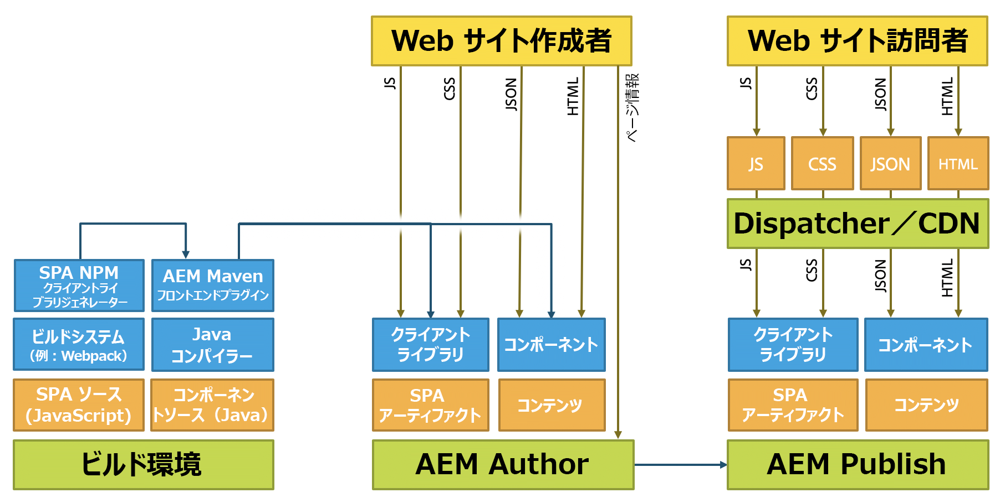

# AEM向けSPAの開発{#developing-spas-for-aem}

単一ページアプリケーション（SPA）により、Web サイトのユーザーに魅力的なエクスペリエンスを提供することができます。開発者は SPA フレームワークを使用してサイトを構築したいと考え、作成者はそうして構築されたサイトのコンテンツを AEM 内でシームレスに編集したいと考えています。

この記事では、フロントエンド開発者がAEM向けのSPAを開発する際に考慮すべき重要な質問を紹介し、AEMでのSPAのデプロイに関するAEMのアーキテクチャの概要を説明します。

>[!NOTE]
>
>SPAフレームワークベースのクライアント側レンダリング（ReactやAngularなど）を必要とするプロジェクトには、SPA Editorが推奨されるソリューションです。

## AEM向けSPA開発原則 {#spa-development-principles-for-aem}

AEMでシングルページアプリケーションを開発する場合、フロントエンド開発者はSPAを作成する際に標準的なベストプラクティスを順守すると想定します。 フロントエンド開発者として、AEM固有の原則を少なくしながら、これらの一般的なベストプラクティスに従う場合、SPAは [AEMとコンテンツオーサリング機能と共に機能し](/help/sites-developing/spa-walkthrough.md#content-editing-experience-with-spa)ます。

* **[移植性](/help/sites-developing/spa-architecture.md#portability) — 任意のコンポーネントと同様** 、コンポーネントは可能な限り持ち運び可能な状態で構築する必要があります。 SPAは、ポータブルで再利用可能なコンポーネントを使用して構築する必要があります。
* **[AEM Drives Site Structure](/help/sites-developing/spa-architecture.md#aem-drives-site-structure)** — フロントエンド開発者はコンポーネントを作成し、内部構造を所有しますが、AEMに依存してサイトのコンテンツ構造を定義します。
* **[ダイナミックレンダリング](/help/sites-developing/spa-architecture.md#dynamic-rendering)** — すべてのレンダリングはダイナミックである必要があります。
* **[動的ルーティング](#dynamic-routing) - SPAは、ルーティングを処理し** 、AEMはそれをリッスンし、それに基づいてフェッチを行います。 どのルーティングも動的である必要があります。

SPAの開発時にこれらの原則を念頭に置いておけば、サポートされるすべてのAEMオーサリング機能を有効にしつつ、できる限り柔軟で将来の配達確認を実現できます。

AEMオーサリング機能をサポートする必要がない場合は、別の [SPA設計モデルを検討する必要がある場合があります](/help/sites-developing/spa-architecture.md#spa-design-models)。

### 移植性 {#portability}

コンポーネントを開発する場合と同様に、コンポーネントの移植性を最大限に高めるように設計する必要があります。 互換性、柔軟性、保守性を今後保証するために、コンポーネントの移植性や再利用性に対して作用するパターンは避ける必要があります。

作成したSPAは、高度に移植性が高く、再利用可能なコンポーネントを使用して構築する必要があります。

### AEMドライブのサイト構造 {#aem-drives-site-structure}

フロントエンド開発者は、アプリの作成に使用されるSPAコンポーネントのライブラリの作成を自分自身が担当していると考える必要があります。 フロントエンド開発者は、コンポーネントの内部構造を完全に制御できます。 [ただし、AEMは常にサイトの構造を所有しています。](/help/sites-developing/spa-overview.md)

つまり、フロントエンド開発者は、コンポーネントのエントリポイントの前後に顧客コンテンツを追加でき、コンポーネント内でサードパーティの呼び出しを行うこともできます。 ただし、フロントエンド開発者は、例えばコンポーネントのネスト方法を完全に制御するわけではありません。

### ダイナミックレンダリング {#dynamic-rendering}

SPAでは、コンテンツの動的なレンダリングのみに依存する必要があります。 これは、AEMがコンテンツ構造のすべての子を取得してレンダリングするデフォルトの期待値です。 

特定のコンテンツを指す明示的なレンダリングは静的レンダリングと見なされますが、サポートされているもののAEMコンテンツオーサリング機能との互換性はありません。 これは [移植性の原則に反するものでもある](/help/sites-developing/spa-architecture.md#portability)。

### 動的ルーティング {#dynamic-routing}

レンダリングと同様に、すべてのルーティングも動的である必要があります。 AEMでは、SPA [は常にルーティングを所有し、AEMはそれをリッスンし](/help/sites-developing/spa-routing.md) 、それに基づいてコンテンツを取得します。

静的なルーティングは移植性の [原則に反し、AEMのコンテンツオーサリング機能との互換性がないことで作成者を制限します](/help/sites-developing/spa-architecture.md#portability) 。 例えば、静的ルーティングの場合、コンテンツ作成者はルートの変更やページの変更を希望する場合は、フロントエンド開発者に依頼する必要があります。

## AEM プロジェクトアーキタイプ {#aem-project-archetype}

AEMプロジェクトでは、 [AEM Project Archetype](https://docs.adobe.com/content/help/ja-JP/experience-manager-core-components/using/developing/archetype/overview.html)（プロジェクトアーキタイプ）を活用する必要があります。このアーキタイプは、ReactまたはAngularを使用するSPAプロジェクトをサポートし、SPA SDKを利用します。

## SPAデザインモデル {#spa-design-models}

AEMでのSPA開発の [原則に従えば](/help/sites-developing/spa-architecture.md#spa-development-principles-for-aem) 、SPAは、サポートされるすべてのAEMコンテンツオーサリング機能と共に機能します。 

ただし、これが完全に必要でない場合もあります。 次の表に、様々なデザインモデル、その利点と短所の概要を示します。

<table>
 <tbody>
  <tr>
   <th><strong>設計モデル  </strong></th>
   <th><strong>メリット</strong></th>
   <th><strong>デメリット</strong></th>
  </tr>
  <tr>
   <td>AEMは、 <a href="/help/sites-developing/spa-reference-materials.md">SPA Editor SDKフレームワークを使用せずに、ヘッドレスなCMSとして使用されます。</a></td>
   <td>フロントエンド開発者は、アプリを完全に制御できます。</td>
   <td>
コンテンツ作成者は、AEMコンテンツのオーサリングエクスペリエンスを活用できません。
 
コードに静的参照またはルーティングが含まれる場合、コードは移植性も再利用もできません。
 
テンプレートエディターの使用を許可しないので、フロントエンド開発者はJCRを介して編集可能なテンプレートを維持する必要があります。
 </td>
  </tr>
  <tr>
   <td>フロントエンド開発者はSPA Editor SDKフレームワークを使用しますが、コンテンツ作成者に対して一部の領域のみを開きます。</td>
   <td>開発者は、アプリの制限された領域でのみオーサリングを有効にすることで、アプリを管理し続けます。</td>
   <td>
コンテンツ作成者は、AEMコンテンツオーサリングエクスペリエンスの限られたセットに制限されます。
 
静的参照またはルーティングが含まれている場合、コードに移植性や再利用性の問題が発生する可能性があります。
 
テンプレートエディターの使用を許可しないので、フロントエンド開発者はJCRを介して編集可能なテンプレートを維持する必要があります。
 </td>
  </tr>
  <tr>
   <td>このプロジェクトはSPAエディターSDKを完全に活用し、フロントエンドコンポーネントはライブラリとして開発され、アプリのコンテンツ構造はAEMに委任されます。</td>
   <td>
アプリは再利用可能で携帯可能です。
 
コンテンツ作成者は、AEMコンテンツオーサリングエクスペリエンスを使用してアプリを編集できます。  
 
SPAは、テンプレートエディターと互換性があります。
 </td>
   <td>
開発者は、アプリの構造とAEMに委任されたコンテンツの部分を管理する必要はありません。
 
開発者は、AEMで作成する予定ではないコンテンツ用にアプリの領域を予約できます。
 </td>
  </tr>
 </tbody>
</table>

>[!NOTE]
>
>AEMではすべてのモデルがサポートされていますが、3番目の実装(そしてAEMで推奨される [SPA開発原則に従う](/help/sites-developing/spa-architecture.md#spa-development-principles-for-aem))を行うことでのみ、コンテンツ作成者は、SPAのコンテンツを慣れ親しんだとおりに操作して編集できます。
>

## 既存のSPAからAEMへの移行 {#migrating-existing-spas-to-aem}

一般的に、SPAがAEMの [SPA開発原則に従う場合](/help/sites-developing/spa-architecture.md#spa-development-principles-for-aem)、SPAはAEMで動作し、AEM SPAエディタを使用して編集できます。

既存のSPAをAEMで動作する準備をするには、次の手順に従います。

1. **JSコンポーネントをモジュラー化します。**

   任意の順序、位置、サイズでレンダリングできるようにします。
1. **SDKが提供するコンテナを使用して、コンポーネントを画面に配置します。**

   AEMでは、ページと段落のシステムコンポーネントを使用できます。
1. **各JSコンポーネントにAEMコンポーネントを作成します。**

   AEMコンポーネントは、ダイアログとJSON出力を定義します。

## フロントエンド開発者向けの手順 {#instructions-for-front-end-developers}

フロントエンド開発者にAEM用のSPAを作成するように命じる主なタスクは、コンポーネントとそのJSONモデルについて同意することです。

AEM用のSPAを開発する際に、フロントエンド開発者が実行する必要のある手順の概要を次に示します。

1. **コンポーネントとJSONモデルに同意する**

   フロントエンド開発者とバックエンドAEM開発者は、必要なコンポーネントとモデルについて合意し、SPAコンポーネントからバックエンドコンポーネントに1対1で一致させる必要があります。

   AEMコンポーネントは、編集ダイアログを提供し、コンポーネントモデルを書き出すためにも、ほとんど必要です。

1. **「React」コンポーネントで、`this.props.cqModel`**

   コンポーネントが同意され、JSONモデルが設定されると、フロントエンド開発者はSPAを開発する自由があり、を介してJSONモデルに簡単にアクセスでき `this.props.cqModel`ます。

1. **コンポーネントの `render()` メソッドの実装**

   フロントエンド開発者は、必要に応じて `render()` メソッドを実装し、 `cqModel` プロパティのフィールドを使用できます。 これにより、DOMと、ページに挿入されるHTMLフラグメントが出力されます。 これは、Reactでアプリを作成する標準的な方法です。

1. **を使用してコンポーネントをAEMリソースタイプにマップします`MapTo()`**

   マッピングは、コンポーネントクラスを格納し、指定されたコンポーネントが内部的に使用して、指定されたリソースタイプに基づいてコンポーネントを取得し、動的にインスタンス化します。 `Container`

   これはフロントエンドとバックエンドの間の「接着」の役割を果たすので、エディタは、コンポーネントがどのコンポーネントに対応するかを知ることができます。

   と `Page` は、基本を拡張するクラスの良い例 `ResponsiveGrid``Container`です。

1. **コンポーネントを `EditConfig``MapTo()`**

   このパラメータは、まだレンダリングされていないか、レンダリングするコンテンツがない場合に、コンポーネントの名前をどのように付けるかをエディタに指示するために必要です。

1. **指定されたページとコンテナの `Container` クラスを拡張します。**

   ページと段落システムは、内部コンポーネントへの委任が期待どおりに機能するように、このクラスを拡張する必要があります。

1. **HTML5 `History` APIを使用したルーティングソリューションを実装します。**

   が有効な場合、 `ModelRouter` および `pushState` 関数を呼び出すと、モデルの欠落したフラグメント `replaceState``PageModelManager` を取得するための要求がにトリガされます。

   現在のバージョンのみで、Sling Modelエントリポイントの実際のリソースパスを指すURLの使用がサポートされて `ModelRouter` います。 バニティURLやエイリアスの使用はサポートされません。

   は、無効 `ModelRouter` にしたり、正規式のリストを無視するように設定したりできます。

## AEM不可知論の {#aem-agnostic}

これらのコードブロックは、ReactコンポーネントとAngularコンポーネントが、AdobeやAEM固有の何も必要としないことを示します。

* JavaScriptコンポーネント内にあるものは、AEMにとっては何でも認識されます。
* ただし、AEMに固有なのは、JSコンポーネントをMapToヘルパーを使用してAEMコンポーネントにマッピングする必要がある点です。

ヘルパー `MapTo` は、バックエンドとフロントエンドのコンポーネントを一致させる「接着」です。

* これは、JSコンテナ（またはJS段落システム）に、JSONに存在する各コンポーネントのレンダリングにどのJSコンポーネントが関与するかを伝えます。
* JSコンポーネントでレンダリングされるHTMLにHTMLデータ属性が追加されるので、SPAエディターは、コンポーネントの編集時に作成者に表示するダイアログボックスを把握できます。

AEM用SPAの一般的な使用 `MapTo` と構築について詳しくは、選択したフレームワークの「はじめに」ガイドを参照してください。

* [AEMのSPAを使い始める — React](/help/sites-developing/spa-getting-started-react.md)
* [AEMのSPA使用の手引き — Angular](/help/sites-developing/spa-getting-started-angular.md)

## AEMのアーキテクチャとSPA {#aem-architecture-and-spas}

開発、オーサリング、および公開環境を含むAEMの一般的なアーキテクチャは、SPAを使用する場合には変更されません。 ただし、SPA開発がこのアーキテクチャにどのように適合しているかを理解すると役立ちます。

* **ビルド環境**

   SPAアプリケーションソースとコンポーネントソースのソースは、ここでチェックアウトされます。

   * NPM clientlibジェネレーターは、SPAプロジェクトからクライアントライブラリを作成します。
   * そのライブラリはMavenによって取得され、Maven Buildプラグインと共にAEM Authorのコンポーネントにデプロイされます。

* **AEM 作成者**

   AEM作成者(オーサリングSPAを含む)でコンテンツが作成されます。

   オーサリング環境でSPA Editorを使用してSPAを編集する場合：

   1. SPAは外部のHTMLを要求します。
   1. CSSが読み込まれます。
   1. SPAアプリケーションのJavaScriptが読み込まれます。
   1. SPAアプリケーションを実行すると、JSONが要求され、アプリが `cq-data` 属性を含むページのDOMを構築できるようになります。
   1. この `cq-data` 属性を使用すると、エディタが追加のページ情報を読み込んで、コンポーネントで使用できる編集設定を把握できます。

* **AEM Publish**

   SPAアプリケーションアーティファクト、clientlib、コンポーネントなどのオーサリング済みコンテンツおよびコンパイル済みライブラリが、一般消費向けに公開される場所です。

* **ディスパッチャー/CDN**

   ディスパッチャーは、サイトへの訪問者のAEMのキャッシュ層の役割を果たします。

   * リクエストは、AEM Authorでの処理と同様に処理されますが、ページ情報の要求はありません。これは、エディターが必要とするのはページ情報のみです。
   * JavaScript、CSS、JSONおよびHTMLがキャッシュされ、配信が高速になるようにページが最適化されます。

>[!NOTE]
>
>AEM内では、JavaScriptのビルドメカニズムを実行したり、JavaScript自体を実行したりする必要はありません。 AEMは、SPAアプリケーションからコンパイルされたアーティファクトのみをホストします。

## 次の手順 {#next-steps}

AEMのシンプルなSPAの構造とその仕組みの概要については、 [React](/help/sites-developing/spa-getting-started-react.md) と [Angularの両方の使い始めにガイドを参照してください](/help/sites-developing/spa-getting-started-angular.md)。

独自のSPAを作成する手順を説明したガイドについては、『AEM SPA Editor - WKNDイベントの [概要チュートリアル](https://helpx.adobe.com/jp/experience-manager/kt/sites/using/getting-started-spa-wknd-tutorial-develop.html)』を参照してください。

動的モデルとコンポーネントのマッピングおよびAEMのSPA内での動作について詳しくは、SPAの「 [動的モデルとコンポーネントのマッピング」の記事を参照してください](/help/sites-developing/spa-dynamic-model-to-component-mapping.md)。

AEMにSPAをReactやAngular以外のフレームワーク用に実装する場合、またはAEM用のSPA SDKの仕組みを簡単に詳しく調べる場合は、「 [SPA Blueprint](/help/sites-developing/spa-blueprint.md) 」の記事を参照してください。
