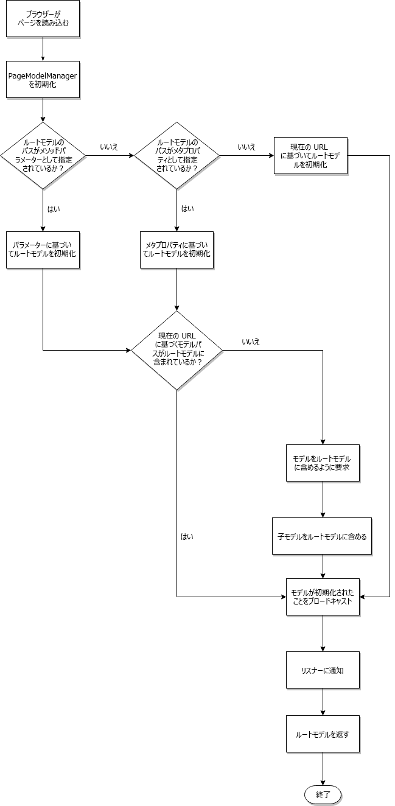

# SPA ブループリント{#spa-blueprint}

作成者がAEM SPA Editorを使用してSPAのコンテンツを編集できるようにするには、このドキュメントで説明するように、SPAが満たす必要がある要件があります。

>[!NOTE]
>
>SPAフレームワークベースのクライアント側レンダリング（ReactやAngularなど）を必要とするプロジェクトには、SPA Editorが推奨されるソリューションです。

## 概要 {#introduction}

このドキュメントでは、AEM内に編集可能なSPAコンポーネントを実装するために、SPAフレームワークが満たす必要がある一般的な契約（AEMサポートレイヤーの種類）について説明します。

>[!NOTE]
>
>以下の要件は、フレームワークには依存しません。要件が満たされると、（モジュール、コンポーネントおよびサービスで構成された）フレームワーク固有のレイヤーが提供されます。
>
>**AEMのReactおよびAngularフレームワークでは、これらの要件は既に満たされています。** このブループリントの要件は、AEMで使用する別のフレームワークを実装する場合にのみ該当します。

>[!CAUTION]
>
>AEMのSPA機能はフレームワークに依存しませんが、現在サポートされているのはReactフレームワークとAngularフレームワークのみです。

作成者がAEMページエディターを使用して、単一ページアプリケーションフレームワークで公開されたデータを編集できるようにするには、AEMリポジトリ内のアプリケーション用に保存されたデータの意味を表すモデルの構造を解釈できる必要があります。 この目標を達成するために、フレームワークに依存しない2つのライブラリが用意されています。と `PageModelManager` が `ComponentMapping`、

### PageModelManager {#pagemodelmanager}

このラ `PageModelManager` イブラリは、SPAプロジェクトで使用するNPMパッケージとして提供されます。 SPA に付属し、データモデルマネージャーとして機能します。

SPA に代わり、実際のコンテンツ構造を表す JSON 構造の取得および管理を抽象化します。また、SPAと同期して、コンポーネントを再レンダリングする必要が生じた時点を通知する必要もあります。

NPMパッケージ [@adobe/cq-spa-page-model-managerを参照してください。](https://www.npmjs.com/package/@adobe/cq-spa-page-model-manager)

を初期化する際 `PageModelManager`、ライブラリは、最初に、提供されたアプリのルートモデル（パラメーター、メタプロパティまたは現在のURLを介して）を読み込みます。 ライブラリが、現在のページのモデルが取得したルートモデルの一部ではないことを識別し、子ページのモデルとして含める場合。



### ComponentMapping {#componentmapping}

The `ComponentMapping` module is provided as an NPM package to the front-end project. フロントエンドコンポーネントが格納され、SPAがフロントエンドコンポーネントをAEMリソースタイプにマップする方法を提供します。 これにより、アプリケーションのJSONモデルを解析する際に、コンポーネントの動的な解決が可能になります。

モデル内に存在する各項目には、AEMリソースタ `:type` イプを公開するフィールドが含まれています。 マウントすると、フロントエンドコンポーネントは、基になるライブラリから受け取ったモデルのフラグメントを使用して自分自身をレンダリングできます。

#### 動的モデルとコンポーネントのマッピング {#dynamic-model-to-component-mapping}

AEM用のJavaScript SPA SDKでの動的モデルとコンポーネントのマッピングの発生方法について詳しくは、「SPA用の動的モデルとコンポーネ [ントのマッピング」の記事を参照してください](/help/sites-developing/spa-dynamic-model-to-component-mapping.md)。

### フレームワーク固有層 {#framework-specific-layer}

フロントエンドフレームワークごとに第3の層を実装する必要があります。 この3つ目のライブラリは、基礎となるライブラリとの対話を担当し、データモデルと対話するための適切に統合され、使いやすい一連のエントリポイントを提供します。

このドキュメントの残りの部分では、この中間フレームワーク固有の層の要件を説明し、フレームワークに依存しないことを希望しています。 次の要件に従うことで、データモデルの管理を担当する基礎となるライブラリとやり取りするために、プロジェクトコンポーネントにフレームワーク固有のレイヤーを提供できます。

## 一般的な概念 {#general-concepts}

### ページモデル {#page-model}

ページのコンテンツ構造は AEM に保存されます。ページのモデルは、SPA コンポーネントのマッピングとインスタンス化に使用されます。SPA の開発者は、SPA コンポーネントを作成して、AEM コンポーネントにマッピングします。これを行うには、リソースタイプ（またはAEMコンポーネントへのパス）を一意のキーとして使用します。

SPAコンポーネントは、ページモデルと同期し、それに応じてコンテンツに対する変更を反映して更新する必要があります。 指定のページモデル構造に従って、コンポーネントをその場でインスタンス化するには、動的コンポーネントを利用したパターンを使用する必要があります。

### メタフィールド {#meta-fields}

The page model leverages the JSON Model Exporter, which is itself based on the [Sling Model](https://sling.apache.org/documentation/bundles/models.html) API. エクスポート可能なSlingモデルは、基礎となるライブラリがデータモデルを解釈できるように、次のフィールドのリストを公開します。

* `:type`:AEMリソースのタイプ（デフォルト=リソースタイプ）
* `:children`:現在のリソースの階層の子。 子は現在のリソースの内部コンテンツに含まれていません（ページを表す項目にあります）
* `:hierarchyType`:リソースの階層タイプ。 は現在、 `PageModelManager` ページタイプをサポートしています

* `:items`:現在のリソースの子コンテンツリソース（ネストされた構造、コンテナにのみ存在）
* `:itemsOrder`:子の順番付きリスト。 JSONマップオブジェクトは、フィールドの順序を保証しません。 マップと現在のアレイの両方を持つことで、APIのコンシューマは両方の構造体の利点を持ちます。
* `:path`:項目のコンテンツパス（ページを表す項目に存在）

[AEM コンテンツサービスの利用](https://helpx.adobe.com/experience-manager/kt/sites/using/content-services-tutorial-use.html)も参照してください。

### フレームワーク固有モジュール {#framework-specific-module}

懸念を分けることで、プロジェクトの実施を容易にすることができる。 したがって、npm固有のパッケージを提供する必要があります。 このパッケージは、基本モジュール、サービスおよびコンポーネントを集積し、公開する役割を持ちます。 これらのコンポーネントは、データモデル管理ロジックをカプセル化し、プロジェクトのコンポーネントが予期するデータにアクセスできるようにする必要があります。 また、このモジュールは、基礎となるライブラリの有用なエントリポイントを推移的に公開する役割も果たします。

ライブラリの相互運用性を促進するため、アドビはフレームワーク固有のモジュールに以下のライブラリをバンドルするよう勧めます。 必要に応じて、レイヤーは基になるAPIをカプセル化して適応させ、プロジェクトに公開することができます。

* [@adobe/cq-spa-page-model-manager](https://www.npmjs.com/package/@adobe/cq-spa-page-model-manager)
* [@adobe/cq-spa-component-mapping](https://www.npmjs.com/package/@adobe/cq-spa-component-mapping)

#### 実装 {#implementations}

#### 反応 {#react}

npmモジュール： [@adobe/cq-react-editable-components](https://www.npmjs.com/package/@adobe/cq-react-editable-components)

#### 角 {#angular}

npmモジュール：近々

## メインサービスとコンポーネント {#main-services-and-components}

各フレームワークに固有のガイドラインに従って、以下のエンティティを実施する。 フレームワークのアーキテクチャに基づいて、実装は大きく異なる場合がありますが、説明する機能を提供する必要があります。

### モデルプロバイダー {#the-model-provider}

プロジェクトコンポーネントは、モデルのフラグメントへのアクセスをモデルプロバイダーに委任する必要があります。 次に、モデルプロバイダーは、モデルの指定されたフラグメントに対する変更をリッスンし、更新されたモデルを委任コンポーネントに返します。

これを行うには、モデルプロバイダーがに登録する必要がありま ` [PageModelManager](/help/sites-developing/spa-blueprint.md#pagemodelmanager)`す。 次に、変更が発生すると、その変更が受信され、委任コンポーネントに更新されたデータが渡されます。 慣例により、モデルのフラグメントを伝える委任コンポーネントで使用可能にされたプロパティには名前が付けられま `cqModel`す。 このプロパティはコンポーネントに無料で提供できますが、フレームワークアーキテクチャとの統合、検出可能性、使いやすさなどの側面を考慮する必要があります。

### コンポーネントのHTMLデコレータ {#the-component-html-decorator}

コンポーネントデコレーターは、各コンポーネントインスタンスの要素の外側のHTMLを、ページエディターで予想される一連のデータ属性とクラス名でデコレートする役割を持ちます。

#### コンポーネント宣言 {#component-declaration}

次のメタデータは、プロジェクトのコンポーネントによって生成される外側のHTML要素に追加する必要があります。 ページエディターで、対応する編集設定を取得できます。

* `data-cq-data-path`:リソースへの相対パス `jcr:content`

#### 機能の宣言とプレースホルダーの編集 {#editing-capability-declaration-and-placeholder}

次のメタデータとクラス名は、プロジェクトのコンポーネントによって作成される外側のHTML要素に追加する必要があります。 ページエディターで関連機能を提供できます。

* `cq-placeholder`:空のコンポーネントのプレースホルダーを識別するクラス名
* `data-emptytext`:コンポーネントインスタンスが空の場合にオーバーレイによって表示されるラベル

**空のコンポーネントのプレースホルダー**

各コンポーネントは、コンポーネントが空であると識別された場合に、プレースホルダーと関連オーバーレイに固有のデータ属性とクラス名で外側のHTML要素を修飾する機能で拡張する必要があります。

**コンポーネントの空性について**

* コンポーネントは論理的に空ですか？
* コンポーネントが空の場合、オーバーレイによって表示されるラベルは何ですか。

### コンテナ {#container}

コンテナは、子コンポーネントを内包してレンダリングするためのコンポーネントです。これを行うには、コンテナがモデルのプロパテ `:itemsOrder`ィ、お `:items` よび `:children` に対して反復されます。

コンテナは、ライブラリのストアから子コンポーネントを動的に取得 ` [ComponentMapping](/help/sites-developing/spa-blueprint.md#componentmapping)` します。 次に、コンテナは、モデルプロバイダー機能で子コンポーネントを拡張し、最後にインスタンス化します。

### ページ {#page}

コンポーネ `Page` ントはコンポーネントを拡 `Container` 張します。 コンテナは、子ページを含む子コンポーネントを含み、レンダリングするためのコンポーネントです。 これを行うには、コンテナがモデルの、、お `:itemsOrder`よびプ `:items`ロパテ `:children` ィを繰り返します。 コンポー `Page` ネントは、ComponentMappingライブラリのストアから子コンポーネントを動的に取 [得します](/help/sites-developing/spa-blueprint.md#componentmapping) 。 は、子コ `Page` ンポーネントをインスタンス化します。

### レスポンシブグリッド {#responsive-grid}

レスポンシブグリッドコンポーネントはコンテナです。 列を表すモデルプロバイダーの特定のバリアントが含まれます。 レスポンシブグリッドとその列は、モデルに含まれる特定のクラス名で、プロジェクトのコンポーネントの外側のHTML要素を装飾する役割を持ちます。

レスポンシブグリッドコンポーネントは、複雑でカスタマイズされることがほとんどないので、AEMの対応するコンポーネントに事前にマップする必要があります。

#### 特定のモデルフィールド {#specific-model-fields}

* `gridClassNames:` レスポンシブグリッドのクラス名の指定
* `columnClassNames:` レスポンシブ列に指定されたクラス名

npmリソース [@adobe/cq-react-editable-components#srccomponentsresponsevegridjsxも参照してください。](https://www.npmjs.com/package/@adobe/cq-react-editable-components#srccomponentsresponsivegridjsx)

#### 「応答グリッド」のプレースホルダー {#placeholder-of-the-reponsive-grid}

SPAコンポーネントはレスポンシブグリッドなどのグラフィカルコンテナにマップされ、コンテンツの作成時に仮想子プレースホルダーを追加する必要があります。 When the content of the SPA is being authored by the Page Editor, that content is embedded into the editor using an iframe and the `data-cq-editor` attribute is added to the document node of that content. 属性が存在 `data-cq-editor` する場合、ページに新しいコンポーネントを挿入する際に作成者が操作する領域を表すHTMLElementをコンテナに含める必要があります。

次に例を示します。

```
<div data-cq-data-path={"path/to/the/responsivegrid/*"} className="new section aem-Grid-newComponent"/>
```

>[!NOTE]
>
>この例で使用されているクラス名は、現時点ではページエディターで必須です。
>
>* `"new section"`：現在の要素がコンテナのプレースホルダーであることを示します。
>* `"aem-Grid-newComponent"`:レイアウトオーサリング用のコンポーネントを正規化します
>


#### コンポーネントのマッピング {#component-mapping}

基になる [Component Mapping](/help/sites-developing/spa-blueprint.md#componentmapping) ライブラリとそ `MapTo` の関数をカプセル化して拡張し、現在のコンポーネントクラスと共に提供される編集設定に対する相対的な機能を提供できます。

```
const EditConfig = {

    emptyLabel: 'My Component',

    isEmpty: function() {
        return !this.props || !this.props.cqModel || this.props.cqModel.isEmpty;
    }
};

class MyComponent extends Component {

    render() {
        return <div className={'my-component'}></div>;
    }
}

MapTo('component/resource/path')(MyComponent, EditConfig);
```

上記の実装では、プロジェクトコンポーネントは、実際にコンポーネントマッピングストアに登録される前に、空白機能で拡張 [されます](/help/sites-developing/spa-blueprint.md#componentmapping) 。 これは、ライブラリをカプセル化し拡張して、設 ` [ComponentMapping](/content.md#main-pars_header_906602219)` 定オブジェクトのサポートを導入するこ `EditConfig` とで行います。

```
/**
 * Configuration object in charge of providing the necessary data expected by the page editor to initiate the authoring. The provided data will be decorating the associated component
 *
 * @typedef {{}} EditConfig
 * @property {String} [dragDropName]       If defined, adds a specific class name enabling the drag and drop functionality
 * @property {String} emptyLabel           Label to be displayed by the placeholder when the component is empty. Optionally returns an empty text value
 * @property {function} isEmpty            Should the component be considered empty. The function is called using the context of the wrapper component giving you access to the component model
 */

/**
 * Map a React component with the given resource types. If an {@link EditConfig} is provided the <i>clazz</i> is wrapped to provide edition capabilities on the AEM Page Editor
 *
 * @param {string[]} resourceTypes                      - List of resource types for which to use the given <i>clazz</i>
 * @param {class} clazz                                 - Class to be instantiated for the given resource types
 * @param {EditConfig} [editConfig]                     - Configuration object for enabling the edition capabilities
 * @returns {class}                                     - The resulting decorated Class
 */
ComponentMapping.map = function map (resourceTypes, clazz, editConfig) {};
```

## ページエディターとの契約 {#contract-wtih-the-page-editor}

プロジェクトコンポーネントは、少なくとも次のデータ属性を生成して、エディターが操作できるようにする必要があります。

* `data-cq-data-path`:（例：）によって提供されるコンポ `PageModel` ーネントの相対パ `"root/responsivegrid/image"`ス。 この属性はページに追加しないでください。

要約すると、ページエディターが編集可能として解釈するために、プロジェクトコンポーネントは次の契約を順守する必要があります。

* フロントエンドコンポーネントインスタンスをAEMリソースに関連付けるために必要な属性を指定します。
* 空のプレースホルダーを作成できるように、期待される一連の属性とクラス名を指定します。
* アセットのドラッグ&amp;ドロップを可能にするクラス名を指定します。

### 一般的なHTML要素の構造 {#typical-html-element-structure}

次のフラグメントは、ページコンテンツ構造の一般的な HTML 表現です。次に、いくつかの重要なポイントを示します。

* The responsive grid element carries class names prefixed with `aem-Grid--`
* The responsive column element carries class names prefixed with `aem-GridColumn--`
* 親グリッドの列でもあるレスポンシブグリッドがラップされます。例えば、前の2つのプリフィックスが同じ要素に表示されないなどです
* Elements corresponding to editable resources carry a `data-cq-data-path` property. このドキュメ [ントの「ページエディタとの契約](#contract-wtih-the-page-editor) 」の節を参照してください。

```
<div data-cq-data-path="/content/page">
    <div class="aem-Grid aem-Grid--12 aem-Grid--default--12">
        <div class="aem-container aem-GridColumn aem-GridColumn--default--12" data-cq-data-path="/content/page/jcr:content/root/responsivegrid">
            <div class="aem-Grid aem-Grid--12 aem-Grid--default--12">
                <div class="cmp-image cq-dd-image aem-GridColumn aem-GridColumn--default--12" data-cq-data-path="/root/responsivegrid/image">
                    
                </div>
            </div>
        </div>
    </div>
</div>
```

## ナビゲーションとルーティング {#navigation-and-routing}

アプリがルーティングを所有しています。 フロントエンド開発者は、まずナビゲーションコンポーネント（AEMナビゲーションコンポーネントにマッピング）を実装する必要があります。 このコンポーネントは、コンテンツのフラグメントを表示または非表示にする一連のルートと組み合わせて使用するURLリンクをレンダリングします。

基になるラ [ イブラリとそ `PageModelManager`](/help/sites-developing/spa-blueprint.md#pagemodelmanager)` [ModelRouter](/help/sites-developing/spa-routing.md)` のモジュール（デフォルトで有効）は、特定のリソースパスに関連付けられたモデルに対して事前取得とアクセスを行います。

2つのエンティティはルーティングの概念に関連していますが、は、現在のアプリケーション状態と同期して構造化されたデ ` [ModelRouter](/help/sites-developing/spa-routing.md)`` [PageModelManager](/help/sites-developing/spa-blueprint.md#pagemodelmanager)` ータモデルを読み込んだ場合にのみ責任を負います。

詳細については、「 [SPAモデルのルーティング](/help/sites-developing/spa-routing.md) 」を参照してください。

## SPA in Action {#spa-in-action}

[AEM での SPA の利用](/help/sites-developing/spa-getting-started-react.md)のドキュメントに進んで簡単な SPA の仕組みを確認し、SPA を実際に試してみてください。

## 参考情報 {#further-reading}

AEM での SPA について詳しくは、次のドキュメントを参照してください。

* [SPA オーサリングの概要](/help/sites-developing/spa-overview.md)：AEM での SPA と通信モデルの概要
* [AEM での SPA の利用](/help/sites-developing/spa-getting-started-react.md)：シンプルな SPA の概要とその仕組みの説明
