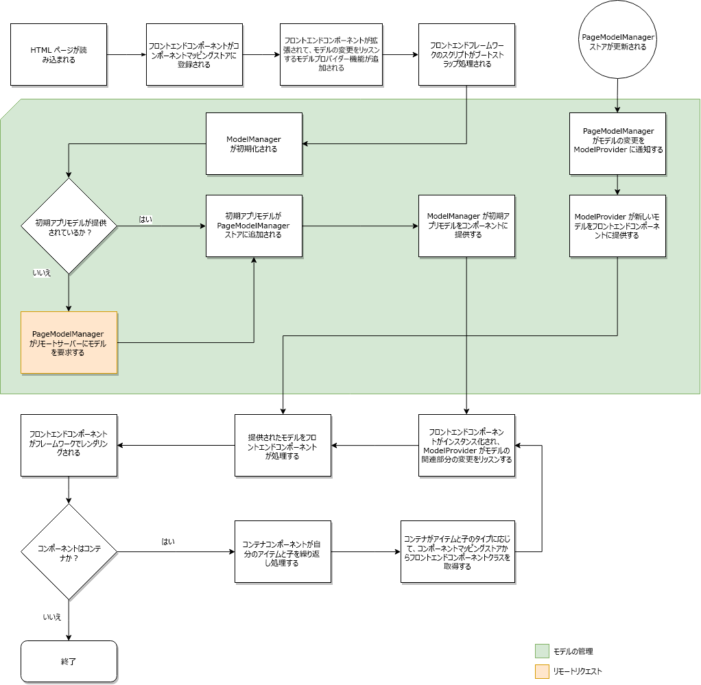

# SPAの動的モデルとコンポーネントのマッピング{#dynamic-model-to-component-mapping-for-spas}

このドキュメントでは、AEM用JavaScript SPA SDKで、動的モデルとコンポーネントとのマッピングがどのように行われるかを説明します。

>[!NOTE]
>
>SPAエディターは、SPAフレームワークベースのクライアント側レンダリング（ReactやAngularなど）を必要とするプロジェクトに推奨されるソリューションです。

## ComponentMapping モジュール {#componentmapping-module}

The `ComponentMapping` module is provided as an NPM package to the front-end project. フロントエンドコンポーネントが格納され、シングルページアプリケーションがフロントエンドコンポーネントをAEMリソースタイプにマップする方法を提供します。 これにより、アプリケーションのJSONモデルを解析する際に、コンポーネントの動的な解決が可能になります。

モデル内の各項目には、AEMリソースタイプを表示する `:type` フィールドが含まれます。 マウントすると、フロントエンドコンポーネントは、基になるライブラリから受け取ったモデルのフラグメントを使用して自分自身をレンダリングできます。

モデル解析とモデルへのフロントエンドコンポーネントアクセスの詳細については、 [SPA Blueprint](/help/sites-developing/spa-blueprint.md) ドキュメントを参照してください。

npmパッケージも参照してください。 [https://www.npmjs.com/package/@adobe/aem-spa-component-mapping](https://www.npmjs.com/package/@adobe/aem-spa-component-mapping)

## モデル駆動型シングルページアプリ {#model-driven-single-page-application}

AEM向けJavaScript SPA SDKを利用する単一ページアプリケーションは、モデル駆動です。

1. フロントエンドコンポーネントは、それ自体を [コンポーネントマッピングストアに登録します](/help/sites-developing/spa-dynamic-model-to-component-mapping.md#componentmapping-module)。
1. 次に、 [コンテナ](/help/sites-developing/spa-blueprint.md#container)、 [モデルプロバイダーがモデルを指定すると、そのモデルのコンテンツ](/help/sites-developing/spa-blueprint.md#the-model-provider)( `:items`)を繰り返し処理します。

1. ページの場合、その子( `:children`)は、最初に [コンポーネントマッピングからコンポーネントクラスを取得し、次にインスタンス化します](/help/sites-developing/spa-blueprint.md#componentmapping) 。

## アプリの初期化 {#app-initialization}

各コンポーネントは、の機能で拡張され [`ModelProvider`](/help/sites-developing/spa-blueprint.md#the-model-provider)ます。 初期化は、次の一般的な形式をとります。

1. 各モデルプロバイダは自身を初期化し、内部コンポーネントに対応するモデルの部分に対して行われた変更をリッスンします。
1. 初期化フローで示されるとおりに [ 初期化する `PageModelManager`](/help/sites-developing/spa-blueprint.md#pagemodelmanager) 必要があります 。

1. 保存すると、ページモデルマネージャーはアプリの完全なモデルを返します。
1. 次に、このモデルは、アプリケーションのフロントエンドルート [コンテナ](/help/sites-developing/spa-blueprint.md#container) ・コンポーネントに渡されます。
1. モデルの断片は、最後に個々の子コンポーネントに伝播されます。

