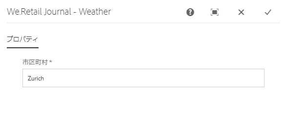
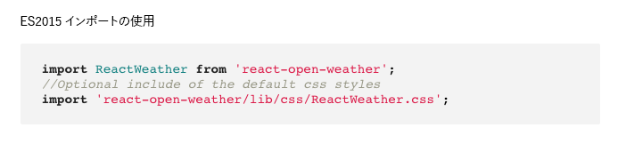
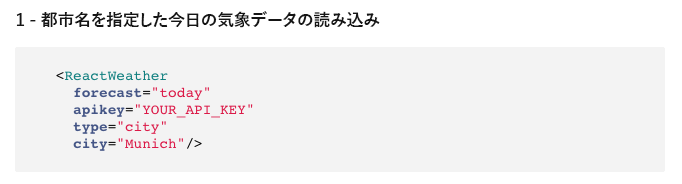

# SPA用のReactコンポーネントの実装{#implementing-a-react-component-for-spa}

単一ページアプリケーション（SPA）により、Web サイトのユーザーに魅力的なエクスペリエンスを提供することができます。開発者は SPA フレームワークを使用してサイトを構築したいと考え、作成者はそうして構築されたサイトのコンテンツを AEM 内でシームレスに編集したいと考えています。

SPA オーサリング機能には、AEM 内で SPA をサポートするための包括的なソリューションが用意されています。この記事では、シンプルで既存のReactコンポーネントをAEM SPA Editorと連携させる方法の例を紹介します。

>[!NOTE]
>
>SPAエディターは、SPAフレームワークベースのクライアント側レンダリング（ReactやAngularなど）を必要とするプロジェクトに推奨されるソリューションです。

## 概要 {#introduction}

AEMがSPAとSPAエディターの間で確立し、SPAとの間で構築するシンプルで軽量な契約のおかげで、既存のJavaScriptアプリケーションを取得し、AEMのSPAでの使用に適合させることは簡単なことです。

この記事では、We.RetailジャーナルサンプルSPAの天気コンポーネントの例を説明します。

この記事を読む前に、AEM用のSPAアプリケーションの [構造を理解しておく必要があります](/help/sites-developing/spa-getting-started-react.md) 。

>[!CAUTION]
>このドキュメントでは、 [We.Retailジャーナルアプリがデモ目的でのみ使用されます](https://github.com/Adobe-Marketing-Cloud/aem-sample-we-retail-journal) 。 どのプロジェクト作業にも使用しないでください。
>
>AEMプロジェクトでは、 [AEM Project Archetype](https://docs.adobe.com/content/help/ja-JP/experience-manager-core-components/using/developing/archetype/overview.html)（ReactまたはAngularを使用するSPAプロジェクトをサポートし、SPA SDKを利用する）を活用する必要があります。

## 気象コンポーネント {#the-weather-component}

気象コンポーネントは、We.Retailジャーナルアプリの左上にあります。 定義した場所の現在の天気が表示され、気象データが動的に引き出されます。

### Widgetの使用 {#using-the-weather-widget}


SPAエディタでSPAのコンテンツをオーサリングする場合、気象コンポーネントは他のAEMコンポーネントと同様に表示され、ツールバーと共に完成し、編集可能です。


他のAEMコンポーネントと同様に、ダイアログで都市を更新できます。



この変更は維持され、コンポーネントは新しい気象データで自動的に更新されます。


### 気象コンポーネントの実装 {#weather-component-implementation}

天気コンポーネントは、We.RetailジャーナルサンプルSPAアプリケーション内のコンポーネントとして機能するように適合した、 [React Open Weather](https://www.npmjs.com/package/react-open-weather)（オープンウェザーを反応させる）と呼ばれる、公開されたReactコンポーネントに基づいています。

以下は、React Open Weatherコンポーネントの使用に関するNPMドキュメントのスニペットです。



We.Retailジャーナルアプリケーションで、カスタマイズした天気コンポーネント( `Weather.js`)のコードを確認します。

* **16行目**:React Open Weatherウィジェットが必要に応じて読み込まれます。
* **46行目**:この `MapTo` 機能は、このReactコンポーネントを対応するAEMコンポーネントに関連付け、SPAエディタで編集できるようにします。

* **22～29行**:が定義さ `EditConfig` れ、市区町村が設定されているかどうかをチェックし、空の場合に値を定義します。

* **31 ～ 44行**:Weatherコンポーネントは、 `Component` クラスを拡張し、React Open WeatherコンポーネントのNPM使用ドキュメントで定義されている必要なデータを提供し、コンポーネントをレンダリングします。

```javascript
/*~~~~~~~~~~~~~~~~~~~~~~~~~~~~~~~~~~~~~~~~~~~~~~~~~~~~~~~~~~~~~~~~~~~~~~~~~~~~~~
 ~ Copyright 2018 Adobe Systems Incorporated
 ~
 ~ Licensed under the Apache License, Version 2.0 (the "License");
 ~ you may not use this file except in compliance with the License.
 ~ You may obtain a copy of the License at
 ~
 ~     https://www.apache.org/licenses/LICENSE-2.0
 ~
 ~ Unless required by applicable law or agreed to in writing, software
 ~ distributed under the License is distributed on an "AS IS" BASIS,
 ~ WITHOUT WARRANTIES OR CONDITIONS OF ANY KIND, either express or implied.
 ~ See the License for the specific language governing permissions and
 ~ limitations under the License.
 ~~~~~~~~~~~~~~~~~~~~~~~~~~~~~~~~~~~~~~~~~~~~~~~~~~~~~~~~~~~~~~~~~~~~~~~~~~~~~*/
import React, {Component} from 'react';
import ReactWeather from 'react-open-weather';
import {MapTo} from '@adobe/aem-react-editable-components';

require('./Weather.css');

const WeatherEditConfig = {

    emptyLabel: 'Weather',

    isEmpty: function() {
        return !this.props || !this.props.cq_model || !this.props.cq_model.city || this.props.cq_model.city.trim().length < 1;
    }
};

class Weather extends Component {

    render() {
        let apiKey = "12345678901234567890";
        let city;

        if (this.props.cq_model) {
            city = this.props.cq_model.city;
            return <ReactWeather key={'react-weather' + Date.now()} forecast="today" apikey={apiKey} type="city" city={city} />
        }

        return null;
    }
}

MapTo('we-retail-journal/global/components/weather')(Weather, WeatherEditConfig);
```

バックエンドコンポーネントは既に存在する必要がありますが、フロントエンド開発者は、Web.RetailジャーナルSPAのReact Open Weatherコンポーネントをほとんどコーディングせずに利用できます。

## 次のステップ {#next-step}

AEM向けSPAの開発について詳しくは、AEM用SPAの [開発を参照してください](/help/sites-developing/spa-architecture.md)。
